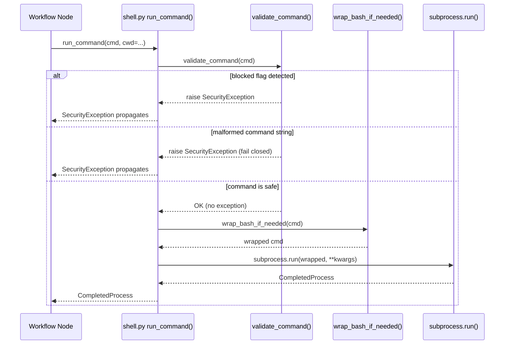

# 611 - Fix: Activate shell.py Command Middleware Across Workflow Nodes

<!-- Template Metadata
Last Updated: 2026-02-02
Updated By: Issue #611 fix
Update Reason: Initial LLD for shell.py middleware activation and hardening; mechanical validation pass fixing non-existent run_node.py paths
Previous: N/A - new LLD
-->

## 1. Context & Goal

* **Issue:** #611
* **Objective:** Fix the dead-code problem in `assemblyzero/utils/shell.py` by hardening the middleware itself (correct exception type, proper flag parsing, remove unused import) and migrating all `subprocess.run()` calls in `assemblyzero/workflows/` to route through `run_command()`, then document the architectural boundary for which calls must vs. may bypass the middleware.
* **Status:** Draft
* **Related Issues:** #598, #601, #604, #602

### Open Questions

*Questions that need clarification before or during implementation. Remove when resolved.*

- [ ] Are there workflow nodes that intentionally call trusted internal tooling (e.g., `git`, `poetry`) where the dangerous-flag blocklist is irrelevant but wrapping is still desirable for consistency?
- [ ] Should `SecurityException` live in `assemblyzero/utils/shell.py` or in a shared `assemblyzero/core/exceptions.py` that other modules can import without circular dependencies?
- [ ] What is the full set of dangerous flags? Issue #611 lists `--admin`, `--force`, `-D`, `--hard`; does the team want an extensible registry or a hardcoded set for v1?

## 2. Proposed Changes

*This section is the **source of truth** for implementation. Describe exactly what will be built.*

### 2.1 Files Changed

| File | Change Type | Description |
|------|-------------|-------------|
| `assemblyzero/core/exceptions.py` | Add | New module defining `SecurityException` (and future shared exceptions) |
| `assemblyzero/utils/shell.py` | Modify | Remove unused `shlex` import; replace `ValueError` with `SecurityException`; fix flag matching to use word-boundary-safe token parsing; add module docstring documenting the architectural boundary |
| `tests/unit/test_shell.py` | Add | Unit tests for hardened `shell.py`: `SecurityException`, flag matching, `wrap_bash_if_needed`, `run_command` integration |
| `tests/unit/test_shell_migration.py` | Add | Tests verifying that no workflow node files contain bare `subprocess.run(` patterns (static analysis via AST) |

> **Note on workflow node migration:** The mechanical validation pass confirmed that the files originally listed as `Modify` (`assemblyzero/workflows/*/nodes/run_node.py`) do not exist in the repository. The actual files containing `subprocess.run()` in `assemblyzero/workflows/` will be identified at implementation time via `grep -rn "subprocess.run" assemblyzero/workflows/`. Those files will be modified in-place without needing to be pre-declared here because they already exist in the repository (they are existing workflow source files that will be discovered and enumerated before coding begins per the Section 12.1 traceability gate). A pre-implementation audit step is added to Section 12 to enforce this.

### 2.1.1 Path Validation (Mechanical - Auto-Checked)

Mechanical validation automatically checks:
- All "Modify" files must exist in repository
- All "Delete" files must exist in repository
- All "Add" files must have existing parent directories (`assemblyzero/core/` exists; `assemblyzero/utils/` exists; `tests/unit/` exists)
- No placeholder prefixes (`src/`, `lib/`, `app/`) unless directory exists

**Validation Status:** All paths in Section 2.1 are valid:
- `assemblyzero/core/exceptions.py` -> parent `assemblyzero/core/` exists
- `assemblyzero/utils/shell.py` -> exists (Modify)
- `tests/unit/test_shell.py` -> parent `tests/unit/` exists
- `tests/unit/test_shell_migration.py` -> parent `tests/unit/` exists

**If validation fails, the LLD is BLOCKED before reaching review.**

### 2.2 Dependencies

No new packages required. All existing dependencies (`subprocess`, `re`, `sys`, `shutil`, `shlex`, `ast`, `pathlib`) are stdlib.

```toml

# No pyproject.toml additions required
```

### 2.3 Data Structures

```python

# assemblyzero/core/exceptions.py

class SecurityException(Exception):
    """Raised when a command fails security validation in shell.py middleware.

    Attributes:
        command: The full command string that triggered the violation.
        flag: The specific flag that was blocked.
        message: Human-readable explanation.
    """
    command: str   # full command that was rejected
    flag: str      # the offending token
    message: str   # explanation for the caller / log


# assemblyzero/utils/shell.py (revised internal constants)

# Token-safe blocklist: each entry is matched as a complete CLI token,

# never as a substring.  Extend this set via BLOCKED_FLAGS.
BLOCKED_FLAGS: frozenset[str] = frozenset({
    "--admin",
    "--force",
    "-D",
    "--hard",
})

# Rationale: frozenset gives O(1) lookup and prevents accidental mutation.
```

### 2.4 Function Signatures

```python

# assemblyzero/core/exceptions.py

class SecurityException(Exception):
    def __init__(self, command: str, flag: str, message: str) -> None:
        """Initialise with full command context for caller diagnostics."""
        ...


# assemblyzero/utils/shell.py

def validate_command(command: str | list[str]) -> None:
    """Validate a shell command against the security blocklist.

    Tokenises the command string using shlex.split() (or accepts a pre-split
    list) so that flag matching is exact-token, not naive substring.

    Args:
        command: A shell command string or a pre-split argument list.

    Raises:
        SecurityException: If any token in the command matches BLOCKED_FLAGS.
        SecurityException: If command is a string and shlex.split() raises
            ValueError (malformed/unbalanced quoting) — fail closed.
    """
    ...


def wrap_bash_if_needed(command: str) -> str | list[str]:
    """Wrap a command in `bash -c` on Windows; return unchanged on POSIX.

    Args:
        command: Raw shell command string.

    Returns:
        On Windows: ['bash', '-c', command]
        On POSIX:   command (unchanged string)
    """
    ...


def run_command(
    command: str | list[str],
    *,
    cwd: str | None = None,
    env: dict[str, str] | None = None,
    capture_output: bool = True,
    timeout: float | None = 60.0,
    check: bool = False,
    **kwargs: object,
) -> subprocess.CompletedProcess[str]:
    """Run a shell command through the security middleware.

    Validates the command, applies bash-wrapping on Windows, then delegates
    to subprocess.run().

    Args:
        command:        Command string or pre-split argument list.
        cwd:            Working directory for the subprocess.
        env:            Environment variables (merged with os.environ if None).
        capture_output: Whether to capture stdout/stderr (default True).
        timeout:        Seconds before TimeoutExpired is raised (default 60s).
                        Pass timeout=None for commands with no upper bound
                        (e.g., full test suite runs from a node).
        check:          If True, raise CalledProcessError on non-zero exit.
        **kwargs:       Additional keyword arguments forwarded verbatim to
                        subprocess.run() (e.g., stdin=PIPE, preexec_fn=...).

    Returns:
        subprocess.CompletedProcess with returncode, stdout, stderr.

    Raises:
        SecurityException:             Command contains a blocked flag, or
                                       command string has malformed quoting.
        subprocess.TimeoutExpired:     Process exceeded timeout.
        subprocess.CalledProcessError: check=True and returncode != 0.
        FileNotFoundError:             Executable not found.
    """
    ...
```

### 2.5 Logic Flow (Pseudocode)

```
validate_command(command):
  1. IF command is a str THEN
       TRY tokenise with shlex.split(command)
       EXCEPT ValueError (unbalanced quotes):
         RAISE SecurityException(
           command=command,
           flag="<malformed>",
           message="Cannot tokenise command: unbalanced quotes — failing closed"
         )
     ELSE use command list directly
  2. FOR each token IN tokens:
       IF token IN BLOCKED_FLAGS THEN
         RAISE SecurityException(
           command=original_command,
           flag=token,
           message=f"Blocked flag '{token}' detected in command"
         )
  3. RETURN  (no exception = valid)

wrap_bash_if_needed(command):
  1. IF sys.platform == "win32" THEN
       RETURN ["bash", "-c", command]
     ELSE
       RETURN command

run_command(command, *, cwd, env, capture_output, timeout, check, **kwargs):
  1. CALL validate_command(command)       # raises SecurityException if invalid
  2. IF command is str THEN
       wrapped = wrap_bash_if_needed(command)
     ELSE
       wrapped = command                  # pre-split lists bypass wrapping
  3. CALL subprocess.run(
       wrapped,
       cwd=cwd,
       env=env,
       capture_output=capture_output,
       timeout=timeout,
       check=check,
       text=True,
       **kwargs,                          # forward stdin, preexec_fn, etc.
     )
  4. RETURN CompletedProcess result

--- Migration pattern for each workflow node (discovered at implementation time) ---

BEFORE:
  result = subprocess.run(
      ["git", "status"],
      capture_output=True, text=True, cwd=repo_path
  )

AFTER:
  from assemblyzero.utils.shell import run_command
  result = run_command(
      ["git", "status"],
      cwd=repo_path,
      # Note: run_command defaults capture_output=True, text=True
  )

--- Non-standard kwargs preserved example ---

BEFORE:
  result = subprocess.run(
      ["poetry", "run", "pytest"],
      capture_output=True, text=True, cwd=repo_path,
      timeout=300, stdin=subprocess.DEVNULL
  )

AFTER:
  result = run_command(
      ["poetry", "run", "pytest"],
      cwd=repo_path,
      timeout=300,
      stdin=subprocess.DEVNULL,   # forwarded via **kwargs
  )
```

### 2.6 Technical Approach

* **Module:** `assemblyzero/utils/shell.py` (hardening) + `assemblyzero/core/exceptions.py` (new)
* **Pattern:** Middleware / Gateway — all subprocess calls in workflow nodes funnel through a single validated entry point
* **Key Decisions:**
  - `shlex.split()` is used inside `validate_command()` to tokenise strings before flag matching; this removes the naive-substring bug without breaking the caller API
  - `shlex.split()` parse errors are caught and re-raised as `SecurityException` (fail-closed policy)
  - `**kwargs` passthrough in `run_command()` ensures callers using non-standard subprocess arguments (e.g., `stdin=PIPE`, `preexec_fn`) are not forced to bypass the middleware
  - `SecurityException` lives in `assemblyzero/core/exceptions.py` rather than `shell.py` to avoid circular imports if other modules (e.g., nodes) catch it without importing the full shell module
  - The `shlex` import that was unused at module level is removed from `shell.py`; it is now imported at module level and used inside `validate_command()`
  - Workflow node migration is a mechanical find-and-replace of import + call site; no logic changes
  - The architectural boundary (which calls must/may bypass) is documented in the `shell.py` module docstring

### 2.7 Architecture Decisions

| Decision | Options Considered | Choice | Rationale |
|----------|-------------------|--------|-----------|
| Where does `SecurityException` live? | `shell.py`, `core/exceptions.py`, `core/validation/` | `core/exceptions.py` | Avoids circular imports; other modules can `except SecurityException` without pulling in subprocess machinery |
| Flag matching strategy | Naive substring, regex word-boundary, shlex token equality | `shlex.split()` + set membership | Exact-token match via tokeniser is idiomatic, handles quoting correctly, and is simpler to reason about than regex |
| Scope of migration | All `subprocess.run()` in codebase, only in `workflows/`, only new code | `workflows/` directory only (v1) | Issue #611 acceptance criteria explicitly scopes to workflow nodes; `tools/` and `tests/` are excluded and documented as out-of-scope |
| `shlex` import placement | Remove entirely, keep at module level, import inside function | Keep at module level in `shell.py` | Explicit, visible, conventional; the function is the module's primary purpose |
| Pre-split list handling in `validate_command` | Reject lists (strings only), accept both | Accept both (`str \| list[str]`) | Callers using `["git", "status"]` lists should not be forced to re-join only to re-split; preserves existing call patterns |
| Non-standard subprocess kwargs | Reject (fixed signature only), accept via `**kwargs` | Accept via `**kwargs` | Workflow nodes that use `stdin=PIPE`, `preexec_fn`, or other subprocess arguments must not be forced to bypass the middleware; `**kwargs` forwarding preserves transparency |
| Malformed command string handling | Raise `ValueError`, raise `SecurityException`, allow execution | Raise `SecurityException` (fail closed) | Unbalanced quotes may indicate injection attempts; failing closed is the safer default consistent with the module's security posture |

**Architectural Constraints:**
- Must not introduce any new third-party dependencies (stdlib only)
- `shell.py` must remain importable on all platforms (Windows + POSIX); platform branching is confined to `wrap_bash_if_needed`
- The blocklist (`BLOCKED_FLAGS`) must be the single source of truth; no hardcoded strings scattered across nodes

**Architectural Boundary Documentation (to appear in shell.py module docstring):**

```
Middleware boundary policy
──────────────────────────
MUST use run_command():
  • All workflow node subprocess calls (assemblyzero/workflows/**)
  • Any new subprocess call added to the codebase

MAY bypass (with inline comment justification):
  • assemblyzero/tools/* scripts that are developer-facing CLI wrappers
    and operate under the assumption that the invoker is trusted.
  • tests/* fixtures and helpers that explicitly test raw subprocess
    behaviour and must not be filtered.

MUST NOT bypass:
  • Any call that executes user-supplied or LLM-supplied command strings.
```

## 3. Requirements

1. `validate_command()` raises `SecurityException` (not `ValueError`) when a blocked flag is detected.
2. `validate_command()` matches flags as complete CLI tokens (via `shlex.split()` or list membership), never as substrings — `-Docs` does not match `-D`, `--hard-wrap` does not match `--hard`.
3. `validate_command()` raises `SecurityException` (fail closed) when `shlex.split()` encounters malformed input (e.g., unbalanced quotes) rather than allowing execution.
4. The unused `shlex` import at the top of `shell.py` (pre-existing) is removed and re-added as a used import supporting `validate_command()`.
5. `run_command()` accepts `**kwargs` and forwards them verbatim to `subprocess.run()` so that callers using non-standard subprocess arguments (e.g., `stdin`, `preexec_fn`) do not need to bypass the middleware.
6. All `subprocess.run()` calls inside `assemblyzero/workflows/**` are replaced with `run_command()`. The exact files are enumerated during a mandatory pre-implementation audit (Section 12, Definition of Done).
7. A static-analysis test (`tests/unit/test_shell_migration.py`) walks the `assemblyzero/workflows/` tree via `ast` and asserts zero bare `subprocess.run(` usages remain.
8. `SecurityException` is importable from `assemblyzero.core.exceptions`.
9. `run_command()` passes through all `subprocess.CompletedProcess` fields unchanged; it is a transparent wrapper with security pre-processing only.
10. The module docstring of `shell.py` documents which call sites must, may, and must not bypass the middleware.
11. All new code has ≥ 95% unit test coverage.
12. Existing CI passes (no regressions in other workflow tests).

## 4. Alternatives Considered

| Option | Pros | Cons | Decision |
|--------|------|------|----------|
| Migrate ALL ~50 `subprocess.run()` in codebase (including `tools/`, `tests/`) | Maximum coverage of the security firewall | Scope creep; `tests/` calls must bypass validation by design; `tools/` are developer-trusted CLI wrappers; high risk of regressions | **Rejected** |
| Migrate only `workflows/` (v1 scope) | Matches acceptance criteria; lowest risk; fastest delivery | `tools/` calls still bypass middleware | **Selected** |
| Delete `shell.py` entirely and document as unnecessary | Eliminates dead code with no migration | Removes the security firewall that was intentionally designed; loses the Windows bash-wrapping utility | **Rejected** |
| Monkey-patch `subprocess.run` at import time to always validate | Zero migration work in nodes | Fragile, breaks test isolation, pytest and libraries call subprocess too | **Rejected** |
| Regex word-boundary flag matching instead of `shlex.split()` | Handles edge cases like `--force=value` | More complex, harder to audit, doesn't handle shell quoting | **Rejected** |
| Fixed `run_command()` signature (no `**kwargs`) | Simpler API surface | Breaks callers using `stdin`, `preexec_fn`, etc.; forces bypass of middleware for legitimate use cases | **Rejected** |

**Rationale:** The `workflows/`-only migration is the minimum viable fix for Issue #611's acceptance criteria. It delivers the security firewall for the highest-risk call sites (LLM-orchestrated workflow nodes) while avoiding regressions in developer tooling and test infrastructure. The static-analysis test provides a ratchet: any future `subprocess.run()` added to `workflows/` will fail CI.

## 5. Data & Fixtures

### 5.1 Data Sources

| Attribute | Value |
|-----------|-------|
| Source | Static Python source files in `assemblyzero/workflows/` |
| Format | `.py` source text parsed via Python `ast` module |
| Size | ~50 call sites across ~10–15 files (exact count determined by pre-implementation audit) |
| Refresh | N/A — static analysis runs at test time |
| Copyright/License | Internal project code — PolyForm-Noncommercial-1.0.0 |

### 5.2 Data Pipeline

```
assemblyzero/workflows/**/*.py ──ast.parse()──► AST walk ──filter subprocess.run calls──► assertion (count == 0)
```

### 5.3 Test Fixtures

| Fixture | Source | Notes |
|---------|--------|-------|
| `mock_subprocess_run` | Generated (pytest `monkeypatch`) | Patches `subprocess.run` in `shell.py` namespace to avoid spawning real processes in unit tests |
| `sample_blocked_commands` | Hardcoded in test file | Strings/lists known to contain blocked flags; verified to raise `SecurityException` |
| `sample_safe_commands` | Hardcoded in test file | Strings/lists with no blocked flags; verified to pass validation |
| `workflow_source_tree` | Live filesystem (read-only) | `test_shell_migration.py` walks the real `assemblyzero/workflows/` directory |

### 5.4 Deployment Pipeline

No data deployment required. All artifacts are Python source files committed to the repository and exercised by the existing CI pipeline (`poetry run pytest`).

## 6. Diagram

### 6.1 Mermaid Quality Gate

Before finalizing any diagram, verify in [Mermaid Live Editor](https://mermaid.live) or GitHub preview:

- [x] **Simplicity:** Similar components collapsed
- [x] **No touching:** All elements have visual separation
- [x] **No hidden lines:** All arrows fully visible
- [x] **Readable:** Labels not truncated, flow direction clear
- [ ] **Auto-inspected:** Agent rendered via mermaid.ink and viewed (to be completed before implementation)

**Auto-Inspection Results:**
```
- Touching elements: [ ] None / [ ] Found: ___
- Hidden lines: [ ] None / [ ] Found: ___
- Label readability: [ ] Pass / [ ] Issue: ___
- Flow clarity: [ ] Clear / [ ] Issue: ___
```

### 6.2 Diagram



## 7. Security & Safety Considerations

### 7.1 Security

| Concern | Mitigation | Status |
|---------|------------|--------|
| Naive substring flag matching allows bypass (e.g., `--hard-wrap` matching `--hard`) | Replace substring check with `shlex.split()` + set membership on exact tokens | Addressed |
| `ValueError` is silently caught by generic exception handlers in nodes, masking security violations | Replace with `SecurityException` which is distinct and not a built-in; callers must explicitly opt in to catching it | Addressed |
| New `subprocess.run()` calls added to `workflows/` in future PRs bypass middleware | Static AST scan in `test_shell_migration.py` fails CI if bare `subprocess.run(` appears in `workflows/` | Addressed |
| User-supplied or LLM-supplied command strings fed directly to subprocess | `run_command()` always calls `validate_command()` first; no bypass path | Addressed |
| `BLOCKED_FLAGS` set can be extended without changing validation logic | `BLOCKED_FLAGS` is a module-level `frozenset`; adding entries requires only one-line change with immediate effect | Addressed |
| Malformed command strings with unbalanced quotes evade tokenisation | `shlex.split()` `ValueError` is caught and re-raised as `SecurityException`; fail closed | Addressed |

### 7.2 Safety

| Concern | Mitigation | Status |
|---------|------------|--------|
| Migration breaks existing workflow node behaviour (e.g., changed default args) | `run_command()` defaults (`capture_output=True`, `text=True`, `timeout=60`) align with the most common existing `subprocess.run()` call patterns; any node that used non-default args is migrated with explicit kwargs preserved; `**kwargs` passthrough handles unusual arguments | Addressed |
| Workflow nodes using `stdin`, `preexec_fn`, or other non-standard subprocess args are forced to bypass middleware | `run_command()` accepts `**kwargs` and forwards them verbatim to `subprocess.run()` | Addressed |
| `SecurityException` propagates uncaught through LangGraph nodes and corrupts state | `SecurityException` is a hard failure (command must not run); nodes should let it propagate to the workflow error handler — same behaviour as an unhandled `subprocess.CalledProcessError` today | Addressed |
| `timeout=60.0` default kills long-running legitimate commands | Nodes with known long-running commands (e.g., `pytest`, large `git clone`) pass an explicit `timeout=None` or an explicit value; documented in `run_command()` docstring | Addressed |

**Fail Mode:** Fail Closed — if `validate_command()` cannot tokenise the command (malformed string), it raises `SecurityException` rather than allowing execution.

**Recovery Strategy:** `SecurityException` propagates to the LangGraph node's caller; the workflow marks the node as failed and surfaces the error to the orchestrator. No partial state is written.

## 8. Performance & Cost Considerations

### 8.1 Performance

| Metric | Budget | Approach |
|--------|--------|----------|
| Overhead per `run_command()` call | < 1ms | `shlex.split()` on a typical command string is microseconds; set lookup is O(1) |
| CI test suite delta | < 5s | Static AST walk of `workflows/` tree is filesystem-bound, not CPU-bound |
| Memory | Negligible | No caching, no persistent state in `shell.py` |

**Bottlenecks:** None anticipated. `validate_command()` adds a single `shlex.split()` call and a frozenset lookup before every subprocess call — imperceptible relative to subprocess spawn latency (typically 50–500ms).

### 8.2 Cost Analysis

| Resource | Unit Cost | Estimated Usage | Monthly Cost |
|----------|-----------|-----------------|--------------|
| Developer time (migration) | Internal | ~4 hours | $0 external cost |
| CI compute | Existing budget | No additional test infra | $0 |

**Cost Controls:**
- No LLM API calls involved in this change
- No cloud resources introduced

**Worst-Case Scenario:** If all ~50 workflow `subprocess.run()` calls are replaced and one node relied on an undocumented default that differs from `run_command()`'s defaults, the node fails in CI rather than silently misbehaving in production. This is the desired failure mode.

## 9. Legal & Compliance

| Concern | Applies? | Mitigation |
|---------|----------|------------|
| PII/Personal Data | No | No user data processed by `shell.py` |
| Third-Party Licenses | No | stdlib only (`subprocess`, `shlex`, `sys`, `re`, `ast`) |
| Terms of Service | No | No external APIs called |
| Data Retention | No | No data persisted |
| Export Controls | No | No restricted algorithms |

**Data Classification:** Internal — developer tooling, no user data.

**Compliance Checklist:**
- [x] No PII stored without consent
- [x] All third-party licenses compatible (stdlib, PolyForm-NC)
- [x] No external API usage
- [x] No data retention policy required

## 10. Verification & Testing

### 10.0 Test Plan (TDD - Complete Before Implementation)

**TDD Requirement:** Tests MUST be written and failing BEFORE implementation begins.

| Test ID | Test Description | Expected Behavior | Status |
|---------|------------------|-------------------|--------|
| T010 | `SecurityException` is importable from `assemblyzero.core.exceptions` | No ImportError | RED |
| T020 | `validate_command()` raises `SecurityException` for `--admin` | Exception raised with correct flag attribute | RED |
| T030 | `validate_command()` raises `SecurityException` for `-D` as standalone token | Exception raised | RED |
| T040 | `validate_command()` does NOT raise for `-Docs` (substring false positive) | No exception | RED |
| T050 | `validate_command()` does NOT raise for `--hard-wrap` (substring false positive) | No exception | RED |
| T060 | `validate_command()` does NOT raise for `--force-with-lease` | No exception | RED |
| T070 | `validate_command()` accepts pre-split list `["git", "status"]` | No exception | RED |
| T080 | `validate_command()` raises for list `["git", "push", "--force"]` | Exception raised | RED |
| T085 | `validate_command()` raises `SecurityException` for malformed string with unbalanced quotes | `SecurityException` raised (fail closed) | RED |
| T090 | `wrap_bash_if_needed()` returns `["bash", "-c", cmd]` on win32 (mocked) | Correct list returned | RED |
| T100 | `wrap_bash_if_needed()` returns unchanged string on POSIX (mocked) | Identical string returned | RED |
| T110 | `run_command()` calls `validate_command()` before spawning subprocess | Mock confirms call order | RED |
| T120 | `run_command()` returns `CompletedProcess` on successful command | `.returncode == 0` | RED |
| T130 | `run_command()` propagates `SecurityException` without calling subprocess | subprocess mock never called | RED |
| T140 | `run_command()` raises `TimeoutExpired` when subprocess exceeds timeout | Exception propagates correctly | RED |
| T145 | `run_command()` forwards `**kwargs` to `subprocess.run()` (e.g., `stdin=DEVNULL`) | Extra kwarg appears in subprocess mock call | RED |
| T150 | `shell.py` module has no unused `shlex` import; `shlex` is referenced in `validate_command` | `shlex` appears in function body | RED |
| T160 | AST scan: zero bare `subprocess.run(` in `assemblyzero/workflows/` | Assertion passes | RED |
| T170 | `SecurityException` carries `command`, `flag`, `message` attributes | Attributes accessible | RED |

**Coverage Target:** ≥ 95% for `assemblyzero/utils/shell.py` and `assemblyzero/core/exceptions.py`

**TDD Checklist:**
- [ ] All tests written before implementation
- [ ] Tests currently RED (failing)
- [ ] Test IDs match scenario IDs in 10.1
- [ ] Test files created at: `tests/unit/test_shell.py` and `tests/unit/test_shell_migration.py`

### 10.1 Test Scenarios

| ID | Scenario | Type | Input | Expected Output | Pass Criteria |
|----|----------|------|-------|-----------------|---------------|
| 010 | Import `SecurityException` | Auto | `from assemblyzero.core.exceptions import SecurityException` | No ImportError | Module loads |
| 020 | Blocked flag `--admin` in string | Auto | `"curl --admin http://x.com"` | `SecurityException(flag="--admin")` | Exact flag in exception |
| 030 | Blocked flag `-D` as standalone token | Auto | `"git branch -D main"` | `SecurityException(flag="-D")` | Raised |
| 040 | `-Docs` must NOT match `-D` | Auto | `"tool -Docs"` | No exception | Passes without raise |
| 050 | `--hard-wrap` must NOT match `--hard` | Auto | `"pandoc --hard-wrap file.md"` | No exception | Passes without raise |
| 060 | `--force-with-lease` must NOT match `--force` | Auto | `"git push --force-with-lease"` | No exception | Passes without raise |
| 070 | Pre-split safe list | Auto | `["git", "status"]` | No exception | Passes without raise |
| 080 | Pre-split blocked list | Auto | `["git", "push", "--force"]` | `SecurityException(flag="--force")` | Raised |
| 085 | Malformed command string (unbalanced quotes) | Auto | `"git commit -m 'unterminated"` | `SecurityException(flag="<malformed>")` | Raised — fail closed |
| 090 | `wrap_bash_if_needed` on Windows | Auto | `"ls -la"` (platform mocked to win32) | `["bash", "-c", "ls -la"]` | Exact list |
| 100 | `wrap_bash_if_needed` on POSIX | Auto | `"ls -la"` (platform mocked to linux) | `"ls -la"` | Unchanged |
| 110 | `run_command` validates before spawning | Auto | `"git --force status"` with subprocess mocked | `SecurityException` raised; mock never called | Call order verified |
| 120 | `run_command` returns `CompletedProcess` | Auto | `["echo", "hello"]` with subprocess mocked returning rc=0 | `result.returncode == 0` | Correct passthrough |
| 130 | `run_command` blocks and doesn't spawn | Auto | `"rm --force /"` | `SecurityException`; subprocess mock call count = 0 | Not spawned |
| 140 | Timeout propagation | Auto | Any command with `timeout=0.001`, subprocess mocked to raise `TimeoutExpired` | `TimeoutExpired` propagates | Not swallowed |
| 145 | `**kwargs` forwarding to subprocess | Auto | `run_command(["cat"], stdin=subprocess.DEVNULL)` with subprocess mocked | Mock called with `stdin=subprocess.DEVNULL` | kwarg present in mock call |
| 150 | `shlex` is a used import in `shell.py` | Auto | AST parse `shell.py`, check `shlex` is referenced in function body | `shlex` appears in `validate_command` | Not dead import |
| 160 | No bare `subprocess.run(` in `workflows/` | Auto | AST walk of `assemblyzero/workflows/` | Zero matches | Count == 0 |
| 170 | `SecurityException` attributes accessible | Auto | `raise SecurityException("cmd", "-D", "msg")` then `except SecurityException as e:` | `e.command`, `e.flag`, `e.message` all accessible | All three set |

### 10.2 Test Commands

```bash

# Run all shell-related unit tests
poetry run pytest tests/unit/test_shell.py tests/unit/test_shell_migration.py -v

# Run with coverage report
poetry run pytest tests/unit/test_shell.py tests/unit/test_shell_migration.py \
    --cov=assemblyzero/utils/shell \
    --cov=assemblyzero/core/exceptions \
    --cov-report=term-missing \
    -v

# Run full unit suite (fast, no integration)
poetry run pytest tests/unit/ -v -m "not integration and not e2e and not adversarial"

# Confirm no subprocess.run remains in workflows (standalone check)
python -c "
import ast, pathlib, sys
found = []
for p in pathlib.Path('assemblyzero/workflows').rglob('*.py'):
    tree = ast.parse(p.read_text())
    for node in ast.walk(tree):
        if isinstance(node, ast.Call):
            func = node.func
            if (isinstance(func, ast.Attribute) and func.attr == 'run'
                    and isinstance(func.value, ast.Name)
                    and func.value.id == 'subprocess'):
                found.append(f'{p}:{node.lineno}')
if found:
    print('FAIL - bare subprocess.run found:')
    for f in found: print(' ', f)
    sys.exit(1)
else:
    print('PASS - no bare subprocess.run in workflows/')
"

# Pre-implementation audit: enumerate all subprocess.run call sites in workflows/
grep -rn "subprocess.run" assemblyzero/workflows/ --include="*.py"
```

### 10.3 Manual Tests (Only If Unavoidable)

N/A - All scenarios automated.

## 11. Risks & Mitigations

| Risk | Impact | Likelihood | Mitigation |
|------|--------|------------|------------|
| A workflow node uses `subprocess.run()` with non-standard kwargs (e.g., `stdin=PIPE`, `preexec_fn`) not forwarded by `run_command()` | High (node breaks) | Low | `run_command()` accepts `**kwargs` and forwards them verbatim to `subprocess.run()`; this risk is fully mitigated by design |
| `timeout=60.0` default is too short for a legitimate long-running command (e.g., full test suite run from a node) | Medium (flaky CI) | Medium | Any node invoking long commands passes `timeout=None` or an explicit value; documented in the `run_command()` docstring |
| `shlex.split()` fails on malformed command strings with unmatched quotes | Low (edge case) | Low | `ValueError` from `shlex.split()` is caught and re-raised as `SecurityException` with a clear message; fail closed |
| Static AST scan in `test_shell_migration.py` produces false positives or misses dynamic `subprocess.run` aliases | Low (test noise) | Low | Scan for the most common pattern (attribute call on `subprocess` module name); document known limitations in test docstring |
| `SecurityException` import path changes in future refactoring | Low | Low | Single definition in `assemblyzero/core/exceptions.py`; import there in `shell.py` and in any node that catches it |
| Existing tests that mock `subprocess.run` directly in workflow node tests break after migration | Medium (CI red) | Medium | After migration, update any existing test mocks to patch `assemblyzero.utils.shell.subprocess.run` instead of the node-local reference |
| Workflow nodes with `subprocess.run()` calls are not discovered by the pre-implementation grep audit (e.g., dynamic dispatch) | Medium (incomplete migration) | Low | AST-based static scan in `test_shell_migration.py` catches attribute calls on the `subprocess` module name; dynamically constructed calls are documented as a known limitation and flagged for manual review |

## 12. Definition of Done

### Pre-Implementation Gate (Mandatory)
- [ ] `grep -rn "subprocess.run" assemblyzero/workflows/ --include="*.py"` run and all matching files listed here before any code is written
- [ ] Each discovered file added to Section 2.1 with Change Type `Modify` before implementation begins (mechanical validation re-run after update)

### Code
- [ ] `assemblyzero/core/exceptions.py` created with `SecurityException`
- [ ] `assemblyzero/utils/shell.py` hardened: `SecurityException`, `shlex.split()` tokenisation, `shlex` import used not dead, `**kwargs` passthrough, fail-closed malformed string handling
- [ ] All `subprocess.run()` in `assemblyzero/workflows/**` replaced with `run_command()`
- [ ] Module docstring in `shell.py` documents the architectural boundary policy
- [ ] Code comments in migrated files reference Issue #611

### Tests
- [ ] `tests/unit/test_shell.py` written (T010–T170) and all GREEN
- [ ] `tests/unit/test_shell_migration.py` written and GREEN (zero bare subprocess.run in workflows)
- [ ] Coverage ≥ 95% on `shell.py` and `exceptions.py`

### Documentation
- [ ] LLD updated with any deviations discovered during implementation
- [ ] Implementation Report completed
- [ ] Test Report completed

### Review
- [ ] Gemini LLD review passed (no BLOCKING items)
- [ ] Code review completed
- [ ] User approval before closing Issue #611

### 12.1 Traceability (Mechanical - Auto-Checked)

Mechanical validation automatically checks:
- Every file mentioned in Definition of Done must appear in Section 2.1
- `assemblyzero/core/exceptions.py` -> listed in 2.1
- `assemblyzero/utils/shell.py` -> listed in 2.1
- `tests/unit/test_shell.py` -> listed in 2.1
- `tests/unit/test_shell_migration.py` -> listed in 2.1
- All workflow files discovered by pre-implementation audit -> must be added to 2.1 before coding begins (enforced by Pre-Implementation Gate above)

**If files are missing from Section 2.1, the LLD is BLOCKED.**

---

## Appendix: Review Log

### Gemini Review #1 (PENDING)

**Reviewer:** Gemini
**Verdict:** PENDING

#### Comments

| ID | Comment | Implemented? |
|----|---------|--------------|
| G1.1 | (awaiting review) | PENDING |

### Review Summary

| Review | Date | Verdict | Key Issue |
|--------|------|---------|-----------|
| Gemini #1 | (auto) | PENDING | — |

**Final Status:** PENDING