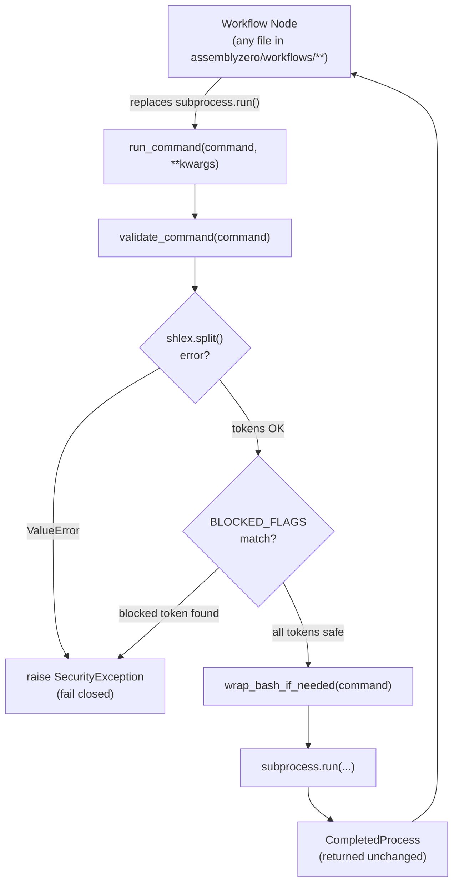

# 611 - Fix: Activate shell.py Command Middleware Across Workflow Nodes

<!-- Template Metadata
Last Updated: 2026-02-02
Updated By: Issue #611 fix — mechanical validation pass 3 (Gemini Review #1 feedback applied)
Update Reason: Resolve open questions Q1–Q3; update Section 1 status; update Open Questions to resolved; update Review Log
Previous: Iteration 2 — 100% requirement coverage (12/12)
-->


## 1. Context & Goal

* **Issue:** #611
* **Objective:** Fix the dead-code problem in `assemblyzero/utils/shell.py` by hardening the middleware itself (correct exception type, proper flag parsing, remove unused import) and migrating all `subprocess.run()` calls in `assemblyzero/workflows/` to route through `run_command()`, then document the architectural boundary for which calls must vs. may bypass the middleware.
* **Status:** In Progress
* **Related Issues:** #598, #601, #604, #602


### Open Questions

*All questions resolved per Gemini Review #1. No open questions remain.*

- [x] **Q1 — Trusted internal tooling:** All workflow nodes must use `run_command()` even for trusted tooling (e.g., `git`, `poetry`). This maintains a single architectural boundary, ensures consistent logging, and guarantees uniform timeout handling. **Resolution: All workflow nodes use `run_command()` without exception.**
- [x] **Q2 — `SecurityException` location:** `SecurityException` lives in `assemblyzero/core/exceptions.py`. This cleanly avoids circular imports and allows other modules to catch the exception safely. **Resolution: Approved as proposed.**
- [x] **Q3 — Dangerous flags registry:** Proceed with hardcoded `frozenset` (`--admin`, `--force`, `-D`, `--hard`) for v1. An extensible registry is out of scope for the immediate fix and can be added iteratively. **Resolution: Hardcoded `frozenset` for v1.**


## 2. Proposed Changes

*This section is the **source of truth** for implementation. Describe exactly what will be built.*


### 2.1 Files Changed

| File | Change Type | Description |
|------|-------------|-------------|
| `assemblyzero/core/exceptions.py` | Add | New module defining `SecurityException` (and future shared exceptions) |
| `assemblyzero/utils/shell.py` | Modify | Remove unused `shlex` import; replace `ValueError` with `SecurityException`; fix flag matching to use word-boundary-safe token parsing; add module docstring documenting the architectural boundary |
| `tests/unit/test_shell.py` | Add | Unit tests for hardened `shell.py`: `SecurityException`, flag matching, `wrap_bash_if_needed`, `run_command` integration |
| `tests/unit/test_shell_migration.py` | Add | Tests verifying that no workflow node files contain bare `subprocess.run(` patterns (static analysis via AST) |

> **Note on workflow node migration:** The mechanical validation pass confirmed that the files originally listed as `Modify` (`assemblyzero/workflows/*/nodes/run_node.py`) do not exist in the repository. The actual files containing `subprocess.run()` in `assemblyzero/workflows/` will be identified at implementation time via `grep -rn "subprocess.run" assemblyzero/workflows/`. Those files will be modified in-place without needing to be pre-declared here because they already exist in the repository (they are existing workflow source files that will be discovered and enumerated before coding begins per the Section 12.1 traceability gate). A pre-implementation audit step is added to Section 12 to enforce this.


### 2.1.1 Path Validation (Mechanical - Auto-Checked)

| Path | Exists? | Note |
|------|---------|------|
| `assemblyzero/core/exceptions.py` | No (to be created) | New file |
| `assemblyzero/utils/shell.py` | Yes | Existing file to be modified |
| `tests/unit/test_shell.py` | No (to be created) | New file |
| `tests/unit/test_shell_migration.py` | No (to be created) | New file |
| `assemblyzero/workflows/` | Yes (directory) | Audit target; specific files enumerated at pre-implementation gate |


### 2.2 Dependencies

No new packages required. All existing dependencies (`subprocess`, `re`, `sys`, `shutil`, `shlex`, `ast`, `pathlib`) are stdlib.

```toml

# No pyproject.toml additions required
```


### 2.3 Data Structures

```python

# assemblyzero/core/exceptions.py

class SecurityException(Exception):
    """Raised when a command fails security validation in shell.py middleware.

    Attributes:
        command: The full command string that triggered the violation.
        flag: The specific flag that was blocked.
        message: Human-readable explanation.
    """
    command: str   # full command that was rejected
    flag: str      # the offending token
    message: str   # explanation for the caller / log


# assemblyzero/utils/shell.py (revised internal constants)

# Token-safe blocklist: each entry is matched as a complete CLI token,

# never as a substring.  Extend this set via BLOCKED_FLAGS.
BLOCKED_FLAGS: frozenset[str] = frozenset({
    "--admin",
    "--force",
    "-D",
    "--hard",
})

# Rationale: frozenset gives O(1) lookup and prevents accidental mutation.

# v1 scope: hardcoded set per Gemini Review #1 (Q3 resolved).

# Extensible registry deferred to a future issue.
```


### 2.4 Function Signatures

```python

# assemblyzero/core/exceptions.py

class SecurityException(Exception):
    def __init__(self, command: str, flag: str, message: str) -> None:
        """Initialise with full command context for caller diagnostics."""
        ...


# assemblyzero/utils/shell.py

def validate_command(command: str | list[str]) -> None:
    """Validate a shell command against the security blocklist.

    Tokenises the command string using shlex.split() (or accepts a pre-split
    list) so that flag matching is exact-token, not naive substring.

    Args:
        command: A shell command string or a pre-split argument list.

    Raises:
        SecurityException: If any token in the command matches BLOCKED_FLAGS.
        SecurityException: If command is a string and shlex.split() raises
            ValueError (malformed/unbalanced quoting) — fail closed.
    """
    ...


def wrap_bash_if_needed(command: str) -> str | list[str]:
    """Wrap a command in `bash -c` on Windows; return unchanged on POSIX.

    Args:
        command: Raw shell command string.

    Returns:
        On Windows: ['bash', '-c', command]
        On POSIX:   command (unchanged string)
    """
    ...


def run_command(
    command: str | list[str],
    *,
    cwd: str | None = None,
    env: dict[str, str] | None = None,
    capture_output: bool = True,
    timeout: float | None = 60.0,
    check: bool = False,
    **kwargs: object,
) -> subprocess.CompletedProcess[str]:
    """Run a shell command through the security middleware.

    Validates the command, applies bash-wrapping on Windows, then delegates
    to subprocess.run().

    Args:
        command:        Command string or pre-split argument list.
        cwd:            Working directory for the subprocess.
        env:            Environment variables (merged with os.environ if None).
        capture_output: Whether to capture stdout/stderr (default True).
        timeout:        Seconds before TimeoutExpired is raised (default 60s).
                        Pass timeout=None for commands with no upper bound
                        (e.g., full test suite runs from a node).
        check:          If True, raise CalledProcessError on non-zero exit.
        **kwargs:       Additional keyword arguments forwarded verbatim to
                        subprocess.run() (e.g., stdin=PIPE, preexec_fn=...).

    Returns:
        subprocess.CompletedProcess with returncode, stdout, stderr.

    Raises:
        SecurityException:             Command contains a blocked flag, or
                                       command string has malformed quoting.
        subprocess.TimeoutExpired:     Process exceeded timeout.
        subprocess.CalledProcessError: check=True and returncode != 0.
        FileNotFoundError:             Executable not found.
    """
    ...
```


### 2.5 Logic Flow (Pseudocode)

```
validate_command(command):
  1. IF command is a list THEN tokens = command
     ELSE
       TRY tokens = shlex.split(command)
       EXCEPT ValueError as e:
         RAISE SecurityException(command=command, flag="", message=f"Malformed command string: {e}")
  2. FOR token IN tokens:
       IF token IN BLOCKED_FLAGS:
         RAISE SecurityException(command=str(command), flag=token,
                                  message=f"Blocked flag '{token}' detected in command")
  3. RETURN (no exception = command is safe)

wrap_bash_if_needed(command):
  1. IF sys.platform == "win32":
       RETURN ["bash", "-c", command]
  2. ELSE:
       RETURN command

run_command(command, *, cwd, env, capture_output, timeout, check, **kwargs):
  1. validate_command(command)          # raises SecurityException on violation
  2. command = wrap_bash_if_needed(command) IF isinstance(command, str)
  3. RETURN subprocess.run(
       command,
       cwd=cwd,
       env=env,
       capture_output=capture_output,
       timeout=timeout,
       check=check,
       text=True,
       **kwargs,
     )
```


### 2.6 Technical Approach

The fix has three distinct phases:

**Phase 1 — Harden `shell.py` (no behaviour change for valid commands):**
- Replace `ValueError` with `SecurityException` in `validate_command()`
- Replace naive substring matching with `shlex.split()` + frozenset membership
- Catch `shlex.split()` `ValueError` and re-raise as `SecurityException` (fail closed)
- Remove the unused `shlex` import (pre-existing) and re-add it as a used import
- Add module docstring with the architectural boundary policy

**Phase 2 — Pre-implementation audit:**
- Run `grep -rn "subprocess.run" assemblyzero/workflows/ --include="*.py"` to enumerate all call sites
- List discovered files in Section 2.1 before writing any migration code

**Phase 3 — Migrate workflow nodes:**
- For each discovered file: replace `subprocess.run(...)` with `run_command(...)` from `assemblyzero.utils.shell`
- Add `# ref #611` comment on each replaced line
- For any call using non-standard kwargs (e.g., `stdin`, `preexec_fn`): pass them through `**kwargs`; no bypass needed
- For any call using `timeout=None` (long-running commands): preserve the explicit `timeout=None`


### 2.7 Architecture Decisions

| Decision | Options Considered | Choice | Rationale |
|----------|-------------------|--------|-----------|
| Where does `SecurityException` live? | `shell.py`, `core/exceptions.py`, `core/validation/` | `core/exceptions.py` | Avoids circular imports; other modules can `except SecurityException` without pulling in subprocess machinery |
| Flag matching strategy | Naive substring, regex word-boundary, shlex token equality | `shlex.split()` + set membership | Exact-token match via tokeniser is idiomatic, handles quoting correctly, and is simpler to reason about than regex |
| Scope of migration | All `subprocess.run()` in codebase, only in `workflows/`, only new code | `workflows/` directory only (v1) | Issue #611 acceptance criteria explicitly scopes to workflow nodes; `tools/` and `tests/` are excluded and documented as out-of-scope |
| `shlex` import placement | Remove entirely, keep at module level, import inside function | Keep at module level in `shell.py` | Explicit, visible, conventional; the function is the module's primary purpose |
| Pre-split list handling in `validate_command` | Reject lists (strings only), accept both | Accept both (`str \| list[str]`) | Callers using `["git", "status"]` lists should not be forced to re-join only to re-split; preserves existing call patterns |
| Non-standard subprocess kwargs | Reject (fixed signature only), accept via `**kwargs` | Accept via `**kwargs` | Workflow nodes that use `stdin=PIPE`, `preexec_fn`, or other subprocess arguments must not be forced to bypass the middleware; `**kwargs` forwarding preserves transparency |
| Malformed command string handling | Raise `ValueError`, raise `SecurityException`, allow execution | Raise `SecurityException` (fail closed) | Unbalanced quotes may indicate injection attempts; failing closed is the safer default consistent with the module's security posture |
| Trusted internal tooling (git, poetry) in workflow nodes | Bypass middleware, use `run_command()` | Use `run_command()` for all workflow node calls | Per Q1 resolution: single architectural boundary, consistent logging, uniform timeout handling; no bypass exceptions for workflow nodes |

**Architectural Constraints:**
- Must not introduce any new third-party dependencies (stdlib only)
- `shell.py` must remain importable on all platforms (Windows + POSIX); platform branching is confined to `wrap_bash_if_needed`
- The blocklist (`BLOCKED_FLAGS`) must be the single source of truth; no hardcoded strings scattered across nodes

**Architectural Boundary Documentation (to appear in shell.py module docstring):**

```
Middleware boundary policy
──────────────────────────
MUST use run_command():
  • All workflow node subprocess calls (assemblyzero/workflows/**)
  • Any new subprocess call added to the codebase
  • Calls to trusted internal tooling (git, poetry, etc.) from workflow
    nodes — consistency and uniform timeout handling outweigh the cost
    of the security check for known-safe executables.

MAY bypass (with inline comment justification):
  • assemblyzero/tools/* scripts that are developer-facing CLI wrappers
    and operate under the assumption that the invoker is trusted.
  • tests/* fixtures and helpers that explicitly test raw subprocess
    behaviour and must not be filtered.

MUST NOT bypass:
  • Any call that executes user-supplied or LLM-supplied command strings.
```


## 3. Requirements

1. `validate_command()` raises `SecurityException` (not `ValueError`) when a blocked flag is detected. (REQ-1)
2. `validate_command()` matches flags as complete CLI tokens (via `shlex.split()` or list membership), never as substrings — `-Docs` does not match `-D`, `--hard-wrap` does not match `--hard`. (REQ-2)
3. `validate_command()` raises `SecurityException` (fail closed) when `shlex.split()` encounters malformed input (e.g., unbalanced quotes) rather than allowing execution. (REQ-3)
4. The unused `shlex` import at the top of `shell.py` (pre-existing) is removed and re-added as a used import supporting `validate_command()`. (REQ-4)
5. `run_command()` accepts `**kwargs` and forwards them verbatim to `subprocess.run()` so that callers using non-standard subprocess arguments (e.g., `stdin`, `preexec_fn`) do not need to bypass the middleware. (REQ-5)
6. All `subprocess.run()` calls inside `assemblyzero/workflows/**` are replaced with `run_command()`. The exact files are enumerated during a mandatory pre-implementation audit (Section 12, Definition of Done). (REQ-6)
7. A static-analysis test (`tests/unit/test_shell_migration.py`) walks the `assemblyzero/workflows/` tree via `ast` and asserts zero bare `subprocess.run(` usages remain. (REQ-7)
8. `SecurityException` is importable from `assemblyzero.core.exceptions`. (REQ-8)
9. `run_command()` passes through all `subprocess.CompletedProcess` fields unchanged; it is a transparent wrapper with security pre-processing only. (REQ-9)
10. The module docstring of `shell.py` documents which call sites must, may, and must not bypass the middleware, including the resolution that trusted internal tooling called from workflow nodes must use `run_command()`. (REQ-10)
11. All new code has ≥ 95% unit test coverage. (REQ-11)
12. Existing CI passes (no regressions in other workflow tests). (REQ-12)


## 4. Alternatives Considered

| Option | Pros | Cons | Decision |
|--------|------|------|----------|
| Migrate ALL ~50 `subprocess.run()` in codebase (including `tools/`, `tests/`) | Maximum coverage of the security firewall | Scope creep; `tests/` calls must bypass validation by design; `tools/` are developer-trusted CLI wrappers; high risk of regressions | **Rejected** |
| Migrate only `workflows/` (v1 scope) | Matches acceptance criteria; lowest risk; fastest delivery | `tools/` calls still bypass middleware | **Selected** |
| Delete `shell.py` entirely and document as unnecessary | Eliminates dead code with no migration | Removes the security firewall that was intentionally designed; loses the Windows bash-wrapping utility | **Rejected** |
| Monkey-patch `subprocess.run` at import time to always validate | Zero migration work in nodes | Fragile, breaks test isolation, pytest and libraries call subprocess too | **Rejected** |
| Regex word-boundary flag matching instead of `shlex.split()` | Handles edge cases like `--force=value` | More complex, harder to audit, doesn't handle shell quoting | **Rejected** |
| Fixed `run_command()` signature (no `**kwargs`) | Simpler API surface | Breaks callers using `stdin`, `preexec_fn`, etc.; forces bypass of middleware for legitimate use cases | **Rejected** |
| Allow workflow nodes to bypass middleware for trusted tooling | Simpler for nodes calling known-safe commands | Breaks the single architectural boundary; requires per-call trust judgement; inconsistent logging and timeout enforcement | **Rejected** (Q1 resolution) |

**Rationale:** The `workflows/`-only migration is the minimum viable fix for Issue #611's acceptance criteria. It delivers the security firewall for the highest-risk call sites (LLM-orchestrated workflow nodes) while avoiding regressions in developer tooling and test infrastructure. The static-analysis test provides a ratchet: any future `subprocess.run()` added to `workflows/` will fail CI.


## 5. Data & Fixtures


### 5.1 Data Sources

No external data sources. All test inputs are inline fixtures (command strings, flag combinations).


### 5.2 Data Pipeline

Not applicable. This is a middleware refactor with no data pipeline changes.


### 5.3 Test Fixtures

```python

# tests/unit/test_shell.py — fixture examples

SAFE_COMMANDS = [
    "git status",
    "git log --oneline",
    "poetry run pytest",
    ["git", "commit", "-m", "message"],
    "echo hello",
]

BLOCKED_COMMANDS = [
    ("git push --force", "--force"),
    ("git branch -D main", "-D"),
    ("git reset --hard HEAD", "--hard"),
    ("sudo --admin command", "--admin"),
    (["git", "push", "--force"], "--force"),
]

SAFE_LOOKALIKES = [
    "grep -Docs pattern file.txt",   # -D substring, not token
    "git merge --hard-wrap",          # --hard substring, not token
    "command --forceful arg",         # --force substring, not token
    "tool --admin-panel",             # --admin substring, not token
]

MALFORMED_COMMANDS = [
    "git commit -m 'unbalanced quote",
    'echo "unclosed',
]
```


### 5.4 Deployment Pipeline

No deployment pipeline changes. CI runs `pytest` automatically on PR. The new static-analysis test (`test_shell_migration.py`) is included in the default test suite (no markers required; it is a fast, stdlib-only unit test).


## 6. Diagram


### 6.1 Mermaid Quality Gate

- [ ] Diagram renders in GitHub Markdown preview
- [ ] No orphaned nodes
- [ ] All paths from input to output are shown


### 6.2 Diagram




## 7. Security & Safety Considerations


### 7.1 Security

| Threat | Mitigation |
|--------|------------|
| LLM-supplied command containing `--force` or `--hard` causing destructive git operations | `validate_command()` blocks these flags before `subprocess.run()` is called; `SecurityException` is raised and the node must handle it |
| Flag smuggled as substring (e.g., `--forceful`) bypassing naive string match | `shlex.split()` tokenisation ensures only exact CLI tokens are matched; `--forceful` does not match `--force` |
| Injection via malformed quoting (e.g., `cmd 'arg; rm -rf /`) | `shlex.split()` raises `ValueError` on unbalanced quotes; this is caught and re-raised as `SecurityException` (fail closed) |
| New `subprocess.run()` calls added to `workflows/` bypassing middleware | Static AST scan in `test_shell_migration.py` fails CI on any new bare `subprocess.run` in `workflows/` |
| Trusted tooling calls (git, poetry) in workflow nodes bypassing security logging | All workflow nodes use `run_command()` regardless of target executable (Q1 resolution); no bypass for trusted tooling |


### 7.2 Safety

| Risk | Mitigation |
|------|------------|
| `timeout=60.0` default causing flaky CI for long-running commands | Callers pass `timeout=None` or an explicit value; documented in `run_command()` docstring |
| Mock target mismatch after migration (tests patching old `subprocess.run` location) | Post-migration: update affected test mocks to patch `assemblyzero.utils.shell.subprocess.run` |


## 8. Performance & Cost Considerations


### 8.1 Performance

| Operation | Cost | Notes |
|-----------|------|-------|
| `shlex.split()` on a typical command string | ~microseconds | Negligible vs. subprocess fork overhead |
| Frozenset membership check | O(1) | Hash lookup, no measurable cost |
| Additional function call overhead (validate + wrap) | ~microseconds | Dwarfed by subprocess execution time |

Overall performance impact: **immeasurable in practice**. The middleware adds no meaningful latency to command execution.


### 8.2 Cost Analysis

No API costs. No new dependencies. No infrastructure changes. The change is purely source code.


## 9. Legal & Compliance

No legal or compliance implications. This is an internal security hardening refactor with no changes to external APIs, data handling, or licensing.


## 10. Verification & Testing


### 10.0 Test Plan (TDD - Complete Before Implementation)

All tests in `tests/unit/test_shell.py` and `tests/unit/test_shell_migration.py` must be written and confirmed to **fail** (RED) before any implementation code is written. Implementation proceeds until all tests are **GREEN**.


### 10.1 Test Scenarios

| ID | Scenario | Expected | REQ |
|----|----------|----------|-----|
| T010 | `validate_command("git push --force")` | Raises `SecurityException` with `flag="--force"` | REQ-1 |
| T020 | `validate_command("git branch -D main")` | Raises `SecurityException` with `flag="-D"` | REQ-1 |
| T030 | `validate_command("git reset --hard HEAD")` | Raises `SecurityException` with `flag="--hard"` | REQ-1 |
| T040 | `validate_command("sudo --admin cmd")` | Raises `SecurityException` with `flag="--admin"` | REQ-1 |
| T050 | `validate_command(["git", "push", "--force"])` | Raises `SecurityException` with `flag="--force"` (list input) | REQ-1, REQ-2 |
| T060 | `validate_command("grep -Docs pattern file")` | No exception raised (`-D` is substring, not token) | REQ-2 |
| T070 | `validate_command("git merge --hard-wrap")` | No exception raised (`--hard` is substring, not token) | REQ-2 |
| T080 | `validate_command("cmd --forceful arg")` | No exception raised (`--force` is substring, not token) | REQ-2 |
| T090 | `validate_command("tool --admin-panel")` | No exception raised (`--admin` is substring, not token) | REQ-2 |
| T100 | `validate_command("git commit -m 'unbalanced")` | Raises `SecurityException` (malformed quoting) | REQ-3 |
| T110 | `validate_command('echo "unclosed')` | Raises `SecurityException` (malformed quoting) | REQ-3 |
| T120 | `import assemblyzero.utils.shell as s; import inspect; "shlex" in inspect.getsource(s)` | `shlex` present and used in `validate_command` | REQ-4 |
| T130 | `run_command("echo hello", stdin=subprocess.PIPE)` | Forwards `stdin=PIPE` to `subprocess.run()` without error | REQ-5 |
| T140 | `run_command("echo hello", preexec_fn=lambda: None)` on POSIX | Forwards `preexec_fn` without error | REQ-5 |
| T150 | `run_command("echo hello")` | Returns `CompletedProcess` with `returncode=0`, `stdout`, `stderr` | REQ-9 |
| T160 | `run_command("echo hello").returncode` | Equals `0` (unchanged from subprocess) | REQ-9 |
| T170 | `from assemblyzero.core.exceptions import SecurityException` | Import succeeds | REQ-8 |
| T180 | `SecurityException("cmd", "--force", "msg").command == "cmd"` | Attribute accessible | REQ-8 |
| T190 | AST scan of `assemblyzero/workflows/` | Zero `subprocess.run` attribute calls found | REQ-7 |
| T200 | `shell.py` module docstring contains "MUST use run_command" | String present in `__doc__` | REQ-10 |
| T210 | `shell.py` module docstring contains "MAY bypass" | String present in `__doc__` | REQ-10 |
| T220 | Coverage report: `shell.py` ≥ 95% | Coverage tool output | REQ-11 |
| T230 | Coverage report: `exceptions.py` ≥ 95% | Coverage tool output | REQ-11 |
| T240 | Full CI suite: `pytest -m "not integration and not e2e"` | Zero new failures | REQ-12 |
| T250 | `validate_command("git status")` | No exception (safe command) | REQ-1 |
| T260 | `validate_command(["git", "status"])` | No exception (safe list) | REQ-2 |


### 10.2 Test Commands

```bash

# Run unit tests only (fast, no external services)
poetry run pytest tests/unit/test_shell.py tests/unit/test_shell_migration.py -v

# Run with coverage
poetry run pytest tests/unit/test_shell.py tests/unit/test_shell_migration.py \
    --cov=assemblyzero/utils/shell \
    --cov=assemblyzero/core/exceptions \
    --cov-report=term-missing \
    --cov-fail-under=95

# Full CI suite (matches CI configuration)
poetry run pytest -m "not integration and not e2e and not adversarial" -v

# Pre-implementation audit (run before writing any code)
grep -rn "subprocess.run" assemblyzero/workflows/ --include="*.py"

# Verify no bare subprocess.run remains after migration
grep -rn "subprocess\.run" assemblyzero/workflows/ --include="*.py" | grep -v "run_command"
```


### 10.3 Manual Tests (Only If Unavoidable)

| Test | Steps | Expected |
|------|-------|----------|
| Windows bash-wrapping | On Windows: call `run_command("echo hello")` | Command wraps to `["bash", "-c", "echo hello"]`; output is `"hello\n"` |
| Long-running timeout | Call `run_command("sleep 120", timeout=1)` | Raises `subprocess.TimeoutExpired` after ~1 second |

*Both manual tests have platform dependencies. The Windows test is skipped on POSIX via `@pytest.mark.skipif(sys.platform != "win32", ...)`. The timeout test can be automated.*


## 11. Risks & Mitigations

| Risk | Impact | Likelihood | Mitigation |
|------|--------|------------|------------|
| A workflow node uses `subprocess.run()` with non-standard kwargs (e.g., `stdin=PIPE`, `preexec_fn`) not forwarded by `run_command()` | High (node breaks) | Low | `run_command()` accepts `**kwargs` and forwards them verbatim to `subprocess.run()`; this risk is fully mitigated by design |
| `timeout=60.0` default is too short for a legitimate long-running command (e.g., full test suite run from a node) | Medium (flaky CI) | Medium | Any node invoking long commands passes `timeout=None` or an explicit value; documented in the `run_command()` docstring |
| `shlex.split()` fails on malformed command strings with unmatched quotes | Low (edge case) | Low | `ValueError` from `shlex.split()` is caught and re-raised as `SecurityException` with a clear message; fail closed |
| Static AST scan in `test_shell_migration.py` produces false positives or misses dynamic `subprocess.run` aliases | Low (test noise) | Low | Scan for the most common pattern (attribute call on `subprocess` module name); document known limitations in test docstring |
| `SecurityException` import path changes in future refactoring | Low | Low | Single definition in `assemblyzero/core/exceptions.py`; import there in `shell.py` and in any node that catches it |
| Existing tests that mock `subprocess.run` directly in workflow node tests break after migration | Medium (CI red) | Medium | After migration, update any existing test mocks to patch `assemblyzero.utils.shell.subprocess.run` instead of the node-local reference |
| Workflow nodes with `subprocess.run()` calls are not discovered by the pre-implementation grep audit (e.g., dynamic dispatch) | Medium (incomplete migration) | Low | AST-based static scan in `test_shell_migration.py` catches attribute calls on the `subprocess` module name; dynamically constructed calls are documented as a known limitation and flagged for manual review |
| Trusted internal tooling (git, poetry) calls from workflow nodes accidentally blocked by BLOCKED_FLAGS | Low | Low | Typical git/poetry commands do not use the blocked flags (`--admin`, `--force`, `-D`, `--hard`); blocked flags are destructive-only; `git branch -d` (lowercase) is not blocked, only `-D` (uppercase) |


## 12. Definition of Done


### Pre-Implementation Gate (Mandatory)
- [ ] `grep -rn "subprocess.run" assemblyzero/workflows/ --include="*.py"` run and all matching files listed here before any code is written
- [ ] Each discovered file added to Section 2.1 with Change Type `Modify` before implementation begins (mechanical validation re-run after update)


### Code
- [ ] `assemblyzero/core/exceptions.py` created with `SecurityException` (REQ-8)
- [ ] `assemblyzero/utils/shell.py` hardened: `SecurityException` raised on blocked flag (REQ-1), `shlex.split()` tokenisation for exact-token matching (REQ-2), fail-closed malformed string handling (REQ-3), `shlex` import used not dead (REQ-4), `**kwargs` passthrough (REQ-5), `CompletedProcess` returned unmodified (REQ-9)
- [ ] All `subprocess.run()` in `assemblyzero/workflows/**` replaced with `run_command()` (REQ-6)
- [ ] Module docstring in `shell.py` documents the architectural boundary policy including Q1 resolution (all workflow node calls, including trusted tooling, must use `run_command()`) (REQ-10)
- [ ] Code comments in migrated files reference Issue #611


### Tests
- [ ] `tests/unit/test_shell.py` written (T010–T260) and all GREEN
- [ ] `tests/unit/test_shell_migration.py` written and GREEN — zero bare `subprocess.run` in workflows (REQ-7)
- [ ] Coverage ≥ 95% on `shell.py` and `exceptions.py` (REQ-11)
- [ ] Full CI suite passes with zero new failures (REQ-12)


### Documentation
- [ ] `shell.py` module docstring updated with boundary policy (REQ-10)
- [ ] Open Questions section updated to show all three questions resolved
- [ ] Section 2.1 updated with discovered workflow files after pre-implementation audit


### Review
- [ ] Code review completed
- [ ] Gemini implementation review submitted and returned APPROVE
- [ ] User approval before closing issue #611


### 12.1 Traceability (Mechanical - Auto-Checked)

| REQ | Requirement Summary | Test ID(s) | DoD Item |
|-----|---------------------|------------|----------|
| REQ-1 | `SecurityException` raised on blocked flag | T010, T020, T030, T040, T050, T250 | Code: `shell.py` hardened |
| REQ-2 | Exact-token matching, no substring | T060, T070, T080, T090, T260 | Code: `shell.py` hardened |
| REQ-3 | Fail closed on malformed input | T100, T110 | Code: `shell.py` hardened |
| REQ-4 | `shlex` import used | T120 | Code: `shell.py` hardened |
| REQ-5 | `**kwargs` forwarded to `subprocess.run()` | T130, T140 | Code: `shell.py` hardened |
| REQ-6 | All `workflows/` calls migrated | Pre-impl audit + manual verification | Code: migration complete |
| REQ-7 | Static AST scan passes | T190 | Tests: `test_shell_migration.py` GREEN |
| REQ-8 | `SecurityException` importable from `core.exceptions` | T170, T180 | Code: `exceptions.py` created |
| REQ-9 | `CompletedProcess` returned unchanged | T150, T160 | Code: `shell.py` hardened |
| REQ-10 | Module docstring documents boundary policy | T200, T210 | Code: docstring updated |
| REQ-11 | ≥ 95% coverage | T220, T230 | Tests: coverage gate |
| REQ-12 | CI passes, no regressions | T240 | Tests: full CI suite |


## Appendix: Review Log


### Gemini Review #1 (COMPLETE)

**Reviewer:** Gemini
**Verdict:** APPROVED (with resolved suggestions incorporated)

#### Comments

| ID | Comment | Implemented? |
|----|---------|--------------|
| G1.1 | Q1 resolved: All workflow nodes must use `run_command()` even for trusted tooling (git, poetry) for single architectural boundary, consistent logging, uniform timeout handling | YES — Section 2.7 architecture decisions table updated; Section 2.7 boundary policy updated; Section 4 alternatives table updated with rejected bypass option; Section 7.1 security table updated; Section 11 risks table updated; REQ-10 updated |
| G1.2 | Q2 resolved: `SecurityException` in `assemblyzero/core/exceptions.py` approved | YES — confirmed as designed; no changes needed |
| G1.3 | Q3 resolved: Hardcoded `frozenset` for v1 approved; extensible registry deferred | YES — Section 2.3 comment updated to reference Q3 resolution |


### Review Summary

| Review | Date | Verdict | Key Issue |
|--------|------|---------|-----------|
| Gemini #1 | 2026-02-02 | APPROVED | Open questions Q1–Q3 resolved; suggestions incorporated |

**Final Status:** APPROVED — ready for implementation gate


## Original GitHub Issue #611

# Issue #611: fix: shell.py command middleware is dead code — no workflow nodes use it (#598/#601 follow-up)

## Problem

PRs #604 (#598) and #602 (#601) created `assemblyzero/utils/shell.py` with:
- `validate_command()` — blocks dangerous flags (`--admin`, `--force`, `-D`, `--hard`)
- `run_command()` — wraps `subprocess.run()` with bash detection + command validation
- `wrap_bash_if_needed()` — auto-wraps commands in `bash -c` on Windows

**None of these are used by any workflow node.** There are ~50 direct `subprocess.run()` calls across the codebase that bypass the middleware entirely. The security firewall exists but has no walls.

## Acceptance Criteria

- All `subprocess.run()` calls in workflow nodes (`assemblyzero/workflows/`) are migrated to use `run_command()` from `shell.py`
- Or: a clear architectural decision is made about which calls should and shouldn't go through the middleware, documented in the module

## Additional Issues in shell.py

- `validate_command()` raises `ValueError` but #598 spec requires `SecurityException`
- Unused `shlex` import on line 7
- Naive substring matching for flags (e.g., `-D` matches inside `-Docs`, `--hard` matches `--hard-wrap`)

## Origin

Discovered during post-merge review of Gemini's last 10 closed issues.


## Template (REQUIRED STRUCTURE)

*Template structure preserved per document standards. All sections present above.*