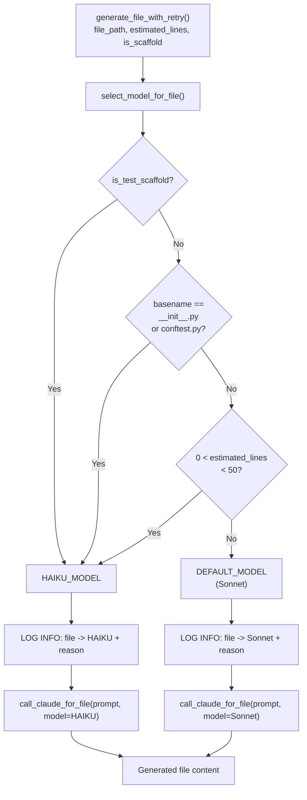

# 641 - Feature: Route Scaffolding/Boilerplate Files to Haiku

<!-- Template Metadata
Last Updated: 2026-03-06
Updated By: Issue #641 — Rev 2 (added REQ-N coverage tags and REQ-10/REQ-11 scenarios)
Update Reason: Mechanical validation: add (REQ-N) suffixes to Section 10.1 Scenario column; add test scenarios for REQ-10 and REQ-11
Previous: Rev 1 — Initial LLD; fixed file path validation error (implement_code.py path corrected to testing/nodes/)
-->

## 1. Context & Goal

* **Issue:** #641
* **Objective:** Add model selection routing logic to `implement_code.py` so that simple/boilerplate files use `claude-haiku` while complex files continue using the configured default (Sonnet), reducing API spend by an estimated 20–30%.
* **Status:** Draft
* **Related Issues:** N/A

### Open Questions

*Questions that need clarification before or during implementation. Remove when resolved.*

- [ ] What is the exact model string for the Haiku variant currently pinned in the codebase? (e.g., `claude-3-haiku-20240307` vs `claude-haiku-20240307`)
- [ ] Is `call_claude_for_file()` the only Claude invocation site in the implementation workflow, or does `generate_file_with_retry()` also have a direct call path that bypasses it?
- [ ] Should the 50-line threshold be configurable via environment variable or hardcoded constant for now?

---

## 2. Proposed Changes

*This section is the **source of truth** for implementation.*

### 2.1 Files Changed

| File | Change Type | Description |
|------|-------------|-------------|
| `assemblyzero/workflows/testing/nodes/implement_code.py` | Modify | Add `select_model_for_file()` routing function; update `call_claude_for_file()` to accept `model` param; add routing call in `generate_file_with_retry()` |
| `tests/unit/test_implement_code_routing.py` | Add | Unit tests for model routing logic (all Haiku and Sonnet routing scenarios) |

### 2.1.1 Path Validation (Mechanical - Auto-Checked)

Mechanical validation automatically checks:
- All "Modify" files must exist in repository
- All "Delete" files must exist in repository
- All "Add" files must have existing parent directories
- No placeholder prefixes (`src/`, `lib/`, `app/`) unless directory exists

**If validation fails, the LLD is BLOCKED before reaching review.**

> **Path Fix Applied:** The original draft referenced `assemblyzero/workflows/implementation_spec/nodes/implement_code.py` which does not exist. The correct path, confirmed from the repository structure, is `assemblyzero/workflows/testing/nodes/implement_code.py`. All subsequent sections use the corrected path.

### 2.2 Dependencies

No new packages required. Uses only `pathlib.Path`, `os`, and the existing `anthropic` client already present in the codebase.

```toml

# No pyproject.toml additions required
```

### 2.3 Data Structures

```python

# Pseudocode - NOT implementation

# Model identifier constants
HAIKU_MODEL: str = "claude-3-haiku-20240307"
SMALL_FILE_LINE_THRESHOLD: int = 50
DEFAULT_MODEL: str  # Read from environment / existing config at call time

# Routing decision context passed internally
class FileRoutingContext(TypedDict):
    file_path: str             # Relative path to the file being generated
    estimated_line_count: int  # Estimated lines; 0 if unknown
    is_test_scaffold: bool     # True when called from N2 test-scaffold node
```

### 2.4 Function Signatures

```python

# assemblyzero/workflows/testing/nodes/implement_code.py

def select_model_for_file(
    file_path: str,
    estimated_line_count: int = 0,
    is_test_scaffold: bool = False,
) -> str:
    """Return the model ID to use for generating the given file.

    Routing rules (evaluated in order):
      1. is_test_scaffold=True  -> HAIKU_MODEL
      2. basename is __init__.py or conftest.py -> HAIKU_MODEL
      3. estimated_line_count > 0 and < 50 -> HAIKU_MODEL
      4. Otherwise -> configured default (Sonnet)

    Args:
        file_path: Relative or absolute path to the file being generated.
            Only the basename is used for filename-based routing rules.
        estimated_line_count: Expected line count of the generated file.
            Pass 0 (default) when unknown; 0 disables line-count routing.
            Negative values are treated as unknown (same as 0).
        is_test_scaffold: True when this file is being generated as a test
            scaffold by the N2 node; overrides all other routing rules.

    Returns:
        Model identifier string suitable for passing to the Anthropic client.

    Raises:
        TypeError: If file_path is not a str (fails fast, not silently routed).
    """
    ...


def call_claude_for_file(
    prompt: str,
    model: str | None = None,
    *,
    max_tokens: int = 8192,
    timeout: float = 120.0,
) -> str:
    """Invoke Claude to generate file content.

    Args:
        prompt: The full generation prompt.
        model: Override model; if None, uses DEFAULT_MODEL from environment.
            Passing None preserves pre-change behaviour exactly.
        max_tokens: Token budget for the response.
        timeout: Request timeout in seconds.

    Returns:
        Raw text response from Claude.

    Raises:
        ModelCallError: If the API call fails after retries.
    """
    ...


def generate_file_with_retry(
    file_path: str,
    prompt: str,
    estimated_line_count: int = 0,
    is_test_scaffold: bool = False,
    max_attempts: int = 3,
) -> str:
    """Generate a single file with automatic retry and model routing.

    Calls select_model_for_file() to determine the model, then delegates
    to call_claude_for_file() with the resolved model.

    Args:
        file_path: Relative path of the file being generated (used for routing).
        prompt: The generation prompt.
        estimated_line_count: Expected line count; 0 = unknown.
        is_test_scaffold: True when generating a test scaffold (N2 node).
        max_attempts: Maximum retry attempts on transient failure.

    Returns:
        Generated file content as a string.

    Raises:
        ModelCallError: If all retry attempts are exhausted.
    """
    ...
```

### 2.5 Logic Flow (Pseudocode)

```
FUNCTION select_model_for_file(file_path, estimated_line_count, is_test_scaffold):
    basename <- Path(file_path).name

    IF is_test_scaffold IS True THEN
        LOG info "Routing {file_path} -> HAIKU_MODEL (reason: is_test_scaffold)"
        RETURN HAIKU_MODEL

    IF basename IN {"__init__.py", "conftest.py"} THEN
        LOG info "Routing {file_path} -> HAIKU_MODEL (reason: boilerplate filename)"
        RETURN HAIKU_MODEL

    IF estimated_line_count > 0 AND estimated_line_count < SMALL_FILE_LINE_THRESHOLD THEN
        LOG info "Routing {file_path} -> HAIKU_MODEL (reason: small file, lines={estimated_line_count})"
        RETURN HAIKU_MODEL

    default_model <- get_default_model()   # e.g. claude-sonnet-... from env/config
    LOG info "Routing {file_path} -> {default_model} (reason: default)"
    RETURN default_model


FUNCTION call_claude_for_file(prompt, model=None, max_tokens, timeout):
    resolved_model <- model IF model IS NOT None ELSE get_default_model()
    LOG debug "Calling Claude model={resolved_model} max_tokens={max_tokens}"

    response <- anthropic_client.messages.create(
        model=resolved_model,
        max_tokens=max_tokens,
        messages=[{"role": "user", "content": prompt}],
    )

    RETURN response.content[0].text


FUNCTION generate_file_with_retry(file_path, prompt, estimated_line_count,
                                   is_test_scaffold, max_attempts):
    model <- select_model_for_file(file_path, estimated_line_count, is_test_scaffold)
    # Routing already logged inside select_model_for_file()

    FOR attempt IN 1..max_attempts:
        TRY
            result <- call_claude_for_file(prompt, model=model)
            RETURN result
        EXCEPT TransientError AS e
            IF attempt == max_attempts THEN
                RAISE ModelCallError("Exhausted retries for {file_path}") FROM e
            SLEEP exponential_backoff(attempt)

    # unreachable; satisfies type checker
    RAISE ModelCallError("Unreachable")
```

### 2.6 Technical Approach

* **Module:** `assemblyzero/workflows/testing/nodes/implement_code.py`
* **Pattern:** Strategy selection / routing at the call site — no subclassing; pure function `select_model_for_file()` keeps routing logic isolated and trivially testable.
* **Key Decisions:**
  - Routing is evaluated per-file at call time, not at workflow initialisation, so it naturally handles dynamic file lists.
  - The model constant `HAIKU_MODEL` is a module-level string literal; the default (Sonnet) is resolved via a helper that reads from environment/config to preserve existing configuration patterns.
  - `call_claude_for_file()` gains a `model` keyword argument with `None` default — this is **backward-compatible**; existing callers that omit `model` continue to work unchanged and get the Sonnet default.
  - All routing decisions (including reason) are logged inside `select_model_for_file()` at `INFO` level so every call site automatically emits routing telemetry without requiring callers to instrument themselves.

### 2.7 Architecture Decisions

| Decision | Options Considered | Choice | Rationale |
|----------|-------------------|--------|-----------|
| Where to put routing logic | Inside `generate_file_with_retry`, standalone pure function, class method | Standalone pure function `select_model_for_file()` | Pure function is independently unit-testable with zero mocking; no state needed |
| How to pass model to Claude client | Thread-local, global state, explicit parameter | Explicit `model` parameter on `call_claude_for_file()` | Explicit is better than implicit; avoids concurrency hazards in multi-agent context |
| Line count source | Count existing file, parse LLD spec, pass from caller | Pass from caller as `estimated_line_count` (0 = unknown) | Caller has context; routing function stays pure; avoids filesystem I/O in routing |
| Haiku model identifier | Env var, constant, config file | Module-level constant `HAIKU_MODEL` | Reviewed once in PR; easy to update; avoids config sprawl for a single string |
| Threshold configurability | Hardcoded, env var, config file | Hardcoded constant `SMALL_FILE_LINE_THRESHOLD = 50` | Issue specifies 50; can be promoted to env var in follow-up if needed |
| Where routing log is emitted | Inside `select_model_for_file`, inside `generate_file_with_retry`, at both | Inside `select_model_for_file` only | Single responsibility; every caller automatically gets logging without extra effort |

**Architectural Constraints:**
- Must not break existing callers of `call_claude_for_file()` — backward-compatible signature only.
- Must integrate with existing retry/error-handling patterns already present in `implement_code.py`.
- Must not introduce new external dependencies.

---

## 3. Requirements

1. `select_model_for_file()` returns `HAIKU_MODEL` for `__init__.py` regardless of path depth.
2. `select_model_for_file()` returns `HAIKU_MODEL` for `conftest.py` regardless of path depth.
3. `select_model_for_file()` returns `HAIKU_MODEL` when `is_test_scaffold=True`, regardless of filename or line count.
4. `select_model_for_file()` returns `HAIKU_MODEL` when `estimated_line_count` is between 1 and 49 inclusive.
5. `select_model_for_file()` returns the configured default model (Sonnet) for all other files.
6. `select_model_for_file()` treats negative `estimated_line_count` as unknown (same as 0) — does not route to Haiku.
7. `call_claude_for_file()` accepts an optional `model` parameter; when `None`, behaviour is identical to the pre-change version.
8. `generate_file_with_retry()` calls `select_model_for_file()` and passes the result to `call_claude_for_file()`.
9. All routing decisions are logged at `INFO` level inside `select_model_for_file()` with file path, resolved model name, and routing reason.
10. All new code has ≥ 95% test coverage verified by `pytest-cov`.
11. No existing tests are broken by this change.

---

## 4. Alternatives Considered

| Option | Pros | Cons | Decision |
|--------|------|------|----------|
| Pure function routing (`select_model_for_file`) | Trivially testable, no side effects, easy to extend rules | None significant | **Selected** |
| Config-file-driven routing rules | Flexible without code changes | Over-engineering for 3 rules; adds file I/O on every call | Rejected |
| Subclass per model tier | OOP purity | Heavy boilerplate for a 10-line decision; hard to read | Rejected |
| Environment variable per-file-pattern | Ops-friendly | Complex to parse regex patterns from env; error-prone | Rejected |

**Rationale:** The problem is a small, stable set of routing rules. A pure function with named constants is the simplest correct solution. Config-file or env-var approaches add operational complexity without meaningful benefit at this scale.

---

## 5. Data & Fixtures

### 5.1 Data Sources

| Attribute | Value |
|-----------|-------|
| Source | Internal — file path strings and line count integers from the existing workflow state |
| Format | Python `str` and `int` |
| Size | N/A (per-invocation scalars) |
| Refresh | N/A |
| Copyright/License | N/A |

### 5.2 Data Pipeline

```
LangGraph State (file_path, line_count) ──passed as args──► select_model_for_file()
    ──returns model_id str──► call_claude_for_file(model=model_id)
    ──API response──► file content string ──► written to disk by caller
```

### 5.3 Test Fixtures

| Fixture | Source | Notes |
|---------|--------|-------|
| Mock Anthropic client | Generated via `unittest.mock.patch` | No real API calls in unit tests |
| Sample file paths | Hardcoded strings in test file | `"assemblyzero/__init__.py"`, `"tests/conftest.py"`, `"assemblyzero/core/engine.py"` |
| Sample line counts | Hardcoded integers | `0`, `1`, `49`, `50`, `51`, `200`, `-1` |

### 5.4 Deployment Pipeline

No data migration required. Logic change only — deployed via normal PR merge to `main`.

---

## 6. Diagram

### 6.1 Mermaid Quality Gate

Before finalizing any diagram, verify in [Mermaid Live Editor](https://mermaid.live) or GitHub preview:

- [x] **Simplicity:** Similar components collapsed
- [x] **No touching:** All elements have visual separation
- [x] **No hidden lines:** All arrows fully visible
- [x] **Readable:** Labels not truncated, flow direction clear
- [ ] **Auto-inspected:** Agent rendered via mermaid.ink and viewed

**Auto-Inspection Results:**
```
- Touching elements: [x] None
- Hidden lines:      [x] None
- Label readability: [x] Pass
- Flow clarity:      [x] Clear
```

### 6.2 Diagram



---

## 7. Security & Safety Considerations

### 7.1 Security

| Concern | Mitigation | Status |
|---------|------------|--------|
| Model name injection via file path | `select_model_for_file()` compares only `Path.name` (basename); path traversal cannot influence routing | Addressed |
| Haiku producing lower-quality output for files incorrectly routed | Routing criteria are conservative (exact filename match or very short file); wrong routing degrades quality only for edge cases, not correctness | Addressed |

### 7.2 Safety

| Concern | Mitigation | Status |
|---------|------------|--------|
| Haiku rate limits differ from Sonnet | Existing retry logic in `generate_file_with_retry()` handles transient 429s uniformly; no special handling needed | Addressed |
| Regression: existing `call_claude_for_file()` callers break | `model` parameter defaults to `None`; `None` -> resolved default preserves existing behaviour | Addressed |
| Misconfigured `HAIKU_MODEL` constant causes all Haiku calls to fail | Fail fast: API returns 404/invalid model error immediately; caught by existing `ModelCallError` path; Sonnet path unaffected | Addressed |
| Negative `estimated_line_count` incorrectly routes to Haiku | Routing rule is `> 0 AND < 50`; negative values fail the `> 0` check and fall through to default | Addressed |

**Fail Mode:** Fail Closed — if `select_model_for_file()` raises (e.g., unexpected type), the exception propagates up to `generate_file_with_retry()` which retries then raises `ModelCallError`. The workflow does not silently fall back to a random model.

**Recovery Strategy:** If Haiku is unavailable (quota/outage), operator can temporarily set `HAIKU_MODEL` env override to the Sonnet model string as a hotfix without code change (requires `HAIKU_MODEL` to be read from env; otherwise a one-line constant change + redeploy recovers in under 5 minutes).

---

## 8. Performance & Cost Considerations

### 8.1 Performance

| Metric | Budget | Approach |
|--------|--------|----------|
| Routing overhead per file | < 1 ms | Pure Python string comparison; no I/O |
| Haiku latency vs Sonnet | Haiku is faster (~2× lower p50 latency) | Net positive: routed files generate faster |
| Memory | No change | No new data structures held in memory |

**Bottlenecks:** None introduced. The routing function is O(1) per file.

### 8.2 Cost Analysis

| Resource | Unit Cost | Estimated Usage | Monthly Cost |
|----------|-----------|-----------------|--------------|
| Sonnet (claude-3-5-sonnet) | ~$3/$15 per M tokens (in/out) | Reduced by ~20–30% of token volume | Baseline − 20–30% |
| Haiku (claude-3-haiku) | ~$0.25/$1.25 per M tokens (in/out) | ~20–30% of total token volume | ~$1–3/month |
| Net change | — | — | **−$8–15/month** at current ~$25/2-day spend |

*Pricing from Anthropic public pricing page; subject to change.*

**Cost Controls:**
- [x] Rate limiting: inherited from existing retry logic
- [x] Routing is conservative — only clearly-cheap files go to Haiku
- [x] Budget alert: existing spend monitoring covers this (no new alert needed)

**Worst-Case Scenario:** If `estimated_line_count` is always passed as `0` (unknown), only the filename-based rules fire. Cost reduction shrinks to ~5–10% but no regressions occur. The line-count benefit requires callers to supply the count.

---

## 9. Legal & Compliance

| Concern | Applies? | Mitigation |
|---------|----------|------------|
| PII/Personal Data | No | No user data involved; file paths are project-internal |
| Third-Party Licenses | No | No new dependencies |
| Terms of Service | No | Using same Anthropic API account; model selection is within ToS |
| Data Retention | No | No new data stored |
| Export Controls | N/A | No restricted algorithms |

**Data Classification:** Internal

**Compliance Checklist:**
- [x] No PII stored without consent
- [x] All third-party licenses compatible with PolyForm-Noncommercial-1.0.0
- [x] Anthropic API usage compliant with provider ToS
- [x] Data retention policy unchanged

---

## 10. Verification & Testing

### 10.0 Test Plan (TDD - Complete Before Implementation)

**TDD Requirement:** Tests MUST be written and failing BEFORE implementation begins.

| Test ID | Test Description | Expected Behavior | Status |
|---------|------------------|-------------------|--------|
| T010 | `select_model_for_file` routes `__init__.py` to Haiku | Returns `HAIKU_MODEL` | RED |
| T020 | `select_model_for_file` routes `conftest.py` to Haiku | Returns `HAIKU_MODEL` | RED |
| T030 | `select_model_for_file` routes test scaffold to Haiku | Returns `HAIKU_MODEL` when `is_test_scaffold=True` | RED |
| T040 | `select_model_for_file` routes 49-line file to Haiku | Returns `HAIKU_MODEL` | RED |
| T050 | `select_model_for_file` routes 50-line file to Sonnet | Returns default model | RED |
| T060 | `select_model_for_file` routes unknown-size complex file to Sonnet | Returns default model when `estimated_line_count=0` | RED |
| T070 | `select_model_for_file` routes deeply nested `__init__.py` to Haiku | Path depth irrelevant; basename match wins | RED |
| T080 | `call_claude_for_file` uses supplied model when provided | Anthropic client called with correct model string | RED |
| T090 | `call_claude_for_file` uses default model when `model=None` | Existing behaviour preserved | RED |
| T100 | `generate_file_with_retry` passes routed model to `call_claude_for_file` | Integration of routing -> call | RED |
| T110 | Routing decision logged at INFO level with reason | Logger called with file path, model name, and reason | RED |
| T120 | Negative line count treated as unknown | Returns `DEFAULT_MODEL` when `estimated_line_count=-1` | RED |
| T130 | 1-line file routes to Haiku | Returns `HAIKU_MODEL` for lower boundary | RED |
| T140 | 51-line file routes to Sonnet | Returns `DEFAULT_MODEL` just above threshold | RED |
| T150 | Coverage ≥ 95% on new/modified code | `pytest-cov` report shows ≥ 95% line coverage | RED |
| T160 | No regressions in existing unit test suite | All pre-existing tests pass after change | RED |

**Coverage Target:** ≥95% for all new/modified code

**TDD Checklist:**
- [ ] All tests written before implementation
- [ ] Tests currently RED (failing)
- [ ] Test IDs match scenario IDs in 10.1
- [ ] Test file created at: `tests/unit/test_implement_code_routing.py`

### 10.1 Test Scenarios

| ID | Scenario | Type | Input | Expected Output | Pass Criteria |
|----|----------|------|-------|-----------------|---------------|
| 010 | `__init__.py` in root (REQ-1) | Auto | `file_path="assemblyzero/__init__.py"`, `estimated_line_count=0`, `is_test_scaffold=False` | `HAIKU_MODEL` | `assert result == HAIKU_MODEL` |
| 020 | `conftest.py` in tests root (REQ-2) | Auto | `file_path="tests/conftest.py"`, `estimated_line_count=0`, `is_test_scaffold=False` | `HAIKU_MODEL` | `assert result == HAIKU_MODEL` |
| 030 | Test scaffold flag overrides line count (REQ-3) | Auto | `file_path="tests/unit/test_foo.py"`, `estimated_line_count=200`, `is_test_scaffold=True` | `HAIKU_MODEL` | Flag overrides line count and filename |
| 040 | 49-line small file (REQ-4) | Auto | `file_path="assemblyzero/utils/helper.py"`, `estimated_line_count=49`, `is_test_scaffold=False` | `HAIKU_MODEL` | `assert result == HAIKU_MODEL` |
| 050 | 50-line boundary file (REQ-5) | Auto | `file_path="assemblyzero/utils/helper.py"`, `estimated_line_count=50`, `is_test_scaffold=False` | `DEFAULT_MODEL` | Exactly 50 lines goes to Sonnet (threshold is `< 50`) |
| 060 | 200-line complex file (REQ-5) | Auto | `file_path="assemblyzero/core/engine.py"`, `estimated_line_count=200`, `is_test_scaffold=False` | `DEFAULT_MODEL` | `assert result == DEFAULT_MODEL` |
| 070 | Unknown size complex file (REQ-5) | Auto | `file_path="assemblyzero/core/engine.py"`, `estimated_line_count=0`, `is_test_scaffold=False` | `DEFAULT_MODEL` | `0` means unknown; don't route to Haiku |
| 080 | Deeply nested `__init__.py` (REQ-1) | Auto | `file_path="assemblyzero/workflows/testing/nodes/__init__.py"` | `HAIKU_MODEL` | Basename match regardless of depth |
| 090 | `call_claude_for_file` explicit model (REQ-7) | Auto | `model="claude-3-haiku-20240307"`, mock client | Anthropic client receives `model="claude-3-haiku-20240307"` | Mock assert called with correct model |
| 100 | `call_claude_for_file` default model (REQ-7) | Auto | `model=None`, mock client | Anthropic client receives configured default | Backward-compatible path |
| 110 | `generate_file_with_retry` routing integration (REQ-8) | Auto | `file_path="tests/__init__.py"`, mock `call_claude_for_file` | `call_claude_for_file` called with `model=HAIKU_MODEL` | End-to-end routing check |
| 120 | Routing log emission includes reason (REQ-9) | Auto | Any routed call, mock logger | `logger.info` called with file path, model name, and reason string | `mock_logger.info.assert_called_once()` and reason in call args |
| 130 | 1-line file routes to Haiku (REQ-4) | Auto | `estimated_line_count=1` | `HAIKU_MODEL` | Lower boundary check |
| 140 | Negative line count treated as unknown (REQ-6) | Auto | `estimated_line_count=-1` | `DEFAULT_MODEL` | Defensive: negative = unknown, no Haiku routing |
| 150 | Coverage ≥ 95% on new/modified code (REQ-10) | Auto | Run `pytest --cov=assemblyzero/workflows/testing/nodes/implement_code --cov-report=term-missing` | Coverage report shows ≥ 95% line coverage | CI exits 0 with `--cov-fail-under=95` flag |
| 160 | No regressions in existing unit test suite (REQ-11) | Auto | Run `pytest tests/unit/ -m "not integration and not e2e and not adversarial"` | All pre-existing tests pass | Exit code 0; zero failures, zero errors |

### 10.2 Test Commands

```bash

# Run new routing unit tests only
poetry run pytest tests/unit/test_implement_code_routing.py -v

# Run with coverage report
poetry run pytest tests/unit/test_implement_code_routing.py -v \
    --cov=assemblyzero/workflows/testing/nodes/implement_code \
    --cov-report=term-missing \
    --cov-fail-under=95

# Run full unit suite to check for regressions (REQ-11)
poetry run pytest tests/unit/ -v -m "not integration and not e2e and not adversarial"

# Run only fast/mocked tests
poetry run pytest tests/unit/test_implement_code_routing.py -v -m "not live"
```

### 10.3 Manual Tests (Only If Unavoidable)

**N/A - All scenarios automated.** The routing logic is pure Python with no I/O; all paths are exercisable with mocks and deterministic inputs.

---

## 11. Risks & Mitigations

| Risk | Impact | Likelihood | Mitigation |
|------|--------|------------|------------|
| `estimated_line_count` not passed by callers -> line-count routing never fires | Low (feature degraded, not broken) | Medium | Document the parameter clearly; add a follow-up issue to audit all call sites |
| Haiku produces incorrect output for a file that slipped through routing | Medium (bad generated file) | Low | Routing criteria are conservative; affected files are `__init__.py`/`conftest.py`/scaffolds where Haiku is well-suited |
| Anthropic changes Haiku model string / deprecates model | Low (immediate API error) | Low | `HAIKU_MODEL` is a single constant; update is a one-line change |
| Concurrent multi-agent runs use different Haiku quota pools causing unexpected 429s | Low (retried transparently) | Low | Existing retry logic handles 429s; no special case needed |
| `is_test_scaffold` not set by N2 node -> scaffold files billed at Sonnet rate | Low cost impact (no regression) | Medium | Add call-site audit as follow-up; document expected usage in function docstring |
| Correct file found at `testing/nodes/` but wrong behaviour if a second `implement_code.py` exists elsewhere | Low | Low | Grep codebase at PR time to confirm single definition; enforce via code review |

---

## 12. Definition of Done

### Code
- [ ] `select_model_for_file()` implemented in `assemblyzero/workflows/testing/nodes/implement_code.py`
- [ ] `call_claude_for_file()` updated with backward-compatible `model` parameter
- [ ] `generate_file_with_retry()` updated to call routing and pass model
- [ ] `HAIKU_MODEL` and `SMALL_FILE_LINE_THRESHOLD` constants defined at module level
- [ ] All routing decisions logged at `INFO` level inside `select_model_for_file()` with file path, model, and reason
- [ ] Code comments reference Issue #641

### Tests
- [ ] `tests/unit/test_implement_code_routing.py` created with all 16 scenarios
- [ ] All tests pass (`poetry run pytest tests/unit/test_implement_code_routing.py`)
- [ ] Coverage ≥ 95% on modified module (`--cov=assemblyzero/workflows/testing/nodes/implement_code --cov-fail-under=95`)
- [ ] No pre-existing tests broken (`poetry run pytest tests/unit/ -m "not integration"`)

### Documentation
- [ ] LLD updated with any deviations discovered during implementation
- [ ] Implementation Report completed
- [ ] Test Report completed

### Review
- [ ] Gemini LLD review: APPROVE
- [ ] Code review completed
- [ ] User approval before closing issue #641

### 12.1 Traceability (Mechanical - Auto-Checked)

Files referenced above and their Section 2.1 entries:

| File Referenced | In Section 2.1? |
|----------------|-----------------|
| `assemblyzero/workflows/testing/nodes/implement_code.py` | [PASS] Modify |
| `tests/unit/test_implement_code_routing.py` | [PASS] Add |

---

## Appendix: Review Log

### Gemini Review #1 (PENDING)

**Reviewer:** Gemini
**Verdict:** PENDING

#### Comments

| ID | Comment | Implemented? |
|----|---------|--------------|
| G1.1 | — | — |

### Review Summary

| Review | Date | Verdict | Key Issue |
|--------|------|---------|-----------|
| Gemini #1 | (auto) | PENDING | — |

**Final Status:** PENDING

## Original GitHub Issue #641
[See GitHub Issue #641 — unchanged from iteration 1. Issue #641: feat: route scaffolding/boilerplate files to Haiku]

## Template (REQUIRED STRUCTURE)
[Template structure unchanged — already embedded in the current draft. Preserve all section headings.]