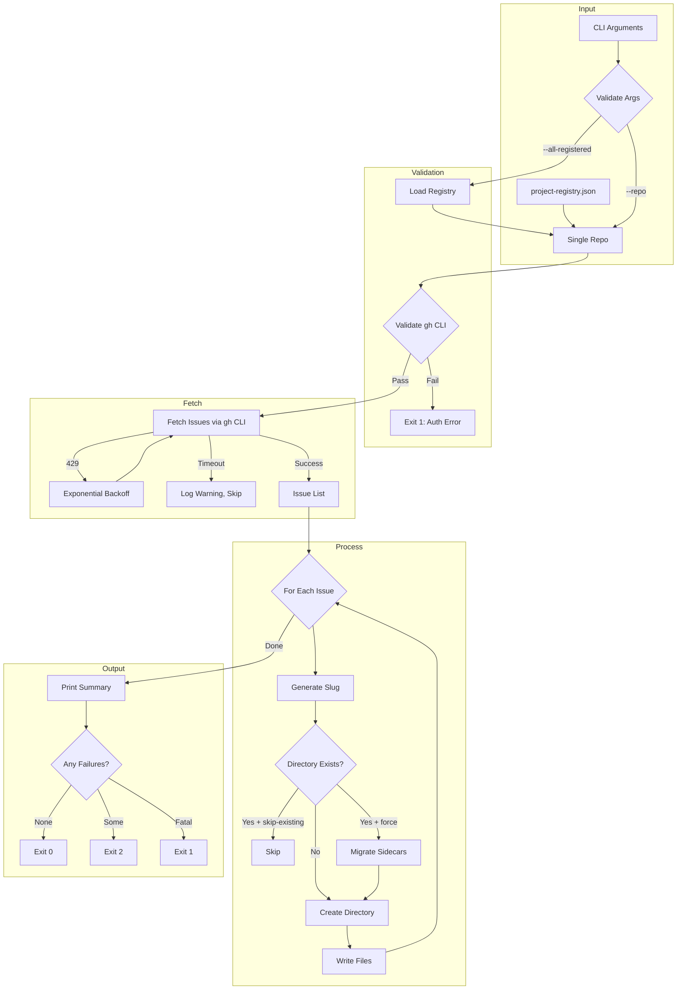

# 172 - Feature: Backfill Audit Directory Structure for Existing GitHub Issues

<!-- Template Metadata
Last Updated: 2026-02-15
Updated By: Initial creation
Update Reason: LLD creation for Issue #72
-->

## 1. Context & Goal
* **Issue:** #72
* **Objective:** Create a Python CLI tool that backfills audit directory structures for existing GitHub issues, enabling historical issues to have the same audit trail as new issues created under the governance workflow.
* **Status:** Draft
* **Related Issues:** None identified (pending link to `agentos/workflows/issue/audit.py` if created in parallel branch)

### Open Questions

- [ ] Does `agentos/workflows/issue/audit.py` exist with `generate_slug()` function, or does it need to be created?
- [ ] Should the tool support filtering by label (e.g., only backfill issues with `governance` label)?
- [ ] What is the expected maximum number of issues per repository for pagination testing?

## 2. Proposed Changes

*This section is the **source of truth** for implementation. Describes exactly what will be built.*

### 2.1 Files Changed

| File | Change Type | Description |
|------|-------------|-------------|
| `tools/backfill_issue_audit.py` | Add | Main CLI tool implementation |
| `tools/fixtures/README.md` | Add | Documentation for fixture format |
| `tools/fixtures/sample_issues.json` | Add | Sample issue list response fixture |
| `tools/fixtures/sample_issue_detail.json` | Add | Sample single issue response fixture |
| `tests/tools/test_backfill_issue_audit.py` | Add | Unit and integration tests |
| `tools/README.md` | Modify | Add tool usage documentation |

### 2.2 Dependencies

```toml
# pyproject.toml additions (if any)
# No new dependencies - uses stdlib only
# Requires: gh CLI >= 2.0 (external)
# Requires: agentos package (internal, via pip install -e .)
```

**External Requirements:**
- `gh` CLI version >= 2.0 installed and authenticated
- Python 3.11+ (for `datetime.fromisoformat()` timezone handling)

### 2.3 Data Structures

```python
# Pseudocode - NOT implementation
class IssueData(TypedDict):
    number: int              # Issue number (e.g., 42)
    title: str               # Issue title
    state: str               # "open" or "closed"
    body: str                # Issue body content (markdown)
    comments: list[Comment]  # List of comment objects
    labels: list[Label]      # List of label objects
    createdAt: str           # ISO 8601 timestamp
    closedAt: str | None     # ISO 8601 timestamp or null
    author: Author           # Author object

class Comment(TypedDict):
    body: str                # Comment content
    author: Author           # Comment author
    createdAt: str           # ISO 8601 timestamp

class Author(TypedDict):
    login: str               # GitHub username

class Label(TypedDict):
    name: str                # Label name

class ProcessingResult(TypedDict):
    success: int             # Count of successfully processed issues
    skipped: int             # Count of skipped issues
    failed: int              # Count of failed issues
    errors: list[str]        # List of error messages

class CLIArgs(TypedDict):
    repo: str | None         # Single repo (owner/name format)
    all_registered: bool     # Process all repos in registry
    dry_run: bool            # Preview without writing
    skip_existing: bool      # Skip existing directories
    force: bool              # Overwrite managed files
    open_only: bool          # Process only open issues
    verbose: bool            # Debug output
    quiet: bool              # Suppress non-error output
    delay: int               # Seconds between requests
    limit: int | None        # Max issues to process
```

### 2.4 Function Signatures

```python
# Signatures only - implementation in source files

def main() -> int:
    """Entry point. Returns exit code (0=success, 1=fatal, 2=partial)."""
    ...

def parse_args() -> CLIArgs:
    """Parse command line arguments with argparse."""
    ...

def validate_gh_cli() -> None:
    """Verify gh CLI is installed, version >= 2.0, and authenticated.
    
    Raises:
        SystemExit: If validation fails (Fail Fast).
    """
    ...

def fetch_issues(repo: str, *, open_only: bool = False, limit: int | None = None) -> list[IssueData]:
    """Fetch issues from GitHub repository via gh CLI.
    
    Args:
        repo: Repository in owner/name format.
        open_only: If True, fetch only open issues.
        limit: Maximum number of issues to fetch.
    
    Returns:
        List of issue data dictionaries.
    
    Raises:
        subprocess.CalledProcessError: On gh CLI error.
    """
    ...

def generate_slug(issue_number: int, title: str) -> str:
    """Generate directory slug from issue number and title.
    
    Delegates to agentos.workflows.issue.audit.generate_slug for consistency.
    
    Args:
        issue_number: GitHub issue number.
        title: Issue title.
    
    Returns:
        Slug in format "{number}-{sanitized-title}".
    """
    ...

def create_audit_directory(
    issue: IssueData,
    base_path: Path,
    *,
    dry_run: bool = False,
    skip_existing: bool = False,
    force: bool = False,
) -> bool:
    """Create audit directory structure for a single issue.
    
    Args:
        issue: Issue data from GitHub.
        base_path: Base path for docs/audit directory.
        dry_run: If True, preview without writing.
        skip_existing: If True, skip if directory exists.
        force: If True, overwrite managed files only.
    
    Returns:
        True if directory was created/updated, False if skipped.
    """
    ...

def generate_issue_markdown(issue: IssueData) -> str:
    """Generate 001-issue.md content from issue data."""
    ...

def generate_comments_markdown(issue: IssueData) -> str:
    """Generate 002-comments.md content from issue comments."""
    ...

def generate_metadata_json(issue: IssueData) -> str:
    """Generate 003-metadata.json content from issue data."""
    ...

def find_existing_directory(issue_number: int, base_path: Path) -> Path | None:
    """Find existing directory for issue number (handles renames).
    
    Searches for pattern {number}-* in both active/ and done/ directories.
    
    Returns:
        Path to existing directory or None if not found.
    """
    ...

def migrate_sidecar_files(old_dir: Path, new_dir: Path) -> None:
    """Migrate non-managed files from old directory to new.
    
    Preserves files that don't match 001-*, 002-*, 003-* pattern.
    """
    ...

def load_project_registry(path: Path) -> list[str]:
    """Load repository list from project-registry.json.
    
    Returns:
        List of repository names in owner/name format.
    
    Raises:
        SystemExit: If file not found or schema invalid.
    """
    ...

def load_fixtures() -> list[IssueData]:
    """Load test fixtures from tools/fixtures/ directory.
    
    Used when BACKFILL_USE_FIXTURES=1 environment variable is set.
    """
    ...

def exponential_backoff(attempt: int) -> int:
    """Calculate backoff time for rate limiting.
    
    Args:
        attempt: Retry attempt number (1-indexed).
    
    Returns:
        Seconds to wait (60, 120, 240 for attempts 1, 2, 3).
    """
    ...
```

### 2.5 Logic Flow (Pseudocode)

```
1. Parse CLI arguments
2. IF BACKFILL_USE_FIXTURES env var set:
   - Load fixtures instead of calling gh CLI
   - GOTO step 7

3. Validate gh CLI:
   a. Check gh CLI is installed (subprocess.run(['gh', '--version']))
   b. Parse version, verify >= 2.0
   c. Check authentication (subprocess.run(['gh', 'auth', 'status']))
   d. IF any check fails: EXIT 1 with clear error message

4. Determine repositories to process:
   a. IF --repo provided: repos = [repo]
   b. IF --all-registered: repos = load_project_registry()
   c. Validate each repo matches owner/name pattern

5. FOR each repository:
   a. Fetch issues via gh CLI (with pagination)
   b. Handle rate limits with exponential backoff
   c. Filter to open-only if --open-only flag

6. FOR each issue:
   a. Generate slug from number + title
   b. Determine target directory (active/ or done/)
   c. Check for existing directory (pattern {number}-*)
   d. IF --skip-existing AND directory exists: SKIP
   e. IF --dry-run: Print what would be created, CONTINUE
   f. IF existing directory with different slug AND --force:
      - Migrate sidecar files to new directory
      - Remove old directory
   g. Create directory structure
   h. Write 001-issue.md, 002-comments.md, 003-metadata.json
   i. Handle errors per error strategy (Fail Open for transient)

7. Print summary:
   - Total processed
   - Success count
   - Skipped count  
   - Failed count (with error details if --verbose)

8. EXIT with appropriate code:
   - 0 if all succeeded
   - 1 if fatal error occurred
   - 2 if partial failures
```

### 2.6 Technical Approach

* **Module:** `tools/backfill_issue_audit.py`
* **Pattern:** CLI tool with subprocess orchestration
* **Key Decisions:**
  - Shell out to `gh` CLI rather than using PyGithub to avoid additional dependency and leverage existing auth
  - Import slug generation from `agentos` package to prevent drift
  - Use `pathlib.Path` for all filesystem operations for cross-platform compatibility
  - Implement error handling strategy with explicit Fail Fast vs Fail Open categorization

### 2.7 Architecture Decisions

| Decision | Options Considered | Choice | Rationale |
|----------|-------------------|--------|-----------|
| GitHub API Access | PyGithub library, gh CLI, Raw REST API | gh CLI | No new deps, uses existing auth, handles pagination |
| Slug Generation | Local implementation, Import from agentos | Import from agentos | Single source of truth, prevents drift |
| Configuration | YAML config, JSON config, CLI args only | CLI args + project-registry.json | Simplicity, existing patterns |
| Error Strategy | All Fail Fast, All Fail Open, Hybrid | Hybrid per error type | Balance reliability with progress |
| File Writing | Direct write, Atomic write with temp | Atomic with temp | Prevents partial writes on crash |

**Architectural Constraints:**
- Must use `subprocess` with list arguments only (no `shell=True`) for security
- Must integrate with existing `agentos` package for slug generation
- Must support offline testing via fixtures for CI reliability

## 3. Requirements

*What must be true when this is done. These become acceptance criteria.*

1. Tool accepts `--repo owner/name` argument and processes single repository
2. Tool accepts `--all-registered` flag and processes all repos in `project-registry.json`
3. Tool validates `gh` CLI version >= 2.0 and authentication at startup
4. Tool creates `docs/audit/done/{slug}/` for closed issues
5. Tool creates `docs/audit/active/{slug}/` for open issues
6. Tool generates valid `001-issue.md`, `002-comments.md`, `003-metadata.json` files
7. Tool handles edge cases: emoji titles, long titles, special characters, empty comments
8. Tool implements `--dry-run`, `--skip-existing`, `--force`, `--verbose`, `--quiet` flags
9. Tool implements error handling strategy (Fail Fast for fatal, Fail Open for transient)
10. Tool implements exponential backoff for HTTP 429 rate limits
11. Tool uses list arguments for all subprocess calls (no `shell=True`)
12. Tool supports offline testing via fixtures with `BACKFILL_USE_FIXTURES=1`

## 4. Alternatives Considered

| Option | Pros | Cons | Decision |
|--------|------|------|----------|
| Use gh CLI via subprocess | No new deps, existing auth, handles pagination | Slower than direct API, parsing overhead | **Selected** |
| Use PyGithub library | Native Python, better types | New dependency, separate auth management | Rejected |
| Use GitHub REST API directly | Full control, no CLI dependency | Auth handling, pagination complexity | Rejected |
| Local slug implementation | No dependency on agentos | Risk of drift, duplicate code | Rejected |
| Import slug from agentos | Single source of truth | Requires agentos installed | **Selected** |
| GraphQL batch fetching | Efficient for many issues | More complex, harder to debug | Rejected (future) |

**Rationale:** The gh CLI approach minimizes dependencies while leveraging battle-tested authentication and pagination. Importing slug generation from agentos ensures consistency with the main workflow.

## 5. Data & Fixtures

*Per [0108-lld-pre-implementation-review.md](0108-lld-pre-implementation-review.md) - complete this section BEFORE implementation.*

### 5.1 Data Sources

| Attribute | Value |
|-----------|-------|
| Source | GitHub API via `gh` CLI |
| Format | JSON (from `gh --json` output) |
| Size | Variable per repository (1-1000+ issues typical) |
| Refresh | On-demand when tool is run |
| Copyright/License | N/A - accessing user's own repository data |

### 5.2 Data Pipeline

```
GitHub API ──gh CLI──► JSON stdout ──json.loads()──► Python dicts ──format──► Markdown/JSON files
```

### 5.3 Test Fixtures

| Fixture | Source | Notes |
|---------|--------|-------|
| `sample_issues.json` | Generated (sanitized real data) | Contains 10 diverse issue types |
| `sample_issue_detail.json` | Generated | Single issue with comments |
| `edge_cases.json` | Manually crafted | Emoji titles, long titles, empty bodies |

**Fixture Hygiene:** All fixtures use synthetic data. No real usernames or potentially sensitive content.

### 5.4 Deployment Pipeline

```
Developer runs locally ──► Files written to docs/audit/ ──► Committed to repo ──► PR review
```

**No separate utility needed** - this tool IS the utility for data backfill.

## 6. Diagram

### 6.1 Mermaid Quality Gate

Before finalizing any diagram, verify in [Mermaid Live Editor](https://mermaid.live) or GitHub preview:

- [x] **Simplicity:** Similar components collapsed (per 0006 §8.1)
- [x] **No touching:** All elements have visual separation (per 0006 §8.2)
- [x] **No hidden lines:** All arrows fully visible (per 0006 §8.3)
- [x] **Readable:** Labels not truncated, flow direction clear
- [ ] **Auto-inspected:** Agent rendered via mermaid.ink and viewed (per 0006 §8.5)

**Auto-Inspection Results:**
```
- Touching elements: [ ] None / [ ] Found: ___
- Hidden lines: [ ] None / [ ] Found: ___
- Label readability: [ ] Pass / [ ] Issue: ___
- Flow clarity: [ ] Clear / [ ] Issue: ___
```

### 6.2 Diagram



## 7. Security & Safety Considerations

*This section addresses security (10 patterns) and safety (9 patterns) concerns from governance feedback.*

### 7.1 Security

| Concern | Mitigation | Status |
|---------|------------|--------|
| Command injection via repo name | Use list args for subprocess, validate owner/name pattern | Addressed |
| Shell injection via issue titles | Slugs sanitized to `[a-z0-9-]` only, never used in shell | Addressed |
| Path traversal in slugs | Remove `.`, `..`, `/` from slugs via regex | Addressed |
| Credential exposure | Uses existing gh CLI auth, no credential storage | Addressed |
| Unauthorized data access | Processes only repos user has authenticated access to | Addressed |

### 7.2 Safety

| Concern | Mitigation | Status |
|---------|------------|--------|
| Data loss on overwrite | `--force` only overwrites managed files (001-*, 002-*, 003-*) | Addressed |
| Partial write corruption | Use atomic writes via temp file + rename | Addressed |
| Runaway API calls | Exponential backoff on 429, `--limit` flag for debugging | Addressed |
| Disk space exhaustion | User responsibility, tool does not check disk space | Documented |
| Sidecar file loss on rename | Explicit migration of non-managed files | Addressed |

**Fail Mode:** Hybrid - Fatal errors Fail Closed (exit 1), transient errors Fail Open (skip and continue)

**Recovery Strategy:** 
- Re-run with `--skip-existing` to resume after partial failure
- Re-run with `--force` to regenerate managed files if corrupted
- Manual sidecar files are never deleted automatically

## 8. Performance & Cost Considerations

### 8.1 Performance

| Metric | Budget | Approach |
|--------|--------|----------|
| Per-issue latency | < 2s | Single gh CLI call per issue |
| Memory | < 50MB | Stream issues, don't load all at once |
| Disk I/O | Minimal | Write 3 small files per issue |

**Bottlenecks:** 
- N+1 API calls (one per issue for comments) - acceptable for maintenance tool
- GitHub rate limits (5000/hour authenticated) - handled with backoff

### 8.2 Cost Analysis

| Resource | Unit Cost | Estimated Usage | Monthly Cost |
|----------|-----------|-----------------|--------------|
| GitHub API | Free (authenticated) | ~100 issues/run | $0 |
| Disk storage | ~2KB/issue | 1000 issues | ~2MB |
| Developer time | N/A | Manual invocation | N/A |

**Cost Controls:**
- [x] No paid API usage
- [x] `--delay` flag for manual throttling
- [x] `--limit` flag for controlled testing

**Worst-Case Scenario:** Processing 10,000 issues would hit rate limits; handled by exponential backoff.

## 9. Legal & Compliance

| Concern | Applies? | Mitigation |
|---------|----------|------------|
| PII/Personal Data | Yes | GitHub usernames are public; no private data stored |
| Third-Party Licenses | No | No third-party code included |
| Terms of Service | Yes | Uses gh CLI within GitHub ToS |
| Data Retention | N/A | User controls retention via git |
| Export Controls | No | No restricted algorithms |

**Data Classification:** Internal (repository-specific audit data)

**Compliance Checklist:**
- [x] No PII stored without consent (public GitHub data only)
- [x] All third-party licenses compatible with project license
- [x] External API usage compliant with provider ToS
- [x] Data retention policy documented (controlled by user via git)

## 10. Verification & Testing

*Ref: [0005-testing-strategy-and-protocols.md](0005-testing-strategy-and-protocols.md)*

**Testing Philosophy:** Strive for 100% automated test coverage. Fixtures enable offline testing without network access.

### 10.1 Test Scenarios

| ID | Scenario | Type | Input | Expected Output | Pass Criteria |
|----|----------|------|-------|-----------------|---------------|
| 010 | Single repo happy path | Auto | `--repo test/repo` with fixtures | Directories created | 3 files per issue |
| 020 | Dry run mode | Auto | `--dry-run` | Preview output, no files | No files written |
| 030 | Skip existing directories | Auto | `--skip-existing` with existing dir | Skip message | Dir unchanged |
| 040 | Force overwrite managed files | Auto | `--force` with existing dir | Files updated | 001-003 updated, sidecars preserved |
| 050 | Emoji-only title | Auto | Issue with "🚀🔥" title | `{N}-untitled/` | Directory created |
| 060 | Long title truncation | Auto | 200 char title | Slug <= 80 chars | Slug truncated correctly |
| 070 | Special characters | Auto | Title with "@[]" | Sanitized slug | Only `[a-z0-9-]` |
| 080 | No comments | Auto | Issue without comments | Placeholder text | "No comments" in file |
| 090 | Many comments | Auto | Issue with 50 comments | All captured | 50 comments in file |
| 100 | Closed issue routing | Auto | Closed issue | `done/` directory | Correct path |
| 110 | Open issue routing | Auto | Open issue | `active/` directory | Correct path |
| 120 | Auth failure | Auto | Mock auth failure | Exit 1 | Error message shown |
| 130 | Network timeout | Auto | Mock timeout | Skip + continue | Processing continues |
| 140 | Rate limit backoff | Auto | Mock 429 | Wait + retry | Backoff applied |
| 150 | Invalid repo format | Auto | `--repo invalid` | Exit 1 | Usage error |
| 160 | Renamed issue migration | Auto | Existing dir with different slug | Sidecar migration | Files preserved |
| 170 | All registered repos | Auto | `--all-registered` | Multiple repos processed | All repos done |
| 180 | Verbose output | Auto | `--verbose` | Debug info | Extra logging |
| 190 | Quiet mode | Auto | `--quiet` | Minimal output | Errors only |
| 200 | Subprocess injection prevention | Auto | Malicious repo name | Safe execution | No shell execution |

### 10.2 Test Commands

```bash
# Run all automated tests
poetry run pytest tests/tools/test_backfill_issue_audit.py -v

# Run only fast/mocked tests (exclude live)
poetry run pytest tests/tools/test_backfill_issue_audit.py -v -m "not live"

# Run with fixtures (offline mode)
BACKFILL_USE_FIXTURES=1 poetry run pytest tests/tools/test_backfill_issue_audit.py -v

# Run live integration tests (requires gh auth)
poetry run pytest tests/tools/test_backfill_issue_audit.py -v -m live
```

### 10.3 Manual Tests (Only If Unavoidable)

**N/A - All scenarios automated.** 

The fixture system enables complete offline testing. Live integration tests (`-m live`) verify real gh CLI behavior but are not required for CI pass.

## 11. Risks & Mitigations

| Risk | Impact | Likelihood | Mitigation |
|------|--------|------------|------------|
| `agentos` package doesn't have `generate_slug()` | High | Med | Create function if missing, document in open questions |
| gh CLI version incompatibility | Med | Low | Version check at startup with clear error |
| Very large repos (10k+ issues) | Med | Low | Pagination support, `--limit` flag for testing |
| GitHub API changes | Med | Low | JSON schema validation, fail gracefully |
| Slug collisions (unlikely) | Low | Low | Include issue number prefix guarantees uniqueness |

## 12. Definition of Done

### Code
- [ ] `tools/backfill_issue_audit.py` implemented and linted
- [ ] All subprocess calls use list arguments (no `shell=True`)
- [ ] Code comments reference this LLD (#72)
- [ ] Slug generation imported from `agentos` (or created if missing)

### Tests
- [ ] All 20 test scenarios pass
- [ ] Offline tests pass with `BACKFILL_USE_FIXTURES=1`
- [ ] Test coverage >= 90%

### Documentation
- [ ] `tools/README.md` updated with usage instructions
- [ ] `tools/fixtures/README.md` documents fixture format
- [ ] `--help` output is complete and accurate
- [ ] Implementation Report (0103) completed
- [ ] Test Report (0113) completed

### Review
- [ ] 0809 Security Audit passes (subprocess injection prevention verified)
- [ ] Code review completed
- [ ] User approval before closing issue

---

## Appendix: Review Log

*Track all review feedback with timestamps and implementation status.*

### Review Summary

| Review | Date | Verdict | Key Issue |
|--------|------|---------|-----------|
| | | | |

**Final Status:** PENDING