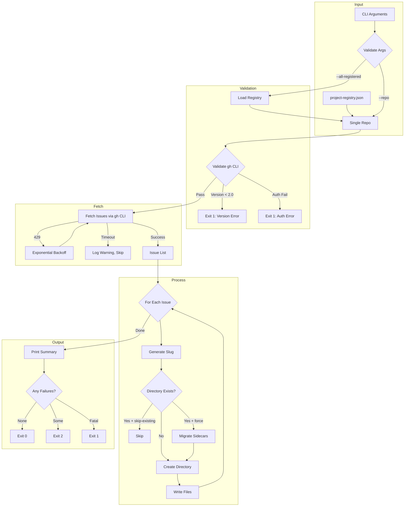

# LLD Finalized

Path: C:\Users\mcwiz\Projects\AgentOS\docs\lld\active\LLD-072.md
Status: APPROVED
Reviews: 2

---

# 172 - Feature: Backfill Audit Directory Structure for Existing GitHub Issues

<!-- Template Metadata
Last Updated: 2026-02-15
Updated By: Initial creation
Update Reason: LLD creation for Issue #72
-->

## 1. Context & Goal
* **Issue:** #72
* **Objective:** Create a Python CLI tool that backfills audit directory structures for existing GitHub issues, enabling historical issues to have the same audit trail as new issues created under the governance workflow.
* **Status:** Draft
* **Related Issues:** None identified (pending link to `agentos/workflows/issue/audit.py` if created in parallel branch)

### Open Questions

- [ ] Does `agentos/workflows/issue/audit.py` exist with `generate_slug()` function, or does it need to be created?
- [ ] Should the tool support filtering by label (e.g., only backfill issues with `governance` label)?
- [ ] What is the expected maximum number of issues per repository for pagination testing?

## 2. Proposed Changes

*This section is the **source of truth** for implementation. Describes exactly what will be built.*

### 2.1 Files Changed

| File | Change Type | Description |
|------|-------------|-------------|
| `tools/backfill_issue_audit.py` | Add | Main CLI tool implementation |
| `tools/fixtures/README.md` | Add | Documentation for fixture format |
| `tools/fixtures/sample_issues.json` | Add | Sample issue list response fixture |
| `tools/fixtures/sample_issue_detail.json` | Add | Sample single issue response fixture |
| `tests/tools/test_backfill_issue_audit.py` | Add | Unit and integration tests |
| `tools/README.md` | Modify | Add tool usage documentation (including gh version requirement) |

### 2.2 Dependencies

```toml
# pyproject.toml additions (if any)
# No new dependencies - uses stdlib only
# Requires: gh CLI >= 2.0 (external)
# Requires: agentos package (internal, via pip install -e .)
```

**External Requirements:**
- `gh` CLI version >= 2.0 installed and authenticated
- Python 3.11+ (for `datetime.fromisoformat()` timezone handling)

### 2.3 Data Structures

```python
# Pseudocode - NOT implementation
class IssueData(TypedDict):
    number: int              # Issue number (e.g., 42)
    title: str               # Issue title
    state: str               # "open" or "closed"
    body: str                # Issue body content (markdown)
    comments: list[Comment]  # List of comment objects
    labels: list[Label]      # List of label objects
    createdAt: str           # ISO 8601 timestamp
    closedAt: str | None     # ISO 8601 timestamp or null
    author: Author           # Author object

class Comment(TypedDict):
    body: str                # Comment content
    author: Author           # Comment author
    createdAt: str           # ISO 8601 timestamp

class Author(TypedDict):
    login: str               # GitHub username

class Label(TypedDict):
    name: str                # Label name

class ProcessingResult(TypedDict):
    success: int             # Count of successfully processed issues
    skipped: int             # Count of skipped issues
    failed: int              # Count of failed issues
    errors: list[str]        # List of error messages

class CLIArgs(TypedDict):
    repo: str | None         # Single repo (owner/name format)
    all_registered: bool     # Process all repos in registry
    dry_run: bool            # Preview without writing
    skip_existing: bool      # Skip existing directories
    force: bool              # Overwrite managed files
    open_only: bool          # Process only open issues
    verbose: bool            # Debug output
    quiet: bool              # Suppress non-error output
    delay: int               # Seconds between requests
    limit: int | None        # Max issues to process
```

### 2.4 Function Signatures

```python
# Signatures only - implementation in source files

def main() -> int:
    """Entry point. Returns exit code (0=success, 1=fatal, 2=partial)."""
    ...

def parse_args() -> CLIArgs:
    """Parse command line arguments with argparse."""
    ...

def validate_gh_cli() -> None:
    """Verify gh CLI is installed, version >= 2.0, and authenticated.
    
    Raises:
        SystemExit: If validation fails (Fail Fast).
    """
    ...

def check_gh_version() -> tuple[bool, str]:
    """Check if gh CLI version meets minimum requirement (>= 2.0).
    
    Returns:
        Tuple of (is_valid, version_string).
    
    Raises:
        FileNotFoundError: If gh CLI not installed.
    """
    ...

def fetch_issues(repo: str, *, open_only: bool = False, limit: int | None = None) -> list[IssueData]:
    """Fetch issues from GitHub repository via gh CLI.
    
    Args:
        repo: Repository in owner/name format.
        open_only: If True, fetch only open issues.
        limit: Maximum number of issues to fetch.
    
    Returns:
        List of issue data dictionaries.
    
    Raises:
        subprocess.CalledProcessError: On gh CLI error.
    """
    ...

def generate_slug(issue_number: int, title: str) -> str:
    """Generate directory slug from issue number and title.
    
    Delegates to agentos.workflows.issue.audit.generate_slug for consistency.
    
    Args:
        issue_number: GitHub issue number.
        title: Issue title.
    
    Returns:
        Slug in format "{number}-{sanitized-title}".
    """
    ...

def create_audit_directory(
    issue: IssueData,
    base_path: Path,
    *,
    dry_run: bool = False,
    skip_existing: bool = False,
    force: bool = False,
) -> bool:
    """Create audit directory structure for a single issue.
    
    Args:
        issue: Issue data from GitHub.
        base_path: Base path for docs/audit directory.
        dry_run: If True, preview without writing.
        skip_existing: If True, skip if directory exists.
        force: If True, overwrite managed files only.
    
    Returns:
        True if directory was created/updated, False if skipped.
    """
    ...

def generate_issue_markdown(issue: IssueData) -> str:
    """Generate 001-issue.md content from issue data."""
    ...

def generate_comments_markdown(issue: IssueData) -> str:
    """Generate 002-comments.md content from issue comments."""
    ...

def generate_metadata_json(issue: IssueData) -> str:
    """Generate 003-metadata.json content from issue data."""
    ...

def find_existing_directory(issue_number: int, base_path: Path) -> Path | None:
    """Find existing directory for issue number (handles renames).
    
    Searches for pattern {number}-* in both active/ and done/ directories.
    
    Returns:
        Path to existing directory or None if not found.
    """
    ...

def migrate_sidecar_files(old_dir: Path, new_dir: Path) -> None:
    """Migrate non-managed files from old directory to new.
    
    Preserves files that don't match 001-*, 002-*, 003-* pattern.
    """
    ...

def load_project_registry(path: Path) -> list[str]:
    """Load repository list from project-registry.json.
    
    Returns:
        List of repository names in owner/name format.
    
    Raises:
        SystemExit: If file not found or schema invalid.
    """
    ...

def load_fixtures() -> list[IssueData]:
    """Load test fixtures from tools/fixtures/ directory.
    
    Used when BACKFILL_USE_FIXTURES=1 environment variable is set.
    """
    ...

def exponential_backoff(attempt: int) -> int:
    """Calculate backoff time for rate limiting.
    
    Args:
        attempt: Retry attempt number (1-indexed).
    
    Returns:
        Seconds to wait (60, 120, 240 for attempts 1, 2, 3).
    """
    ...
```

### 2.5 Logic Flow (Pseudocode)

```
1. Parse CLI arguments
2. IF BACKFILL_USE_FIXTURES env var set:
   - Load fixtures instead of calling gh CLI
   - GOTO step 7

3. Validate gh CLI:
   a. Check gh CLI is installed (subprocess.run(['gh', '--version']))
   b. Parse version, verify >= 2.0
   c. IF version < 2.0: EXIT 1 with "gh CLI version 2.0+ required, found {version}"
   d. Check authentication (subprocess.run(['gh', 'auth', 'status']))
   e. IF auth check fails: EXIT 1 with clear error message

4. Determine repositories to process:
   a. IF --repo provided: repos = [repo]
   b. IF --all-registered: repos = load_project_registry()
   c. Validate each repo matches owner/name pattern

5. FOR each repository:
   a. Fetch issues via gh CLI (with pagination)
   b. Handle rate limits with exponential backoff
   c. Filter to open-only if --open-only flag

6. FOR each issue:
   a. Generate slug from number + title
   b. Determine target directory (active/ or done/)
   c. Check for existing directory (pattern {number}-*)
   d. IF --skip-existing AND directory exists: SKIP
   e. IF --dry-run: Print what would be created, CONTINUE
   f. IF existing directory with different slug AND --force:
      - Migrate sidecar files to new directory
      - Remove old directory
   g. Create directory structure
   h. Write 001-issue.md, 002-comments.md, 003-metadata.json
   i. Handle errors per error strategy (Fail Open for transient)

7. Print summary:
   - Total processed
   - Success count
   - Skipped count  
   - Failed count (with error details if --verbose)

8. EXIT with appropriate code:
   - 0 if all succeeded
   - 1 if fatal error occurred
   - 2 if partial failures
```

### 2.6 Technical Approach

* **Module:** `tools/backfill_issue_audit.py`
* **Pattern:** CLI tool with subprocess orchestration
* **Key Decisions:**
  - Shell out to `gh` CLI rather than using PyGithub to avoid additional dependency and leverage existing auth
  - Import slug generation from `agentos` package to prevent drift
  - Use `pathlib.Path` for all filesystem operations for cross-platform compatibility
  - Implement error handling strategy with explicit Fail Fast vs Fail Open categorization

### 2.7 Architecture Decisions

| Decision | Options Considered | Choice | Rationale |
|----------|-------------------|--------|-----------|
| GitHub API Access | PyGithub library, gh CLI, Raw REST API | gh CLI | No new deps, uses existing auth, handles pagination |
| Slug Generation | Local implementation, Import from agentos | Import from agentos | Single source of truth, prevents drift |
| Configuration | YAML config, JSON config, CLI args only | CLI args + project-registry.json | Simplicity, existing patterns |
| Error Strategy | All Fail Fast, All Fail Open, Hybrid | Hybrid per error type | Balance reliability with progress |
| File Writing | Direct write, Atomic write with temp | Atomic with temp | Prevents partial writes on crash |

**Architectural Constraints:**
- Must use `subprocess` with list arguments only (no `shell=True`) for security
- Must integrate with existing `agentos` package for slug generation
- Must support offline testing via fixtures for CI reliability

## 3. Requirements

*What must be true when this is done. These become acceptance criteria.*

1. Tool accepts `--repo owner/name` argument and processes single repository
2. Tool accepts `--all-registered` flag and processes all repos in `project-registry.json`
3. Tool validates `gh` CLI version >= 2.0 and authentication at startup
4. Tool creates `docs/audit/done/{slug}/` for closed issues
5. Tool creates `docs/audit/active/{slug}/` for open issues
6. Tool generates valid `001-issue.md`, `002-comments.md`, `003-metadata.json` files
7. Tool handles edge cases: emoji titles, long titles, special characters, empty comments
8. Tool implements `--dry-run`, `--skip-existing`, `--force`, `--verbose`, `--quiet` flags
9. Tool implements error handling strategy (Fail Fast for fatal, Fail Open for transient)
10. Tool implements exponential backoff for HTTP 429 rate limits
11. Tool uses list arguments for all subprocess calls (no `shell=True`)
12. Tool supports offline testing via fixtures with `BACKFILL_USE_FIXTURES=1`

## 4. Alternatives Considered

| Option | Pros | Cons | Decision |
|--------|------|------|----------|
| Use gh CLI via subprocess | No new deps, existing auth, handles pagination | Slower than direct API, parsing overhead | **Selected** |
| Use PyGithub library | Native Python, better types | New dependency, separate auth management | Rejected |
| Use GitHub REST API directly | Full control, no CLI dependency | Auth handling, pagination complexity | Rejected |
| Local slug implementation | No dependency on agentos | Risk of drift, duplicate code | Rejected |
| Import slug from agentos | Single source of truth | Requires agentos installed | **Selected** |
| GraphQL batch fetching | Efficient for many issues | More complex, harder to debug | Rejected (future) |

**Rationale:** The gh CLI approach minimizes dependencies while leveraging battle-tested authentication and pagination. Importing slug generation from agentos ensures consistency with the main workflow.

## 5. Data & Fixtures

*Per [0108-lld-pre-implementation-review.md](0108-lld-pre-implementation-review.md) - complete this section BEFORE implementation.*

### 5.1 Data Sources

| Attribute | Value |
|-----------|-------|
| Source | GitHub API via `gh` CLI |
| Format | JSON (from `gh --json` output) |
| Size | Variable per repository (1-1000+ issues typical) |
| Refresh | On-demand when tool is run |
| Copyright/License | N/A - accessing user's own repository data |

### 5.2 Data Pipeline

```
GitHub API ──gh CLI──► JSON stdout ──json.loads()──► Python dicts ──format──► Markdown/JSON files
```

### 5.3 Test Fixtures

| Fixture | Source | Notes |
|---------|--------|-------|
| `sample_issues.json` | Generated (sanitized real data) | Contains 10 diverse issue types |
| `sample_issue_detail.json` | Generated | Single issue with comments |
| `edge_cases.json` | Manually crafted | Emoji titles, long titles, empty bodies |

**Fixture Hygiene:** All fixtures use synthetic data. No real usernames or potentially sensitive content.

### 5.4 Deployment Pipeline

```
Developer runs locally ──► Files written to docs/audit/ ──► Committed to repo ──► PR review
```

**No separate utility needed** - this tool IS the utility for data backfill.

## 6. Diagram

### 6.1 Mermaid Quality Gate

Before finalizing any diagram, verify in [Mermaid Live Editor](https://mermaid.live) or GitHub preview:

- [x] **Simplicity:** Similar components collapsed (per 0006 §8.1)
- [x] **No touching:** All elements have visual separation (per 0006 §8.2)
- [x] **No hidden lines:** All arrows fully visible (per 0006 §8.3)
- [x] **Readable:** Labels not truncated, flow direction clear
- [ ] **Auto-inspected:** Agent rendered via mermaid.ink and viewed (per 0006 §8.5)

**Auto-Inspection Results:**
```
- Touching elements: [ ] None / [ ] Found: ___
- Hidden lines: [ ] None / [ ] Found: ___
- Label readability: [ ] Pass / [ ] Issue: ___
- Flow clarity: [ ] Clear / [ ] Issue: ___
```

### 6.2 Diagram



## 7. Security & Safety Considerations

*This section addresses security (10 patterns) and safety (9 patterns) concerns from governance feedback.*

### 7.1 Security

| Concern | Mitigation | Status |
|---------|------------|--------|
| Command injection via repo name | Use list args for subprocess, validate owner/name pattern | Addressed |
| Shell injection via issue titles | Slugs sanitized to `[a-z0-9-]` only, never used in shell | Addressed |
| Path traversal in slugs | Remove `.`, `..`, `/` from slugs via regex | Addressed |
| Credential exposure | Uses existing gh CLI auth, no credential storage | Addressed |
| Unauthorized data access | Processes only repos user has authenticated access to | Addressed |

### 7.2 Safety

| Concern | Mitigation | Status |
|---------|------------|--------|
| Data loss on overwrite | `--force` only overwrites managed files (001-*, 002-*, 003-*) | Addressed |
| Partial write corruption | Use atomic writes via temp file + rename | Addressed |
| Runaway API calls | Exponential backoff on 429, `--limit` flag for debugging | Addressed |
| Disk space exhaustion | User responsibility, tool does not check disk space | Documented |
| Sidecar file loss on rename | Explicit migration of non-managed files | Addressed |

**Fail Mode:** Hybrid - Fatal errors Fail Closed (exit 1), transient errors Fail Open (skip and continue)

**Recovery Strategy:** 
- Re-run with `--skip-existing` to resume after partial failure
- Re-run with `--force` to regenerate managed files if corrupted
- Manual sidecar files are never deleted automatically

## 8. Performance & Cost Considerations

### 8.1 Performance

| Metric | Budget | Approach |
|--------|--------|----------|
| Per-issue latency | < 2s | Single gh CLI call per issue |
| Memory | < 50MB | Stream issues, don't load all at once |
| Disk I/O | Minimal | Write 3 small files per issue |

**Bottlenecks:** 
- N+1 API calls (one per issue for comments) - acceptable for maintenance tool
- GitHub rate limits (5000/hour authenticated) - handled with backoff

### 8.2 Cost Analysis

| Resource | Unit Cost | Estimated Usage | Monthly Cost |
|----------|-----------|-----------------|--------------|
| GitHub API | Free (authenticated) | ~100 issues/run | $0 |
| Disk storage | ~2KB/issue | 1000 issues | ~2MB |
| Developer time | N/A | Manual invocation | N/A |

**Cost Controls:**
- [x] No paid API usage
- [x] `--delay` flag for manual throttling
- [x] `--limit` flag for controlled testing

**Worst-Case Scenario:** Processing 10,000 issues would hit rate limits; handled by exponential backoff.

## 9. Legal & Compliance

| Concern | Applies? | Mitigation |
|---------|----------|------------|
| PII/Personal Data | Yes | GitHub usernames are public; no private data stored |
| Third-Party Licenses | No | No third-party code included |
| Terms of Service | Yes | Uses gh CLI within GitHub ToS |
| Data Retention | N/A | User controls retention via git |
| Export Controls | No | No restricted algorithms |

**Data Classification:** Internal (repository-specific audit data)

**Compliance Checklist:**
- [x] No PII stored without consent (public GitHub data only)
- [x] All third-party licenses compatible with project license
- [x] External API usage compliant with provider ToS
- [x] Data retention policy documented (controlled by user via git)

## 10. Verification & Testing

*Ref: [0005-testing-strategy-and-protocols.md](0005-testing-strategy-and-protocols.md)*

**Testing Philosophy:** Strive for 100% automated test coverage. Fixtures enable offline testing without network access.

### 10.1 Test Scenarios

| ID | Scenario | Type | Input | Expected Output | Pass Criteria |
|----|----------|------|-------|-----------------|---------------|
| 010 | Single repo happy path | Auto | `--repo test/repo` with fixtures | Directories created | 3 files per issue |
| 020 | Dry run mode | Auto | `--dry-run` | Preview output, no files | No files written |
| 030 | Skip existing directories | Auto | `--skip-existing` with existing dir | Skip message | Dir unchanged |
| 040 | Force overwrite managed files | Auto | `--force` with existing dir | Files updated | 001-003 updated, sidecars preserved |
| 050 | Emoji-only title | Auto | Issue with "🚀🔥" title | `{N}-untitled/` | Directory created |
| 060 | Long title truncation | Auto | 200 char title | Slug <= 80 chars | Slug truncated correctly |
| 070 | Special characters | Auto | Title with "@[]" | Sanitized slug | Only `[a-z0-9-]` |
| 080 | No comments | Auto | Issue without comments | Placeholder text | "No comments" in file |
| 090 | Many comments | Auto | Issue with 50 comments | All captured | 50 comments in file |
| 100 | Closed issue routing | Auto | Closed issue | `done/` directory | Correct path |
| 110 | Open issue routing | Auto | Open issue | `active/` directory | Correct path |
| 120 | Auth failure | Auto | Mock auth failure | Exit 1 | Error message shown |
| 125 | Version check failure | Auto | Mock gh version 1.9.0 | Exit 1 | "gh CLI version 2.0+ required" message |
| 130 | Network timeout | Auto | Mock timeout | Skip + continue | Processing continues |
| 140 | Rate limit backoff | Auto | Mock 429 | Wait + retry | Backoff applied |
| 150 | Invalid repo format | Auto | `--repo invalid` | Exit 1 | Usage error |
| 160 | Renamed issue migration | Auto | Existing dir with different slug | Sidecar migration | Files preserved |
| 170 | All registered repos | Auto | `--all-registered` | Multiple repos processed | All repos done |
| 180 | Verbose output | Auto | `--verbose` | Debug info | Extra logging |
| 190 | Quiet mode | Auto | `--quiet` | Minimal output | Errors only |
| 200 | Subprocess injection prevention | Auto | Malicious repo name | Safe execution | No shell execution |
| 210 | Partially written directory | Auto | Existing empty dir for issue | Handles gracefully | Dir populated or skipped per flags |

### 10.2 Test Commands

```bash
# Run all automated tests
poetry run pytest tests/tools/test_backfill_issue_audit.py -v

# Run only fast/mocked tests (exclude live)
poetry run pytest tests/tools/test_backfill_issue_audit.py -v -m "not live"

# Run with fixtures (offline mode)
BACKFILL_USE_FIXTURES=1 poetry run pytest tests/tools/test_backfill_issue_audit.py -v

# Run live integration tests (requires gh auth)
poetry run pytest tests/tools/test_backfill_issue_audit.py -v -m live
```

### 10.3 Manual Tests (Only If Unavoidable)

**N/A - All scenarios automated.** 

The fixture system enables complete offline testing. Live integration tests (`-m live`) verify real gh CLI behavior but are not required for CI pass.

## 11. Risks & Mitigations

| Risk | Impact | Likelihood | Mitigation |
|------|--------|------------|------------|
| `agentos` package doesn't have `generate_slug()` | High | Med | Create function if missing, document in open questions |
| gh CLI version incompatibility | Med | Low | Version check at startup with clear error |
| Very large repos (10k+ issues) | Med | Low | Pagination support, `--limit` flag for testing |
| GitHub API changes | Med | Low | JSON schema validation, fail gracefully |
| Slug collisions (unlikely) | Low | Low | Include issue number prefix guarantees uniqueness |

## 12. Definition of Done

### Code
- [ ] `tools/backfill_issue_audit.py` implemented and linted
- [ ] All subprocess calls use list arguments (no `shell=True`)
- [ ] Code comments reference this LLD (#72)
- [ ] Slug generation imported from `agentos` (or created if missing)

### Tests
- [ ] All 22 test scenarios pass
- [ ] Offline tests pass with `BACKFILL_USE_FIXTURES=1`
- [ ] Test coverage >= 90%

### Documentation
- [ ] `tools/README.md` updated with usage instructions (including gh version >= 2.0 requirement)
- [ ] `tools/fixtures/README.md` documents fixture format
- [ ] `--help` output is complete and accurate
- [ ] Implementation Report (0103) completed
- [ ] Test Report (0113) completed

### Review
- [ ] 0809 Security Audit passes (subprocess injection prevention verified)
- [ ] Code review completed
- [ ] User approval before closing issue

---

## Appendix: Review Log

*Track all review feedback with timestamps and implementation status.*

### Gemini Review #1 (REVISE)

**Timestamp:** 2026-02-15
**Reviewer:** Gemini 3 Pro
**Verdict:** REVISE

#### Comments

| ID | Comment | Implemented? |
|----|---------|--------------|
| G1.1 | "Requirement #3 (Version Check) is only partially tested. Add a specific negative test case for `gh` version validation failure." | YES - Added scenario 125 for version check failure |
| G1.2 | "Ensure `tools/README.md` explicitly mentions the `gh` version requirement" | YES - Added to Section 2.1 and 12 Definition of Done |
| G1.3 | "Consider adding a test case for a 'partially written' directory" | YES - Added scenario 210 for partially written directory handling |

### Review Summary

| Review | Date | Verdict | Key Issue |
|--------|------|---------|-----------|
| Gemini #1 | 2026-02-15 | REVISE | Missing test for gh version check failure (Req #3) |

**Final Status:** APPROVED

## Original GitHub Issue #72
# Issue #72: Backfill Audit Directory Structure for Existing GitHub Issues

# Backfill Audit Directory Structure for Existing GitHub Issues

## User Story
As a **governance maintainer**,
I want **a CLI tool that backfills audit directory structures for existing GitHub issues**,
So that **historical issues have the same audit trail as new issues created under the governance workflow**.

## Objective
Create a Python CLI tool that fetches existing GitHub issues via `gh` CLI and generates standardized audit directories with issue content, comments, and metadata files.

## UX Flow

### Scenario 1: Single Repository Backfill (Happy Path)
1. User runs `python tools/backfill_issue_audit.py --repo owner/repo`
2. Tool validates `gh` CLI is authenticated and version >= 2.0
3. Tool fetches all issues (open and closed) from the repository
4. For each issue, tool generates slug and creates directory structure
5. Tool writes `001-issue.md`, `002-comments.md`, `003-metadata.json`
6. Result: User sees progress output with count of created directories

### Scenario 2: Dry Run Mode
1. User runs `python tools/backfill_issue_audit.py --repo owner/repo --dry-run`
2. Tool performs all validation and fetching
3. Tool outputs tree-like structure showing what would be created
4. Result: No files written; user sees preview of changes

### Scenario 3: Skip Existing Directories
1. User runs `python tools/backfill_issue_audit.py --repo owner/repo --skip-existing`
2. Tool encounters issue #42 with existing `docs/audit/done/42-some-title/`
3. Tool logs "Skipping issue #42: directory exists" and continues
4. Result: Only new issues are backfilled; existing directories untouched

### Scenario 4: All Registered Repositories
1. User runs `python tools/backfill_issue_audit.py --all-registered`
2. Tool reads `project-registry.json` for list of repositories
3. Tool processes each repository sequentially
4. Result: All registered repos have audit directories backfilled

### Scenario 5: Authentication Failure (Fail Fast)
1. User runs tool without `gh` CLI authenticated
2. Tool detects auth failure on first API call
3. Tool exits immediately with error code 1
4. Result: Clear error message: "Authentication failed. Run `gh auth login` first."

### Scenario 6: Network Timeout on Single Issue (Fail Open)
1. Tool is processing issue #50 of 100
2. Network timeout occurs fetching issue #50 details
3. Tool logs warning: "Failed to fetch issue #50: timeout. Skipping."
4. Tool continues to issue #51
5. Result: 99 issues processed; summary shows 1 failure

### Scenario 7: Rate Limit Exceeded (Exponential Backoff)
1. Tool receives HTTP 429 response from GitHub API
2. Tool logs: "Rate limit hit. Waiting 60 seconds..."
3. Tool waits with exponential backoff (60s, then 120s if repeated)
4. Tool retries the request
5. Result: Processing continues after rate limit resets

### Scenario 8: Issue with No Comments
1. Tool processes issue #15 which has no comments
2. Tool creates `002-comments.md` with content: "# Comments\n\nNo comments on this issue."
3. Result: Consistent file structure maintained

### Scenario 9: Issue with Special Characters in Title
1. Issue title: "Fix: user@domain.com parsing [URGENT]"
2. Slug generated: `42-fix-userdomain-com-parsing-urgent`
3. Result: Directory created with sanitized name

### Scenario 10: Issue with Emoji-Only Title
1. Issue title: "🚀🔥💯"
2. Slug generation removes all emojis, resulting in empty string
3. Tool applies fallback: `77-untitled`
4. Tool logs warning: "Issue #77 has empty slug after sanitization, using 'untitled'"
5. Result: Directory `77-untitled/` created

### Scenario 11: Missing agentos Package
1. User runs tool without `pip install -e .`
2. Tool catches `ImportError` for `agentos` module
3. Tool exits with clear message: "Error: agentos package not found. Please install with: pip install -e ."
4. Result: User knows exactly how to fix the issue

### Scenario 12: Very Long Issue Title
1. Issue title is 200 characters
2. Slug generation truncates title portion to 80 characters
3. Final directory: `123-first-eighty-chars-of-title.../`
4. Result: Filesystem path length limits respected

### Scenario 13: Open Issues vs Closed Issues
1. Tool processes open issue #19
2. Tool creates `docs/audit/active/19-some-feature/`
3. Tool processes closed issue #62
4. Tool creates `docs/audit/done/62-completed-work/`
5. Result: Issues routed to correct status directory

### Scenario 14: Force Overwrite Mode
1. User runs `python tools/backfill_issue_audit.py --repo owner/repo --force`
2. Tool encounters existing directory `42-old-title/`
3. Tool overwrites ONLY managed files (`001-issue.md`, `002-comments.md`, `003-metadata.json`)
4. Manual sidecar files (e.g., `004-analysis.md`) are preserved
5. Result: Generated content updated; user artifacts retained

### Scenario 15: Verbose Output Mode
1. User runs `python tools/backfill_issue_audit.py --repo owner/repo --verbose`
2. Tool outputs detailed information for each issue processed
3. Result: User can debug any issues with processing

### Scenario 16: Quiet Mode for CI
1. User runs `python tools/backfill_issue_audit.py --repo owner/repo --quiet`
2. Tool suppresses all output except errors
3. Result: Clean CI logs with only actionable information

### Scenario 17: Issue Renamed Since Last Backfill
1. Issue #42 was titled "Old Title" → directory `42-old-title/` exists
2. Issue #42 renamed to "New Title" on GitHub
3. User runs tool with `--force`
4. Tool detects existing `42-*` directory with different slug
5. Tool migrates sidecar files from `42-old-title/` to `42-new-title/`
6. Tool removes old directory after migration
7. Result: Audit trail follows issue rename; manual files preserved

### Scenario 18: Offline Testing with Fixtures
1. Developer sets environment variable `BACKFILL_USE_FIXTURES=1`
2. Tool reads from `tools/fixtures/` instead of calling `gh` CLI
3. Result: Full test coverage without network access

## Requirements

### CLI Interface
1. Accept `--repo owner/name` argument for single repository
2. Accept `--all-registered` flag to process all repos in `project-registry.json`
3. Validate `project-registry.json` schema before processing
4. Support `--dry-run` flag to preview without writing
5. Support `--skip-existing` flag to preserve existing directories
6. Support `--force` flag to overwrite managed files only
7. Support `--open-only` flag to process only open issues
8. Support `--verbose` flag for detailed debugging output
9. Support `--quiet` flag for CI pipeline usage
10. Support `--delay N` flag for manual request throttling (seconds)
11. Support `--limit N` flag for processing first N issues (debugging)
12. Validate `gh` CLI version >= 2.0 at startup
13. Exit with code 0 on success, 1 on fatal error, 2 on partial failure

### Data Fetching
1. Use `gh issue list --state all --json number,title,state,labels,createdAt,closedAt,body,comments,author` for issue listing
2. Use `gh issue view` with explicit `--json` fields for detailed data
3. Fetch linked PRs by parsing issue body/comments for PR URL patterns (e.g., `#123`, `owner/repo#123`)
4. Handle pagination for repositories with >100 issues (use `--limit 1000` or loop)
5. Store all fetched data locally only (never upload)

### Slug Generation
1. Convert title to lowercase
2. Replace spaces and underscores with hyphens
3. Remove all characters not matching `[a-z0-9-]`
4. Collapse multiple consecutive hyphens to single hyphen
5. Strip leading and trailing hyphens
6. If resulting string is empty, set to `untitled`
7. Truncate slug to maximum 80 characters
8. Prepend issue number: `{number}-{slug}`
9. Import slug logic from `agentos/workflows/issue/audit.py` to prevent drift

### Directory Structure
1. Create `docs/audit/done/{slug}/` for closed issues
2. Create `docs/audit/active/{slug}/` for open issues
3. Create parent directories if they don't exist
4. Handle renamed issues by detecting `{number}-*` pattern conflicts

### File Generation
1. Generate `001-issue.md` with issue title as H1 and body content
2. Generate `002-comments.md` with chronological comments or "No comments on this issue." placeholder
3. Generate `003-metadata.json` with structured issue metadata
4. Add header comment to markdown files: `<!-- GENERATED FILE: Modifications may be overwritten by backfill tool -->`
5. Preserve non-managed files (anything not `001-*`, `002-*`, `003-*`) during overwrites

### Error Handling Strategy
| Error Type | Strategy | Behavior |
|------------|----------|----------|
| Auth failure | Fail Fast | Exit immediately with code 1 |
| Invalid `--repo` format | Fail Fast | Exit with usage error |
| `gh` CLI not found | Fail Fast | Exit with installation instructions |
| `gh` version < 2.0 | Fail Fast | Exit with upgrade instructions |
| `agentos` import error | Fail Fast | Exit with `pip install -e .` instructions |
| Network timeout (single issue) | Fail Open | Log warning, skip issue, continue |
| Malformed issue data | Fail Open | Log warning, skip issue, continue |
| File write permission error | Fail Open | Log error, skip issue, continue |
| Rate limit (HTTP 429) | Exponential Backoff | Wait 60s, retry up to 3 times, then Fail Fast |
| Timeline fetch timeout | Fail Open | Skip PR linking for that issue, log warning |

### Subprocess Security
1. **MANDATORY:** Use list argument format for all `subprocess` calls
2. **MANDATORY:** Never use `shell=True`
3. Example: `subprocess.run(['gh', 'issue', 'list', '--repo', repo_name, '--json', fields], ...)`
4. Validate and sanitize all user inputs before passing to subprocess

## Technical Approach

- **CLI Parsing:** Use `argparse` for argument handling with mutually exclusive groups
- **GitHub API:** Shell out to `gh` CLI with JSON output parsing via `subprocess.run()`
- **Slug Generation:** Import from `agentos/workflows/issue/audit.py` (requires `pip install -e .`)
- **File I/O:** Use `pathlib.Path` for cross-platform path handling
- **JSON Handling:** Use `json` module from standard library
- **Date Parsing:** Use `datetime.fromisoformat()` (Python 3.11+) or `dateutil.parser` for compatibility
- **Rate Limiting:** Implement exponential backoff with `time.sleep()`
- **Offline Testing:** Check `BACKFILL_USE_FIXTURES` environment variable to load from `tools/fixtures/`

### Subprocess Call Example
```python
import subprocess
import json

def fetch_issues(repo: str) -> list[dict]:
    result = subprocess.run(
        ['gh', 'issue', 'list', '--repo', repo, '--state', 'all', '--limit', '1000',
         '--json', 'number,title,state,labels,createdAt,closedAt,body,comments,author'],
        capture_output=True,
        text=True,
        check=True  # Raises CalledProcessError on non-zero exit
    )
    return json.loads(result.stdout)
```

## Security Considerations

- **Data Residency:** Local-Only — all data written to `docs/audit/` within repository; no external uploads
- **Input Sanitization:** Slug generation removes all special characters; subprocess uses list arguments only
- **Shell Injection Prevention:** Explicit prohibition of `shell=True`; all arguments passed as list elements
- **Path Traversal Prevention:** Slugs stripped of `.`, `..`, and `/` characters via regex
- **Credential Handling:** Uses existing `gh` CLI authentication; no credential storage in tool
- **Privacy:** Processes content accessible to authenticated user (may include private repos if user has access)

## Files to Create/Modify

- `tools/backfill_issue_audit.py` — Main CLI tool implementation
- `tools/fixtures/` — Directory for offline test fixtures
- `tools/fixtures/README.md` — Documentation for fixture format and versioning
- `tools/fixtures/sample_issues.json` — Sample issue list response
- `tools/fixtures/sample_issue_detail.json` — Sample single issue response
- `tests/tools/test_backfill_issue_audit.py` — Unit and integration tests

## Dependencies

- **External:** `gh` CLI version >= 2.0 (installed and authenticated)
- **Internal:** `agentos/workflows/issue/audit.py` must exist with `generate_slug()` function
- **Python:** Version 3.11+ (for `fromisoformat` timezone handling) OR include `python-dateutil` as fallback
- **Schema:** `project-registry.json` must exist with `repositories` array containing `owner/name` strings

**Note:** The `agentos/workflows/issue/audit.py` module provides the canonical slug generation logic. If this file is being created in a parallel branch, link that PR/Issue here: _{link to be added by implementer}_

## Out of Scope (Future)

- **GraphQL Optimization** — Using `gh api graphql` for batch fetching (current N+1 REST calls acceptable for maintenance tool)
- **Incremental Sync** — Only fetching issues modified since last run
- **Webhook Integration** — Real-time backfill on issue events
- **PR Audit Directories** — Creating audit structure for pull requests
- **Custom Templates** — User-configurable file templates
- **Remote Storage** — Uploading audit data to external services
- **Directory Sharding** — Organizing by year (e.g., `docs/audit/done/2025/`) for very large repos

## Acceptance Criteria

- [ ] Tool runs successfully with `--repo owner/name` argument
- [ ] Tool runs successfully with `--all-registered` flag
- [ ] Tool validates `gh` CLI is installed and version >= 2.0
- [ ] Tool validates `gh` CLI is authenticated before processing
- [ ] Tool creates `docs/audit/done/{slug}/` for closed issues
- [ ] Tool creates `docs/audit/active/{slug}/` for open issues
- [ ] Tool generates valid `001-issue.md` with H1 title and body content
- [ ] Tool generates valid `002-comments.md` with chronological comments
- [ ] Tool generates `002-comments.md` with "No comments on this issue." when empty
- [ ] Tool generates valid `003-metadata.json` with all required fields
- [ ] Tool handles issues with emoji-only titles (creates `{number}-untitled`)
- [ ] Tool handles issues with very long titles (truncates slug to 80 chars)
- [ ] Tool handles special characters in titles (sanitizes to `[a-z0-9-]`)
- [ ] Tool implements `--dry-run` with tree-like preview output
- [ ] Tool implements `--skip-existing` to preserve existing directories
- [ ] Tool implements `--force` overwriting only managed files (`001-*`, `002-*`, `003-*`)
- [ ] Tool preserves manual sidecar files during `--force` overwrite
- [ ] Tool migrates sidecar files when issue is renamed (with `--force`)
- [ ] Tool exits with code 1 on authentication failure (Fail Fast)
- [ ] Tool logs and continues on network timeout for single issue (Fail Open)
- [ ] Tool implements exponential backoff on HTTP 429 rate limit
- [ ] Tool uses list arguments for all subprocess calls (no `shell=True`)
- [ ] Tool provides clear error message when `agentos` package not installed
- [ ] Tool supports `--verbose` flag for debug output
- [ ] Tool supports `--quiet` flag for CI usage
- [ ] Offline tests pass using static fixtures in `tools/fixtures/`

## Definition of Done

### Implementation
- [ ] Core CLI tool implemented in `tools/backfill_issue_audit.py`
- [ ] All acceptance criteria verified
- [ ] Unit tests written and passing for slug generation, file creation, error handling
- [ ] Integration test with real GitHub repo passes
- [ ] Offline tests using fixtures pass without network access

### Tools
- [ ] Tool is executable via `python tools/backfill_issue_audit.py`
- [ ] Tool usage documented in `--help` output
- [ ] Static fixtures created in `tools/fixtures/` with README

### Documentation
- [ ] Tool usage documented in `tools/README.md` or `--help`
- [ ] Fixture format documented in `tools/fixtures/README.md` with version field

### Reports (Pre-Merge Gate)
- [ ] `docs/reports/{IssueID}/implementation-report.md` created
- [ ] `docs/reports/{IssueID}/test-report.md` created

### Verification
- [ ] Run 0809 Security Audit - PASS (subprocess injection prevention verified)
- [ ] Fixtures anonymize any real PII if copied from production repos

## Testing Notes

### Manual Testing
```bash
# Dry run to preview
python tools/backfill_issue_audit.py --repo owner/repo --dry-run

# Process single repo
python tools/backfill_issue_audit.py --repo owner/repo --verbose

# Process all registered repos
python tools/backfill_issue_audit.py --all-registered --skip-existing

# Force update with rate limiting
python tools/backfill_issue_audit.py --repo owner/repo --force --delay 1
```

### Edge Cases to Test
- Issue with title containing only emojis → should create `{number}-untitled`
- Issue with title > 200 characters → slug should be truncated to 80 chars
- Issue with no comments → `002-comments.md` should have placeholder text
- Issue with 100+ comments → all comments should be captured
- Repository with 0 issues → should complete successfully with no directories created
- Repository with 500+ issues → should handle pagination correctly
- Rate limit simulation → mock 429 response, verify backoff behavior
- Renamed issue with sidecar files → verify migration preserves files
- Closed issue that was reopened → should be in `active/` not `done/`

### Offline Testing
```bash
# Set environment variable to use fixtures
export BACKFILL_USE_FIXTURES=1
python -m pytest tests/tools/test_backfill_issue_audit.py -v
```

### Fixture Schema
Fixtures in `tools/fixtures/` should match `gh` CLI JSON output:
```json
{
  "schema_version": "1.0",
  "source": "gh issue list --json ...",
  "issues": [
    {
      "number": 42,
      "title": "Example Issue",
      "state": "closed",
      "body": "Issue description...",
      "comments": [],
      "labels": [{"name": "bug"}],
      "createdAt": "2026-01-15T10:00:00Z",
      "closedAt": "2026-01-20T15:30:00Z"
    }
  ]
}
```

## Labels
`enhancement`, `tooling`, `audit`, `maintenance`

**CRITICAL: This LLD is for GitHub Issue #72. Use this exact issue number in all references.**