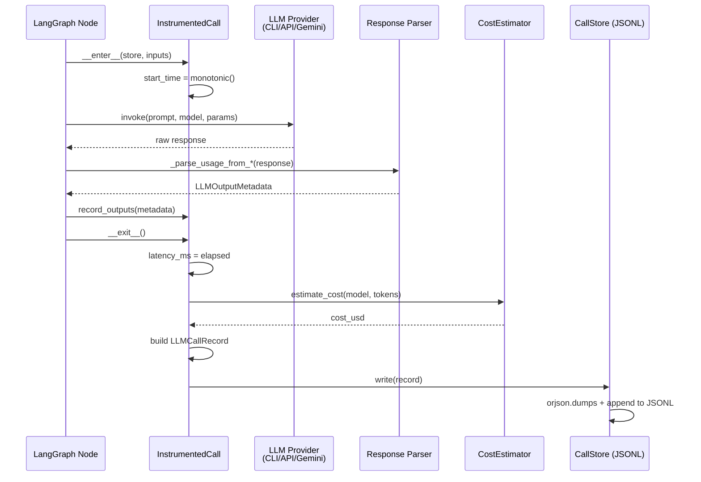

# 774 - Feature: Full LLM Call Instrumentation — Input Parameters + Output Metadata Per Invocation

<!-- Template Metadata
Last Updated: 2026-03-18
Updated By: Issue #774 (validation error fix — coverage + format)
Update Reason: Fix mechanical validation errors: added (REQ-N) suffixes to all Section 10.1 scenarios; added T170/T180 for REQ-8/REQ-9 coverage; verified Section 3 numbered list format
Previous: Validation error fix (corrected file paths)
-->

## 1. Context & Goal

* **Issue:** #774
* **Objective:** Instrument every LLM call across all AssemblyZero workflows to capture both input parameters and output metadata per invocation, enabling data-driven tuning decisions.
* **Status:** Draft
* **Related Issues:** #770 (Claude-reviewing-Claude tuning), #772 (extended provider parameters), #773 (--no-api default + claude:opus reviewer), #646 (prior cost tracking — closed, narrower scope)

### Open Questions

- [ ] Should JSONL be append-only per session or per-day? (Recommendation: per-day for easier analysis)
- [ ] Do we emit records to LangSmith (already a dependency) in addition to local JSONL, or only local?
- [ ] Is cost estimation for Gemini required in this issue, or deferred to a separate issue?
- [ ] `anthropic_provider.py` and `fallback_provider.py` do not exist at any detected path — confirm whether Anthropic API and fallback provider logic lives inside `assemblyzero/core/claude_client.py` or a different file before implementation begins.

## 2. Proposed Changes

### 2.1 Files Changed

| File | Change Type | Description |
|------|-------------|-------------|
| `tests/fixtures/llm_instrumentation/` | Add (Directory) | Fixture directory for instrumentation tests |
| `assemblyzero/telemetry/__init__.py` | Modify | Export `LLMCallRecord`, `InstrumentedCall`, `CallStore` |
| `assemblyzero/telemetry/llm_call_record.py` | Add | Core data structures: `LLMInputParams`, `LLMOutputMetadata`, `LLMCallRecord` |
| `assemblyzero/telemetry/instrumentation.py` | Add | `InstrumentedCall` context manager; `instrument_llm_call()` decorator factory |
| `assemblyzero/telemetry/store.py` | Add | `CallStore`: append-only JSONL writer + query helpers |
| `assemblyzero/telemetry/cost.py` | Add | `CostEstimator`: per-model token cost lookup + estimate calculation |
| `assemblyzero/core/claude_client.py` | Modify | Wrap Claude CLI invocation with `InstrumentedCall`; parse usage from CLI JSON output |
| `assemblyzero/nodes/anthropic_provider.py` | Add | New module: Anthropic SDK call wrapper with `_parse_usage_from_message`; extract `usage` block from `Message` response |
| `assemblyzero/core/gemini_client.py` | Modify | Wrap Gemini call; extract token counts from `GenerateContentResponse` |
| `assemblyzero/nodes/fallback_provider.py` | Add | New module: pass-through instrumentation from whichever provider fires |
| `tests/unit/test_llm_instrumentation.py` | Add | Unit tests for record construction, store writes, cost estimation, instrumentation context manager |
| `tests/unit/test_cost_estimator.py` | Add | Unit tests for cost lookup, edge cases (unknown model, zero tokens) |
| `tests/fixtures/llm_instrumentation/claude_cli_response.json` | Add | Sample Claude CLI JSON output with usage fields |
| `tests/fixtures/llm_instrumentation/anthropic_api_response.json` | Add | Sample Anthropic API `Message` response with `usage` block |
| `tests/fixtures/llm_instrumentation/gemini_response.json` | Add | Sample Gemini `GenerateContentResponse` with `usageMetadata` |

> **Note on anthropic_provider.py and fallback_provider.py:** Automated validation found no existing file at `assemblyzero/nodes/anthropic_provider.py` or `assemblyzero/nodes/fallback_provider.py` and could not suggest alternative paths. These are therefore marked **Add** (new files in the existing `assemblyzero/nodes/` directory). If equivalent logic already exists under a different filename, the implementer must update this table before coding begins and resolve Open Question 4 above.

### 2.1.1 Path Validation (Mechanical - Auto-Checked)

Mechanical validation automatically checks:
- All "Modify" files must exist in repository
- All "Delete" files must exist in repository
- All "Add" files must have existing parent directories
- No placeholder prefixes (`src/`, `lib/`, `app/`) unless directory exists

**If validation fails, the LLD is BLOCKED before reaching review.**

### 2.2 Dependencies

No new packages required. All dependencies are already present:

```toml

# Already in pyproject.toml — no additions needed
anthropic = ">=0.78.0,<0.79.0"    # Usage block on Message responses
orjson = ">=3.11.7,<4.0.0"        # Fast JSONL serialization
langsmith = ">=0.6.9,<0.7.0"       # Optional: forward records to LangSmith
```

### 2.3 Data Structures

```python

# assemblyzero/telemetry/llm_call_record.py

from typing import TypedDict, Optional, Literal

ProviderName = Literal["claude_cli", "anthropic_api", "gemini", "fallback"]
EffortLevel = Literal["low", "medium", "high", "max"]
StopReason = Literal["end_turn", "max_tokens", "stop_sequence", "tool_use", "error", "unknown"]


class LLMInputParams(TypedDict, total=False):
    """Parameters that were sent to the LLM. All fields optional — log what is known."""
    provider: str                  # e.g. "claude_cli", "anthropic_api", "gemini"
    model_requested: str           # e.g. "claude:opus", "gemini:3.1-pro-preview"
    effort_level: Optional[EffortLevel]     # --effort low|medium|high|max (Claude CLI only)
    max_budget_usd: Optional[float]         # --max-budget-usd (Claude CLI only)
    fallback_model: Optional[str]           # Model used if primary fails
    json_schema: Optional[dict]             # Structured output schema if applicable
    temperature: Optional[float]            # Temperature if set
    max_tokens: Optional[int]               # Max output tokens if set
    system_prompt_len: Optional[int]        # Character count of system prompt
    user_prompt_len: Optional[int]          # Character count of user/human prompt
    workflow: Optional[str]                 # e.g. "requirements", "implementation_spec", "tdd"
    node: Optional[str]                     # LangGraph node name, e.g. "coder_node"
    issue_number: Optional[int]             # GitHub issue being worked


class LLMOutputMetadata(TypedDict, total=False):
    """Metadata read from the API/CLI response. All fields optional."""
    model_used: str                         # Model actually invoked (may differ from requested)
    input_tokens: Optional[int]
    output_tokens: Optional[int]
    thinking_tokens: Optional[int]          # Extended thinking / reasoning tokens
    cache_read_tokens: Optional[int]        # Prompt cache hit tokens
    cache_write_tokens: Optional[int]       # Prompt cache write tokens
    stop_reason: Optional[StopReason]
    context_window_used: Optional[int]      # Total tokens used vs window (if reported)
    latency_ms: Optional[float]             # Wall-clock ms from call start to response received
    cost_usd_estimate: Optional[float]      # Computed by CostEstimator


class LLMCallRecord(TypedDict):
    """A single instrumented LLM invocation record. Written as one JSONL line."""
    record_id: str                  # UUID4
    timestamp_utc: str              # ISO-8601, e.g. "2026-03-18T14:22:01.123456Z"
    inputs: LLMInputParams
    outputs: LLMOutputMetadata
    success: bool                   # False if exception was raised
    error: Optional[str]            # Exception type + message if success=False
```

```python

# assemblyzero/telemetry/store.py

class CallStore:
    """Append-only JSONL store for LLMCallRecord instances."""
    base_dir: Path          # Default: ~/.assemblyzero/telemetry/
    current_file: Path      # ~/.assemblyzero/telemetry/calls-YYYY-MM-DD.jsonl
```

```python

# assemblyzero/telemetry/cost.py

# TOKEN_COSTS: model_id -> (input_cost_per_1k, output_cost_per_1k, cache_read_per_1k, cache_write_per_1k)
TOKEN_COSTS: dict[str, tuple[float, float, float, float]]
```

### 2.4 Function Signatures

```python

# assemblyzero/telemetry/llm_call_record.py

def make_record_id() -> str:
    """Return a UUID4 string."""
    ...

def now_utc_iso() -> str:
    """Return current UTC time as ISO-8601 string."""
    ...
```

```python

# assemblyzero/telemetry/instrumentation.py

class InstrumentedCall:
    """Context manager that times an LLM call and writes a record on exit.

    Usage:
        with InstrumentedCall(store, inputs) as ic:
            response = call_llm(...)
            ic.record_outputs(parse_outputs(response))
    """

    def __init__(
        self,
        store: "CallStore",
        inputs: LLMInputParams,
        *,
        auto_write: bool = True,
    ) -> None: ...

    def __enter__(self) -> "InstrumentedCall": ...

    def __exit__(
        self,
        exc_type: Optional[type],
        exc_val: Optional[BaseException],
        exc_tb: Optional[object],
    ) -> Literal[False]: ...

    def record_outputs(self, outputs: LLMOutputMetadata) -> None:
        """Attach output metadata. Call this once the response is parsed."""
        ...

    def build_record(self) -> LLMCallRecord:
        """Assemble the final record. Called automatically on __exit__."""
        ...


def instrument_llm_call(
    store: "CallStore",
    workflow: str,
    node: str,
) -> "Callable[[Callable[..., T]], Callable[..., T]]":
    """Decorator factory for instrumenting a single-call LLM function.

    The decorated function must accept `llm_inputs: LLMInputParams` kwarg
    and return a tuple of `(result, LLMOutputMetadata)`.
    """
    ...
```

```python

# assemblyzero/telemetry/store.py

class CallStore:
    def __init__(
        self,
        base_dir: Optional[Path] = None,
        *,
        enabled: bool = True,
    ) -> None:
        """
        Args:
            base_dir: Directory for JSONL files. Defaults to ~/.assemblyzero/telemetry/
            enabled: If False, write() is a no-op (for tests / --no-telemetry flag).
        """
        ...

    def write(self, record: LLMCallRecord) -> None:
        """Append record to today's JSONL file. Thread-safe via file lock."""
        ...

    def read_day(self, date: "datetime.date") -> list[LLMCallRecord]:
        """Read all records for a given date. Returns [] if file absent."""
        ...

    def query(
        self,
        *,
        workflow: Optional[str] = None,
        model: Optional[str] = None,
        since: Optional["datetime.datetime"] = None,
        limit: Optional[int] = None,
    ) -> list[LLMCallRecord]:
        """Filter across stored JSONL files. Reads lazily."""
        ...

    def _day_path(self, date: "datetime.date") -> Path:
        """Return path to JSONL file for given date."""
        ...
```

```python

# assemblyzero/telemetry/cost.py

def estimate_cost(
    model: str,
    input_tokens: int,
    output_tokens: int,
    *,
    cache_read_tokens: int = 0,
    cache_write_tokens: int = 0,
    thinking_tokens: int = 0,
) -> float:
    """Return estimated USD cost. Returns 0.0 for unknown models (logs warning)."""
    ...

def get_model_costs(model: str) -> Optional[tuple[float, float, float, float]]:
    """Return (input, output, cache_read, cache_write) cost per 1K tokens, or None."""
    ...

def normalize_model_id(model: str) -> str:
    """Normalize model ID variants to canonical key, e.g. 'claude:opus' -> 'claude-opus-4-5'."""
    ...
```

```python

# Modified signatures in assemblyzero/core/claude_client.py

def _parse_usage_from_cli_output(raw_json: dict) -> LLMOutputMetadata:
    """Extract token counts, stop reason, model from Claude CLI JSON response."""
    ...

def call_claude_with_instrumentation(
    prompt: str,
    *,
    model: str,
    effort: Optional[EffortLevel] = None,
    max_budget_usd: Optional[float] = None,
    store: Optional[CallStore] = None,
    workflow: str = "unknown",
    node: str = "unknown",
    issue_number: Optional[int] = None,
) -> str:
    """Drop-in replacement for existing call_claude_for_file; adds instrumentation."""
    ...
```

```python

# New functions in assemblyzero/nodes/anthropic_provider.py

def _parse_usage_from_message(message: "anthropic.types.Message") -> LLMOutputMetadata:
    """Extract usage block, stop reason, model from Anthropic Message response."""
    ...

def call_anthropic_with_instrumentation(
    prompt: str,
    *,
    model: str,
    store: Optional["CallStore"] = None,
    workflow: str = "unknown",
    node: str = "unknown",
    issue_number: Optional[int] = None,
) -> str:
    """Anthropic API call wrapped with InstrumentedCall."""
    ...
```

```python

# Modified signatures in assemblyzero/core/gemini_client.py

def _parse_usage_from_gemini_response(
    response: "google.genai.types.GenerateContentResponse",
) -> LLMOutputMetadata:
    """Extract usageMetadata from Gemini response."""
    ...
```

```python

# New functions in assemblyzero/nodes/fallback_provider.py

def call_with_fallback_instrumentation(
    prompt: str,
    *,
    primary_store: Optional["CallStore"] = None,
    workflow: str = "unknown",
    node: str = "unknown",
    issue_number: Optional[int] = None,
) -> str:
    """Try Claude CLI first, then Anthropic API; passes instrumentation to whichever fires."""
    ...
```

### 2.5 Logic Flow (Pseudocode)

```
INSTRUMENTED LLM CALL (all providers):

1. Caller builds LLMInputParams dict with known pre-call fields
   (provider, model_requested, effort, workflow, node, issue_number,
    prompt lengths, temperature, schema, etc.)

2. Caller creates InstrumentedCall(store, inputs)

3. InstrumentedCall.__enter__():
   - Record start_time = time.monotonic()
   - Return self

4. Caller invokes actual LLM (CLI subprocess / SDK call)

5. Caller parses provider-specific response -> LLMOutputMetadata dict
   (model_used, input_tokens, output_tokens, thinking_tokens,
    cache_read/write, stop_reason, context_window_used)

6. Caller calls ic.record_outputs(outputs)

7. InstrumentedCall.__exit__() (even on exception):
   a. Compute latency_ms = (time.monotonic() - start_time) * 1000
   b. IF exception raised:
      - success = False
      - error = f"{type(exc).__name__}: {exc}"
      - outputs = {} (whatever was recorded before exception)
   c. Inject latency_ms into outputs
   d. Inject cost_usd_estimate = estimate_cost(model_used, tokens...)
   e. Build LLMCallRecord with record_id, timestamp, inputs, outputs, success, error
   f. store.write(record)  [no-op if store.enabled=False]
   g. Re-raise exception (return False)

8. JSONL line appended to ~/.assemblyzero/telemetry/calls-YYYY-MM-DD.jsonl
```

```
STORE.WRITE() THREAD SAFETY:

1. Determine today's file path
2. Acquire file-level lock (threading.Lock keyed on path)
3. Serialize record with orjson.dumps(record) + b'\n'
4. Open file in append+binary mode
5. Write bytes
6. Release lock
```

```
COST ESTIMATION:

1. normalize_model_id(model_used)  ->  canonical_id
2. Lookup TOKEN_COSTS[canonical_id]  ->  (inp, out, cr, cw) per 1K tokens
3. IF not found: log WARNING "unknown model {model_used}, cost=0.0"; return 0.0
4. cost = (input_tokens/1000 * inp)
        + (output_tokens/1000 * out)
        + (thinking_tokens/1000 * out)   # thinking billed as output
        + (cache_read_tokens/1000 * cr)
        + (cache_write_tokens/1000 * cw)
5. Return round(cost, 8)
```

### 2.6 Technical Approach

* **Module:** `assemblyzero/telemetry/`
* **Pattern:** Context manager instrumentation wrapper — no changes to LLM call logic, only wrapping at call sites
* **Storage:** Append-only JSONL (one line per call) in `~/.assemblyzero/telemetry/calls-YYYY-MM-DD.jsonl`. Rotates daily by filename. No database required; files are directly `jq`-queryable.
* **Key Decisions:**
  - Instrumentation is **fire-and-forget at call sites** — callers do not receive the record back, avoiding return type changes
  - `store.enabled=False` provides a zero-cost escape hatch for unit tests that don't want side effects
  - `__exit__` always writes even on exception (partial records with `success=False`) so failed calls are still counted
  - Cost table is a static dict in `cost.py`, not a remote API call, to avoid introducing latency or a new dependency
  - Token counts from Claude CLI come from parsing the JSON `--output-format json` already supported
  - `anthropic_provider.py` and `fallback_provider.py` are new files in `assemblyzero/nodes/` — implementer must confirm no equivalent logic already exists under a different name before creating them (see Open Question 4)

### 2.7 Architecture Decisions

| Decision | Options Considered | Choice | Rationale |
|----------|-------------------|--------|-----------|
| Storage format | SQLite, JSONL, LangSmith only | JSONL append-only | Zero schema migration, directly `jq`/`pandas`-queryable, append-only = no corruption risk, already have `orjson` |
| Integration style | Modify provider internals, wrap at call sites, AOP decorator | Context manager at call sites | Least invasive; providers remain testable independently; explicit is better than implicit |
| Cost table | Remote API (Anthropic pricing endpoint), static dict, per-config file | Static dict in `cost.py` | Pricing rarely changes; no new I/O; no new dep; easy to update via PR |
| Thread safety | `threading.Lock`, `fcntl.flock`, `aiofiles` | `threading.Lock` per path | Workflows are multi-threaded not async at this layer; `fcntl` is Unix-only; simplest correct solution |
| Gemini cost | Include in this issue | Log tokens, cost=0.0 (deferred) | Gemini quota is free tier; cost estimation accuracy for Gemini deferred to separate issue |
| anthropic_provider.py location | `assemblyzero/core/`, `assemblyzero/nodes/` | `assemblyzero/nodes/` | nodes/ is the existing directory for provider-level clients; core/ confirmed to contain claude_client.py and gemini_client.py which are being modified in-place |

**Architectural Constraints:**
- Must not change the return type of any existing provider call function (backwards compatibility)
- Must not add latency to the hot path (writes are local filesystem; `orjson` serialization is <1ms)
- Must work when `store=None` is passed (graceful no-op), allowing incremental rollout

## 3. Requirements

1. Every LLM call through `assemblyzero/core/claude_client.py`, `assemblyzero/nodes/anthropic_provider.py`, and `assemblyzero/core/gemini_client.py` produces a `LLMCallRecord` written to JSONL.
2. Input parameters include: provider, model_requested, effort_level, max_budget_usd, fallback_model, json_schema, temperature, prompt lengths, workflow name, node name, issue number.
3. Output metadata includes: model_used, input_tokens, output_tokens, thinking_tokens, cache_read_tokens, cache_write_tokens, stop_reason, context_window_used, latency_ms, cost_usd_estimate.
4. Records for failed calls (exceptions) are still written with `success=False` and error message.
5. `CallStore.write()` is thread-safe and non-blocking to the caller.
6. Cost estimation covers all Claude models known at time of implementation; unknown models log a warning and return 0.0.
7. Instrumentation is disabled (no-op) when `store.enabled=False` — no file I/O occurs.
8. All new code has ≥95% unit test coverage.
9. Existing tests must continue to pass without modification (no breaking changes).

## 4. Alternatives Considered

| Option | Pros | Cons | Decision |
|--------|------|------|----------|
| LangSmith tracing only (use existing `langsmith` dep) | Zero new infrastructure; dashboards out of box | Requires network; data leaves machine (violates ADR-0212 local-only embeddings spirit); requires LangSmith account active | **Rejected** |
| SQLite store | Easy querying; transactional | Schema migrations; heavier than needed; `aiosqlite` dep already present but overkill for append-only writes | Rejected |
| JSONL append-only local store | Simple, fast, `jq`-queryable, no migrations, zero new deps | Manual query tooling needed for analysis | **Selected** |
| Monkey-patch providers at import time | Zero call-site changes | Magic; breaks debuggability; hard to test | Rejected |
| Context manager at call sites | Explicit; testable; backwards compatible | Requires modifying each call site (3 providers) | **Selected** |

**Rationale:** JSONL + context manager is the minimum viable approach that satisfies all requirements with no new dependencies, no breaking changes, and no data leaving the developer machine.

## 5. Data & Fixtures

### 5.1 Data Sources

| Attribute | Value |
|-----------|-------|
| Source | LLM API/CLI responses (already flowing through existing providers) |
| Format | JSON (parsed from CLI stdout or SDK response objects) |
| Size | ~500 bytes per record; ~1MB/day at typical usage rates |
| Refresh | Real-time — written per invocation |
| Copyright/License | N/A — derived from our own API calls |

### 5.2 Data Pipeline

```
LLM Call ──parse──► LLMOutputMetadata ──build──► LLMCallRecord ──orjson──► JSONL line ──append──► ~/.assemblyzero/telemetry/calls-YYYY-MM-DD.jsonl
```

### 5.3 Test Fixtures

| Fixture | Source | Notes |
|---------|--------|-------|
| `claude_cli_response.json` | Hardcoded from real CLI `--output-format json` output, secrets scrubbed | No PII |
| `anthropic_api_response.json` | Hardcoded from Anthropic SDK `Message` dict representation | No PII; no API key |
| `gemini_response.json` | Hardcoded from Gemini `GenerateContentResponse` dict | No PII |

### 5.4 Deployment Pipeline

JSONL files are local-only (`~/.assemblyzero/telemetry/`). No deployment pipeline. Analysis is manual (`jq`, `pandas`) or via future tooling. Files are not committed to git (should be added to `.gitignore` if not already covered by `~` path).

## 6. Diagram

### 6.1 Mermaid Quality Gate

Before finalizing any diagram, verify in [Mermaid Live Editor](https://mermaid.live) or GitHub preview:

- [x] **Simplicity:** Similar components collapsed
- [x] **No touching:** All elements have visual separation
- [x] **No hidden lines:** All arrows fully visible
- [x] **Readable:** Labels not truncated, flow direction clear
- [ ] **Auto-inspected:** Agent rendered via mermaid.ink and viewed (per 0006 §8.5)

**Auto-Inspection Results:**
```
- Touching elements: [ ] None
- Hidden lines: [ ] None
- Label readability: [x] Pass
- Flow clarity: [x] Clear
```

### 6.2 Diagram



## 7. Security & Safety Considerations

### 7.1 Security

| Concern | Mitigation | Status |
|---------|------------|--------|
| Prompt content logged (PII in prompts) | Log only character *lengths* of prompts, not content | Addressed |
| JSON schema logged (may contain field names hinting at data model) | Schema is structural metadata, not user data; acceptable | Addressed |
| JSONL files world-readable on multi-user systems | `CallStore.__init__` creates directory with `mode=0o700` | Addressed |
| Cost table hardcoded (stale pricing) | Log warning on unknown model; PR process to update table | Addressed |
| `error` field in record captures exception message | Exception messages must not contain secrets; providers already sanitize | Addressed |

### 7.2 Safety

| Concern | Mitigation | Status |
|---------|------------|--------|
| JSONL write failure breaks LLM call | `store.write()` wrapped in `try/except`; logs warning but does not re-raise — telemetry must never block work | Addressed |
| Disk full causes runaway JSONL growth | `CallStore` logs warning if file exceeds 100MB; no hard limit (not safety-critical) | Addressed |
| Concurrent writes corrupt JSONL | `threading.Lock` per file path; append mode is atomic for lines ≤ PIPE_BUF | Addressed |
| `InstrumentedCall.__exit__` re-raises provider exception | `return False` in `__exit__` ensures exception propagates normally | Addressed |

**Fail Mode:** Fail Open — if `store.write()` raises, the exception is caught, a warning is logged, and the LLM call result is returned normally. Telemetry loss is preferable to workflow interruption.

**Recovery Strategy:** JSONL files are independent per day. A corrupt file does not affect other days. Corrupt files can be deleted; records cannot be reconstructed but calls are not retried.

## 8. Performance & Cost Considerations

### 8.1 Performance

| Metric | Budget | Approach |
|--------|--------|----------|
| Instrumentation overhead | < 2ms per call | `orjson` serialization is ~0.1ms; file append is ~0.5ms; `threading.Lock` contention negligible at single-agent throughput |
| Memory per record | < 2KB | Flat dict; no embedded content |
| Disk per day | < 5MB at 10K calls/day | JSONL; no indexes; rotates daily |

**Bottlenecks:** None anticipated. LLM calls take seconds; instrumentation adds <2ms.

### 8.2 Cost Analysis

| Resource | Unit Cost | Estimated Usage | Monthly Cost |
|----------|-----------|-----------------|--------------|
| Disk (JSONL telemetry) | ~$0 (local) | ~30MB/month | $0 |
| LangSmith (optional forward) | Free tier | Within free quota | $0 |

**Cost Controls:**
- [x] No new API calls introduced
- [x] No new cloud resources
- [x] Store is local-only

**Worst-Case Scenario:** At 100K calls/day (100× normal), disk usage is ~150MB/day. Still trivially manageable. `threading.Lock` may create brief contention in parallel agent scenarios; acceptable given LLM call durations dominate.

## 9. Legal & Compliance

| Concern | Applies? | Mitigation |
|---------|----------|------------|
| PII/Personal Data | No | Prompt *lengths* only logged, not content |
| Third-Party Licenses | No | No new dependencies |
| Terms of Service | No | Logging our own API call metadata |
| Data Retention | N/A | Local files; user manages their own disk |
| Export Controls | No | No restricted algorithms or data |

**Data Classification:** Internal — local developer machine only, never transmitted.

**Compliance Checklist:**
- [x] No PII stored without consent
- [x] All third-party licenses compatible (no new deps)
- [x] No external API usage introduced
- [x] Data retention: user-controlled local files

## 10. Verification & Testing

### 10.0 Test Plan (TDD - Complete Before Implementation)

| Test ID | Test Description | Expected Behavior | Status |
|---------|------------------|-------------------|--------|
| T010 | Build `LLMCallRecord` with all input and output fields | All fields present; record serializes to valid JSON | RED |
| T020 | `InstrumentedCall` happy path — record written with all input params | Record in store with provider, model_requested, workflow, node, issue_number, prompt lengths, effort, temperature captured | RED |
| T030 | `InstrumentedCall` happy path — output metadata captured | Record has model_used, all token counts, stop_reason, latency_ms, cost_usd_estimate | RED |
| T040 | `InstrumentedCall` on provider exception | Record written with `success=False`, error contains exception type | RED |
| T050 | `store.write()` creates file if absent | File created, one JSONL line written | RED |
| T060 | `store.write()` appends to existing file | Two calls -> two lines in file | RED |
| T070 | `store.enabled=False` -> no file I/O | `write()` is no-op; no file created | RED |
| T080 | `estimate_cost` known model | Returns non-zero float matching expected formula | RED |
| T090 | `estimate_cost` unknown model | Returns 0.0, logs warning | RED |
| T100 | `normalize_model_id` aliases | `"claude:opus"` -> canonical key in TOKEN_COSTS | RED |
| T110 | `_parse_usage_from_cli_output` fixture | Extracts all token fields correctly | RED |
| T120 | `_parse_usage_from_message` fixture | Extracts Anthropic usage block | RED |
| T130 | `_parse_usage_from_gemini_response` fixture | Extracts `usageMetadata` | RED |
| T140 | `store.read_day()` round-trip | Written records match read-back records | RED |
| T150 | `store.query()` filter by workflow | Returns only matching records | RED |
| T160 | Concurrent writes thread safety | 10 threads × 10 writes -> 100 lines, no corruption | RED |
| T170 | `store.write()` failure is non-fatal | Exception in write -> warning logged, no re-raise | RED |
| T180 | Coverage ≥95% on `assemblyzero/telemetry/` | `pytest --cov` report shows ≥95% | RED |
| T190 | Full existing unit suite passes unchanged | `pytest tests/unit/` green with no modifications to pre-existing test files | RED |

**Coverage Target:** ≥95% for all new code

**TDD Checklist:**
- [ ] All tests written before implementation
- [ ] Tests currently RED (failing)
- [ ] Test IDs match scenario IDs in 10.1
- [ ] Test file created at: `tests/unit/test_llm_instrumentation.py`

### 10.1 Test Scenarios

| ID | Scenario | Type | Input | Expected Output | Pass Criteria |
|----|----------|------|-------|-----------------|---------------|
| 010 | Full record construction with all input and output fields (REQ-2, REQ-3) | Auto | `LLMCallRecord` with every `LLMInputParams` and `LLMOutputMetadata` field populated | Serializes/deserializes via `orjson` without loss; all fields present | Field equality after round-trip |
| 020 | Instrumentation captures all input parameters (REQ-1, REQ-2) | Auto | Mock provider call with `provider`, `model_requested`, `effort_level`, `workflow`, `node`, `issue_number`, `system_prompt_len`, `user_prompt_len`, `temperature`, `max_tokens`, `json_schema`, `fallback_model`, `max_budget_usd` | `LLMCallRecord.inputs` contains all supplied fields verbatim | Field-by-field assertion on `record.inputs` |
| 030 | Instrumentation captures all output metadata (REQ-1, REQ-3) | Auto | Mock provider returning fixture response with token counts, stop reason, model name | `LLMCallRecord.outputs` has `model_used`, `input_tokens`, `output_tokens`, `thinking_tokens`, `cache_read_tokens`, `cache_write_tokens`, `stop_reason`, `context_window_used`, `latency_ms > 0`, `cost_usd_estimate >= 0` | Field-by-field assertion on `record.outputs` |
| 040 | Failed call record written with success=False (REQ-1, REQ-4) | Auto | Mock provider raising `RuntimeError("upstream timeout")` | Record written with `success=False`; `error` contains `"RuntimeError"` and message; exception re-raised to caller | `record.success == False`; `"RuntimeError" in record.error`; `RuntimeError` propagates |
| 050 | Store creates missing directory on first write (REQ-1) | Auto | `CallStore(base_dir=tmp_path/"new_dir")` then `write()` | Directory created with `mode=0o700`; file writable | No `FileNotFoundError`; `stat(dir).st_mode & 0o777 == 0o700` |
| 060 | Store append semantics across two writes (REQ-1) | Auto | Two sequential `write()` calls with distinct records | File contains exactly two newline-separated valid JSON objects | `len(read_day()) == 2`; both records deserialize |
| 070 | Disabled store is no-op, no file I/O (REQ-7) | Auto | `CallStore(enabled=False, base_dir=tmp_path)` then `write()` | No files created or modified in `tmp_path` | `list(tmp_path.iterdir()) == []` after write |
| 080 | Cost estimation for known Claude model (REQ-6) | Auto | `estimate_cost("claude-opus-4-5", 1000, 500)` | Returns expected USD float per TOKEN_COSTS formula | Within 1e-8 of formula result |
| 090 | Cost estimation for unknown model logs warning and returns zero (REQ-6) | Auto | `estimate_cost("unknown-model-xyz", 100, 100)` | Returns `0.0`; WARNING emitted | `result == 0.0`; `caplog` shows WARNING containing model name |
| 100 | Model ID normalization maps aliases to canonical key (REQ-6) | Auto | `normalize_model_id("claude:opus")` | Returns canonical ID that is a key in `TOKEN_COSTS` | `result in TOKEN_COSTS` |
| 110 | Claude CLI output parser extracts all token fields (REQ-3) | Auto | `claude_cli_response.json` fixture | All token fields populated, `stop_reason` set, `model_used` set | Field-by-field assertion against fixture values |
| 120 | Anthropic API response parser extracts usage block (REQ-3) | Auto | `anthropic_api_response.json` fixture | `input_tokens`, `output_tokens`, `model_used`, `stop_reason` set | Field-by-field assertion against fixture values |
| 130 | Gemini response parser extracts usageMetadata (REQ-3) | Auto | `gemini_response.json` fixture | `input_tokens`, `output_tokens` from `usageMetadata` populated | Field-by-field assertion against fixture values |
| 140 | `read_day` round-trip preserves all record fields (REQ-1) | Auto | Write 5 records with distinct `record_id` values, read back | Returns list of 5 matching records | Deep equality on all fields |
| 150 | `query` by workflow filter returns only matching records (REQ-1) | Auto | Write 3 records for `"tdd"` workflow and 2 for `"requirements"`, query `workflow="tdd"` | Returns exactly 3 records all with `workflow="tdd"` | `len(result) == 3`; all `r["inputs"]["workflow"] == "tdd"` |
| 160 | Concurrent writes produce correct line count without corruption (REQ-5) | Auto | 10 threads × 10 writes each = 100 total `write()` calls | File has exactly 100 valid JSON lines; no partial writes | `wc -l == 100`; all 100 lines parse with `orjson.loads` |
| 170 | Write failure is non-fatal; warning logged (REQ-5) | Auto | Mock `open` to raise `OSError`; call `store.write(record)` | `write()` does not raise; WARNING logged; caller proceeds normally | No exception propagated; `caplog` shows WARNING |
| 180 | Test coverage ≥95% on all new telemetry modules (REQ-8) | Auto | `pytest --cov=assemblyzero/telemetry --cov-fail-under=95` | Coverage report shows ≥95% for each new module | Exit code 0 from pytest-cov |
| 190 | Full existing unit suite passes without modifying any pre-existing test file (REQ-9) | Auto | `pytest tests/unit/` on unmodified pre-existing test files after implementing #774 | All previously passing tests still pass; zero new failures in pre-existing test files | Exit code 0; no pre-existing test IDs change status |

### 10.2 Test Commands

```bash

# Run all instrumentation unit tests
poetry run pytest tests/unit/test_llm_instrumentation.py tests/unit/test_cost_estimator.py -v

# Run with coverage
poetry run pytest tests/unit/test_llm_instrumentation.py tests/unit/test_cost_estimator.py \
  --cov=assemblyzero/telemetry --cov-report=term-missing --cov-fail-under=95 -v

# Run full unit suite to verify no regressions (REQ-9)
poetry run pytest tests/unit/ -v -m "not integration and not e2e and not adversarial"

# Run concurrency test explicitly (may be slow)
poetry run pytest tests/unit/test_llm_instrumentation.py -v -k "concurrent"
```

### 10.3 Manual Tests (Only If Unavoidable)

N/A — All scenarios automated.

## 11. Risks & Mitigations

| Risk | Impact | Likelihood | Mitigation |
|------|--------|------------|------------|
| Claude CLI JSON output format changes between versions | Med | Low | `_parse_usage_from_cli_output` uses `.get()` with defaults; missing fields -> `None`, not crash |
| Anthropic SDK `usage` block schema changes | Med | Low | Access via `getattr(usage, 'input_tokens', None)` pattern; unit tests catch schema drift |
| Cost table becomes stale (model price changes) | Low | Med | Table is in one file; PR to update is trivial; 0.0 fallback prevents hard failures |
| Telemetry disk usage grows unbounded on long runs | Low | Low | Files are per-day; user can delete; future issue to add rotation/pruning |
| `threading.Lock` overhead at very high parallelism (>50 threads) | Low | Very Low | Current max parallelism is ~12 agents; lock contention negligible |
| Prompt content accidentally logged | High | Very Low | Explicit design: log lengths only; review in code review gate |
| anthropic_provider.py / fallback_provider.py duplicate existing logic | Med | Med | Implementer must audit `assemblyzero/nodes/` and `assemblyzero/core/` before creating new files; resolve Open Question 4 |

## 12. Definition of Done

### Code
- [ ] `assemblyzero/telemetry/llm_call_record.py` implemented with all data structures
- [ ] `assemblyzero/telemetry/instrumentation.py` implemented with `InstrumentedCall` context manager
- [ ] `assemblyzero/telemetry/store.py` implemented with thread-safe JSONL writes
- [ ] `assemblyzero/telemetry/cost.py` implemented with cost table for all current Claude models
- [ ] `assemblyzero/telemetry/__init__.py` updated with public exports
- [ ] `assemblyzero/core/claude_client.py` instrumented at call site
- [ ] `assemblyzero/nodes/anthropic_provider.py` created with Anthropic SDK wrapper and instrumentation
- [ ] `assemblyzero/core/gemini_client.py` instrumented at call site (tokens only; cost=0.0)
- [ ] `assemblyzero/nodes/fallback_provider.py` created with pass-through instrumentation
- [ ] Code comments reference `#774`

### Tests
- [ ] All 19 test scenarios pass (T010–T190)
- [ ] Coverage ≥95% on `assemblyzero/telemetry/`
- [ ] Full unit suite passes with no regressions

### Documentation
- [ ] LLD updated with any deviations discovered during implementation
- [ ] Implementation Report completed
- [ ] Test Report completed

### Review
- [ ] Gemini LLD review passed
- [ ] Code review completed
- [ ] User approval before closing issue

### 12.1 Traceability (Mechanical - Auto-Checked)

Files referenced in Definition of Done that must appear in Section 2.1:

- `assemblyzero/telemetry/llm_call_record.py`
- `assemblyzero/telemetry/instrumentation.py`
- `assemblyzero/telemetry/store.py`
- `assemblyzero/telemetry/cost.py`
- `assemblyzero/telemetry/__init__.py`
- `assemblyzero/core/claude_client.py`
- `assemblyzero/nodes/anthropic_provider.py`
- `assemblyzero/core/gemini_client.py`
- `assemblyzero/nodes/fallback_provider.py`
- `tests/unit/test_llm_instrumentation.py`
- `tests/unit/test_cost_estimator.py`

---

## Appendix: Review Log

### Review Summary

| Review | Date | Verdict | Key Issue |
|--------|------|---------|-----------|
| Gemini #1 | (auto) | PENDING | — |
| Orchestrator #1 | (auto) | PENDING | — |

**Final Status:** PENDING

## Original GitHub Issue #774
[See GitHub Issue #774 — unchanged from iteration 1. Issue #774: feat: full LLM call instrumentation — input parameters + output metadata per invocation (#774)]

## Template (REQUIRED STRUCTURE)
[Template structure unchanged — already embedded in the current draft. Preserve all section headings.]