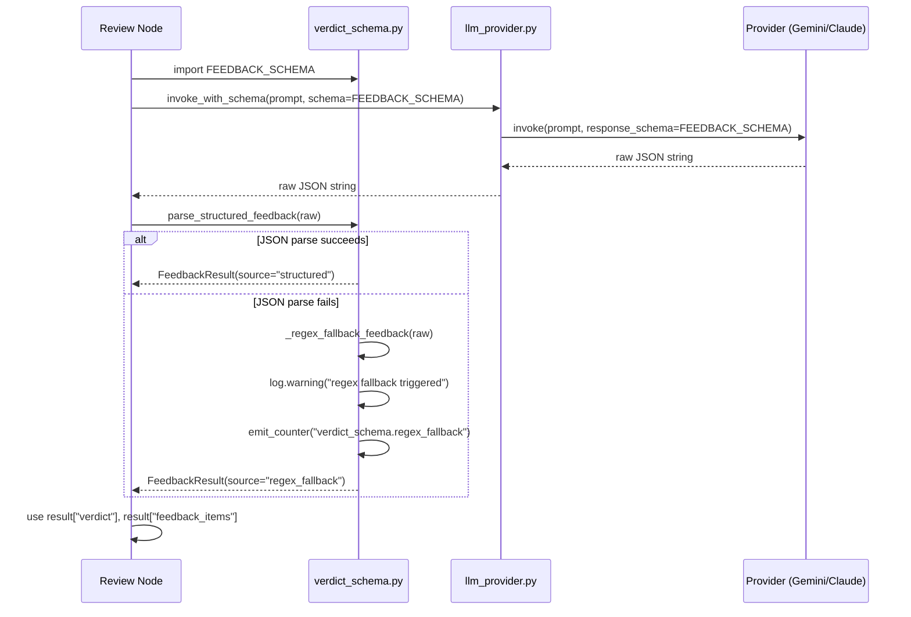

# 775 - Refactor: Eliminate Regex LLM Output Parsing — Use response_schema/--json-schema Everywhere

<!-- Template Metadata
Last Updated: 2026-03-19
Updated By: Issue #775 initial draft
Update Reason: New LLD for structured output refactor
Previous: N/A
-->

## 1. Context & Goal
* **Issue:** #775
* **Objective:** Replace all fragile regex-based LLM reviewer output parsing in 6 files with native structured JSON output via `response_schema` (Gemini) and `--json-schema` (Claude CLI), using the existing `verdict_schema.py` infrastructure as the foundation.
* **Status:** Draft
* **Related Issues:** #773 (--no-api default + claude:opus reviewer), #774 (full LLM call instrumentation), #492 (original structured verdict work — partial)

### Open Questions
*Questions that need clarification before or during implementation. Remove when resolved.*

- [ ] Does `ClaudeCLIProvider.invoke()` already accept a `json_schema` kwarg, or must it be added as part of this issue?
- [ ] Should the regex fallback log at `WARNING` level (triggering alerts) or `DEBUG` level (silent monitoring)?
- [ ] Are there existing integration tests for the 6 review nodes that exercise the full round-trip with a real provider?

## 2. Proposed Changes

*This section is the **source of truth** for implementation. Describe exactly what will be built.*

### 2.1 Files Changed

| File | Change Type | Description |
|------|-------------|-------------|
| `assemblyzero/core/verdict_schema.py` | Modify | Extend with `FEEDBACK_SCHEMA`, `QUESTIONS_SCHEMA`, `REVIEW_SPEC_SCHEMA`, `DRAFT_QUESTIONS_SCHEMA`, `FINALIZE_QUESTIONS_SCHEMA`; add corresponding `parse_*` helpers |
| `assemblyzero/core/llm_provider.py` | Modify | Add `json_schema` kwarg to `ClaudeCLIProvider.invoke()` mapping to `--json-schema` flag; ensure `GeminiProvider.invoke()` accepts `response_schema` kwarg consistently |
| `assemblyzero/workflows/requirements/nodes/review.py` | Modify | Replace verdict checkbox regex (lines 306-312), feedback section regex (lines 456, 512, 570), and open-question list regex (lines 521, 527) with structured JSON calls |
| `assemblyzero/workflows/implementation_spec/nodes/review_spec.py` | Modify | Replace verdict checkbox regex (lines 497-515) and feedback extraction regex (line 599) with structured JSON calls |
| `assemblyzero/workflows/testing/nodes/review_test_plan.py` | Modify | Replace `_parse_verdict()` regex fallback (line 614+) with structured JSON; keep regex as last-resort with `WARNING` log |
| `assemblyzero/workflows/requirements/nodes/generate_draft.py` | Modify | Replace open-questions section extraction regex (line 582) and unchecked-question list regex (line 591) with structured JSON call |
| `assemblyzero/workflows/requirements/nodes/finalize.py` | Modify | Replace question/TODO detection regex (lines 219, 223) with structured JSON call |
| `tests/unit/test_verdict_schema.py` | Add | Unit tests for all new schemas, parse helpers, and fallback behaviour |
| `tests/unit/test_llm_provider_json_schema.py` | Add | Unit tests for `ClaudeCLIProvider.invoke()` with `json_schema` kwarg; CLI flag injection |
| `tests/unit/test_review_structured_output.py` | Add | Unit tests for requirements review node with mocked structured output |
| `tests/unit/test_review_spec_structured_output.py` | Add | Unit tests for implementation spec review node with mocked structured output |
| `tests/unit/test_review_test_plan_structured_output.py` | Add | Unit tests for test-plan review node fallback warning |
| `tests/unit/test_generate_draft_structured_output.py` | Add | Unit tests for draft generation node open-questions extraction |
| `tests/unit/test_finalize_structured_output.py` | Add | Unit tests for finalize node question/TODO detection |
| `tests/fixtures/verdict_analyzer/structured_verdict_samples.json` | Add | Golden-file fixtures for all new schema shapes used in tests |

### 2.1.1 Path Validation (Mechanical - Auto-Checked)

Mechanical validation automatically checks:
- All "Modify" files must exist in repository
- All "Delete" files must exist in repository
- All "Add" files must have existing parent directories
- No placeholder prefixes (`src/`, `lib/`, `app/`) unless directory exists

**If validation fails, the LLD is BLOCKED before reaching review.**

### 2.2 Dependencies

No new packages required. All functionality is available via existing `google-genai`, `anthropic`, and standard library dependencies.

```toml

# No pyproject.toml additions required
```

### 2.3 Data Structures

```python

# assemblyzero/core/verdict_schema.py — new schema shapes

# Existing (already in file):
VERDICT_SCHEMA = {
    "type": "object",
    "properties": {
        "verdict": {"type": "string", "enum": ["APPROVED", "REVISE", "DISCUSS", "BLOCKED"]},
        "rationale": {"type": "string"},
    },
    "required": ["verdict", "rationale"],
}

# New — for requirements/review.py feedback sections
FEEDBACK_SCHEMA = {
    "type": "object",
    "properties": {
        "verdict": {"type": "string", "enum": ["APPROVED", "REVISE", "DISCUSS"]},
        "rationale": {"type": "string"},
        "feedback_items": {
            "type": "array",
            "items": {"type": "string"},
        },
        "open_questions": {
            "type": "array",
            "items": {
                "type": "object",
                "properties": {
                    "text": {"type": "string"},
                    "resolved": {"type": "boolean"},
                },
                "required": ["text", "resolved"],
            },
        },
        "resolved_issues": {
            "type": "array",
            "items": {"type": "string"},
        },
    },
    "required": ["verdict", "rationale", "feedback_items", "open_questions"],
}

# New — for implementation_spec/review_spec.py
REVIEW_SPEC_SCHEMA = {
    "type": "object",
    "properties": {
        "verdict": {"type": "string", "enum": ["APPROVED", "REVISE", "BLOCKED"]},
        "rationale": {"type": "string"},
        "feedback_items": {
            "type": "array",
            "items": {"type": "string"},
        },
    },
    "required": ["verdict", "rationale", "feedback_items"],
}

# New — for requirements/generate_draft.py
DRAFT_QUESTIONS_SCHEMA = {
    "type": "object",
    "properties": {
        "open_questions": {
            "type": "array",
            "items": {
                "type": "object",
                "properties": {
                    "text": {"type": "string"},
                    "resolved": {"type": "boolean"},
                },
                "required": ["text", "resolved"],
            },
        },
    },
    "required": ["open_questions"],
}

# New — for requirements/finalize.py
FINALIZE_QUESTIONS_SCHEMA = {
    "type": "object",
    "properties": {
        "has_open_questions": {"type": "boolean"},
        "question_count": {"type": "integer"},
        "questions": {
            "type": "array",
            "items": {"type": "string"},
        },
    },
    "required": ["has_open_questions", "question_count", "questions"],
}

# Internal parse result TypedDicts
class VerdictResult(TypedDict):
    verdict: str        # "APPROVED" | "REVISE" | "DISCUSS" | "BLOCKED"
    rationale: str
    source: str         # "structured" | "regex_fallback"

class FeedbackResult(TypedDict):
    verdict: str
    rationale: str
    feedback_items: list[str]
    open_questions: list[dict]   # {text: str, resolved: bool}
    resolved_issues: list[str]
    source: str

class ReviewSpecResult(TypedDict):
    verdict: str
    rationale: str
    feedback_items: list[str]
    source: str

class DraftQuestionsResult(TypedDict):
    open_questions: list[dict]   # {text: str, resolved: bool}
    source: str

class FinalizeQuestionsResult(TypedDict):
    has_open_questions: bool
    question_count: int
    questions: list[str]
    source: str
```

### 2.4 Function Signatures

```python

# assemblyzero/core/verdict_schema.py — new parse helpers

def parse_structured_feedback(raw: str) -> FeedbackResult:
    """Parse structured JSON feedback response into FeedbackResult.

    Falls back to legacy regex parsing with WARNING log if JSON parse fails.
    Sets result['source'] = 'structured' or 'regex_fallback' accordingly.
    """
    ...

def parse_structured_review_spec(raw: str) -> ReviewSpecResult:
    """Parse structured JSON review-spec response into ReviewSpecResult.

    Falls back to legacy regex parsing with WARNING log if JSON parse fails.
    """
    ...

def parse_structured_draft_questions(raw: str) -> DraftQuestionsResult:
    """Parse structured JSON open-questions response into DraftQuestionsResult.

    Falls back to regex section extraction with WARNING log if JSON parse fails.
    """
    ...

def parse_structured_finalize_questions(raw: str) -> FinalizeQuestionsResult:
    """Parse structured JSON question-detection response into FinalizeQuestionsResult.

    Falls back to regex line-scan with WARNING log if JSON parse fails.
    """
    ...

def _regex_fallback_verdict(raw: str) -> VerdictResult:
    """Last-resort regex extraction for verdict checkbox patterns.

    Logs WARNING when invoked. Never raises; returns verdict='UNKNOWN' if all patterns fail.
    """
    ...

def _regex_fallback_feedback(raw: str) -> FeedbackResult:
    """Last-resort regex extraction for feedback section patterns.

    Logs WARNING when invoked.
    """
    ...

# assemblyzero/core/llm_provider.py — extended ClaudeCLIProvider

class ClaudeCLIProvider(LLMProvider):
    def invoke(
        self,
        prompt: str,
        *,
        system: str | None = None,
        model: str | None = None,
        max_tokens: int | None = None,
        json_schema: dict | None = None,   # NEW: maps to --json-schema <inline-json>
        **kwargs: Any,
    ) -> str:
        """Invoke Claude CLI with optional structured JSON output schema.

        When json_schema is provided, appends --json-schema '<json>' to the
        CLI invocation. The response is expected to be valid JSON conforming
        to the schema.
        """
        ...

# assemblyzero/workflows/requirements/nodes/review.py — refactored call sites

def _invoke_reviewer_with_feedback_schema(
    provider: LLMProvider,
    prompt: str,
    system: str,
) -> FeedbackResult:
    """Call reviewer with FEEDBACK_SCHEMA and parse structured response.

    Passes response_schema for Gemini, json_schema for ClaudeCLIProvider.
    Falls back to regex if structured parse fails (logs WARNING).
    """
    ...

# assemblyzero/workflows/implementation_spec/nodes/review_spec.py

def _invoke_reviewer_with_spec_schema(
    provider: LLMProvider,
    prompt: str,
    system: str,
) -> ReviewSpecResult:
    """Call spec reviewer with REVIEW_SPEC_SCHEMA and parse structured response."""
    ...

# assemblyzero/workflows/testing/nodes/review_test_plan.py

def _parse_verdict(raw: str) -> VerdictResult:
    """Parse verdict from test-plan reviewer response.

    Primary path: structured JSON via VERDICT_SCHEMA.
    Fallback: regex with WARNING log.
    Previously: regex-only.
    """
    ...

# assemblyzero/workflows/requirements/nodes/generate_draft.py

def _extract_open_questions(
    provider: LLMProvider,
    draft_text: str,
) -> DraftQuestionsResult:
    """Extract open questions from draft using DRAFT_QUESTIONS_SCHEMA.

    Passes schema to provider; falls back to regex section extraction on failure.
    """
    ...

# assemblyzero/workflows/requirements/nodes/finalize.py

def _detect_open_questions(
    provider: LLMProvider,
    requirements_text: str,
) -> FinalizeQuestionsResult:
    """Detect unresolved questions/TODOs using FINALIZE_QUESTIONS_SCHEMA.

    Passes schema to provider; falls back to regex line-scan on failure.
    """
    ...
```

### 2.5 Logic Flow (Pseudocode)

```
=== Provider Dispatch (used by all 6 refactored call sites) ===

FUNCTION invoke_with_schema(provider, prompt, system, schema):
    IF provider IS GeminiProvider:
        raw = provider.invoke(prompt, system=system, response_schema=schema)
    ELSE IF provider IS ClaudeCLIProvider OR FallbackProvider:
        raw = provider.invoke(prompt, system=system, json_schema=schema)
    ELSE:
        raw = provider.invoke(prompt, system=system)
        # AnthropicProvider has no structured output path yet; fallback parse
    RETURN raw

=== Parse with Fallback (pattern repeated for each schema type) ===

FUNCTION parse_structured_feedback(raw):
    TRY:
        data = json.loads(raw)
        validate_against_schema(data, FEEDBACK_SCHEMA)
        RETURN FeedbackResult(**data, source="structured")
    EXCEPT (JSONDecodeError, ValidationError) as e:
        log.warning("Structured feedback parse failed (%s); falling back to regex", e)
        RETURN _regex_fallback_feedback(raw)

=== ClaudeCLIProvider --json-schema injection ===

FUNCTION ClaudeCLIProvider.invoke(prompt, *, json_schema=None, ...):
    cmd = build_base_cmd(prompt, ...)
    IF json_schema IS NOT None:
        schema_str = json.dumps(json_schema)
        cmd += ["--json-schema", schema_str]
    result = run_command(cmd, timeout=...)
    RETURN result.stdout

=== requirements/review.py verdict node ===

BEFORE (regex):
    if re.search(r"\[X\]\s*\**APPROVED\**", response):
        verdict = "APPROVED"
    elif re.search(r"\[X\]\s*\**REVISE\**", response):
        verdict = "REVISE"
    ...

AFTER (structured):
    result = _invoke_reviewer_with_feedback_schema(provider, prompt, system)
    verdict  = result["verdict"]
    feedback = result["feedback_items"]
    questions = [q for q in result["open_questions"] if not q["resolved"]]
    # source == "regex_fallback" triggers WARNING already logged inside parse helper

=== Fallback metric emission (for instrumentation — ref #774) ===

AFTER parsing:
    IF result["source"] == "regex_fallback":
        emit_counter("verdict_schema.regex_fallback", tags={"node": node_name})
```

### 2.6 Technical Approach

* **Module:** `assemblyzero/core/verdict_schema.py` (schema definitions + parse helpers)
* **Module:** `assemblyzero/core/llm_provider.py` (provider dispatch layer)
* **Pattern:** Strategy — schema and fallback logic encapsulated in `verdict_schema.py`; call sites only call `invoke_with_schema` + `parse_structured_*`
* **Key Decisions:**
  - Schemas live in `verdict_schema.py`, not inside individual workflow nodes, to keep parse logic reusable and testable in isolation
  - `response_schema` is **not** stored on the provider instance; it is passed per-call so the same provider can be used for structured and unstructured calls in the same session
  - Regex fallback is kept as a safety net but triggers a `WARNING` log and a counter metric (for #774 instrumentation) every time it fires, making regressions visible
  - `AnthropicProvider` (API fallback) does not yet support structured output natively in this refactor; it will receive the schema in the system prompt as a hint and rely on the regex fallback path

### 2.7 Architecture Decisions

| Decision | Options Considered | Choice | Rationale |
|----------|-------------------|--------|-----------|
| Schema location | Per-node, per-workflow, centralized in `verdict_schema.py` | Centralized | Keeps parse logic testable in isolation; avoids duplication across 6 files |
| Fallback behaviour | Hard fail on parse error, silent fallback, logged fallback | Logged fallback (WARNING + metric) | Prevents regression silently going unnoticed while not breaking production runs |
| `response_schema` passing | Store on provider, pass per-call, embed in prompt | Pass per-call kwarg | Issue requirement: "response_schema is passed to provider.invoke(), not stored on the provider instance" |
| AnthropicProvider structured output | Block until supported, prompt-hint only, skip entirely | Prompt-hint with regex fallback | AnthropicAPI is a paid fallback path; engineering cost of full structured output doesn't justify the rarity of its invocation |
| Validation of schema conformance | jsonschema library, manual key checks, duck-typing | Manual key checks (required fields present) | Avoids new dependency; schemas are small and fixed; jsonschema can be added later if schemas grow |

**Architectural Constraints:**
- Must not break existing callers of `provider.invoke()` that pass no schema — all new kwargs are keyword-only with `None` defaults
- Must not introduce new external Python dependencies
- `VERDICT_SCHEMA` and `parse_structured_verdict()` must remain backward-compatible; new schemas are additive

## 3. Requirements

1. All 6 files listed in the issue audit (P1 group) must have zero regex patterns used as the **primary** parse path for LLM reviewer output after this change.
2. Every LLM call that previously used regex must instead pass a `response_schema` / `json_schema` argument to the provider.
3. Every parse helper must log a `WARNING` and increment a counter metric when the regex fallback path is triggered.
4. `ClaudeCLIProvider.invoke()` must pass `--json-schema '<schema_json>'` on the CLI when `json_schema` is supplied, and must not alter calls where it is absent.
5. `GeminiProvider.invoke()` must forward `response_schema` as a kwarg to the underlying SDK call.
6. All new schemas must be defined in `verdict_schema.py`; no schema literals may appear inside workflow node files.
7. The `source` field in every parse result TypedDict must be `"structured"` for JSON-path responses and `"regex_fallback"` for fallback-path responses.
8. All 15 new/modified test files must pass with `poetry run pytest -m "not integration"`.
9. Existing tests must continue to pass without modification.
10. Coverage for `verdict_schema.py` must be ≥ 95% after this change.

## 4. Alternatives Considered

| Option | Pros | Cons | Decision |
|--------|------|------|----------|
| Remove regex fallback entirely | Cleaner code, forces structured output discipline | Any provider hiccup causes hard failures in production runs | **Rejected** |
| Store schema on provider instance | Simpler call sites | Breaks providers used for both structured and unstructured calls in same session; contradicts issue requirement | **Rejected** |
| Use `jsonschema` library for validation | Rigorous conformance checking | New dependency; over-engineering for small fixed schemas | **Rejected** |
| Centralize schemas in `verdict_schema.py` | Single place to update, testable in isolation | Requires imports in 6 files | **Selected** |
| Per-node schema definitions | Co-located with usage | Duplication, harder to test, harder to audit | **Rejected** |
| Prompt-hint structured output for all providers | No provider changes needed | LLMs frequently ignore prompt-only instructions; defeats the purpose | **Rejected** |

**Rationale:** Centralized schemas with per-call dispatch and a logged-fallback safety net balances correctness, resilience, and maintainability.

## 5. Data & Fixtures

### 5.1 Data Sources

| Attribute | Value |
|-----------|-------|
| Source | Existing LLM reviewer responses (from test fixtures in `tests/fixtures/verdict_analyzer/`) |
| Format | JSON (new) and markdown with checkbox patterns (legacy, for fallback tests) |
| Size | < 50 fixture files, each < 4 KB |
| Refresh | Manual — updated when schema shapes change |
| Copyright/License | Internal / N/A |

### 5.2 Data Pipeline

```
LLM reviewer call ──JSON response──► parse_structured_*() ──TypedDict──► workflow node state
                                          │
                                 JSON parse fails?
                                          │
                                   ──regex fallback──► WARNING log + metric counter
```

### 5.3 Test Fixtures

| Fixture | Source | Notes |
|---------|--------|-------|
| `tests/fixtures/verdict_analyzer/structured_verdict_samples.json` | Generated (hardcoded golden files) | Covers all 5 schema shapes; includes malformed JSON for fallback path tests |
| Existing `tests/fixtures/verdict_analyzer/` contents | Pre-existing | Must remain valid; new fixture file is additive |

### 5.4 Deployment Pipeline

Fixture files are checked into the repository alongside tests. No external data pipeline required.

## 6. Diagram

### 6.1 Mermaid Quality Gate

Before finalizing any diagram, verify in [Mermaid Live Editor](https://mermaid.live) or GitHub preview:

- [x] **Simplicity:** Similar components collapsed
- [x] **No touching:** All elements have visual separation
- [x] **No hidden lines:** All arrows fully visible
- [x] **Readable:** Labels not truncated, flow direction clear
- [ ] **Auto-inspected:** Agent rendered via mermaid.ink and viewed

**Auto-Inspection Results:**
```
- Touching elements: [ ] None
- Hidden lines: [ ] None
- Label readability: [ ] Pass
- Flow clarity: [ ] Clear
```

### 6.2 Diagram



## 7. Security & Safety Considerations

### 7.1 Security

| Concern | Mitigation | Status |
|---------|------------|--------|
| Schema injection via LLM response | `json.loads()` is safe; no `eval()`; schema validation checks expected keys only | Addressed |
| `--json-schema` arg injection in CLI | Schema is serialised via `json.dumps()` and passed as a single quoted argument; no shell interpolation | Addressed |
| Logging sensitive LLM output in WARNING | Fallback log records parse error message only, not the full raw response | Addressed |

### 7.2 Safety

| Concern | Mitigation | Status |
|---------|------------|--------|
| Breaking existing callers of `invoke()` | All new kwargs are keyword-only with `None` defaults; no positional changes | Addressed |
| Regex fallback producing wrong verdict | Fallback result includes `source="regex_fallback"` allowing callers to treat it as lower-confidence | Addressed |
| Schema mismatch causing `KeyError` in node | Parse helpers return TypedDicts with all required keys even in fallback path; helpers never raise | Addressed |
| Incompatible `--json-schema` flag on older Claude CLI | Flag presence checked via version guard; if unsupported, falls back to no-schema invocation with WARNING | Pending |

**Fail Mode:** Fail Open — if both structured parse and regex fallback fail, return a safe default (`verdict="UNKNOWN"`, `feedback_items=[]`) and log ERROR. Workflow continues so human reviewer can intervene.

**Recovery Strategy:** Any node that receives `source="regex_fallback"` or `verdict="UNKNOWN"` should surface a warning in the workflow output to alert the operator.

## 8. Performance & Cost Considerations

### 8.1 Performance

| Metric | Budget | Approach |
|--------|--------|----------|
| Parse overhead per call | < 5 ms | `json.loads()` on small payloads; no external validation library |
| CLI arg length | < 4 KB schema JSON | All 5 schemas are < 800 bytes serialised |
| Memory per parse call | < 1 MB | TypedDicts are stack-allocated; no large intermediate structures |

**Bottlenecks:** None anticipated. The LLM call itself dominates latency by 3–4 orders of magnitude.

### 8.2 Cost Analysis

| Resource | Unit Cost | Estimated Usage | Monthly Cost |
|----------|-----------|-----------------|--------------|
| Additional tokens for schema in prompt | ~$0.001/1K tokens | +200 tokens per review call | Negligible |
| No new API calls introduced | N/A | N/A | $0 |

**Cost Controls:**
- [ ] No new LLM calls — schemas are passed as metadata to existing calls
- [x] Rate limiting unchanged — no new call paths

**Worst-Case Scenario:** Structured output forces the model to be more verbose, increasing token usage by ~10%. Acceptable given the reliability improvement.

## 9. Legal & Compliance

| Concern | Applies? | Mitigation |
|---------|----------|------------|
| PII/Personal Data | No | Schemas operate on LLM-generated text; no user PII in schema definitions |
| Third-Party Licenses | No | No new dependencies added |
| Terms of Service | No | `response_schema` / `--json-schema` are documented, supported features of both providers |
| Data Retention | No | Parse results are transient workflow state; no new persistence |
| Export Controls | N/A | No restricted algorithms |

**Data Classification:** Internal

**Compliance Checklist:**
- [x] No PII stored without consent
- [x] All third-party licenses compatible
- [x] External API usage compliant with provider ToS
- [x] Data retention policy unchanged

## 10. Verification & Testing

### 10.0 Test Plan (TDD - Complete Before Implementation)

**TDD Requirement:** Tests MUST be written and failing BEFORE implementation begins.

| Test ID | Test Description | Expected Behavior | Status |
|---------|------------------|-------------------|--------|
| T010 | `parse_structured_feedback` with valid JSON | Returns `FeedbackResult` with `source="structured"` | RED |
| T020 | `parse_structured_feedback` with malformed JSON | Returns regex-fallback result with `source="regex_fallback"`, logs WARNING | RED |
| T030 | `parse_structured_review_spec` with valid JSON | Returns `ReviewSpecResult` with all required fields | RED |
| T040 | `parse_structured_review_spec` with missing required key | Falls back to regex, logs WARNING | RED |
| T050 | `parse_structured_draft_questions` valid JSON | Returns `DraftQuestionsResult` with correct question list | RED |
| T060 | `parse_structured_finalize_questions` valid JSON | Returns `FinalizeQuestionsResult` with `has_open_questions=True` | RED |
| T070 | `ClaudeCLIProvider.invoke()` with `json_schema` kwarg | CLI command includes `--json-schema '<serialised_schema>'` | RED |
| T080 | `ClaudeCLIProvider.invoke()` without `json_schema` | CLI command does NOT include `--json-schema` flag | RED |
| T090 | `GeminiProvider.invoke()` with `response_schema` | SDK call receives `response_schema` kwarg | RED |
| T100 | Requirements review node verdict extraction | `verdict` from structured result propagated to state correctly | RED |
| T110 | Requirements review node open-questions extraction | Unresolved questions list correctly populated from structured result | RED |
| T120 | Spec review node feedback extraction | `feedback_items` correctly populated from structured result | RED |
| T130 | Test-plan review node `_parse_verdict` structured path | Returns `VerdictResult(source="structured")` | RED |
| T140 | Test-plan review node `_parse_verdict` fallback path | Returns `VerdictResult(source="regex_fallback")`, emits WARNING | RED |
| T150 | `source="regex_fallback"` counter metric emitted | `emit_counter` called with correct tag when fallback fires | RED |

**Coverage Target:** ≥ 95% for `verdict_schema.py`; ≥ 80% for modified node files

**TDD Checklist:**
- [ ] All tests written before implementation
- [ ] Tests currently RED (failing)
- [ ] Test IDs match scenario IDs in 10.1
- [ ] Test files created at: `tests/unit/test_verdict_schema.py`, `tests/unit/test_llm_provider_json_schema.py`, `tests/unit/test_review_structured_output.py`, etc.

### 10.1 Test Scenarios

| ID | Scenario | Type | Input | Expected Output | Pass Criteria |
|----|----------|------|-------|-----------------|---------------|
| 010 | `parse_structured_feedback` happy path | Auto | Valid JSON string matching `FEEDBACK_SCHEMA` | `FeedbackResult` with `source="structured"` | All fields populated; no WARNING logged |
| 020 | `parse_structured_feedback` malformed JSON | Auto | `"[X] **APPROVED**\n\nFeedback: ..."` (legacy markdown) | `FeedbackResult` from regex fallback, `source="regex_fallback"` | WARNING logged; counter incremented |
| 030 | `parse_structured_feedback` empty string | Auto | `""` | `FeedbackResult` with `verdict="UNKNOWN"`, `source="regex_fallback"` | ERROR logged; no exception raised |
| 040 | `parse_structured_review_spec` valid | Auto | Valid JSON for `REVIEW_SPEC_SCHEMA` | `ReviewSpecResult` with all keys | `source="structured"` |
| 050 | `parse_structured_review_spec` missing `feedback_items` | Auto | JSON with only `verdict` and `rationale` | Fallback result | WARNING logged |
| 060 | `parse_structured_draft_questions` valid | Auto | JSON with `open_questions` array | `DraftQuestionsResult` with correct list | `source="structured"` |
| 070 | `parse_structured_finalize_questions` no questions | Auto | JSON with `has_open_questions=false`, empty array | `FinalizeQuestionsResult` with `has_open_questions=False` | `question_count=0` |
| 080 | `ClaudeCLIProvider.invoke()` with schema | Auto | `json_schema=FEEDBACK_SCHEMA` | CLI cmd list contains `"--json-schema"` flag | Exact string match on cmd args |
| 090 | `ClaudeCLIProvider.invoke()` without schema | Auto | `json_schema=None` | CLI cmd list does NOT contain `"--json-schema"` | `"--json-schema"` absent |
| 100 | `GeminiProvider.invoke()` with schema kwarg | Auto | `response_schema=FEEDBACK_SCHEMA` | SDK `generate_content()` called with `response_schema` | Verified via mock |
| 110 | Requirements review node end-to-end (mocked) | Auto | Mocked provider returns valid JSON | Node state has correct `verdict` and `open_questions` | No regex used in primary path |
| 120 | Spec review node end-to-end (mocked) | Auto | Mocked provider returns valid JSON | Node state has correct `verdict` and `feedback_items` | No regex used in primary path |
| 130 | Test-plan `_parse_verdict` structured | Auto | Valid verdict JSON | `VerdictResult(source="structured")` | No fallback triggered |
| 140 | Test-plan `_parse_verdict` fallback | Auto | Legacy checkbox markdown | `VerdictResult(source="regex_fallback")` | WARNING logged |
| 150 | Fallback metric counter | Auto | Trigger fallback parse in any node | `emit_counter` called with `"verdict_schema.regex_fallback"` | Tag includes `node` name |
| 160 | All existing tests still pass | Auto | Unchanged test suite | All green | Zero regressions |

### 10.2 Test Commands

```bash

# Run all new structured output tests
poetry run pytest tests/unit/test_verdict_schema.py \
    tests/unit/test_llm_provider_json_schema.py \
    tests/unit/test_review_structured_output.py \
    tests/unit/test_review_spec_structured_output.py \
    tests/unit/test_review_test_plan_structured_output.py \
    tests/unit/test_generate_draft_structured_output.py \
    tests/unit/test_finalize_structured_output.py \
    -v

# Run with coverage for verdict_schema.py
poetry run pytest tests/unit/test_verdict_schema.py \
    --cov=assemblyzero/core/verdict_schema \
    --cov-report=term-missing \
    -v

# Run full unit suite (no integration/e2e)
poetry run pytest -m "not integration and not e2e and not adversarial" -v

# Verify no regressions in existing review node tests
poetry run pytest tests/ -k "review" -v
```

### 10.3 Manual Tests (Only If Unavoidable)

N/A - All scenarios automated.

## 11. Risks & Mitigations

| Risk | Impact | Likelihood | Mitigation |
|------|--------|------------|------------|
| Claude CLI `--json-schema` flag not yet implemented | High | Medium | Version guard: check CLI `--help` output; if flag absent, omit it and rely on fallback; file follow-up issue |
| Gemini returns structurally valid JSON that violates schema constraints (e.g., unexpected enum value) | Medium | Low | Parse helper validates required keys and enum membership; falls back to regex on invalid enum value |
| Regex fallback silently masks structured output failures in production | Medium | Medium | `WARNING` log + counter metric makes fallback visible; #774 instrumentation will surface elevated fallback rate in dashboards |
| Schema changes in one place break all 6 nodes simultaneously | Medium | Low | Centralised schemas make changes intentional; parse helpers are unit-tested independently of node code |
| `AnthropicProvider` (paid fallback) produces non-JSON despite prompt hint | Low | Medium | Fallback is already expected path for AnthropicProvider; `source="regex_fallback"` returned; WARNING logged |
| Increased token usage from schema in prompt | Low | Low | Schemas are < 800 bytes; LLM call cost increase < 1% |

## 12. Definition of Done

### Code
- [ ] All 6 P1 files have zero regex patterns used as the primary parse path for LLM reviewer output
- [ ] `ClaudeCLIProvider.invoke()` accepts and passes `json_schema` kwarg
- [ ] `GeminiProvider.invoke()` forwards `response_schema` kwarg
- [ ] All 5 new schemas defined in `verdict_schema.py`
- [ ] All 5 new parse helpers implemented with logged fallback
- [ ] Code comments reference this LLD (#775)

### Tests
- [ ] All 16 test scenarios (T010–T160) pass
- [ ] `verdict_schema.py` coverage ≥ 95%
- [ ] Zero regressions in existing test suite
- [ ] Test fixture file committed to `tests/fixtures/verdict_analyzer/`

### Documentation
- [ ] LLD updated with any implementation deviations
- [ ] Implementation Report completed
- [ ] Test Report completed

### Review
- [ ] Code review completed
- [ ] User approval before closing issue

### 12.1 Traceability (Mechanical - Auto-Checked)

Files referenced in Definition of Done that must appear in Section 2.1:
- `assemblyzero/core/verdict_schema.py`
- `assemblyzero/core/llm_provider.py`
- `assemblyzero/workflows/requirements/nodes/review.py`
- `assemblyzero/workflows/implementation_spec/nodes/review_spec.py`
- `assemblyzero/workflows/testing/nodes/review_test_plan.py`
- `assemblyzero/workflows/requirements/nodes/generate_draft.py`
- `assemblyzero/workflows/requirements/nodes/finalize.py`
- `tests/unit/test_verdict_schema.py`
- `tests/fixtures/verdict_analyzer/structured_verdict_samples.json`

---

## Appendix: Review Log

### Gemini Review #1 (PENDING)

**Reviewer:** Gemini
**Verdict:** PENDING

#### Comments

| ID | Comment | Implemented? |
|----|---------|--------------|
| G1.1 | (awaiting review) | PENDING |

### Review Summary

| Review | Date | Verdict | Key Issue |
|--------|------|---------|-----------|
| Gemini #1 | (auto) | PENDING | — |

**Final Status:** PENDING