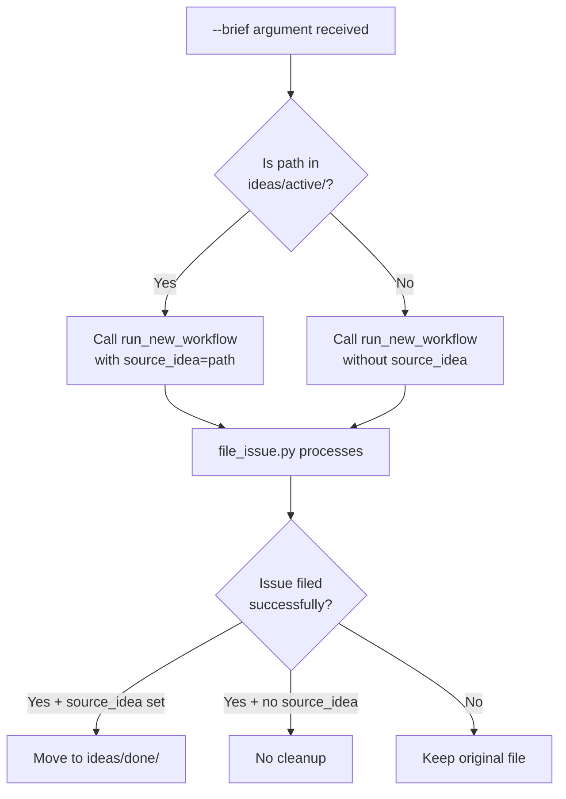

# 179 - Fix: --brief with ideas/active/ file does not trigger cleanup

<!-- Template Metadata
Last Updated: 2025-01-XX
Updated By: Issue #79 LLD creation
Update Reason: Initial LLD for --brief cleanup bug fix
-->

## 1. Context & Goal
* **Issue:** #79
* **Objective:** Ensure `--brief` with an `ideas/active/` file path triggers the same cleanup behavior as `--select`, moving the idea file to `ideas/done/` after successful issue filing.
* **Status:** Draft
* **Related Issues:** None identified

### Open Questions
*Questions that need clarification before or during implementation. Remove when resolved.*

- [x] Should cleanup only trigger for exact `ideas/active/` parent, or also subdirectories? → Exact parent match only (consistent with `--select` behavior)

## 2. Proposed Changes

*This section is the **source of truth** for implementation. Describe exactly what will be built.*

### 2.1 Files Changed

| File | Change Type | Description |
|------|-------------|-------------|
| `tools/run_issue_workflow.py` | Modify | Add `source_idea` detection for `--brief` handler around line 615 |

### 2.2 Dependencies

*New packages, APIs, or services required.*

```toml
# pyproject.toml additions (if any)
# None - uses existing pathlib
```

### 2.3 Data Structures

```python
# No new data structures required
# Uses existing Path objects and string parameters
```

### 2.4 Function Signatures

```python
# Existing function - no signature change required
def run_new_workflow(brief_content: str, source_idea: str = "") -> int:
    """Run the new issue workflow with optional source idea tracking."""
    ...

# Utility function (already exists)
def get_repo_root() -> Path:
    """Return the repository root path."""
    ...
```

### 2.5 Logic Flow (Pseudocode)

```
1. User invokes with --brief argument
2. Resolve brief_path to absolute path
3. Get repository root path
4. Construct ideas_active path (repo_root / "ideas" / "active")
5. IF brief_path.parent == ideas_active THEN
   - Call run_new_workflow with source_idea=str(brief_path)
   ELSE
   - Call run_new_workflow without source_idea (existing behavior)
6. file_issue.py cleanup logic (lines 357-365) handles the rest:
   - IF source_idea is non-empty AND issue filed successfully THEN
     - Move file to ideas/done/{issue_number}-{filename}
```

### 2.6 Technical Approach

* **Module:** `tools/run_issue_workflow.py`
* **Pattern:** Path detection and conditional parameter passing
* **Key Decisions:** 
  - Use `Path.resolve()` to handle relative paths correctly
  - Compare parent directories using Path equality (handles trailing slashes, etc.)
  - Preserve existing behavior for non-ideas/active files (no cleanup)

### 2.7 Architecture Decisions

| Decision | Options Considered | Choice | Rationale |
|----------|-------------------|--------|-----------|
| Path comparison method | String comparison, Path equality | Path equality | More robust, handles edge cases (trailing slashes, symlinks) |
| Detection location | In argument parser, in handler | In handler (line ~615) | Minimal change, consistent with `--select` pattern |
| Subdirectory handling | Include subdirs, exact parent only | Exact parent only | Consistent with existing `--select` behavior |

**Architectural Constraints:**
- Must not change behavior for `--brief` with non-ideas/active paths
- Must use existing `run_new_workflow` signature (no breaking changes)
- Cleanup logic in `file_issue.py` remains unchanged

## 3. Requirements

*What must be true when this is done. These become acceptance criteria.*

1. `--brief ideas/active/my-idea.md` moves file to `ideas/done/{issue#}-my-idea.md` after successful issue filing
2. `--brief some/other/path.md` continues to work without cleanup (existing behavior)
3. `--brief ideas/active/subdir/file.md` does NOT trigger cleanup (subdirs excluded)
4. Failed issue filing does not move the file (existing cleanup guard)

## 4. Alternatives Considered

| Option | Pros | Cons | Decision |
|--------|------|------|----------|
| Modify `--brief` handler only | Minimal change, localized fix | None identified | **Selected** |
| Add `--cleanup` flag | More explicit control | Adds complexity, inconsistent with `--select` | Rejected |
| Auto-detect in `run_new_workflow` | Centralized logic | Changes function responsibility, may affect other callers | Rejected |

**Rationale:** The selected option mirrors the exact pattern used by `--select` (line 613), ensuring consistency and minimal risk.

## 5. Data & Fixtures

### 5.1 Data Sources

| Attribute | Value |
|-----------|-------|
| Source | Local filesystem (ideas/active/ directory) |
| Format | Markdown files (.md) |
| Size | Single file per invocation |
| Refresh | N/A (static files) |
| Copyright/License | N/A (user content) |

### 5.2 Data Pipeline

```
ideas/active/{filename}.md ──read──► Issue Content ──file_issue──► ideas/done/{issue#}-{filename}.md
```

### 5.3 Test Fixtures

| Fixture | Source | Notes |
|---------|--------|-------|
| Mock idea file | Generated | Temp file in test ideas/active/ |
| Mock repo root | Pytest fixture | Isolated temp directory |

### 5.4 Deployment Pipeline

N/A - No external data deployment needed. Fix is source code only.

## 6. Diagram

### 6.1 Mermaid Quality Gate

- [x] **Simplicity:** Minimal components shown
- [x] **No touching:** All elements have visual separation
- [x] **No hidden lines:** All arrows fully visible
- [x] **Readable:** Labels clear, flow direction obvious
- [ ] **Auto-inspected:** Pending render

**Auto-Inspection Results:**
```
- Touching elements: [ ] None / [ ] Found: ___
- Hidden lines: [ ] None / [ ] Found: ___
- Label readability: [ ] Pass / [ ] Issue: ___
- Flow clarity: [ ] Clear / [ ] Issue: ___
```

### 6.2 Diagram



## 7. Security & Safety Considerations

### 7.1 Security

| Concern | Mitigation | Status |
|---------|------------|--------|
| Path traversal | Using Path.resolve() normalizes paths | Addressed |
| Arbitrary file movement | Only moves files from ideas/active/ | Addressed |

### 7.2 Safety

| Concern | Mitigation | Status |
|---------|------------|--------|
| Data loss on failure | Cleanup only runs after successful issue filing | Addressed |
| Accidental cleanup | Requires exact parent match (ideas/active/) | Addressed |
| File already moved | Existing cleanup logic handles missing source | Addressed |

**Fail Mode:** Fail Closed - If path detection fails, no cleanup occurs (existing behavior preserved)

**Recovery Strategy:** If cleanup fails, original file remains in ideas/active/ (no data loss)

## 8. Performance & Cost Considerations

### 8.1 Performance

| Metric | Budget | Approach |
|--------|--------|----------|
| Latency | < 10ms | Two Path operations (resolve, comparison) |
| Memory | < 1KB | Path objects only |
| API Calls | 0 | Local filesystem only |

**Bottlenecks:** None - trivial operation

### 8.2 Cost Analysis

| Resource | Unit Cost | Estimated Usage | Monthly Cost |
|----------|-----------|-----------------|--------------|
| Local compute | $0 | Negligible | $0 |

**Cost Controls:** N/A - No external services

**Worst-Case Scenario:** N/A - Local filesystem operations only

## 9. Legal & Compliance

| Concern | Applies? | Mitigation |
|---------|----------|------------|
| PII/Personal Data | No | Operates on user's own files |
| Third-Party Licenses | No | No external dependencies added |
| Terms of Service | No | No external APIs used |
| Data Retention | No | User controls their files |
| Export Controls | No | No restricted algorithms |

**Data Classification:** N/A - User-owned content

**Compliance Checklist:**
- [x] No PII stored without consent
- [x] All third-party licenses compatible with project license
- [x] External API usage compliant with provider ToS
- [x] Data retention policy documented

## 10. Verification & Testing

### 10.1 Test Scenarios

| ID | Scenario | Type | Input | Expected Output | Pass Criteria |
|----|----------|------|-------|-----------------|---------------|
| 010 | --brief with ideas/active/ file | Auto | `--brief ideas/active/test.md` | `source_idea` set to file path | `source_idea == str(brief_path)` |
| 020 | --brief with non-ideas path | Auto | `--brief docs/readme.md` | `source_idea` empty | `source_idea == ""` |
| 030 | --brief with ideas/active subdirectory | Auto | `--brief ideas/active/sub/test.md` | `source_idea` empty | `source_idea == ""` |
| 040 | Path resolution handles relative paths | Auto | `--brief ./ideas/active/test.md` | Path correctly resolved | `source_idea` points to resolved path |
| 050 | Integration: file moved after successful issue | Auto | Full workflow mock | File in `ideas/done/` | File exists with issue number prefix |

### 10.2 Test Commands

```bash
# Run all automated tests for this fix
poetry run pytest tests/tools/test_run_issue_workflow.py -v -k "brief"

# Run specific test scenarios
poetry run pytest tests/tools/test_run_issue_workflow.py::test_brief_with_ideas_active -v

# Run integration tests (if applicable)
poetry run pytest tests/tools/test_run_issue_workflow.py -v -m integration
```

### 10.3 Manual Tests (Only If Unavoidable)

N/A - All scenarios automated.

## 11. Risks & Mitigations

| Risk | Impact | Likelihood | Mitigation |
|------|--------|------------|------------|
| Breaking existing --brief behavior | High | Low | Only add source_idea when in ideas/active/ |
| Path comparison edge cases | Med | Low | Use Path equality, not string comparison |
| get_repo_root() unavailable | Med | Low | Function already used elsewhere; add import if needed |

## 12. Definition of Done

### Code
- [ ] Implementation complete and linted
- [ ] Code comments reference this LLD (#79)

### Tests
- [ ] All test scenarios pass
- [ ] Test coverage for new code path

### Documentation
- [ ] LLD updated with any deviations
- [ ] Implementation Report (0103) completed
- [ ] Test Report (0113) completed if applicable

### Review
- [ ] Code review completed
- [ ] User approval before closing issue

---

## Appendix: Review Log

*Track all review feedback with timestamps and implementation status.*

### Review Summary

| Review | Date | Verdict | Key Issue |
|--------|------|---------|-----------|
| - | - | - | Awaiting review |

**Final Status:** PENDING
<!-- Note: This field is auto-updated to APPROVED by the workflow when finalized -->