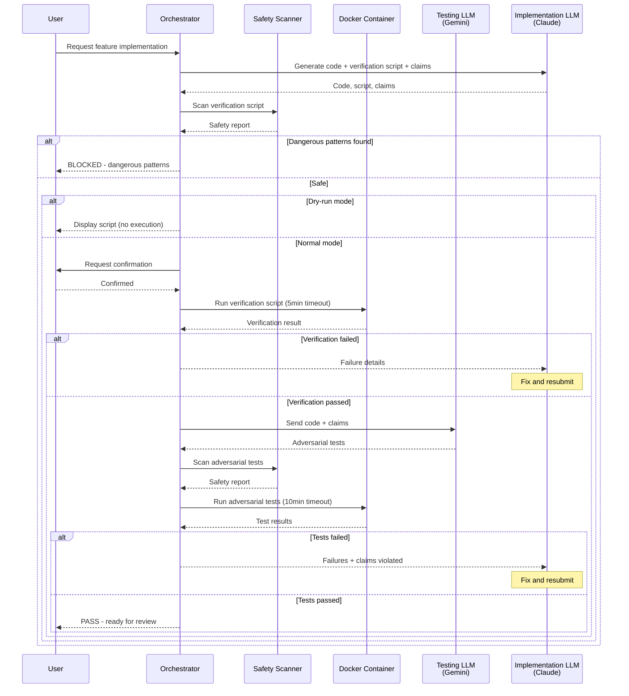

# 180 - Feature: Adversarial Testing Workflow

<!-- Template Metadata
Last Updated: 2026-02-02
Updated By: Gemini Review #1 revisions
Update Reason: Added missing test case T110 for Requirement #12 (governance integration)
-->

## 1. Context & Goal
* **Issue:** #80
* **Objective:** Establish an adversarial testing workflow where implementation and verification are performed by separate LLMs, with an orchestrator executing all verification in mandatory containerized environments.
* **Status:** Approved (gemini-3-pro-preview, 2026-02-04)
* **Related Issues:** N/A

### Open Questions

*All questions resolved during Gemini Review #1.*

- [x] ~~Should adversarial testing run on every commit, before PR, or on-demand?~~ **RESOLVED: Stick to the N2.5 gate (on-demand/pre-review) as specified to control costs. Mandatory on-commit runs should only be enabled for security-critical paths.**
- [x] ~~What scoring mechanism should be used for Testing LLM performance?~~ **RESOLVED: Prioritize "Valid Bugs Found" (True Positives). Apply strict penalties for "Invalid Test Code" (False Positives) or hallucinations.**
- [x] ~~Should Testing LLM be allowed to suggest fixes, or remain purely adversarial?~~ **RESOLVED: Purely adversarial. Separation of concerns is vital; the Implementation LLM must solve the problem, the Testing LLM only finds flaws.**
- [x] ~~What is the fallback if Docker is not available on the developer's machine?~~ **RESOLVED: Fail fast with a clear error. As stated in Section 2.6, containerization is mandatory for security.**

## 2. Proposed Changes

*This section is the **source of truth** for implementation. Describes exactly what will be built.*

### 2.1 Files Changed

| File | Change Type | Description |
|------|-------------|-------------|
| `tools/adversarial_test_workflow.py` | Add | Main orchestrator script coordinating verification and adversarial testing |
| `tools/script_safety_scanner.py` | Add | Shell script and Python AST security scanner |
| `tools/templates/verify-template.sh` | Add | Template for verification scripts |
| `tools/templates/test_adversarial_template.py` | Add | Template for adversarial test generation |
| `tools/docker/adversarial-sandbox.Dockerfile` | Add | Docker container definition for sandboxed execution |
| `tools/run_issue_workflow.py` | Modify | Add N2.5 adversarial testing gate |
| `tests/fixtures/adversarial/mock_gemini_responses.json` | Add | Mocked LLM responses for offline development |
| `tests/fixtures/adversarial/sample_claims.json` | Add | Sample claims for testing |
| `tests/fixtures/adversarial/dangerous_scripts/` | Add | Test fixtures for security scanner validation |
| `tests/test_adversarial_workflow.py` | Add | Unit tests for orchestrator |
| `tests/test_script_safety_scanner.py` | Add | Unit tests for security scanner |
| `tests/test_workflow_integration.py` | Add | Integration tests for N2.5 gate in run_issue_workflow.py |
| `docs/adr/0015-adversarial-testing-workflow.md` | Add | Architecture decision record |
| `docs/reports/adversarial-costs.csv` | Add | Cost tracking for adversarial testing runs |
| `docs/wiki/governance-workflow.md` | Modify | Document new N2.5 gate |
| `CLAUDE.md` | Modify | Add verification script requirements for Implementation LLM |
| `config/gemini.yaml` | Modify | Add enterprise and ZDR settings |

### 2.2 Dependencies

```toml
# pyproject.toml additions
docker = "^7.0.0"  # Docker SDK for Python
```

**System Dependencies:**
- Docker or Podman (mandatory for containerized execution)
- Gemini API access (Enterprise endpoint with ZDR)

### 2.3 Data Structures

```python
# Pseudocode - NOT implementation

class WorkflowStatus(Enum):
    DRY_RUN = "DRY_RUN"
    CANCELLED = "CANCELLED"
    BLOCKED_DANGEROUS_SCRIPT = "BLOCKED_DANGEROUS_SCRIPT"
    FAILED_TIMEOUT = "FAILED_TIMEOUT"
    FAILED_IMPORT = "FAILED_IMPORT"
    FAILED_VERIFICATION = "FAILED_VERIFICATION"
    FAILED_ADVERSARIAL = "FAILED_ADVERSARIAL"
    BLOCKED_DANGEROUS_OPERATION = "BLOCKED_DANGEROUS_OPERATION"
    PASS = "PASS"

class WorkflowResult(TypedDict):
    status: WorkflowStatus  # Outcome of the workflow
    message: str | None  # Human-readable description
    stderr: str | None  # Captured stderr on failure
    failures: list[TestFailure] | None  # Parsed test failures
    patterns: list[str] | None  # Dangerous patterns if blocked
    cost: float | None  # Estimated API cost in USD

class TestFailure(TypedDict):
    test_name: str  # e.g., "test_vscode_with_spaces_in_path"
    claim_violated: str  # Which claim this test targeted
    error_type: str  # e.g., "FileNotFoundError"
    error_message: str  # Full error message
    traceback: str | None  # Stack trace if available

class DangerousPattern(TypedDict):
    line_number: int  # Line in script where found
    pattern: str  # The dangerous command/pattern
    category: str  # "network", "destructive", "privilege", "exfiltration"
    severity: str  # "high", "medium", "low"

class AdversarialTestSpec(TypedDict):
    claims: list[str]  # Claims to test against
    implementation_files: list[str]  # Files being tested
    testing_strategy: str  # Description of approach
    generated_tests: str  # Python test code
```

### 2.4 Function Signatures

```python
# tools/adversarial_test_workflow.py

def run_adversarial_testing(
    implementation_files: list[str],
    claims: list[str],
    dry_run: bool = False,
    auto_confirm: bool = False,
    containerized: bool = True,
    timeout_verification: int = 300,
    timeout_adversarial: int = 600,
    max_cost: float | None = None,
    allow_network: bool = False,
    allow_dangerous: bool = False,
) -> WorkflowResult:
    """
    Main orchestrator function for adversarial testing workflow.
    
    Args:
        implementation_files: List of paths to implementation files
        claims: List of claims made by Implementation LLM
        dry_run: If True, show script content without execution
        auto_confirm: If True, skip user confirmation (requires containerized=True)
        containerized: If True, run in Docker container (mandatory for execution)
        timeout_verification: Seconds before verification script timeout
        timeout_adversarial: Seconds before adversarial test timeout
        max_cost: Maximum cost in USD, skip if exceeded
        allow_network: If True, enable network in container
        allow_dangerous: If True, allow dangerous scripts with confirmation
    
    Returns:
        WorkflowResult with status and details
    """
    ...

def get_user_confirmation(prompt: str) -> bool:
    """Prompt user for confirmation before script execution."""
    ...

def invoke_testing_llm(
    implementation_files: list[str],
    claims: list[str],
    model: str = "gemini-flash",
) -> AdversarialTestSpec:
    """Invoke Testing LLM to generate adversarial tests."""
    ...

def parse_failures(pytest_output: str) -> list[TestFailure]:
    """Parse pytest output to extract structured failure information."""
    ...

def estimate_cost(implementation_files: list[str], model: str) -> float:
    """
    Estimate API cost for adversarial test generation.
    
    Note: Accounts for both input token count (implementation file sizes)
    and estimated output generation tokens.
    """
    ...

def log_cost(result: WorkflowResult, output_path: str = "docs/reports/adversarial-costs.csv") -> None:
    """Append cost data to tracking CSV."""
    ...
```

```python
# tools/script_safety_scanner.py

def scan_shell_script(script_path: str) -> list[DangerousPattern]:
    """
    Scan shell script for dangerous patterns before execution.
    
    Checks for:
    - Network access (curl, wget, nc to external IPs)
    - Destructive commands (rm -rf, shutil.rmtree on system paths)
    - Privilege escalation (sudo, su)
    - Environment exfiltration (env piped to network)
    """
    ...

def scan_python_ast(script_path: str) -> list[DangerousPattern]:
    """
    Perform AST-based analysis of Python scripts.
    
    Rejects:
    - os.system with untrusted input
    - subprocess.call with shell=True on untrusted input
    - shutil.rmtree on non-workspace paths
    - Dangerous imports (ctypes, socket with external connections)
    - unittest.mock or monkeypatch usage (forbidden in adversarial tests)
    """
    ...

def is_external_ip(ip_or_url: str) -> bool:
    """Check if IP/URL is external (not localhost/private range)."""
    ...

def format_danger_report(patterns: list[DangerousPattern]) -> str:
    """Format dangerous patterns into human-readable report."""
    ...
```

### 2.5 Logic Flow (Pseudocode)

```
# Main Orchestrator Flow

1. RECEIVE implementation_files, claims, flags
2. VALIDATE inputs
   - IF not containerized AND not dry_run THEN
     - ERROR: "Containerized execution is mandatory"
   - IF auto_confirm AND not containerized THEN
     - ERROR: "Auto-confirm requires containerized mode"

3. GENERATE verification script from template + implementation
4. PERFORM pre-execution security scan
   - Shell script inspection for dangerous patterns
   - IF dangerous patterns found AND not allow_dangerous THEN
     - RETURN BLOCKED_DANGEROUS_SCRIPT with patterns

5. IF dry_run THEN
   - DISPLAY script content
   - RETURN DRY_RUN status

6. IF not auto_confirm THEN
   - PROMPT user for confirmation
   - IF not confirmed THEN RETURN CANCELLED

7. RUN verification script in Docker container
   - Configure: --network=none, --memory=2g, --cpus=2
   - IF allow_network THEN enable network
   - APPLY timeout (default 5 minutes)
   
8. CHECK verification result
   - IF timeout THEN RETURN FAILED_TIMEOUT
   - IF ImportError in stderr THEN RETURN FAILED_IMPORT
   - IF non-zero exit THEN RETURN FAILED_VERIFICATION

9. ESTIMATE adversarial testing cost
   - Calculate input token count from implementation file sizes
   - Add estimated output generation tokens
   - IF max_cost exceeded THEN RETURN with cost warning

10. INVOKE Testing LLM (Gemini Enterprise/ZDR)
    - SEND implementation files + claims
    - INCLUDE system prompt forbidding unittest.mock/monkeypatch
    - RECEIVE adversarial test code

11. SCAN adversarial test code for safety
    - Python AST validation
    - Check for forbidden mock imports
    - IF dangerous patterns OR mock usage THEN RETURN BLOCKED_DANGEROUS_OPERATION

12. RUN adversarial tests in Docker container
    - Same resource constraints as verification
    - APPLY timeout (default 10 minutes)

13. PARSE test results
    - Extract failures with claim violations
    - IF any failures THEN RETURN FAILED_ADVERSARIAL

14. LOG cost to tracking CSV
15. RETURN PASS with all details
```

```
# Security Scanner Flow

1. RECEIVE script_path
2. DETERMINE script type (shell or Python)
3. IF shell script THEN
   - READ file content
   - SCAN for network patterns (curl, wget, nc + external IP)
   - SCAN for destructive patterns (rm -rf /, shutil.rmtree)
   - SCAN for privilege escalation (sudo, su)
   - SCAN for exfiltration (env | curl, printenv + network)
   
4. IF Python script THEN
   - PARSE AST
   - WALK AST nodes
   - CHECK for dangerous imports (os.system, subprocess with shell=True)
   - CHECK for dangerous calls (shutil.rmtree on non-workspace)
   - CHECK for socket connections to external IPs
   - CHECK for mock imports (unittest.mock, monkeypatch) in adversarial tests

5. AGGREGATE all patterns found
6. RETURN list of DangerousPattern
```

### 2.6 Technical Approach

* **Module:** `tools/adversarial_test_workflow.py`
* **Pattern:** Pipeline with gates - each stage must pass before next proceeds
* **Key Decisions:**
  - Mandatory containerization ensures no LLM-generated code runs on host
  - Pre-execution scanning catches dangerous scripts before user sees confirmation
  - AST-based validation provides deeper Python analysis than regex
  - Timeout enforcement prevents runaway processes
  - Cost tracking enables ROI analysis
  - Mock detection in adversarial tests ensures real integration testing

### 2.7 Architecture Decisions

| Decision | Options Considered | Choice | Rationale |
|----------|-------------------|--------|-----------|
| Container runtime | Docker only, Podman only, Both | Docker with Podman fallback | Docker is most common; Podman provides rootless alternative |
| Script inspection timing | Before confirmation, After confirmation | Before confirmation | Prevents user from seeing dangerous scripts they might accidentally approve |
| LLM model selection | Single model, Tiered by complexity | Tiered (Flash default, Pro for complex) | Balances cost with thoroughness for security-critical code |
| Network isolation | Always isolated, Opt-in network | Default isolated, `--allow-network` flag | Security-first approach, explicit opt-in for integration tests |
| Timeout values | Configurable only, With defaults | Defaults (5min/10min) with override | Reasonable defaults prevent most runaway cases |

**Architectural Constraints:**
- Must integrate with existing governance workflow as N2.5 gate
- Cannot store proprietary code on external LLM services (ZDR required)
- Must work on Windows, macOS, and Linux

## 3. Requirements

*What must be true when this is done. These become acceptance criteria.*

1. Orchestrator runs verification scripts in mandatory Docker container with resource limits
2. Orchestrator requires user confirmation before executing any generated script
3. `--dry-run` mode displays script content without any execution
4. Shell script inspection blocks dangerous commands before confirmation prompt is shown
5. Verification scripts timeout after 5 minutes with clear FAILED_TIMEOUT status
6. Adversarial test suites timeout after 10 minutes with clear FAILED_TIMEOUT status
7. Testing LLM (Gemini Enterprise/ZDR) receives implementation code and generates targeted adversarial tests
8. Adversarial tests execute without mocks for subprocess/external calls
9. ImportError and ModuleNotFoundError trigger immediate FAILED_IMPORT status
10. Edge cases (unicode, paths with spaces, missing commands) are covered by adversarial tests
11. Mocked "integration tests" are flagged as false claims by Testing LLM
12. N2.5 gate integrates into existing issue governance workflow (`run_issue_workflow.py`)
13. Failure reports include exact test output and which claim was violated
14. Per-run costs are logged to `docs/reports/adversarial-costs.csv`
15. Environment variables (PYTHONPATH, API keys) are sanitized before script execution

## 4. Alternatives Considered

| Option | Pros | Cons | Decision |
|--------|------|------|----------|
| Host execution with sandboxing | Simpler setup, no Docker dependency | Security risk, harder to isolate | **Rejected** |
| Docker mandatory | Strong isolation, consistent environment | Requires Docker installation | **Selected** |
| Single LLM for both roles | Lower cost, simpler orchestration | Conflict of interest, misses bugs | **Rejected** |
| Separate LLMs (adversarial) | Independent verification, catches more bugs | Higher cost, more complexity | **Selected** |
| No pre-execution scanning | Faster workflow | Dangerous scripts shown to user | **Rejected** |
| Pre-execution scanning | Catches dangers before confirmation | Slight latency increase | **Selected** |
| Auto-confirm by default | Faster for experienced users | Security risk for new users | **Rejected** |
| Confirmation required by default | Safe default behavior | Slightly slower | **Selected** |

**Rationale:** Security-first design prioritizes preventing execution of dangerous code over convenience. The cost of adversarial testing is justified by catching bugs that would otherwise reach production.

## 5. Data & Fixtures

### 5.1 Data Sources

| Attribute | Value |
|-----------|-------|
| Source | Gemini Enterprise API (Testing LLM), local implementation files |
| Format | Python code, JSON claims, shell scripts |
| Size | ~10-50KB per adversarial test generation |
| Refresh | Per-request (no caching initially) |
| Copyright/License | Generated content, project license applies |

### 5.2 Data Pipeline

```
Implementation Files ──read──► Orchestrator ──API call──► Gemini Enterprise (ZDR)
                                    │                              │
                                    ▼                              ▼
                         Claims JSON ─────────────────► Adversarial Tests
                                    │                              │
                                    ▼                              ▼
                         Docker Container ◄────mount────── Test Files
                                    │
                                    ▼
                         Test Results ──parse──► WorkflowResult
                                    │
                                    ▼
                         Cost CSV ◄──append──── Logging
```

### 5.3 Test Fixtures

| Fixture | Source | Notes |
|---------|--------|-------|
| `mock_gemini_responses.json` | Generated | Sample adversarial test outputs for offline testing |
| `sample_claims.json` | Generated | Example claims for various scenarios |
| `dangerous_scripts/rm_rf.sh` | Handwritten | Test fixture for destructive command detection |
| `dangerous_scripts/curl_external.sh` | Handwritten | Test fixture for network access detection |
| `dangerous_scripts/sudo_escalation.sh` | Handwritten | Test fixture for privilege escalation detection |
| `dangerous_scripts/safe_script.sh` | Handwritten | Control fixture that should pass scanning |

### 5.4 Deployment Pipeline

1. Dev: Run with `--offline` flag using mocked fixtures
2. Test: Run against test Gemini endpoint with ZDR enabled
3. Production: Run against production Gemini Enterprise with ZDR

**External data source:** Gemini API. Configuration stored in `config/gemini.yaml` with `enterprise: true` and `data_retention: none`.

## 6. Diagram

### 6.1 Mermaid Quality Gate

Before finalizing any diagram, verify in [Mermaid Live Editor](https://mermaid.live) or GitHub preview:

- [x] **Simplicity:** Similar components collapsed (per 0006 §8.1)
- [x] **No touching:** All elements have visual separation (per 0006 §8.2)
- [x] **No hidden lines:** All arrows fully visible (per 0006 §8.3)
- [x] **Readable:** Labels not truncated, flow direction clear
- [ ] **Auto-inspected:** Agent rendered via mermaid.ink and viewed (per 0006 §8.5)

**Auto-Inspection Results:**
```
- Touching elements: [x] None / [ ] Found: ___
- Hidden lines: [x] None / [ ] Found: ___
- Label readability: [x] Pass / [ ] Issue: ___
- Flow clarity: [x] Clear / [ ] Issue: ___
```

### 6.2 Diagram



## 7. Security & Safety Considerations

### 7.1 Security

| Concern | Mitigation | Status |
|---------|------------|--------|
| Arbitrary code execution on host | Mandatory Docker containerization for all LLM-generated scripts | Addressed |
| Network exfiltration | Container runs with `--network=none` by default | Addressed |
| Filesystem destruction | Container mounts only workspace as writable | Addressed |
| Privilege escalation | Pre-execution scan for sudo/su commands | Addressed |
| API key exposure | Environment sanitization clears sensitive variables | Addressed |
| Malicious LLM output | AST-based Python validation rejects dangerous patterns | Addressed |
| Data residency | Gemini Enterprise with Zero Data Retention required | Addressed |

### 7.2 Safety

| Concern | Mitigation | Status |
|---------|------------|--------|
| Runaway verification scripts | 5-minute timeout with graceful termination | Addressed |
| Runaway adversarial tests | 10-minute timeout with graceful termination | Addressed |
| Resource exhaustion | Docker `--memory=2g --cpus=2` limits | Addressed |
| Accidental dangerous script approval | Pre-execution scanning before confirmation prompt | Addressed |
| Cost runaway | `--max-cost` flag and per-run cost logging | Addressed |
| Partial failure state | Clear status reporting, no half-executed states | Addressed |

**Fail Mode:** Fail Closed - If any safety check fails, workflow halts immediately with clear error status.

**Recovery Strategy:** Each run is atomic. On failure, user receives status and can re-run after fixing issues. No persistent state to corrupt.

## 8. Performance & Cost Considerations

### 8.1 Performance

| Metric | Budget | Approach |
|--------|--------|----------|
| Verification timeout | 5 minutes | Docker subprocess with timeout parameter |
| Adversarial timeout | 10 minutes | Docker subprocess with timeout parameter |
| Memory per container | 2GB max | Docker `--memory=2g` flag |
| CPU per container | 2 cores max | Docker `--cpus=2` flag |
| Safety scan latency | < 1 second | Regex + AST, no API calls |

**Bottlenecks:** 
- Gemini API latency for adversarial test generation (~2-10 seconds)
- Docker container startup time (~1-3 seconds per run)

### 8.2 Cost Analysis

| Resource | Unit Cost | Estimated Usage | Monthly Cost |
|----------|-----------|-----------------|--------------|
| Gemini Flash (standard tickets) | $0.01-0.05 per generation | 100 tickets/month | $1-5 |
| Gemini Pro (complex tickets) | $0.10-0.50 per generation | 10 tickets/month | $1-5 |
| Docker compute | Local machine | N/A | $0 |
| Total estimated | | | $2-10/month |

**Cost Controls:**
- [x] Tiered model selection (Flash default, Pro for complex/security-critical)
- [x] Scope limiting (`needs-adversarial` label or specific directories)
- [x] `--max-cost` flag to skip if threshold exceeded
- [x] Per-run logging to `docs/reports/adversarial-costs.csv`

**Worst-Case Scenario:** If usage spikes 10x (1000 tickets), costs would be $20-100/month. Budget alerts should be configured at $50 threshold.

**Break-even Analysis:** Adversarial testing is justified if it catches one bug per month that would otherwise require a production hotfix (~4 hours developer time = ~$200-400 opportunity cost).

## 9. Legal & Compliance

| Concern | Applies? | Mitigation |
|---------|----------|------------|
| PII/Personal Data | No | Code only, no user data processed |
| Third-Party Licenses | Yes | Docker SDK (Apache 2.0), compatible with project |
| Terms of Service | Yes | Gemini Enterprise ToS compliance required |
| Data Retention | Yes | Gemini ZDR policy prevents storage of proprietary code |
| Export Controls | No | No restricted algorithms or data |

**Data Classification:** Internal (proprietary code)

**Compliance Checklist:**
- [x] No PII stored without consent - N/A, no PII
- [x] All third-party licenses compatible with project license
- [x] External API usage compliant with Gemini Enterprise ToS
- [x] Data retention policy documented - ZDR required in config

## 10. Verification & Testing

### 10.0 Test Plan (TDD - Complete Before Implementation)

**TDD Requirement:** Tests MUST be written and failing BEFORE implementation begins.

| Test ID | Test Description | Expected Behavior | Status |
|---------|------------------|-------------------|--------|
| T010 | test_dry_run_shows_script_no_execution | Returns DRY_RUN, displays script, no subprocess | RED |
| T020 | test_user_confirmation_required | Prompts before execution, respects cancellation | RED |
| T030 | test_dangerous_script_blocked | Detects curl/rm patterns, returns BLOCKED status | RED |
| T040 | test_verification_timeout | Terminates after 5 min, returns FAILED_TIMEOUT | RED |
| T050 | test_import_error_detected | Parses ImportError, returns FAILED_IMPORT | RED |
| T060 | test_adversarial_tests_generated | Gemini returns valid test code | RED |
| T070 | test_adversarial_failure_parsed | Extracts test name and claim violated | RED |
| T080 | test_containerized_execution | Docker runs with correct flags | RED |
| T090 | test_cost_logged | CSV updated with run cost | RED |
| T100 | test_env_sanitized | PYTHONPATH and API keys cleared | RED |
| T110 | test_workflow_runner_invokes_adversarial_gate | run_issue_workflow.py triggers N2.5 gate when conditions met | RED |

**Coverage Target:** ≥95% for all new code

**TDD Checklist:**
- [ ] All tests written before implementation
- [ ] Tests currently RED (failing)
- [ ] Test IDs match scenario IDs in 10.1
- [ ] Test file created at: `tests/test_adversarial_workflow.py`
- [ ] Integration test file created at: `tests/test_workflow_integration.py`

### 10.1 Test Scenarios

| ID | Scenario | Type | Input | Expected Output | Pass Criteria |
|----|----------|------|-------|-----------------|---------------|
| 010 | Dry-run mode shows script | Auto | `--dry-run` flag | Script content displayed, no execution | Status = DRY_RUN |
| 020 | User cancels confirmation | Auto | User inputs 'n' | Workflow halts | Status = CANCELLED |
| 030 | Dangerous curl detected | Auto | Script with `curl http://evil.com` | Blocks before confirmation | Status = BLOCKED_DANGEROUS_SCRIPT |
| 040 | Dangerous rm -rf detected | Auto | Script with `rm -rf /` | Blocks before confirmation | Pattern category = "destructive" |
| 050 | Verification timeout | Auto | Script with `sleep 600` | Terminates at 5 min | Status = FAILED_TIMEOUT |
| 060 | Import error detected | Auto | Script importing nonexistent module | Parses stderr | Status = FAILED_IMPORT |
| 070 | Verification passes | Auto | Valid verification script | Proceeds to adversarial | No error |
| 080 | Adversarial tests generated | Auto | Implementation + claims | Valid Python test code | Test code parseable |
| 090 | Adversarial test fails | Auto | Buggy implementation | Reports claim violated | Status = FAILED_ADVERSARIAL |
| 100 | Adversarial tests pass | Auto | Correct implementation | Accepts code | Status = PASS |
| 110 | Governance integration | Auto | Issue with adversarial flag | run_issue_workflow.py invokes adversarial gate | Gate triggered correctly |
| 120 | False claim exposed | Auto | Mocked "integration test" | Testing LLM flags it | Claim violation reported |
| 130 | Unicode edge case | Auto | Implementation claiming unicode support | Tests unicode paths | Edge case covered |
| 140 | Path with spaces | Auto | Implementation claiming path handling | Tests spaced paths | Edge case covered |
| 150 | Adversarial timeout | Auto | Long-running tests | Terminates at 10 min | Status = FAILED_TIMEOUT |
| 160 | Cost logged | Auto | Any completed run | CSV has new row | Row exists in CSV |
| 170 | Max cost exceeded | Auto | Low `--max-cost` | Skips adversarial | Warning in result |
| 180 | Auto-confirm without container | Auto | `--auto-confirm` only | Rejects | Error raised |
| 190 | Environment sanitized | Auto | PYTHONPATH set | Cleared in container | PYTHONPATH empty |
| 200 | Network isolated by default | Auto | No `--allow-network` | Container has no network | `--network=none` in Docker command |
| 210 | Allow-dangerous override | Auto | Dangerous script + `--allow-dangerous` | Prompts, then runs | Script executes |

### 10.2 Test Commands

```bash
# Run all automated tests (mocked/offline)
poetry run pytest tests/test_adversarial_workflow.py tests/test_script_safety_scanner.py tests/test_workflow_integration.py -v --offline

# Run only fast/mocked tests (exclude live)
poetry run pytest tests/test_adversarial_workflow.py -v -m "not live"

# Run live integration tests (requires Docker + Gemini API)
poetry run pytest tests/test_adversarial_workflow.py -v -m live

# Run security scanner tests
poetry run pytest tests/test_script_safety_scanner.py -v

# Run governance integration tests
poetry run pytest tests/test_workflow_integration.py -v
```

### 10.3 Manual Tests (Only If Unavoidable)

**N/A - All scenarios automated.** 

The self-destruct test (security validation) runs in CI as an automated test that verifies the container blocks file deletion attempts.

## 11. Risks & Mitigations

| Risk | Impact | Likelihood | Mitigation |
|------|--------|------------|------------|
| Docker not installed on developer machine | High | Medium | Clear error message with installation instructions; future: Podman fallback |
| Gemini API unavailable | Medium | Low | Offline mode with mocked fixtures for development; clear error for production |
| Container escape vulnerability | High | Very Low | Use official Docker images, keep updated, minimal container permissions |
| False positive from Testing LLM | Medium | Medium | Human review remains final gate; track false positive rate |
| Cost spikes from high usage | Low | Low | Budget cap with `--max-cost`, cost logging for visibility |
| AST scanner misses dangerous pattern | Medium | Low | Layered defense: container isolation is primary, scanner is secondary |

## 12. Definition of Done

### Code
- [ ] `adversarial_test_workflow.py` orchestrator implemented
- [ ] `script_safety_scanner.py` security scanner implemented
- [ ] Mandatory Docker containerization (no host execution path)
- [ ] Shell script inspection for dangerous patterns
- [ ] AST-based Python validation (including mock detection)
- [ ] User confirmation prompt for script execution
- [ ] `--dry-run` mode
- [ ] Timeout handling (5 min verification, 10 min adversarial)
- [ ] Resource constraint enforcement via Docker
- [ ] Environment sanitization
- [ ] N2.5 gate integration in `run_issue_workflow.py`
- [ ] Code comments reference this LLD

### Tests
- [ ] All test scenarios pass (including T110 for governance integration)
- [ ] Test coverage ≥95%
- [ ] Mocked LLM response fixtures created
- [ ] Self-destruct test added to security suite

### Documentation
- [ ] ADR `0015-adversarial-testing-workflow.md` created
- [ ] Governance workflow wiki updated with N2.5 gate
- [ ] CLAUDE.md updated with verification script requirements
- [ ] Files added to `docs/0003-file-inventory.md`
- [ ] Cost tracking CSV initialized
- [ ] Implementation Report (0103) completed
- [ ] Test Report (0113) completed

### Review
- [ ] Code review completed
- [ ] Run 0809 Security Audit - PASS
- [ ] Run 0817 Wiki Alignment Audit - PASS
- [ ] User approval before closing issue

---

## Reviewer Suggestions

*Non-blocking recommendations from the reviewer.*

- **Test Plan Clarity:** While Scenario 150 covers the adversarial timeout (Requirement #6), Section 10.0 (TDD Table) relies on `T040` (Verification Timeout) or `T080`. Consider adding a specific `T045` unit test for the 10-minute adversarial timeout to distinct it from the 5-minute verification timeout.
- **Scanner Testing:** Ensure `tests/test_script_safety_scanner.py` explicitly includes test cases for detecting `unittest.mock` and `monkeypatch` in Python files (Requirement #8/11 enforcement).

## Appendix: Review Log

*Track all review feedback with timestamps and implementation status.*

### Gemini Review #1 (REVISE)

**Reviewer:** Gemini 3 Pro
**Verdict:** REVISE

#### Comments

| ID | Comment | Implemented? |
|----|---------|--------------|
| G1.1 | "Requirement Coverage gap: Requirement #12 (Governance Integration) requires a test verifying that run_issue_workflow.py correctly triggers the adversarial gate" | YES - Added T110 to Section 10.0 and Scenario 110 to Section 10.1 |
| G1.2 | "Cost Estimation: Ensure estimate_cost accounts for input token count" | YES - Updated function docstring in Section 2.4 |
| G1.3 | "Testing Strategy: Consider adding instruction to Testing LLM forbidding unittest.mock" | YES - Added to Section 2.5 Logic Flow and scan_python_ast docstring |

### Review Summary

| Review | Date | Verdict | Key Issue |
|--------|------|---------|-----------|
| 2 | 2026-02-04 | APPROVED | `gemini-3-pro-preview` |
| Gemini #1 | (auto) | REVISE | Missing test for Requirement #12 (governance integration) |

**Final Status:** APPROVED