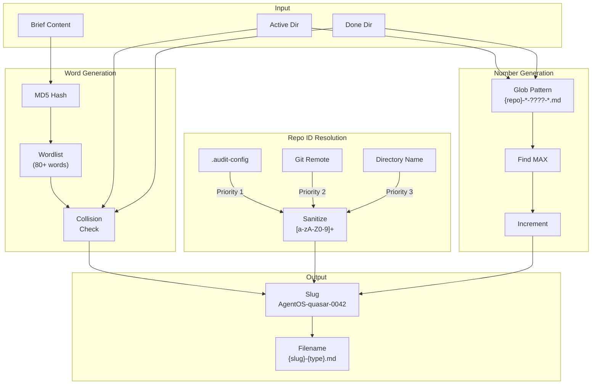
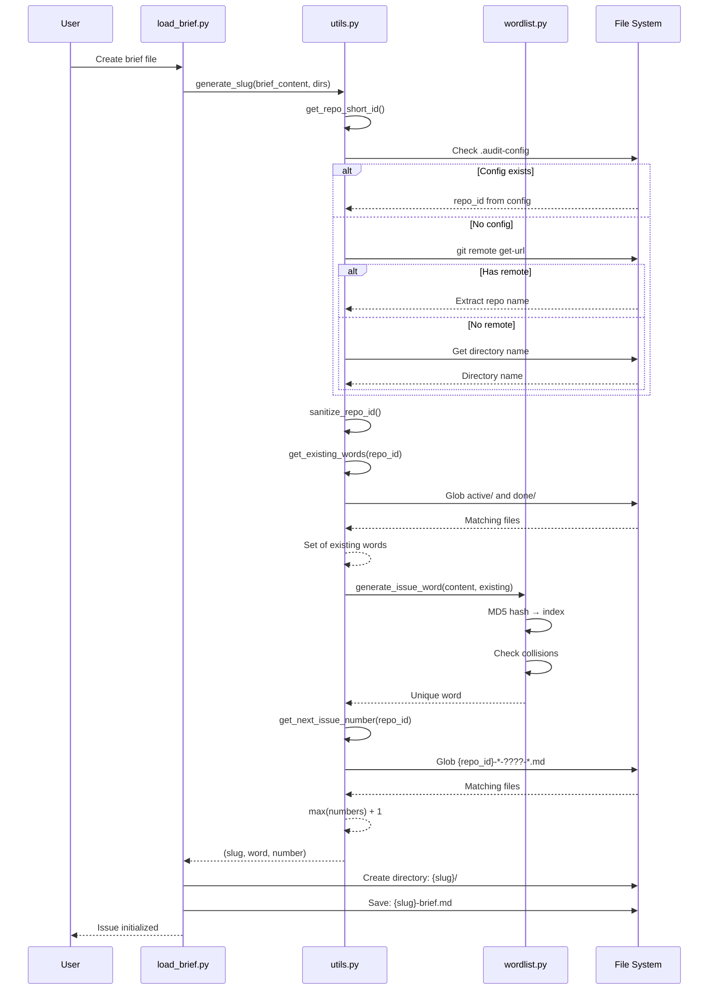

# 83 - Feature: Structured Issue File Naming Scheme for Multi-Repo Workflows

<!-- Template Metadata
Last Updated: 2025-01-15
Updated By: Initial LLD creation
Update Reason: New feature implementation for issue #83
-->

## 1. Context & Goal
* **Issue:** #83
* **Objective:** Implement a structured, collision-free file naming scheme (`{REPO}-{WORD}-{NUM}-{TYPE}.md`) for audit files that enables easy identification and tracking across multi-repo workflows.
* **Status:** Draft
* **Related Issues:** None

### Open Questions
*Questions that need clarification before or during implementation. Remove when resolved.*

- [x] Should the wordlist be alphabetically sorted or randomly ordered? → Alphabetically sorted for maintainability
- [x] What happens when all 80+ words are exhausted for a repo? → Very unlikely scenario (would need 80+ active issues); can expand wordlist if needed
- [ ] Should `.audit-config` support additional fields beyond `repo_id` for future extensibility?

## 2. Proposed Changes

*This section is the **source of truth** for implementation. Describe exactly what will be built.*

### 2.1 Files Changed

| File | Change Type | Description |
|------|-------------|-------------|
| `src/skills/audit/wordlist.py` | Add | New module containing curated 80+ word vocabulary list |
| `src/skills/audit/utils.py` | Modify | Add `get_repo_short_id()`, `get_next_issue_number()`, `generate_issue_word()`, update `generate_slug()`, update `save_audit_file()` |
| `src/skills/audit/state.py` | Modify | Add `issue_word` field to `IssueWorkflowState` |
| `src/skills/audit/nodes/load_brief.py` | Modify | Use new slug generation with word-based naming |
| `src/skills/audit/nodes/draft.py` | Modify | Use updated `save_audit_file()` signature |
| `src/skills/audit/nodes/review.py` | Modify | Use updated `save_audit_file()` signature |
| `src/skills/audit/nodes/human_edit_draft.py` | Modify | Use updated `save_audit_file()` signature |
| `src/skills/audit/nodes/human_edit_verdict.py` | Modify | Use updated `save_audit_file()` signature |
| `src/skills/audit/nodes/file_issue.py` | Modify | Update `done/` directory naming to use new slug format |
| `tests/skills/audit/test_naming.py` | Add | Unit tests for new naming scheme |
| `tests/skills/audit/test_sanitization.py` | Add | Security tests for Repo ID sanitization |

### 2.2 Dependencies

*New packages, APIs, or services required.*

```toml
# No new dependencies - uses stdlib only
# hashlib (MD5) - already in stdlib
# re (regex) - already in stdlib
# pathlib - already in stdlib
```

### 2.3 Data Structures

```python
# Pseudocode - NOT implementation

# Updated state with issue_word tracking
class IssueWorkflowState(TypedDict):
    # Existing fields...
    brief_path: str
    audit_dir: str
    issue_number: Optional[int]
    
    # New field
    issue_word: str  # The vocabulary word component of the slug (e.g., "quasar")
    issue_slug: str  # Full slug: "{REPO}-{WORD}-{NUM}" (e.g., "AgentOS-quasar-0042")

# Configuration file structure (.audit-config)
class AuditConfig(TypedDict):
    repo_id: str  # Override repo identifier (max 7 chars, alphanumeric)
```

### 2.4 Function Signatures

```python
# Signatures only - implementation in source files

def get_repo_short_id(
    repo_path: Path | None = None,
    config_override: str | None = None
) -> str:
    """
    Get sanitized repo identifier (max 7 chars, capitalized).
    
    Priority: .audit-config > git remote > directory name
    
    Raises:
        ValueError: If result is empty after sanitization
    """
    ...

def get_next_issue_number(
    repo_id: str,
    active_dir: Path,
    done_dir: Path
) -> int:
    """
    Get next sequential issue number for a specific repo ID.
    
    Scans both active/ and done/ directories for files matching
    the repo_id prefix, extracts numbers, returns max + 1.
    
    Returns:
        Next issue number (1 if none exist)
    """
    ...

def generate_issue_word(
    brief_content: str,
    existing_words: set[str]
) -> str:
    """
    Generate deterministic word from brief content hash.
    
    Uses MD5 hash as seed, avoids collisions with existing_words.
    
    Returns:
        Unique word from vocabulary list
        
    Raises:
        RuntimeError: If all words exhausted (highly unlikely)
    """
    ...

def generate_slug(
    brief_content: str,
    active_dir: Path,
    done_dir: Path,
    repo_path: Path | None = None
) -> tuple[str, str, int]:
    """
    Generate complete slug for new issue.
    
    Returns:
        Tuple of (full_slug, word, number)
        e.g., ("AgentOS-quasar-0042", "quasar", 42)
    """
    ...

def get_existing_words(
    repo_id: str,
    active_dir: Path,
    done_dir: Path
) -> set[str]:
    """
    Collect all words currently in use for a repo ID.
    
    Scans directories for matching slug patterns.
    """
    ...

def save_audit_file(
    audit_dir: Path,
    slug: str,
    file_type: str,
    content: str,
    sequence: int | None = None
) -> Path:
    """
    Save audit file with new naming convention.
    
    Args:
        audit_dir: Directory to save in
        slug: Full slug (e.g., "AgentOS-quasar-0042")
        file_type: One of: brief, draft, verdict, feedback, filed
        content: File content
        sequence: Optional revision number (draft2, verdict2)
        
    Returns:
        Path to saved file
    """
    ...

def sanitize_repo_id(raw_id: str) -> str:
    """
    Sanitize raw string to safe repo identifier.
    
    - Strips all non-alphanumeric characters
    - Truncates to 7 characters
    - Capitalizes first letter
    
    Raises:
        ValueError: If empty after sanitization
    """
    ...
```

### 2.5 Logic Flow (Pseudocode)

```
SLUG GENERATION FLOW:
1. Receive brief_content and directory paths
2. Get repo_id:
   a. Check .audit-config for repo_id field
   b. ELSE extract from git remote URL
   c. ELSE use current directory name
   d. Sanitize: strip non-alphanumeric, truncate to 7, capitalize
   e. IF empty THEN raise ValueError
3. Get existing_words from active/ and done/ for this repo_id
4. Generate word:
   a. Hash brief_content with MD5
   b. Use hash as index into wordlist
   c. WHILE word in existing_words:
      - Increment index (wrap around)
      - IF all words tried THEN raise RuntimeError
   d. Return word
5. Get next_number:
   a. Glob {repo_id}-*-????-*.md in active/ and done/
   b. Extract 4-digit numbers from matches
   c. Return max(numbers) + 1, or 1 if none
6. Format slug: f"{repo_id}-{word}-{number:04d}"
7. Return (slug, word, number)

SAVE FILE FLOW:
1. Receive audit_dir, slug, file_type, content, sequence
2. Construct filename:
   a. IF sequence THEN "{slug}-{file_type}{sequence}.md"
   b. ELSE "{slug}-{file_type}.md"
3. Write content to audit_dir / filename
4. Return path

REPO ID EXTRACTION FLOW:
1. Check for .audit-config in repo root
   a. IF exists AND has repo_id THEN sanitize and return
2. Try git remote:
   a. Run `git remote get-url origin`
   b. Parse repo name from URL pattern
   c. IF found THEN sanitize and return
3. Fallback to directory name:
   a. Get current directory name
   b. Sanitize and return
4. IF all sanitizations yield empty THEN raise ValueError
```

### 2.6 Technical Approach

* **Module:** `src/skills/audit/`
* **Pattern:** Pure functions with dependency injection (paths passed as arguments)
* **Key Decisions:**
  - MD5 for hashing (fast, deterministic, not security-critical)
  - Per-repo number scoping via filename pattern matching
  - Wordlist as Python constant (no I/O, fast import)
  - Regex sanitization for security (`[a-zA-Z0-9]+` pattern)

### 2.7 Architecture Decisions

| Decision | Options Considered | Choice | Rationale |
|----------|-------------------|--------|-----------|
| Hash algorithm | MD5, SHA256, xxHash | MD5 | Fast, stdlib, not security-critical use case |
| Wordlist storage | JSON file, Python constant, SQLite | Python constant | Zero I/O overhead, simple imports |
| Number scoping | Global, per-repo, per-word | Per-repo | Balances uniqueness with simplicity |
| Collision handling | Error, next word, random word | Next word (deterministic) | Reproducible behavior for debugging |

**Architectural Constraints:**
- Must maintain backward compatibility with existing `NNN-{type}.md` format
- No external API calls or network dependencies
- Must be safe against path traversal attacks

## 3. Requirements

*What must be true when this is done. These become acceptance criteria.*

1. `get_repo_short_id()` returns ≤7 character capitalized identifier
2. `get_repo_short_id()` sanitizes to alphanumeric only (regex `[a-zA-Z0-9]+`)
3. `get_repo_short_id()` follows priority: `.audit-config` → git remote → directory name
4. `get_repo_short_id()` raises `ValueError` for empty result after sanitization
5. `generate_issue_word()` produces deterministic word from brief hash
6. Word selection detects and avoids collisions in `active/` and `done/`
7. `get_next_issue_number()` scopes counter to current Repo ID only
8. Slug format matches `{REPO}-{WORD}-{NUM}` pattern exactly
9. All new audit files use `{SLUG}-{TYPE}.md` naming
10. Audit directories named with full slug
11. Revision files append sequence number (draft2, verdict2)
12. Existing old-format issues continue to work unchanged
13. Wordlist contains 80+ curated vocabulary-expanding words
14. `issue_word` tracked in workflow state

## 4. Alternatives Considered

| Option | Pros | Cons | Decision |
|--------|------|------|----------|
| UUID-based slugs | Globally unique, no collision logic | Not memorable, hard to reference verbally | **Rejected** |
| Sequential numbers only | Simple, predictable | Collisions across repos, not memorable | **Rejected** |
| Word + Number (no repo) | Shorter names | Collisions in multi-repo workflows | **Rejected** |
| Repo-Word-Number (selected) | Memorable, unique, repo-scoped | Slightly longer names | **Selected** |
| Random word selection | Avoids hash computation | Non-deterministic, harder to debug | **Rejected** |

**Rationale:** The Repo-Word-Number format provides the best balance of uniqueness (via repo prefix), memorability (via vocabulary word), and sequential tracking (via number). The slight increase in filename length is worth the benefits for multi-repo workflows.

## 5. Data & Fixtures

### 5.1 Data Sources

| Attribute | Value |
|-----------|-------|
| Source | Curated vocabulary list (embedded in code) |
| Format | Python list constant |
| Size | 80+ words, ~2KB |
| Refresh | Manual curation only |
| Copyright/License | N/A - common English words |

### 5.2 Data Pipeline

```
Embedded ISSUE_WORDS list ──import──► generate_issue_word() ──hash+index──► Selected word
```

### 5.3 Test Fixtures

| Fixture | Source | Notes |
|---------|--------|-------|
| Mock brief content | Hardcoded strings | Various content to test hash distribution |
| Malicious repo names | Hardcoded strings | Path traversal attempts, special chars |
| Existing slug patterns | Generated | Simulate existing issue files |
| Mock git remote output | Hardcoded | Various URL formats |
| Mock .audit-config | Temporary files | Test config override |

### 5.4 Deployment Pipeline

No deployment pipeline needed - code-only feature with embedded data.

## 6. Diagram

### 6.1 Mermaid Quality Gate

- [x] **Simplicity:** Components logically grouped
- [x] **No touching:** All elements have visual separation
- [x] **No hidden lines:** All arrows fully visible
- [x] **Readable:** Labels clear, flow direction obvious
- [ ] **Auto-inspected:** Agent rendered via mermaid.ink and viewed

**Auto-Inspection Results:**
```
- Touching elements: [ ] None / [ ] Found: ___
- Hidden lines: [ ] None / [ ] Found: ___
- Label readability: [ ] Pass / [ ] Issue: ___
- Flow clarity: [ ] Clear / [ ] Issue: ___
```

### 6.2 Diagram





## 7. Security & Safety Considerations

### 7.1 Security

| Concern | Mitigation | Status |
|---------|------------|--------|
| Path traversal via repo name | Regex `[a-zA-Z0-9]+` strips `../`, `./`, and all special chars | Addressed |
| Path traversal via .audit-config | Same sanitization applied to config values | Addressed |
| Malicious directory names | Sanitization before any file operations | Addressed |
| Unicode bypass attempts | Regex only allows ASCII alphanumeric | Addressed |
| Null byte injection | Regex strips null bytes (non-alphanumeric) | Addressed |

### 7.2 Safety

| Concern | Mitigation | Status |
|---------|------------|--------|
| Word exhaustion | RuntimeError with clear message; 80+ words makes this very unlikely | Addressed |
| Number overflow (>9999) | Log warning; continue with 5-digit numbers | Addressed |
| File overwrite | Check for existing file before write | Addressed |
| Empty repo ID | Raise ValueError with actionable message | Addressed |
| Git command failure | Graceful fallback to directory name | Addressed |

**Fail Mode:** Fail Closed - Operations fail with clear error rather than using unsafe defaults

**Recovery Strategy:** 
- On word exhaustion: Expand wordlist in next release
- On sanitization failure: User must rename directory or create `.audit-config`
- On file conflicts: Manual intervention required

## 8. Performance & Cost Considerations

### 8.1 Performance

| Metric | Budget | Approach |
|--------|--------|----------|
| Slug generation | < 50ms | MD5 is fast; single directory scan |
| Wordlist lookup | < 1ms | In-memory list indexing |
| Directory scanning | < 100ms | Glob pattern limits search |
| Memory | < 10KB | Wordlist is ~2KB; no large buffers |

**Bottlenecks:** Directory scanning with many issues (>1000) could slow down. Mitigation: Pattern matching limits to relevant files only.

### 8.2 Cost Analysis

| Resource | Unit Cost | Estimated Usage | Monthly Cost |
|----------|-----------|-----------------|--------------|
| Local compute | $0 | N/A | $0 |
| Storage | $0 | <1MB total | $0 |
| API calls | $0 | None | $0 |

**Cost Controls:** N/A - Entirely local operation with no external costs.

**Worst-Case Scenario:** N/A - No external resources consumed.

## 9. Legal & Compliance

| Concern | Applies? | Mitigation |
|---------|----------|------------|
| PII/Personal Data | No | Filenames contain only repo ID, vocabulary word, and number |
| Third-Party Licenses | No | Vocabulary is common English words |
| Terms of Service | No | No external services used |
| Data Retention | N/A | User controls their own files |
| Export Controls | No | No restricted algorithms |

**Data Classification:** Public (filenames only, no sensitive content in naming scheme)

**Compliance Checklist:**
- [x] No PII stored without consent
- [x] All third-party licenses compatible with project license
- [x] External API usage compliant with provider ToS
- [x] Data retention policy documented

## 10. Verification & Testing

### 10.1 Test Scenarios

| ID | Scenario | Type | Input | Expected Output | Pass Criteria |
|----|----------|------|-------|-----------------|---------------|
| 010 | Basic slug generation | Auto | Brief "Test content", empty dirs | Valid slug format | Matches `{Repo}-{word}-0001` |
| 020 | Repo ID from .audit-config | Auto | Config with `repo_id: "Custom"` | "Custom" | Exact match |
| 030 | Repo ID from git remote | Auto | Mock remote `git@github.com:owner/MyRepo.git` | "Myrepo" | Exact match |
| 040 | Repo ID from directory | Auto | Dir name "test-project" | "Testpro" | 7 chars, capitalized |
| 050 | Path traversal sanitization | Auto | `"../../../etc"` | "Etc" | No path chars |
| 060 | Special char sanitization | Auto | `"my-repo!@#$%"` | "Myrepo" | Alphanumeric only |
| 070 | Unicode sanitization | Auto | `"my repo 日本語"` | "Myrepo" | ASCII only |
| 080 | Empty after sanitization | Auto | `"!@#$%^&*()"` | ValueError | Exception raised |
| 090 | Deterministic word | Auto | Same brief twice | Same word | Words match |
| 100 | Word collision avoidance | Auto | Existing words set | Different word | Not in set |
| 110 | Per-repo number scoping | Auto | Files for 2 repos | Separate sequences | Correct per-repo |
| 120 | Number increment | Auto | Existing 0042 | 0043 | Correct increment |
| 130 | First number for repo | Auto | Empty dirs | 0001 | Starts at 1 |
| 140 | Revision naming | Auto | draft, sequence=2 | `{slug}-draft2.md` | Sequence appended |
| 150 | Backward compatibility | Auto | Old format `001-draft.md` | Still works | No errors |
| 160 | Wordlist size | Auto | ISSUE_WORDS list | ≥80 words | Length check |
| 170 | All words unique | Auto | ISSUE_WORDS list | No duplicates | Set size equals list |
| 180 | Word length constraints | Auto | ISSUE_WORDS list | 4-6 chars each | All pass |

### 10.2 Test Commands

```bash
# Run all automated tests for naming scheme
poetry run pytest tests/skills/audit/test_naming.py -v

# Run security/sanitization tests
poetry run pytest tests/skills/audit/test_sanitization.py -v

# Run all audit tests
poetry run pytest tests/skills/audit/ -v

# Run with coverage
poetry run pytest tests/skills/audit/ -v --cov=src/skills/audit --cov-report=term-missing
```

### 10.3 Manual Tests (Only If Unavoidable)

**N/A - All scenarios automated.**

## 11. Risks & Mitigations

| Risk | Impact | Likelihood | Mitigation |
|------|--------|------------|------------|
| Word collision exhaustion | Med | Very Low | 80+ words; log warning at 70% usage |
| Git command not available | Low | Low | Fallback to directory name |
| Existing issues break | High | Low | Backward compatibility testing |
| Performance with many issues | Low | Low | Pattern matching limits scope |
| Users confused by new format | Med | Med | Clear documentation, gradual rollout |

## 12. Definition of Done

### Code
- [ ] `wordlist.py` created with 80+ curated words
- [ ] `utils.py` updated with all new functions
- [ ] `state.py` updated with `issue_word` field
- [ ] All 5 node files updated to use new naming
- [ ] Code comments reference this LLD (#83)

### Tests
- [ ] All 18 test scenarios pass
- [ ] Test coverage ≥90% for new code
- [ ] Security tests verify sanitization

### Documentation
- [ ] LLD updated with any deviations
- [ ] Implementation Report (0103) completed
- [ ] Test Report (0113) completed
- [ ] Audit skill README updated with naming scheme
- [ ] `.audit-config` format documented

### Review
- [ ] Code review completed
- [ ] User approval before closing issue

---

## Appendix: Review Log

*Track all review feedback with timestamps and implementation status.*

### Review Summary

| Review | Date | Verdict | Key Issue |
|--------|------|---------|-----------|
| - | - | - | Awaiting initial review |

**Final Status:** PENDING

---

## Appendix: Wordlist Sample

*Sample of curated vocabulary-expanding words (full list in `wordlist.py`):*

```python
ISSUE_WORDS = [
    # Astronomy/Space (memorable, visual)
    "quasar", "nebula", "zenith", "pulsar", "cosmos", "astral",
    
    # Abstract concepts (interesting vocabulary)
    "praxis", "axiom", "cipher", "ethos", "logos", "nexus",
    
    # Natural phenomena
    "aurora", "vortex", "zephyr", "tempest", "cascade", "torrent",
    
    # Materials/Elements
    "cobalt", "bronze", "copper", "silver", "carbon", "plasma",
    
    # Architecture/Structure
    "beacon", "spire", "vault", "apex", "matrix", "lattice",
    
    # Movement/Energy
    "flux", "surge", "pulse", "thrust", "vector", "momentum",
    
    # ... 50+ more words in actual implementation
]
```