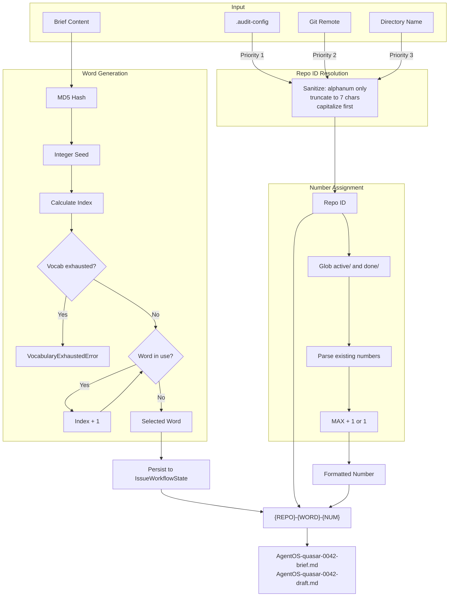

# 83 - Feature: Structured Issue File Naming Scheme for Multi-Repo Workflows

<!-- Template Metadata
Last Updated: 2025-01-XX
Updated By: Initial LLD creation
Update Reason: New feature implementation
-->

## 1. Context & Goal
* **Issue:** #83
* **Objective:** Implement a structured, collision-free file naming scheme (`{REPO}-{WORD}-{NUM}-{TYPE}.md`) for audit files that provides unique, memorable identifiers across multi-repo workflows.
* **Status:** Draft
* **Related Issues:** None

### Open Questions
*Questions that need clarification before or during implementation. Remove when resolved.*

- [x] Word list size: 80+ words confirmed in requirements
- [x] Hash algorithm: MD5 confirmed for deterministic word selection
- [x] Number scope: Per-repo sequential counter confirmed
- [x] Directory naming: Files are saved flat with slug prefix in filename (no subdirectory per issue)

## 2. Proposed Changes

*This section is the **source of truth** for implementation. Describe exactly what will be built.*

### 2.1 Files Changed

| File | Change Type | Description |
|------|-------------|-------------|
| `src/skills/audit/wordlist.py` | Add | New module with curated 80+ word vocabulary list |
| `src/skills/audit/utils.py` | Modify | Add slug generation, repo ID extraction, number assignment functions |
| `src/skills/audit/state.py` | Modify | Add `issue_word` field to `IssueWorkflowState` |
| `src/skills/audit/nodes/load_brief.py` | Modify | Use new slug generation, persist `issue_word` to state |
| `src/skills/audit/nodes/draft.py` | Modify | Use updated `save_audit_file()` signature |
| `src/skills/audit/nodes/review.py` | Modify | Use updated `save_audit_file()` signature |
| `src/skills/audit/nodes/human_edit_draft.py` | Modify | Use updated `save_audit_file()` signature |
| `src/skills/audit/nodes/human_edit_verdict.py` | Modify | Use updated `save_audit_file()` signature |
| `src/skills/audit/nodes/file_issue.py` | Modify | Update `done/` file naming (flat structure with slug prefix) |
| `tests/skills/audit/test_slug_generation.py` | Add | Unit tests for slug generation |
| `tests/skills/audit/test_repo_id.py` | Add | Unit tests for repo ID extraction and sanitization |

### 2.2 Dependencies

*No new packages required - uses only Python standard library.*

```toml
# pyproject.toml additions (if any)
# None - uses hashlib, re, pathlib from stdlib
```

### 2.3 Data Structures

```python
# Pseudocode - NOT implementation

# Extended IssueWorkflowState
class IssueWorkflowState(TypedDict):
    # Existing fields...
    issue_word: str | None  # The vocabulary word component of the slug
    repo_id: str | None     # The sanitized repo identifier

# Slug components
class SlugComponents(TypedDict):
    repo_id: str   # Max 7 chars, first letter capitalized (e.g., "AgentOS")
    word: str      # 4-6 letter word from vocabulary (e.g., "quasar")
    number: int    # Sequential number 1-9999 (e.g., 42)
    
# Full slug format: "{repo_id}-{word}-{number:04d}" → "AgentOS-quasar-0042"

# Custom exception for vocabulary exhaustion
class VocabularyExhaustedError(Exception):
    """Raised when all words in the vocabulary are in use."""
    pass
```

### 2.4 Function Signatures

```python
# src/skills/audit/utils.py

class VocabularyExhaustedError(Exception):
    """Raised when all words in the vocabulary are in use."""
    pass

def get_repo_short_id(
    repo_path: Path | None = None,
    config_override: str | None = None
) -> str:
    """
    Extract sanitized repo identifier from available sources.
    
    Priority order:
    1. config_override (from .audit-config)
    2. Git remote URL
    3. Directory name
    
    Returns: Max 7 alphanumeric chars, first letter capitalized.
    Raises: ValueError if empty after sanitization.
    """
    ...

def sanitize_repo_id(raw_id: str) -> str:
    """
    Sanitize input to alphanumeric characters only.
    
    - Strips all non-alphanumeric characters
    - Truncates to first 7 characters
    - Capitalizes first letter
    
    Raises: ValueError if empty after sanitization.
    """
    ...

def get_next_issue_number(
    repo_id: str,
    active_dir: Path,
    done_dir: Path
) -> int:
    """
    Get next sequential issue number scoped to repo_id.
    
    Scans both active/ and done/ directories for existing numbers
    matching the repo_id prefix.
    
    Returns: Next available number (1 if none exist).
    """
    ...

def generate_issue_word(
    brief_content: str,
    existing_words: set[str]
) -> str:
    """
    Generate deterministic word from brief content hash.
    
    Uses MD5 hash as seed for word selection.
    Handles collisions by incrementing index.
    
    Returns: Unique word not in existing_words.
    Raises: VocabularyExhaustedError if all words are in use.
    """
    ...

def get_existing_words(
    active_dir: Path,
    done_dir: Path
) -> set[str]:
    """
    Collect all words currently in use from active/ and done/ directories.
    
    Returns: Set of words extracted from filenames.
    """
    ...

def generate_slug(
    brief_content: str,
    repo_path: Path | None = None
) -> tuple[str, SlugComponents]:
    """
    Generate complete slug and component breakdown.
    
    Returns: (full_slug, components_dict)
    Example: ("AgentOS-quasar-0042", {"repo_id": "AgentOS", "word": "quasar", "number": 42})
    """
    ...

def save_audit_file(
    audit_dir: Path,
    slug: str,
    file_type: str,
    content: str,
    sequence: int | None = None
) -> Path:
    """
    Save audit file with new naming convention.
    
    Args:
        audit_dir: Base audit directory
        slug: Full slug (e.g., "AgentOS-quasar-0042")
        file_type: Type suffix (brief, draft, verdict, feedback, filed)
        content: File content
        sequence: Optional revision number (for draft2, verdict2)
    
    Returns: Path to saved file.
    """
    ...

def read_audit_config(repo_path: Path) -> dict | None:
    """
    Read .audit-config file if present.
    
    Returns: Parsed config dict or None if not found.
    """
    ...
```

```python
# src/skills/audit/wordlist.py

ISSUE_WORDS: list[str] = [...]  # 80+ curated words

def get_word_by_index(index: int) -> str:
    """Get word from list with wraparound."""
    ...
```

### 2.5 Logic Flow (Pseudocode)

**Slug Generation Flow:**
```
1. Receive brief_content and optional repo_path
2. Get repo_id:
   a. Check for .audit-config → read repo_id field
   b. ELSE extract from git remote URL
   c. ELSE use directory name
   d. Sanitize: strip non-alphanumeric, truncate to 7, capitalize first
   e. IF empty THEN raise ValueError
3. Collect existing_words from active/ and done/
4. Generate word:
   a. IF len(existing_words) >= len(ISSUE_WORDS):
      - RAISE VocabularyExhaustedError("All 80+ words in use")
   b. Hash brief_content with MD5
   c. Convert hash to integer seed
   d. Calculate index = seed % len(ISSUE_WORDS)
   e. attempts = 0
   f. WHILE word at index in existing_words AND attempts < len(ISSUE_WORDS):
      - index = (index + 1) % len(ISSUE_WORDS)
      - attempts += 1
   g. Return word
5. Get next number for repo_id
6. Format slug: "{repo_id}-{word}-{number:04d}"
7. Persist issue_word to IssueWorkflowState
8. Return slug and components
```

**Repo ID Extraction Flow:**
```
1. IF .audit-config exists AND has repo_id:
   - Return sanitize_repo_id(config.repo_id)
2. ELSE IF git remote URL available:
   - Extract repo name from URL
   - Log info: "Using repo ID from git remote"
   - Return sanitize_repo_id(repo_name)
3. ELSE:
   - Get current directory name
   - Log warning: "Falling back to directory name for repo ID - may change if folder is renamed"
   - Return sanitize_repo_id(dir_name)
```

**Sanitization Flow:**
```
1. Apply regex: re.sub(r'[^a-zA-Z0-9]', '', raw_id)
2. IF result is empty:
   - Raise ValueError("Repo ID empty after sanitization")
3. Truncate to first 7 characters
4. Capitalize first letter
5. Return sanitized_id
```

**Number Assignment Flow:**
```
1. Glob for "{repo_id}-*-????-*.md" in active/
2. Glob for "{repo_id}-*-????-*.md" in done/
3. Extract 4-digit numbers from matching filenames
4. IF no numbers found:
   - Return 1
5. ELSE:
   - Return max(numbers) + 1
```

### 2.6 Technical Approach

* **Module:** `src/skills/audit/`
* **Pattern:** Pure functions for generation, stateful tracking in workflow state
* **Key Decisions:**
  - MD5 for deterministic word selection (fast, no crypto requirements)
  - Per-repo number scoping to avoid collisions across repos
  - Alphanumeric-only sanitization for path safety
  - Priority-based repo ID resolution for flexibility
  - Flat file structure with slug prefix (no subdirectories per issue)

### 2.7 Architecture Decisions

| Decision | Options Considered | Choice | Rationale |
|----------|-------------------|--------|-----------|
| Hash algorithm | MD5, SHA-256, xxHash | MD5 | Fast, deterministic, no security requirements for word selection |
| Word collision handling | Random fallback, Sequential increment, Re-hash | Sequential increment | Deterministic, simple, preserves hash relationship |
| Number scope | Global, Per-repo, Per-word | Per-repo | Balances uniqueness with meaningful sequence per project |
| Config format | JSON, YAML, TOML | YAML | Consistent with other project configs, human-readable |
| Repo ID length | 5, 7, 10 chars | 7 chars | Good balance of readability and uniqueness |
| File organization | Subdirectory per issue, Flat with prefix | Flat with prefix | Simpler implementation, easier to glob, consistent with existing patterns |

**Architectural Constraints:**
- Must maintain backward compatibility with existing `NNN-{type}.md` format
- No external dependencies (stdlib only)
- Must be deterministic for reproducibility

## 3. Requirements

*What must be true when this is done. These become acceptance criteria.*

1. `get_repo_short_id()` returns ≤7 character capitalized repo identifier
2. `get_repo_short_id()` sanitizes input to alphanumeric only via regex `[a-zA-Z0-9]+`
3. `get_repo_short_id()` follows priority order: `.audit-config` → git remote → directory name
4. `get_repo_short_id()` raises `ValueError` for empty result after sanitization
5. `generate_issue_word()` produces deterministic word from brief hash
6. Word selection detects and avoids collisions in `active/` and `done/`
7. `generate_issue_word()` raises `VocabularyExhaustedError` when all words are in use
8. `get_next_issue_number()` scopes counter to current Repo ID only
9. Slug format matches `{REPO}-{WORD}-{NUM}` pattern exactly
10. All new audit files use `{SLUG}-{TYPE}.md` naming (flat structure in active/ and done/)
11. Revision files append sequence number (draft2, verdict2)
12. Existing old-format issues continue to work unchanged
13. Wordlist contains 80+ curated vocabulary-expanding words
14. `issue_word` persisted to `IssueWorkflowState` after generation

## 4. Alternatives Considered

| Option | Pros | Cons | Decision |
|--------|------|------|----------|
| UUID-based naming | Guaranteed unique, no collision logic | Unmemorable, long paths, no semantic meaning | **Rejected** |
| Sequential numbers only | Simple implementation | Collisions across repos, not memorable | **Rejected** |
| Hash-only (no word) | Unique, deterministic | Not human-friendly, hard to discuss | **Rejected** |
| **{REPO}-{WORD}-{NUM}** | Memorable, unique, repo-scoped, human-friendly | Requires wordlist, collision detection | **Selected** |
| Random word selection | Simpler implementation | Non-deterministic, harder to reproduce | **Rejected** |

**Rationale:** The `{REPO}-{WORD}-{NUM}` format provides the best balance of uniqueness, memorability, and usability. The word component makes issues easy to discuss ("check the quasar issue") while the repo prefix and number ensure global uniqueness.

## 5. Data & Fixtures

### 5.1 Data Sources

| Attribute | Value |
|-----------|-------|
| Source | Local curated wordlist (embedded in code) |
| Format | Python list of strings |
| Size | 80+ words |
| Refresh | Manual updates via code changes |
| Copyright/License | Public domain / project license |

### 5.2 Data Pipeline

```
ISSUE_WORDS (hardcoded) ──hash seed──► Word Selection ──collision check──► Unique Word
```

### 5.3 Test Fixtures

| Fixture | Source | Notes |
|---------|--------|-------|
| Sample brief content | Generated | Various content for hash distribution testing |
| Mock directory structures | Generated | Simulated active/done directories |
| Malicious repo names | Hardcoded | Path traversal attempts, special characters |
| Mock git remote output | Hardcoded | Various remote URL formats |

### 5.4 Deployment Pipeline

No external data deployment needed - wordlist is embedded in source code.

## 6. Diagram

### 6.1 Mermaid Quality Gate

- [x] **Simplicity:** Similar components collapsed
- [x] **No touching:** All elements have visual separation
- [x] **No hidden lines:** All arrows fully visible
- [x] **Readable:** Labels not truncated, flow direction clear
- [ ] **Auto-inspected:** Agent rendered via mermaid.ink and viewed

**Auto-Inspection Results:**
```
- Touching elements: [ ] None / [ ] Found: ___
- Hidden lines: [ ] None / [ ] Found: ___
- Label readability: [ ] Pass / [ ] Issue: ___
- Flow clarity: [ ] Clear / [ ] Issue: ___
```

### 6.2 Diagram



## 7. Security & Safety Considerations

### 7.1 Security

| Concern | Mitigation | Status |
|---------|------------|--------|
| Path traversal via repo ID | Sanitize to alphanumeric only: `re.sub(r'[^a-zA-Z0-9]', '', raw_id)` | Addressed |
| Path traversal via .audit-config | Same sanitization applied to config values | Addressed |
| Malicious directory names | Sanitization strips `../`, `./`, all special chars | Addressed |
| Git remote injection | Extract only repo name portion, then sanitize | Addressed |
| File overwrite attacks | Sequential numbers prevent overwrites | Addressed |

### 7.2 Safety

| Concern | Mitigation | Status |
|---------|------------|--------|
| Empty repo ID after sanitization | Raise ValueError with clear message | Addressed |
| Wordlist exhaustion | Guard clause raises `VocabularyExhaustedError` before infinite loop | Addressed |
| Number overflow | 4-digit format supports 9999 issues per repo | Addressed |
| Backward compatibility | Old format detection, no forced migration | Addressed |
| Data loss on rename | Warning logged, `.audit-config` allows locking | Addressed |

**Fail Mode:** Fail Closed - If sanitization produces empty ID or vocabulary is exhausted, operation fails with clear error rather than using unsafe fallback.

**Recovery Strategy:** If issues arise, `.audit-config` can be created to explicitly set a safe repo ID. If vocabulary exhausted, archive old issues to `done/` to free up words.

## 8. Performance & Cost Considerations

### 8.1 Performance

| Metric | Budget | Approach |
|--------|--------|----------|
| Slug generation latency | < 50ms | In-memory wordlist, simple hash |
| Directory scanning | < 100ms | Glob pattern matching, lazy evaluation |
| Memory usage | < 1MB | Static wordlist, no caching needed |

**Bottlenecks:** Directory scanning with thousands of issues could slow down; mitigated by efficient glob patterns.

### 8.2 Cost Analysis

| Resource | Unit Cost | Estimated Usage | Monthly Cost |
|----------|-----------|-----------------|--------------|
| Compute | $0 | Local execution | $0 |
| Storage | $0 | ~1KB per file | Negligible |
| API calls | $0 | None (local only) | $0 |

**Cost Controls:** N/A - No external services used.

**Worst-Case Scenario:** With 10,000 issues, directory scanning might take 1-2 seconds. Acceptable for CLI workflow.

## 9. Legal & Compliance

| Concern | Applies? | Mitigation |
|---------|----------|------------|
| PII/Personal Data | No | Filenames contain no personal data |
| Third-Party Licenses | No | All code original, stdlib only |
| Terms of Service | N/A | No external services |
| Data Retention | N/A | User-controlled local files |
| Export Controls | No | No restricted algorithms |

**Data Classification:** Internal (project workflow data)

**Compliance Checklist:**
- [x] No PII stored without consent
- [x] All third-party licenses compatible with project license
- [x] External API usage compliant with provider ToS (N/A)
- [x] Data retention policy documented (N/A - local files)

## 10. Verification & Testing

### 10.1 Test Scenarios

| ID | Scenario | Type | Input | Expected Output | Pass Criteria |
|----|----------|------|-------|-----------------|---------------|
| 010 | Sanitize normal repo name | Auto | `"AgentOS"` | `"AgentOS"` | Unchanged when valid |
| 020 | Sanitize with special chars | Auto | `"my-repo!@#$%"` | `"Myrepo"` | Only alphanumeric |
| 030 | Sanitize path traversal | Auto | `"../../../etc"` | `"Etc"` | Traversal stripped |
| 040 | Sanitize unicode | Auto | `"my repo 日本語"` | `"Myrepo"` | Unicode stripped |
| 050 | Sanitize empty after strip | Auto | `"!@#$%^&*()"` | ValueError | Clear error message |
| 060 | Truncate long name | Auto | `"MyVeryLongRepoName"` | `"MyVeryL"` | Max 7 chars |
| 070 | Word deterministic | Auto | Same brief twice | Same word | Reproducible |
| 080 | Word collision avoidance | Auto | Brief + existing words | Different word | Not in existing set |
| 085 | Vocabulary exhaustion | Auto | All 80+ words in use | VocabularyExhaustedError | Exception raised |
| 090 | Number scoping per repo | Auto | Mixed repo files | Correct sequence | Scoped correctly |
| 100 | Number starts at 1 | Auto | Empty directories | `1` | First issue is 0001 |
| 110 | Full slug format | Auto | Brief + repo | `{REPO}-{WORD}-{NUM}` | Format matches |
| 120 | Save file naming | Auto | Slug + type | Correct filename | `{SLUG}-{TYPE}.md` |
| 130 | Revision numbering | Auto | draft + sequence=2 | `{SLUG}-draft2.md` | Sequence appended |
| 140 | Git remote extraction | Auto | Mock git output | Correct repo name | Parsed correctly |
| 150 | Config file priority | Auto | Config + git | Config value used | Priority respected |
| 155 | Directory fallback | Auto | No config, no git | Directory name used | Fallback to dir name |
| 160 | Backward compat | Auto | Old format files | Still work | No breakage |
| 170 | State persistence | Auto | Generate slug | `issue_word` in state | Field populated |
| 180 | Filing moves flat files | Auto | File issue | Files in done/ with slug prefix | Flat structure maintained |

### 10.2 Test Commands

```bash
# Run all automated tests
poetry run pytest tests/skills/audit/test_slug_generation.py tests/skills/audit/test_repo_id.py -v

# Run only fast/mocked tests
poetry run pytest tests/skills/audit/ -v -m "not live"

# Run with coverage
poetry run pytest tests/skills/audit/ -v --cov=src/skills/audit --cov-report=term-missing
```

### 10.3 Manual Tests (Only If Unavoidable)

**N/A - All scenarios automated.**

## 11. Risks & Mitigations

| Risk | Impact | Likelihood | Mitigation |
|------|--------|------------|------------|
| Hash collisions causing word exhaustion | Med | Low | 80+ words, sequential fallback, VocabularyExhaustedError guard |
| Directory rename breaks continuity | Low | Med | Warning logged, `.audit-config` override |
| Existing workflow disruption | High | Low | Backward compatibility preserved |
| Git not available in some envs | Low | Low | Falls back to directory name with warning |
| Wordlist perceived as unprofessional | Low | Low | Curated vocabulary-expanding words |

## 12. Definition of Done

### Code
- [ ] `wordlist.py` created with 80+ curated words
- [ ] `VocabularyExhaustedError` exception class created
- [ ] `get_repo_short_id()` implemented with sanitization and fallback logging
- [ ] `get_next_issue_number()` implemented with per-repo scoping
- [ ] `generate_issue_word()` implemented with collision detection and exhaustion guard
- [ ] `generate_slug()` implemented combining all components
- [ ] `save_audit_file()` updated for new naming convention
- [ ] All 5 node files updated to use new naming
- [ ] `IssueWorkflowState` updated with `issue_word` field
- [ ] State persistence of `issue_word` implemented in load_brief node
- [ ] Code comments reference this LLD

### Tests
- [ ] All 19 test scenarios pass
- [ ] Sanitization security tests pass
- [ ] Vocabulary exhaustion test passes
- [ ] State persistence test passes
- [ ] Directory fallback test passes
- [ ] Test coverage ≥ 90% for new code

### Documentation
- [ ] LLD updated with any deviations
- [ ] Implementation Report (0103) completed
- [ ] Audit skill README updated with naming scheme
- [ ] `.audit-config` format documented
- [ ] File inventory updated with `wordlist.py`

### Review
- [ ] Code review completed
- [ ] User approval before closing issue

---

## Appendix: Review Log

*Track all review feedback with timestamps and implementation status.*

### Gemini Review #1 (REVISE)

**Timestamp:** 2025-01-XX
**Reviewer:** Gemini 3 Pro
**Verdict:** REVISE

#### Comments

| ID | Comment | Implemented? |
|----|---------|--------------|
| G1.1 | "Unbounded Loop in Word Generation: The pseudocode for `generate_issue_word` contains a `WHILE` loop checking for collisions. If all 80+ words are in use (vocabulary exhaustion), this becomes an infinite loop." | YES - Added guard clause and `VocabularyExhaustedError` in Section 2.3, 2.4, 2.5 |
| G1.2 | "Requirement Coverage Gap: Coverage is 85.7%. Missing test for directory naming (Req 10) and state persistence (Req 14)." | YES - Clarified Req 10 (flat structure, not subdirectories), added Req 7 for exhaustion, updated Req 14, added test scenarios 085, 170, 180 |
| G1.3 | "Question: Does the 'Filed' state involve moving files into a subdirectory named `{SLUG}` inside `done/`, or are files simply moved flat into `done/` with the `{SLUG}` prefix in the filename?" | YES - Clarified in Section 1 Open Questions and Section 2.7: flat structure with slug prefix |

### Gemini Review #2 (REVISE)

**Timestamp:** 2025-01-XX
**Reviewer:** Gemini 3 Pro
**Verdict:** REVISE

#### Comments

| ID | Comment | Implemented? |
|----|---------|--------------|
| G2.1 | "Requirement Coverage Gap: Coverage is 92.8%. Requirement #3 specifies a 3-step priority order. Section 10 tests the first two priorities (Test 150) and the Git extraction (Test 140), but fails to test the third priority (Directory Name) when the first two are missing." | YES - Added Test 155 "Directory fallback" to test the Priority 3 case where neither .audit-config nor git remote exists |

### Review Summary

| Review | Date | Verdict | Key Issue |
|--------|------|---------|-----------|
| Gemini #1 | 2025-01-XX | REVISE | Unbounded loop risk, requirement coverage gap |
| Gemini #2 | 2025-01-XX | REVISE | Missing test for directory fallback (Priority 3) |

**Final Status:** PENDING