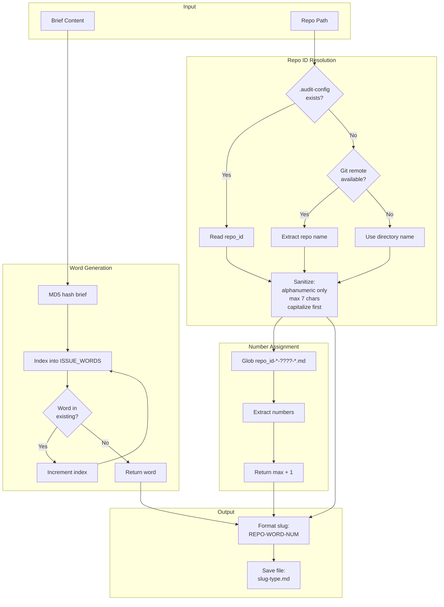

# 83 - Feature: Structured Issue File Naming Scheme for Multi-Repo Workflows

<!-- Template Metadata
Last Updated: 2025-01-10
Updated By: Initial LLD creation
Update Reason: New feature design for structured issue file naming
-->

## 1. Context & Goal
* **Issue:** #83
* **Objective:** Implement a collision-free file naming scheme `{REPO}-{WORD}-{NUM}-{TYPE}.md` for audit files across multi-repo workflows
* **Status:** Approved (gemini-3-pro-preview, 2026-02-04)
* **Related Issues:** None

### Open Questions
*All questions resolved during review.*

- [x] ~~Should the wordlist be extensible via configuration, or is the embedded 80+ word list sufficient?~~ **RESOLVED: Embedded is sufficient.** Following YAGNI, file I/O for configuration adds unnecessary complexity for an internal tool. 80 words * 9999 issues provides ample headroom (~800k issues).
- [x] ~~What should happen if the wordlist is exhausted (all 80+ words collide for a repo)?~~ **RESOLVED: Raise ValueError.** This is the correct "Fail Closed" behavior. In the unlikely event of 80 active, colliding issues for a single repo, human intervention is required to archive old issues.

## 2. Proposed Changes

*This section is the **source of truth** for implementation. Describe exactly what will be built.*

### 2.1 Files Changed

| File | Change Type | Description |
|------|-------------|-------------|
| `src/skills/audit/utils.py` | Modify | Add `get_repo_short_id()`, `get_next_issue_number()`, `generate_issue_word()`, update `generate_slug()`, `save_audit_file()` |
| `src/skills/audit/wordlist.py` | Add | New file containing curated `ISSUE_WORDS` list (80+ words) |
| `src/skills/audit/nodes/load_brief.py` | Modify | Use new slug generation |
| `src/skills/audit/nodes/draft.py` | Modify | Use updated `save_audit_file()` signature |
| `src/skills/audit/nodes/review.py` | Modify | Use updated `save_audit_file()` signature |
| `src/skills/audit/nodes/human_edit_draft.py` | Modify | Use updated `save_audit_file()` signature |
| `src/skills/audit/nodes/human_edit_verdict.py` | Modify | Use updated `save_audit_file()` signature |
| `src/skills/audit/nodes/file_issue.py` | Modify | Update `done/` directory naming |
| `src/skills/audit/state.py` | Modify | Add `issue_word` to `IssueWorkflowState` |

### 2.2 Dependencies

*New packages, APIs, or services required.*

```toml
# pyproject.toml additions (if any)
# None - uses standard library only (hashlib, re, pathlib)
```

### 2.3 Data Structures

```python
# Pseudocode - NOT implementation
class IssueWorkflowState(TypedDict):
    # ... existing fields ...
    issue_word: str  # The vocabulary word component of the slug (e.g., "quasar")
    issue_slug: str  # Full slug: {REPO}-{WORD}-{NUM} (e.g., "AgentOS-quasar-0042")

class AuditConfig(TypedDict):
    repo_id: str  # Override for repository identifier
```

### 2.4 Function Signatures

```python
# src/skills/audit/utils.py

def get_repo_short_id(
    repo_path: Path | None = None,
    config_override: str | None = None
) -> str:
    """
    Get sanitized repository short identifier (max 7 chars, capitalized).
    
    Priority order:
    1. config_override parameter (for testing)
    2. .audit-config file repo_id field
    3. Git remote URL repo name
    4. Current directory name
    
    Raises:
        ValueError: If result is empty after sanitization
    """
    ...

def sanitize_repo_id(raw_id: str) -> str:
    """
    Sanitize raw repo ID to alphanumeric only, max 7 chars, first letter capitalized.
    
    Raises:
        ValueError: If result is empty after sanitization
    """
    ...

def get_next_issue_number(
    repo_id: str,
    active_dir: Path,
    done_dir: Path
) -> int:
    """
    Get next sequential issue number for a specific repo ID.
    
    Scans active/ and done/ directories for files matching {repo_id}-*-????-*.md
    Returns max(found_numbers) + 1, or 1 if none exist.
    
    Note: Ignores legacy-format files (NNN-*.md) that don't match the new naming scheme.
    """
    ...

def generate_issue_word(
    brief_content: str,
    existing_words: set[str]
) -> str:
    """
    Generate deterministic word from brief content, avoiding collisions.
    
    Uses MD5 hash of content to seed word selection.
    On collision, tries next word in deterministic sequence.
    
    Raises:
        ValueError: If all words in wordlist are exhausted (collision with all)
    """
    ...

def generate_slug(
    brief_content: str,
    active_dir: Path,
    done_dir: Path,
    repo_path: Path | None = None
) -> tuple[str, str]:
    """
    Generate full slug and word for a new issue.
    
    Returns:
        tuple of (full_slug, word) e.g., ("AgentOS-quasar-0042", "quasar")
    
    Note: Also updates workflow state with issue_word when called from workflow context.
    """
    ...

def get_existing_words(
    repo_id: str,
    active_dir: Path,
    done_dir: Path
) -> set[str]:
    """
    Get all words currently in use for a repo ID in active/ and done/.
    """
    ...

def save_audit_file(
    audit_dir: Path,
    slug: str,
    file_type: str,
    content: str,
    sequence: int | None = None
) -> Path:
    """
    Save audit file with new naming convention.
    
    Args:
        audit_dir: Base audit directory (e.g., docs/audit/active/)
        slug: Full slug (e.g., "AgentOS-quasar-0042")
        file_type: One of: brief, draft, verdict, feedback, filed
        content: File content
        sequence: Optional revision number (e.g., 2 for draft2)
    
    Returns:
        Path to saved file
    """
    ...
```

```python
# src/skills/audit/wordlist.py

ISSUE_WORDS: list[str] = [...]  # 80+ curated vocabulary-expanding words
```

### 2.5 Logic Flow (Pseudocode)

**Slug Generation Flow:**
```
1. Receive brief_content, active_dir, done_dir
2. Get repo_id via get_repo_short_id()
   a. Check .audit-config for repo_id override
   b. Else extract from git remote URL
   c. Else use directory name
   d. Sanitize: regex [a-zA-Z0-9]+ → truncate 7 chars → capitalize first
   e. IF empty THEN raise ValueError
3. Get existing_words from active/ and done/ for this repo_id
4. Generate word via generate_issue_word(brief_content, existing_words)
   a. Hash brief_content with MD5
   b. Convert hash to index into ISSUE_WORDS
   c. WHILE word at index is in existing_words:
      - increment index (wrap around)
      - IF all words tried THEN raise ValueError
   d. Return unique word
5. Get next_number via get_next_issue_number(repo_id, active_dir, done_dir)
   a. Glob for {repo_id}-*-????-*.md in both directories
   b. Extract 4-digit numbers from matches
   c. Return max + 1 or 1 if none
6. Format slug: f"{repo_id}-{word}-{next_number:04d}"
7. Return (slug, word)
```

**File Saving Flow:**
```
1. Receive audit_dir, slug, file_type, content, sequence
2. Create directory: audit_dir / slug
3. Build filename:
   a. IF sequence THEN f"{slug}-{file_type}{sequence}.md"
   b. ELSE f"{slug}-{file_type}.md"
4. Write content to file
5. Return file path
```

**Repo ID Resolution Flow:**
```
1. Check for config_override parameter → use if provided
2. Check for .audit-config file in repo_path:
   a. IF exists AND contains repo_id → sanitize and return
3. Try git remote URL extraction:
   a. Run: git remote get-url origin
   b. Parse repo name from URL patterns:
      - git@github.com:owner/RepoName.git → RepoName
      - https://github.com/owner/RepoName.git → RepoName
   c. IF found → sanitize and return
4. Fallback to directory name:
   a. Get repo_path.name (or cwd if repo_path is None)
   b. Sanitize and return
5. IF result empty after sanitization → raise ValueError
```

### 2.6 Technical Approach

* **Module:** `src/skills/audit/`
* **Pattern:** Utility functions with dependency injection for testability
* **Key Decisions:**
  - MD5 for hashing: Fast, deterministic, no security requirements
  - Wordlist embedded in code: No external dependencies, version-controlled
  - Per-repo number scoping: Prevents collision across repos while keeping numbers manageable
  - Priority-based repo ID resolution: Allows explicit override while providing sensible defaults

### 2.7 Architecture Decisions

| Decision | Options Considered | Choice | Rationale |
|----------|-------------------|--------|-----------|
| Hash algorithm | MD5, SHA256, CRC32 | MD5 | Fast, deterministic, 128-bit provides sufficient distribution for 80 words |
| Wordlist storage | External file, database, embedded list | Embedded Python list | No I/O, version controlled, simple deployment |
| Number scoping | Global counter, per-repo counter, UUID | Per-repo counter | Readable numbers that don't collide across repos |
| Repo ID source | Directory only, git remote only, priority chain | Priority chain with config override | Flexibility for edge cases while sensible defaults |
| Collision handling | Random fallback, sequential probe, error | Sequential probe | Deterministic behavior, exhaustion detection |

**Architectural Constraints:**
- Must integrate with existing LangGraph-based audit workflow
- Cannot introduce external network dependencies (offline operation required)
- Must maintain backward compatibility with existing NNN-{type}.md format

## 3. Requirements

*What must be true when this is done. These become acceptance criteria.*

1. `get_repo_short_id()` returns ≤7 char capitalized repo identifier using alphanumeric-only sanitization
2. `get_repo_short_id()` follows priority: `.audit-config` → git remote → directory name
3. `get_repo_short_id()` raises `ValueError` for empty result after sanitization
4. `generate_issue_word()` produces deterministic word from brief hash
5. Word selection detects and avoids collisions in `active/` and `done/` directories
6. `get_next_issue_number()` scopes counter to current Repo ID only
7. Slug format matches `{REPO}-{WORD}-{NUM}` pattern (e.g., `AgentOS-quasar-0042`)
8. All new audit files use `{SLUG}-{TYPE}.md` naming convention
9. Audit directories named with full slug
10. Revision files append sequence number (draft2, verdict2)
11. Existing old-format issues continue to work unchanged (backward compatibility)
12. Wordlist contains 80+ curated vocabulary-expanding words
13. `issue_word` tracked in workflow state and returned by `generate_slug()`

## 4. Alternatives Considered

| Option | Pros | Cons | Decision |
|--------|------|------|----------|
| UUID-based naming | Guaranteed unique, no collision logic | Not memorable, hard to reference verbally | **Rejected** |
| Sequential numbers only | Simple, proven | Collisions across repos, not memorable | **Rejected** |
| Random word selection | Simpler implementation | Non-deterministic, harder to debug | **Rejected** |
| Repo-Word-Num format | Memorable, collision-free, multi-repo support | More complex implementation | **Selected** |
| External wordlist API | Larger vocabulary | Network dependency, potential failures | **Rejected** |

**Rationale:** The selected `{REPO}-{WORD}-{NUM}` format provides unique, memorable identifiers that work across multiple repositories while remaining deterministic and offline-capable.

## 5. Data & Fixtures

*Per [0108-lld-pre-implementation-review.md](0108-lld-pre-implementation-review.md) - complete this section BEFORE implementation.*

### 5.1 Data Sources

| Attribute | Value |
|-----------|-------|
| Source | Local filesystem, git config |
| Format | Markdown files, git remote URL |
| Size | Typically <100 files per repo |
| Refresh | Real-time (read on demand) |
| Copyright/License | N/A - user's own data |

### 5.2 Data Pipeline

```
Brief Content ──MD5 hash──► Word Index ──collision check──► Unique Word
    │
    └──► Git/Directory ──sanitize──► Repo ID
                                         │
                                         └──► active/done/ dirs ──glob──► Max Number
                                                                              │
                                                                              └──► Slug
```

### 5.3 Test Fixtures

| Fixture | Source | Notes |
|---------|--------|-------|
| Mock brief content | Hardcoded | Various test strings for hash distribution |
| Mock directory structure | Generated in tmp | Simulates active/done with various file patterns |
| Mock git remote output | Hardcoded | Various URL patterns |
| Malicious input strings | Hardcoded | Path traversal attempts, special chars |
| Legacy format files | Generated in tmp | Files named `001-brief.md` for backward compat testing |

### 5.4 Deployment Pipeline

Local feature - no deployment pipeline. Test fixtures created in temporary directories during test runs.

**If data source is external:** N/A - no external data sources.

## 6. Diagram

### 6.1 Mermaid Quality Gate

Before finalizing any diagram, verify in [Mermaid Live Editor](https://mermaid.live) or GitHub preview:

- [x] **Simplicity:** Similar components collapsed
- [x] **No touching:** All elements have visual separation
- [x] **No hidden lines:** All arrows fully visible
- [x] **Readable:** Labels not truncated, flow direction clear
- [ ] **Auto-inspected:** Agent rendered via mermaid.ink and viewed

**Auto-Inspection Results:**
```
- Touching elements: [ ] None / [ ] Found: ___
- Hidden lines: [ ] None / [ ] Found: ___
- Label readability: [ ] Pass / [ ] Issue: ___
- Flow clarity: [ ] Clear / [ ] Issue: ___
```

*Reference: [0006-mermaid-diagrams.md](0006-mermaid-diagrams.md)*

### 6.2 Diagram



## 7. Security & Safety Considerations

### 7.1 Security

| Concern | Mitigation | Status |
|---------|------------|--------|
| Path traversal via repo name | Sanitize to alphanumeric only via regex `[a-zA-Z0-9]+` | Addressed |
| Path traversal via directory name | Same sanitization applied | Addressed |
| Path traversal via .audit-config | Same sanitization applied to config values | Addressed |
| Injection via brief content | Hash used only as array index, not in file paths | Addressed |
| File overwrite attacks | Files written to controlled audit directories only | Addressed |

### 7.2 Safety

| Concern | Mitigation | Status |
|---------|------------|--------|
| Wordlist exhaustion | Raise clear ValueError with guidance | Addressed |
| Empty repo ID after sanitization | Raise ValueError with descriptive message | Addressed |
| Backward compatibility breakage | Old format files continue to work, no migration | Addressed |
| Data loss during rename | Files are created new, not renamed | N/A |

**Fail Mode:** Fail Closed - Functions raise exceptions on invalid input rather than proceeding with unsafe values

**Recovery Strategy:** All operations are idempotent; re-running with corrected input produces correct output

## 8. Performance & Cost Considerations

### 8.1 Performance

| Metric | Budget | Approach |
|--------|--------|----------|
| Slug generation latency | < 100ms | MD5 is fast, directory glob is bounded |
| Memory | < 10MB | Wordlist is ~80 strings, minimal state |
| Disk I/O | 2 glob operations | Cached in memory during workflow |

**Bottlenecks:** Directory globbing in large audit folders (mitigated by specific pattern matching)

### 8.2 Cost Analysis

| Resource | Unit Cost | Estimated Usage | Monthly Cost |
|----------|-----------|-----------------|--------------|
| Local compute | $0 | N/A | $0 |
| Storage | N/A | N/A | $0 |

**Cost Controls:** N/A - purely local operation

**Worst-Case Scenario:** With 9999 issues per repo and 80+ words, the system handles ~800K unique issue identifiers before number rollover

## 9. Legal & Compliance

| Concern | Applies? | Mitigation |
|---------|----------|------------|
| PII/Personal Data | No | File names contain only repo ID, word, number |
| Third-Party Licenses | No | Wordlist is original, no external sources |
| Terms of Service | N/A | Local operation only |
| Data Retention | N/A | User controls their own files |
| Export Controls | No | No encryption or restricted algorithms |

**Data Classification:** Internal - audit workflow artifacts

**Compliance Checklist:**
- [x] No PII stored without consent
- [x] All third-party licenses compatible with project license
- [x] External API usage compliant with provider ToS (N/A)
- [x] Data retention policy documented (N/A - user files)

## 10. Verification & Testing

*Ref: [0005-testing-strategy-and-protocols.md](0005-testing-strategy-and-protocols.md)*

**Testing Philosophy:** Strive for 100% automated test coverage. All scenarios can be automated with mocked git commands and temporary directories.

### 10.0 Test Plan (TDD - Complete Before Implementation)

**TDD Requirement:** Tests MUST be written and failing BEFORE implementation begins.

| Test ID | Test Description | Expected Behavior | Status |
|---------|------------------|-------------------|--------|
| T010 | test_sanitize_repo_id_alphanumeric | Strips non-alphanumeric chars | RED |
| T020 | test_sanitize_repo_id_path_traversal | Strips `../` and similar | RED |
| T030 | test_sanitize_repo_id_truncate | Limits to 7 chars | RED |
| T040 | test_sanitize_repo_id_capitalize | First letter uppercase | RED |
| T050 | test_sanitize_repo_id_empty_raises | ValueError on empty result | RED |
| T060 | test_get_repo_short_id_config_priority | Uses .audit-config first | RED |
| T070 | test_get_repo_short_id_git_remote | Falls back to git remote | RED |
| T080 | test_get_repo_short_id_directory | Falls back to directory name | RED |
| T090 | test_generate_issue_word_deterministic | Same input → same word | RED |
| T100 | test_generate_issue_word_collision | Avoids existing words | RED |
| T110 | test_generate_issue_word_exhaustion | Raises on full collision | RED |
| T120 | test_get_next_issue_number_empty | Returns 1 for new repo | RED |
| T130 | test_get_next_issue_number_existing | Returns max + 1 | RED |
| T140 | test_get_next_issue_number_scoped | Only counts matching repo | RED |
| T150 | test_generate_slug_format | Matches {REPO}-{WORD}-{NUM} | RED |
| T160 | test_save_audit_file_creates_dir | Creates slug directory | RED |
| T170 | test_save_audit_file_revision | Handles sequence numbers | RED |
| T180 | test_wordlist_count | Contains 80+ words | RED |
| T190 | test_wordlist_unique | All words unique | RED |
| T200 | test_wordlist_valid_chars | All words 4-6 lowercase letters | RED |
| T210 | test_get_next_issue_number_ignores_legacy | Ignores `001-brief.md` format files | RED |
| T220 | test_workflow_state_update | `generate_slug()` returns issue_word for state | RED |

**Coverage Target:** ≥95% for all new code

**TDD Checklist:**
- [ ] All tests written before implementation
- [ ] Tests currently RED (failing)
- [ ] Test IDs match scenario IDs in 10.1
- [ ] Test file created at: `tests/unit/test_audit_naming.py`

### 10.1 Test Scenarios

| ID | Scenario | Type | Input | Expected Output | Pass Criteria |
|----|----------|------|-------|-----------------|---------------|
| 010 | Sanitize alphanumeric | Auto | `"my-repo!@#$%"` | `"Myrepo"` | Exact match |
| 020 | Sanitize path traversal | Auto | `"../../../etc"` | `"Etc"` | Exact match |
| 030 | Sanitize truncate | Auto | `"MyVeryLongRepoName"` | `"MyVeryL"` | 7 chars max |
| 040 | Sanitize capitalize | Auto | `"lowercase"` | `"Lowerca"` | First char uppercase |
| 050 | Sanitize empty error | Auto | `"!@#$%^&*()"` | `ValueError` | Exception raised |
| 060 | Repo ID from config | Auto | `.audit-config` with `repo_id: Custom` | `"Custom"` | Config takes priority |
| 070 | Repo ID from git | Auto | Remote `git@github.com:owner/AgentOS.git` | `"AgentOS"` | Git remote parsed |
| 080 | Repo ID from directory | Auto | Directory named `MyProject` | `"MyProje"` | Directory fallback |
| 090 | Word deterministic | Auto | Same brief twice | Same word | Words match |
| 100 | Word collision avoid | Auto | Brief + existing words `{"quasar", "zenith"}` | Word not in set | No collision |
| 110 | Word exhaustion | Auto | All 80+ words in existing | `ValueError` | Exception raised |
| 120 | Number empty repo | Auto | Empty active/done dirs | `1` | First number |
| 130 | Number existing | Auto | Files with numbers 0041, 0042 | `43` | Max + 1 |
| 140 | Number scoped | Auto | AgentOS-0042, Unleash-0015 | AgentOS→43, Unleash→16 | Per-repo scoping |
| 150 | Slug format | Auto | Repo=AgentOS, word=quasar, num=42 | `"AgentOS-quasar-0042"` | Pattern match |
| 160 | Save creates dir | Auto | slug, type, content | Directory exists and file created | Path.is_dir() and Path.is_file() |
| 170 | Save revision | Auto | slug, type, content, seq=2 | `*-type2.md` | Sequence in name |
| 180 | Wordlist count | Auto | `ISSUE_WORDS` | `len >= 80` | Count check |
| 190 | Wordlist unique | Auto | `ISSUE_WORDS` | All unique | No duplicates |
| 200 | Wordlist valid | Auto | Each word | 4-6 lowercase letters | Regex match |
| 210 | Legacy file ignored | Auto | `001-brief.md` in active/ | Not counted in number sequence | Returns 1 for new repo |
| 220 | State word returned | Auto | Call `generate_slug()` | Returns tuple with issue_word | Second element is valid word |

### 10.2 Test Commands

```bash
# Run all automated tests
poetry run pytest tests/unit/test_audit_naming.py -v

# Run only fast/mocked tests (exclude live)
poetry run pytest tests/unit/test_audit_naming.py -v -m "not live"

# Run with coverage
poetry run pytest tests/unit/test_audit_naming.py -v --cov=src/skills/audit --cov-report=term-missing
```

### 10.3 Manual Tests (Only If Unavoidable)

**N/A - All scenarios automated.** Git commands mocked via `unittest.mock.patch`, filesystem operations use `tmp_path` fixture.

## 11. Risks & Mitigations

| Risk | Impact | Likelihood | Mitigation |
|------|--------|------------|------------|
| Wordlist exhaustion for active repo | Med | Low | Clear error message, 80+ words covers typical workloads |
| Git remote parsing fails for unusual URLs | Low | Low | Fallback to directory name |
| .audit-config malformed | Low | Low | JSON parse error with helpful message |
| Backward compatibility regression | High | Low | Existing format detection, comprehensive tests (T210) |
| Number overflow at 9999 | Med | Very Low | Log warning, document limitation |

## 12. Definition of Done

### Code
- [ ] `get_repo_short_id()` implemented with sanitization
- [ ] `get_next_issue_number()` implemented with per-repo scoping
- [ ] `generate_issue_word()` implemented with collision detection
- [ ] `generate_slug()` implemented returning tuple with word
- [ ] `save_audit_file()` updated with new signature
- [ ] `wordlist.py` created with 80+ curated words
- [ ] All 5 node files updated
- [ ] `IssueWorkflowState` updated with `issue_word` field
- [ ] Code comments reference this LLD

### Tests
- [ ] All test scenarios pass (T010-T220)
- [ ] Test coverage ≥95% for new code
- [ ] Integration test: full workflow with new naming

### Documentation
- [ ] LLD updated with any deviations
- [ ] Implementation Report (0103) completed
- [ ] Audit skill README updated with naming scheme
- [ ] `.audit-config` file format documented

### Review
- [ ] Code review completed
- [ ] User approval before closing issue

---

## Reviewer Suggestions

*Non-blocking recommendations from the reviewer.*

- **Performance:** As the number of audit files grows into the thousands, the `glob` operations in `get_next_issue_number` might become a bottleneck. Consider adding a simple caching mechanism for the "next number" if bulk operations are ever performed, or advise periodic archiving of `done/` folder contents.

## Appendix: Review Log

*Track all review feedback with timestamps and implementation status.*

### Gemini Review #1 (REVISE)

**Reviewer:** Gemini 3 Pro
**Verdict:** REVISE

#### Comments

| ID | Comment | Implemented? |
|----|---------|--------------|
| G1.1 | "Add tests for backward compatibility (R11)" | YES - Added T210 test_get_next_issue_number_ignores_legacy |
| G1.2 | "Add tests for state updates (R13)" | YES - Added T220 test_workflow_state_update |
| G1.3 | "Ensure T160 explicitly asserts directory creation" | YES - Updated T160 pass criteria to verify both dir and file |
| G1.4 | "Consider debug tooling CLI command" | NOTED - Suggestion for future enhancement |

### Review Summary

| Review | Date | Verdict | Key Issue |
|--------|------|---------|-----------|
| 2 | 2026-02-04 | APPROVED | `gemini-3-pro-preview` |
| Gemini #1 | 2025-01-10 | REVISE | Test coverage below 95% threshold |

**Final Status:** APPROVED