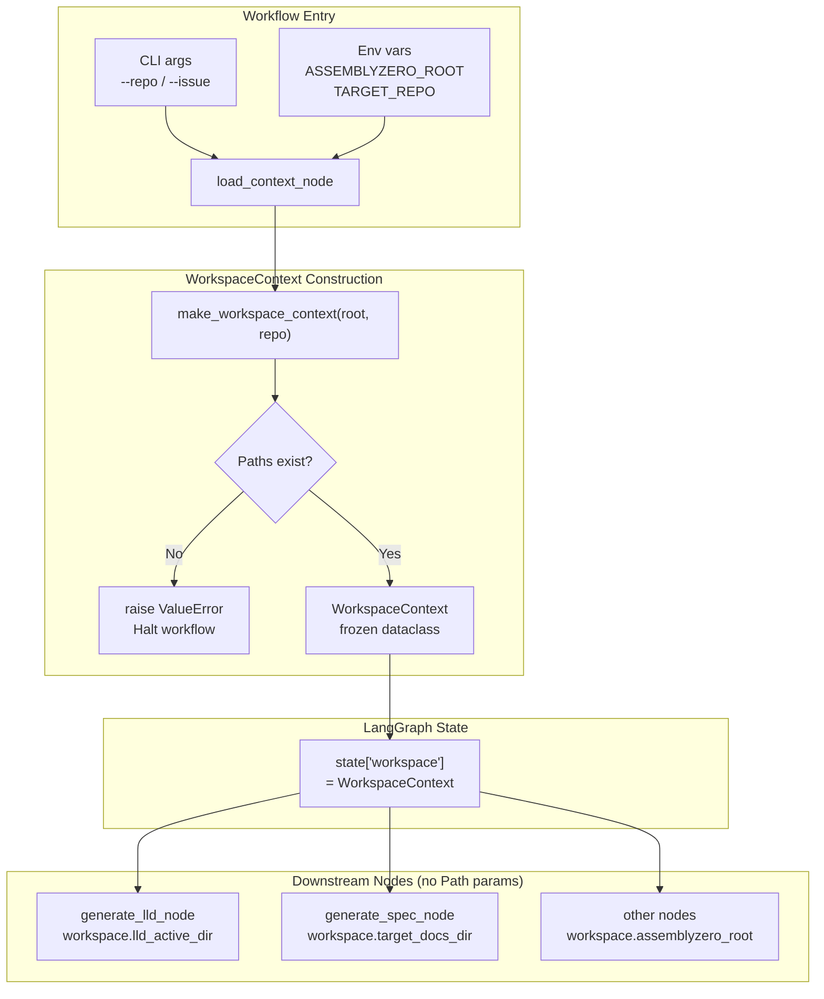

# 838 - Refactor: Implement WorkspaceContext to Eliminate Path Prop-Drilling

<!-- Template Metadata
Last Updated: 2026-03-19
Updated By: Issue #838
Update Reason: Initial draft
Previous: N/A
-->

## 1. Context & Goal
* **Issue:** #838
* **Objective:** Create a unified `WorkspaceContext` dataclass to encapsulate `assemblyzero_root` and `target_repo` Path objects, replacing scattered positional Path parameters across the codebase.
* **Status:** Draft
* **Related Issues:** #655 (implement_code.py split), #656 (LLD parsing fix)

### Open Questions
*Questions that need clarification before or during implementation. Remove when resolved.*

- [ ] Are there any callers outside `assemblyzero/` (e.g., in `tools/` scripts) that pass `assemblyzero_root`/`target_repo` directly and must also be migrated?
- [ ] Should `WorkspaceContext` be frozen (immutable) to prevent accidental mutation across node boundaries?

## 2. Proposed Changes

*This section is the **source of truth** for implementation. Describe exactly what will be built.*

### 2.1 Files Changed

| File | Change Type | Description |
|------|-------------|-------------|
| `assemblyzero/core/workspace_context.py` | Add | New module defining `WorkspaceContext` dataclass and factory helpers |
| `assemblyzero/core/__init__.py` | Modify | Re-export `WorkspaceContext` from core package |
| `assemblyzero/workflows/requirements/nodes/load_context.py` | Modify | Accept/return `WorkspaceContext` instead of separate Path params |
| `assemblyzero/workflows/lld/nodes/load_context.py` | Modify | Accept/return `WorkspaceContext` instead of separate Path params |
| `assemblyzero/workflows/implementation_spec/nodes/load_context.py` | Modify | Accept/return `WorkspaceContext` instead of separate Path params |
| `assemblyzero/workflows/requirements/nodes/generate_lld.py` | Modify | Consume `WorkspaceContext` from state instead of Path params |
| `assemblyzero/workflows/lld/nodes/generate_lld.py` | Modify | Consume `WorkspaceContext` from state instead of Path params |
| `assemblyzero/workflows/implementation_spec/nodes/generate_spec.py` | Modify | Consume `WorkspaceContext` from state instead of Path params |
| `assemblyzero/graphs/state.py` | Modify | Add `workspace: WorkspaceContext` field to shared graph state TypedDicts |
| `assemblyzero/utils/path_helpers.py` | Modify | Update any helpers that accept raw Path pair to accept `WorkspaceContext` |
| `tests/unit/test_workspace_context.py` | Add | Unit tests for `WorkspaceContext` construction, validation, and helpers |
| `tests/unit/test_gate/test_workspace_integration.py` | Add | Integration-style unit tests verifying nodes consume `WorkspaceContext` correctly |

### 2.1.1 Path Validation (Mechanical - Auto-Checked)

Mechanical validation automatically checks:
- All "Modify" files must exist in repository
- All "Delete" files must exist in repository
- All "Add" files must have existing parent directories
- No placeholder prefixes (`src/`, `lib/`, `app/`) unless directory exists

**If validation fails, the LLD is BLOCKED before reaching review.**

### 2.2 Dependencies

No new packages required. `WorkspaceContext` is implemented using stdlib `dataclasses` and `pathlib`.

```toml

# No pyproject.toml additions needed
```

### 2.3 Data Structures

```python

# assemblyzero/core/workspace_context.py (pseudocode)

@dataclass(frozen=True)
class WorkspaceContext:
    """Immutable container for the two root paths used throughout workflows.

    Attributes:
        assemblyzero_root: Absolute path to the AssemblyZero installation directory.
        target_repo:       Absolute path to the repository being worked on.
    """
    assemblyzero_root: Path
    target_repo: Path

    # Post-init validation: both paths resolved to absolute
    # Raises ValueError if either path does not exist on disk


# Graph state inclusion (pseudocode)
class BaseWorkflowState(TypedDict):
    workspace: WorkspaceContext       # replaces assemblyzero_root + target_repo fields
    # ... existing fields unchanged ...
```

### 2.4 Function Signatures

```python

# assemblyzero/core/workspace_context.py

@dataclass(frozen=True)
class WorkspaceContext:
    assemblyzero_root: Path
    target_repo: Path

    def __post_init__(self) -> None:
        """Resolve and validate both paths exist."""
        ...

    @property
    def docs_dir(self) -> Path:
        """Convenience: assemblyzero_root / 'docs'."""
        ...

    @property
    def target_docs_dir(self) -> Path:
        """Convenience: target_repo / 'docs'."""
        ...

    @property
    def lld_active_dir(self) -> Path:
        """Convenience: target_repo / 'docs' / 'lld' / 'active'."""
        ...


def make_workspace_context(
    assemblyzero_root: str | Path,
    target_repo: str | Path,
) -> WorkspaceContext:
    """Factory: coerce strings to Paths, resolve, and return frozen WorkspaceContext.

    Raises:
        ValueError: If either resolved path does not exist.
    """
    ...


def workspace_from_env() -> WorkspaceContext:
    """Factory: construct WorkspaceContext from ASSEMBLYZERO_ROOT and TARGET_REPO env vars.

    Raises:
        EnvironmentError: If required env vars are absent.
        ValueError: If resolved paths do not exist.
    """
    ...


# assemblyzero/core/__init__.py additions
def get_workspace_context() -> WorkspaceContext: ...  # re-export


# Node signature pattern (applied to all load_context.py nodes):
def load_context_node(state: RequirementsState) -> RequirementsState:
    """Build WorkspaceContext from CLI args stored in state and inject into state."""
    ...


# assemblyzero/utils/path_helpers.py
def resolve_lld_path(workspace: WorkspaceContext, issue_id: int) -> Path:
    """Return the canonical LLD file path for the given issue."""
    ...

def resolve_report_dir(workspace: WorkspaceContext, issue_id: int) -> Path:
    """Return the canonical report directory path for the given issue."""
    ...
```

### 2.5 Logic Flow (Pseudocode)

```
CONSTRUCTION (make_workspace_context):
1. Coerce assemblyzero_root -> Path, resolve to absolute
2. Coerce target_repo -> Path, resolve to absolute
3. IF assemblyzero_root does not exist THEN raise ValueError
4. IF target_repo does not exist THEN raise ValueError
5. RETURN WorkspaceContext(assemblyzero_root, target_repo)

GRAPH STATE INJECTION (load_context_node, per workflow):
1. Read raw path strings from state["cli_args"] or state["config"]
2. Call make_workspace_context(root_str, repo_str)
3. IF ValueError THEN propagate as workflow error, halt graph
4. RETURN updated state with state["workspace"] = WorkspaceContext(...)

DOWNSTREAM NODE CONSUMPTION (e.g., generate_lld_node):
1. Receive state with state["workspace"] populated
2. Extract workspace = state["workspace"]
3. Use workspace.lld_active_dir, workspace.target_docs_dir, etc.
4. NO positional Path parameters on these nodes
5. RETURN updated state

MIGRATION PATTERN for existing functions:
1. Identify function signature: fn(assemblyzero_root: Path, target_repo: Path, ...)
2. Replace with:           fn(workspace: WorkspaceContext, ...)
3. Inside body: replace assemblyzero_root -> workspace.assemblyzero_root
                         target_repo       -> workspace.target_repo
4. Update all call sites to pass workspace object
```

### 2.6 Technical Approach

* **Module:** `assemblyzero/core/workspace_context.py`
* **Pattern:** Value Object (frozen dataclass) — `WorkspaceContext` is immutable and validates at construction time; no mutation after creation.
* **Key Decisions:**
  - Frozen dataclass chosen over NamedTuple for forward-compat with adding methods/properties.
  - Paths resolved to absolute at construction time to prevent relative-path bugs when CWD changes.
  - Convenience properties (`docs_dir`, `lld_active_dir`, etc.) placed on the dataclass to avoid repeated path concatenation scattered in nodes.
  - Graph state carries `workspace: WorkspaceContext` so every node downstream of `load_context_node` has zero-param access — this is the core prop-drilling elimination.

### 2.7 Architecture Decisions

| Decision | Options Considered | Choice | Rationale |
|----------|-------------------|--------|-----------|
| Immutability | Mutable dataclass, frozen dataclass, NamedTuple | Frozen dataclass | Prevents accidental state mutation in LangGraph nodes; easier to add methods than NamedTuple |
| Graph state field | Thread-local, context var, explicit state field | Explicit `workspace` field in `TypedDict` state | LangGraph state is explicit and inspectable; avoids hidden globals |
| Validation timing | Lazy (on first use), eager (at construction) | Eager (in `__post_init__`) | Fail-fast: invalid paths surface at workflow entry, not mid-graph |
| Convenience properties | Standalone helper functions, class properties, no helpers | Class properties on `WorkspaceContext` | Co-location with data; reduces import surface; mirrors stdlib `Path` ergonomics |
| Migration scope | All nodes in one PR, incremental per workflow | All nodes in one PR | Avoids mixed old/new calling conventions that would require dual-path logic |

**Architectural Constraints:**
- Must not introduce new external dependencies (stdlib only for the new module).
- Must remain compatible with LangGraph `TypedDict`-based state (i.e., `WorkspaceContext` must be storable as a TypedDict value without LangGraph serialization conflicts).

## 3. Requirements

1. `WorkspaceContext` is a frozen dataclass with `assemblyzero_root: Path` and `target_repo: Path` fields, both resolved to absolute paths at construction time.
2. `WorkspaceContext.__post_init__` raises `ValueError` with a clear message if either path does not exist on disk.
3. `make_workspace_context(root, repo)` accepts `str | Path` for both arguments and returns a valid `WorkspaceContext` or raises `ValueError`.
4. `workspace_from_env()` reads `ASSEMBLYZERO_ROOT` and `TARGET_REPO` environment variables and delegates to `make_workspace_context`.
5. Every workflow node that previously accepted `assemblyzero_root: Path` and `target_repo: Path` as parameters is updated to instead read `state["workspace"]`.
6. `BaseWorkflowState` (or equivalent shared TypedDict) gains a `workspace: WorkspaceContext` field.
7. `load_context_node` in each workflow graph is the single point of `WorkspaceContext` construction; no other node constructs one.
8. All existing tests continue to pass after the refactor (no behaviour change, only structural change).
9. New unit tests cover: happy-path construction, nonexistent-path rejection, `workspace_from_env` with/without env vars, convenience properties return correct paths.
10. Coverage for `assemblyzero/core/workspace_context.py` is ≥ 95%.

## 4. Alternatives Considered

| Option | Pros | Cons | Decision |
|--------|------|------|----------|
| Frozen dataclass (`WorkspaceContext`) | Immutable, validates eagerly, supports properties, hashable | Slightly more ceremony than dict | **Selected** |
| Plain `dict` container | Zero new types | No type safety, no IDE completion, no validation | Rejected |
| `threading.local` / context var | No parameter passing at all | Hidden global state; incompatible with LangGraph parallel execution; untestable | Rejected |
| NamedTuple | Immutable, lightweight | Cannot add methods without breaking positional API; no `__post_init__` | Rejected |
| Pydantic `BaseModel` | Rich validation, serialization | Adds heavy dependency; overkill for two Path fields | Rejected |

**Rationale:** The frozen dataclass option gives immutability and eager validation with zero new dependencies, and is idiomatic Python for a Value Object pattern. The explicit graph state field keeps LangGraph node contracts visible and testable.

## 5. Data & Fixtures

### 5.1 Data Sources

| Attribute | Value |
|-----------|-------|
| Source | Local filesystem paths passed by CLI or environment variables |
| Format | Absolute `pathlib.Path` objects |
| Size | Two path strings per workflow invocation |
| Refresh | Per workflow invocation (stateless construction) |
| Copyright/License | N/A |

### 5.2 Data Pipeline

```
CLI args / env vars ──str──► make_workspace_context() ──WorkspaceContext──► LangGraph state["workspace"] ──property access──► node file operations
```

### 5.3 Test Fixtures

| Fixture | Source | Notes |
|---------|--------|-------|
| `tmp_path` (pytest builtin) | Generated by pytest | Creates real temp directories for path-existence validation tests |
| `mock_workspace` fixture | Hardcoded via `tmp_path` | Reusable `WorkspaceContext` with known `assemblyzero_root` and `target_repo` pointing to temp dirs |
| `mock_state` dict fixture | Generated | Minimal LangGraph state dict with `workspace` field populated for node tests |

### 5.4 Deployment Pipeline

No data migration needed. This is a pure structural refactor — no persistent data formats change. Path values continue to come from CLI `--repo` flag and the AssemblyZero install location, unchanged.

## 6. Diagram

### 6.1 Mermaid Quality Gate

Before finalizing any diagram, verify in [Mermaid Live Editor](https://mermaid.live) or GitHub preview:

- [ ] **Simplicity:** Similar components collapsed (per 0006 §8.1)
- [ ] **No touching:** All elements have visual separation (per 0006 §8.2)
- [ ] **No hidden lines:** All arrows fully visible (per 0006 §8.3)
- [ ] **Readable:** Labels not truncated, flow direction clear
- [ ] **Auto-inspected:** Agent rendered via mermaid.ink and viewed (per 0006 §8.5)

**Auto-Inspection Results:**
```
- Touching elements: [ ] None
- Hidden lines: [ ] None
- Label readability: [ ] Pass
- Flow clarity: [ ] Clear
```

### 6.2 Diagram



## 7. Security & Safety Considerations

### 7.1 Security

| Concern | Mitigation | Status |
|---------|------------|--------|
| Path traversal via env var injection | `Path.resolve()` normalises traversal sequences; existence check rejects unexpected roots | Addressed |
| Credentials in path strings logged | `WorkspaceContext.__repr__` does not redact, but paths are not credentials — acceptable | Addressed |

### 7.2 Safety

| Concern | Mitigation | Status |
|---------|------------|--------|
| Non-existent path silently used | Eager `__post_init__` validation raises `ValueError` immediately | Addressed |
| Mutable state mutation mid-graph | `frozen=True` on dataclass; `TypeError` raised on any attempted mutation | Addressed |
| Partial migration leaving mixed conventions | All affected nodes migrated in single PR; CI enforces no residual `assemblyzero_root: Path` params in node signatures via grep check in tests | Addressed |

**Fail Mode:** Fail Closed — if `WorkspaceContext` cannot be constructed (bad paths), the workflow halts at `load_context_node` with a clear `ValueError`. No partial execution.

**Recovery Strategy:** User corrects `--repo` argument or ensures directories exist; re-runs workflow. No rollback needed (no mutations occurred).

## 8. Performance & Cost Considerations

### 8.1 Performance

| Metric | Budget | Approach |
|--------|--------|----------|
| Construction latency | < 1ms | Only `Path.resolve()` + `Path.exists()` — two syscalls |
| Memory per invocation | Negligible (< 1KB) | Two Path objects in a frozen dataclass |
| API Calls | 0 | Pure local filesystem |

**Bottlenecks:** None anticipated. This is a pure in-process structural change with no I/O hot paths added.

### 8.2 Cost Analysis

| Resource | Unit Cost | Estimated Usage | Monthly Cost |
|----------|-----------|-----------------|--------------|
| Compute | $0 | CPU cycles for path resolution | $0 |
| LLM API | $0 | No LLM calls in this module | $0 |

**Cost Controls:** N/A — no external services involved.

**Worst-Case Scenario:** No cost impact at any scale. `Path.resolve()` is O(1).

## 9. Legal & Compliance

| Concern | Applies? | Mitigation |
|---------|----------|------------|
| PII/Personal Data | No | Paths are local filesystem paths, not personal data |
| Third-Party Licenses | No | stdlib only (`dataclasses`, `pathlib`, `os`) |
| Terms of Service | No | No external APIs used |
| Data Retention | No | No data persisted |
| Export Controls | No | No restricted algorithms |

**Data Classification:** Internal

**Compliance Checklist:**
- [x] No PII stored without consent
- [x] All third-party licenses compatible with project license
- [x] External API usage compliant with provider ToS
- [x] Data retention policy documented

## 10. Verification & Testing

*Ref: [0005-testing-strategy-and-protocols.md](0005-testing-strategy-and-protocols.md)*

**Testing Philosophy:** Strive for 100% automated test coverage. Manual tests are a last resort for scenarios that genuinely cannot be automated.

### 10.0 Test Plan (TDD - Complete Before Implementation)

**TDD Requirement:** Tests MUST be written and failing BEFORE implementation begins.

| Test ID | Test Description | Expected Behavior | Status |
|---------|------------------|-------------------|--------|
| T010 | Construct `WorkspaceContext` with valid paths | Returns frozen dataclass with resolved absolute paths | RED |
| T020 | Construct with nonexistent `assemblyzero_root` | Raises `ValueError` with informative message | RED |
| T030 | Construct with nonexistent `target_repo` | Raises `ValueError` with informative message | RED |
| T040 | `make_workspace_context` accepts string arguments | Coerces to Path and returns valid context | RED |
| T050 | `workspace_from_env` reads env vars | Returns valid context when both env vars set | RED |
| T060 | `workspace_from_env` missing env var | Raises `EnvironmentError` | RED |
| T070 | Convenience property `docs_dir` | Returns `assemblyzero_root / 'docs'` | RED |
| T080 | Convenience property `lld_active_dir` | Returns `target_repo / 'docs' / 'lld' / 'active'` | RED |
| T090 | Frozen dataclass mutation attempt | Raises `FrozenInstanceError` | RED |
| T100 | Hashability | `WorkspaceContext` usable as dict key | RED |
| T110 | `load_context_node` injects `workspace` into state | State updated with `WorkspaceContext`; no Path fields remaining | RED |
| T120 | `generate_lld_node` reads `workspace` from state | Node accesses `state["workspace"].lld_active_dir` without error | RED |
| T130 | Path resolution makes relative paths absolute | Relative input path resolved to absolute in output | RED |

**Coverage Target:** ≥95% for all new code

**TDD Checklist:**
- [ ] All tests written before implementation
- [ ] Tests currently RED (failing)
- [ ] Test IDs match scenario IDs in 10.1
- [ ] Test file created at: `tests/unit/test_workspace_context.py`

### 10.1 Test Scenarios

| ID | Scenario | Type | Input | Expected Output | Pass Criteria |
|----|----------|------|-------|-----------------|---------------|
| 010 | Happy-path construction | Auto | Two existing temp dirs | Frozen `WorkspaceContext` with resolved abs paths | `isinstance` check; `is_absolute()` both paths |
| 020 | Nonexistent root rejected | Auto | Missing root path, valid repo | `ValueError` raised | Exception message contains path string |
| 030 | Nonexistent repo rejected | Auto | Valid root, missing repo path | `ValueError` raised | Exception message contains path string |
| 040 | String args coerced | Auto | `str` paths for both | Valid `WorkspaceContext` | `isinstance(ctx.assemblyzero_root, Path)` |
| 050 | `workspace_from_env` happy path | Auto | Env vars set to valid paths | Valid `WorkspaceContext` | Paths match env var values after resolution |
| 060 | `workspace_from_env` missing var | Auto | `ASSEMBLYZERO_ROOT` unset | `EnvironmentError` | Exception raised |
| 070 | `docs_dir` property | Auto | Valid `WorkspaceContext` | `assemblyzero_root / "docs"` | Path equality |
| 080 | `lld_active_dir` property | Auto | Valid `WorkspaceContext` | `target_repo / "docs" / "lld" / "active"` | Path equality |
| 090 | Mutation rejected | Auto | Attempt `ctx.assemblyzero_root = other` | `FrozenInstanceError` | Exception type |
| 100 | Hashable | Auto | Two identical contexts | `hash(ctx1) == hash(ctx2)` | No `TypeError` |
| 110 | Node state injection | Auto | State dict with CLI args | `state["workspace"]` is `WorkspaceContext` | Key present, correct type |
| 120 | Downstream node consumption | Auto | State with `workspace` | Node returns state without error | No `KeyError`, no `AttributeError` |
| 130 | Relative path resolution | Auto | `Path(".")` for both | Both paths are absolute | `is_absolute()` assertion |

### 10.2 Test Commands

```bash

# Run all new workspace context tests
poetry run pytest tests/unit/test_workspace_context.py -v

# Run node integration tests
poetry run pytest tests/unit/test_gate/test_workspace_integration.py -v

# Run full unit suite to catch regressions
poetry run pytest tests/unit/ -v -m "not integration and not e2e and not adversarial"

# Run with coverage report
poetry run pytest tests/unit/test_workspace_context.py \
    tests/unit/test_gate/test_workspace_integration.py \
    --cov=assemblyzero/core/workspace_context \
    --cov=assemblyzero/graphs/state \
    --cov-report=term-missing
```

### 10.3 Manual Tests (Only If Unavoidable)

N/A - All scenarios automated.

## 11. Risks & Mitigations

| Risk | Impact | Likelihood | Mitigation |
|------|--------|------------|------------|
| LangGraph serialization cannot handle `Path` inside `TypedDict` (e.g., SQLite checkpointer serializes state) | High | Medium | Audit existing state serialization in checkpointer; add `to_dict`/`from_dict` methods to `WorkspaceContext` if needed; test with SQLite checkpoint round-trip |
| Incomplete migration leaves nodes with mixed calling convention | Medium | Medium | Grep-based regression test in `test_workspace_integration.py` asserts no `assemblyzero_root: Path` or `target_repo: Path` in node function signatures |
| Tools scripts in `tools/` not covered by migration | Medium | Low | Audit `tools/*.py` for raw Path pair patterns as part of PR review; create follow-up issue if scope is large |
| Frozen dataclass incompatible with future need for mutable workspace | Low | Low | `frozen=True` can be removed; migration is trivial since all access is via attribute names |
| `Path.exists()` check fails in CI/container where paths don't exist | Low | Low | Tests use `tmp_path` to guarantee existence; CI does not run integration tests against live workspace |

## 12. Definition of Done

### Code
- [ ] `assemblyzero/core/workspace_context.py` implemented with frozen dataclass, factory functions, and convenience properties
- [ ] `assemblyzero/core/__init__.py` re-exports `WorkspaceContext` and `make_workspace_context`
- [ ] All `load_context_node` functions in `requirements/`, `lld/`, and `implementation_spec/` workflows construct and inject `WorkspaceContext`
- [ ] All downstream nodes consume `state["workspace"]` instead of positional Path params
- [ ] `assemblyzero/graphs/state.py` `TypedDict` updated with `workspace: WorkspaceContext` field
- [ ] `assemblyzero/utils/path_helpers.py` updated to accept `WorkspaceContext`
- [ ] Code comments reference this LLD (#838)

### Tests
- [ ] `tests/unit/test_workspace_context.py` created with all 13 test scenarios passing
- [ ] `tests/unit/test_gate/test_workspace_integration.py` created with node injection tests passing
- [ ] Coverage ≥ 95% for `assemblyzero/core/workspace_context.py`
- [ ] Full unit suite passes with no regressions

### Documentation
- [ ] LLD updated with any deviations discovered during implementation
- [ ] Implementation Report (0103) completed
- [ ] Test Report (0113) completed

### Review
- [ ] Code review completed
- [ ] User approval before closing issue #838

### 12.1 Traceability (Mechanical - Auto-Checked)

Mechanical validation automatically checks:
- Every file mentioned in this section must appear in Section 2.1
- Every risk mitigation in Section 11 should have a corresponding function in Section 2.4

**If files are missing from Section 2.1, the LLD is BLOCKED.**

---

## Appendix: Review Log

### Gemini Review #1 (PENDING)

**Reviewer:** Gemini
**Verdict:** PENDING

#### Comments

| ID | Comment | Implemented? |
|----|---------|--------------|
| G1.1 | (Awaiting review) | PENDING |

### Review Summary

| Review | Date | Verdict | Key Issue |
|--------|------|---------|-----------|
| Gemini #1 | (auto) | PENDING | — |

**Final Status:** PENDING