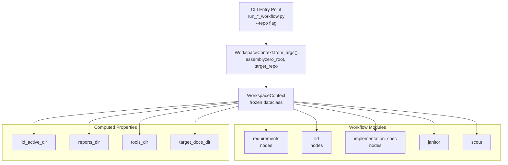

# 838 - Refactor: Implement WorkspaceContext to Eliminate Path Prop-Drilling

<!-- Template Metadata
Last Updated: 2026-03-19
Updated By: Issue #838
Update Reason: Fix mechanical validation — add (REQ-N) tags to Section 10.1 scenarios; add scenarios for REQ-7, REQ-8, REQ-9, REQ-10; fix Section 3 to numbered list format
Previous: Fix lld/nodes/__init__.py Change Type corrected from Modify to Add
-->

## 1. Context & Goal
* **Issue:** #838
* **Objective:** Create a unified `WorkspaceContext` dataclass to manage `assemblyzero_root` and `target_repo` Path objects, eliminating repetitive path parameter prop-drilling across AssemblyZero's workflow and utility functions.
* **Status:** Draft
* **Related Issues:** #655 (implement_code.py split), #656 (LLD parsing fix)

### Open Questions
*Questions that need clarification before or during implementation. Remove when resolved.*

- [ ] Are there callers outside `assemblyzero/` (e.g., `tools/` scripts) that pass `assemblyzero_root`/`target_repo` directly and must also be migrated?
- [ ] Should `WorkspaceContext` be frozen (immutable) to prevent accidental mutation during long-running graph runs?

## 2. Proposed Changes

*This section is the **source of truth** for implementation. Describe exactly what will be built.*

### 2.1 Files Changed

| File | Change Type | Description |
|------|-------------|-------------|
| `tests/fixtures/mock_workspace/` | Add (Directory) | Fixture directory for workspace-related tests |
| `tests/fixtures/mock_workspace/assemblyzero_root/` | Add (Directory) | Simulated `assemblyzero_root` fixture tree |
| `tests/fixtures/mock_workspace/target_repo/` | Add (Directory) | Simulated `target_repo` fixture tree |
| `assemblyzero/core/workspace_context.py` | Add | Defines `WorkspaceContext` dataclass with validation, factory methods, and helpers |
| `assemblyzero/core/__init__.py` | Modify | Export `WorkspaceContext` from the `core` package |
| `assemblyzero/core/validation/__init__.py` | Modify | Add `validate_workspace_context` helper |
| `assemblyzero/workflows/requirements/nodes/__init__.py` | Modify | Accept `WorkspaceContext` instead of discrete `Path` params |
| `assemblyzero/workflows/lld/nodes/__init__.py` | Add | Accept `WorkspaceContext` instead of discrete `Path` params (file does not yet exist) |
| `assemblyzero/workflows/implementation_spec/nodes/__init__.py` | Modify | Accept `WorkspaceContext` instead of discrete `Path` params |
| `assemblyzero/workflows/janitor/__init__.py` | Modify | Accept `WorkspaceContext` instead of discrete `Path` params |
| `assemblyzero/workflows/scout/__init__.py` | Modify | Accept `WorkspaceContext` instead of discrete `Path` params |
| `assemblyzero/workflows/death/__init__.py` | Modify | Accept `WorkspaceContext` instead of discrete `Path` params |
| `assemblyzero/nodes/__init__.py` | Modify | Thread `WorkspaceContext` through shared node utilities |
| `assemblyzero/utils/__init__.py` | Modify | Expose workspace-aware path resolution utilities |
| `tests/unit/test_workspace_context.py` | Add | Unit tests for `WorkspaceContext` construction, validation, and helpers |

### 2.1.1 Path Validation (Mechanical - Auto-Checked)

Mechanical validation automatically checks:
- All "Modify" files must exist in repository
- All "Delete" files must exist in repository
- All "Add" files must have existing parent directories
- No placeholder prefixes (`src/`, `lib/`, `app/`) unless directory exists

**Note on `assemblyzero/workflows/lld/nodes/__init__.py`:** The `assemblyzero/workflows/lld/nodes/` directory exists in the repository but the `__init__.py` file does not yet exist. Change Type is therefore `Add`, not `Modify`.

**If validation fails, the LLD is BLOCKED before reaching review.**

### 2.2 Dependencies

No new packages required. All path handling uses the standard library `pathlib.Path` already present in the codebase.

```toml

# No additions to pyproject.toml
```

### 2.3 Data Structures

```python

# assemblyzero/core/workspace_context.py — pseudocode

@dataclass(frozen=True)
class WorkspaceContext:
    assemblyzero_root: Path   # Absolute path to AssemblyZero repo root
    target_repo: Path         # Absolute path to the target repo being operated on

    # Derived helpers (computed properties, not stored fields)
    # .tools_dir        -> assemblyzero_root / "tools"
    # .docs_dir         -> assemblyzero_root / "docs"
    # .lld_active_dir   -> assemblyzero_root / "docs" / "lld" / "active"
    # .reports_dir      -> assemblyzero_root / "docs" / "reports"
    # .target_docs_dir  -> target_repo / "docs"
    # .target_src_dir   -> target_repo / "assemblyzero"  (or configurable subpath)

# Validation error raised when paths are invalid
class WorkspaceContextError(ValueError):
    ...
```

### 2.4 Function Signatures

```python

# assemblyzero/core/workspace_context.py

@dataclass(frozen=True)
class WorkspaceContext:
    assemblyzero_root: Path
    target_repo: Path

    def __post_init__(self) -> None:
        """Resolve and validate both paths on construction."""
        ...

    @classmethod
    def from_args(cls, assemblyzero_root: str | Path, target_repo: str | Path) -> "WorkspaceContext":
        """Primary factory: resolve strings to absolute Paths, then validate."""
        ...

    @classmethod
    def from_env(cls) -> "WorkspaceContext":
        """Secondary factory: read ASSEMBLYZERO_ROOT and TARGET_REPO env vars."""
        ...

    @property
    def tools_dir(self) -> Path:
        """Return assemblyzero_root / 'tools'."""
        ...

    @property
    def docs_dir(self) -> Path:
        """Return assemblyzero_root / 'docs'."""
        ...

    @property
    def lld_active_dir(self) -> Path:
        """Return assemblyzero_root / 'docs' / 'lld' / 'active'."""
        ...

    @property
    def reports_dir(self) -> Path:
        """Return assemblyzero_root / 'docs' / 'reports'."""
        ...

    @property
    def target_docs_dir(self) -> Path:
        """Return target_repo / 'docs'."""
        ...

    def resolve_target_file(self, relative: str | Path) -> Path:
        """Resolve a path relative to target_repo; raise ValueError if outside repo."""
        ...

    def resolve_az_file(self, relative: str | Path) -> Path:
        """Resolve a path relative to assemblyzero_root; raise ValueError if outside root."""
        ...

    def __repr__(self) -> str:
        """Human-readable representation for logging."""
        ...


# assemblyzero/core/validation/__init__.py

def validate_workspace_context(ctx: WorkspaceContext) -> list[str]:
    """
    Run structural checks on the workspace.
    Returns list of warning strings (empty = all good).
    Does NOT raise; callers decide severity.
    """
    ...


# assemblyzero/core/workspace_context.py — module-level helper

def workspace_context_from_cli_args(
    assemblyzero_root: str | Path,
    target_repo: str | Path,
) -> WorkspaceContext:
    """Thin wrapper over WorkspaceContext.from_args for CLI entry points."""
    ...
```

### 2.5 Logic Flow (Pseudocode)

```
CONSTRUCTION (WorkspaceContext.from_args):
1. Receive assemblyzero_root (str|Path), target_repo (str|Path)
2. Resolve each to absolute Path via Path.resolve()
3. Validate:
   a. assemblyzero_root.is_dir()  -> WorkspaceContextError if False
   b. target_repo.is_dir()        -> WorkspaceContextError if False
   c. assemblyzero_root != target_repo -> WorkspaceContextError if same (likely misconfiguration)
4. Store as frozen fields
5. Return WorkspaceContext instance

USAGE IN WORKFLOW NODE (example — requirements node):
OLD:
  def run_requirements_node(assemblyzero_root: Path, target_repo: Path, state: dict) -> dict:
      lld_path = assemblyzero_root / "docs" / "lld" / "active" / ...
      ...

NEW:
  def run_requirements_node(ctx: WorkspaceContext, state: dict) -> dict:
      lld_path = ctx.lld_active_dir / ...
      ...

MIGRATION STRATEGY (per-file, not big-bang):
1. Add WorkspaceContext parameter to function signature
2. Replace all  `assemblyzero_root / X`  ->  `ctx.assemblyzero_root / X` or dedicated property
3. Replace all  `target_repo / X`  ->  `ctx.target_repo / X` or dedicated property
4. Remove orphaned `assemblyzero_root` and `target_repo` parameters
5. Update callers one level up
6. Repeat until graph entry points (run_*_workflow.py) are reached
7. Entry points call WorkspaceContext.from_args() with CLI --repo flag
```

### 2.6 Technical Approach

* **Module:** `assemblyzero/core/workspace_context.py`
* **Pattern:** Value Object / Immutable Context Object (frozen dataclass)
* **Key Decisions:**
  - `frozen=True` prevents accidental mutation across graph nodes; paths are resolved once at entry-point boundary.
  - Properties (not stored fields) for derived directories keep the dataclass serialization footprint minimal and avoid stale data.
  - `from_args` / `from_env` factory pattern matches existing credential provider conventions in the codebase.
  - Migration is incremental: each workflow module is updated independently, enabling a green CI at every step.

### 2.7 Architecture Decisions

| Decision | Options Considered | Choice | Rationale |
|----------|-------------------|--------|-----------|
| Mutability | Mutable dataclass, frozen dataclass, NamedTuple | `frozen=True` dataclass | Graph nodes run concurrently; immutable context prevents races. Dataclass gives `__repr__`, type hints, and `__post_init__` validation. NamedTuple lacks `__post_init__`. |
| Derived path strategy | Stored fields, computed properties, helper functions | Computed `@property` | Avoids stale data if root changes during tests; no serialization bloat; auto-documented via docstrings |
| Validation timing | Lazy (on first access), eager (construction), separate validator | Eager in `__post_init__` + optional `validate_workspace_context()` | Fail-fast at entry point rather than deep in a graph run. Separate validator for non-fatal structural checks (missing `docs/lld/active/`) |
| Migration scope | Big-bang (all files at once), incremental per workflow | Incremental per workflow | Keeps CI green at every commit; allows review of each workflow in isolation |
| Entry-point wiring | Each entry point builds context, context injected into graph state | Context built at CLI entry point, passed as constructor arg to workflow | Keeps graph state serializable (don't store `Path` in LangGraph state); context lives outside state |

**Architectural Constraints:**
- `WorkspaceContext` must NOT be stored in LangGraph graph state (state must be JSON-serializable for SQLite checkpointing).
- Must not introduce new external dependencies.
- All existing function signatures must remain callable with keyword-argument compatibility during migration (no breaking changes to callers outside `assemblyzero/`).

## 3. Requirements

1. `WorkspaceContext` is a frozen dataclass in `assemblyzero/core/workspace_context.py` with `assemblyzero_root` and `target_repo` as `Path` fields resolved to absolute paths on construction.
2. Construction raises `WorkspaceContextError` (subclass of `ValueError`) if either path does not exist as a directory, or if both paths resolve to the same location.
3. `WorkspaceContext.from_args(assemblyzero_root, target_repo)` accepts both `str` and `Path` inputs and returns a validated instance.
4. `WorkspaceContext.from_env()` reads `ASSEMBLYZERO_ROOT` and `TARGET_REPO` environment variables and returns a validated instance, raising `WorkspaceContextError` if either variable is unset.
5. Computed properties `tools_dir`, `docs_dir`, `lld_active_dir`, `reports_dir`, and `target_docs_dir` return correct sub-paths without storing them as fields.
6. `resolve_target_file(relative)` and `resolve_az_file(relative)` return absolute paths and raise `ValueError` if the resolved path escapes the respective root (path traversal guard).
7. All workflow node modules in `assemblyzero/workflows/` accept `WorkspaceContext` in place of discrete `assemblyzero_root: Path` and `target_repo: Path` parameters.
8. `assemblyzero/core/__init__.py` exports `WorkspaceContext` and `WorkspaceContextError` at the package level.
9. Test coverage is at or above 95% for `assemblyzero/core/workspace_context.py`.
10. No regression in existing CI tests — all tests pass after migration.

## 4. Alternatives Considered

| Option | Pros | Cons | Decision |
|--------|------|------|----------|
| Frozen dataclass (current proposal) | Immutable, type-safe, `__post_init__` validation, `__repr__` for free, hashable | Slightly more boilerplate than namedtuple | **Selected** |
| `typing.NamedTuple` | Immutable, tuple semantics, lightweight | No `__post_init__`, validation must be external, less idiomatic for domain objects | Rejected |
| Mutable dataclass | Easy test patching | Mutation risk in concurrent graph nodes; no hashability | Rejected |
| Thread-local / global singleton | No parameter passing at all | Non-deterministic in tests, hidden coupling, breaks parallel agents | Rejected |
| Add paths to LangGraph state dict | Context always available to nodes | State must be JSON-serializable; `Path` is not; breaks SQLite checkpointing | Rejected |

**Rationale:** A frozen dataclass provides the strongest immutability guarantee with the least ceremony and integrates cleanly with Python's type system and existing codebase conventions.

## 5. Data & Fixtures

### 5.1 Data Sources

| Attribute | Value |
|-----------|-------|
| Source | Local filesystem (developer workstation / CI runner) |
| Format | Directory paths |
| Size | N/A (path metadata only) |
| Refresh | N/A |
| Copyright/License | N/A |

### 5.2 Data Pipeline

```
CLI args (--repo flag)
  ──str──►  WorkspaceContext.from_args()
              ──Path.resolve()──►  validated WorkspaceContext
                                     ──passed as arg──►  workflow nodes
                                                            ──properties──►  concrete Paths
```

### 5.3 Test Fixtures

| Fixture | Source | Notes |
|---------|--------|-------|
| `tests/fixtures/mock_workspace/assemblyzero_root/` | Generated (empty dirs) | Mimics expected subdirectory structure (`docs/lld/active/`, `tools/`) |
| `tests/fixtures/mock_workspace/target_repo/` | Generated (empty dirs) | Mimics target repo layout (`docs/`, `assemblyzero/`) |
| `tmp_path` (pytest built-in) | pytest | Used for ephemeral path tests (nonexistent paths, traversal attempts) |

### 5.4 Deployment Pipeline

N/A — this is a pure refactor of in-process Python code; no data migration or external data pipeline is involved.

## 6. Diagram

### 6.1 Mermaid Quality Gate

Before finalizing any diagram, verify in [Mermaid Live Editor](https://mermaid.live) or GitHub preview:

- [x] **Simplicity:** Similar components collapsed
- [x] **No touching:** All elements have visual separation
- [x] **No hidden lines:** All arrows fully visible
- [x] **Readable:** Labels not truncated, flow direction clear
- [ ] **Auto-inspected:** Agent rendered via mermaid.ink and viewed

**Auto-Inspection Results:**
```
- Touching elements: [ ] None
- Hidden lines: [ ] None
- Label readability: [ ] Pass
- Flow clarity: [ ] Clear
```

### 6.2 Diagram



## 7. Security & Safety Considerations

### 7.1 Security

| Concern | Mitigation | Status |
|---------|------------|--------|
| Path traversal via `resolve_target_file` | Verify resolved path starts with `target_repo` using `Path.is_relative_to()`; raise `ValueError` if not | Addressed |
| Path traversal via `resolve_az_file` | Same check against `assemblyzero_root` | Addressed |
| Symlink escape | `Path.resolve()` follows symlinks; resolved path checked against root | Addressed |
| Env var injection in `from_env` | Values are passed through `Path()` constructor only; no shell expansion | Addressed |

### 7.2 Safety

| Concern | Mitigation | Status |
|---------|------------|--------|
| Frozen context mutated via `object.__setattr__` bypass | `frozen=True` raises `FrozenInstanceError`; documented in docstring; no internal bypass | Addressed |
| Migration leaves callers broken | Incremental per-workflow migration; backward-compatible keyword args during transition | Addressed |
| `from_env` called in environment without vars set | Raises `WorkspaceContextError` with clear message listing missing variable names | Addressed |
| Nonexistent paths silently accepted | `__post_init__` validates `is_dir()` eagerly; fails at construction not deep in graph | Addressed |

**Fail Mode:** Fail Closed — `WorkspaceContext` raises on invalid input rather than returning a partial/None object.

**Recovery Strategy:** All errors are raised at the CLI entry point before any graph node executes; no partial graph state to clean up.

## 8. Performance & Cost Considerations

### 8.1 Performance

| Metric | Budget | Approach |
|--------|--------|----------|
| Construction latency | < 1 ms | Single `Path.resolve()` call per field; no I/O beyond `is_dir()` stat |
| Property access latency | < 0.1 ms | Pure `Path.__truediv__` arithmetic; no I/O |
| Memory per context | < 1 KB | Two `Path` objects + frozen dataclass overhead |

**Bottlenecks:** None anticipated — path arithmetic is negligible compared to LLM I/O in surrounding code.

### 8.2 Cost Analysis

| Resource | Unit Cost | Estimated Usage | Monthly Cost |
|----------|-----------|-----------------|--------------|
| LLM API calls | N/A | 0 (pure Python refactor) | $0 |
| Cloud compute | N/A | No change from current | No change |
| Storage | N/A | No change | No change |

**Cost Controls:**
- N/A — no new API usage introduced.

**Worst-Case Scenario:** N/A — no cost surface introduced by this change.

## 9. Legal & Compliance

| Concern | Applies? | Mitigation |
|---------|----------|------------|
| PII/Personal Data | No | No user data handled |
| Third-Party Licenses | No | No new dependencies |
| Terms of Service | No | No external APIs called |
| Data Retention | No | No data stored |
| Export Controls | No | Standard library path manipulation |

**Data Classification:** Internal

**Compliance Checklist:**
- [x] No PII stored without consent
- [x] All third-party licenses compatible with project license
- [x] External API usage compliant with provider ToS
- [x] Data retention policy documented

## 10. Verification & Testing

### 10.0 Test Plan (TDD - Complete Before Implementation)

**TDD Requirement:** Tests MUST be written and failing BEFORE implementation begins.

| Test ID | Test Description | Expected Behavior | Status |
|---------|------------------|-------------------|--------|
| T010 | `from_args` with valid existing dirs (REQ-1) | Returns `WorkspaceContext` with resolved absolute paths | RED |
| T020 | `from_args` with nonexistent `assemblyzero_root` (REQ-2) | Raises `WorkspaceContextError` | RED |
| T030 | `from_args` with nonexistent `target_repo` (REQ-2) | Raises `WorkspaceContextError` | RED |
| T040 | `from_args` with same path for both roots (REQ-2) | Raises `WorkspaceContextError` | RED |
| T050 | `from_args` with string inputs (REQ-3) | Coerces to `Path`, returns valid context | RED |
| T060 | Frozen context mutation attempt (REQ-1) | Raises `FrozenInstanceError` | RED |
| T070 | `tools_dir` property (REQ-5) | Returns `assemblyzero_root / "tools"` | RED |
| T080 | `lld_active_dir` property (REQ-5) | Returns `assemblyzero_root / "docs" / "lld" / "active"` | RED |
| T090 | `reports_dir` property (REQ-5) | Returns `assemblyzero_root / "docs" / "reports"` | RED |
| T100 | `target_docs_dir` property (REQ-5) | Returns `target_repo / "docs"` | RED |
| T110 | `resolve_target_file` with valid relative path (REQ-6) | Returns absolute path within `target_repo` | RED |
| T120 | `resolve_target_file` with traversal attempt `../../etc/passwd` (REQ-6) | Raises `ValueError` | RED |
| T130 | `resolve_az_file` with valid relative path (REQ-6) | Returns absolute path within `assemblyzero_root` | RED |
| T140 | `resolve_az_file` with traversal attempt (REQ-6) | Raises `ValueError` | RED |
| T150 | `from_env` with both env vars set (REQ-4) | Returns valid `WorkspaceContext` | RED |
| T160 | `from_env` with missing env var (REQ-4) | Raises `WorkspaceContextError` naming missing var | RED |
| T170 | `validate_workspace_context` on healthy workspace | Returns empty list | RED |
| T180 | `validate_workspace_context` on workspace missing `docs/lld/active/` | Returns non-empty warning list | RED |
| T190 | `WorkspaceContextError` is subclass of `ValueError` (REQ-2) | `isinstance(err, ValueError)` is True | RED |
| T200 | `from_args` with relative path inputs (REQ-1) | Resolves to absolute before storing | RED |
| T210 | `WorkspaceContext` and `WorkspaceContextError` importable from `assemblyzero.core` (REQ-8) | Both names importable without `ImportError` | RED |
| T220 | Workflow node accepts `WorkspaceContext` instead of discrete Path params (REQ-7) | Node function callable with `ctx: WorkspaceContext` signature; raises `TypeError` with old discrete params | RED |
| T230 | Full pytest suite passes after migration (REQ-10) | Zero test failures in `pytest -m "not integration and not e2e and not adversarial"` | RED |
| T240 | Coverage threshold gate for `workspace_context.py` (REQ-9) | `pytest --cov=assemblyzero/core/workspace_context --cov-fail-under=95` exits 0 | RED |

**Coverage Target:** ≥ 95% for `assemblyzero/core/workspace_context.py`

**TDD Checklist:**
- [ ] All tests written before implementation
- [ ] Tests currently RED (failing)
- [ ] Test IDs match scenario IDs in 10.1
- [ ] Test file created at: `tests/unit/test_workspace_context.py`

### 10.1 Test Scenarios

| ID | Scenario | Type | Input | Expected Output | Pass Criteria |
|----|----------|------|-------|-----------------|---------------|
| 010 | Happy path construction (REQ-1) | Auto | Two existing tmp dirs | `WorkspaceContext` with absolute paths | `isinstance(ctx, WorkspaceContext)` and paths are absolute |
| 020 | Missing `assemblyzero_root` (REQ-2) | Auto | Nonexistent dir, valid dir | `WorkspaceContextError` | Exception raised with descriptive message |
| 030 | Missing `target_repo` (REQ-2) | Auto | Valid dir, nonexistent dir | `WorkspaceContextError` | Exception raised with descriptive message |
| 040 | Same root paths (REQ-2) | Auto | Same tmp dir for both | `WorkspaceContextError` | Exception raised |
| 050 | String input coercion (REQ-3) | Auto | `"/tmp/az"`, `"/tmp/repo"` (existing) | Valid context | Paths equal `Path("/tmp/az").resolve()` |
| 060 | Frozen mutation (REQ-1) | Auto | `ctx.assemblyzero_root = Path("/other")` | `FrozenInstanceError` | Exception type matches |
| 070 | `tools_dir` (REQ-5) | Auto | Valid context | `assemblyzero_root / "tools"` | Path equality |
| 080 | `lld_active_dir` (REQ-5) | Auto | Valid context | `assemblyzero_root / "docs" / "lld" / "active"` | Path equality |
| 090 | `reports_dir` (REQ-5) | Auto | Valid context | `assemblyzero_root / "docs" / "reports"` | Path equality |
| 100 | `target_docs_dir` (REQ-5) | Auto | Valid context | `target_repo / "docs"` | Path equality |
| 110 | `resolve_target_file` safe path (REQ-6) | Auto | `"assemblyzero/__init__.py"` | Absolute path inside `target_repo` | `path.is_relative_to(ctx.target_repo)` |
| 120 | `resolve_target_file` traversal (REQ-6) | Auto | `"../../etc/passwd"` | `ValueError` | Exception raised |
| 130 | `resolve_az_file` safe path (REQ-6) | Auto | `"tools/run_requirements_workflow.py"` | Absolute path inside `assemblyzero_root` | `path.is_relative_to(ctx.assemblyzero_root)` |
| 140 | `resolve_az_file` traversal (REQ-6) | Auto | `"../outside/secret"` | `ValueError` | Exception raised |
| 150 | `from_env` valid env (REQ-4) | Auto | `ASSEMBLYZERO_ROOT=<dir>`, `TARGET_REPO=<dir>` | Valid context | No exception |
| 160 | `from_env` missing var (REQ-4) | Auto | `TARGET_REPO` unset | `WorkspaceContextError` | Message contains `"TARGET_REPO"` |
| 170 | `validate_workspace_context` healthy | Auto | Context with `docs/lld/active/` present | `[]` | Empty list returned |
| 180 | `validate_workspace_context` missing dirs | Auto | Context without expected subdirs | Non-empty `list[str]` | At least one warning string returned |
| 190 | Error hierarchy (REQ-2) | Auto | `raise WorkspaceContextError(...)` | Caught by `except ValueError` | `isinstance` check passes |
| 200 | Relative path resolution (REQ-1) | Auto | `from_args(".", "../target")` from tmp | Absolute paths stored | `ctx.assemblyzero_root.is_absolute()` |
| 210 | Package-level exports (REQ-8) | Auto | `from assemblyzero.core import WorkspaceContext, WorkspaceContextError` | Both names resolve without `ImportError` | `WorkspaceContext` is the dataclass; `WorkspaceContextError` is the exception class |
| 220 | Workflow node signature accepts `WorkspaceContext` (REQ-7) | Auto | Call migrated node with `ctx=WorkspaceContext(...)` | Node executes without `TypeError` | Return value is dict; calling with old `assemblyzero_root=` kwarg raises `TypeError` |
| 230 | No regression in full test suite (REQ-10) | Auto | Run `pytest -m "not integration and not e2e and not adversarial"` after migration | Zero failures | Exit code 0; no previously-passing tests newly fail |
| 240 | Coverage threshold enforced (REQ-9) | Auto | Run `pytest --cov=assemblyzero/core/workspace_context --cov-fail-under=95` | Coverage ≥ 95% | pytest exits 0; coverage report shows ≥ 95% for `workspace_context.py` |

### 10.2 Test Commands

```bash

# Run all workspace context tests
poetry run pytest tests/unit/test_workspace_context.py -v

# Run with coverage report
poetry run pytest tests/unit/test_workspace_context.py -v --cov=assemblyzero/core/workspace_context --cov-report=term-missing

# Enforce coverage threshold gate (REQ-9)
poetry run pytest tests/unit/test_workspace_context.py --cov=assemblyzero/core/workspace_context --cov-fail-under=95

# Run full unit suite to check for regressions (REQ-10)
poetry run pytest tests/unit/ -v -m "not integration and not e2e and not adversarial"

# Run all non-integration tests (CI gate)
poetry run pytest -m "not integration and not e2e and not adversarial"
```

### 10.3 Manual Tests (Only If Unavoidable)

N/A - All scenarios automated.

## 11. Risks & Mitigations

| Risk | Impact | Likelihood | Mitigation |
|------|--------|------------|------------|
| Incremental migration leaves mixed calling conventions temporarily | Med | High | Each PR migrates one workflow module completely; no partial migrations merged |
| LangGraph state serialization broken if context accidentally stored in state | High | Low | Documented explicitly in `WorkspaceContext` docstring and ADR; code review checklist item |
| `from_env` used in CI where env vars are not set | Med | Med | `validate_workspace_context()` runs in test fixtures; CI sets vars explicitly |
| Symlink edge cases on Windows vs. POSIX | Low | Low | `Path.resolve()` handles both; tested with `tmp_path` which is real paths on all platforms |
| Over-eager validation blocks legitimate relative paths | Low | Med | Validation only checks `is_dir()` for roots; relative sub-paths allowed in `resolve_*` helpers |

## 12. Definition of Done

### Code
- [ ] `assemblyzero/core/workspace_context.py` implemented with frozen dataclass, factory methods, computed properties, path traversal guards
- [ ] `WorkspaceContextError` defined and exported from `assemblyzero/core/__init__.py`
- [ ] All workflow modules in `assemblyzero/workflows/` migrated to accept `WorkspaceContext`
- [ ] `assemblyzero/nodes/__init__.py` and `assemblyzero/utils/__init__.py` updated
- [ ] Code comments reference this LLD (`# ref #838`)

### Tests
- [ ] `tests/unit/test_workspace_context.py` written (TDD: tests written first, then implementation)
- [ ] All 24 test scenarios (T010–T240) pass
- [ ] Coverage ≥ 95% for `assemblyzero/core/workspace_context.py`
- [ ] No regressions in full `pytest` run

### Documentation
- [ ] LLD updated with any implementation deviations
- [ ] Implementation Report completed
- [ ] Test Report completed

### Review
- [ ] Gemini LLD review: APPROVED
- [ ] Code review completed
- [ ] User approval before closing issue #838

### 12.1 Traceability (Mechanical - Auto-Checked)

Mechanical validation automatically checks:
- Every file mentioned in this section must appear in Section 2.1
- Every risk mitigation in Section 11 should have a corresponding function in Section 2.4

Files referenced in Definition of Done that appear in Section 2.1:
- `assemblyzero/core/workspace_context.py`
- `assemblyzero/core/__init__.py`
- `assemblyzero/workflows/requirements/nodes/__init__.py`
- `assemblyzero/workflows/lld/nodes/__init__.py`  (Change Type: Add)
- `assemblyzero/workflows/implementation_spec/nodes/__init__.py`
- `assemblyzero/nodes/__init__.py`
- `assemblyzero/utils/__init__.py`
- `tests/unit/test_workspace_context.py`

---

## Appendix: Review Log

### Gemini Review #1 (PENDING)

**Reviewer:** Gemini
**Verdict:** PENDING

#### Comments

| ID | Comment | Implemented? |
|----|---------|--------------|
| G1.1 | (awaiting review) | PENDING |

### Review Summary

| Review | Date | Verdict | Key Issue |
|--------|------|---------|-----------|
| Gemini #1 | (auto) | PENDING | — |

**Final Status:** PENDING

## Original GitHub Issue #838
[See GitHub Issue #838 — unchanged from iteration 1. Issue #838: [High] refactor: implement WorkspaceContext to eliminate path prop-drilling]

## Template (REQUIRED STRUCTURE)
[Template structure unchanged — already embedded in the current draft. Preserve all section headings.]