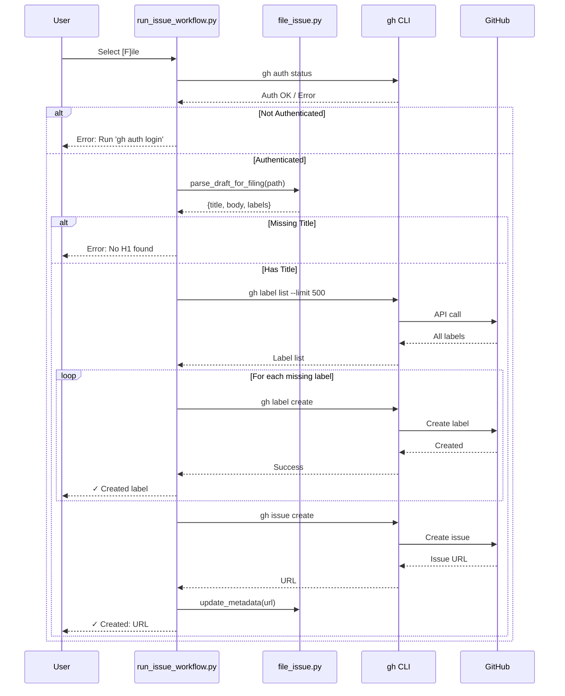

# 184 - Feature: Add [F]ile Option to Issue Workflow Exit

<!-- Template Metadata
Last Updated: 2025-01-XX
Updated By: LLD Generation
Update Reason: Revision addressing Gemini Review #1 feedback
-->

## 1. Context & Goal
* **Issue:** #84
* **Objective:** Add a `[F]ile` option to the issue workflow exit menu that automatically creates missing labels and files the issue to GitHub using the `gh` CLI.
* **Status:** Draft
* **Related Issues:** None

### Open Questions
*Questions that need clarification before or during implementation. Remove when resolved.*

- [x] Should the draft file be moved/renamed after successful filing? → **Out of scope per issue spec**
- [x] Should we support issue templates from `.github/ISSUE_TEMPLATE/`? → **Out of scope per issue spec**

## 2. Proposed Changes

*This section is the **source of truth** for implementation. Describe exactly what will be built.*

### 2.1 Files Changed

| File | Change Type | Description |
|------|-------------|-------------|
| `agentos/workflows/issue/run_issue_workflow.py` | Modify | Add `[F]ile` option to exit menu, integrate filing logic |
| `agentos/workflows/issue/file_issue.py` | Add | New module with `parse_draft_for_filing()`, `ensure_labels_exist()`, `file_issue()`, `verify_gh_auth()` |
| `agentos/workflows/issue/label_colors.py` | Add | New module with label category → color mapping |
| `tests/test_file_issue.py` | Add | Unit tests for draft parsing and label color mapping |
| `tests/test_label_colors.py` | Add | Unit tests for label color mapping logic |
| `tests/test_run_issue_workflow.py` | Add | Unit tests for menu option presence |
| `docs/0003-file-inventory.md` | Modify | Add new files to inventory |

### 2.2 Dependencies

*New packages, APIs, or services required.*

```toml
# pyproject.toml additions (if any)
# None - uses only stdlib and existing dependencies
```

**External Dependencies:**
- `gh` CLI must be installed and authenticated
- GitHub repository access via `gh` credentials

### 2.3 Data Structures

```python
# Pseudocode - NOT implementation
class ParsedDraft(TypedDict):
    title: str          # Extracted from first H1 line
    body: str           # Content from ## User Story through before ## Labels
    labels: list[str]   # Parsed from backtick-delimited list
    parse_errors: list[str]  # Any warnings during parsing

class FilingResult(TypedDict):
    success: bool       # Whether filing succeeded
    issue_url: str | None  # URL of created issue if successful
    error: str | None   # Error message if failed
    labels_created: list[str]  # Labels that were newly created

class LabelInfo(TypedDict):
    name: str           # Label name
    exists: bool        # Whether label already exists in repo
    color: str          # Hex color (without #)
```

### 2.4 Function Signatures

```python
# file_issue.py

def verify_gh_auth() -> tuple[bool, str]:
    """
    Verify gh CLI is authenticated.
    
    Returns:
        Tuple of (is_authenticated, error_message)
    """
    ...

def parse_draft_for_filing(draft_path: Path, worktree_root: Path) -> ParsedDraft:
    """
    Parse a draft markdown file for filing to GitHub.
    
    Extracts title from first H1, body from content sections,
    and labels from ## Labels line.
    
    Args:
        draft_path: Path to the draft markdown file
        worktree_root: Root of the project worktree for path validation
        
    Returns:
        ParsedDraft with extracted components
        
    Raises:
        ValueError: If draft is missing required title
        ValueError: If draft_path is outside worktree_root
    """
    ...

def ensure_labels_exist(
    labels: list[str], 
    repo: str | None = None
) -> tuple[list[str], list[str]]:
    """
    Ensure all labels exist in the repository, creating missing ones.
    
    Args:
        labels: List of label names to ensure exist
        repo: Optional repo in owner/name format (uses current if None)
        
    Returns:
        Tuple of (created_labels, existing_labels)
    """
    ...

def file_issue(
    title: str,
    body: str,
    labels: list[str],
    repo: str | None = None
) -> FilingResult:
    """
    File an issue to GitHub using gh CLI.
    
    Args:
        title: Issue title
        body: Issue body markdown
        labels: List of label names to attach
        repo: Optional repo in owner/name format
        
    Returns:
        FilingResult with success status and issue URL
    """
    ...

def update_metadata_with_issue(
    metadata_path: Path,
    issue_url: str
) -> None:
    """
    Update 003-metadata.json with the filed issue URL.
    
    Args:
        metadata_path: Path to metadata JSON file
        issue_url: URL of the created GitHub issue
    """
    ...
```

```python
# label_colors.py

def get_label_color(label_name: str) -> str:
    """
    Get the appropriate hex color for a label based on category.
    
    Args:
        label_name: The label name to categorize
        
    Returns:
        Hex color string without # prefix (e.g., "2ea44f")
    """
    ...
```

```python
# run_issue_workflow.py

def get_exit_menu_options() -> list[str]:
    """
    Return the list of exit menu options including [F]ile.
    
    Returns:
        List of option strings like ['[F]ile', '[M]anual', '[Q]uit']
    """
    ...
```

### 2.5 Logic Flow (Pseudocode)

```
FILE OPTION FLOW:
1. User selects [F]ile from exit menu
2. Verify gh CLI authentication
   IF not authenticated THEN
   - Display error: "gh CLI not authenticated. Run 'gh auth login' first."
   - Return to menu (user can choose other options)
3. Validate draft_path is within project worktree
   IF outside worktree THEN
   - Display error: "Draft path outside project directory"
   - Return to menu
4. Parse draft file for title, body, labels
   IF title missing (no H1) THEN
   - Display error: "Draft missing title (no H1 found)"
   - Return to menu
   IF labels line malformed THEN
   - Display warning: "Could not parse labels, filing without labels"
   - Continue with empty labels list
5. Fetch all labels from repo with pagination (limit 500)
6. For each label in parsed labels:
   - Check if label exists in fetched list
   IF label doesn't exist THEN
   - Determine color from category mapping
   - Create label with gh label create
   - Display: "✓ Created label: {name}"
7. File issue using gh issue create
   - Pass title, body, and labels as separate arguments
   - Capture issue URL from output
8. Update 003-metadata.json
   - Add github_issue_url field
   - Add filed_at timestamp
9. Display: "✓ Created: {issue_url}"
10. Exit workflow

DRAFT PARSING FLOW:
1. Validate draft_path is within worktree_root
   IF not THEN raise ValueError("Path outside project")
2. Read draft file content
3. Find first line starting with "# " → title
   IF not found THEN raise ValueError
4. Find "## User Story" marker
5. Find "## Labels" marker
6. Body = content between User Story and Labels (or end if no Labels)
7. Parse labels from backticks: `label1` `label2`
   IF line exists but unparseable THEN
   - Add warning to parse_errors
   - Set labels to empty list
8. Return ParsedDraft

LABEL COLOR MAPPING:
1. Normalize label name (lowercase, strip)
2. Check against category keywords:
   - enhancement, feature → green (#2ea44f)
   - bug, fix, breaking → red (#d73a4a)
   - tooling, maintenance, refactor → purple (#6f42c1)
   - audit, governance, compliance → yellow (#fbca04)
   - documentation, docs → blue (#0075ca)
   - default → gray (#ededed)
3. Return hex color without # prefix
```

### 2.6 Technical Approach

* **Module:** `agentos/workflows/issue/`
* **Pattern:** Functional decomposition with clear separation of concerns
* **Key Decisions:**
  - Use `subprocess.run()` with list arguments exclusively to prevent shell injection
  - Parse gh CLI output for issue URL rather than constructing it
  - Fail fast on auth issues, gracefully on label parsing issues
  - Keep label colors in separate module for reusability
  - Use project's standard logger for debug output

### 2.7 Architecture Decisions

| Decision | Options Considered | Choice | Rationale |
|----------|-------------------|--------|-----------|
| Subprocess invocation | `shell=True` with string, `subprocess.run()` with list | List arguments | Prevents shell injection from draft content |
| Label existence check | Query each label individually, Fetch all labels once | Fetch all once with `--limit 500` | Single API call with high limit handles pagination edge case |
| Error handling strategy | Fail on any error, Graceful degradation | Graceful for labels, strict for auth/title | Balance UX with data integrity |
| Color mapping location | Inline in file_issue.py, Separate module | Separate module | Enables reuse, easier testing |
| Path validation | Trust caller, Validate in parser | Validate in parser | Defense in depth - ensures draft_path is within worktree |
| Logging | Print statements, Standard logger | Standard logger | Better debugging, consistent with project patterns |

**Architectural Constraints:**
- Must use existing `gh` CLI - no direct GitHub API calls
- Must not modify draft files during filing process
- Must preserve all existing metadata when updating JSON
- Must validate draft_path is within project worktree

## 3. Requirements

*What must be true when this is done. These become acceptance criteria.*

1. `[F]ile` option appears in workflow exit menu alongside existing options
2. Draft parsing extracts title from first H1, body from content, labels from backtick list
3. Missing labels are created with category-appropriate colors before filing
4. Issue is filed via `gh issue create` with extracted content
5. `003-metadata.json` is updated with issue URL and filing timestamp
6. Unauthenticated `gh` CLI produces clear error without crashing workflow
7. Missing title produces clear error and keeps user in workflow
8. Malformed labels line produces warning and files issue without labels
9. All subprocess calls use list arguments (not `shell=True`)
10. Shell special characters in draft content are handled safely

## 4. Alternatives Considered

| Option | Pros | Cons | Decision |
|--------|------|------|----------|
| Use `gh` CLI via subprocess | Leverages existing auth, well-tested | Requires parsing CLI output | **Selected** |
| Use PyGithub library | Native Python, typed responses | New dependency, separate auth setup | Rejected |
| Use GitHub REST API directly | Full control, no CLI dependency | Auth management, more code | Rejected |
| Interactive label color selection | User control over colors | Adds complexity, slows workflow | Rejected |

**Rationale:** The `gh` CLI approach reuses existing authentication and is consistent with how users interact with GitHub manually. It minimizes dependencies and leverages a well-maintained tool.

## 5. Data & Fixtures

### 5.1 Data Sources

| Attribute | Value |
|-----------|-------|
| Source | Local draft markdown file in `active/` directory |
| Format | Markdown with specific section headers |
| Size | Typically 1-5 KB per draft |
| Refresh | Manual - user creates and edits drafts |
| Copyright/License | User-generated content, N/A |

### 5.2 Data Pipeline

```
Draft.md ──parse──► ParsedDraft ──gh CLI──► GitHub Issue
                                    │
                                    ▼
                          003-metadata.json updated
```

### 5.3 Test Fixtures

| Fixture | Source | Notes |
|---------|--------|-------|
| `valid_draft.md` | Generated | Complete draft with all sections |
| `draft_no_title.md` | Generated | Missing H1 for error testing |
| `draft_malformed_labels.md` | Generated | Labels line without backticks |
| `draft_shell_chars.md` | Generated | Title with `; rm -rf /` for injection testing |
| `mock_gh_responses.json` | Generated | Mocked gh CLI outputs |

### 5.4 Deployment Pipeline

N/A - This is a local CLI tool enhancement. No deployment pipeline required beyond standard release process.

## 6. Diagram

### 6.1 Mermaid Quality Gate

Before finalizing any diagram, verify in [Mermaid Live Editor](https://mermaid.live) or GitHub preview:

- [x] **Simplicity:** Similar components collapsed (per 0006 §8.1)
- [x] **No touching:** All elements have visual separation (per 0006 §8.2)
- [x] **No hidden lines:** All arrows fully visible (per 0006 §8.3)
- [x] **Readable:** Labels not truncated, flow direction clear
- [ ] **Auto-inspected:** Agent rendered via mermaid.ink and viewed (per 0006 §8.5)

**Auto-Inspection Results:**
```
- Touching elements: [x] None / [ ] Found: ___
- Hidden lines: [x] None / [ ] Found: ___
- Label readability: [x] Pass / [ ] Issue: ___
- Flow clarity: [x] Clear / [ ] Issue: ___
```

### 6.2 Diagram



## 7. Security & Safety Considerations

### 7.1 Security

| Concern | Mitigation | Status |
|---------|------------|--------|
| Shell injection from draft content | All subprocess calls use `subprocess.run()` with list arguments, never `shell=True` or string interpolation | Addressed |
| Credential exposure | Uses existing `gh` auth, no new credentials stored | Addressed |
| Repository scope | Only creates labels and issues, cannot delete or modify existing resources | Addressed |
| Path traversal | `parse_draft_for_filing()` validates draft_path is within worktree_root | Addressed |

### 7.2 Safety

| Concern | Mitigation | Status |
|---------|------------|--------|
| Accidental duplicate issues | No prevention - user responsibility (future enhancement) | Acknowledged |
| Label pollution | Only creates labels specified in draft, does not delete | Addressed |
| Metadata corruption | Read existing JSON, merge new fields, write atomically | Addressed |
| Network failure mid-operation | Labels may be created but issue not filed - user can retry | Acknowledged |
| Arbitrary file reading | Path validation ensures draft_path is strictly within project worktree | Addressed |

**Fail Mode:** Fail Closed - On any critical error (auth, parsing, network), operation stops and user is returned to menu with error message. No partial state is committed.

**Recovery Strategy:** User can retry [F]ile option. Already-created labels will be detected as existing on retry. Metadata is only updated after successful issue creation.

## 8. Performance & Cost Considerations

### 8.1 Performance

| Metric | Budget | Approach |
|--------|--------|----------|
| Latency | < 5s typical | Sequential gh CLI calls, no parallelization needed |
| Memory | < 50MB | Stream draft parsing, no large buffers |
| API Calls | 1 auth + 1 list + N creates + 1 issue | Minimize by fetching all labels in one call with `--limit 500` |

**Bottlenecks:** Network latency for gh CLI calls. Acceptable for interactive CLI use.

### 8.2 Cost Analysis

| Resource | Unit Cost | Estimated Usage | Monthly Cost |
|----------|-----------|-----------------|--------------|
| GitHub API (via gh) | Free tier | < 100 issues/month typical | $0 |

**Cost Controls:**
- N/A - GitHub API free tier is sufficient for typical usage

**Worst-Case Scenario:** Heavy usage would hit GitHub API rate limits (5000/hour authenticated). User would see gh CLI rate limit errors. No financial impact.

## 9. Legal & Compliance

| Concern | Applies? | Mitigation |
|---------|----------|------------|
| PII/Personal Data | No | Draft content is user-generated, transmitted only to user's own GitHub repo |
| Third-Party Licenses | No | Uses gh CLI (MIT license), no new dependencies |
| Terms of Service | Yes | gh CLI usage compliant with GitHub ToS |
| Data Retention | No | No data retained beyond user's local files and GitHub |
| Export Controls | No | No restricted data or algorithms |

**Data Classification:** Internal - User's own issue drafts

**Compliance Checklist:**
- [x] No PII stored without consent
- [x] All third-party licenses compatible with project license
- [x] External API usage compliant with provider ToS
- [x] Data retention policy documented (N/A - no retention)

## 10. Verification & Testing

*Ref: [0005-testing-strategy-and-protocols.md](0005-testing-strategy-and-protocols.md)*

**Testing Philosophy:** Strive for 100% automated test coverage. Manual tests are a last resort for scenarios that genuinely cannot be automated.

### 10.1 Test Scenarios

| ID | Scenario | Type | Input | Expected Output | Pass Criteria |
|----|----------|------|-------|-----------------|---------------|
| 005 | Menu includes [F]ile option | Auto | Call `get_exit_menu_options()` | List contains 'F' option | 'F' option in returned list |
| 010 | Happy path - all labels exist | Auto | Draft with existing labels | Issue filed, URL returned | Issue URL matches GitHub URL pattern |
| 020 | Happy path - some labels missing | Auto | Draft with new labels | Labels created, issue filed | Labels exist in mock, issue filed |
| 030 | Parse draft - valid H1 title | Auto | `# My Title\n...` | title="My Title" | Exact match |
| 040 | Parse draft - extract body | Auto | Full draft with sections | Body contains User Story | Body includes expected content |
| 050 | Parse draft - parse labels | Auto | `` `label1` `label2` `` | ["label1", "label2"] | Exact list match |
| 060 | Error - gh not authenticated | Auto | Mock auth failure | Error message, stay in menu | Contains "gh auth login" |
| 070 | Error - missing title | Auto | Draft without H1 | ValueError raised | Exception type match |
| 080 | Warning - malformed labels | Auto | `## Labels: broken` | Empty labels, warning in errors | labels=[], parse_errors non-empty |
| 090 | Security - shell injection | Auto | Title with `; rm -rf /` | Filed safely, no command execution | Issue title contains literal string |
| 095 | Security - path traversal | Auto | draft_path outside worktree | ValueError raised | Exception with "outside" message |
| 100 | Label color - enhancement | Auto | "enhancement" | "2ea44f" | Exact color match |
| 110 | Label color - bug | Auto | "bug" | "d73a4a" | Exact color match |
| 120 | Label color - unknown | Auto | "random-label" | "ededed" | Default gray |
| 130 | Metadata update | Auto | Existing JSON + new URL | JSON has github_issue_url | Field present with correct value |
| 140 | Metadata preserves fields | Auto | JSON with existing fields | All fields preserved | Original fields unchanged |
| 150 | Label list pagination | Auto | Mock repo with 50 labels | All labels fetched | ensure_labels_exist finds label #45 |

### 10.2 Test Commands

```bash
# Run all automated tests
poetry run pytest tests/test_file_issue.py tests/test_label_colors.py tests/test_run_issue_workflow.py -v

# Run only unit tests (mocked gh CLI)
poetry run pytest tests/test_file_issue.py tests/test_label_colors.py tests/test_run_issue_workflow.py -v -m "not live"

# Run live integration tests (requires gh auth)
poetry run pytest tests/test_file_issue.py -v -m live
```

### 10.3 Manual Tests (Only If Unavoidable)

| ID | Scenario | Why Not Automated | Steps |
|----|----------|-------------------|-------|
| M01 | End-to-end filing | Requires real GitHub repo interaction with visual confirmation | 1. Run workflow with test draft 2. Select [F]ile 3. Verify issue on GitHub |
| M02 | Verify label colors in GitHub UI | Visual verification of color display requires human judgment | 1. Create label with each color 2. View in GitHub UI 3. Confirm visual match |

*Justification: M01 could be automated with a test repo but adds CI complexity and test flakiness. M02 requires human visual verification of color rendering which cannot be programmatically verified.*

## 11. Risks & Mitigations

| Risk | Impact | Likelihood | Mitigation |
|------|--------|------------|------------|
| Draft format varies from expected | Med | Med | Graceful parsing with clear error messages |
| gh CLI not installed | High | Low | Check for gh binary, provide install instructions |
| Network timeout during filing | Med | Low | Let gh CLI handle retries, user can retry [F]ile |
| Label color mapping incomplete | Low | Med | Default to gray for unknown categories |
| Duplicate issue creation | Med | Low | Out of scope - document as known limitation |
| GitHub label pagination | Med | Low | Use `--limit 500` to handle repos with many labels |

## 12. Definition of Done

### Code
- [ ] Implementation complete in `file_issue.py` and `label_colors.py`
- [ ] `run_issue_workflow.py` updated with [F]ile option
- [ ] Code comments reference Issue #84

### Tests
- [ ] All 17 automated test scenarios pass (including menu option test)
- [ ] Test coverage ≥ 95% for new modules

### Documentation
- [ ] LLD updated with any deviations
- [ ] Implementation Report (0103) completed
- [ ] Test Report (0113) completed if applicable
- [ ] `docs/0003-file-inventory.md` updated with new files

### Review
- [ ] Code review completed
- [ ] User approval before closing Issue #84

### Audits
- [ ] Run 0809 Security Audit - PASS
- [ ] Run 0817 Wiki Alignment Audit - PASS

---

## Appendix: Review Log

*Track all review feedback with timestamps and implementation status.*

### Gemini Review #1 (REVISE)

**Timestamp:** 2025-01-XX
**Reviewer:** Gemini 3 Pro
**Verdict:** REVISE

#### Comments

| ID | Comment | Implemented? |
|----|---------|--------------|
| G1.1 | "GitHub CLI Pagination limit: Use `--limit 500` for gh label list" | YES - Updated §2.5, §2.7, §6.2, added test 150 |
| G1.2 | "Requirement Coverage: 90%. Must reach 95%. Add automated test for menu option" | YES - Added test 005 in §10.1, added test file in §2.1 |
| G1.3 | "Path Validation: Validate draft_path is within worktree" | YES - Added worktree_root param in §2.4, validation in §2.5, test 095 in §10.1, security note in §7.1 |
| G1.4 | "Consider using standard logger instead of print" | YES - Updated §2.6 Technical Approach |

### Review Summary

| Review | Date | Verdict | Key Issue |
|--------|------|---------|-----------|
| Gemini #1 | 2025-01-XX | REVISE | Test coverage 90% < 95%, pagination limit |

**Final Status:** PENDING
<!-- Note: This field is auto-updated to APPROVED by the workflow when finalized -->

## Original GitHub Issue #84
# Issue #84: Add [F]ile Option to Issue Workflow Exit

# Add [F]ile Option to Issue Workflow Exit

## User Story
As a developer using the issue workflow,
I want to file issues directly from the drafting loop,
So that I don't have to manually copy content and run `gh` commands after approving a draft.

## Objective
Add a `[F]ile` option to `run_issue_workflow.py` that automatically creates missing labels and files the issue to GitHub in one step.

## UX Flow

### Scenario 1: Happy Path - Filing with Existing Labels
1. User completes iterating on draft and sees exit options
2. User types `F` to file directly
3. System parses draft for title, body, and labels
4. System checks each label exists (all do)
5. System runs `gh issue create` with extracted content
6. System displays: `✓ Created: https://github.com/owner/repo/issues/73`
7. System updates `003-metadata.json` with issue URL

### Scenario 2: Happy Path - Filing with Missing Labels
1. User types `F` to file
2. System finds 2 of 4 labels don't exist
3. System creates missing labels with category-appropriate colors
4. System displays creation progress for each label
5. System files issue with all labels attached
6. System displays issue URL

### Scenario 3: Error - gh CLI Not Authenticated
1. User types `F` to file
2. System attempts to verify `gh` authentication
3. System fails fast with: `Error: gh CLI not authenticated. Run 'gh auth login' first.`
4. User remains in workflow, can still use other options

### Scenario 4: Error - Malformed Draft
1. User types `F` to file
2. System cannot find H1 title in draft
3. System displays: `Error: Draft missing title (no H1 found)`
4. User remains in workflow to revise or exit manually

### Scenario 5: Warning - Malformed Labels Line
1. User types `F` to file
2. System finds title and body but labels line is unparseable
3. System warns: `Warning: Could not parse labels, filing without labels`
4. System files issue without labels
5. System displays issue URL

## Requirements

### CLI Integration
1. Verify `gh` CLI authentication before attempting any operations
2. Use `gh label list --json name` to check existing labels
3. Use `gh label create` with appropriate color for missing labels
4. Use `gh issue create --title --body --label` for filing
5. **All subprocess calls MUST use `subprocess.run()` with list arguments (NOT `shell=True`)** to prevent shell injection from draft content containing special characters

### Draft Parsing
1. Extract title from first `# ` line in draft
2. Extract body from `## User Story` through content before `## Labels`
3. Parse labels from backtick-delimited list on `## Labels` line
4. Handle missing sections gracefully with clear error messages

### Label Color Mapping
1. `enhancement`, `feature` → `#2ea44f` (green)
2. `bug`, `fix`, `breaking` → `#d73a4a` (red)
3. `tooling`, `maintenance`, `refactor` → `#6f42c1` (purple)
4. `audit`, `governance`, `compliance` → `#fbca04` (yellow)
5. `documentation`, `docs` → `#0075ca` (blue)
6. Unknown/default → `#ededed` (gray)

### Metadata Updates
1. Update `003-metadata.json` with `github_issue_url` field
2. Update `003-metadata.json` with `filed_at` timestamp
3. Preserve all existing metadata fields

## Technical Approach
- **Draft Parser:** New function `parse_draft_for_filing(draft_path)` returns `{title, body, labels}`
- **Label Manager:** New function `ensure_labels_exist(labels, repo)` creates missing labels with colors
- **Issue Filer:** New function `file_issue(title, body, labels, repo)` wraps `gh issue create`
- **Auth Check:** New function `verify_gh_auth()` fails fast if not authenticated
- **Subprocess Safety:** All `gh` CLI invocations use `subprocess.run(['gh', 'issue', 'create', '--title', title, ...])` pattern with arguments as list elements, never string interpolation

## Security Considerations
- Uses existing `gh` CLI authentication - no new credentials stored
- Only creates labels, does not delete or modify existing ones
- Draft content is read-only during filing process
- **Shell Injection Prevention:** All subprocess calls use `subprocess.run()` with argument lists (not `shell=True`) to safely handle draft content containing quotes, semicolons, or other special characters
- **Data Transmission:** Data is processed locally and transmitted solely to the configured GitHub repository via the authenticated `gh` CLI

## Files to Create/Modify
- `agentos/workflows/issue/run_issue_workflow.py` — Add `[F]ile` option to menu, integrate filing logic
- `agentos/workflows/issue/file_issue.py` — New module with `parse_draft_for_filing()`, `ensure_labels_exist()`, `file_issue()`
- `agentos/workflows/issue/label_colors.py` — New module with label category → color mapping

## Dependencies
- None - this is a standalone enhancement

## Out of Scope (Future)
- Moving draft from `active/` to `done/` — issue may not be implemented yet
- Renaming `[M]anual` to `[E]xit` — separate UX cleanup issue
- Dry-run mode to preview without filing — nice-to-have for future
- Integration with issue templates from `.github/ISSUE_TEMPLATE/` — future enhancement

## Acceptance Criteria
- [ ] `[F]ile` option appears in workflow exit menu
- [ ] Draft parsing matches the rules defined in 'Draft Parsing' requirements section (H1 for title, content for body, backticks for labels)
- [ ] Missing labels are created with category-appropriate colors
- [ ] Issue is filed via `gh issue create` and URL is displayed
- [ ] `003-metadata.json` is updated with issue URL and timestamp
- [ ] Unauthenticated `gh` CLI produces clear error without crashing
- [ ] Missing title produces clear error and keeps user in workflow
- [ ] Malformed labels line produces warning and files without labels
- [ ] All subprocess calls use list arguments (not `shell=True`)

## Definition of Done

### Implementation
- [ ] Core filing feature implemented in `run_issue_workflow.py`
- [ ] Draft parsing logic with error handling
- [ ] Label creation with color mapping
- [ ] Unit tests for draft parsing
- [ ] Unit tests for label color mapping
- [ ] Integration test with mock `gh` CLI

### Tools
- [ ] Consider extracting label logic to `tools/ensure_labels.py` for reuse

### Documentation
- [ ] Update workflow documentation with new `[F]ile` option
- [ ] Document label color conventions
- [ ] Add new files to `docs/0003-file-inventory.md`

### Reports (Pre-Merge Gate)
- [ ] `docs/reports/{IssueID}/implementation-report.md` created
- [ ] `docs/reports/{IssueID}/test-report.md` created

### Verification
- [ ] Run 0809 Security Audit - PASS
- [ ] Run 0817 Wiki Alignment Audit - PASS

## Testing Notes

### Manual Testing
1. Run workflow: `python agentos/workflows/issue/run_issue_workflow.py`
2. Create a draft with known labels (some existing, some new)
3. Select `[F]ile` and verify label creation output
4. Verify issue appears in GitHub with correct title, body, labels
5. Check `003-metadata.json` for issue URL

### Forcing Error States
- **Unauthenticated:** Run `gh auth logout` before testing
- **Missing title:** Manually edit draft to remove H1 line
- **Malformed labels:** Edit draft labels line to `## Labels: broken`
- **Network failure:** Disconnect network after auth check
- **Shell injection test:** Create draft with title containing `; rm -rf /` to verify safe handling

## Effort Estimate
**Size:** Small/Medium

## Labels
`enhancement` `tooling` `workflow` `developer-experience`

**CRITICAL: This LLD is for GitHub Issue #84. Use this exact issue number in all references.**