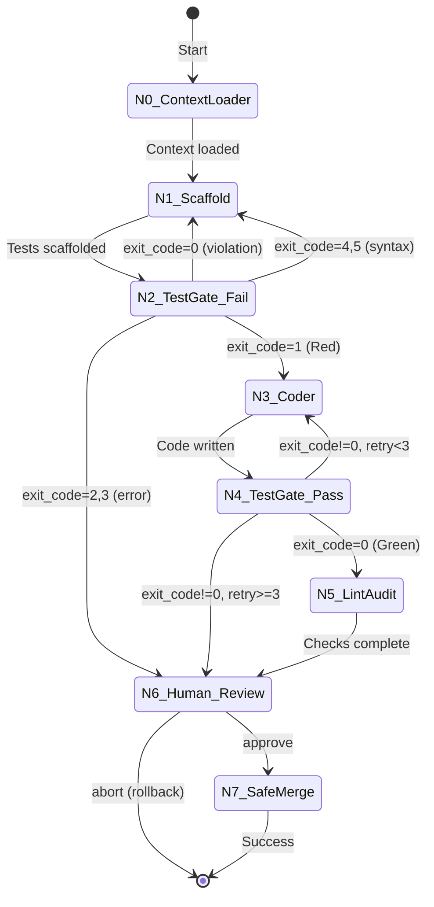

# LLD Finalized

Path: C:\Users\mcwiz\Projects\AgentOS\docs\lld\active\LLD-087.md
Status: APPROVED
Reviews: 2

---

# 187 - Feature: TDD Enforcement & Context-Aware Code Generation Workflow

<!-- Template Metadata
Last Updated: 2025-01-XX
Updated By: Initial LLD Creation
Update Reason: New implementation workflow for Issue #87
-->

## 1. Context & Goal
* **Issue:** #87
* **Objective:** Create a LangGraph-based implementation workflow that enforces Test-Driven Development, injects architectural context, and prevents LLM hallucination of test results by running real pytest commands.
* **Status:** Draft
* **Related Issues:** #003 (LLD Workflow - prerequisite)

### Open Questions

- [ ] Should the human review timeout (30 min) be configurable via CLI flag?
- [ ] What VS Code command should be used to open diffs (code --diff vs code -d)?
- [ ] Should we support alternative test runners (e.g., unittest) in future versions?

## 2. Proposed Changes

*This section is the **source of truth** for implementation. Describes exactly what will be built.*

### 2.1 Files Changed

| File | Change Type | Description |
|------|-------------|-------------|
| `agentos/workflows/implementation/__init__.py` | Add | Package initialization, exports graph and state |
| `agentos/workflows/implementation/graph.py` | Add | Main StateGraph definition with all nodes and routing |
| `agentos/workflows/implementation/state.py` | Add | ImplementationState TypedDict definition |
| `agentos/workflows/implementation/nodes/__init__.py` | Add | Nodes subpackage init |
| `agentos/workflows/implementation/nodes/context_loader.py` | Add | N0: Load LLD and context files with validation |
| `agentos/workflows/implementation/nodes/scaffold.py` | Add | N1: Test scaffolding node |
| `agentos/workflows/implementation/nodes/test_gates.py` | Add | N2 (must fail) and N4 (must pass) test gate nodes |
| `agentos/workflows/implementation/nodes/coder.py` | Add | N3: Implementation writing node |
| `agentos/workflows/implementation/nodes/lint_audit.py` | Add | N5: Static analysis node |
| `agentos/workflows/implementation/nodes/human_review.py` | Add | N6: Interactive approval/abort with VS Code |
| `agentos/workflows/implementation/nodes/safe_merge.py` | Add | N7: Privileged git operations |
| `agentos/workflows/implementation/path_validator.py` | Add | Centralized path security validation |
| `agentos/workflows/implementation/context_validator.py` | Add | File size and token count validation |
| `agentos/workflows/implementation/exit_code_router.py` | Add | Pytest exit code to node routing logic |
| `agentos/workflows/implementation/mock_llm.py` | Add | Mock LLM responses for offline testing |
| `tools/run_implementation_workflow.py` | Add | CLI entry point with data policy display |
| `tests/workflows/implementation/__init__.py` | Add | Test package init |
| `tests/workflows/implementation/test_graph.py` | Add | Graph routing tests |
| `tests/workflows/implementation/test_nodes.py` | Add | Individual node unit tests |
| `tests/workflows/implementation/test_path_validator.py` | Add | Path traversal security tests |
| `tests/workflows/implementation/test_context_validator.py` | Add | File size and token limit tests |
| `tests/workflows/implementation/test_exit_code_router.py` | Add | Exit code routing logic tests |
| `tests/workflows/implementation/test_governance_audit.py` | Add | GovernanceAuditLog integration tests |
| `tests/fixtures/implementation/mock_responses.json` | Add | Static fixtures for mock LLM mode |
| `docs/wiki/workflows.md` | Modify | Add Implementation Workflow section |
| `docs/0003-file-inventory.md` | Modify | Add new files to inventory |

### 2.2 Dependencies

```toml
# pyproject.toml additions (if any)
# langgraph already in dependencies per issue spec
# No new dependencies required
```

### 2.3 Data Structures

```python
# Pseudocode - NOT implementation
class ImplementationState(TypedDict):
    issue_id: str                    # GitHub issue number
    lld_content: str                 # Loaded LLD markdown content
    context_content: str             # Concatenated context files
    test_code: str                   # Generated test code
    implementation_code: str         # Generated implementation code
    test_output: str                 # Captured pytest stdout/stderr
    test_exit_code: int              # Pytest exit code (0-5)
    retry_count: int                 # Implementation retry counter (max 3)
    scaffold_retry_count: int        # Test scaffold retry counter
    changed_files: list[str]         # Files modified by workflow
    human_decision: str              # "approve" | "abort" | None
    error_history: list[str]         # Accumulated error messages for escalation
    current_node: str                # Current node name for logging
    worktree_path: str               # Path to git worktree if used

class PytestResult(TypedDict):
    exit_code: int                   # 0-5 per pytest spec
    stdout: str                      # Captured stdout
    stderr: str                      # Captured stderr
    duration_seconds: float          # Execution time

class PathValidationResult(TypedDict):
    valid: bool                      # Whether path is safe
    resolved_path: str               # Absolute resolved path
    rejection_reason: str | None     # Why rejected if invalid

class ContextValidationResult(TypedDict):
    valid: bool                      # Whether context is within limits
    total_bytes: int                 # Total size of all files
    estimated_tokens: int            # Rough token estimate
    rejection_reason: str | None     # Why rejected if invalid
```

### 2.4 Function Signatures

```python
# State module
def create_initial_state(issue_id: str, lld_path: str) -> ImplementationState:
    """Create initial state for workflow execution."""
    ...

# Path validator module
def validate_path(path: str, project_root: Path) -> PathValidationResult:
    """Validate a file path for security concerns."""
    ...

def is_secret_file(path: str) -> bool:
    """Check if filename matches secret file patterns."""
    ...

# Context validator module
def validate_file_size(path: Path, max_bytes: int = 102400) -> tuple[bool, str]:
    """Validate individual file is under size limit (100KB default)."""
    ...

def validate_total_tokens(content: str, max_tokens: int = 200000) -> tuple[bool, int]:
    """Estimate token count and validate under limit."""
    ...

def estimate_tokens(text: str) -> int:
    """Rough token estimation (chars / 4)."""
    ...

# Exit code router module
def route_by_exit_code(state: ImplementationState) -> str:
    """Determine next node based on pytest exit code."""
    ...

def is_valid_red_state(exit_code: int) -> bool:
    """Check if exit code represents valid TDD 'Red' phase (exit code 1 only)."""
    ...

# Node functions
def n0_context_loader(state: ImplementationState) -> ImplementationState:
    """Load LLD and context files, validate paths and sizes."""
    ...

def n1_scaffold(state: ImplementationState) -> ImplementationState:
    """Generate failing test scaffolds from LLD spec."""
    ...

def n2_test_gate_fail(state: ImplementationState) -> ImplementationState:
    """Run pytest, verify tests fail with exit code 1."""
    ...

def n3_coder(state: ImplementationState) -> ImplementationState:
    """Generate implementation code using context."""
    ...

def n4_test_gate_pass(state: ImplementationState) -> ImplementationState:
    """Run pytest, verify tests pass."""
    ...

def n5_lint_audit(state: ImplementationState) -> ImplementationState:
    """Run linting and audit checks."""
    ...

def n6_human_review(state: ImplementationState) -> ImplementationState:
    """Interactive review with VS Code, get approve/abort decision."""
    ...

def n7_safe_merge(state: ImplementationState) -> ImplementationState:
    """Commit changes and cleanup worktree."""
    ...

# Test execution
def run_pytest(test_path: str, timeout: int = 300) -> PytestResult:
    """Execute pytest with timeout, return structured result."""
    ...

# Governance logging
def log_node_transition(
    from_node: str,
    to_node: str,
    state: ImplementationState,
    audit_log: GovernanceAuditLog
) -> None:
    """Log node transition to GovernanceAuditLog."""
    ...

# CLI
def print_data_policy() -> None:
    """Print data handling policy reminder to console."""
    ...

def parse_args() -> argparse.Namespace:
    """Parse CLI arguments."""
    ...
```

### 2.5 Logic Flow (Pseudocode)

```
1. CLI receives --issue, --lld, optional --context files
2. Print data handling policy reminder
3. Validate all paths (security check, size limits)
4. IF any path invalid THEN
   - Print error, exit with code 1
5. Initialize ImplementationState
6. Initialize GovernanceAuditLog
7. Execute StateGraph:

   N0_ContextLoader:
   - Log transition via GovernanceAuditLog
   - Load LLD content
   - Load and concatenate context files
   - Validate total token count
   - Route to N1_Scaffold

   N1_Scaffold:
   - Log transition via GovernanceAuditLog
   - Generate test files using LLM
   - Inject LLD spec and context
   - Route to N2_TestGate_Fail

   N2_TestGate_Fail:
   - Log transition via GovernanceAuditLog
   - Run pytest with 300s timeout
   - Capture exit code and output
   - IF exit_code == 1 THEN
     - Valid Red state, route to N3_Coder
   - ELSE IF exit_code == 0 THEN
     - Tests pass = violation, reject with message
     - Route back to N1_Scaffold
   - ELSE IF exit_code in [4, 5] THEN
     - Syntax/collection error, route to N1_Scaffold
   - ELSE IF exit_code in [2, 3] THEN
     - Internal error, route to N6_Human_Review
   - END IF

   N3_Coder:
   - Log transition via GovernanceAuditLog
   - Generate implementation using LLM
   - Inject test output, LLD, and context
   - Route to N4_TestGate_Pass

   N4_TestGate_Pass:
   - Log transition via GovernanceAuditLog
   - Run pytest with 300s timeout
   - IF exit_code == 0 THEN
     - Route to N5_LintAudit
   - ELSE
     - Increment retry_count
     - IF retry_count > 3 THEN
       - Route to N6_Human_Review (escalation)
     - ELSE
       - Inject test output into state
       - Route back to N3_Coder
     - END IF
   - END IF

   N5_LintAudit:
   - Log transition via GovernanceAuditLog
   - Run linting (ruff, mypy)
   - Run project audit checks
   - Log results
   - Route to N6_Human_Review

   N6_Human_Review:
   - Log transition via GovernanceAuditLog
   - Display changed files
   - Open VS Code with diff view
   - Prompt: "Type 'approve' or 'abort': "
   - Wait for input (30 min timeout)
   - IF input == "approve" THEN
     - Route to N7_SafeMerge
   - ELSE IF input == "abort" THEN
     - Trigger rollback
     - Exit with code 2
   - ELSE IF timeout THEN
     - Preserve state, exit with warning
   - END IF

   N7_SafeMerge:
   - Log transition via GovernanceAuditLog
   - Commit changes with message
   - Cleanup worktree if used
   - Log completion to GovernanceAuditLog
   - Exit with code 0

8. Handle interrupts gracefully (preserve state)
```

### 2.6 Technical Approach

* **Module:** `agentos/workflows/implementation/`
* **Pattern:** LangGraph StateGraph with conditional routing
* **Key Decisions:**
  - Nodes are pure functions that transform state
  - Routing is deterministic based on pytest exit codes (no LLM interpretation)
  - All subprocess calls use explicit argument lists (no shell=True)
  - Privileged operations (rm, git worktree remove) only in N7_SafeMerge
  - All node transitions logged via GovernanceAuditLog for auditability

### 2.7 Architecture Decisions

| Decision | Options Considered | Choice | Rationale |
|----------|-------------------|--------|-----------|
| State management | Dict, dataclass, TypedDict | TypedDict | Type hints without runtime overhead, matches LangGraph patterns |
| Pytest execution | LLM interpretation, subprocess | subprocess | LLM cannot be trusted to interpret test results accurately |
| Exit code routing | Single condition, lookup table | Dedicated router function | Centralized, testable, matches pytest spec exactly |
| Mock LLM mode | Env var, CLI flag, both | Both (env var + --dry-run) | Flexibility for CI (env) and interactive use (flag) |
| Human interaction | GUI, web, CLI | CLI input() | Simplest, works everywhere, VS Code opened separately |
| Timeout handling | signal, threading, asyncio | signal.alarm | Standard approach, clean timeout exception |
| VS Code diff command | code -d, code --diff | code --diff | Verbose flag for clarity in codebase (per Gemini feedback) |

**Architectural Constraints:**
- Must integrate with existing GovernanceAuditLog
- Must use langgraph package already in dependencies
- Cannot introduce new external dependencies

## 3. Requirements

*What must be true when this is done. These become acceptance criteria.*

1. Tests MUST be written before implementation code (Red-Green-Refactor enforced)
2. N2_TestGate_Fail MUST accept ONLY pytest exit code 1 as valid Red state
3. N2_TestGate_Fail MUST route to N1_Scaffold on exit codes 4 or 5
4. N2_TestGate_Fail MUST route to N6_Human_Review on exit codes 2 or 3
5. Maximum 3 retry attempts before human escalation
6. Pytest subprocess calls MUST include 300-second timeout
7. Paths with traversal sequences (`../`) MUST be rejected
8. Files matching secret patterns MUST be rejected
9. Individual files larger than 100KB MUST be rejected
10. Total context exceeding 200k tokens MUST fail fast before API call
11. `AGENTOS_MOCK_LLM=1` MUST enable offline graph testing
12. CLI MUST print data handling policy on startup
13. Human review MUST accept "approve" or "abort" input
14. "abort" MUST trigger rollback and exit with code 2
15. All node transitions MUST be logged via GovernanceAuditLog

## 4. Alternatives Considered

| Option | Pros | Cons | Decision |
|--------|------|------|----------|
| LLM interprets test results | Simpler architecture | Hallucination risk, unreliable | **Rejected** |
| Subprocess pytest execution | Reliable, verifiable | More complexity | **Selected** |
| Single retry with escalation | Faster escalation | Misses recoverable failures | **Rejected** |
| 3 retries then escalation | Handles transient issues | More token usage | **Selected** |
| All exit codes = valid Red | Simpler routing | Masks broken tests | **Rejected** |
| Exit code 1 only = valid Red | Precise TDD enforcement | More routing logic | **Selected** |
| Config file for paths | More flexible | Adds complexity | **Rejected** |
| CLI flags for context | Simple, explicit | Requires command-line args | **Selected** |

**Rationale:** The subprocess approach with precise exit code handling prevents LLM hallucination entirely. The 3-retry limit balances cost against giving the agent reasonable chances to self-correct.

## 5. Data & Fixtures

### 5.1 Data Sources

| Attribute | Value |
|-----------|-------|
| Source | Local files (LLD markdown, Python source files via --context) |
| Format | Markdown (.md), Python (.py) |
| Size | <100KB per file, <200k tokens total |
| Refresh | Manual (user-provided) |
| Copyright/License | User responsibility per data policy |

### 5.2 Data Pipeline

```
LLD File ──read──► Context Builder ──concat──► Master Prompt
Context Files ──validate──► Context Builder ──estimate tokens──► LLM API
```

### 5.3 Test Fixtures

| Fixture | Source | Notes |
|---------|--------|-------|
| Mock LLM responses | Generated | Static JSON in tests/fixtures/implementation/ |
| Sample LLD files | Hardcoded | Test-specific markdown |
| Pytest output samples | Generated | Captured from real pytest runs |
| Path traversal attempts | Hardcoded | Security test vectors |

### 5.4 Deployment Pipeline

Local development only. No deployment pipeline required for this workflow.

**External data sources:** None. All inputs are local files provided by user.

## 6. Diagram

### 6.1 Mermaid Quality Gate

Before finalizing any diagram, verify in [Mermaid Live Editor](https://mermaid.live) or GitHub preview:

- [x] **Simplicity:** Similar components collapsed (per 0006 §8.1)
- [x] **No touching:** All elements have visual separation (per 0006 §8.2)
- [x] **No hidden lines:** All arrows fully visible (per 0006 §8.3)
- [x] **Readable:** Labels not truncated, flow direction clear
- [ ] **Auto-inspected:** Agent rendered via mermaid.ink and viewed (per 0006 §8.5)

**Agent Auto-Inspection (MANDATORY):**

**Auto-Inspection Results:**
```
- Touching elements: [ ] None / [ ] Found: ___
- Hidden lines: [ ] None / [ ] Found: ___
- Label readability: [ ] Pass / [ ] Issue: ___
- Flow clarity: [ ] Clear / [ ] Issue: ___
```

*To be completed during implementation phase*

### 6.2 Diagram



## 7. Security & Safety Considerations

### 7.1 Security

| Concern | Mitigation | Status |
|---------|------------|--------|
| Path traversal attack | validate_path() rejects `../` and out-of-root paths | Addressed |
| Secret file exposure | is_secret_file() pattern matching | Addressed |
| Shell injection | All subprocess calls use explicit arg lists, no shell=True | Addressed |
| Symlink escape | Path.resolve() before validation | Addressed |
| Malicious test code | Pytest runs in subprocess with timeout | Addressed |
| Token budget attack | File size (100KB) and token (200k) limits | Addressed |

### 7.2 Safety

| Concern | Mitigation | Status |
|---------|------------|--------|
| Infinite retry loop | retry_count caps at 3, then escalation | Addressed |
| Hanging tests | 300-second subprocess timeout | Addressed |
| Accidental file deletion | rm -rf only in N7_SafeMerge, after human approval | Addressed |
| Data loss on abort | Rollback reverts uncommitted changes, preserves worktree | Addressed |
| Runaway LLM cost | Token estimation, max retries, context limits | Addressed |

**Fail Mode:** Fail Closed - On any unexpected error, workflow halts and preserves state for human review.

**Recovery Strategy:** 
- On interrupt: State preserved, can resume manually
- On abort: Rollback uncommitted changes, worktree preserved for debugging
- On timeout: Escalate to human review with full error history

## 8. Performance & Cost Considerations

### 8.1 Performance

| Metric | Budget | Approach |
|--------|--------|----------|
| Pytest execution | < 300s per run | Subprocess timeout |
| File loading | < 1s total | Reject files > 100KB |
| Token estimation | < 100ms | Simple chars/4 heuristic |
| Total workflow | < 30 min typical | Retry limits, timeouts |

**Bottlenecks:** 
- LLM API latency (external, unavoidable)
- Pytest execution time (test-dependent)

### 8.2 Cost Analysis

| Resource | Unit Cost | Estimated Usage | Monthly Cost |
|----------|-----------|-----------------|--------------|
| LLM API (input tokens) | ~$3/1M tokens | ~50k per run | Varies by usage |
| LLM API (output tokens) | ~$15/1M tokens | ~4k per run | Varies by usage |
| Retry loop (3 max) | ~$0.30 per retry | ~1-3 retries typical | Varies by usage |

**Per-run cost estimate:** $0.50-$1.00 typical, $2.00 max (with all retries)

**Cost Controls:**
- [x] Maximum 3 retries before escalation
- [x] Token estimation before API calls
- [x] Context size limits prevent budget blowout
- [x] --dry-run flag for testing without API calls

**Worst-Case Scenario:** 
- 3 retries = ~$2.00 per implementation attempt
- Human escalation stops infinite loops
- Context limits prevent token budget attacks

## 9. Legal & Compliance

| Concern | Applies? | Mitigation |
|---------|----------|------------|
| PII/Personal Data | Yes | Data policy reminder, user responsibility |
| Third-Party Licenses | Yes | User must ensure --context files are appropriately licensed |
| Terms of Service | Yes | User must comply with LLM provider ToS |
| Data Retention | N/A | No persistent storage of transmitted data |
| Export Controls | N/A | No restricted algorithms |

**Data Classification:** Internal (user code transmitted to LLM provider)

**Compliance Checklist:**
- [x] Data handling policy printed on startup
- [x] User warned about PII/secrets responsibility
- [x] Secret file pattern rejection as safety net
- [x] No persistent storage of API-transmitted data

## 10. Verification & Testing

**Testing Philosophy:** Strive for 100% automated test coverage. Mock LLM mode enables testing graph routing without API calls.

### 10.1 Test Scenarios

| ID | Scenario | Type | Input | Expected Output | Pass Criteria |
|----|----------|------|-------|-----------------|---------------|
| 010 | Happy path - full TDD cycle | Auto | Valid LLD, passing implementation | Exit code 0, files committed | Tests pass, merge succeeds |
| 020 | Exit code 1 routes to N3_Coder | Auto | Mock pytest exit 1 | State routes to coder | route_by_exit_code returns "N3_Coder" |
| 030 | Exit code 0 rejects (tests must fail) | Auto | Mock pytest exit 0 | State routes to N1_Scaffold | Rejection message in state |
| 040 | Exit code 4 routes to N1_Scaffold | Auto | Mock pytest exit 4 | State routes to scaffold | route_by_exit_code returns "N1_Scaffold" |
| 050 | Exit code 5 routes to N1_Scaffold | Auto | Mock pytest exit 5 | State routes to scaffold | route_by_exit_code returns "N1_Scaffold" |
| 060 | Exit code 2 routes to human review | Auto | Mock pytest exit 2 | State routes to human | route_by_exit_code returns "N6_Human_Review" |
| 070 | Exit code 3 routes to human review | Auto | Mock pytest exit 3 | State routes to human | route_by_exit_code returns "N6_Human_Review" |
| 080 | Retry count caps at 3 | Auto | 4 failed attempts | Escalation to human | retry_count == 3, human review triggered |
| 090 | Path traversal rejected | Auto | `../etc/passwd` | Validation error | PathValidationResult.valid == False |
| 100 | Absolute path rejected | Auto | `/etc/passwd` | Validation error | PathValidationResult.valid == False |
| 110 | Secret file rejected (.env) | Auto | `.env` file path | Validation error | is_secret_file returns True |
| 120 | Secret file rejected (.key) | Auto | `server.key` path | Validation error | is_secret_file returns True |
| 130 | File >100KB rejected | Auto | 150KB file | Size error | validate_file_size returns False |
| 140 | Total tokens >200k rejected | Auto | Large concatenated content | Token error | validate_total_tokens returns False |
| 150 | Pytest timeout (300s) | Auto | Mock hanging test | Timeout exception | PytestResult includes timeout info |
| 160 | Human review approve | Auto | Mock input "approve" | Routes to N7_SafeMerge | human_decision == "approve" |
| 170 | Human review abort | Auto | Mock input "abort" | Rollback, exit 2 | human_decision == "abort", exit code 2 |
| 180 | Mock LLM mode | Auto | AGENTOS_MOCK_LLM=1 | Uses fixtures | No API calls made |
| 190 | --dry-run prints path | Auto | --dry-run flag | Execution path printed | No API calls, path output |
| 200 | Data policy printed | Auto | Normal execution | Policy in stdout | Policy text in captured output |
| 210 | GovernanceAuditLog records transitions | Auto | Execute workflow with mocked audit log | Audit entries created for each node | Mock audit_log.log() called for each transition |

### 10.2 Test Commands

```bash
# Run all automated tests
poetry run pytest tests/workflows/implementation/ -v

# Run only unit tests (fast, mocked)
poetry run pytest tests/workflows/implementation/ -v -m "not integration"

# Run with mock LLM
AGENTOS_MOCK_LLM=1 poetry run pytest tests/workflows/implementation/ -v

# Run specific test module
poetry run pytest tests/workflows/implementation/test_exit_code_router.py -v

# Run path security tests
poetry run pytest tests/workflows/implementation/test_path_validator.py -v

# Run governance audit log tests
poetry run pytest tests/workflows/implementation/test_governance_audit.py -v
```

### 10.3 Manual Tests (Only If Unavoidable)

| ID | Scenario | Why Not Automated | Steps |
|----|----------|-------------------|-------|
| M010 | VS Code diff opens correctly | Requires VS Code installed and visual confirmation | 1. Run workflow to N6_Human_Review 2. Verify VS Code opens with correct diff 3. Verify file paths are correct |
| M020 | Interactive prompt timeout | 30-minute timeout impractical in CI | 1. Run workflow to N6_Human_Review 2. Wait without input 3. Verify timeout message after 30 min |

## 11. Risks & Mitigations

| Risk | Impact | Likelihood | Mitigation |
|------|--------|------------|------------|
| LLM generates syntactically broken tests | Med | Med | Exit code 4/5 detection routes back to scaffold |
| Pytest hangs indefinitely | High | Low | 300-second timeout on all subprocess calls |
| Infinite retry loop burns tokens | High | Low | Hard cap at 3 retries, then human escalation |
| Path traversal allows secret access | High | Low | Strict path validation before file load |
| Token estimation inaccurate | Med | Med | Conservative 200k limit with buffer |
| VS Code not installed for review | Med | Low | Clear error message, fallback to terminal diff |
| Human abandons review | Med | Med | 30-minute timeout with state preservation |

## 12. Definition of Done

### Code
- [ ] All nodes implemented in `agentos/workflows/implementation/nodes/`
- [ ] StateGraph wired in `graph.py` with all routing
- [ ] Path validator rejects traversal and secret files
- [ ] Context validator enforces size limits
- [ ] Exit code router handles all pytest codes
- [ ] GovernanceAuditLog integration for all node transitions
- [ ] Mock LLM mode functional for offline dev
- [ ] CLI argument parsing complete
- [ ] Data policy printed on startup
- [ ] Human review interactive flow works
- [ ] Code comments reference this LLD (Issue #87)

### Tests
- [ ] All 21 test scenarios pass (including 210 for GovernanceAuditLog)
- [ ] Test coverage > 90% for workflow modules
- [ ] Path security tests comprehensive
- [ ] Exit code routing tests cover all codes
- [ ] GovernanceAuditLog transition tests verify requirement 15

### Documentation
- [ ] `docs/wiki/workflows.md` updated with Implementation Workflow section (including Mermaid diagram)
- [ ] Architecture diagram added to wiki
- [ ] Retry behavior documented
- [ ] Exit code handling documented
- [ ] Human review interaction documented
- [ ] New files added to `docs/0003-file-inventory.md`
- [ ] Data transmission policy documented

### Reports
- [ ] `docs/reports/087/implementation-report.md` created
- [ ] `docs/reports/087/test-report.md` created

### Review
- [ ] 0809 Security Audit - PASS
- [ ] 0817 Wiki Alignment Audit - PASS
- [ ] Code review completed
- [ ] User approval before closing issue

---

## Appendix: Review Log

*Track all review feedback with timestamps and implementation status.*

### Gemini Review #1 (REVISE)

**Timestamp:** 2025-01-XX
**Reviewer:** Gemini 3 Pro
**Verdict:** REVISE

#### Comments

| ID | Comment | Implemented? |
|----|---------|--------------|
| G1.1 | "Coverage is 93.3%. You must add a test case to Section 10 explicitly verifying that GovernanceAuditLog receives entries during workflow execution." | YES - Added test scenario 210 in Section 10.1 |
| G1.2 | "Ensure the Mermaid diagram in Section 6 is included in the updated docs/wiki/workflows.md." | YES - Added explicit note in Section 12 Documentation checklist |
| G1.3 | "Consider making the 30-minute human review timeout configurable via a CLI flag (addressing Open Question 1)." | PENDING - Kept as Open Question for future consideration |
| G1.4 | "code --diff is the verbose equivalent. Recommend using the verbose flag for clarity in the codebase." | YES - Updated Section 2.7 Architecture Decisions to specify code --diff |

### Review Summary

| Review | Date | Verdict | Key Issue |
|--------|------|---------|-----------|
| Gemini #1 | 2025-01-XX | REVISE | Missing GovernanceAuditLog test coverage (Requirement 15) |

**Final Status:** APPROVED
<!-- Note: This field is auto-updated to APPROVED by the workflow when finalized -->