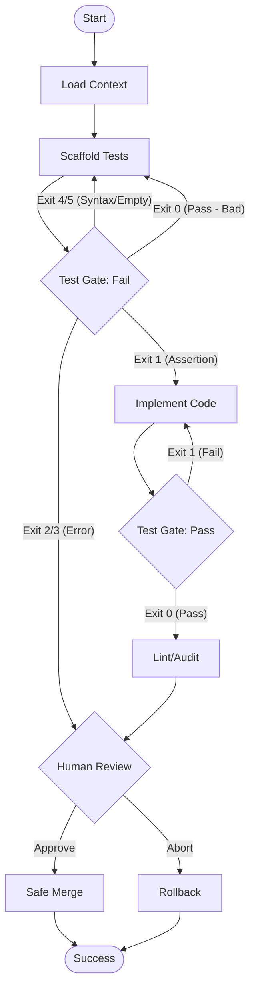

# 87 - Feature: Implementation Workflow: TDD Enforcement & Context-Aware Code Generation

## 1. Context & Goal
* **Issue:** #87
* **Objective:** Create a LangGraph-based implementation workflow that enforces Test-Driven Development (TDD) by running real pytest commands, managing context injection, and ensuring safe git operations.
* **Status:** Draft
* **Related Issues:** #003 (LLD Workflow)

### Open Questions
None - requirements are well-defined from issue.

## 2. Proposed Changes

### 2.1 Files Changed
| File Path | Description |
|-----------|-------------|
| `agentos/workflows/implementation/__init__.py` | Package initialization. |
| `agentos/workflows/implementation/state.py` | State schema definition. |
| `agentos/workflows/implementation/graph.py` | Main LangGraph definition and node wiring. |
| `agentos/workflows/implementation/nodes/context_loader.py` | N0: Loads LLD and context files, performs validation. |
| `agentos/workflows/implementation/nodes/scaffold.py` | N1: Generates initial test files. |
| `agentos/workflows/implementation/nodes/test_gates.py` | N2 & N4: Runs pytest and updates state. |
| `agentos/workflows/implementation/nodes/coder.py` | N3: Writes implementation code based on failures. |
| `agentos/workflows/implementation/nodes/lint_audit.py` | N5: Static analysis checks. |
| `agentos/workflows/implementation/nodes/human_review.py` | N6: Interactive approval/abort. |
| `agentos/workflows/implementation/nodes/safe_merge.py` | N7: Git commit and merge operations. |
| `agentos/workflows/implementation/path_validator.py` | Security utility for path and secret validation. |
| `agentos/workflows/implementation/context_validator.py` | Size and token limit validation utility. |
| `agentos/workflows/implementation/exit_code_router.py` | Logic to map pytest exit codes to graph edges. |
| `agentos/workflows/implementation/mock_llm.py` | Deterministic responses for testing. |
| `tools/run_implementation_workflow.py` | CLI entry point. |

### 2.2 Dependencies
*   **langgraph**: For state graph orchestration.
*   **pytest**: For running tests (subprocess).
*   **pathlib**: For path resolution and security checks.
*   **tiktoken**: For token counting (context size estimation).

### 2.3 Data Structures

```python
# agentos/workflows/implementation/state.py

from typing import TypedDict, List, Optional

class ImplementationState(TypedDict):
    issue_id: str
    lld_path: str
    lld_content: str
    context_paths: List[str]
    context_content: str
    
    # Execution Tracking
    changed_files: List[str]  # List of files created/modified
    test_output: str          # Stdout/Stderr from pytest
    test_exit_code: int       # 0=Pass, 1=Fail, etc.
    
    # Loop Counters
    retry_count: int          # For N3 implementation retries (max 3)
    scaffold_retry_count: int # For N1 syntax error retries (max 3)
    
    # Human Interaction
    human_decision: str       # 'approve' or 'abort'
    
    # Error Handling
    error_message: Optional[str]
```

### 2.4 Function Signatures

```python
# agentos/workflows/implementation/nodes/test_gates.py
def run_tests(state: ImplementationState) -> ImplementationState:
    """
    Executes 'pytest -v --tb=short' in a subprocess with 300s timeout.
    Captures stdout/stderr and exit code into state.
    """
    pass

# agentos/workflows/implementation/exit_code_router.py
def route_test_failure(state: ImplementationState) -> str:
    """
    Determines next node based on exit code:
    - 1 (Assertion Error) -> 'implementation' (N3)
    - 4/5 (Usage/No Tests) -> 'scaffold' (N1)
    - 2/3 (Interrupt/Internal) -> 'human_review' (N6)
    - 0 (Pass) -> 'error' (if expected failure)
    """
    pass

# agentos/workflows/implementation/path_validator.py
def validate_context_path(path_str: str, root_dir: Path) -> Path:
    """
    Resolves path, checks for traversal (../), ensures inside root.
    Checks against secret patterns (.env, *.key).
    Raises ValueError if invalid.
    """
    pass

# agentos/workflows/implementation/context_validator.py
def validate_context_size(files: List[Path]) -> None:
    """
    Checks if any file > 100KB.
    Checks if total estimated tokens > 200,000.
    Raises ValueError if limits exceeded.
    """
    pass
```

### 2.5 Logic Flow (Pseudocode)

```python
# tools/run_implementation_workflow.py
def main():
    print_data_handling_policy()
    args = parse_args()
    
    # Pre-flight security & size checks
    try:
        valid_paths = validate_paths(args.context)
        validate_context_size(valid_paths)
    except ValidationError as e:
        print(f"Validation Error: {e}")
        exit(1)

    state = initialize_state(args)
    
    # Compile Graph
    workflow = StateGraph(ImplementationState)
    workflow.add_node("load_context", load_context_node)
    workflow.add_node("scaffold", scaffold_node)
    workflow.add_node("verify_failure", verify_failure_node) # N2
    workflow.add_node("implement", implement_node)           # N3
    workflow.add_node("verify_success", verify_success_node) # N4
    workflow.add_node("lint", lint_node)
    workflow.add_node("human_review", human_review_node)
    workflow.add_node("safe_merge", safe_merge_node)

    # Wiring logic handled in Technical Approach
    app = workflow.compile()
    app.invoke(state)

# agentos/workflows/implementation/exit_code_router.py
def route_n2_fail_gate(state):
    code = state['test_exit_code']
    if code == 1:
        return "implement" # Valid red state
    elif code in [4, 5]:
        if state['scaffold_retry_count'] >= 3:
            return "human_review"
        return "scaffold" # Syntax error in test
    elif code == 0:
        return "scaffold" # Error: Tests must fail first
    else:
        return "human_review" # System error
```

### 2.6 Technical Approach
*   **Design Pattern:** State Machine via `langgraph`. Nodes are functional units; edges are conditional logic.
*   **Subprocess Isolation:** `pytest` is never run via `eval()`. It is run via `subprocess.run` with `timeout=300`.
*   **Mock Mode:** A global flag `AGENTOS_MOCK_LLM` or `--dry-run` argument injects a custom `LLM` client into nodes. This client reads from `tests/fixtures/implementation/` instead of calling an API, allowing deterministic testing of the graph routing logic.
*   **Context Strategy:** Context is loaded once at N0. If it passes size/security checks, it is injected into the system prompt for N1 (Scaffold) and N3 (Implement).
*   **Routing Logic:** The critical logic sits in `exit_code_router.py`. It explicitly maps Pytest exit codes to graph transitions, enforcing the TDD "Red" state before allowing implementation.

## 3. Requirements

1.  **TDD Enforcement:** Implementation (N3) can ONLY be reached if tests fail with exit code 1 (AssertionError).
2.  **Pytest Exit Routing:**
    *   Exit 0: Pass
    *   Exit 1: Assertion Failure (Good for N2, Bad for N4)
    *   Exit 2: Interrupted (Escalate)
    *   Exit 3: Internal Error (Escalate)
    *   Exit 4: Usage Error (Retry Scaffold)
    *   Exit 5: No Tests Collected (Retry Scaffold)
3.  **Context Security:** Files matching `*.env`, `*.key`, `*secret*`, `*credentials*` must be rejected.
4.  **Path Security:** Paths must resolve inside project root. No `../` allowed.
5.  **Size Limits:** Individual files > 100KB rejected. Total context > 200k tokens rejected.
6.  **Retry Limits:** Max 3 retries for implementation failures. Max 3 retries for scaffold syntax errors.
7.  **Human Review:** Interactive prompt (`input()`) allowing "approve" or "abort".
8.  **Safe Operations:** Git operations (commit/merge) occur only after Human Approval. "Abort" triggers rollback.
9.  **Timeout:** Pytest execution must timeout after 300 seconds.

## 4. Alternatives Considered

| Alternative | Pros | Cons | Decision |
|-------------|------|------|----------|
| **LLM Tool Use for Pytest** | Agent decides when to run tests. | LLM can hallucinate results or ignore failures. | **Reject**: We need a strict external arbiter. |
| **Single "Coder" Node** | Simpler graph architecture. | Hard to enforce "Test First" vs "Implement". | **Reject**: Separating Scaffold and Implement nodes enforces TDD. |
| **Git Hooks** | Enforces checks at commit time. | Does not guide the generation process. | **Reject**: We need to guide the agent, not just block it. |
| **Automated PR Creation** | Closer to full CI/CD. | Too complex for this ticket. | **Defer**: Keep scope to local worktree for now. |

## 5. Data & Fixtures

### 5.1 Data Sources
| Source | Type | Attributes |
|--------|------|------------|
| LLD File | Input (File) | Markdown content describing feature. |
| Context Files | Input (File) | Existing code to prevent duplication. |
| Pytest Output | Runtime Data | Stdout/Stderr, Exit Code. |

### 5.2 Data Pipeline
```ascii
[CLI Input] --> [Path/Size Validator] --> [Context Loader] 
                                                |
                                                v
[LLM (Scaffold)] --> [Pytest (Arbiter)] --(Exit Code)--> [Router]
                                                            |
                                      +---------------------+
                                      |
                                      v
[LLM (Implement)] <-- (Ctx) -- [Implementation Node]
        |
        v
[Pytest (Arbiter)] --> [Lint] --> [Human Review] --> [Git Merge]
```

### 5.3 Test Fixtures
| Fixture | Description |
|---------|-------------|
| `mock_responses.json` | Canned LLM responses for Scaffold and Implement nodes. |
| `fixture_syntax_error.py` | A test file with invalid syntax (Exit code 4). |
| `fixture_assertion_fail.py` | A test file that fails assertions (Exit code 1). |
| `fixture_large_file.txt` | A 150KB file for testing size limits. |

### 5.4 Deployment Pipeline
Development tool only. Deployed via pip/source to developer machines.

## 6. Diagram

### 6.1 Mermaid Quality Gate
- [x] Node names are clear
- [x] Decision logic is visible
- [x] Error loops are closed
- [x] End states are defined

### 6.2 Diagram


## 7. Security Considerations

| Concern | Mitigation |
|---------|------------|
| **Path Traversal** | Use `pathlib.Path.resolve()`. Verify `path.is_relative_to(project_root)`. Reject `..`. |
| **Secret Leakage** | Reject files matching `.env`, `*.key`, `*.pem`, `*secret*` before loading. |
| **Context Bomb** | Hard limit of 100KB per file and 200k tokens total. |
| **Malicious Code** | Pytest runs in subprocess. No `eval()`. Git operations require human approval. |
| **Infinite Loop** | Max 3 retries enforced by state counter. |

## 8. Performance Considerations

| Metric | Budget |
|--------|--------|
| **Startup Time** | < 1 second (Context validation). |
| **Pytest Timeout** | 300 seconds hard limit per run. |
| **Token Limit** | 200,000 tokens (Input context). |
| **Context File Size** | 100KB per file. |

## 9. Risks & Mitigations

| Risk | Impact | Likelihood | Mitigation |
|------|--------|------------|------------|
| **LLM Hallucination** | Agent writes code for non-existent libraries. | Medium | Inject existing utilities via `--context`. Linting step N5. |
| **Infinite Retry Loop** | Token cost explosion. | Low | Hard limit of 3 retries in graph state. |
| **Git Corruption** | Worktree left in bad state. | Low | `Safe Merge` node handles cleanup. Rollback node handles aborts. |
| **Test Flakiness** | Tests pass/fail randomly. | Low | Human review acts as final gate. |

## 10. Verification & Testing

### 10.1 Test Scenarios

| ID | Scenario | Type | Input | Output | Criteria |
|----|----------|------|-------|--------|----------|
| TS-01 | Happy Path | Integration | Valid LLD, Context | Success (0) | Tests fail first, then pass. Files merged. |
| TS-02 | Syntax Error in Test | Edge Case | - | Retry | Workflow loops back to N1 (Scaffold). |
| TS-03 | Implementation Struggle | Logic | - | Retry Loop | Workflow loops N3->N4 3 times, then Escalate. |
| TS-04 | Path Traversal | Security | `--context ../pass` | Error | Validator rejects path. |
| TS-05 | Secret File | Security | `--context .env` | Error | Validator rejects secret pattern. |
| TS-06 | Human Abort | UX | Input "abort" | Exit 2 | Changes reverted, worktree clean. |

### 10.2 Test Commands
```bash
# Run unit tests
pytest tests/workflows/implementation/

# Run mock happy path
AGENTOS_MOCK_LLM=1 python tools/run_implementation_workflow.py --issue 999 --lld docs/lld.md

# Run security test
python tools/run_implementation_workflow.py --issue 999 --lld docs/lld.md --context .env
```

### 10.3 Manual Tests
N/A - All scenarios coverable via `AGENTOS_MOCK_LLM` fixture injection.

## 11. Definition of Done

### Code
- [ ] `ImplementationState` defined.
- [ ] Path and Context validators implemented with regex for secrets.
- [ ] `ExitCodeRouter` handles 0, 1, 2, 3, 4, 5.
- [ ] All graph nodes implemented (N0-N7).
- [ ] `run_implementation_workflow.py` CLI working.

### Tests
- [ ] Unit tests for `path_validator`.
- [ ] Unit tests for `exit_code_router`.
- [ ] Integration test for full graph using Mock LLM.
- [ ] Test ensuring tests MUST fail before implementation.

### Documentation
- [ ] `docs/wiki/workflows.md` updated.
- [ ] CLI help text (`--help`) is clear.
- [ ] Data handling policy documented.

### Review
- [ ] Security audit passed (Path traversal/Secrets).
- [ ] Code review completed.

---

## Appendix: Review Log

### Review Summary

| Review | Date | Verdict | Key Issue |
|--------|------|---------|-----------|
| - | - | - | - |

**Final Status:** DRAFT - PENDING REVIEW