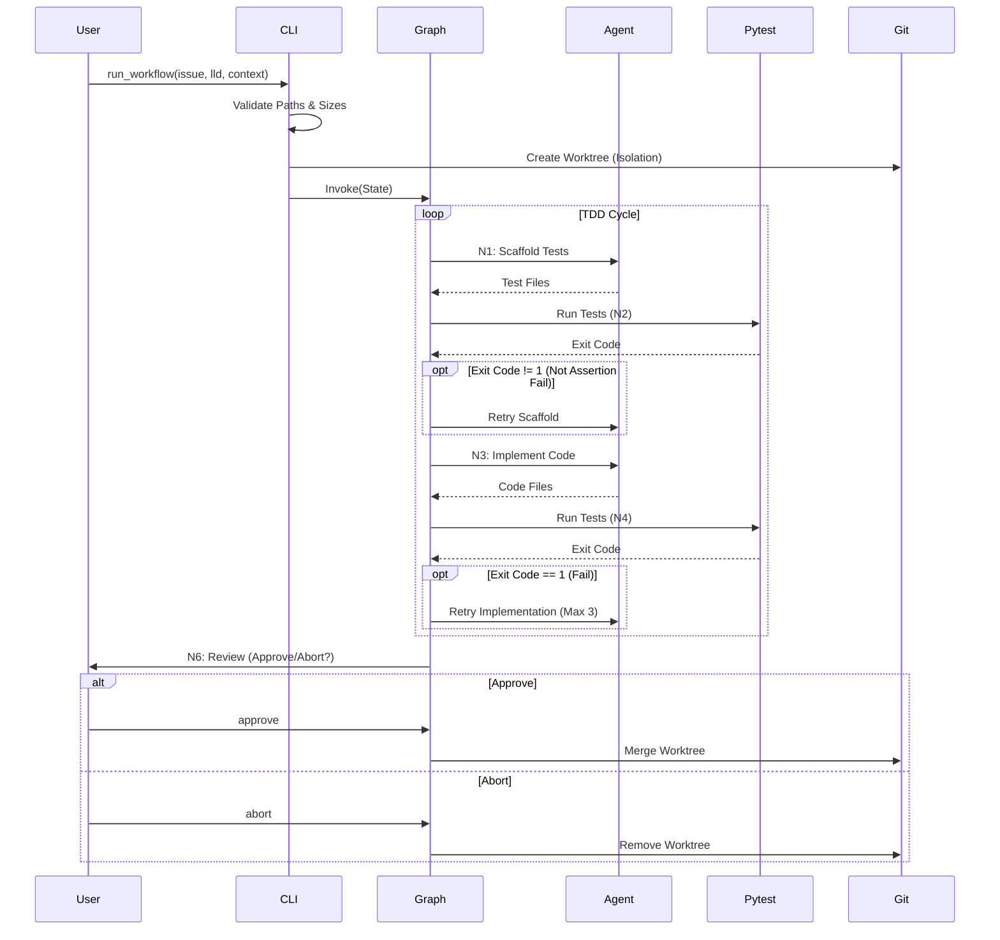

# 87 - Feature: Implementation Workflow: TDD Enforcement & Context-Aware Code Generation

## 1. Context & Goal
* **Issue:** #87
* **Objective:** Create a LangGraph-based implementation workflow that acts as an arbiter—running real pytest commands, enforcing test-first development, and safely managing git operations outside of LLM control.
* **Status:** Draft
* **Related Issues:** #003 (LLD Workflow)

### Open Questions
None - requirements are well-defined from issue.

## 2. Proposed Changes

### 2.1 Files Changed
| File Path | Description |
|-----------|-------------|
| `agentos/workflows/implementation/__init__.py` | Package initialization. |
| `agentos/workflows/implementation/state.py` | Defines `ImplementationState` TypedDict. |
| `agentos/workflows/implementation/graph.py` | Main `StateGraph` definition and node wiring. |
| `agentos/workflows/implementation/nodes/context_loader.py` | N0: Validates paths/sizes, loads content, builds prompt. |
| `agentos/workflows/implementation/nodes/scaffold.py` | N1: Generates initial failing test files. |
| `agentos/workflows/implementation/nodes/test_gates.py` | N2 & N4: Runs pytest via subprocess, captures exit codes. |
| `agentos/workflows/implementation/nodes/coder.py` | N3: Writes implementation code based on test failures. |
| `agentos/workflows/implementation/nodes/lint_audit.py` | N5: Runs static analysis (stub for future). |
| `agentos/workflows/implementation/nodes/human_review.py` | N6: Interactive CLI prompt for user approval. |
| `agentos/workflows/implementation/nodes/safe_merge.py` | N7: Handles git commit and worktree cleanup. |
| `agentos/workflows/implementation/path_validator.py` | Security utility for path resolution and secret scanning. |
| `agentos/workflows/implementation/context_validator.py` | Utility for file size and token count validation. |
| `agentos/workflows/implementation/exit_code_router.py` | Pure logic mapping pytest exit codes to graph edges. |
| `agentos/workflows/implementation/mock_llm.py` | Mock LLM implementation for offline testing. |
| `tools/run_implementation_workflow.py` | CLI entry point with argparse and policy display. |

### 2.2 Dependencies
*   **langgraph**: Core state machine orchestration.
*   **pytest**: Test execution runner (via subprocess).
*   **tiktoken**: Token counting for context limits.
*   **pathlib**: Secure path manipulation.

### 2.3 Data Structures

```python
from typing import TypedDict, List, Optional, Literal

class ImplementationState(TypedDict):
    # Inputs
    issue_id: str
    lld_content: str
    context_paths: List[str]
    context_content: str  # Concatenated content for prompt
    
    # Runtime State
    worktree_path: str        # Path to temporary git worktree
    changed_files: List[str]  # Files modified/created by agent
    
    # Test Execution Data
    test_output: str          # Combined stdout/stderr
    test_exit_code: int       # 0-5 pytest exit codes
    
    # Control Flow Counters
    retry_count: int          # Implementation retries (Max 3)
    scaffold_retry_count: int # Test syntax error retries (Max 3)
    
    # Human Interaction
    human_decision: Literal['approve', 'abort', 'pending']
    
    # Error Handling
    error_message: Optional[str]
```

### 2.4 Function Signatures

```python
# agentos/workflows/implementation/path_validator.py
def validate_context_path(path_str: str, project_root: Path) -> Path:
    """
    Resolves path, ensures it is relative to project root (no ../ traversal).
    Checks filename against secret patterns (.env, *.key, etc.).
    Raises ValueError on violation.
    """
    pass

# agentos/workflows/implementation/context_validator.py
def validate_context_limits(files: List[Path]) -> None:
    """
    Checks individual file size < 100KB.
    Estimates total token count. Raises error if > 200k.
    """
    pass

# agentos/workflows/implementation/exit_code_router.py
def route_n2_fail_gate(state: ImplementationState) -> str:
    """
    Routes from N2 (Test Gate Fail):
    - Exit 1 (AssertionError) -> 'implement' (N3) - VALID TDD RED
    - Exit 4/5 (Usage/NoTests) -> 'scaffold' (N1) - RETRY
    - Exit 0 (Pass) -> 'scaffold' (N1) - INVALID (Tests must fail first)
    - Exit 2/3 (System Error) -> 'human_review' (N6) - ESCALATE
    """
    pass

# agentos/workflows/implementation/nodes/test_gates.py
def run_pytest_subprocess(worktree_path: str, timeout: int = 300) -> tuple[int, str]:
    """
    Runs `pytest -v --tb=short` in the specific worktree.
    Returns (exit_code, output).
    Catches TimeoutExpired and returns custom code/message.
    """
    pass
```

### 2.5 Logic Flow (Pseudocode)

```python
# tools/run_implementation_workflow.py
def main():
    print_data_policy()
    args = parse_args()
    
    # 1. Input Validation
    try:
        validated_paths = [validate_context_path(p) for p in args.context]
        validate_context_limits(validated_paths)
    except ValidationError as e:
        exit_with_error(e)

    # 2. Setup Isolation (Address Safety Feedback)
    worktree_path = create_git_worktree(f"feat/issue-{args.issue}")
    
    # 3. Initialize State
    state = ImplementationState(
        issue_id=args.issue,
        context_paths=validated_paths,
        worktree_path=worktree_path,
        retry_count=0, 
        scaffold_retry_count=0,
        human_decision='pending'
    )
    
    # 4. Execute Graph
    graph = build_graph()
    try:
        final_state = graph.invoke(state)
        if final_state['human_decision'] == 'approve':
            merge_worktree(worktree_path)
            print("Success: Feature merged.")
        else:
            print("Aborted by user.")
    finally:
        remove_git_worktree(worktree_path) # Always cleanup

# agentos/workflows/implementation/nodes/test_gates.py (N2)
def node_test_gate_fail(state):
    code, output = run_pytest_subprocess(state['worktree_path'])
    state['test_exit_code'] = code
    state['test_output'] = output
    
    if code == 0:
        state['error_message'] = "Tests passed prematurely. Write failing tests first."
    elif code == 4:
        state['error_message'] = "Syntax error in tests."
        state['scaffold_retry_count'] += 1
        
    return state
```

### 2.6 Technical Approach
1.  **Safety via Git Worktrees:** To address the reviewer feedback regarding "accidental data loss", this workflow will utilize `git worktree`.
    *   **Setup:** Create a new worktree in a temporary directory linked to a feature branch.
    *   **Execution:** All file generation and testing happen inside this isolated directory.
    *   **Teardown:** If aborted, simply remove the worktree folder and delete the branch. No risk of corrupting the main checkout or losing uncommitted changes in the developer's primary workspace.
2.  **State Machine:** LangGraph handles the cyclical logic (Retry Loops) which is difficult to manage with linear scripts.
3.  **Strict Arbiter:** The LLM is never asked "Did the tests pass?". The python script parses the process exit code directly.
4.  **Mock Infrastructure:** A `MockLLM` class (toggled by `AGENTOS_MOCK_LLM=1`) allows testing the graph routing logic without spending API credits.

## 3. Requirements

1.  **TDD Enforcement:** The workflow MUST enter a "Red" state (Exit Code 1) before allowing implementation code to be generated.
2.  **Context Security:**
    *   Reject files > 100KB.
    *   Reject total context > 200k tokens.
    *   Reject paths containing `../`.
    *   Reject files matching secrets (`.env`, `*.pem`, `*.key`).
3.  **Process Isolation:** Pytest MUST run in a subprocess with a 300-second timeout.
4.  **Worktree Isolation:** All changes MUST occur in a separate git worktree, not the current working directory.
5.  **Exit Code Routing:**
    *   **1 (Assertion Fail):** Proceed to Implementation.
    *   **0 (Pass):** Reject (at N2).
    *   **4/5 (Usage/Empty):** Retry Scaffold (up to 3 times).
    *   **2/3 (Error):** Escalate to Human Review.
6.  **Human Control:** The user must explicitly type "approve" to merge. "abort" triggers a safe cleanup.

## 4. Alternatives Considered

| Alternative | Pros | Cons | Decision |
|-------------|------|------|----------|
| **In-place Edits** | Simpler implementation. | Risk of overwriting user's uncommitted work. | **Reject** in favor of Git Worktrees for safety. |
| **LLM Output Parsing** | LLM can explain why tests failed. | LLM can hallucinate "Tests Passed". | **Reject**: Use OS exit codes as the source of truth. |
| **Docker Isolation** | Perfect environment isolation. | High overhead, complex to mount context. | **Defer**: Git worktree + venv is sufficient for local dev. |
| **Pre-commit Hooks** | Enforces tests at commit time. | Reactive only; doesn't help *generate* code. | **Reject**: We need a generative workflow. |

## 5. Data & Fixtures

### 5.1 Data Sources
| Source | Attributes | Purpose |
|--------|------------|---------|
| **LLD Document** | Markdown text | The specification for the feature. |
| **Context Files** | Python code | Existing utilities to prevent duplication. |
| **Pytest Stdout** | Text stream | Error messages injected into Agent prompt. |
| **Pytest Exit Code** | Integer | Deterministic routing decision. |

### 5.2 Data Pipeline
```ascii
[CLI Arguments] 
      v
[Validation (Path/Size/Secret)]
      v
[Git Worktree Creation] -> [Context Loading]
      v
[N1: Scaffold Tests] <--(Retry Exit 4/5)--+
      v                                   |
[N2: Pytest (Must Fail)] --(Exit 0)-------+
      |
      +--(Exit 1: Valid Red)--> [N3: Implementation]
                                        |
      +--(Retry Exit 1)-----------------+
      |
[N4: Pytest (Must Pass)] 
      |
      +--(Exit 0)--> [N5: Lint] --> [N6: Human Review]
                                           |
                                [N7: Merge] OR [Cleanup]
```

### 5.3 Test Fixtures
| Fixture | Description |
|---------|-------------|
| `mock_pass_response` | LLM response generating passing code. |
| `mock_fail_response` | LLM response generating failing code. |
| `fixture_secret.env` | File to test security rejection. |
| `fixture_traversal_path` | String `../outside.py` for path testing. |

### 5.4 Deployment Pipeline
*   **Development Only:** This tool runs locally on the developer's machine.
*   **Distribution:** Part of the `agentos-cli` package.

## 6. Diagram

### 6.1 Mermaid Quality Gate
- [x] Node names are clear
- [x] Decision logic is visible
- [x] Error loops are closed
- [x] End states are defined

### 6.2 Diagram


## 7. Security Considerations

| Concern | Mitigation |
|---------|------------|
| **Data Loss** | Use `git worktree` to isolate generated code from user's main working directory. |
| **Path Traversal** | `pathlib.Path.resolve()` checks if path is relative to project root. |
| **Secret Exfiltration** | Regex filter rejects `.env`, `*.key`, `*secret*` before LLM transmission. |
| **DoS (Token Budget)** | Pre-flight check fails if total tokens > 200,000. |
| **DoS (Infinite Loop)** | Graph state counters limit retries to 3. |

## 8. Performance Considerations

| Metric | Budget |
|--------|--------|
| **Startup Overhead** | < 2s (Worktree creation + Context loading). |
| **Pytest Timeout** | 300s (Hard limit to prevent hanging processes). |
| **Token Usage** | Max ~130k input tokens per run (fail fast if exceeded). |

## 9. Risks & Mitigations

| Risk | Impact | Likelihood | Mitigation |
|------|--------|------------|------------|
| **Worktree Cleanup Failure** | Stale directories left on disk. | Low | Use `try/finally` blocks in CLI runner. |
| **LLM "Lazy" Coding** | Agent uses `pass` to make tests pass. | Medium | Human Review (N6) is the final gate. |
| **Context Window Overflow** | API rejection. | Low | Local estimation using `tiktoken` before request. |

## 10. Verification & Testing

### 10.1 Test Scenarios
| ID | Scenario | Type | Input | Output | Criteria |
|----|----------|------|-------|--------|----------|
| TS-01 | **Safe Isolation** | Integration | Run workflow | Worktree created | Main directory untouched; changes isolated in worktree. |
| TS-02 | **TDD Enforcement** | Logic | Mock Pytest Exit 0 at N2 | Retry N1 | System rejects passing tests at scaffold stage. |
| TS-03 | **Secret Rejection** | Security | `--context .env` | Error Message | Validator raises `ValueError` before graph start. |
| TS-04 | **Retry Loop** | Logic | Mock Pytest Exit 1 at N4 | Retry N3 | Logic retries implementation 3 times then halts. |
| TS-05 | **Path Traversal** | Security | `--context ../pass` | Error Message | Path resolved and rejected. |
| TS-06 | **Human Abort** | UX | "abort" at N6 | Cleanup | Worktree removed, no merge performed. |

### 10.2 Test Commands
```bash
# Verify Mock Mode Graph Logic
AGENTOS_MOCK_LLM=1 pytest tests/workflows/implementation/test_graph.py

# Verify Path Security
python tools/run_implementation_workflow.py --issue 87 --lld docs/lld.md --context ../secret.txt
# Expected: Error: Path resolves outside project root.

# Verify Size Limits
python tools/run_implementation_workflow.py --issue 87 --lld docs/lld.md --context large_file.py
# Expected: Error: File exceeds 100KB limit.
```

### 10.3 Manual Tests (Only If Unavoidable)
N/A - All logic coverable via unit tests and `AGENTOS_MOCK_LLM` integration tests.

## 11. Definition of Done

### Code
- [ ] `ImplementationState` defined with `worktree_path`.
- [ ] `path_validator` implemented with regex and traversal checks.
- [ ] `exit_code_router` correctly handles 0, 1, 4, 5.
- [ ] `run_implementation_workflow.py` implements `git worktree` setup/teardown.
- [ ] Mock LLM mode enabled via environment variable.

### Tests
- [ ] Unit tests for context security (secrets/paths/sizes).
- [ ] Integration test verifying worktree isolation.
- [ ] Graph logic tests ensuring TDD order (N1->N2(Fail)->N3).

### Documentation
- [ ] Data handling policy added to `docs/wiki`.
- [ ] CLI help text updated.
- [ ] Mermaid diagram added to architecture docs.

### Review
- [ ] Security audit passed (specifically worktree isolation and path validation).
- [ ] Code review completed.

---

## Appendix: Review Log

### Review Summary

| Review | Date | Verdict | Key Issue |
|--------|------|---------|-----------|
| - | - | - | - |

**Final Status:** DRAFT - PENDING REVIEW