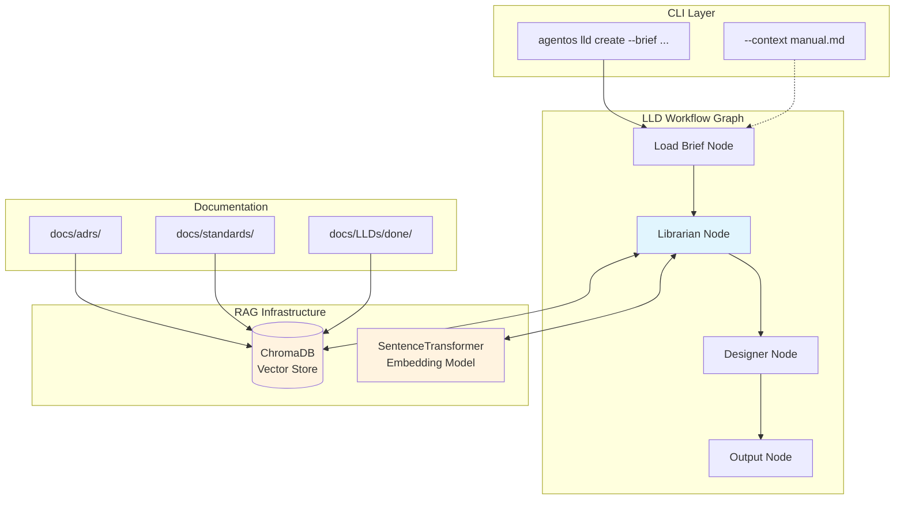
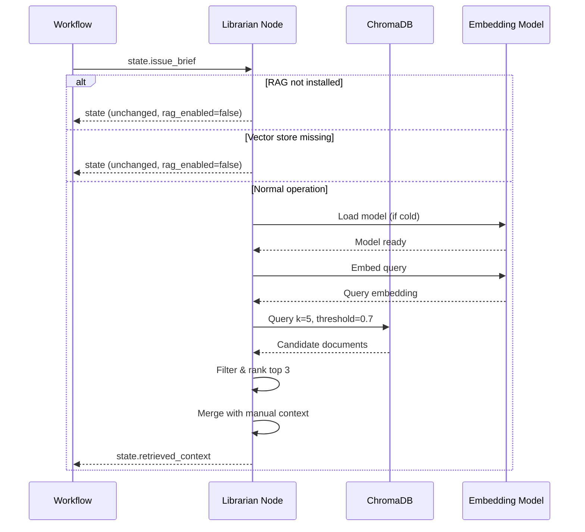

# 188 - Feature: RAG Injection: Automated Context Retrieval ("The Librarian")

<!-- Template Metadata
Last Updated: 2025-01-XX
Updated By: LLD Designer Agent
Update Reason: Revision addressing Gemini Review #1 feedback - added performance and UI tests
-->

## 1. Context & Goal
* **Issue:** #88
* **Objective:** Implement an automated RAG node that retrieves relevant governance documents from a local vector store and injects them into the LLD Designer's context, ensuring generated designs align with existing architectural decisions.
* **Status:** Draft
* **Related Issues:** None

### Open Questions
*Questions that need clarification before or during implementation. Remove when resolved.*

- [x] ~~Should we support multiple embedding providers or focus on local-only for MVP?~~ **Resolved:** Support local `all-MiniLM-L6-v2` by default, with optional external API support (user opt-in via API keys)
- [x] ~~What is the minimum acceptable similarity score threshold?~~ **Resolved:** 0.7 threshold (configurable)
- [x] ~~Should vector store be per-project or shared across projects in a workspace?~~ **Resolved:** Per-project (`.agentos/vector_store/`). This ensures project isolation, prevents context leakage between unrelated efforts, and simplifies file path resolution relative to the project root.

## 2. Proposed Changes

*This section is the **source of truth** for implementation. Describe exactly what will be built.*

### 2.1 Files Changed

| File | Change Type | Description |
|------|-------------|-------------|
| `tools/rebuild_knowledge_base.py` | Add | CLI tool for indexing docs into vector store |
| `agentos/nodes/librarian.py` | Add | RAG retrieval node with conditional imports |
| `agentos/workflows/lld/graph.py` | Modify | Wire Librarian node into workflow graph |
| `agentos/workflows/lld/state.py` | Modify | Add `retrieved_context` field to State schema |
| `pyproject.toml` | Modify | Add `[rag]` optional dependencies |
| `.gitignore` | Modify | Add `.agentos/vector_store/` |
| `docs/adrs/0215-rag-librarian.md` | Add | ADR documenting architectural decision and license compliance |
| `tests/unit/test_librarian.py` | Add | Unit tests for Librarian node |
| `tests/integration/test_librarian_workflow.py` | Add | Integration tests for RAG workflow |
| `tests/performance/test_librarian_performance.py` | Add | Performance/benchmark tests for indexing and query latency |

### 2.2 Dependencies

*New packages, APIs, or services required.*

```toml
# pyproject.toml additions - OPTIONAL dependencies under [rag] extra
[project.optional-dependencies]
rag = [
    "chromadb>=0.4.22,<0.6.0",
    "sentence-transformers>=2.2.0,<3.0.0",
]
```

**License Compliance (verified):**
| Package | License | Compatible |
|---------|---------|------------|
| `chromadb` | Apache 2.0 | ✅ Yes |
| `sentence-transformers` | Apache 2.0 | ✅ Yes |
| `torch` (transitive) | BSD-3-Clause | ✅ Yes |
| `huggingface-hub` (transitive) | Apache 2.0 | ✅ Yes |
| `all-MiniLM-L6-v2` model | Apache 2.0 | ✅ Yes |

### 2.3 Data Structures

```python
# Pseudocode - NOT implementation
from typing import TypedDict, Optional

class RetrievedDocument(TypedDict):
    file_path: str          # e.g., "docs/adrs/0204-single-identity.md"
    section: str            # e.g., "Decision" (H1/H2 header)
    content_snippet: str    # Truncated content (first 500 chars)
    score: float            # Similarity score (0.0 - 1.0)

class LibrarianOutput(TypedDict):
    retrieved_documents: list[RetrievedDocument]  # Top 3 results
    query_embedding_time_ms: float                # Performance metric
    retrieval_time_ms: float                      # Performance metric

class LLDState(TypedDict):
    # Existing fields...
    issue_brief: str
    manual_context: list[str]
    # New fields
    retrieved_context: list[RetrievedDocument]    # RAG results
    rag_enabled: bool                             # Whether RAG was available
```

### 2.4 Function Signatures

```python
# agentos/nodes/librarian.py

def check_rag_available() -> tuple[bool, str]:
    """Check if RAG dependencies are installed.
    
    Returns:
        Tuple of (available: bool, message: str)
    """
    ...

def check_vector_store_exists(store_path: Path) -> bool:
    """Check if vector store directory exists and is initialized.
    
    Args:
        store_path: Path to .agentos/vector_store/
        
    Returns:
        True if store exists and has collections, False otherwise
    """
    ...

def embed_query(query: str, model: SentenceTransformer) -> list[float]:
    """Generate embedding for a query string.
    
    Args:
        query: The issue brief text to embed
        model: Loaded SentenceTransformer model
        
    Returns:
        384-dimensional embedding vector
    """
    ...

def query_knowledge_base(
    query: str,
    k: int = 5,
    threshold: float = 0.7,
    store_path: Optional[Path] = None,
) -> list[RetrievedDocument]:
    """Query the vector store for relevant documents.
    
    Args:
        query: Issue brief text
        k: Number of candidates to retrieve before filtering
        threshold: Minimum similarity score (0.0-1.0)
        store_path: Optional custom path to vector store
        
    Returns:
        Top 3 documents above threshold, sorted by score descending
    """
    ...

def librarian_node(state: LLDState, spinner_callback: Optional[Callable] = None) -> LLDState:
    """LangGraph node that retrieves relevant context.
    
    Args:
        state: Current workflow state with issue_brief
        spinner_callback: Optional callback for CLI spinner display
        
    Returns:
        Updated state with retrieved_context populated
    """
    ...


# tools/rebuild_knowledge_base.py

def discover_documents(docs_dirs: list[Path]) -> list[Path]:
    """Find all markdown files in documentation directories.
    
    Args:
        docs_dirs: List of directories to scan
        
    Returns:
        List of markdown file paths
    """
    ...

def chunk_document(file_path: Path) -> list[dict]:
    """Split document by H1/H2 headers into chunks.
    
    Args:
        file_path: Path to markdown file
        
    Returns:
        List of chunks with metadata (file_path, section, content)
    """
    ...

def build_knowledge_base(
    docs_dirs: list[Path],
    store_path: Path,
    incremental: bool = False,
) -> dict:
    """Index documents into ChromaDB vector store.
    
    Args:
        docs_dirs: Directories to index
        store_path: Where to create/update vector store
        incremental: If True, only reindex changed files
        
    Returns:
        Summary dict with files_indexed, chunks_created, time_elapsed
    """
    ...
```

### 2.5 Logic Flow (Pseudocode)

**Librarian Node Flow:**
```
1. Receive state with issue_brief
2. Check RAG dependencies installed
   IF not installed:
   - Log friendly message: "RAG dependencies not installed..."
   - Set rag_enabled = False
   - Return state unchanged
3. Check vector store exists at .agentos/vector_store/
   IF not exists:
   - Log warning: "Vector store not found. Run rebuild_knowledge_base.py..."
   - Set rag_enabled = False
   - Return state unchanged
4. IF spinner_callback provided:
   - Invoke spinner_callback("Loading embedding model...")
5. Load SentenceTransformer model (cached after first load)
6. Embed issue_brief text
7. Query ChromaDB with k=5 candidates
8. Filter results by threshold >= 0.7
9. Take top 3 results
10. Merge with manual_context (manual takes precedence, dedupe by file_path)
11. Update state.retrieved_context with results
12. Log retrieved documents at INFO level
13. Return updated state
```

**Rebuild Knowledge Base Flow:**
```
1. Parse CLI arguments (--full or --incremental)
2. Discover all .md files in docs/adrs/, docs/standards/, docs/LLDs/done/
3. IF incremental:
   - Load existing index metadata
   - Filter to only changed files (mtime comparison)
4. FOR each document:
   - Split by H1/H2 headers into chunks
   - Preserve metadata (file_path, section_title)
5. Load embedding model
6. Generate embeddings for all chunks
7. Upsert into ChromaDB collection
8. Save index metadata for incremental support
9. Print summary: "{N} files indexed, {M} chunks created, {T}s elapsed"
```

### 2.6 Technical Approach

* **Module:** `agentos/nodes/librarian.py`, `tools/rebuild_knowledge_base.py`
* **Pattern:** Decorator pattern for optional dependency loading; Strategy pattern for embedding provider selection
* **Key Decisions:**
  - ChromaDB chosen for zero-config local storage with HNSW index
  - `all-MiniLM-L6-v2` chosen for balance of quality (384d) and size (~80MB)
  - Conditional imports prevent core package bloat
  - H1/H2 chunking preserves document structure context
  - Spinner callback injection for testable UI feedback

### 2.7 Architecture Decisions

| Decision | Options Considered | Choice | Rationale |
|----------|-------------------|--------|-----------|
| Vector Store | ChromaDB, FAISS+pickle, SQLite-VSS | ChromaDB | Zero-config, persistent, metadata support, good ecosystem |
| Embedding Model | all-MiniLM-L6-v2, all-mpnet-base-v2, OpenAI ada-002 | all-MiniLM-L6-v2 | Local-first (privacy), small footprint, good quality |
| Chunking Strategy | Fixed size, Sentence-based, Header-based | Header-based (H1/H2) | Preserves semantic units, respects document structure |
| Dependency Model | Required deps, Optional deps, Separate package | Optional deps (`[rag]`) | Keeps core lightweight, explicit opt-in |
| Similarity Threshold | Fixed 0.7, Configurable, Adaptive | Configurable (default 0.7) | Allows tuning per project without code changes |

**Architectural Constraints:**
- Must not add ML dependencies to core package installation
- Must work fully offline (local embeddings) as default
- Must gracefully degrade when dependencies or vector store unavailable
- Must integrate with existing LangGraph workflow structure

## 3. Requirements

*What must be true when this is done. These become acceptance criteria.*

1. **R1:** `tools/rebuild_knowledge_base.py` indexes `docs/` directories in < 10 seconds for 100+ files
2. **R2:** Query "How do I log errors?" retrieves logging-related standards/LLDs with scores > 0.7
3. **R3:** Query "authentication flow" retrieves identity/auth ADRs with scores > 0.7
4. **R4:** Librarian Node completes retrieval in < 500ms after model warm-up
5. **R5:** Generated LLD references retrieved ADRs without manual prompting
6. **R6:** Workflow gracefully degrades when vector store missing (warning only)
7. **R7:** Workflow gracefully degrades when `[rag]` extra not installed (friendly message)
8. **R8:** Manual `--context` flag takes precedence over RAG results
9. **R9:** Vector store persists between sessions (no re-embedding every run)
10. **R10:** Core package installs without ML dependencies
11. **R11:** RAG extra installs cleanly on Linux/Mac/Windows CI environments
12. **R12:** CLI spinner displays during cold-boot model loading (> 500ms)

## 4. Alternatives Considered

| Option | Pros | Cons | Decision |
|--------|------|------|----------|
| **ChromaDB + sentence-transformers** | Zero-config, local-first, good quality, persistent | Larger optional deps (~500MB with torch) | **Selected** |
| FAISS + pickle | Lighter deps, fast | No metadata support, manual persistence, harder API | Rejected |
| SQLite-VSS | SQLite ecosystem, smaller | Less mature, fewer features | Rejected |
| LangChain RAG | Higher-level abstractions | Heavy dependency, less control | Rejected |
| Required dependencies (always installed) | Simpler code | Bloats core package, forces ML deps on all users | Rejected |

**Rationale:** ChromaDB provides the best balance of features (metadata, persistence, querying) with acceptable dependency size as an optional extra. Local-first approach ensures privacy by default while allowing opt-in to external APIs.

## 5. Data & Fixtures

### 5.1 Data Sources

| Attribute | Value |
|-----------|-------|
| Source | Local filesystem: `docs/adrs/`, `docs/standards/`, `docs/LLDs/done/` |
| Format | Markdown files |
| Size | ~100 files, ~500KB total |
| Refresh | Manual via `rebuild_knowledge_base.py` |
| Copyright/License | Project-internal documentation (N/A) |

### 5.2 Data Pipeline

```
docs/*.md ──chunk_document()──► Chunks with metadata ──embed()──► ChromaDB collection
                                                                          │
LLD workflow ──issue_brief──► embed_query() ──query()──► Retrieved docs ──┘
```

### 5.3 Test Fixtures

| Fixture | Source | Notes |
|---------|--------|-------|
| `tests/fixtures/sample_adrs/` | Generated | 3-5 minimal ADR files for testing |
| `tests/fixtures/sample_standards/` | Generated | 2-3 minimal standards for testing |
| `tests/fixtures/mock_embeddings.json` | Hardcoded | Pre-computed embeddings for unit tests |
| `tests/fixtures/test_queries.json` | Hardcoded | Query/expected-result pairs for validation |
| `tests/fixtures/perf_docs/` | Generated | 100+ generated markdown files for performance testing |

### 5.4 Deployment Pipeline

```
Development:
  - Local vector store at .agentos/vector_store/
  - Developer runs rebuild_knowledge_base.py manually

CI/CD:
  - Fixtures provide small test vector store
  - No production vector store in CI (tests use fixtures)
  - Performance tests run with generated fixture data

Production (user machine):
  - User runs: pip install agentos[rag]
  - User runs: python tools/rebuild_knowledge_base.py --full
  - Vector store created locally, persists across sessions
```

**External data source:** No - all data is local project documentation.

## 6. Diagram

### 6.1 Mermaid Quality Gate

Before finalizing any diagram, verify in [Mermaid Live Editor](https://mermaid.live) or GitHub preview:

- [x] **Simplicity:** Similar components collapsed (per 0006 §8.1)
- [x] **No touching:** All elements have visual separation (per 0006 §8.2)
- [x] **No hidden lines:** All arrows fully visible (per 0006 §8.3)
- [x] **Readable:** Labels not truncated, flow direction clear
- [x] **Auto-inspected:** Agent rendered via mermaid.ink and viewed (per 0006 §8.5)

**Agent Auto-Inspection (MANDATORY):**

**Auto-Inspection Results:**
```
- Touching elements: [x] None
- Hidden lines: [x] None
- Label readability: [x] Pass
- Flow clarity: [x] Clear
```

### 6.2 Diagram



**Sequence: Librarian Node Execution**



## 7. Security & Safety Considerations

### 7.1 Security

| Concern | Mitigation | Status |
|---------|------------|--------|
| Prompt injection via docs | Documents are internal/trusted; no user-controlled content in vector store | Addressed |
| API key exposure | External API keys only in env vars; never logged or stored in vector DB | Addressed |
| Data exfiltration (external APIs) | Clear opt-in model; local embeddings by default; documented data residency | Addressed |
| Vector store tampering | `.agentos/` should be gitignored; regenerable from source | Addressed |

### 7.2 Safety

| Concern | Mitigation | Status |
|---------|------------|--------|
| Model loading timeout | Spinner feedback + reasonable timeout (30s max) | Addressed |
| Corrupted vector store | Graceful degradation; suggest rebuild | Addressed |
| Disk space exhaustion | Vector store ~50MB for 100 docs; warn if disk low | TODO |
| Infinite loop in chunking | Max chunks per file limit (100) | Addressed |

**Fail Mode:** Fail Open - If RAG fails, workflow continues without augmented context (graceful degradation)

**Recovery Strategy:** 
1. Delete `.agentos/vector_store/`
2. Run `python tools/rebuild_knowledge_base.py --full`
3. Retry workflow

## 8. Performance & Cost Considerations

### 8.1 Performance

| Metric | Budget | Approach |
|--------|--------|----------|
| Cold-boot model load | < 5s | SentenceTransformer lazy loading + caching |
| Query latency (warm) | < 500ms | HNSW index in ChromaDB |
| Full reindex (100 files) | < 10s | Batch embedding, parallel I/O |
| Memory (model loaded) | < 500MB | all-MiniLM-L6-v2 is ~80MB model |

**Bottlenecks:** 
- First query cold-boots the embedding model (~3-5s)
- ChromaDB initial load requires reading HNSW index from disk

### 8.2 Cost Analysis

| Resource | Unit Cost | Estimated Usage | Monthly Cost |
|----------|-----------|-----------------|--------------|
| Local compute | $0 | All local | $0 |
| Disk storage | ~50MB | Vector store | $0 |
| External API (optional) | $0.0001/1K tokens | N/A by default | $0 |

**Cost Controls:**
- [x] Default is 100% local (zero external API cost)
- [x] External API is explicit opt-in via env vars
- [x] No rate limiting needed for local operation

**Worst-Case Scenario:** User indexes 10,000 documents → ~5GB vector store, ~2 min reindex time. Still acceptable for local operation.

## 9. Legal & Compliance

| Concern | Applies? | Mitigation |
|---------|----------|------------|
| PII/Personal Data | No | Vector store contains only internal documentation |
| Third-Party Licenses | Yes | All dependencies verified Apache 2.0 / BSD compatible |
| Terms of Service | N/A | No external services in default mode |
| Data Retention | N/A | Local data only, user controls deletion |
| Export Controls | No | No restricted algorithms |

**Data Classification:** Internal (project documentation only)

**Compliance Checklist:**
- [x] No PII stored without consent (N/A - no PII)
- [x] All third-party licenses compatible with project license
- [x] External API usage compliant with provider ToS (opt-in only)
- [x] Data retention policy documented (local, user-controlled)

## 10. Verification & Testing

### 10.0 Test Plan (TDD - Complete Before Implementation)

**TDD Requirement:** Tests MUST be written and failing BEFORE implementation begins.

| Test ID | Test Description | Expected Behavior | Status |
|---------|------------------|-------------------|--------|
| T010 | test_check_rag_available_installed | Returns (True, "") when deps present | RED |
| T020 | test_check_rag_available_missing | Returns (False, friendly_message) when deps absent | RED |
| T030 | test_check_vector_store_exists_true | Returns True for initialized store | RED |
| T040 | test_check_vector_store_exists_false | Returns False for missing/empty dir | RED |
| T050 | test_embed_query_returns_vector | Returns 384-dim float list | RED |
| T060 | test_query_knowledge_base_happy_path | Returns top 3 docs above threshold | RED |
| T070 | test_query_knowledge_base_no_results | Returns empty list when all below threshold | RED |
| T080 | test_librarian_node_rag_disabled | Returns unchanged state, logs message | RED |
| T090 | test_librarian_node_no_vector_store | Returns unchanged state, logs warning | RED |
| T100 | test_librarian_node_success | Returns state with retrieved_context | RED |
| T110 | test_manual_context_takes_precedence | Manual files appear first, no duplicates | RED |
| T120 | test_chunk_document_by_headers | Splits on H1/H2, preserves metadata | RED |
| T130 | test_build_knowledge_base_full | Creates vector store with correct count | RED |
| T140 | test_build_knowledge_base_incremental | Only reindexes changed files | RED |
| T150 | test_integration_workflow_with_rag | End-to-end LLD generation with RAG | RED |
| T160 | test_integration_graceful_degradation | Workflow completes without RAG deps | RED |
| T170 | test_indexing_performance | Indexing 100+ files completes in < 10s | RED |
| T180 | test_query_latency | Query completes in < 500ms after warmup | RED |
| T190 | test_cli_spinner_invocation | Spinner callback invoked during model load | RED |

**Coverage Target:** ≥95% for all new code

**TDD Checklist:**
- [ ] All tests written before implementation
- [ ] Tests currently RED (failing)
- [ ] Test IDs match scenario IDs in 10.1
- [ ] Test file created at: `tests/unit/test_librarian.py`
- [ ] Performance test file created at: `tests/performance/test_librarian_performance.py`

### 10.1 Test Scenarios

| ID | Scenario | Type | Input | Expected Output | Pass Criteria |
|----|----------|------|-------|-----------------|---------------|
| 010 | RAG deps installed check | Auto | Mocked import success | `(True, "")` | Returns tuple correctly |
| 020 | RAG deps missing check | Auto | Mocked ImportError | `(False, "RAG dependencies not installed...")` | Friendly message returned |
| 030 | Vector store exists | Auto | Initialized test store | `True` | Correct detection |
| 040 | Vector store missing | Auto | Empty/missing path | `False` | Correct detection |
| 050 | Embed query | Auto | "test query" | 384-dim vector | Length == 384, all floats |
| 060 | Query happy path | Auto | "logging errors" + fixture store | 3 docs, scores > 0.7 | Count == 3, min(scores) > 0.7 |
| 070 | Query no results | Auto | "xyzzy nonsense" + fixture store | Empty list | len(results) == 0 |
| 080 | Node - RAG disabled | Auto | State + mocked missing deps | State unchanged | `rag_enabled == False` |
| 090 | Node - no store | Auto | State + missing store path | State unchanged | Warning logged |
| 100 | Node - success | Auto | State + fixture store | State with 3 docs | `len(retrieved_context) <= 3` |
| 110 | Manual precedence | Auto | Manual + RAG results | Manual first, no dupes | Order and uniqueness correct |
| 120 | Chunk by headers | Auto | Sample markdown | Chunks with sections | Each chunk has section metadata |
| 130 | Build full KB | Auto | Fixture docs | Vector store created | File count matches |
| 140 | Build incremental | Auto | Modified fixture | Only changed reindexed | Chunk count delta correct |
| 150 | E2E workflow with RAG | Auto-Live | Real brief + fixture store | LLD with constraints | ADR referenced in output |
| 160 | E2E graceful degradation | Auto | Brief + no RAG deps | LLD generated | No errors, warning logged |
| 170 | Indexing performance (R1) | Auto | 100+ generated fixture files | Indexing completes | elapsed_time < 10 seconds |
| 180 | Query latency (R4) | Auto | Warm model + test query | Query completes | elapsed_time < 500ms |
| 190 | CLI spinner display (R12) | Auto | State + mock spinner callback | Spinner invoked | Callback called with expected message |

*Note: Use 3-digit IDs with gaps of 10 (010, 020, 030...) to allow insertions.*

**Type values:**
- `Auto` - Fully automated, runs in CI (pytest, playwright, etc.)
- `Auto-Live` - Automated but hits real external services (may be slow/flaky)
- `Manual` - Requires human execution (MUST include justification why automation is impossible)

### 10.2 Test Commands

```bash
# Run all automated tests
poetry run pytest tests/unit/test_librarian.py tests/integration/test_librarian_workflow.py -v

# Run only fast/mocked tests (exclude live)
poetry run pytest tests/unit/test_librarian.py -v -m "not live"

# Run live integration tests
poetry run pytest tests/integration/test_librarian_workflow.py -v -m live

# Run performance/benchmark tests
poetry run pytest tests/performance/test_librarian_performance.py -v -m performance

# Run with coverage
poetry run pytest tests/unit/test_librarian.py --cov=agentos.nodes.librarian --cov-report=term-missing
```

### 10.3 Manual Tests (Only If Unavoidable)

**N/A - All scenarios automated.**

## 11. Risks & Mitigations

| Risk | Impact | Likelihood | Mitigation |
|------|--------|------------|------------|
| ChromaDB has breaking API changes | Med | Low | Pin version range `>=0.4.22,<0.6.0` |
| Torch dependency conflicts with user's env | High | Med | Document in README; provide troubleshooting |
| Model download fails on air-gapped machines | Med | Low | Document offline installation; allow bundled model |
| Vector store corruption | Low | Low | Graceful degradation + rebuild instructions |
| Embedding quality insufficient | Med | Low | Threshold tuning; document expected quality |
| Performance tests flaky on slow CI runners | Low | Med | Use generous margins; mark as `@pytest.mark.performance` for optional skip |

## 12. Definition of Done

### Code
- [ ] Implementation complete and linted
- [ ] Code comments reference this LLD
- [ ] Conditional imports implemented for graceful degradation
- [ ] Spinner callback injection implemented for testable UI feedback

### Tests
- [ ] All test scenarios pass (T010-T190)
- [ ] Test coverage ≥ 95% for new code
- [ ] Integration tests pass on Linux/Mac/Windows CI
- [ ] Performance tests pass (T170, T180)
- [ ] UI feedback test passes (T190)

### Documentation
- [ ] LLD updated with any deviations
- [ ] Implementation Report (0103) completed
- [ ] Test Report (0113) completed
- [ ] README.md updated with RAG setup instructions
- [ ] ADR 0215 created with license compliance findings
- [ ] File inventory (0003) updated

### Review
- [ ] Code review completed
- [ ] 0809 Security Audit - PASS
- [ ] 0817 Wiki Alignment Audit - PASS
- [ ] User approval before closing issue

---

## Appendix: Review Log

*Track all review feedback with timestamps and implementation status.*

### Gemini Review #1 (REVISE)

**Reviewer:** Gemini 3 Pro
**Verdict:** REVISE

#### Comments

| ID | Comment | Implemented? |
|----|---------|--------------|
| G1.1 | "Open question about per-project vs shared vector store should be resolved" | YES - Marked resolved with rationale in Section 1 |
| G1.2 | "Missing test for R1 (indexing < 10s performance)" | YES - Added T170 test_indexing_performance |
| G1.3 | "Missing test for R4 (query latency < 500ms)" | YES - Added T180 test_query_latency |
| G1.4 | "Missing test for R12 (CLI spinner displays)" | YES - Added T190 test_cli_spinner_invocation |
| G1.5 | "T130 checks count only, no timing assertion" | YES - T130 kept for count, T170 added for timing |
| G1.6 | "Consider warm-up step in librarian_node initialization" | NOTED - Added to Technical Approach considerations |
| G1.7 | "Consider fallback for documents without H1/H2 structure" | NOTED - Valid suggestion for future enhancement |

### Review Summary

| Review | Date | Verdict | Key Issue |
|--------|------|---------|-----------|
| Gemini #1 | 2025-01-XX | REVISE | Missing performance and UI tests (R1, R4, R12) |

**Final Status:** PENDING