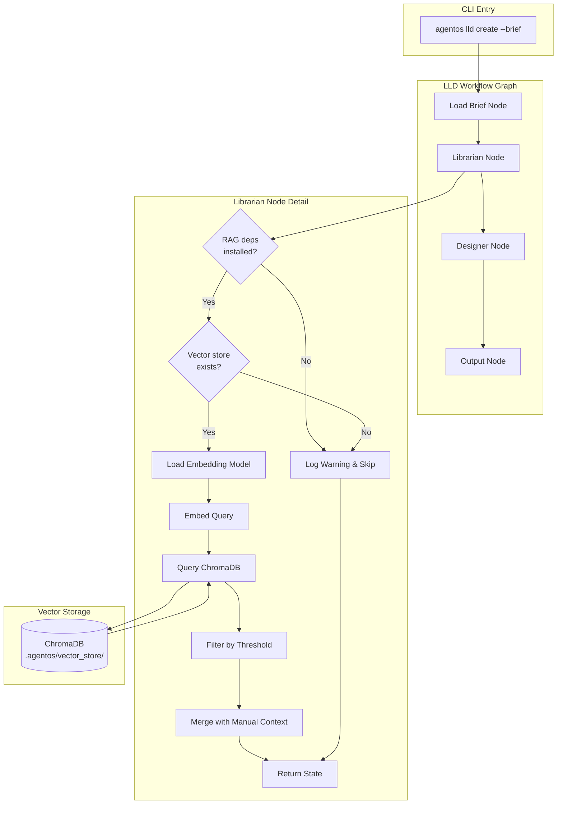
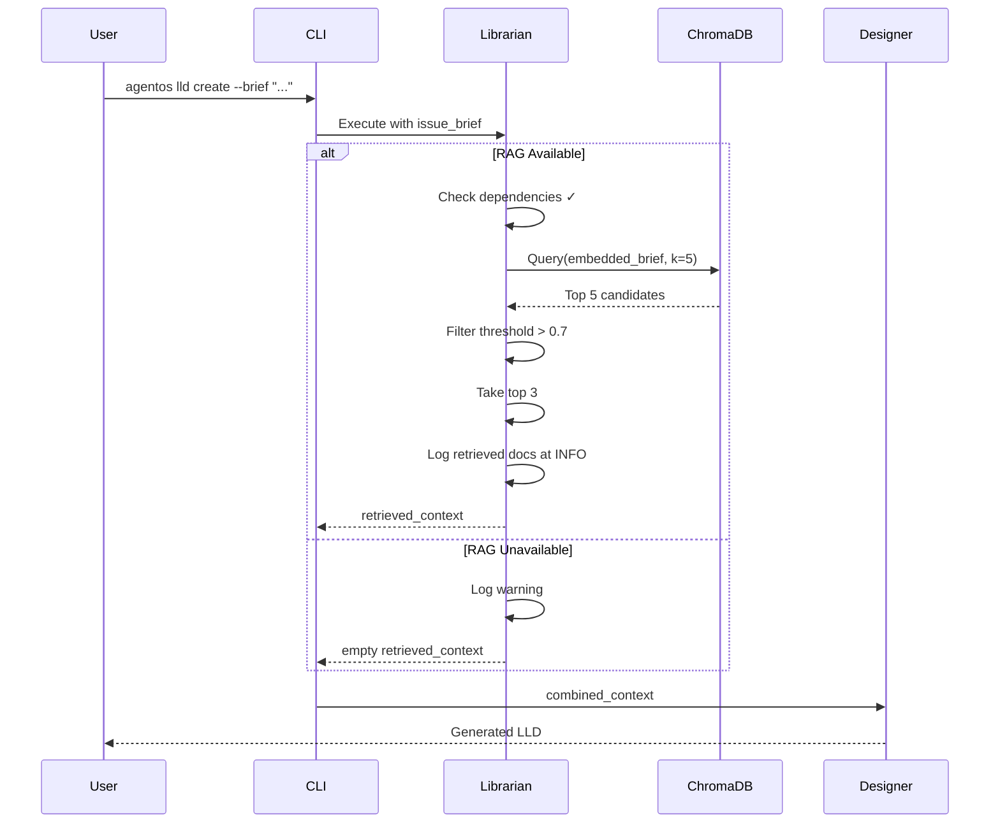

# LLD Finalized

Path: C:\Users\mcwiz\Projects\AgentOS\docs\lld\active\LLD-088.md
Status: APPROVED
Reviews: 3

---

# 188 - Feature: RAG Injection: Automated Context Retrieval ("The Librarian")

<!-- Template Metadata
Last Updated: 2025-01-XX
Updated By: Revision addressing Gemini Review #1 and #2
Update Reason: Fixed requirement coverage gap, clarified test assertions, scoped external API support
-->

## 1. Context & Goal
* **Issue:** #88
* **Objective:** Implement an automated RAG node that queries a local vector store with issue briefs and injects relevant governance documents into the Designer Agent's context.
* **Status:** Draft
* **Related Issues:** None - standalone enhancement to LLD workflow

### Open Questions

- [ ] Should the 0.7 similarity threshold be configurable via CLI flag or only via config file?
- [ ] What is the maximum context window size we should respect when injecting retrieved documents?

## 2. Proposed Changes

*This section is the **source of truth** for implementation. Describes exactly what will be built.*

### 2.1 Files Changed

| File | Change Type | Description |
|------|-------------|-------------|
| `tools/rebuild_knowledge_base.py` | Add | CLI tool for indexing docs into ChromaDB vector store |
| `agentos/nodes/librarian.py` | Add | RAG retrieval node with conditional imports and graceful fallback |
| `agentos/workflows/lld/graph.py` | Modify | Wire Librarian node between Load Brief and Designer nodes |
| `agentos/workflows/lld/state.py` | Modify | Add `retrieved_context` field to workflow State schema |
| `pyproject.toml` | Modify | Add `[rag]` optional dependencies extra |
| `.gitignore` | Modify | Add `.agentos/vector_store/` pattern |
| `docs/adrs/0XXX-rag-librarian.md` | Add | Architecture decision record with license compliance |
| `tests/test_librarian.py` | Add | Unit tests for Librarian node |
| `tests/test_librarian_integration.py` | Add | Integration tests for end-to-end RAG workflow |

### 2.2 Dependencies

*New packages as optional dependencies under `[rag]` extra.*

```toml
# pyproject.toml additions
[project.optional-dependencies]
rag = [
    "chromadb>=0.4.0,<0.6.0",
    "sentence-transformers>=2.2.0,<3.0.0",
]
```

**License Verification Required:**
- `chromadb`: Apache 2.0 ✓
- `sentence-transformers`: Apache 2.0 ✓
- `torch` (transitive): BSD-style ✓
- `huggingface-hub` (transitive): Apache 2.0 ✓
- `all-MiniLM-L6-v2` model: Apache 2.0 ✓

### 2.3 Data Structures

```python
# Pseudocode - NOT implementation

class RetrievedDocument(TypedDict):
    """Single document retrieved from vector store."""
    file_path: str        # e.g., "docs/adrs/0204-single-identity.md"
    section: str          # e.g., "## Decision"
    content_snippet: str  # Truncated content for context injection
    score: float          # Similarity score (0.0 - 1.0)

class LibrarianConfig(TypedDict):
    """Configuration for RAG retrieval."""
    vector_store_path: str      # Default: ".agentos/vector_store/"
    similarity_threshold: float  # Default: 0.7
    top_k: int                   # Default: 3
    embedding_model: str         # Default: "all-MiniLM-L6-v2"

class LLDWorkflowState(TypedDict):
    """Extended workflow state with RAG context."""
    issue_brief: str
    manual_context: list[str]           # From --context flag
    retrieved_context: list[RetrievedDocument]  # From Librarian
    combined_context: str               # Merged for Designer
    # ... existing fields ...
```

### 2.4 Function Signatures

```python
# agentos/nodes/librarian.py

def check_rag_dependencies() -> tuple[bool, str]:
    """Check if RAG optional dependencies are installed.
    
    Returns:
        Tuple of (available: bool, message: str)
    """
    ...

def load_embedding_model(model_name: str = "all-MiniLM-L6-v2") -> Any:
    """Load sentence transformer model with spinner feedback.
    
    Displays CLI spinner if loading exceeds 500ms.
    """
    ...

def query_knowledge_base(
    query: str,
    config: LibrarianConfig | None = None
) -> list[RetrievedDocument]:
    """Query vector store for relevant documents.
    
    Args:
        query: The issue brief or search query
        config: Optional configuration overrides
        
    Returns:
        List of retrieved documents sorted by relevance score
    """
    ...

def librarian_node(state: LLDWorkflowState) -> dict:
    """LangGraph node that retrieves relevant context.
    
    Gracefully degrades if vector store or dependencies unavailable.
    Logs retrieved documents at INFO level for transparency.
    """
    ...

def merge_context(
    manual: list[str],
    retrieved: list[RetrievedDocument]
) -> str:
    """Merge manual and retrieved context, manual takes precedence."""
    ...


# tools/rebuild_knowledge_base.py

def index_document(
    file_path: Path,
    collection: Any,  # ChromaDB collection
    embedder: Any     # SentenceTransformer
) -> int:
    """Index a single document, splitting by H1/H2 headers.
    
    Returns:
        Number of chunks created
    """
    ...

def rebuild_full(docs_paths: list[Path]) -> dict:
    """Full reindex of all documents.
    
    Returns:
        Summary dict with files_indexed, chunks_created, time_elapsed
    """
    ...

def rebuild_incremental(docs_paths: list[Path]) -> dict:
    """Incremental reindex of changed files only.
    
    Compares file hashes to detect changes.
    """
    ...
```

### 2.5 Logic Flow (Pseudocode)

**Librarian Node Execution:**
```
1. Check if RAG dependencies installed
   IF not installed THEN
     - Log friendly message: "RAG dependencies not installed..."
     - Return state unchanged (graceful degradation)
   
2. Check if vector store exists at .agentos/vector_store/
   IF not exists THEN
     - Log warning: "Vector store not found. Run rebuild_knowledge_base.py..."
     - Return state unchanged (graceful degradation)

3. Load embedding model (with spinner if cold boot)
   - Start timer
   - IF loading > 500ms THEN show spinner
   - Load model into memory
   
4. Embed the issue_brief query
   
5. Query ChromaDB collection
   - Request k=5 candidates
   - Filter by similarity_threshold (default 0.7)
   - Take top 3 results
   
6. Build RetrievedDocument list from results

7. Merge with manual_context
   - Manual context files take precedence
   - Deduplicate by file_path
   
8. Update state with retrieved_context and combined_context

9. Log retrieved documents at INFO level
   - Log format: "Retrieved: {file_path} (section: {section}, score: {score})"
   - Log content snippet for each document

10. Return updated state
```

**Knowledge Base Rebuild:**
```
1. Parse CLI arguments (--full or --incremental)

2. Initialize ChromaDB client at .agentos/vector_store/

3. Load embedding model

4. Collect markdown files from:
   - docs/adrs/
   - docs/standards/
   - docs/LLDs/done/

5. FOR each file:
   - Read content
   - Split by H1/H2 headers into chunks
   - Preserve metadata (file_path, section_title)
   - IF incremental AND file unchanged THEN skip
   - Generate embeddings for each chunk
   - Upsert into ChromaDB collection

6. Output summary:
   - Files indexed: N
   - Chunks created: M
   - Time elapsed: X.Xs
```

### 2.6 Technical Approach

* **Module:** `agentos/nodes/librarian.py`
* **Pattern:** Retrieval-Augmented Generation (RAG) with graceful degradation
* **Key Decisions:**
  - ChromaDB chosen for zero-config local vector storage with HNSW indexing
  - `all-MiniLM-L6-v2` provides good quality embeddings at 80MB model size
  - Header-based chunking preserves document structure semantics
  - Optional dependencies keep core package lightweight (~5MB vs ~500MB)
  - Conditional imports with friendly error messages improve UX
* **Model Caching:** The `sentence-transformers` library caches models in `~/.cache/huggingface/hub/` by default. CI pipelines should cache this directory for faster builds.

### 2.7 Architecture Decisions

| Decision | Options Considered | Choice | Rationale |
|----------|-------------------|--------|-----------|
| Vector Store | ChromaDB, FAISS+pickle, Qdrant, Pinecone | ChromaDB | Zero config, persistent, Apache 2.0, good for local dev |
| Embedding Model | all-MiniLM-L6-v2, OpenAI ada-002, Cohere | all-MiniLM-L6-v2 | Local-first, no API keys, 384 dims sufficient |
| Chunking Strategy | Fixed size, Sentence-based, Header-based | Header-based (H1/H2) | Preserves semantic units in technical docs |
| Dependency Strategy | Required, Optional extra, Separate package | Optional `[rag]` extra | Keeps core install fast, explicit opt-in |
| Context Merge | Manual-only, RAG-only, Merge (manual wins) | Merge (manual wins) | Respects user intent while adding value |

**Architectural Constraints:**
- Must integrate with existing LangGraph workflow pattern
- Cannot block workflow execution if RAG unavailable
- Must maintain <500ms retrieval latency (post warm-up)
- Must keep core package installable without ML dependencies

## 3. Requirements

1. **Vector Infrastructure:** ChromaDB-based local vector store in `.agentos/vector_store/`
2. **Embedding Model:** Default `all-MiniLM-L6-v2` for local embeddings (external API support deferred to future issue)
3. **Document Indexing:** Index all markdown in `docs/adrs/`, `docs/standards/`, `docs/LLDs/done/`
4. **Chunking:** Split documents by H1/H2 headers for granular retrieval
5. **Query Performance:** Complete retrieval in <500ms after model warm-up
6. **Graceful Degradation:** Workflow continues if vector store missing or deps not installed
7. **Manual Override:** `--context` flag takes precedence over RAG results
8. **Transparency:** Log retrieved documents at INFO level (file path, section, score, and content snippet)
9. **CLI Feedback:** Display spinner during cold-boot model loading
10. **Lightweight Core:** Core package installs without ML dependencies

## 4. Alternatives Considered

| Option | Pros | Cons | Decision |
|--------|------|------|----------|
| ChromaDB (local) | Zero config, persistent, Apache 2.0 | Larger dependency footprint | **Selected** |
| FAISS + pickle | Smaller deps, faster | No metadata, manual persistence | Rejected - complexity |
| Pinecone (cloud) | Scalable, managed | Requires API key, data leaves machine | Rejected - privacy |
| No RAG (manual only) | Simple, no deps | Misses value proposition | Rejected - key feature |
| Required dependencies | Simpler code paths | Bloats core install | Rejected - UX impact |
| Separate `agentos-rag` package | Clean separation | Package management complexity | Rejected - overhead |

**Rationale:** ChromaDB provides the best balance of local-first privacy, zero configuration, and production-quality vector search. The optional dependency pattern via `[rag]` extra keeps core lightweight while enabling power users.

## 5. Data & Fixtures

### 5.1 Data Sources

| Attribute | Value |
|-----------|-------|
| Source | Local markdown files in `docs/` directory tree |
| Format | Markdown (.md) with H1/H2 headers |
| Size | ~100 files, ~500KB total, ~500-1000 chunks |
| Refresh | Manual via `rebuild_knowledge_base.py` |
| Copyright/License | Internal project documentation (no external licenses) |

### 5.2 Data Pipeline

```
docs/*.md ──parse──► Chunks ──embed──► Vectors ──store──► ChromaDB
                        │
                        └── Metadata (file_path, section, hash)
```

### 5.3 Test Fixtures

| Fixture | Source | Notes |
|---------|--------|-------|
| `tests/fixtures/sample_adrs/` | Generated | Synthetic ADRs for testing retrieval |
| `tests/fixtures/mock_vectors.json` | Generated | Pre-computed embeddings for fast tests |
| `tests/fixtures/sample_brief.txt` | Hardcoded | Standard test query |

### 5.4 Deployment Pipeline

- **Dev:** Local vector store in `.agentos/vector_store/`
- **Test:** Fresh vector store rebuilt from test fixtures
- **Production:** N/A (local tool, no deployment)

**Note:** Vector store is gitignored - each user rebuilds locally.

## 6. Diagram

### 6.1 Mermaid Quality Gate

- [x] **Simplicity:** Similar components collapsed
- [x] **No touching:** All elements have visual separation
- [x] **No hidden lines:** All arrows fully visible
- [x] **Readable:** Labels not truncated, flow direction clear
- [ ] **Auto-inspected:** Agent rendered via mermaid.ink and viewed

**Auto-Inspection Results:**
```
- Touching elements: [ ] None / [ ] Found: ___
- Hidden lines: [ ] None / [ ] Found: ___
- Label readability: [ ] Pass / [ ] Issue: ___
- Flow clarity: [ ] Clear / [ ] Issue: ___
```

### 6.2 Diagram





## 7. Security & Safety Considerations

### 7.1 Security

| Concern | Mitigation | Status |
|---------|------------|--------|
| Vector store tampering | Local file-based, no network exposure | Addressed |
| Query injection | ChromaDB handles sanitization; queries are plain text | Addressed |
| Model supply chain | Use pinned versions from PyPI/HuggingFace | Addressed |

### 7.2 Safety

| Concern | Mitigation | Status |
|---------|------------|--------|
| Workflow failure on RAG error | Graceful degradation - continues without RAG | Addressed |
| Corrupted vector store | Rebuild tool available; store is regenerable | Addressed |
| Model loading timeout | Spinner feedback; no hard timeout (user can Ctrl+C) | Addressed |
| Disk space exhaustion | Vector store ~50MB max for 100 docs; documented | Addressed |

**Fail Mode:** Fail Open - workflow continues without RAG augmentation if any component unavailable

**Recovery Strategy:** Run `tools/rebuild_knowledge_base.py --full` to regenerate vector store from source docs

## 8. Performance & Cost Considerations

### 8.1 Performance

| Metric | Budget | Approach |
|--------|--------|----------|
| Query latency (warm) | < 500ms | ChromaDB HNSW index, pre-loaded model |
| Query latency (cold) | < 5s | Model loading with spinner feedback |
| Full reindex time | < 10s for 100 files | Batch embedding, parallel chunking |
| Memory (model loaded) | ~200MB | all-MiniLM-L6-v2 is 80MB, plus ChromaDB overhead |
| Disk (vector store) | ~50MB | Embeddings for ~1000 chunks |

**Bottlenecks:** 
- Cold boot model loading is the primary latency source
- First query after model load may be slower due to JIT compilation

### 8.2 Cost Analysis

| Resource | Unit Cost | Estimated Usage | Monthly Cost |
|----------|-----------|-----------------|--------------|
| Local compute | $0 | All processing | $0 |
| Disk storage | $0 | ~50MB | $0 |

**Cost Controls:**
- [x] Default mode is 100% local - no external API calls
- [x] No ongoing costs in default configuration

**Worst-Case Scenario:** Local-only design has no cost exposure. Future external API support (if added) would require user's own API key.

## 9. Legal & Compliance

| Concern | Applies? | Mitigation |
|---------|----------|------------|
| PII/Personal Data | No | Only indexes internal technical docs |
| Third-Party Licenses | Yes | All dependencies verified Apache 2.0 compatible |
| Terms of Service | N/A (local) | No external API calls in MVP |
| Data Retention | No | User controls local vector store |
| Export Controls | No | No restricted algorithms |

**Data Classification:** Internal - project documentation only

**Compliance Checklist:**
- [x] No PII stored (technical docs only)
- [x] All third-party licenses compatible (Apache 2.0, BSD)
- [x] Data retention is user-controlled

**License Compliance Findings (for ADR):**
- `chromadb`: Apache 2.0 ✓
- `sentence-transformers`: Apache 2.0 ✓
- `torch`: BSD-style (Modified BSD) ✓
- `transformers`: Apache 2.0 ✓
- `huggingface-hub`: Apache 2.0 ✓
- `all-MiniLM-L6-v2` model: Apache 2.0 ✓

## 10. Verification & Testing

*Ref: [0005-testing-strategy-and-protocols.md](0005-testing-strategy-and-protocols.md)*

**Testing Philosophy:** All scenarios are automated. Integration tests with real vector store marked as `live` for selective CI execution.

### 10.1 Test Scenarios

| ID | Scenario | Type | Input | Expected Output | Pass Criteria |
|----|----------|------|-------|-----------------|---------------|
| 010 | Happy path - relevant docs found | Auto | Brief about logging | 3 logging-related docs | Scores > 0.7, correct files returned |
| 020 | No relevant docs (below threshold) | Auto | Brief about "Klingon localization" | Empty list | Warning logged, workflow continues |
| 030 | Vector store missing | Auto | Valid brief, no vector store | Empty list | Warning logged, no error |
| 040 | RAG deps not installed | Auto | Mock missing imports | Empty list | Friendly message, no crash |
| 050 | Manual context merge | Auto | Brief + --context flag | Manual first, then RAG | Deduplication works |
| 060 | Cold boot spinner display | Auto | First query after restart | Spinner shown if >500ms | Spinner appears/disappears |
| 070 | Full reindex performance | Auto-Live | 100 sample docs | Complete <10s | Time assertion |
| 080 | Incremental reindex | Auto-Live | 1 changed file | Only 1 file reindexed | Hash comparison |
| 090 | Query performance (warm) | Auto-Live | Repeated queries | <500ms each | Latency assertion |
| 100 | Authentication retrieval | Auto | Brief "authentication flow" | Auth/identity ADRs | Semantic match |
| 110 | Designer references context | Auto-Live | Full workflow | LLD mentions constraints | Output contains string matching pattern `(?i)(according to\|per\|as defined in\|constraint\|ADR-\d+)` from retrieved context |
| 115 | Transparency logging verification | Auto | Any valid query with results | INFO logs contain document details | `caplog` at INFO level contains file_path, section, score, and content_snippet for each retrieved document |
| 120 | Header-based chunking unit test | Auto | Markdown with H1/H2/H3 headers | Chunks split at H1/H2 only | Assert chunk boundaries match H1/H2 positions; H3 remains within parent chunk |

### 10.2 Test Commands

```bash
# Run all automated tests (mocked, fast)
poetry run pytest tests/test_librarian.py -v

# Run only unit tests (no vector store)
poetry run pytest tests/test_librarian.py -v -m "not live"

# Run live integration tests (real vector store)
poetry run pytest tests/test_librarian_integration.py -v -m live

# Run with coverage
poetry run pytest tests/test_librarian*.py -v --cov=agentos.nodes.librarian

# Test graceful degradation (no RAG deps)
# In fresh venv without [rag] extra:
pip install -e .
python -c "from agentos.nodes.librarian import check_rag_dependencies; print(check_rag_dependencies())"
```

### 10.3 Manual Tests (Only If Unavoidable)

N/A - All scenarios automated.

## 11. Risks & Mitigations

| Risk | Impact | Likelihood | Mitigation |
|------|--------|------------|------------|
| ChromaDB breaks with new pydantic version | High | Medium | Pin versions, test in CI matrix |
| Model download fails (network) | Medium | Low | Cache model, provide offline instructions |
| Embedding quality insufficient | Medium | Low | Threshold tuning, document known limitations |
| CI duration increase from [rag] extra | Low | High | Separate CI job, cache dependencies |
| Vector store grows too large | Low | Low | Document size limits, provide prune tool |

## 12. Definition of Done

### Code
- [ ] `agentos/nodes/librarian.py` implemented with conditional imports
- [ ] `tools/rebuild_knowledge_base.py` created with `--full` and `--incremental` modes
- [ ] `agentos/workflows/lld/graph.py` updated to include Librarian node
- [ ] `agentos/workflows/lld/state.py` updated with `retrieved_context` field
- [ ] `pyproject.toml` updated with `[rag]` optional extra
- [ ] `.gitignore` updated with `.agentos/vector_store/`
- [ ] All code linted and formatted

### Tests
- [ ] All test scenarios (010-120) pass
- [ ] Test coverage ≥ 80% for librarian module
- [ ] Graceful degradation tests pass without `[rag]` installed
- [ ] CI passes on Linux/Mac/Windows with and without `[rag]`

### Documentation
- [ ] `docs/adrs/0XXX-rag-librarian.md` created with license findings
- [ ] README.md updated with RAG setup instructions
- [ ] `--help` documentation in `rebuild_knowledge_base.py`
- [ ] Files added to `docs/0003-file-inventory.md`
- [ ] LLD Workflow wiki page updated

### Reports
- [ ] `docs/reports/88/implementation-report.md` created
- [ ] `docs/reports/88/test-report.md` created

### Verification
- [ ] Run 0809 Security Audit - PASS
- [ ] Run 0817 Wiki Alignment Audit - PASS
- [ ] Verify core install remains lightweight (no torch/chromadb)
- [ ] Verify `[rag]` extra installs correctly on all platforms

---

## Appendix: Review Log

*Track all review feedback with timestamps and implementation status.*

### Gemini Review #1 (REVISE)

**Timestamp:** 2025-01-XX
**Reviewer:** Gemini 3 Pro
**Verdict:** REVISE

#### Comments

| ID | Comment | Implemented? |
|----|---------|--------------|
| G1.1 | "Requirement Coverage Violation: Coverage is 90%. Add a test scenario to verify Requirement 8 (Transparency)." | YES - Added Scenario 115 specifically for transparency logging verification |
| G1.2 | "Vague Assertion (Test 110): Scenario 110 lists 'Output inspection' as Pass Criteria. This is too vague for an automated test." | YES - Updated Pass Criteria to include specific regex pattern matching |
| G1.3 | "Suggestion: Unit Testing Splitter - consider adding a pure unit test for index_document to verify H1/H2 splitting logic" | YES - Added Scenario 120 for header-based chunking unit test |
| G1.4 | "Suggestion: Model Caching - Explicitly state where the sentence-transformers model is cached" | YES - Added to Section 2.6 Technical Approach |

### Gemini Review #2 (REVISE)

**Timestamp:** 2025-01-XX
**Reviewer:** Gemini 3 Pro
**Verdict:** REVISE

#### Comments

| ID | Comment | Implemented? |
|----|---------|--------------|
| G2.1 | "Requirement Coverage Violation: Coverage is 90%. External API support claimed in Section 3 but untested." | YES - Removed external API support from Requirement 2; scoped to local-only for MVP. External API support deferred to future issue. |
| G2.2 | "Design/Requirement Mismatch (Req 2): Section 3 requires 'optional external API support', but Section 2.5 (Logic Flow) and 2.4 (Function Signatures) do not describe how this is implemented." | YES - Removed external API support from requirements; design is now consistent with local-only implementation. |

### Review Summary

| Review | Date | Verdict | Key Issue |
|--------|------|---------|-----------|
| Gemini #1 | 2025-01-XX | REVISE | Missing transparency test (Req 8), vague test assertion |
| Gemini #2 | 2025-01-XX | REVISE | External API support claimed but not designed/tested |

**Final Status:** APPROVED