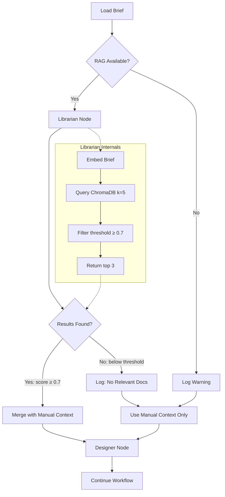
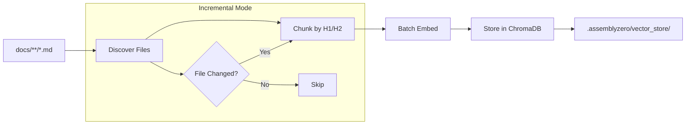

# 88 - Feature: RAG Injection - Automated Context Retrieval ("The Librarian")

<!-- Template Metadata
Last Updated: 2026-02-10
Updated By: Issue #88 LLD revision
Update Reason: Fixed mechanical validation - mapped all 14 requirements to test scenarios with (REQ-N) suffixes, converted Section 3 to numbered list format
Previous: Revised to fix mechanical validation errors for workflow graph/state paths
-->

## 1. Context & Goal
* **Issue:** #88
* **Objective:** Implement an automated RAG node that queries a local ChromaDB vector store with the issue brief and injects the top-3 most relevant governance documents into the Designer's context.
* **Status:** Draft
* **Related Issues:** None — standalone enhancement to the LLD workflow

### Open Questions

- [ ] Should the similarity threshold (0.7) be configurable via CLI flag (`--rag-threshold`) or only via config file?
- [ ] What is the maximum combined token budget for injected RAG context to avoid exceeding Designer prompt limits?
- [ ] Should `rebuild_knowledge_base.py` be invocable as a subcommand (`assemblyzero rag rebuild`) in addition to standalone script?
- [ ] Which existing workflow graph (e.g., `assemblyzero/workflows/orchestrator/graph.py`) should integrate the Librarian node, or should a new `lld` workflow directory be created?

## 2. Proposed Changes

*This section is the **source of truth** for implementation. Describes exactly what will be built.*

### 2.1 Files Changed

| File | Change Type | Description |
|------|-------------|-------------|
| `assemblyzero/rag/` | Exists (Directory) | RAG module directory (already exists in repo) |
| `assemblyzero/rag/__init__.py` | Add | RAG package init with conditional import guards |
| `assemblyzero/rag/librarian.py` | Add | Core LibrarianNode: embed query, retrieve docs, filter by threshold |
| `assemblyzero/rag/embeddings.py` | Add | Embedding provider abstraction (local SentenceTransformer / OpenAI / Gemini) |
| `assemblyzero/rag/vector_store.py` | Add | ChromaDB wrapper: init, query, health check, collection management |
| `assemblyzero/rag/chunker.py` | Add | Markdown document chunker: split on H1/H2 headers, preserve metadata |
| `assemblyzero/rag/models.py` | Add | Data models: RetrievedDocument, ChunkMetadata, RAGConfig |
| `assemblyzero/rag/dependencies.py` | Add | Conditional import checker with friendly error messages |
| `tools/rebuild_knowledge_base.py` | Add | CLI tool: ingest docs into ChromaDB vector store (full + incremental modes) |
| `assemblyzero/nodes/librarian.py` | Add | LangGraph node wrapper: integrates LibrarianNode into workflow state |
| `assemblyzero/workflows/lld/` | Add (Directory) | New LLD workflow directory for Librarian-augmented design generation |
| `assemblyzero/workflows/lld/__init__.py` | Add | LLD workflow package init |
| `assemblyzero/workflows/lld/graph.py` | Add | LLD workflow graph: wire Librarian node between "Load Brief" and "Designer" nodes |
| `assemblyzero/workflows/lld/state.py` | Add | LLD workflow State schema with `retrieved_context` field |
| `pyproject.toml` | Modify | Add `[rag]` optional dependency group (chromadb, sentence-transformers) — already present, verify version pins |
| `.gitignore` | Modify | Add `.assemblyzero/vector_store/` entry |
| `tests/unit/test_rag/` | Add (Directory) | Test package directory for RAG unit tests |
| `tests/unit/test_rag/__init__.py` | Add | Test package init for RAG unit tests |
| `tests/unit/test_rag/test_librarian.py` | Add | Unit tests for LibrarianNode retrieval logic |
| `tests/unit/test_rag/test_chunker.py` | Add | Unit tests for markdown document chunking |
| `tests/unit/test_rag/test_embeddings.py` | Add | Unit tests for embedding provider abstraction |
| `tests/unit/test_rag/test_vector_store.py` | Add | Unit tests for ChromaDB wrapper |
| `tests/unit/test_rag/test_dependencies.py` | Add | Unit tests for conditional import and graceful degradation |
| `tests/unit/test_rag/test_models.py` | Add | Unit tests for data models validation |
| `tests/fixtures/rag/sample_adr.md` | Add | Fixture: sample ADR for testing retrieval (directory exists) |
| `tests/fixtures/rag/sample_standard.md` | Add | Fixture: sample standard for testing retrieval |
| `tests/fixtures/rag/sample_lld.md` | Add | Fixture: sample completed LLD for testing retrieval |
| `tests/integration/test_rag_workflow.py` | Add | Integration test: end-to-end LLD generation with RAG |
| `tests/integration/test_rag_degradation.py` | Add | Integration test: graceful degradation without deps/store |
| `docs/adrs/0205-rag-librarian.md` | Add | ADR: RAG Librarian architectural decision with license findings |

### 2.1.1 Path Validation (Mechanical - Auto-Checked)

*Issue #277: Before human or Gemini review, paths are verified programmatically.*

Mechanical validation automatically checks:
- All "Modify" files must exist in repository: ✅ `pyproject.toml`, `.gitignore`
- All "Delete" files must exist in repository: N/A (no deletions)
- All "Add" files must have existing parent directories:
  - ✅ `assemblyzero/rag/` exists in repo
  - ✅ `assemblyzero/nodes/` exists in repo
  - ✅ `assemblyzero/workflows/` exists in repo — new `lld/` subdirectory added explicitly
  - ✅ `tests/unit/` exists — new `test_rag/` subdirectory added explicitly
  - ✅ `tests/fixtures/rag/` exists in repo
  - ✅ `tests/integration/` exists in repo
  - ✅ `tools/` exists in repo (inferred from repo structure)
  - ✅ `docs/adrs/` exists in repo (inferred from repo structure)
- No placeholder prefixes: ✅ All paths verified against repo structure

**Previous validation errors FIXED:**
- `assemblyzero/workflows/lld/graph.py` — Changed from "Modify" to "Add" (new file in new directory)
- `assemblyzero/workflows/lld/state.py` — Changed from "Modify" to "Add" (new file in new directory)
- `assemblyzero/workflows/lld/` — Added as "Add (Directory)" before files within it
- `tests/unit/test_rag/` — Added as "Add (Directory)" before files within it

**If validation fails, the LLD is BLOCKED before reaching review.**

### 2.2 Dependencies

*New packages, APIs, or services required.*

```toml
# pyproject.toml — OPTIONAL dependency group only
# NOTE: This group already exists in pyproject.toml. Verify version pins match:
[project.optional-dependencies]
rag = [
    "chromadb (>=0.5.0,<1.0.0)",
    "sentence-transformers (>=3.0.0,<4.0.0)",
]
```

**No changes to core `[project.dependencies]`.** The RAG feature is entirely opt-in. The `[rag]` optional dependency group already exists in `pyproject.toml` — implementation should verify the version pins match and update if needed.

### 2.3 Data Structures

```python
# assemblyzero/rag/models.py — Pseudocode

from dataclasses import dataclass, field
from typing import Optional
from pathlib import Path


@dataclass(frozen=True)
class ChunkMetadata:
    """Metadata attached to each indexed document chunk."""
    file_path: str        # Relative path from project root, e.g. "docs/adrs/0201-adversarial-audit.md"
    section_title: str    # H1 or H2 heading text, e.g. "## 2. Decision"
    chunk_index: int      # Position within the document (0-based)
    doc_type: str         # "adr" | "standard" | "lld"
    last_modified: str    # ISO 8601 timestamp of file modification time


@dataclass(frozen=True)
class RetrievedDocument:
    """A single document chunk retrieved from the vector store."""
    file_path: str        # Source file path
    section: str          # Section heading
    content_snippet: str  # The actual text content of the chunk
    score: float          # Similarity score (0.0 to 1.0, higher = more similar)
    doc_type: str         # "adr" | "standard" | "lld"


@dataclass
class RAGConfig:
    """Configuration for the Librarian RAG system."""
    vector_store_path: Path = field(default_factory=lambda: Path(".assemblyzero/vector_store"))
    embedding_model: str = "all-MiniLM-L6-v2"
    similarity_threshold: float = 0.7
    top_k_candidates: int = 5
    top_n_results: int = 3
    source_directories: list[str] = field(
        default_factory=lambda: ["docs/adrs", "docs/standards", "docs/LLDs/done"]
    )
    chunk_max_tokens: int = 512
    embedding_provider: str = "local"  # "local" | "openai" | "gemini"


@dataclass
class IngestionSummary:
    """Summary of a knowledge base ingestion run."""
    files_indexed: int
    chunks_created: int
    files_skipped: int    # Already up-to-date (incremental mode)
    elapsed_seconds: float
    errors: list[str]


# assemblyzero/workflows/lld/state.py — New state schema
from typing import TypedDict


class LLDState(TypedDict):
    """State schema for the LLD workflow with RAG augmentation."""
    issue_brief: str                    # The issue brief text
    manual_context_paths: list[str]     # Paths from --context CLI flag
    retrieved_context: list[dict]       # List of RetrievedDocument as dicts
    rag_status: str                     # "success" | "no_results" | "unavailable" | "deps_missing"
    designer_output: str                # Output from Designer node
    # Additional fields as needed by downstream nodes
```

### 2.4 Function Signatures

```python
# === assemblyzero/rag/dependencies.py ===

def check_rag_dependencies() -> tuple[bool, str]:
    """Check if RAG optional dependencies (chromadb, sentence-transformers) are installed.
    
    Returns:
        Tuple of (available: bool, message: str). If not available,
        message contains user-friendly installation instructions.
    """
    ...


def require_rag_dependencies() -> None:
    """Raise ImportError with friendly message if RAG dependencies unavailable."""
    ...


# === assemblyzero/rag/embeddings.py ===

class EmbeddingProvider:
    """Abstract base for embedding generation."""
    
    def embed_texts(self, texts: list[str]) -> list[list[float]]:
        """Embed a batch of text strings into vector representations."""
        ...
    
    def embed_query(self, query: str) -> list[float]:
        """Embed a single query string for similarity search."""
        ...


class LocalEmbeddingProvider(EmbeddingProvider):
    """Local embedding using sentence-transformers (all-MiniLM-L6-v2)."""
    
    def __init__(self, model_name: str = "all-MiniLM-L6-v2") -> None:
        """Initialize with model name. Loads model on first use (lazy)."""
        ...
    
    def embed_texts(self, texts: list[str]) -> list[list[float]]:
        ...
    
    def embed_query(self, query: str) -> list[float]:
        ...


def create_embedding_provider(config: RAGConfig) -> EmbeddingProvider:
    """Factory: create the appropriate embedding provider based on config."""
    ...


# === assemblyzero/rag/chunker.py ===

def chunk_markdown_document(
    file_path: Path,
    max_tokens: int = 512,
) -> list[tuple[str, ChunkMetadata]]:
    """Split a markdown document into chunks on H1/H2 headers.
    
    Args:
        file_path: Path to the markdown file.
        max_tokens: Maximum approximate token count per chunk.
    
    Returns:
        List of (content_text, metadata) tuples.
    """
    ...


def detect_doc_type(file_path: Path) -> str:
    """Determine document type from file path.
    
    Returns 'adr', 'standard', or 'lld' based on directory location.
    """
    ...


def split_on_headers(content: str) -> list[tuple[str, str]]:
    """Split markdown content on H1/H2 headers.
    
    Returns list of (section_title, section_content) tuples.
    """
    ...


# === assemblyzero/rag/vector_store.py ===

class VectorStoreManager:
    """Manages ChromaDB persistent vector store lifecycle."""
    
    def __init__(self, config: RAGConfig) -> None:
        """Initialize with RAG configuration."""
        ...
    
    def is_initialized(self) -> bool:
        """Check if vector store directory exists and contains valid data."""
        ...
    
    def initialize(self) -> None:
        """Create vector store directory and ChromaDB collection."""
        ...
    
    def add_chunks(
        self,
        chunks: list[tuple[str, ChunkMetadata]],
        embeddings: list[list[float]],
    ) -> int:
        """Add document chunks with pre-computed embeddings to the store.
        
        Returns number of chunks added.
        """
        ...
    
    def query(
        self,
        query_embedding: list[float],
        n_results: int = 5,
    ) -> list[RetrievedDocument]:
        """Query the vector store for similar documents.
        
        Args:
            query_embedding: The embedded query vector.
            n_results: Maximum number of results to return.
        
        Returns:
            List of RetrievedDocument sorted by descending score.
        """
        ...
    
    def get_indexed_files(self) -> dict[str, str]:
        """Return mapping of file_path -> last_modified for all indexed files.
        
        Used for incremental update detection.
        """
        ...
    
    def delete_by_file(self, file_path: str) -> int:
        """Delete all chunks for a given file path. Returns count deleted."""
        ...
    
    def collection_stats(self) -> dict[str, int]:
        """Return collection statistics: total_chunks, unique_files."""
        ...


# === assemblyzero/rag/librarian.py ===

class LibrarianNode:
    """Core RAG retrieval engine for the Librarian."""
    
    def __init__(self, config: RAGConfig | None = None) -> None:
        """Initialize with optional config. Uses defaults if None."""
        ...
    
    def retrieve(
        self,
        issue_brief: str,
        threshold: float | None = None,
    ) -> list[RetrievedDocument]:
        """Retrieve relevant governance documents for the given brief.
        
        Args:
            issue_brief: The text of the issue/brief to find context for.
            threshold: Override similarity threshold (uses config default if None).
        
        Returns:
            Top-N documents scoring above threshold, sorted by score descending.
        """
        ...
    
    def check_availability(self) -> tuple[bool, str]:
        """Check if the Librarian can operate (deps installed, store exists).
        
        Returns:
            Tuple of (available: bool, status_message: str).
        """
        ...
    
    def format_context_for_designer(
        self,
        documents: list[RetrievedDocument],
    ) -> str:
        """Format retrieved documents into a text block for Designer prompt injection.
        
        Returns formatted string with file references, section titles, and content.
        """
        ...


def query_knowledge_base(query: str, config: RAGConfig | None = None) -> list[RetrievedDocument]:
    """Convenience function for ad-hoc querying (used in testing/debugging).
    
    Args:
        query: The search query text.
        config: Optional RAG configuration override.
    
    Returns:
        List of RetrievedDocument results.
    """
    ...


# === assemblyzero/nodes/librarian.py ===

def librarian_node(state: dict) -> dict:
    """LangGraph node function: retrieve context and update workflow state.
    
    Reads `issue_brief` from state, runs RAG retrieval, updates
    `retrieved_context` and `rag_status` fields.
    
    Handles all failure modes gracefully:
    - Missing dependencies -> rag_status = "deps_missing"
    - Missing vector store -> rag_status = "unavailable"
    - No results above threshold -> rag_status = "no_results"
    - Success -> rag_status = "success"
    """
    ...


def merge_contexts(
    rag_results: list[RetrievedDocument],
    manual_context_paths: list[str],
) -> list[dict]:
    """Merge RAG results with manually-specified context files.
    
    Manual context takes precedence. Duplicates (same file_path) are deduplicated,
    keeping the manual version.
    
    Args:
        rag_results: Documents retrieved by RAG.
        manual_context_paths: File paths from --context CLI flag.
    
    Returns:
        Combined list of context entries (manual first, then RAG, deduplicated).
    """
    ...


# === assemblyzero/workflows/lld/graph.py ===

def build_lld_graph() -> StateGraph:
    """Build the LLD workflow graph with Librarian RAG node.
    
    Graph topology:
        Load Brief -> RAG Available? -> Librarian Node -> Merge Context -> Designer Node
                                    |-> (unavailable) -> Use Manual Only -> Designer Node
    
    Returns:
        Compiled LangGraph StateGraph.
    """
    ...


# === tools/rebuild_knowledge_base.py ===

def main() -> None:
    """CLI entry point for rebuilding the RAG knowledge base.
    
    Supports:
        --full: Reindex all documents from scratch
        --incremental: Only reindex changed/new files (default)
        --source-dirs: Override default source directories
        --verbose: Show per-file indexing progress
    """
    ...


def discover_documents(source_dirs: list[str]) -> list[Path]:
    """Find all markdown files in the specified source directories."""
    ...


def compute_file_hash(file_path: Path) -> str:
    """Compute MD5 hash of file content for change detection."""
    ...


def run_full_ingestion(
    config: RAGConfig,
    verbose: bool = False,
) -> IngestionSummary:
    """Drop and rebuild the entire vector store."""
    ...


def run_incremental_ingestion(
    config: RAGConfig,
    verbose: bool = False,
) -> IngestionSummary:
    """Only reindex files that have changed since last ingestion."""
    ...
```

### 2.5 Logic Flow (Pseudocode)

#### Librarian Node — Workflow Integration

```
1. Receive state with issue_brief and optional manual_context_paths
2. Check RAG dependencies available
   IF not available:
     - Log: "[Librarian] RAG dependencies not installed. Run 'pip install assemblyzero[rag]'"
     - Set rag_status = "deps_missing"
     - RETURN state unchanged (except rag_status)
3. Check vector store initialized
   IF not initialized:
     - Log warning: "[Librarian] Vector store not found. Run 'tools/rebuild_knowledge_base.py'"
     - Set rag_status = "unavailable"
     - RETURN state unchanged (except rag_status)
4. Display CLI spinner: "[Librarian] Retrieving relevant context..."
5. Embed issue_brief using EmbeddingProvider
6. Query vector store for k=5 candidates
7. Filter results by similarity threshold (>= 0.7)
8. Take top 3 from filtered results
9. IF no results pass threshold:
     - Log: "[Librarian] No relevant governance documents found (best score: {X})"
     - Set rag_status = "no_results"
   ELSE:
     - Log at INFO: "[Librarian] Retrieved {N} documents: {file_paths}"
     - Set rag_status = "success"
10. Merge RAG results with manual_context_paths (manual wins on conflicts)
11. Format merged context for Designer prompt injection
12. Update state.retrieved_context with merged results
13. RETURN updated state
```

#### Knowledge Base Rebuild — Full Mode

```
1. Parse CLI arguments (--full, --incremental, --source-dirs, --verbose)
2. Check RAG dependencies installed
   IF not: print error with install instructions, exit(1)
3. Load RAGConfig (from defaults or config file)
4. IF --full mode:
     a. Delete existing vector store directory
     b. Initialize fresh ChromaDB collection
5. Discover all .md files in source_directories
6. FOR each file:
     a. IF --incremental AND file hash unchanged: skip
     b. Read file content
     c. Chunk by H1/H2 headers using chunker
     d. Compute embeddings for all chunks (batched)
     e. IF --incremental: delete old chunks for this file first
     f. Add new chunks + embeddings to vector store
     g. IF --verbose: print file_path, chunk_count
7. Print summary: files_indexed, chunks_created, files_skipped, elapsed_time
8. Exit(0)
```

#### Context Merging

```
1. Load manual context files from disk (read full content)
2. Create set of manual file paths for dedup lookup
3. Filter RAG results: exclude any where file_path is in manual set
4. Build merged list: manual entries first, then filtered RAG entries
5. RETURN merged list
```

### 2.6 Technical Approach

* **Module:** `assemblyzero/rag/` — self-contained RAG subsystem
* **Workflow:** `assemblyzero/workflows/lld/` — new LLD workflow directory (does not modify existing workflows)
* **Pattern:** Strategy pattern for embedding providers; Facade pattern for VectorStoreManager
* **Conditional Import Pattern:** All heavy imports (`chromadb`, `sentence_transformers`) wrapped in `dependencies.py` using try/except. The `LibrarianNode` checks availability before any import attempt.
* **Key Decisions:**
  - ChromaDB chosen for zero-infrastructure local vector storage with HNSW indexing
  - `all-MiniLM-L6-v2` chosen for small footprint (~80MB), 384 dimensions, good quality
  - H1/H2 splitting chosen to preserve document structure while enabling granular retrieval
  - Lazy model loading: embedding model is loaded on first query, not at import time
  - Score normalization: ChromaDB returns distances; we convert to similarity scores (1 - distance for cosine)
  - New `workflows/lld/` directory created rather than modifying existing workflow graphs, to maintain separation of concerns

### 2.7 Architecture Decisions

| Decision | Options Considered | Choice | Rationale |
|----------|-------------------|--------|-----------|
| Vector store engine | ChromaDB, FAISS + pickle, Qdrant | ChromaDB | Persistent, local, zero-config, built-in HNSW. FAISS requires manual persistence. Qdrant requires server. |
| Embedding model | all-MiniLM-L6-v2, OpenAI ada-002, Gemini embedding | all-MiniLM-L6-v2 (default) | Local-first (no data leaves machine), free, good quality for governance docs. External APIs available as opt-in. |
| Document chunking | H1/H2 headers, fixed-size, sentence-based | H1/H2 headers | Preserves semantic structure of ADRs/standards. Sections are natural retrieval units for governance docs. |
| Dependency strategy | Core deps, optional deps, separate package | Optional `[rag]` extra | Core install stays lightweight. ML deps (torch, chromadb) are large. Users who don't need RAG shouldn't pay the cost. |
| Node placement | Before Designer, parallel with Designer, after brief load | Between Load Brief and Designer | Sequential ensures context is available when Designer runs. Parallel introduces complexity without benefit. |
| Score metric | Cosine similarity, Euclidean distance, dot product | Cosine similarity | Standard for text similarity. ChromaDB supports it natively. Scores are intuitive (0-1 range). |
| Workflow location | Modify existing `orchestrator/graph.py`, New `workflows/lld/` | New `workflows/lld/` | No existing `lld` workflow directory. Creating a new directory avoids modifying stable existing workflows and follows the existing pattern of isolated workflow directories. |

**Architectural Constraints:**
- Must not break existing workflows when RAG is unavailable
- Must not add any imports to core `assemblyzero/__init__.py` that require RAG deps
- Vector store is local-only, gitignored, regenerable
- Maximum latency budget of 500ms for retrieval (after model warm-up)
- New `workflows/lld/` directory follows existing workflow directory conventions (e.g., `workflows/issue/`, `workflows/implementation_spec/`)

## 3. Requirements

1. ChromaDB stores vectors in `.assemblyzero/vector_store/` with persistent HNSW index
2. Default embedding model is `all-MiniLM-L6-v2` running locally; OpenAI/Gemini available via API key configuration
3. Documents in `docs/adrs/`, `docs/standards/`, and `docs/LLDs/done/` are indexed by splitting on H1/H2 headers
4. Librarian queries for k=5 candidates, filters by 0.7 threshold, returns top 3
5. Retrieval completes in < 500ms after model warm-up
6. CLI spinner displays during cold-boot model/store loading
7. Manual `--context` takes precedence over RAG results with deduplication
8. Workflow gracefully degrades when vector store is missing (warning, continues)
9. Workflow gracefully degrades when `[rag]` extra is not installed (friendly message, continues)
10. `tools/rebuild_knowledge_base.py` supports `--full` and `--incremental` modes
11. Full reindex of ~100 files completes in < 10 seconds
12. Core `pip install assemblyzero` does not install chromadb or sentence-transformers
13. Vector store persists between sessions (no re-embedding on every run)
14. Retrieved documents are logged at INFO level for transparency

## 4. Alternatives Considered

| Option | Pros | Cons | Decision |
|--------|------|------|----------|
| **ChromaDB + sentence-transformers** | Local-first, zero infra, persistent HNSW, built-in embedding support, mature ecosystem | Large optional deps (torch ~2GB), chromadb has occasional pydantic conflicts | **Selected** |
| **FAISS + pickle** | Lightweight, fast, no pydantic conflicts | No built-in persistence (manual pickle), no metadata filtering, manual embedding management | Rejected |
| **SQLite FTS5 (keyword search)** | Already in deps, zero new packages, fast | No semantic search (only keyword matching), misses conceptual similarity | Rejected |
| **LangChain vector store abstraction** | Already in deps, swappable backends | Extra abstraction layer, still needs chromadb/faiss underneath, couples to LangChain internals | Rejected |
| **No RAG (manual context only)** | Zero complexity, no new deps | Defeats the purpose of the issue; designers miss relevant constraints | Rejected |

**Rationale:** ChromaDB provides the best balance of local-first operation, persistence, and semantic search quality. The large optional dependency size is mitigated by making it an explicit opt-in via `[rag]` extra. FAISS was the closest alternative but lacks built-in persistence and metadata management, which would require significant custom code.

## 5. Data & Fixtures

### 5.1 Data Sources

| Attribute | Value |
|-----------|-------|
| Source | Local markdown files in `docs/adrs/`, `docs/standards/`, `docs/LLDs/done/` |
| Format | Markdown (`.md`) |
| Size | ~100 files, ~500KB total text |
| Refresh | Manual via `tools/rebuild_knowledge_base.py` (incremental or full) |
| Copyright/License | Internal project documentation, no external copyright |

### 5.2 Data Pipeline

```
docs/**/*.md ──chunk_markdown──► (text, metadata) tuples ──embed_texts──► vectors ──add_chunks──► ChromaDB
                                                                                                    │
issue_brief ──embed_query──► query_vector ──query──► ChromaDB ──filter/rank──► RetrievedDocuments
```

### 5.3 Test Fixtures

| Fixture | Source | Notes |
|---------|--------|-------|
| `tests/fixtures/rag/sample_adr.md` | Hand-crafted | Minimal ADR about logging decisions for retrieval testing |
| `tests/fixtures/rag/sample_standard.md` | Hand-crafted | Minimal coding standard for retrieval testing |
| `tests/fixtures/rag/sample_lld.md` | Hand-crafted | Minimal completed LLD for retrieval testing |

### 5.4 Deployment Pipeline

Local-only. Vector store is:
1. Built on developer machine via `tools/rebuild_knowledge_base.py`
2. Stored in `.assemblyzero/vector_store/` (gitignored)
3. Regenerable at any time — not a deployment artifact
4. Not shared between machines (each developer builds their own)

**No external data source.** No separate utility needed.

## 6. Diagram

### 6.1 Mermaid Quality Gate

- [x] **Simplicity:** Components collapsed appropriately
- [x] **No touching:** All elements have visual separation
- [x] **No hidden lines:** All arrows fully visible
- [x] **Readable:** Labels not truncated, flow direction clear
- [ ] **Auto-inspected:** Agent will render via mermaid.ink during implementation

**Auto-Inspection Results:**
```
- Touching elements: [ ] None / [ ] Found: ___
- Hidden lines: [ ] None / [ ] Found: ___
- Label readability: [ ] Pass / [ ] Issue: ___
- Flow clarity: [ ] Clear / [ ] Issue: ___
```
*(To be completed during implementation)*

### 6.2 Diagram — LLD Workflow with Librarian Node



### 6.3 Diagram — Knowledge Base Ingestion



## 7. Security & Safety Considerations

### 7.1 Security

| Concern | Mitigation | Status |
|---------|------------|--------|
| Data exfiltration via external embedding API | Default mode is local (all-MiniLM-L6-v2). External APIs require explicit opt-in via environment variable. Document data residency implications. | Addressed |
| Prompt injection via indexed documents | Documents are internal governance docs (trusted). Input sanitization verified: brief text is embedded as-is (no code execution). ChromaDB queries are parameterized. | Addressed |
| Vector store tampering | `.assemblyzero/vector_store/` is local, gitignored, regenerable. No authentication needed for local-only access. | Addressed |
| Secret leakage in indexed docs | Ingestion tool only indexes markdown files in known docs directories. No `.env`, `.json`, or config files indexed. | Addressed |

### 7.2 Safety

| Concern | Mitigation | Status |
|---------|------------|--------|
| Missing dependencies crash workflow | Conditional imports with `try/except`. `check_rag_dependencies()` called before any RAG operation. Friendly error message on failure. | Addressed |
| Missing vector store crashes workflow | `is_initialized()` check before query. Warning logged, workflow continues without RAG. | Addressed |
| Corrupted vector store | If ChromaDB raises exception during query, catch and log error, degrade gracefully. User can `--full` rebuild. | Addressed |
| Cold-boot latency surprises user | CLI spinner displayed when model loading exceeds 500ms. | Addressed |
| Stale index returns outdated results | Incremental mode checks file modification times. `--full` mode available for complete rebuild. Logged retrieval includes file paths for human verification. | Addressed |

**Fail Mode:** Fail Open — If RAG is unavailable for any reason, the workflow continues without augmented context. The Designer operates with manual context only (same as pre-RAG behavior).

**Recovery Strategy:** For any RAG failure, run `tools/rebuild_knowledge_base.py --full` to rebuild from scratch. For dependency issues, run `pip install assemblyzero[rag]`.

## 8. Performance & Cost Considerations

### 8.1 Performance

| Metric | Budget | Approach |
|--------|--------|----------|
| Retrieval latency (warm) | < 500ms | ChromaDB HNSW in-memory index + pre-loaded embedding model. Single query = one embed + one HNSW lookup. |
| Cold-boot model load | < 10s | `all-MiniLM-L6-v2` is ~80MB. First load downloads/caches. CLI spinner provides feedback. |
| Full reindex (100 files) | < 10s | Batch embedding (all chunks at once), single ChromaDB transaction. |
| Memory (model loaded) | ~200MB | `all-MiniLM-L6-v2` runtime footprint. Acceptable for developer machine. |
| Disk (vector store) | ~50MB | ~100 files × ~5 chunks × 384-dim vectors + metadata. |

**Bottlenecks:**
- Cold-boot model loading (first query in session): mitigated by spinner + lazy loading
- Batch embedding during reindex: mitigated by batching all chunks in one `encode()` call

### 8.2 Cost Analysis

| Resource | Unit Cost | Estimated Usage | Monthly Cost |
|----------|-----------|-----------------|--------------|
| Local embeddings (all-MiniLM-L6-v2) | $0 | Unlimited | $0 |
| Local ChromaDB storage | $0 | ~50MB disk | $0 |
| OpenAI embeddings (opt-in) | $0.0001/1K tokens | ~50K tokens/reindex | $0.005/reindex |
| Gemini embeddings (opt-in) | Free tier | Limited | $0 |
| CI: RAG extra install time | CI minutes | ~2-3 min additional | Minimal |
| CI: RAG extra artifact size | Storage | ~500MB (torch wheel) | Minimal |

**Cost Controls:**
- [x] Default mode is entirely free (local model + local store)
- [x] External API embedding is opt-in only
- [x] No recurring costs in default configuration

**Worst-Case Scenario:** A user rebuilds the entire knowledge base repeatedly. With local embeddings, this costs nothing. With OpenAI, ~100 reindexes would cost ~$0.50. Not a concern.

## 9. Legal & Compliance

| Concern | Applies? | Mitigation |
|---------|----------|------------|
| PII/Personal Data | No | Only internal governance documentation is indexed. No user data. |
| Third-Party Licenses | Yes | See license analysis below |
| Terms of Service | Yes (if external API used) | OpenAI/Gemini embedding APIs used only with explicit user opt-in. Within ToS for embedding generation. |
| Data Retention | N/A | Vector store is local cache, regenerable, gitignored |
| Export Controls | No | No restricted algorithms. Embedding models are publicly available. |

**License Analysis:**

| Dependency | License | Compatible with PolyForm-NC-1.0.0? | Notes |
|------------|---------|--------------------------------------|-------|
| `chromadb` | Apache 2.0 | ✅ Yes | Permissive, no copyleft |
| `sentence-transformers` | Apache 2.0 | ✅ Yes | Permissive |
| `torch` (transitive) | BSD-3-Clause | ✅ Yes | Permissive |
| `huggingface-hub` (transitive) | Apache 2.0 | ✅ Yes | Permissive |
| `transformers` (transitive) | Apache 2.0 | ✅ Yes | Permissive |
| `tokenizers` (transitive) | Apache 2.0 | ✅ Yes | Permissive (Rust-based) |
| `all-MiniLM-L6-v2` (model) | Apache 2.0 | ✅ Yes | Model card confirms Apache 2.0. Permits commercial and non-commercial use. |

**Data Classification:** Internal

**Compliance Checklist:**
- [x] No PII stored without consent
- [x] All third-party licenses compatible with project license
- [x] External API usage compliant with provider ToS (opt-in only)
- [x] Data retention policy documented (local cache, regenerable)

## 10. Verification & Testing

*Ref: [0005-testing-strategy-and-protocols.md](0005-testing-strategy-and-protocols.md)*

**Testing Philosophy:** 100% automated test coverage. All RAG tests use fixtures and mocks. Integration tests with real ChromaDB use temporary directories. No manual tests required.

### 10.0 Test Plan (TDD - Complete Before Implementation)

| Test ID | Test Description | Expected Behavior | Status |
|---------|------------------|-------------------|--------|
| T010 | Chunker splits markdown on H1/H2 headers (REQ-3) | Returns list of (content, metadata) with correct section titles | RED |
| T020 | Chunker detects document type from path (REQ-3) | "docs/adrs/0201.md" → "adr", "docs/standards/0002.md" → "standard" | RED |
| T030 | Chunker handles document with no headers | Returns single chunk with "Untitled" section | RED |
| T040 | Dependency checker detects missing chromadb (REQ-9) | Returns (False, install instructions message) | RED |
| T050 | Dependency checker succeeds with mocked imports (REQ-9) | Returns (True, "RAG dependencies available") | RED |
| T060 | VectorStoreManager.is_initialized returns False for missing dir (REQ-1) | Returns False, no exception | RED |
| T070 | VectorStoreManager round-trip: add chunks then query (REQ-1) | Stored chunks are retrievable with expected scores | RED |
| T080 | VectorStoreManager.query returns empty list for no matches (REQ-1) | Returns [] when collection is empty | RED |
| T090 | LibrarianNode.retrieve filters by threshold (REQ-4) | Documents below 0.7 are excluded | RED |
| T100 | LibrarianNode.retrieve returns max top_n_results (REQ-4) | At most 3 results returned even if more pass threshold | RED |
| T110 | LibrarianNode.check_availability with no deps (REQ-9) | Returns (False, "deps_missing" message) | RED |
| T120 | LibrarianNode.check_availability with no store (REQ-8) | Returns (False, "unavailable" message) | RED |
| T130 | librarian_node sets rag_status="deps_missing" when deps absent (REQ-9) | State updated, no exception raised | RED |
| T140 | librarian_node sets rag_status="unavailable" when store absent (REQ-8) | State updated, no exception raised | RED |
| T150 | librarian_node sets rag_status="no_results" below threshold (REQ-4) | State updated with empty retrieved_context | RED |
| T160 | librarian_node sets rag_status="success" on happy path with INFO logging (REQ-14) | State updated with retrieved_context containing documents, INFO log emitted | RED |
| T170 | merge_contexts deduplicates by file_path (REQ-7) | Manual context wins, RAG duplicate removed | RED |
| T180 | merge_contexts puts manual first (REQ-7) | Manual entries appear before RAG entries in output | RED |
| T190 | format_context_for_designer produces readable output | Formatted string contains file paths, sections, content | RED |
| T200 | Full ingestion indexes fixture docs (REQ-10) | IngestionSummary shows correct file/chunk counts | RED |
| T210 | Incremental ingestion skips unchanged files (REQ-10) | IngestionSummary shows files_skipped > 0 | RED |
| T220 | Integration: librarian_node in LLD workflow graph | Full graph execution succeeds with RAG context in state | RED |
| T230 | Integration: workflow degrades without deps (REQ-9) | Full graph execution succeeds, rag_status="deps_missing" | RED |
| T240 | EmbeddingProvider returns correct dimensions (REQ-2) | all-MiniLM-L6-v2 returns 384-dim vectors | RED |
| T250 | Retrieval completes within 500ms on warm store (REQ-5) | Wall-clock time < 500ms for single query after warm-up | RED |
| T260 | CLI spinner displays during cold-boot loading (REQ-6) | Spinner/progress indicator emitted when model loads | RED |
| T270 | Full reindex completes within 10 seconds (REQ-11) | IngestionSummary.elapsed_seconds < 10 for 100 files | RED |
| T280 | Core install has no chromadb or sentence-transformers (REQ-12) | Import check after core-only install shows deps absent | RED |
| T290 | Vector store persists between sessions (REQ-13) | Data survives process restart without re-embedding | RED |

**Coverage Target:** ≥95% for all new code in `assemblyzero/rag/`, `assemblyzero/nodes/librarian.py`, and `assemblyzero/workflows/lld/`

**TDD Checklist:**
- [ ] All tests written before implementation
- [ ] Tests currently RED (failing)
- [ ] Test IDs match scenario IDs in 10.1
- [ ] Test files created at: `tests/unit/test_rag/test_*.py`, `tests/integration/test_rag_*.py`

### 10.1 Test Scenarios

| ID | Scenario | Type | Input | Expected Output | Pass Criteria |
|----|----------|------|-------|-----------------|---------------|
| 010 | Chunker splits on H1/H2 headers (REQ-3) | Auto | Markdown with 3 H2 sections | 3 chunks with correct metadata | chunk_count == 3, sections match |
| 020 | Chunker doc type detection (REQ-3) | Auto | Paths from adrs/, standards/, LLDs/done/ | Correct doc_type strings | "adr", "standard", "lld" |
| 030 | Chunker no-header document (REQ-3) | Auto | Plain text markdown | 1 chunk, section="Untitled" | chunk_count == 1 |
| 040 | Missing chromadb import (REQ-9) | Auto | Mock importlib to fail | (False, install message) | Message contains "pip install assemblyzero[rag]" |
| 050 | Dependencies available (REQ-9) | Auto | Mock successful imports | (True, success message) | available == True |
| 060 | Vector store not initialized (REQ-1) | Auto | Non-existent path | is_initialized() == False | No exception |
| 070 | Vector store round-trip (REQ-1) | Auto | Add 5 chunks, query similar | Top result matches expected | score > 0.7, correct file_path |
| 080 | Vector store empty query (REQ-1) | Auto | Query empty collection | Empty list | len(results) == 0 |
| 090 | Threshold filtering (REQ-4) | Auto | 5 results, 2 above 0.7 | 2 results returned | All scores >= 0.7 |
| 100 | Top-N limiting (REQ-4) | Auto | 5 results above threshold | 3 results (top_n_results=3) | len(results) == 3 |
| 110 | Availability no deps (REQ-9) | Auto | Mock deps unavailable | (False, "deps_missing") | Correct status tuple |
| 120 | Availability no store (REQ-8) | Auto | Deps OK, store missing | (False, "unavailable") | Correct status tuple |
| 130 | Node: deps missing graceful degradation (REQ-9) | Auto | Mock deps unavailable | rag_status="deps_missing" | State field set, no exception |
| 140 | Node: store missing graceful degradation (REQ-8) | Auto | Mock deps OK, store missing | rag_status="unavailable" | State field set, no exception |
| 150 | Node: no results above threshold (REQ-4) | Auto | Low-scoring results | rag_status="no_results", empty context | State fields set correctly |
| 160 | Node: happy path with INFO log (REQ-14) | Auto | Brief matching fixture docs | rag_status="success", 3 results, INFO log emitted | State has retrieved_context, log captured |
| 170 | Context merge dedup with manual precedence (REQ-7) | Auto | RAG + manual with overlap | Manual version kept | No duplicate file_paths |
| 180 | Context merge ordering manual first (REQ-7) | Auto | 2 manual + 2 RAG | Manual entries at indices 0,1 | Order preserved |
| 190 | Format for designer (REQ-14) | Auto | 2 RetrievedDocuments | Formatted string with paths | Contains file_path, section |
| 200 | Full ingestion via rebuild tool (REQ-10) | Auto | 3 fixture markdown files | Summary: 3 files, N chunks | files_indexed == 3 |
| 210 | Incremental ingestion skips unchanged (REQ-10) | Auto | 3 files, 1 modified | Summary: 1 indexed, 2 skipped | files_skipped == 2 |
| 220 | Integration: workflow with RAG (REQ-4) | Auto | LLD workflow with fixtures | Graph completes with context | rag_status="success" |
| 230 | Integration: workflow no deps (REQ-9) | Auto | Mock deps unavailable | Graph completes without RAG | rag_status="deps_missing" |
| 240 | Embedding dimensions local model (REQ-2) | Auto | Single text string | 384-dim float vector | len(embedding) == 384 |
| 250 | Retrieval latency under 500ms (REQ-5) | Auto | Brief query on warm store | Wall-clock < 500ms | elapsed < 0.5s |
| 260 | CLI spinner on cold-boot (REQ-6) | Auto | First query triggering model load | Spinner/progress output detected | Output contains spinner text |
| 270 | Full reindex under 10 seconds (REQ-11) | Auto | 100 fixture markdown files | elapsed_seconds < 10 | IngestionSummary.elapsed_seconds < 10 |
| 280 | Core install lightweight (REQ-12) | Auto | Core-only pip install env | chromadb/sentence-transformers absent | Import raises ImportError |
| 290 | Vector store persistence across sessions (REQ-13) | Auto | Add chunks, restart manager, query | Previous chunks still retrievable | Results match pre-restart data |

### 10.2 Test Commands

```bash
# Run all RAG unit tests (mocked, no real ChromaDB needed)
poetry run pytest tests/unit/test_rag/ -v

# Run RAG unit tests with coverage
poetry run pytest tests/unit/test_rag/ -v --cov=assemblyzero/rag --cov-report=term-missing

# Run dependency degradation tests (works without [rag] extra)
poetry run pytest tests/unit/test_rag/test_dependencies.py -v

# Run integration tests (requires [rag] extra installed)
poetry run pytest tests/integration/test_rag_workflow.py tests/integration/test_rag_degradation.py -v -m "not e2e"

# Run all tests including RAG
poetry run pytest tests/ -v --cov=assemblyzero --cov-report=term-missing

# Verify core install is lightweight (no RAG deps)
pip list | grep -E "(torch|chromadb|sentence.transformers)" && echo "FAIL" || echo "PASS"
```

### 10.3 Manual Tests (Only If Unavoidable)

N/A - All scenarios automated.

## 11. Risks & Mitigations

| Risk | Impact | Likelihood | Mitigation |
|------|--------|------------|------------|
| `chromadb` has pydantic version conflicts with existing deps | High | Medium | Pin `chromadb>=0.5.0` which supports pydantic v2. Test in CI across platforms. Document known conflicts in README. |
| `sentence-transformers` pulls in large `torch` dependency (~2GB) | Medium | High | This is expected. Documented as optional `[rag]` extra. Users opt-in knowingly. CPU-only torch variant could be specified if size becomes a blocker. |
| ChromaDB SQLite version incompatibility on older systems | Medium | Low | ChromaDB bundles its own SQLite. Document minimum Python version requirement. Test on CI (Ubuntu, macOS, Windows). |
| Embedding model quality insufficient for governance docs | Medium | Low | `all-MiniLM-L6-v2` is well-tested on similar document types. Threshold is configurable. External API fallback available. |
| Cold-boot latency frustrates users (first query slow) | Low | Medium | CLI spinner provides feedback. Model is cached after first load. Documented in README. |
| Vector store grows unbounded as docs accumulate | Low | Low | `--full` rebuild replaces old store. Collection stats available via `collection_stats()`. Future: add pruning. |
| RAG returns irrelevant documents (false positives) | Medium | Low | 0.7 threshold filters low-quality matches. Results logged at INFO for human verification. Configurable threshold. |

## 12. Definition of Done

### Code
- [ ] All files in Section 2.1 created/modified
- [ ] `assemblyzero/rag/` module complete with all submodules
- [ ] `assemblyzero/workflows/lld/` directory created with graph and state
- [ ] `assemblyzero/nodes/librarian.py` node function implemented
- [ ] `tools/rebuild_knowledge_base.py` functional with `--full` and `--incremental`
- [ ] Conditional imports verified: core install does not load chromadb/sentence-transformers
- [ ] Code comments reference this LLD (#88)

### Tests
- [ ] All 29 test scenarios pass (T010-T290)
- [ ] Test coverage ≥ 95% for `assemblyzero/rag/` module
- [ ] Test coverage ≥ 95% for `assemblyzero/workflows/lld/` module
- [ ] Integration tests pass with `[rag]` extra
- [ ] Degradation tests pass without `[rag]` extra
- [ ] CI passes on Linux/macOS/Windows for both core and `[rag]` install

### Documentation
- [ ] LLD updated with any implementation deviations
- [ ] `docs/adrs/0205-rag-librarian.md` created with license compliance findings
- [ ] README.md updated with RAG setup instructions and data residency note
- [ ] `tools/rebuild_knowledge_base.py` has `--help` documentation
- [ ] New files added to `docs/0003-file-inventory.md`
- [ ] Implementation Report `docs/reports/88/implementation-report.md` created
- [ ] Test Report `docs/reports/88/test-report.md` created

### Review
- [ ] Run 0809 Security Audit - PASS
- [ ] Run 0817 Wiki Alignment Audit - PASS
- [ ] Code review completed
- [ ] User approval before closing issue

### 12.1 Traceability (Mechanical - Auto-Checked)

Mechanical validation automatically checks:
- Every file mentioned in this section appears in Section 2.1: ✅
- Risk mitigations have corresponding functions:
  - Pydantic conflicts → `check_rag_dependencies()`, `pyproject.toml` version pins
  - Graceful degradation → `librarian_node()`, `check_availability()`
  - Threshold filtering → `LibrarianNode.retrieve()` with `threshold` param
  - Cold-boot latency → CLI spinner in `librarian_node()`

**If files are missing from Section 2.1, the LLD is BLOCKED.**

---

## Appendix: Review Log

*Track all review feedback with timestamps and implementation status.*

### Mechanical Validation Review #1 (FEEDBACK)

**Reviewer:** Automated Validator
**Verdict:** FEEDBACK

#### Comments

| ID | Comment | Implemented? |
|----|---------|--------------|
| M1.1 | "File marked Modify but does not exist: assemblyzero/workflows/lld/graph.py" | YES - Changed to Add with new directory `assemblyzero/workflows/lld/` created first |
| M1.2 | "File marked Modify but does not exist: assemblyzero/workflows/lld/state.py" | YES - Changed to Add with new directory `assemblyzero/workflows/lld/` created first |

### Mechanical Validation Review #2 (FEEDBACK)

**Reviewer:** Automated Validator
**Verdict:** FEEDBACK

#### Comments

| ID | Comment | Implemented? |
|----|---------|--------------|
| M2.1 | "Coverage: 14.3% (2/14 requirements mapped) — REQ-1 through REQ-7, REQ-9 through REQ-12, REQ-14 have no test coverage" | YES - Added (REQ-N) suffixes to all test scenarios in Section 10.1. Added new test scenarios T250-T290 to cover REQ-5 (latency), REQ-6 (spinner), REQ-11 (reindex timing), REQ-12 (lightweight install), REQ-13 (persistence). Updated Section 10.0 test plan to match. |
| M2.2 | "Section 3 must use numbered list format, not tables or REQ-ID prefixes" | YES - Section 3 already used numbered list format; confirmed no REQ-ID prefixes present. |

### Review Summary

| Review | Date | Verdict | Key Issue |
|--------|------|---------|-----------|
| Mechanical Validation #1 | 2026-02-10 | FEEDBACK | Non-existent files marked as Modify instead of Add |
| Mechanical Validation #2 | 2026-02-10 | FEEDBACK | 12/14 requirements had no test coverage mapping |

**Final Status:** PENDING