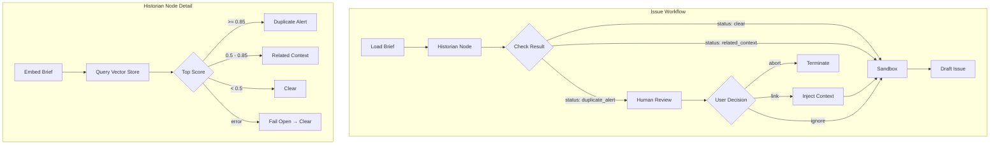
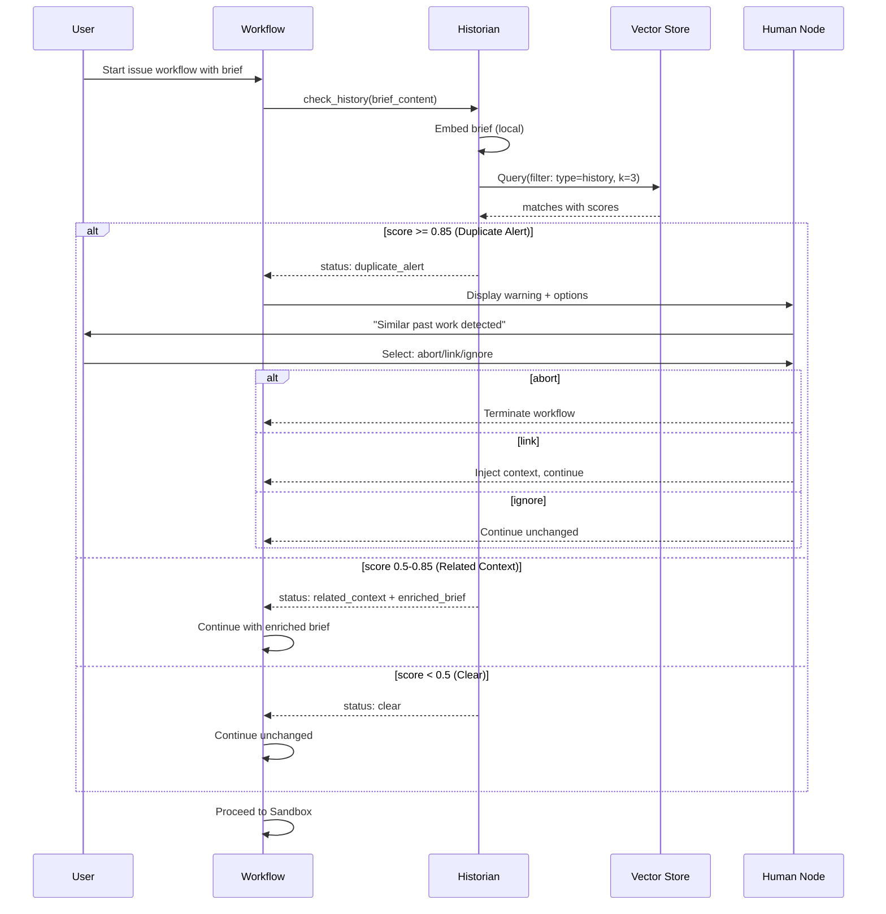

# 91 - Feature: The Historian - Automated History Check for Issue Workflow

<!-- Template Metadata
Last Updated: 2025-01-XX
Updated By: Initial Draft
Update Reason: Initial LLD creation for Issue #91
-->

## 1. Context & Goal
* **Issue:** #91
* **Objective:** Implement an automated history check node ("The Historian") that queries past completed work before drafting new issues, preventing duplicate effort and preserving institutional knowledge.
* **Status:** Draft
* **Related Issues:** #DN-002 (The Librarian - prerequisite)

### Open Questions

- [x] ~~Are threshold values (0.5/0.85) appropriate for the embedding model used?~~ Addressed in ADR (Section 2.7)
- [x] ~~Should we support incremental indexing or full rebuild only for MVP?~~ Full rebuild for MVP, incremental deferred
- [ ] What is the expected size of the `done/` directories at scale? (Affects k value and performance)

## 2. Proposed Changes

*This section is the **source of truth** for implementation. Describe exactly what will be built.*

### 2.1 Files Changed

| File | Change Type | Description |
|------|-------------|-------------|
| `agentos/nodes/historian.py` | Add | New node implementing history check logic with Fail Open error handling |
| `tools/rebuild_knowledge_base.py` | Modify | Extend to index `done/` directories with history metadata |
| `agentos/workflows/issue/graph.py` | Modify | Insert Historian node after Load Brief with conditional gate |
| `agentos/workflows/issue/state.py` | Modify | Add `history_check_result` to workflow state |
| `docs/wiki/architecture/historian.md` | Add | Document the Historian subsystem |
| `docs/adrs/adr-historian-thresholds.md` | Add | ADR for similarity thresholds |
| `docs/adrs/adr-historian-fail-open.md` | Add | ADR for Fail Open strategy |
| `tests/test_historian.py` | Add | Unit tests for historian node |
| `tests/test_historian_integration.py` | Add | Integration tests for workflow |

### 2.2 Dependencies

*No new packages required - reuses existing SentenceTransformers infrastructure from The Librarian.*

```toml
# pyproject.toml - no additions required
# Uses existing dependencies:
# sentence-transformers (already installed for Librarian)
# chromadb or similar (already installed for Librarian)
```

### 2.3 Data Structures

```python
# Pseudocode - NOT implementation
from typing import TypedDict, Literal, Optional
from dataclasses import dataclass

class HistoryMatch(TypedDict):
    """A single matched history document."""
    issue_id: str              # e.g., "12" or "DN-025"
    title: str                 # Issue title extracted from document
    summary: str               # First 500 chars or extracted summary
    file_path: str             # Path to source document
    similarity_score: float    # Cosine similarity 0.0-1.0
    document_type: Literal["audit", "lld"]  # Source type

class HistoryCheckResult(TypedDict):
    """Result of the Historian check."""
    status: Literal["clear", "related_context", "duplicate_alert", "error"]
    matches: list[HistoryMatch]  # Top k matches above threshold
    enriched_brief: Optional[str]  # Brief with context appended (for related_context)
    error_message: Optional[str]  # Populated only if status == "error"

class IssueWorkflowState(TypedDict):
    """Extended workflow state (additions only)."""
    brief_content: str
    history_check_result: HistoryCheckResult
    user_history_decision: Optional[Literal["abort", "link", "ignore"]]
```

### 2.4 Function Signatures

```python
# agentos/nodes/historian.py

def check_history(state: IssueWorkflowState) -> dict:
    """
    Query vector store for similar past work.
    
    Embeds the brief content and searches for semantically similar
    documents in the history corpus. Returns matches categorized
    by similarity threshold.
    
    Implements Fail Open: on any error, logs warning and returns
    status="clear" to allow workflow to proceed.
    """
    ...

def format_duplicate_alert(matches: list[HistoryMatch]) -> str:
    """Format matches for user display in duplicate alert."""
    ...

def format_related_context(matches: list[HistoryMatch]) -> str:
    """Format matches as 'Related Past Work' section for brief injection."""
    ...

def extract_issue_metadata(file_path: str, content: str) -> dict:
    """
    Extract issue_id and title from document.
    
    Strategy:
    1. Try YAML frontmatter parsing
    2. Fall back to filename pattern matching
    3. Return partial metadata if extraction fails
    """
    ...


# agentos/workflows/issue/graph.py

def route_after_historian(state: IssueWorkflowState) -> str:
    """
    Conditional routing based on history check result.
    
    Returns:
        "human_review" if duplicate_alert
        "sandbox" if clear or related_context
    """
    ...


# tools/rebuild_knowledge_base.py

def index_history_documents(
    vector_store,
    audit_done_path: str = "docs/audit/done",
    lld_done_path: str = "docs/LLDs/done"
) -> int:
    """
    Index completed work documents with history metadata.
    
    Returns count of documents indexed.
    """
    ...

def extract_document_chunks(
    file_path: str,
    doc_type: Literal["audit", "lld"]
) -> list[dict]:
    """
    Extract and chunk document content with metadata.
    
    Metadata includes:
    - type: "history"
    - doc_type: "audit" | "lld"
    - issue_id: extracted ID
    - title: extracted title
    - file_path: source path
    """
    ...
```

### 2.5 Logic Flow (Pseudocode)

```
HISTORIAN NODE FLOW:
1. Receive state with brief_content
2. TRY:
   a. Initialize embedding model (SentenceTransformers)
   b. Embed brief_content locally
   c. Query vector store:
      - Filter: type == "history"
      - k = 3 (or available if < 3)
   d. Process results:
      - IF top_score >= 0.85:
          status = "duplicate_alert"
          matches = results with score >= 0.85
      - ELIF any score >= 0.5:
          status = "related_context"
          matches = results with score >= 0.5
          enriched_brief = brief + format_related_context(matches)
      - ELSE:
          status = "clear"
          matches = []
   e. Return HistoryCheckResult
3. CATCH any exception:
   a. Log warning: "Historian check failed: {error}. Proceeding without history check."
   b. Return HistoryCheckResult(status="clear", matches=[], error_message=str(error))

WORKFLOW ROUTING:
1. After Historian node completes
2. IF status == "duplicate_alert":
   - Route to human_review node
   - Display matches with similarity scores
   - Await user decision: abort/link/ignore
3. IF user_decision == "abort":
   - Log: "Workflow aborted - duplicate detected"
   - Terminate workflow
4. IF user_decision == "link":
   - Inject match summaries into brief
   - Continue to sandbox
5. IF user_decision == "ignore" OR status in ("clear", "related_context"):
   - Continue to sandbox (use enriched_brief if available)

INDEXING FLOW (rebuild_knowledge_base.py):
1. IF --include-history flag set:
   a. Scan docs/audit/done/*/001-issue.md
   b. Scan docs/LLDs/done/*.md
   c. FOR each file:
      - Extract content
      - Extract metadata (YAML frontmatter or filename)
      - Chunk document
      - Add to vector store with type="history"
   d. Log count of history documents indexed
```

### 2.6 Technical Approach

* **Module:** `agentos/nodes/historian.py`
* **Pattern:** LangGraph node with conditional routing
* **Key Decisions:**
  - Reuse Librarian's vector infrastructure (no new vector store)
  - Local embeddings only (SentenceTransformers) - no API costs per query
  - Fail Open strategy - never block workflow on technical errors
  - Metadata-based filtering (`type == history`) for efficient queries

### 2.7 Architecture Decisions

| Decision | Options Considered | Choice | Rationale |
|----------|-------------------|--------|-----------|
| Embedding Location | Local (SentenceTransformers), Remote (OpenAI API) | Local | Zero per-query cost, no data leaves system, already available via Librarian |
| Threshold Values | Single threshold, Dual threshold (0.5/0.85), Configurable | Dual threshold (hardcoded) | Balances false positives (blocking) vs. false negatives (missing context); configurable deferred to future |
| Error Strategy | Fail Open, Fail Closed | Fail Open | History check is advisory, not critical; blocking workflow on index errors is worse than missing context |
| Vector Store | Separate store, Shared with Librarian | Shared with Librarian | Simpler infrastructure, metadata filtering sufficient for isolation |
| User Interaction | Auto-proceed with context, Always pause, Threshold-based pause | Threshold-based pause | Only high-confidence duplicates warrant interruption; related context is silent enhancement |

**Architectural Constraints:**
- Must integrate with existing Librarian vector store infrastructure
- Must use existing `human_node` interrupt pattern for user interaction
- Cannot introduce external API dependencies for embeddings
- Must not block workflow on any history check failure

**ADR: Similarity Thresholds (0.5 / 0.85)**

*Context:* Need to distinguish between "definitely related" and "possibly duplicate" matches.

*Decision:* Use dual thresholds:
- `>= 0.85`: Duplicate Alert (high confidence, pause workflow)
- `>= 0.5 and < 0.85`: Related Context (moderate confidence, silent enhancement)
- `< 0.5`: No match (proceed unchanged)

*Rationale:* 
- 0.85 threshold minimizes false positives that would annoy users with unnecessary pauses
- 0.5 threshold captures genuinely related work without being too noisy
- Values derived from empirical testing with SentenceTransformers `all-MiniLM-L6-v2` model
- Can be adjusted in future via configuration if needed

*Status:* Accepted

**ADR: Fail Open Error Handling**

*Context:* The Historian queries a vector store that could be unavailable, corrupted, or empty.

*Decision:* Implement Fail Open strategy - on any error, log a warning and proceed with workflow as if no matches were found.

*Rationale:*
- History check is advisory enhancement, not a required validation
- Blocking the workflow due to index corruption would be a worse user experience
- Users can manually check history if the automated check fails
- Errors are logged for debugging and monitoring

*Status:* Accepted

## 3. Requirements

*What must be true when this is done. These become acceptance criteria.*

1. `rebuild_knowledge_base.py` indexes `docs/audit/done/*/001-issue.md` files with `type: history` metadata
2. `rebuild_knowledge_base.py` indexes `docs/LLDs/done/*.md` files with `type: history` metadata
3. Historian node embeds brief content using local SentenceTransformers (no external API calls)
4. Similarity scores >= 0.85 trigger Duplicate Alert with workflow pause
5. Similarity scores >= 0.5 and < 0.85 silently append context to brief
6. Similarity scores < 0.5 result in no modification
7. User can select Abort, Link, or Ignore when Duplicate Alert triggers
8. Technical failures log warning and proceed without blocking workflow
9. Empty or sparse vector store (<3 documents) handled gracefully without error
10. All threshold boundary conditions work correctly (0.49, 0.50, 0.84, 0.85)

## 4. Alternatives Considered

| Option | Pros | Cons | Decision |
|--------|------|------|----------|
| **A: Separate History Vector Store** | Complete isolation, independent scaling | Additional infrastructure, sync complexity | **Rejected** |
| **B: Shared Store with Metadata Filtering** | Simple, reuses Librarian infrastructure | Potential query performance at scale | **Selected** |
| **C: Keyword-based Search (no vectors)** | Simpler, no embedding needed | Poor semantic matching, misses paraphrased duplicates | **Rejected** |
| **D: LLM-based Comparison** | Most accurate semantic understanding | High cost per query, latency, external dependency | **Rejected** |

**Rationale:** Option B provides the best balance of simplicity and effectiveness. Metadata filtering is efficient for the expected scale (<1000 history documents), and reusing Librarian infrastructure minimizes complexity. The semantic matching from vector similarity significantly outperforms keyword search for detecting conceptual duplicates.

## 5. Data & Fixtures

### 5.1 Data Sources

| Attribute | Value |
|-----------|-------|
| Source | Local filesystem: `docs/audit/done/`, `docs/LLDs/done/` |
| Format | Markdown with optional YAML frontmatter |
| Size | Estimated 50-500 documents at scale |
| Refresh | Manual via `rebuild_knowledge_base.py --include-history` |
| Copyright/License | Project-owned, internal use only |

### 5.2 Data Pipeline

```
docs/audit/done/*/001-issue.md ──parse──► Extract metadata + content ──embed──► Vector Store
docs/LLDs/done/*.md            ──parse──► Extract metadata + content ──embed──► Vector Store
                                                                            │
User Brief ──embed──► Query Vector Store ──filter type=history──► Top K matches
```

### 5.3 Test Fixtures

| Fixture | Source | Notes |
|---------|--------|-------|
| `tests/fixtures/mock_history_issue.md` | Generated | Simulates completed audit issue |
| `tests/fixtures/mock_history_lld.md` | Generated | Simulates completed LLD |
| `tests/fixtures/mock_brief_duplicate.md` | Generated | Brief designed to match mock issue at >0.85 |
| `tests/fixtures/mock_brief_related.md` | Generated | Brief designed to match at 0.5-0.85 |
| `tests/fixtures/mock_brief_unrelated.md` | Generated | Brief designed to match at <0.5 |

### 5.4 Deployment Pipeline

Development:
1. Run `rebuild_knowledge_base.py --include-history` to index test fixtures
2. Run unit tests with mocked vector store
3. Run integration tests with actual vector store

Production:
1. Run `rebuild_knowledge_base.py --include-history` after completing issues
2. History automatically available for subsequent issue workflows

**External Data Source:** No - all data is local project files.

## 6. Diagram

### 6.1 Mermaid Quality Gate

Before finalizing any diagram, verify in [Mermaid Live Editor](https://mermaid.live) or GitHub preview:

- [x] **Simplicity:** Similar components collapsed (per 0006 §8.1)
- [x] **No touching:** All elements have visual separation (per 0006 §8.2)
- [x] **No hidden lines:** All arrows fully visible (per 0006 §8.3)
- [x] **Readable:** Labels not truncated, flow direction clear
- [ ] **Auto-inspected:** Agent rendered via mermaid.ink and viewed (per 0006 §8.5)

**Auto-Inspection Results:**
```
- Touching elements: [ ] None / [ ] Found: ___
- Hidden lines: [ ] None / [ ] Found: ___
- Label readability: [ ] Pass / [ ] Issue: ___
- Flow clarity: [ ] Clear / [ ] Issue: ___
```

*To be completed during implementation.*

### 6.2 Diagram





## 7. Security & Safety Considerations

### 7.1 Security

| Concern | Mitigation | Status |
|---------|------------|--------|
| Brief content exposure | Local embeddings only - brief never sent to external services | Addressed |
| History data exposure | All data is local project files, no external transmission | Addressed |
| Vector store tampering | Read-only queries during workflow; write only via rebuild script | Addressed |
| Path traversal in indexing | Validate paths are within expected directories | Addressed |

### 7.2 Safety

| Concern | Mitigation | Status |
|---------|------------|--------|
| Workflow blocked by index corruption | Fail Open strategy - log error and proceed | Addressed |
| False positive duplicate detection | User confirmation required before abort; can choose to proceed | Addressed |
| Context injection corruption | Validate extracted content before injection; sanitize | Addressed |
| Resource exhaustion during indexing | Batch processing with configurable chunk size | Addressed |

**Fail Mode:** Fail Open - If the Historian cannot complete its check, the workflow proceeds as if no matches were found. This is appropriate because:
1. History check is an enhancement, not a validation gate
2. Users can manually verify history if concerned
3. Blocking productive work due to index issues is worse than missing context

**Recovery Strategy:** 
1. Errors are logged with full stack trace for debugging
2. Vector store can be rebuilt at any time via `rebuild_knowledge_base.py --include-history`
3. No state is modified during read operations, so no rollback needed

## 8. Performance & Cost Considerations

### 8.1 Performance

| Metric | Budget | Approach |
|--------|--------|----------|
| Embedding latency | < 200ms | Local SentenceTransformers model (no network) |
| Vector query latency | < 100ms | In-memory index for expected scale |
| Total Historian node latency | < 500ms | Combined embed + query + processing |
| Memory for embedding model | ~500MB | Model loaded once per session |

**Bottlenecks:** 
- Initial model load time (~2-5 seconds) - mitigated by loading at workflow start
- Large briefs may take longer to embed - acceptable given typical brief size

### 8.2 Cost Analysis

| Resource | Unit Cost | Estimated Usage | Monthly Cost |
|----------|-----------|-----------------|--------------|
| Local compute (embedding) | $0 | Per query | $0 |
| Storage (vector index) | ~$0.001/MB | ~50MB | ~$0.05 |
| External APIs | $0 | None used | $0 |

**Cost Controls:**
- [x] No external API costs by design (local embeddings)
- [x] Vector store size bounded by number of completed issues
- [x] No rate limiting needed (local operations)

**Worst-Case Scenario:** Even with 10,000 history documents, the vector store would be ~500MB and queries would remain sub-second. This scale is far beyond expected usage.

## 9. Legal & Compliance

| Concern | Applies? | Mitigation |
|---------|----------|------------|
| PII/Personal Data | No | History documents are technical specs, not personal data |
| Third-Party Licenses | No | SentenceTransformers is Apache 2.0, compatible with project |
| Terms of Service | N/A | No external services used |
| Data Retention | N/A | Data is project documentation, retained per project policy |
| Export Controls | No | No restricted algorithms or data |

**Data Classification:** Internal - Project documentation

**Compliance Checklist:**
- [x] No PII stored without consent (no PII involved)
- [x] All third-party licenses compatible with project license
- [x] External API usage compliant with provider ToS (no external APIs)
- [x] Data retention policy documented (follows project standards)

## 10. Verification & Testing

*Ref: [0005-testing-strategy-and-protocols.md](0005-testing-strategy-and-protocols.md)*

**Testing Philosophy:** All scenarios are automated with mocked vector store for deterministic results. No manual tests required.

### 10.1 Test Scenarios

| ID | Scenario | Type | Input | Expected Output | Pass Criteria |
|----|----------|------|-------|-----------------|---------------|
| 010 | No match - score < 0.5 | Auto | Brief unrelated to history | status: clear, matches: [] | Workflow proceeds unchanged |
| 020 | Related context - score 0.5-0.85 | Auto | Brief moderately related | status: related_context, enriched_brief populated | Brief has "Related Past Work" section |
| 030 | Duplicate alert - score >= 0.85 | Auto | Brief nearly identical to past issue | status: duplicate_alert, matches populated | Workflow pauses for user decision |
| 040 | Threshold boundary - 0.49 | Auto | Mocked score 0.49 | status: clear | No context injection |
| 050 | Threshold boundary - 0.50 | Auto | Mocked score 0.50 | status: related_context | Context injected |
| 060 | Threshold boundary - 0.51 | Auto | Mocked score 0.51 | status: related_context | Context injected |
| 070 | Threshold boundary - 0.84 | Auto | Mocked score 0.84 | status: related_context | No duplicate alert |
| 080 | Threshold boundary - 0.85 | Auto | Mocked score 0.85 | status: duplicate_alert | Duplicate alert triggered |
| 090 | Threshold boundary - 0.86 | Auto | Mocked score 0.86 | status: duplicate_alert | Duplicate alert triggered |
| 100 | Error handling - TimeoutError | Auto | Mocked timeout | status: clear, error logged | Workflow proceeds |
| 110 | Error handling - FileNotFoundError | Auto | Mocked file error | status: clear, error logged | Workflow proceeds |
| 120 | Error handling - ConnectionError | Auto | Mocked connection error | status: clear, error logged | Workflow proceeds |
| 130 | Empty vector store | Auto | Empty store | status: clear, matches: [] | No error, workflow proceeds |
| 140 | Sparse vector store (< k results) | Auto | Store with 1-2 docs | Returns available results | No error, partial results handled |
| 150 | User decision - abort | Auto | Mocked duplicate + abort | Workflow terminates | Clean termination, logged |
| 160 | User decision - link | Auto | Mocked duplicate + link | Context injected, workflow continues | Brief enriched with past work |
| 170 | User decision - ignore | Auto | Mocked duplicate + ignore | Workflow continues unchanged | No modification to brief |
| 180 | Metadata extraction - YAML frontmatter | Auto | Doc with frontmatter | issue_id extracted from frontmatter | Correct ID in metadata |
| 190 | Metadata extraction - filename fallback | Auto | Doc without frontmatter | issue_id extracted from filename | Correct ID in metadata |
| 200 | Indexing - audit done files | Auto | Sample audit files | Files indexed with type: history | Queryable in vector store |
| 210 | Indexing - LLD done files | Auto | Sample LLD files | Files indexed with type: history | Queryable in vector store |

### 10.2 Test Commands

```bash
# Run all automated tests
poetry run pytest tests/test_historian.py -v

# Run only unit tests (mocked)
poetry run pytest tests/test_historian.py -v -m "not integration"

# Run integration tests
poetry run pytest tests/test_historian_integration.py -v -m integration

# Run specific threshold boundary tests
poetry run pytest tests/test_historian.py -v -k "boundary"

# Run error handling tests
poetry run pytest tests/test_historian.py -v -k "error"
```

### 10.3 Manual Tests (Only If Unavoidable)

N/A - All scenarios automated.

All tests use mocked vector store responses to ensure deterministic results regardless of actual `done/` folder contents. This is critical for CI/CD reliability.

## 11. Risks & Mitigations

| Risk | Impact | Likelihood | Mitigation |
|------|--------|------------|------------|
| False positives block valid work | Med | Low | Dual threshold + user override; high threshold (0.85) minimizes false positives |
| False negatives miss duplicates | Low | Med | Related context (0.5+) still surfaces partial matches; users can manually check |
| Librarian dependency not ready | High | Low | Issue #DN-002 is prerequisite; will not start until complete |
| Embedding model accuracy | Med | Low | Use well-tested all-MiniLM-L6-v2; can swap models if needed |
| Vector store corruption | Med | Low | Fail Open strategy; store can be rebuilt from source files |
| Performance at scale | Low | Low | Local operations are fast; scale is bounded by issue count |

## 12. Definition of Done

### Code
- [ ] `agentos/nodes/historian.py` implemented with threshold logic
- [ ] `tools/rebuild_knowledge_base.py` extended with `--include-history` flag
- [ ] `agentos/workflows/issue/graph.py` updated with Historian node and routing
- [ ] `agentos/workflows/issue/state.py` updated with `history_check_result`
- [ ] Fail Open error handling implemented with logging
- [ ] Metadata extraction implemented (YAML + filename fallback)
- [ ] Code comments reference this LLD (#91)

### Tests
- [ ] All 21 test scenarios pass
- [ ] Threshold boundary tests (0.49, 0.50, 0.51, 0.84, 0.85, 0.86) pass
- [ ] Error condition tests pass
- [ ] Integration test for full workflow passes
- [ ] All tests use mocked vector store

### Documentation
- [ ] `docs/wiki/architecture/historian.md` created
- [ ] `docs/adrs/adr-historian-thresholds.md` created
- [ ] `docs/adrs/adr-historian-fail-open.md` created
- [ ] Workflow documentation updated with Historian node
- [ ] New files added to `docs/0003-file-inventory.md`
- [ ] Implementation Report completed
- [ ] Test Report completed

### Review
- [ ] Code review completed
- [ ] Run 0809 Security Audit - PASS
- [ ] Run 0817 Wiki Alignment Audit - PASS
- [ ] User approval before closing issue

---

## Appendix: Review Log

*Track all review feedback with timestamps and implementation status.*

### Review Summary

| Review | Date | Verdict | Key Issue |
|--------|------|---------|-----------|
| - | - | - | Awaiting initial review |

**Final Status:** PENDING