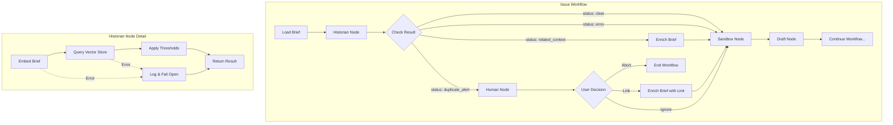
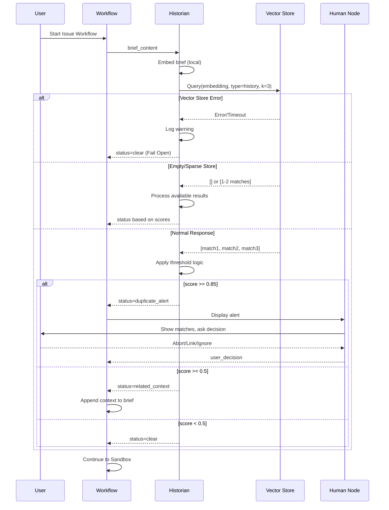

# 91 - Feature: The Historian - Automated History Check for Issue Workflow

<!-- Template Metadata
Last Updated: 2025-01-XX
Updated By: Initial LLD creation
Update Reason: New feature implementation for automated history checking
-->

## 1. Context & Goal
* **Issue:** #91
* **Objective:** Implement an automated history check node ("The Historian") that queries past completed work before drafting new issues, preventing duplicate effort and preserving institutional knowledge.
* **Status:** Approved (gemini-3-pro-preview, 2026-02-04)
* **Related Issues:** #DN-002 (The Librarian - vector store infrastructure dependency)

### Open Questions

- [x] ~~Should rejected decisions be weighted differently than completed work?~~ No - same threshold logic applies; rejection context is captured in document content
- [x] ~~What is the minimum document count before history check is meaningful?~~ Fail gracefully with any count (0+); no minimum required
- [x] ~~Should we support custom thresholds via configuration in a future iteration?~~ Yes, defer to backlog. Maintain hardcoded constants for MVP per ADR.

## 2. Proposed Changes

*This section is the **source of truth** for implementation. Describe exactly what will be built.*

### 2.1 Files Changed

| File | Change Type | Description |
|------|-------------|-------------|
| `agentos/nodes/historian.py` | Add | New Historian node implementing history check logic |
| `tools/rebuild_knowledge_base.py` | Modify | Extend to index done directories with history metadata |
| `agentos/workflows/issue/graph.py` | Modify | Insert Historian node and conditional routing |
| `agentos/workflows/issue/state.py` | Modify | Add history_check_result to workflow state |
| `docs/wiki/architecture/historian.md` | Add | Architecture documentation for Historian subsystem |
| `docs/decisions/adr-historian-thresholds.md` | Add | ADR for similarity threshold decisions |
| `docs/decisions/adr-historian-fail-open.md` | Add | ADR for fail-open error handling strategy |
| `tests/unit/test_historian.py` | Add | Unit tests for historian node |
| `tests/unit/test_rebuild_knowledge_base_history.py` | Add | Unit tests for history indexing in rebuild script |
| `tests/integration/test_historian_workflow.py` | Add | Integration tests for workflow with history check |

### 2.2 Dependencies

*No new packages required. Uses existing SentenceTransformers and vector store infrastructure from The Librarian (#DN-002).*

```toml
# pyproject.toml - no additions needed
# Relies on existing dependencies:
# sentence-transformers (for local embeddings)
# chromadb or similar (for vector store - from Librarian)
```

### 2.3 Data Structures

```python
# Pseudocode - NOT implementation
from typing import TypedDict, Literal, Optional
from dataclasses import dataclass

class HistoryMatch(TypedDict):
    """A single match from the history vector store."""
    issue_id: str              # e.g., "12" or "DN-002"
    title: str                 # Issue title
    file_path: str             # Path to source document
    similarity_score: float    # 0.0 to 1.0
    summary: str               # Extracted summary/excerpt
    document_type: Literal["audit", "lld"]  # Source type

class HistoryCheckResult(TypedDict):
    """Result of the Historian history check."""
    status: Literal["clear", "related_context", "duplicate_alert", "error"]
    matches: list[HistoryMatch]  # Empty if no matches or error
    error_message: Optional[str]  # Set if status == "error"
    enriched_brief: Optional[str]  # Brief with appended context if status == "related_context"

class UserDecision(TypedDict):
    """User's response to a duplicate alert."""
    action: Literal["abort", "link", "ignore"]
    selected_match: Optional[HistoryMatch]  # The match user chose to link

# Addition to existing IssueWorkflowState
class IssueWorkflowState(TypedDict):
    # ... existing fields ...
    brief_content: str
    history_check_result: Optional[HistoryCheckResult]
    user_history_decision: Optional[UserDecision]
```

### 2.4 Function Signatures

```python
# agentos/nodes/historian.py

def extract_issue_id(file_path: str, content: str) -> Optional[str]:
    """
    Extract issue ID from document.
    
    Strategy:
    1. Parse YAML frontmatter for 'issue_id' field
    2. Fall back to filename pattern extraction (e.g., '012-issue.md' -> '12')
    3. Return None if no ID can be extracted (log warning)
    """
    ...

def embed_brief(brief_content: str) -> list[float]:
    """
    Generate embedding vector for brief content using local SentenceTransformers.
    
    Uses same model as Librarian for consistency.
    Raises EmbeddingError on failure.
    """
    ...

def query_history_store(
    embedding: list[float],
    k: int = 3
) -> list[HistoryMatch]:
    """
    Query vector store for similar history documents.
    
    Filters to type == 'history' documents only.
    Returns up to k matches, or fewer if store has less documents.
    Returns empty list if store is empty.
    Raises VectorStoreError on connection/query failure.
    """
    ...

def classify_matches(
    matches: list[HistoryMatch]
) -> tuple[Literal["clear", "related_context", "duplicate_alert"], list[HistoryMatch]]:
    """
    Apply threshold logic to classify match results.
    
    Thresholds:
    - >= 0.85: duplicate_alert (returns top match only)
    - >= 0.5 and < 0.85: related_context (returns all matches >= 0.5)
    - < 0.5: clear (returns empty list)
    """
    ...

def enrich_brief_with_context(
    brief_content: str,
    matches: list[HistoryMatch]
) -> str:
    """
    Append related past work section to brief content.
    
    Format:
    ---
    ## Related Past Work
    - Issue #{id}: {title} (similarity: {score})
      Summary: {summary}
    ---
    """
    ...

async def historian_node(state: IssueWorkflowState) -> dict:
    """
    LangGraph node: Check for similar past work.
    
    Implements Fail Open strategy - on any error, logs warning and
    returns clear status to allow workflow to proceed.
    """
    ...

def format_duplicate_alert(matches: list[HistoryMatch]) -> str:
    """
    Format the duplicate alert message for user display.
    
    Includes issue numbers, titles, similarity scores, and option prompts.
    """
    ...

# tools/rebuild_knowledge_base.py additions

def index_history_documents(
    audit_done_path: str = "docs/audit/done",
    lld_done_path: str = "docs/LLDs/done"
) -> int:
    """
    Index completed work into vector store with history metadata.
    
    Scans:
    - {audit_done_path}/*/001-issue.md
    - {lld_done_path}/*.md
    
    Tags all indexed documents with type='history'.
    Returns count of documents indexed.
    """
    ...

def extract_metadata_from_file(file_path: str, content: str) -> dict:
    """
    Extract metadata (issue_id, title) from a history document.
    
    Strategy:
    1. Parse YAML frontmatter for 'issue_id' and 'title' fields
    2. Fall back to filename pattern extraction for issue_id
    3. Fall back to first H1 header for title
    4. Return partial metadata if some fields cannot be extracted (log warning)
    """
    ...
```

### 2.5 Logic Flow (Pseudocode)

```
HISTORIAN NODE:
1. Receive state with brief_content
2. TRY:
   a. Embed brief_content using local SentenceTransformers
   b. Query vector store for k=3 nearest neighbors where type == 'history'
   c. IF vector store empty or < 3 results:
      - Use available results (0, 1, or 2)
   d. Classify matches using threshold logic:
      - IF top_score >= 0.85: status = 'duplicate_alert'
      - ELIF any_score >= 0.5: status = 'related_context'
      - ELSE: status = 'clear'
   e. IF status == 'related_context':
      - enriched_brief = enrich_brief_with_context(brief, matches)
   f. Return HistoryCheckResult with status and matches
3. CATCH any exception:
   a. Log warning: "Historian check failed: {error}. Proceeding without history check."
   b. Return HistoryCheckResult(status='clear', matches=[], error_message=str(error))

CONDITIONAL GATE:
1. Read history_check_result from state
2. IF status == 'duplicate_alert':
   - Route to human_node for user decision
3. ELIF status == 'related_context':
   - Update brief_content with enriched_brief
   - Route to sandbox node
4. ELSE (status == 'clear' or 'error'):
   - Route to sandbox node unchanged

HUMAN NODE (Duplicate Alert):
1. Display formatted alert with matches
2. Present options: [A]bort, [L]ink, [I]gnore
3. Capture user decision
4. Log user decision for analytics/debugging
5. IF decision == 'abort':
   - Set workflow_terminated = True
   - Route to end
6. ELIF decision == 'link':
   - Enrich brief with selected match context
   - Route to sandbox node
7. ELIF decision == 'ignore':
   - Route to sandbox node unchanged

INDEX HISTORY (rebuild_knowledge_base.py):
1. IF --include-history flag:
   a. Scan docs/audit/done/*/001-issue.md
   b. Scan docs/LLDs/done/*.md
   c. FOR each file:
      - Extract content
      - Extract metadata using extract_metadata_from_file()
      - Generate embedding
      - Store with metadata: type='history', issue_id, title, file_path, document_type
   d. Report count indexed
```

### 2.6 Technical Approach

* **Module:** `agentos/nodes/historian.py`
* **Pattern:** LangGraph conditional node with human-in-the-loop interrupt
* **Key Decisions:**
  - Use existing SentenceTransformers pipeline for consistency with Librarian
  - Implement Fail Open strategy to never block workflow on technical failures
  - Fixed thresholds (0.5/0.85) for MVP; configurable thresholds deferred
  - Metadata extraction uses YAML frontmatter with filename fallback for robustness

### 2.7 Architecture Decisions

| Decision | Options Considered | Choice | Rationale |
|----------|-------------------|--------|-----------|
| Embedding approach | OpenAI API, Local SentenceTransformers | Local SentenceTransformers | No external API costs, brief content stays local, consistent with Librarian |
| Error handling | Fail Closed (block on error), Fail Open (proceed on error) | Fail Open | History check is enhancement, not critical gate; blocking workflow on index corruption unacceptable |
| Threshold configuration | Config file, Environment vars, Hardcoded | Hardcoded (MVP) | Simplifies initial implementation; config support added in future iteration |
| Metadata extraction | YAML only, Filename only, YAML + fallback | YAML + filename fallback | Handles both well-formatted docs and legacy files without frontmatter |
| User interaction | Auto-dismiss, Always prompt, Threshold-based prompt | Threshold-based prompt | Only interrupt user for high-confidence duplicates; silent enhancement for related context |

**Architectural Constraints:**
- Must integrate with existing LangGraph workflow infrastructure
- Must use same vector store instance as Librarian (shared index with metadata filtering)
- Cannot introduce external API dependencies (local embeddings only)
- Must not block workflow on any recoverable error

## 3. Requirements

1. Vector store indexes `docs/audit/done/*/001-issue.md` files with `type: history` metadata
2. Vector store indexes `docs/LLDs/done/*.md` files with `type: history` metadata
3. Historian node embeds brief content using local SentenceTransformers (no external API)
4. Similarity >= 0.85 triggers user-facing Duplicate Alert with Abort/Link/Ignore options
5. Similarity >= 0.5 and < 0.85 silently appends context to brief
6. Similarity < 0.5 proceeds with no modification
7. Technical failures log warning and proceed without blocking workflow
8. Empty or sparse vector store handled gracefully without error
9. User decisions are logged for analytics/debugging
10. Threshold boundary at exactly 0.85 triggers Duplicate Alert (not 0.84999...)

## 4. Alternatives Considered

| Option | Pros | Cons | Decision |
|--------|------|------|----------|
| OpenAI embeddings | Higher quality embeddings, consistent with production LLMs | Per-run API costs, brief content sent to external service | **Rejected** - Privacy and cost concerns |
| Local SentenceTransformers | Free, fast, private, already used by Librarian | Slightly lower quality than commercial embeddings | **Selected** - Cost and privacy trump quality for this use case |
| Fail Closed on errors | Ensures history is always checked | Blocks workflow on index corruption or temporary failures | **Rejected** - Enhancement should not become blocker |
| Fail Open on errors | Never blocks workflow unnecessarily | Might miss history context on failures | **Selected** - Better UX, errors are logged |
| Always prompt user | User always sees history context | Interrupts workflow even for unrelated work | **Rejected** - Excessive friction |
| Never prompt user | Zero friction | User never learns about duplicates | **Rejected** - Defeats purpose |
| Single threshold (prompt or not) | Simpler logic | Loses nuance of "related but not duplicate" | **Rejected** - Two thresholds better serve use cases |

**Rationale:** The selected approach balances friction minimization with duplicate prevention. High-confidence matches warrant user attention; moderate matches enhance context silently; low matches are ignored. Fail Open ensures the enhancement never becomes a blocker.

## 5. Data & Fixtures

### 5.1 Data Sources

| Attribute | Value |
|-----------|-------|
| Source | Local filesystem: `docs/audit/done/`, `docs/LLDs/done/` |
| Format | Markdown files with optional YAML frontmatter |
| Size | Varies by project; typically 10-100 documents |
| Refresh | Manual via `rebuild_knowledge_base.py --include-history` |
| Copyright/License | Internal project documentation, no external licensing |

### 5.2 Data Pipeline

```
docs/audit/done/*/001-issue.md ──scan──► Extract metadata ──embed──► Vector Store
docs/LLDs/done/*.md ──scan──► Extract metadata ──embed──► Vector Store
```

### 5.3 Test Fixtures

| Fixture | Source | Notes |
|---------|--------|-------|
| Mock high-similarity match | Generated | Returns 0.91 similarity score |
| Mock moderate-similarity match | Generated | Returns 0.67 similarity score |
| Mock low-similarity match | Generated | Returns 0.35 similarity score |
| Mock empty store response | Generated | Returns empty list |
| Mock vector store error | Generated | Raises TimeoutError |
| Sample audit issue file | Hardcoded | Minimal valid 001-issue.md structure |
| Sample LLD file | Hardcoded | Minimal valid LLD with frontmatter |
| Sample file with malformed YAML | Hardcoded | Tests fallback to filename extraction |

### 5.4 Deployment Pipeline

**Development:** Index rebuilt manually with `--include-history` flag
**Test:** Uses mocked vector store responses; no actual index needed
**Production:** Index rebuilt as part of standard knowledge base update process

**External data source:** None - all data is local project files.

## 6. Diagram

### 6.1 Mermaid Quality Gate

- [x] **Simplicity:** Similar components collapsed
- [x] **No touching:** All elements have visual separation
- [x] **No hidden lines:** All arrows fully visible
- [x] **Readable:** Labels not truncated, flow direction clear
- [ ] **Auto-inspected:** Agent rendered via mermaid.ink and viewed

**Auto-Inspection Results:**
```
- Touching elements: [ ] None / [ ] Found: ___
- Hidden lines: [ ] None / [ ] Found: ___
- Label readability: [ ] Pass / [ ] Issue: ___
- Flow clarity: [ ] Clear / [ ] Issue: ___
```

*To be completed during implementation phase*

### 6.2 Diagram





## 7. Security & Safety Considerations

### 7.1 Security

| Concern | Mitigation | Status |
|---------|------------|--------|
| Brief content exposure | Local embeddings only; no external API transmission | Addressed |
| Vector store tampering | Read-only queries during workflow; write only via rebuild script | Addressed |
| Path traversal in file scanning | Validate paths are within expected directories | Addressed |
| Injection via document content | Content is embedded, not executed; no code eval | Addressed |

### 7.2 Safety

| Concern | Mitigation | Status |
|---------|------------|--------|
| Workflow blocked on index corruption | Fail Open strategy - proceed on any error | Addressed |
| False positive duplicate alerts | User retains full control via Abort/Link/Ignore; never auto-aborts | Addressed |
| Missing history context on failure | Error is logged; user can manually check if needed | Addressed |
| Infinite loop on retry | No automatic retry; single attempt with fail-open | Addressed |

**Fail Mode:** Fail Open - On any error, log warning and proceed without history context. Justification: History check is an enhancement, not a critical gate. Blocking workflow on index issues is worse than missing context.

**Recovery Strategy:** If history check fails, workflow proceeds normally. User can manually search docs/audit/done/ if needed. Index can be rebuilt via `rebuild_knowledge_base.py --include-history`.

## 8. Performance & Cost Considerations

### 8.1 Performance

| Metric | Budget | Approach |
|--------|--------|----------|
| Embedding latency | < 500ms | Local SentenceTransformers; model loaded at workflow start |
| Vector query latency | < 100ms | ChromaDB local query; k=3 results |
| Total node latency | < 1s | Combined embed + query + threshold logic |
| Memory | < 500MB | SentenceTransformers model loaded once per session |

**Bottlenecks:** 
- Initial model load (~2-3s) amortized across workflow
- Large briefs (>10KB) may take longer to embed
- Vector store with >10K documents may slow queries

### 8.2 Cost Analysis

| Resource | Unit Cost | Estimated Usage | Monthly Cost |
|----------|-----------|-----------------|--------------|
| LLM API calls | N/A | 0 (local only) | $0 |
| Cloud compute | N/A | Local execution | $0 |
| Storage | Negligible | ~10MB vector index | $0 |

**Cost Controls:**
- [x] No external API calls - zero per-run cost
- [x] Local computation only
- [x] Index size bounded by project history size

**Worst-Case Scenario:** If project grows to 10,000 completed issues, vector store queries may slow to 500ms-1s. Mitigation: Add index partitioning in future iteration.

## 9. Legal & Compliance

| Concern | Applies? | Mitigation |
|---------|----------|------------|
| PII/Personal Data | No | Internal project docs only; no user data |
| Third-Party Licenses | No | SentenceTransformers is Apache 2.0 (compatible) |
| Terms of Service | N/A | No external APIs used |
| Data Retention | N/A | Project documentation, retained per project policy |
| Export Controls | No | No restricted algorithms or data |

**Data Classification:** Internal - Project documentation only

**Compliance Checklist:**
- [x] No PII stored without consent (no PII involved)
- [x] All third-party licenses compatible with project license
- [x] External API usage compliant with provider ToS (no external APIs)
- [x] Data retention policy documented (follows project doc policy)

## 10. Verification & Testing

### 10.0 Test Plan (TDD - Complete Before Implementation)

**TDD Requirement:** Tests MUST be written and failing BEFORE implementation begins.

| Test ID | Test Description | Expected Behavior | Status |
|---------|------------------|-------------------|--------|
| T010 | test_historian_clear_no_matches | Returns clear status when no matches above threshold | RED |
| T020 | test_historian_clear_low_similarity | Returns clear status when top score < 0.5 | RED |
| T030 | test_historian_related_context_medium | Returns related_context when 0.5 <= score < 0.85 | RED |
| T040 | test_historian_duplicate_alert_high | Returns duplicate_alert when score >= 0.85 | RED |
| T050 | test_threshold_boundary_049 | Score 0.49 returns clear | RED |
| T060 | test_threshold_boundary_050 | Score 0.50 returns related_context | RED |
| T070 | test_threshold_boundary_051 | Score 0.51 returns related_context | RED |
| T080 | test_threshold_boundary_084 | Score 0.84 returns related_context | RED |
| T090 | test_threshold_boundary_085 | Score 0.85 returns duplicate_alert | RED |
| T100 | test_threshold_boundary_086 | Score 0.86 returns duplicate_alert | RED |
| T110 | test_fail_open_timeout_error | TimeoutError logs warning, returns clear | RED |
| T120 | test_fail_open_file_not_found | FileNotFoundError logs warning, returns clear | RED |
| T130 | test_fail_open_connection_error | ConnectionError logs warning, returns clear | RED |
| T140 | test_empty_vector_store | Empty store returns clear status without error | RED |
| T150 | test_sparse_vector_store | Store with 1-2 docs returns available results | RED |
| T160 | test_enrich_brief_format | Related context appended in correct format | RED |
| T170 | test_extract_issue_id_yaml | Extracts ID from YAML frontmatter | RED |
| T180 | test_extract_issue_id_filename | Falls back to filename pattern | RED |
| T190 | test_extract_issue_id_missing | Returns None with warning when no ID | RED |
| T200 | test_user_decision_abort_logs | Abort terminates workflow and logs decision | RED |
| T210 | test_user_decision_link_logs | Link enriches brief, continues, and logs decision | RED |
| T220 | test_user_decision_ignore_logs | Ignore continues without modification and logs decision | RED |
| T300 | test_index_history_scans_audit_done | index_history_documents scans audit done directory | RED |
| T310 | test_index_history_scans_lld_done | index_history_documents scans LLD done directory | RED |
| T320 | test_index_history_extracts_yaml_metadata | Extracts issue_id and title from YAML frontmatter | RED |
| T330 | test_index_history_extracts_filename_fallback | Falls back to filename for issue_id when no YAML | RED |
| T340 | test_index_history_malformed_yaml_fallback | Handles malformed YAML and falls back to filename | RED |
| T350 | test_index_history_sets_type_metadata | All indexed docs have type='history' metadata | RED |
| T360 | test_index_history_returns_count | Returns correct count of indexed documents | RED |

**Coverage Target:** ≥95% for all new code

**TDD Checklist:**
- [ ] All tests written before implementation
- [ ] Tests currently RED (failing)
- [ ] Test IDs match scenario IDs in 10.1
- [ ] Test file created at: `tests/unit/test_historian.py`
- [ ] Test file created at: `tests/unit/test_rebuild_knowledge_base_history.py`

### 10.1 Test Scenarios

| ID | Scenario | Type | Input | Expected Output | Pass Criteria |
|----|----------|------|-------|-----------------|---------------|
| 010 | No matches found | Auto | Brief with no similar history | status=clear, empty matches | Workflow proceeds unchanged |
| 020 | Low similarity (0.35) | Auto | Brief with distant match | status=clear | Top score < 0.5 means clear |
| 030 | Medium similarity (0.67) | Auto | Brief with related match | status=related_context | Brief enriched silently |
| 040 | High similarity (0.91) | Auto | Brief with near-duplicate | status=duplicate_alert | User prompted |
| 050 | Boundary: 0.49 | Auto | Mock match at 0.49 | status=clear | Just below threshold |
| 060 | Boundary: 0.50 | Auto | Mock match at 0.50 | status=related_context | At lower threshold |
| 070 | Boundary: 0.51 | Auto | Mock match at 0.51 | status=related_context | Just above lower threshold |
| 080 | Boundary: 0.84 | Auto | Mock match at 0.84 | status=related_context | Just below upper threshold |
| 090 | Boundary: 0.85 | Auto | Mock match at 0.85 | status=duplicate_alert | At upper threshold |
| 100 | Boundary: 0.86 | Auto | Mock match at 0.86 | status=duplicate_alert | Just above upper threshold |
| 110 | Error: Timeout | Auto | Mock TimeoutError | status=clear, error logged | Fail Open |
| 120 | Error: File not found | Auto | Mock FileNotFoundError | status=clear, error logged | Fail Open |
| 130 | Error: Connection | Auto | Mock ConnectionError | status=clear, error logged | Fail Open |
| 140 | Empty vector store | Auto | Empty store | status=clear, no error | Graceful handling |
| 150 | Sparse store (2 docs) | Auto | Store with 2 docs | Returns 2 results | Partial results OK |
| 160 | Brief enrichment format | Auto | Brief + matches | Formatted "Related Past Work" section | Correct markdown |
| 170 | ID extraction: YAML | Auto | File with frontmatter | Extracted issue_id | YAML parsed |
| 180 | ID extraction: filename | Auto | File without frontmatter | ID from filename pattern | Fallback works |
| 190 | ID extraction: missing | Auto | File with neither | None returned, warning logged | Graceful failure |
| 200 | User: Abort with logging | Auto | User selects Abort | Workflow terminated, decision logged | Clean exit, log emitted |
| 210 | User: Link with logging | Auto | User selects Link | Brief enriched, workflow continues, decision logged | Context added, log emitted |
| 220 | User: Ignore with logging | Auto | User selects Ignore | Workflow continues unchanged, decision logged | No modification, log emitted |
| 230 | Integration: full workflow | Auto | Complete issue workflow | History check executed | Node integrated |
| 300 | Index scans audit/done | Auto | Audit done directory with files | Files found and processed | Correct paths scanned |
| 310 | Index scans LLDs/done | Auto | LLD done directory with files | Files found and processed | Correct paths scanned |
| 320 | Index extracts YAML metadata | Auto | File with YAML frontmatter | issue_id and title extracted | Metadata correct |
| 330 | Index filename fallback | Auto | File without YAML | issue_id from filename | Fallback works |
| 340 | Index malformed YAML | Auto | File with invalid YAML | Falls back to filename, no crash | Graceful degradation |
| 350 | Index sets type metadata | Auto | Any history file | type='history' in metadata | Correct tagging |
| 360 | Index returns count | Auto | Directory with 5 files | Returns 5 | Count accurate |

### 10.2 Test Commands

```bash
# Run all historian unit tests
poetry run pytest tests/unit/test_historian.py -v

# Run rebuild knowledge base history tests
poetry run pytest tests/unit/test_rebuild_knowledge_base_history.py -v

# Run only threshold boundary tests
poetry run pytest tests/unit/test_historian.py -v -k "boundary"

# Run only error handling tests
poetry run pytest tests/unit/test_historian.py -v -k "fail_open or error"

# Run integration tests
poetry run pytest tests/integration/test_historian_workflow.py -v

# Run with coverage for historian node
poetry run pytest tests/unit/test_historian.py --cov=agentos/nodes/historian --cov-report=term-missing

# Run with coverage for rebuild script additions
poetry run pytest tests/unit/test_rebuild_knowledge_base_history.py --cov=tools/rebuild_knowledge_base --cov-report=term-missing

# Run all historian-related tests with full coverage
poetry run pytest tests/unit/test_historian.py tests/unit/test_rebuild_knowledge_base_history.py tests/integration/test_historian_workflow.py --cov=agentos/nodes/historian --cov=tools/rebuild_knowledge_base --cov-report=term-missing
```

### 10.3 Manual Tests (Only If Unavoidable)

**N/A - All scenarios automated.**

All test scenarios use mocked vector store responses to ensure deterministic, reproducible results. Integration tests verify workflow graph integration without requiring actual history documents.

## 11. Risks & Mitigations

| Risk | Impact | Likelihood | Mitigation |
|------|--------|------------|------------|
| Librarian dependency not ready | High | Low | Verify #DN-002 complete before starting; stub vector store interface if needed |
| Threshold values suboptimal | Med | Med | Start with documented values (0.5/0.85); gather feedback; adjust in future |
| False positives annoy users | Med | Low | Conservative high threshold (0.85); user always has Ignore option |
| Vector store grows too large | Low | Low | Current project size is manageable; partitioning added in future if needed |
| Model loading slows workflow startup | Med | Med | Load model lazily; cache across workflow runs |
| Done directories don't exist | Low | Low | Check directory existence; skip gracefully if missing |

## 12. Definition of Done

### Code
- [ ] `agentos/nodes/historian.py` implemented with all functions
- [ ] `tools/rebuild_knowledge_base.py` extended with `--include-history` flag
- [ ] `agentos/workflows/issue/graph.py` updated with Historian node
- [ ] `agentos/workflows/issue/state.py` updated with new state fields
- [ ] Code comments reference this LLD (#91)
- [ ] All functions have docstrings

### Tests
- [ ] All 27 test scenarios pass (23 historian + 7 indexing - 3 overlap)
- [ ] Test coverage ≥ 95% for `agentos/nodes/historian.py`
- [ ] Test coverage ≥ 95% for history indexing in `tools/rebuild_knowledge_base.py`
- [ ] All tests use mocked vector store (no dependency on actual done/ contents)
- [ ] Integration test confirms workflow executes end-to-end

### Documentation
- [ ] `docs/wiki/architecture/historian.md` created
- [ ] `docs/decisions/adr-historian-thresholds.md` created
- [ ] `docs/decisions/adr-historian-fail-open.md` created
- [ ] `docs/0003-file-inventory.md` updated with new files
- [ ] LLD updated with any implementation deviations

### Reports (Pre-Merge Gate)
- [ ] `docs/reports/91/implementation-report.md` created
- [ ] `docs/reports/91/test-report.md` created

### Review
- [ ] Run 0809 Security Audit - PASS
- [ ] Run 0817 Wiki Alignment Audit - PASS
- [ ] Code review completed
- [ ] User approval before closing issue

---

## Reviewer Suggestions

*Non-blocking recommendations from the reviewer.*

- **Performance:** Ensure the `tools/rebuild_knowledge_base.py` script prints a progress bar or status updates if the number of historical documents grows large (>1000).
- **Maintainability:** Consider moving the hardcoded thresholds (0.5, 0.85) to module-level constants at the top of `historian.py` for easy adjustment later.

## Appendix: Review Log

*Track all review feedback with timestamps and implementation status.*

### Gemini Review #1 (REVISE)

**Reviewer:** Gemini 3 Pro
**Verdict:** REVISE

#### Comments

| ID | Comment | Implemented? |
|----|---------|--------------|
| G1.1 | "Test Plan (Section 10) completely overlooks the `tools/rebuild_knowledge_base.py` modifications. Requirements 1 and 2 (indexing behavior) are undefined in the test strategy" | YES - Added T300-T360 test cases for indexing, added test file `tests/unit/test_rebuild_knowledge_base_history.py` to Section 2.1 |
| G1.2 | "Tests T200, T210, and T220 should explicitly verify that user actions are logged (Req 9)" | YES - Renamed tests to include "_logs" suffix, updated test descriptions and pass criteria to verify log emission |
| G1.3 | "Consider adding a test case for a file with *malformed* YAML frontmatter" | YES - Added T340 test case and corresponding fixture in Section 5.3 |
| G1.4 | "Open question about custom thresholds should be resolved" | YES - Marked as resolved with decision to defer to backlog |

### Review Summary

| Review | Date | Verdict | Key Issue |
|--------|------|---------|-----------|
| 2 | 2026-02-04 | APPROVED | `gemini-3-pro-preview` |
| Gemini #1 | - | REVISE | Missing test coverage for rebuild_knowledge_base.py indexing logic (70% coverage) |

**Final Status:** APPROVED