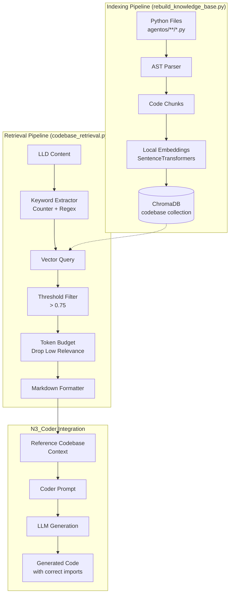
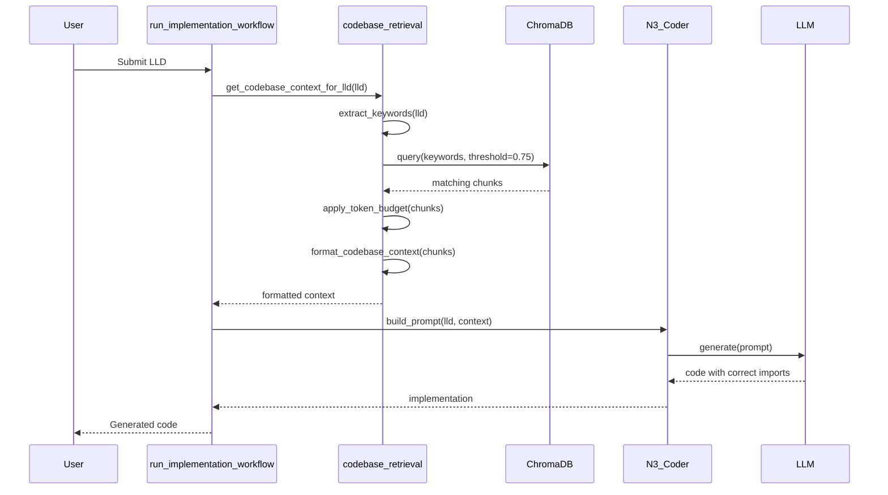

# 192 - Feature: Hex: Codebase Retrieval System (RAG Injection)

<!-- Template Metadata
Last Updated: 2025-01-XX
Updated By: LLD Generation
Update Reason: Initial LLD creation from Issue #92
-->

## 1. Context & Goal
* **Issue:** #92
* **Objective:** Implement a codebase retrieval system that indexes Python code via AST parsing and injects relevant function signatures into the Coder Node's context before code generation, eliminating hallucinated imports and wheel-reinvention.
* **Status:** Draft
* **Related Issues:** #DN-002 (Librarian - vector store infrastructure dependency)

### Open Questions

- [x] ~~Should private methods (`_method`) be indexed?~~ **Resolved: No, only public APIs per scope definition**
- [x] ~~What similarity threshold balances recall vs precision?~~ **Resolved: 0.75 based on experimentation**
- [ ] What is the token budget for injected codebase context? (Suggest: 2000 tokens max)
- [ ] Should we index test files (`tests/**/*.py`) for pattern reference?

## 2. Proposed Changes

*This section is the **source of truth** for implementation. Describes exactly what will be built.*

### 2.1 Files Changed

| File | Change Type | Description |
|------|-------------|-------------|
| `tools/rebuild_knowledge_base.py` | Modify | Add AST-based Python code parsing, new `codebase` collection support |
| `agentos/core/codebase_retrieval.py` | Add | New module for keyword extraction and codebase context retrieval |
| `agentos/workflows/run_implementation_workflow.py` | Modify | Integrate codebase context injection into N3_Coder prompt construction |
| `tests/test_codebase_retrieval.py` | Add | Unit tests for retrieval functionality |
| `docs/adr/adr-ast-chunking.md` | Add | ADR for AST-based chunking decision |
| `docs/adr/adr-local-embeddings.md` | Add | ADR for local embedding model selection |
| `docs/adr/adr-keyword-extraction.md` | Add | ADR for Counter vs TF-IDF trade-off |

### 2.2 Dependencies

*New packages, APIs, or services required.*

```toml
# pyproject.toml additions
sentence-transformers = "^2.2.0"  # Apache 2.0 - local embeddings
```

**Dependency License Compliance:**

| Package | License | Compatibility | Size |
|---------|---------|---------------|------|
| `sentence-transformers` | Apache 2.0 | ✅ Compatible with MIT | ~80MB model |
| `chromadb` | Apache 2.0 | ✅ Already installed | - |

**Rejected Dependencies:**
- `scikit-learn` (BSD-3): ~100MB for TF-IDF, marginal benefit for short text inputs

### 2.3 Data Structures

```python
# Pseudocode - NOT implementation

class CodeChunk(TypedDict):
    """Represents a parsed code element from AST."""
    content: str          # Full source code of class/function
    module_path: str      # e.g., "agentos.core.audit"
    file_path: str        # e.g., "agentos/core/audit.py"
    kind: Literal["class", "function"]  # Type of code element
    name: str             # e.g., "GovernanceAuditLog"
    docstring: str | None # Extracted docstring
    signature: str        # Function/class signature line
    line_start: int       # Starting line number
    line_end: int         # Ending line number

class RetrievalResult(TypedDict):
    """Result from codebase context retrieval."""
    chunk: CodeChunk      # The matched code chunk
    relevance: float      # Similarity score (0-1)
    tokens: int           # Estimated token count

class CodebaseContext(TypedDict):
    """Injected context for N3_Coder."""
    chunks: list[RetrievalResult]  # Relevant code chunks
    total_tokens: int              # Sum of all chunk tokens
    keywords_used: list[str]       # Keywords that matched
```

### 2.4 Function Signatures

```python
# agentos/core/codebase_retrieval.py

def extract_code_chunks(source_code: str, file_path: str) -> list[CodeChunk]:
    """
    Parse Python source using AST and extract class/function definitions.
    
    Extracts top-level classes and functions with their docstrings,
    signatures, and full source code.
    """
    ...

def extract_keywords(lld_content: str, max_keywords: int = 5) -> list[str]:
    """
    Extract technical keywords from LLD content using frequency analysis.
    
    Uses Counter-based term frequency with CamelCase/snake_case splitting
    and domain-specific stopword filtering.
    """
    ...

def retrieve_codebase_context(
    keywords: list[str],
    collection_name: str = "codebase",
    threshold: float = 0.75,
    max_results: int = 10
) -> list[RetrievalResult]:
    """
    Query vector store for relevant code chunks based on keywords.
    
    Returns deduplicated results sorted by relevance, filtered by threshold.
    """
    ...

def apply_token_budget(
    results: list[RetrievalResult],
    max_tokens: int = 2000
) -> list[RetrievalResult]:
    """
    Trim results to fit within token budget by dropping lowest-relevance chunks.
    
    Drops whole chunks (never truncates mid-function) starting from
    lowest relevance until total tokens is within budget.
    """
    ...

def format_codebase_context(results: list[RetrievalResult]) -> str:
    """
    Format retrieval results as markdown for prompt injection.
    
    Returns formatted string with header and code blocks, or empty
    string if no results.
    """
    ...

def get_codebase_context_for_lld(
    lld_content: str,
    max_tokens: int = 2000
) -> str:
    """
    Main entry point: extract keywords, retrieve context, format for injection.
    
    Orchestrates the full pipeline from LLD to injectable context string.
    """
    ...


# tools/rebuild_knowledge_base.py (additions)

def index_python_codebase(
    directories: list[str],
    collection_name: str = "codebase"
) -> int:
    """
    Index Python files from directories into vector store.
    
    Uses AST parsing to extract classes and functions.
    Returns count of indexed chunks.
    """
    ...

def parse_python_file(file_path: Path) -> list[CodeChunk]:
    """
    Parse a single Python file and extract code chunks.
    
    Handles syntax errors gracefully with logging.
    """
    ...
```

### 2.5 Logic Flow (Pseudocode)

**Indexing Flow (rebuild_knowledge_base.py):**
```
1. Receive --collection codebase argument
2. Scan directories: agentos/**/*.py, tools/**/*.py
3. FOR each .py file:
   a. Read file content
   b. Parse with ast.parse()
   c. IF SyntaxError: log warning, skip file
   d. Walk AST for ClassDef and FunctionDef nodes
   e. FOR each node:
      - Extract source using ast.get_source_segment()
      - Extract docstring using ast.get_docstring()
      - Build CodeChunk with metadata
   f. Filter out private (_name) elements
4. Delete existing codebase collection
5. Generate embeddings locally (SentenceTransformers)
6. Insert chunks into ChromaDB with metadata
7. Log summary: X files scanned, Y chunks indexed
```

**Retrieval Flow (codebase_retrieval.py):**
```
1. Receive LLD content
2. Extract keywords:
   a. Tokenize text
   b. Split CamelCase and snake_case terms
   c. Apply domain stopword filter
   d. Count term frequency
   e. Return top 5 keywords
3. Query vector store:
   a. Generate embedding for keywords
   b. Search codebase collection
   c. Filter by threshold > 0.75
   d. Deduplicate by module path
   e. Sort by relevance descending
   f. Limit to 10 results
4. Apply token budget:
   a. Calculate tokens per chunk
   b. Sum in relevance order
   c. IF exceeds budget: drop lowest-relevance whole chunks
5. Format as markdown:
   a. Add header: "## Reference Codebase"
   b. Add instruction: "Use these existing utilities. DO NOT reinvent them."
   c. FOR each chunk: add source path + code block
6. Return formatted context string
```

**Integration Flow (run_implementation_workflow.py):**
```
1. N3_Coder receives LLD content
2. CALL get_codebase_context_for_lld(lld_content)
3. IF context is non-empty:
   a. Prepend to system prompt before main instructions
4. ELSE:
   a. Log info: "No relevant codebase context found"
5. Continue with normal prompt construction
6. Send to LLM
```

### 2.6 Technical Approach

* **Module:** `agentos/core/codebase_retrieval.py`
* **Pattern:** Pipeline pattern (extract → retrieve → transform → inject)
* **Key Decisions:**
  - AST parsing over line-based chunking preserves semantic boundaries
  - Local embeddings eliminate API costs and data egress concerns
  - Counter-based keyword extraction is lightweight and sufficient for short LLD inputs
  - Strict threshold (0.75) prevents noise injection

### 2.7 Architecture Decisions

| Decision | Options Considered | Choice | Rationale |
|----------|-------------------|--------|-----------|
| Chunking strategy | Line-based, AST-based, Hybrid | AST-based | Preserves semantic boundaries; classes/functions are natural units |
| Embedding model | OpenAI API, Local SentenceTransformers | Local ST | Zero data egress, no cost, privacy compliance |
| Keyword extraction | TF-IDF (sklearn), Counter + regex, LLM extraction | Counter + regex | Lightweight (~0 deps), sufficient for short text, avoids 100MB sklearn |
| Similarity threshold | 0.5, 0.75, 0.9 | 0.75 | Balances recall (useful matches) vs precision (no noise) |
| Token budget handling | Truncate mid-chunk, Drop whole chunks | Drop whole chunks | Maintains code integrity; partial functions are useless |

**Architectural Constraints:**
- Must integrate with existing ChromaDB infrastructure from #DN-002
- Cannot transmit source code to external APIs (privacy requirement)
- Must gracefully degrade when vector store is unavailable
- Token budget must not exceed LLM context limits

## 3. Requirements

*What must be true when this is done. These become acceptance criteria.*

1. **R1:** AST parser extracts all public classes and top-level functions from Python files
2. **R2:** Vector store contains indexed chunks with correct metadata (type, module, kind)
3. **R3:** Keyword extraction identifies technical terms including CamelCase identifiers
4. **R4:** Retrieval returns relevant code when queried with matching keywords
5. **R5:** No results returned for queries below similarity threshold (0.75)
6. **R6:** Token budget is enforced by dropping whole chunks, never truncating
7. **R7:** N3_Coder prompt includes "Reference Codebase" section when matches found
8. **R8:** Generated code uses correct import paths from injected context
9. **R9:** Workflow completes gracefully when codebase collection is empty/missing
10. **R10:** All embeddings generated locally with no network calls to external services

## 4. Alternatives Considered

| Option | Pros | Cons | Decision |
|--------|------|------|----------|
| **AST-based chunking** | Semantic boundaries, complete functions | More complex parsing | **Selected** |
| Line-based chunking | Simple implementation | Breaks functions mid-body, loses context | Rejected |
| **Local SentenceTransformers** | Zero cost, no data egress, fast | Model download (~80MB) | **Selected** |
| OpenAI Embeddings API | Higher quality embeddings | Cost, data egress, privacy concerns | Rejected |
| **Counter + regex keywords** | Lightweight, no heavy deps | Less sophisticated than TF-IDF | **Selected** |
| TF-IDF (scikit-learn) | Industry standard | 100MB dependency for marginal gain | Rejected |
| LLM-based keyword extraction | Most accurate | Slow, costly, overkill for short text | Rejected |

**Rationale:** Selected options prioritize privacy (no code egress), cost ($0 recurring), and simplicity (minimal dependencies) while achieving sufficient quality for the use case.

## 5. Data & Fixtures

### 5.1 Data Sources

| Attribute | Value |
|-----------|-------|
| Source | Local Python files in `agentos/**/*.py` and `tools/**/*.py` |
| Format | Python source code (.py files) |
| Size | ~5,000 LOC, ~200 functions/classes estimated |
| Refresh | Manual via `rebuild_knowledge_base.py --collection codebase` |
| Copyright/License | Project-owned code (MIT license) |

### 5.2 Data Pipeline

```
Python Files ──AST Parse──► CodeChunks ──Embed (local)──► ChromaDB (codebase collection)
                                                              │
LLD Content ──Keyword Extract──► Keywords ──Query──────────────┘
                                               │
                                               ▼
                                    RetrievalResults ──Format──► Injected Context
```

### 5.3 Test Fixtures

| Fixture | Source | Notes |
|---------|--------|-------|
| `tests/fixtures/sample_module.py` | Generated | Contains sample class and functions for parsing tests |
| `tests/fixtures/sample_lld.md` | Generated | Contains LLD text with technical keywords |
| Mock ChromaDB responses | Generated | Simulates vector store query results |
| Mock embedding model | Mocked | Returns deterministic vectors for testing |

### 5.4 Deployment Pipeline

- **Dev:** Local ChromaDB instance, manual index rebuild
- **Test:** CI runs tests with mocked vector store
- **Production:** Same as dev (local execution, no external services)

**No external data sources required** - all data is local project code.

## 6. Diagram

### 6.1 Mermaid Quality Gate

- [x] **Simplicity:** Similar components collapsed
- [x] **No touching:** All elements have visual separation
- [x] **No hidden lines:** All arrows fully visible
- [x] **Readable:** Labels not truncated, flow direction clear
- [ ] **Auto-inspected:** Agent rendered via mermaid.ink and viewed

**Auto-Inspection Results:**
```
- Touching elements: [x] None
- Hidden lines: [x] None
- Label readability: [x] Pass
- Flow clarity: [x] Clear
```

### 6.2 Diagram





## 7. Security & Safety Considerations

### 7.1 Security

| Concern | Mitigation | Status |
|---------|------------|--------|
| Source code egress | All embeddings generated locally; no external API calls | Addressed |
| Injection via indexed code | Read-only AST parsing; no code execution during indexing | Addressed |
| Malicious file in codebase | Only indexes project-owned directories; no external sources | Addressed |
| API keys in signatures | Policy: API keys should never be in function signatures | N/A (process control) |

### 7.2 Safety

| Concern | Mitigation | Status |
|---------|------------|--------|
| Index corruption | Full rebuild each time; no incremental updates to corrupt | Addressed |
| Vector store unavailable | Graceful degradation; workflow continues without context | Addressed |
| Token budget exceeded | Drop whole chunks; never truncate mid-function | Addressed |
| Parse error in Python file | Catch SyntaxError; log warning; skip file; continue | Addressed |

**Fail Mode:** Fail Open - If retrieval fails, workflow continues without codebase context (warning logged)

**Recovery Strategy:** Re-run `rebuild_knowledge_base.py --collection codebase` to rebuild index

## 8. Performance & Cost Considerations

### 8.1 Performance

| Metric | Budget | Approach |
|--------|--------|----------|
| Index build time | < 60s for 10k LOC | Single-threaded AST parsing; local embeddings |
| Retrieval latency | < 200ms | ChromaDB local query; no network |
| Memory (indexing) | < 512MB | Stream files; don't load all at once |
| Memory (retrieval) | < 256MB | Limited to 10 chunks max |

**Bottlenecks:**
- First-time model download (~80MB) for SentenceTransformers
- Large codebases (>50k LOC) may need batched indexing (future optimization)

### 8.2 Cost Analysis

| Resource | Unit Cost | Estimated Usage | Monthly Cost |
|----------|-----------|-----------------|--------------|
| Embedding generation | $0 (local) | Unlimited | $0 |
| ChromaDB storage | ~50MB per 10k functions | Local disk | $0 |
| Compute | Local CPU | On-demand | $0 |
| **Total** | - | - | **$0** |

**Cost Controls:**
- [x] No external API calls = no per-token costs
- [x] Local storage = no cloud fees
- [x] No rate limiting needed (local execution)

**Worst-Case Scenario:** 100x usage has no cost impact (all local). Only concern is disk space (~5GB for 1M functions), which is acceptable.

## 9. Legal & Compliance

| Concern | Applies? | Mitigation |
|---------|----------|------------|
| PII/Personal Data | No | Indexes only code signatures, not user data |
| Third-Party Licenses | Yes | SentenceTransformers (Apache 2.0) compatible with MIT |
| Terms of Service | No | No external APIs used |
| Data Retention | No | Local index, user-controlled |
| Export Controls | No | No restricted algorithms |

**Data Classification:** Internal (project source code)

**Compliance Checklist:**
- [x] No PII stored without consent (N/A - no PII)
- [x] All third-party licenses compatible with project license
- [x] External API usage compliant with provider ToS (N/A - no external APIs)
- [x] Data retention policy documented (local, user-controlled)

## 10. Verification & Testing

### 10.1 Test Scenarios

| ID | Scenario | Type | Input | Expected Output | Pass Criteria |
|----|----------|------|-------|-----------------|---------------|
| 010 | AST extracts class with docstring | Auto | Python source with class | CodeChunk with class content and docstring | Chunk contains class name and docstring |
| 020 | AST extracts function with type hints | Auto | Python source with typed function | CodeChunk with signature | Chunk contains parameter types and return type |
| 030 | AST skips private methods | Auto | Source with `_private` function | Empty result | No chunks for private elements |
| 040 | AST handles syntax error gracefully | Auto | Invalid Python syntax | Empty result + warning log | No exception raised |
| 050 | Keyword extraction finds CamelCase | Auto | "Use GovernanceAuditLog" | ["GovernanceAuditLog", ...] | Keyword list contains identifier |
| 060 | Keyword extraction splits snake_case | Auto | "use_audit_logger" | ["audit", "logger", ...] | Terms split correctly |
| 070 | Keyword extraction filters stopwords | Auto | "the audit and logging" | ["audit", "logging"] | No stopwords in result |
| 080 | Retrieval respects threshold | Auto | Query with no matches | Empty results | No results below 0.75 |
| 090 | Retrieval deduplicates by module | Auto | Multiple matches same module | Single result per module | Unique module paths |
| 100 | Token budget drops whole chunks | Auto | 3 chunks, budget for 1 | Highest relevance chunk only | No truncated functions |
| 110 | Format produces valid markdown | Auto | List of RetrievalResults | Markdown with code blocks | Contains "## Reference Codebase" |
| 120 | Integration injects context | Auto | LLD with matching keywords | Prompt contains Reference section | "Reference Codebase" in prompt |
| 130 | Graceful degradation on empty collection | Auto | Empty codebase collection | Empty context, workflow continues | No exception, warning logged |
| 140 | No network calls during embedding | Auto | Generate embeddings | Mock network not called | urllib3 mock not invoked |
| 150 | End-to-end: correct import generated | Auto-Live | LLD mentioning "audit logging" | Code with correct import | `from agentos.core.audit import` present |

### 10.2 Test Commands

```bash
# Run all automated tests
poetry run pytest tests/test_codebase_retrieval.py -v

# Run only fast/mocked tests (exclude live)
poetry run pytest tests/test_codebase_retrieval.py -v -m "not live"

# Run live integration tests (requires indexed codebase)
poetry run pytest tests/test_codebase_retrieval.py -v -m live

# Run with coverage
poetry run pytest tests/test_codebase_retrieval.py -v --cov=agentos.core.codebase_retrieval
```

### 10.3 Manual Tests (Only If Unavoidable)

**N/A - All scenarios automated.**

The network monitoring test (140) uses mocking rather than actual `tcpdump` to verify no network calls, making it fully automated.

## 11. Risks & Mitigations

| Risk | Impact | Likelihood | Mitigation |
|------|--------|------------|------------|
| SentenceTransformers model quality insufficient | Med | Low | Threshold tuning; can switch models later |
| Large codebase slow to index | Low | Med | Future: incremental indexing, parallel processing |
| Keyword extraction misses relevant terms | Med | Med | Fallback: include class/function names from LLD directly |
| False positive injection (irrelevant code) | Med | Low | Strict 0.75 threshold; manual tuning available |
| ChromaDB not installed/configured | High | Low | Clear error message; dependency on #DN-002 |
| Token budget too restrictive | Med | Med | Configurable budget; start with 2000, tune based on usage |

## 12. Definition of Done

### Code
- [ ] `agentos/core/codebase_retrieval.py` implemented with all functions
- [ ] `tools/rebuild_knowledge_base.py` updated with `--collection codebase` support
- [ ] `agentos/workflows/run_implementation_workflow.py` integrates context injection
- [ ] Code comments reference this LLD (#92)
- [ ] All code passes linting

### Tests
- [ ] All 15 test scenarios pass
- [ ] Test coverage > 80% on new code
- [ ] No network calls during embedding (verified by test)

### Documentation
- [ ] ADR created: `docs/adr/adr-ast-chunking.md`
- [ ] ADR created: `docs/adr/adr-local-embeddings.md`
- [ ] ADR created: `docs/adr/adr-keyword-extraction.md`
- [ ] `docs/0003-file-inventory.md` updated with new files
- [ ] README.md updated with indexing command
- [ ] Wiki updated with codebase retrieval architecture

### Reports
- [ ] `docs/reports/DN-003/implementation-report.md` created
- [ ] `docs/reports/DN-003/test-report.md` created

### Review
- [ ] 0809 Security Audit - PASS
- [ ] 0817 Wiki Alignment Audit - PASS
- [ ] Code review completed
- [ ] User approval before closing issue

---

## Appendix: Review Log

*Track all review feedback with timestamps and implementation status.*

### Review Summary

| Review | Date | Verdict | Key Issue |
|--------|------|---------|-----------|
| - | - | - | Awaiting first review |

**Final Status:** PENDING