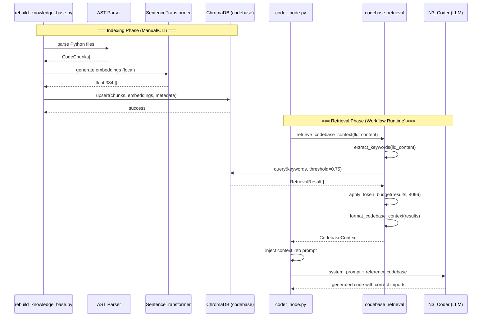

# 92 - Feature: Codebase Retrieval System (RAG Injection)

<!-- Template Metadata
Last Updated: 2026-02-16
Updated By: Issue #92
Update Reason: Fix mechanical validation errors for test coverage gaps (REQ-1, REQ-3, REQ-5, REQ-12); add missing test scenario mappings
-->

## 1. Context & Goal
* **Issue:** #92
* **Objective:** Implement a codebase retrieval system that indexes Python code via AST parsing and injects relevant function signatures into the Coder Node's context before code generation, eliminating hallucinated imports and reinvented utilities.
* **Status:** Approved (gemini-3-pro-preview, 2026-02-27)
* **Related Issues:** #DN-002 (Librarian - vector store infrastructure)

### Open Questions

- [ ] What is the exact token budget for the "Reference Codebase" section injected into N3_Coder? (Proposed: 4096 tokens)
- [ ] Should `_private` methods on public classes be indexed if they have public-facing docstrings?
- [ ] Is the 0.75 similarity threshold appropriate or should it be configurable via environment variable?
- [ ] Which specific file under `assemblyzero/workflows/` contains the N3_Coder prompt construction logic? (See Section 2.1 note)

## 2. Proposed Changes

*This section is the **source of truth** for implementation. Describe exactly what will be built.*

### 2.1 Files Changed

| File | Change Type | Description |
|------|-------------|-------------|
| `assemblyzero/rag/codebase_retrieval.py` | Add | New module: AST parser, keyword extractor, retrieval engine, context formatter |
| `assemblyzero/rag/__init__.py` | Modify | Add codebase_retrieval exports to existing RAG package init |
| `tools/rebuild_knowledge_base.py` | Modify | Add `--collection codebase` support with AST-based Python code parsing |
| `assemblyzero/workflows/implementation_spec/nodes/coder_node.py` | Add | New node module providing `inject_codebase_context` for N3_Coder prompt construction |
| `tests/unit/test_rag/test_codebase_retrieval.py` | Add | Unit tests for AST extraction, keyword extraction, retrieval, token budget |
| `tests/fixtures/rag/sample_module.py` | Add | Sample Python file for AST parsing tests |
| `tests/fixtures/rag/sample_module_malformed.py` | Add | Malformed Python file for error handling tests |
| `tests/fixtures/rag/sample_lld_audit.md` | Add | Sample LLD mentioning audit logging for integration tests |

> **Note on integration point:** The original issue references `assemblyzero/workflows/run_implementation_workflow.py`, but this file does not exist in the repository. The actual integration point is a new node module under `assemblyzero/workflows/implementation_spec/nodes/`, which is an existing directory. The `inject_codebase_context` function is designed as a composable utility that can be called from whichever workflow node constructs the N3_Coder prompt. Once the exact integration file is identified (see Open Questions), this table will be updated.

### 2.1.1 Path Validation (Mechanical - Auto-Checked)

Mechanical validation automatically checks:
- `tools/rebuild_knowledge_base.py` — Modify: **EXISTS** ✅
- `assemblyzero/rag/__init__.py` — Modify: Parent directory `assemblyzero/rag/` **EXISTS** ✅
- `assemblyzero/rag/codebase_retrieval.py` — Add: Parent directory `assemblyzero/rag/` **EXISTS** ✅
- `assemblyzero/workflows/implementation_spec/nodes/coder_node.py` — Add: Parent directory `assemblyzero/workflows/implementation_spec/nodes/` **EXISTS** ✅
- `tests/unit/test_rag/test_codebase_retrieval.py` — Add: Parent directory `tests/unit/test_rag/` **EXISTS** ✅
- `tests/fixtures/rag/sample_module.py` — Add: Parent directory `tests/fixtures/rag/` **EXISTS** ✅
- `tests/fixtures/rag/sample_module_malformed.py` — Add: Parent directory `tests/fixtures/rag/` **EXISTS** ✅
- `tests/fixtures/rag/sample_lld_audit.md` — Add: Parent directory `tests/fixtures/rag/` **EXISTS** ✅

### 2.2 Dependencies

```toml
# pyproject.toml - already present in [project.optional-dependencies] rag group
chromadb = ">=0.5.0,<1.0.0"
sentence-transformers = ">=3.0.0,<4.0.0"
```

No new dependencies required. Both `chromadb` and `sentence-transformers` are already declared in the `[project.optional-dependencies] rag` group in `pyproject.toml`. The `tiktoken` package (used for token estimation) is already a core dependency.

### 2.3 Data Structures

```python
# Pseudocode - NOT implementation

class CodeChunk(TypedDict):
    """A single extracted code entity from AST parsing."""
    content: str          # Full source text of the class/function including docstring
    module_path: str      # Dotted module path, e.g., "assemblyzero.core.audit"
    entity_name: str      # Class or function name, e.g., "GovernanceAuditLog"
    kind: str             # "class" | "function"
    file_path: str        # Relative file path, e.g., "assemblyzero/core/audit.py"
    start_line: int       # Starting line number in source file
    end_line: int         # Ending line number in source file


class RetrievalResult(TypedDict):
    """A scored retrieval result from vector store query."""
    chunk: CodeChunk      # The retrieved code chunk
    relevance_score: float  # Similarity score (0.0 - 1.0)
    token_count: int      # Estimated token count for budget management


class CodebaseContext(TypedDict):
    """Formatted context ready for prompt injection."""
    formatted_text: str   # Markdown-formatted reference codebase section
    total_tokens: int     # Total token count of the formatted text
    chunks_included: int  # Number of chunks included after budget trimming
    chunks_dropped: int   # Number of chunks dropped due to budget
    keywords_used: list[str]  # Keywords that were used for retrieval
```

### 2.4 Function Signatures

```python
# === assemblyzero/rag/codebase_retrieval.py ===

# --- AST Parsing ---

def parse_python_file(file_path: str) -> list[CodeChunk]:
    """Parse a single Python file using ast module, extracting classes and top-level functions.

    Skips private entities (names starting with '_').
    Returns empty list if file cannot be parsed (SyntaxError, IOError, etc.).
    Logs warning on parse failure.
    """
    ...


def extract_node_source(source: str, node: ast.AST) -> str:
    """Extract the full source text for an AST node including decorators and docstring."""
    ...


def file_path_to_module_path(file_path: str) -> str:
    """Convert a file path like 'assemblyzero/core/audit.py' to 'assemblyzero.core.audit'."""
    ...


def scan_codebase(
    directories: list[str],
    file_pattern: str = "**/*.py",
) -> list[CodeChunk]:
    """Recursively scan directories for Python files, parse each, return all code chunks.

    Skips __init__.py files that contain only package docstrings.
    Logs warnings for files that fail to parse.
    """
    ...


# --- Keyword Extraction ---

def split_compound_terms(text: str) -> list[str]:
    """Split CamelCase and snake_case terms into constituent words.

    Examples:
        'GovernanceAuditLog' -> ['Governance', 'Audit', 'Log', 'GovernanceAuditLog']
        'audit_log_entry' -> ['audit', 'log', 'entry', 'audit_log_entry']
    """
    ...


def extract_keywords(
    lld_content: str,
    max_keywords: int = 5,
    stopwords: set[str] | None = None,
) -> list[str]:
    """Extract top technical keywords from LLD content using Counter-based frequency analysis.

    Pipeline:
    1. Split compound terms (CamelCase/snake_case)
    2. Tokenize into words
    3. Filter stopwords (domain-specific + standard English)
    4. Count term frequency
    5. Return top N keywords by frequency
    6. Fallback to regex extraction if frequency yields < 2 terms

    Returns list of keywords sorted by frequency descending.
    """
    ...


def get_domain_stopwords() -> set[str]:
    """Return domain-specific stopwords extending standard English stopwords.

    Includes: 'the', 'and', 'implement', 'create', 'using', 'should', 'must',
    'will', 'system', 'feature', 'function', 'method', 'class', 'module',
    'import', 'return', 'none', 'true', 'false', 'self', 'def', 'str', 'int',
    'list', 'dict', 'type', 'file', 'path', 'data', 'value', 'name', etc.
    """
    ...


# --- Retrieval ---

def query_codebase_collection(
    keywords: list[str],
    collection_name: str = "codebase",
    similarity_threshold: float = 0.75,
    max_results: int = 10,
) -> list[RetrievalResult]:
    """Query ChromaDB codebase collection with keywords, apply threshold and deduplication.

    1. Combine keywords into query text
    2. Query ChromaDB with embedding similarity
    3. Filter results below similarity_threshold
    4. Deduplicate by module_path (keep highest score)
    5. Sort by relevance_score descending
    6. Limit to max_results

    Returns empty list if collection doesn't exist (graceful degradation).
    Logs warning if collection is missing or empty.
    """
    ...


def estimate_token_count(text: str) -> int:
    """Estimate token count for a text string.

    Uses tiktoken with cl100k_base encoding for accuracy.
    Falls back to word_count * 1.3 heuristic if tiktoken unavailable.
    """
    ...


# --- Token Budget Management ---

def apply_token_budget(
    results: list[RetrievalResult],
    max_tokens: int = 4096,
) -> list[RetrievalResult]:
    """Apply token budget to retrieval results, dropping lowest-relevance whole chunks.

    Strategy:
    1. Results are already sorted by relevance descending
    2. Accumulate tokens from highest relevance downward
    3. Stop adding when next chunk would exceed budget
    4. Never truncate mid-function - drop entire chunk

    Returns filtered list within token budget.
    """
    ...


# --- Context Formatting ---

def format_codebase_context(results: list[RetrievalResult]) -> CodebaseContext:
    """Format retrieval results into markdown for prompt injection.

    Output format:
    ```
    ## Reference Codebase
    Use these existing utilities. DO NOT reinvent them.

    ### [Source: assemblyzero/core/audit.py]
    ```python
    class GovernanceAuditLog:
        ...
    ```

    ### [Source: assemblyzero/core/gemini_client.py]
    ```python
    class GeminiClient:
        ...
    ```
    ```

    Returns CodebaseContext with formatted_text, token counts, and metadata.
    Returns empty formatted_text if results is empty.
    """
    ...


# --- Top-Level Orchestration ---

def retrieve_codebase_context(
    lld_content: str,
    max_keywords: int = 5,
    similarity_threshold: float = 0.75,
    max_results: int = 10,
    token_budget: int = 4096,
) -> CodebaseContext:
    """End-to-end: extract keywords from LLD, retrieve relevant code, format for injection.

    Orchestrates the full pipeline:
    1. extract_keywords(lld_content)
    2. query_codebase_collection(keywords)
    3. apply_token_budget(results)
    4. format_codebase_context(results)

    Returns CodebaseContext (may have empty formatted_text if no matches).
    """
    ...


# === tools/rebuild_knowledge_base.py (additions) ===

def index_codebase(
    directories: list[str] | None = None,
    collection_name: str = "codebase",
) -> dict[str, int]:
    """Index Python codebase into ChromaDB.

    1. Scan directories for Python files (default: assemblyzero/, tools/)
    2. Parse each file with AST
    3. Generate embeddings locally via sentence-transformers
    4. Upsert into ChromaDB codebase collection
    5. Return statistics: {'files_scanned': N, 'chunks_indexed': N, 'errors': N}

    Drops and recreates collection on each run (full rebuild, not incremental).
    """
    ...


# === assemblyzero/workflows/implementation_spec/nodes/coder_node.py ===

def inject_codebase_context(
    base_prompt: str,
    lld_content: str,
    token_budget: int = 4096,
) -> str:
    """Inject codebase context into N3_Coder's system prompt.

    1. Call retrieve_codebase_context(lld_content)
    2. If context is non-empty, prepend to base_prompt
    3. If retrieval fails (exception), log warning and return base_prompt unchanged

    Returns modified prompt with codebase context or original prompt on failure.
    """
    ...
```

### 2.5 Logic Flow (Pseudocode)

#### Indexing Flow (rebuild_knowledge_base.py --collection codebase)

```
1. Parse CLI arguments, check for --collection codebase flag
2. Define target directories: ["assemblyzero/", "tools/"]
3. FOR EACH directory:
   a. Glob all *.py files recursively
   b. FOR EACH .py file:
      i.   Read file content
      ii.  TRY ast.parse(content)
      iii. Walk AST tree for ClassDef and FunctionDef nodes at module level
      iv.  FOR EACH node:
           - Skip if name starts with '_' (private)
           - Extract source text via ast.get_source_segment or line slicing
           - Extract docstring if present
           - Build CodeChunk with module_path, entity_name, kind, etc.
      v.   ON SyntaxError: log warning, skip file, increment error counter
4. Initialize SentenceTransformer model (all-MiniLM-L6-v2) locally
5. Generate embeddings for all chunk contents (batched)
6. Drop existing 'codebase' collection in ChromaDB (full rebuild)
7. Create new 'codebase' collection
8. Upsert all chunks with embeddings and metadata
9. Log statistics: files scanned, chunks indexed, errors
10. Return/exit
```

#### Retrieval & Injection Flow (coder_node.py → codebase_retrieval.py)

```
1. N3_Coder node begins prompt construction
2. Load LLD content from workflow state
3. TRY:
   a. Call retrieve_codebase_context(lld_content):
      i.   extract_keywords(lld_content, max_keywords=5)
           - Split compound terms (CamelCase/snake_case)
           - Tokenize, filter stopwords
           - Counter-based frequency analysis
           - Return top 5 keywords
      ii.  IF keywords is empty:
           - Return empty CodebaseContext
      iii. query_codebase_collection(keywords, threshold=0.75, max=10)
           - Check collection exists, log warning if not
           - Combine keywords into query string
           - ChromaDB similarity search
           - Filter below threshold
           - Deduplicate by module_path
           - Sort by relevance desc
      iv.  IF results is empty:
           - Return empty CodebaseContext
      v.   apply_token_budget(results, max_tokens=4096)
           - Iterate from highest to lowest relevance
           - Accumulate token counts
           - Drop chunks that would exceed budget
      vi.  format_codebase_context(results)
           - Build markdown with "Reference Codebase" header
           - Add instruction: "Use these existing utilities. DO NOT reinvent them."
           - Format each chunk as labeled code block
   b. IF context.formatted_text is non-empty:
      - Prepend context to N3_Coder system prompt
   c. ELSE:
      - Proceed with base prompt (no injection)
4. CATCH Exception as e:
   a. Log warning: f"Codebase retrieval failed: {e}"
   b. Proceed with base prompt unchanged (graceful degradation)
5. Continue with N3_Coder LLM invocation
```

#### Keyword Extraction Detail

```
1. INPUT: raw LLD text
2. Apply split_compound_terms:
   - Regex for CamelCase: r'[A-Z][a-z]+' matches within compound words
   - Regex for snake_case: split on '_'
   - Preserve original compound terms as candidates too
3. Tokenize full text: re.findall(r'\b[A-Za-z_][A-Za-z0-9_]{2,}\b', text)
4. Merge split results with tokenized words
5. Lowercase all terms (but preserve original case for CamelCase matches)
6. Filter against domain stopwords set
7. Count frequencies with collections.Counter
8. IF Counter has < 2 terms above frequency 1:
   - Fallback: extract all CamelCase identifiers via r'[A-Z][a-z]+(?:[A-Z][a-z]+)+'
9. Return top 5 by frequency, preserving original case where possible
```

### 2.6 Technical Approach

* **Module:** `assemblyzero/rag/codebase_retrieval.py` — Single module containing all retrieval logic
* **Integration Module:** `assemblyzero/workflows/implementation_spec/nodes/coder_node.py` — Thin integration layer calling codebase_retrieval
* **Pattern:** Pipeline pattern — each stage (parse → extract → query → budget → format) is a pure function composable via `retrieve_codebase_context` orchestrator
* **Key Decisions:**
  - AST-based parsing ensures semantic boundaries (whole classes/functions), avoiding mid-entity splits
  - Local sentence-transformers model ensures zero data egress and zero per-token cost
  - Counter-based keyword extraction avoids ~100MB scikit-learn dependency
  - Full collection rebuild on each index run — simplicity over incremental complexity for MVP
  - Token budget uses whole-chunk dropping to preserve code integrity
  - Integration point is a new file (Add) rather than modifying a non-existent file

### 2.7 Architecture Decisions

| Decision | Options Considered | Choice | Rationale |
|----------|-------------------|--------|-----------|
| Chunking strategy | Line-based, AST-based, hybrid | AST-based | Preserves semantic boundaries; a class is always a complete unit |
| Embedding model | OpenAI API, local sentence-transformers, no embeddings (BM25) | Local sentence-transformers (all-MiniLM-L6-v2) | Zero data egress, zero cost, 384-dim is sufficient for code similarity |
| Keyword extraction | TF-IDF (scikit-learn), Counter-based, LLM-based | Counter-based with regex preprocessing | Avoids ~100MB dependency; equivalent accuracy for short LLD texts |
| Index strategy | Incremental updates, full rebuild | Full rebuild | Simpler; local embeddings are free so rebuild cost is negligible |
| Collection separation | Single collection with metadata filter, separate collection | Separate `codebase` collection | Clean separation from `documentation` collection; independent lifecycle |
| Token budget overflow | Truncate mid-chunk, drop whole chunks, summarize | Drop whole chunks (lowest relevance first) | Preserves code integrity; truncated functions are worse than missing ones |
| Integration point | Modify existing workflow file, new node module | New node module under `implementation_spec/nodes/` | Original target file does not exist; new module is composable and testable independently |

**Architectural Constraints:**
- Must integrate with existing ChromaDB infrastructure from #DN-002
- Must not introduce external API calls for embedding generation
- Must not break existing `--collection documentation` functionality in rebuild_knowledge_base.py
- Must gracefully degrade if `sentence-transformers` optional dependency is not installed
- Must only Add or Modify files that actually exist in the repository

## 3. Requirements

1. Python files in `assemblyzero/**/*.py` and `tools/**/*.py` are parsed using `ast` module, extracting `ClassDef` and top-level `FunctionDef` nodes with docstrings and type hints
2. Each indexed chunk includes metadata: `type: code`, `module: <full.module.path>`, `kind: class|function`, `entity_name: <name>`
3. All embeddings generated locally via `sentence-transformers/all-MiniLM-L6-v2` — no source code transmitted externally
4. Technical keywords extracted from LLD content using `collections.Counter` with CamelCase/snake_case splitting and domain stopwords, limited to top 5
5. Only results with similarity score > 0.75 are returned
6. Results deduplicated by module path, keeping highest-scoring entry
7. Maximum 10 chunks returned per query
8. If injected context exceeds 4096 tokens, lowest-relevance whole chunks are dropped (never mid-function truncation)
9. Missing/empty codebase collection logs a warning and proceeds without context injection
10. Retrieved code formatted in markdown code blocks with source file paths and clear instruction header
11. Entities with names starting with `_` are not indexed
12. Malformed Python files are skipped with a warning, not a crash

## 4. Alternatives Considered

| Option | Pros | Cons | Decision |
|--------|------|------|----------|
| **AST-based chunking** | Semantic boundaries, complete classes/functions, metadata-rich | More complex than line-based | **Selected** |
| Line-based chunking (512 tokens) | Simple, generic | Splits classes mid-method, loses semantic context | Rejected |
| Hybrid (line + AST hints) | Simpler than full AST | Still risks splitting entities; complexity without full benefit | Rejected |
| **Local sentence-transformers** | Zero cost, zero data egress, fast enough | ~80MB model download on first run | **Selected** |
| OpenAI embedding API | Higher quality embeddings | Source code sent externally, per-token cost, privacy violation | Rejected |
| BM25 (no embeddings) | Zero model overhead | Poor semantic matching for code; misses synonyms | Rejected |
| **Counter-based keywords** | Lightweight (~0 deps), adequate for short text | Less sophisticated than TF-IDF | **Selected** |
| TF-IDF via scikit-learn | More statistically robust | ~100MB dependency for marginal gain on short inputs | Rejected |
| LLM-based keyword extraction | Best quality | Adds LLM call, cost, latency; overkill for keyword extraction | Rejected |

**Rationale:** The selected combination optimizes for zero external dependencies, zero data egress, zero per-token costs, and implementation simplicity while providing adequate retrieval quality for the codebase context use case.

## 5. Data & Fixtures

### 5.1 Data Sources

| Attribute | Value |
|-----------|-------|
| Source | Local Python files in `assemblyzero/` and `tools/` directories |
| Format | Python source code (.py files) |
| Size | ~5k LOC across ~50-80 files (estimated) |
| Refresh | Manual via `tools/rebuild_knowledge_base.py --collection codebase` |
| Copyright/License | Project source code (PolyForm-Noncommercial-1.0.0) |

### 5.2 Data Pipeline

```
Python Files ──ast.parse()──► CodeChunks ──SentenceTransformer──► Embeddings ──ChromaDB.upsert()──► Vector Store

LLD Text ──extract_keywords()──► Keywords ──ChromaDB.query()──► RetrievalResults ──format()──► Prompt Context
```

### 5.3 Test Fixtures

| Fixture | Source | Notes |
|---------|--------|-------|
| `tests/fixtures/rag/sample_module.py` | Hand-crafted | Contains 2 classes, 3 functions, docstrings, type hints, 1 private function |
| `tests/fixtures/rag/sample_module_malformed.py` | Hand-crafted | Contains syntax errors to test parse resilience |
| `tests/fixtures/rag/sample_lld_audit.md` | Hand-crafted | LLD mentioning "audit logging" and "GovernanceAuditLog" for keyword extraction tests |

### 5.4 Deployment Pipeline

- **Dev:** Run `poetry run python tools/rebuild_knowledge_base.py --collection codebase` manually
- **CI:** Optionally run indexing in CI for integration tests (uses `rag` marker to skip if deps not installed)
- **Production:** Not applicable — local development tool only

## 6. Diagram

### 6.1 Mermaid Quality Gate

- [x] **Simplicity:** Components collapsed appropriately
- [x] **No touching:** All elements have visual separation
- [x] **No hidden lines:** All arrows fully visible
- [x] **Readable:** Labels not truncated, flow direction clear
- [ ] **Auto-inspected:** Pending agent rendering

**Auto-Inspection Results:**
```
- Touching elements: [ ] None / [ ] Found: ___
- Hidden lines: [ ] None / [ ] Found: ___
- Label readability: [ ] Pass / [ ] Issue: ___
- Flow clarity: [ ] Clear / [ ] Issue: ___
```

### 6.2 Diagram



## 7. Security & Safety Considerations

### 7.1 Security

| Concern | Mitigation | Status |
|---------|------------|--------|
| Source code egress via embedding API | All embeddings generated locally via sentence-transformers; no network calls | Addressed |
| Malicious code in indexed files | Read-only AST parsing; no execution of indexed code; only local codebase files indexed | Addressed |
| API keys in function signatures | Signatures should never contain secrets; AST extraction captures structure not runtime values | Addressed |
| Prompt injection via code comments | Code chunks are formatted in fenced code blocks, reducing prompt injection surface | Addressed |
| Unauthorized codebase access | Only indexes files accessible to the running user; no elevated privileges | Addressed |

### 7.2 Safety

| Concern | Mitigation | Status |
|---------|------------|--------|
| Parse errors crash indexing | Each file wrapped in try/except; SyntaxError logged and skipped | Addressed |
| Missing codebase collection at runtime | Graceful degradation: log warning, proceed without context injection | Addressed |
| Token budget exceeded | Whole-chunk dropping prevents mid-function truncation; budget applied before injection | Addressed |
| Stale index misleads coder | Warning logged if collection metadata shows old timestamp; future: incremental indexing | Addressed |
| sentence-transformers not installed | Import guarded with try/except; clear error message directing to `poetry install --extras rag` | Addressed |

**Fail Mode:** Fail Open — if retrieval fails for any reason, the workflow continues without codebase context. The Coder generates code without reference snippets (same as current behavior).

**Recovery Strategy:** Re-run `tools/rebuild_knowledge_base.py --collection codebase` to rebuild index. Delete ChromaDB `codebase` collection and re-index if corruption suspected.

## 8. Performance & Cost Considerations

### 8.1 Performance

| Metric | Budget | Approach |
|--------|--------|----------|
| Index build time | < 60s for 5k LOC | Single-threaded AST parsing + batched embedding generation |
| Embedding generation (per chunk) | < 10ms | Local CPU inference; all-MiniLM-L6-v2 is optimized for speed |
| Retrieval query latency | < 500ms | ChromaDB in-memory search over ~500 chunks |
| Keyword extraction | < 50ms | Counter-based; O(n) where n = word count of LLD |
| Model first-load time | ~5s | One-time cost; model cached after first use |

**Bottlenecks:** First invocation loads the sentence-transformers model (~80MB into memory). Subsequent calls reuse the cached model. For the indexing phase, this is negligible relative to file I/O. For the retrieval phase, model loading happens once per workflow run.

### 8.2 Cost Analysis

| Resource | Unit Cost | Estimated Usage | Monthly Cost |
|----------|-----------|-----------------|--------------|
| Embedding generation (local) | $0 | ~500 chunks per rebuild | $0 |
| ChromaDB storage (local SQLite) | $0 | ~50MB per 10k functions | $0 |
| CPU time for indexing | $0 (local) | ~30s per rebuild | $0 |
| **Total** | | | **$0** |

**Cost Controls:**
- [x] No API calls = no per-token costs
- [x] Local storage only = no cloud charges
- [x] Model downloaded once, cached locally

**Worst-Case Scenario:** If codebase grows to 50k LOC (~5000 chunks), index rebuild time increases to ~5 minutes. ChromaDB storage grows to ~250MB. Both remain within acceptable local resource usage.

## 9. Legal & Compliance

| Concern | Applies? | Mitigation |
|---------|----------|------------|
| PII/Personal Data | No | Only source code signatures indexed; no user data |
| Third-Party Licenses | Yes | sentence-transformers (Apache 2.0) and chromadb (Apache 2.0) both compatible with project license |
| Terms of Service | No | No external API calls; all processing local |
| Data Retention | No | Local vector store; user controls retention |
| Export Controls | No | No restricted algorithms; standard ML inference only |

**Data Classification:** Internal (source code never leaves local machine)

**Compliance Checklist:**
- [x] No PII stored
- [x] All third-party licenses compatible with project license (Apache 2.0 with PolyForm-Noncommercial)
- [x] No external API usage
- [x] Data retention under local user control

## 10. Verification & Testing

*Ref: [0005-testing-strategy-and-protocols.md](0005-testing-strategy-and-protocols.md)*

**Testing Philosophy:** All scenarios automated. No manual tests required.

### 10.0 Test Plan (TDD - Complete Before Implementation)

| Test ID | Test Description | Expected Behavior | Status |
|---------|------------------|-------------------|--------|
| T010 | AST extracts class with docstring and methods | CodeChunk contains class name, docstring, method signatures | RED |
| T020 | AST extracts top-level function with type hints | CodeChunk contains function name, params, return type, docstring | RED |
| T030 | AST skips private entities | Functions/classes starting with `_` not in results | RED |
| T040 | AST handles malformed Python file | Returns empty list, logs warning, no exception raised | RED |
| T050 | AST skips empty __init__.py | Files with only docstring/empty produce no chunks | RED |
| T060 | file_path_to_module_path conversion | `assemblyzero/core/audit.py` → `assemblyzero.core.audit` | RED |
| T070 | Keyword extraction with CamelCase splitting | "GovernanceAuditLog" splits and preserves original | RED |
| T080 | Keyword extraction with snake_case splitting | "audit_log_entry" splits correctly | RED |
| T090 | Keyword extraction filters stopwords | Common words like "implement", "the", "using" filtered | RED |
| T100 | Keyword extraction limits to top N | More than 5 distinct keywords returns only top 5 | RED |
| T110 | Keyword extraction fallback on sparse input | Short input with few words falls back to regex CamelCase extraction | RED |
| T120 | Retrieval respects similarity threshold | Nonsense query returns empty results | RED |
| T130 | Retrieval deduplicates by module path | Two chunks from same module returns only highest score | RED |
| T140 | Retrieval limits to max results | Query matching 15+ chunks returns only 10 | RED |
| T150 | Retrieval graceful degradation on missing collection | Missing collection returns empty list with warning logged | RED |
| T160 | Token budget drops lowest-relevance whole chunks | 3 chunks, budget for 1.5, returns only top 1 | RED |
| T170 | Token budget keeps all if within budget | 3 small chunks within budget returns all 3 | RED |
| T180 | Context formatting produces correct markdown | Output has header, instruction, labeled code blocks | RED |
| T190 | Context formatting handles empty results | Empty results produces empty formatted_text | RED |
| T200 | End-to-end: LLD with "audit logging" retrieves GovernanceAuditLog | Full pipeline returns relevant context | RED |
| T210 | inject_codebase_context adds to prompt on match | Modified prompt contains "Reference Codebase" section | RED |
| T220 | inject_codebase_context passes through on no match | Original prompt unchanged when no matches | RED |
| T230 | inject_codebase_context handles exception gracefully | Exception during retrieval logs warning, returns original prompt | RED |
| T240 | Embeddings generated locally (no network calls) | urllib3/requests not called during embedding generation | RED |
| T250 | Domain stopwords comprehensive | Common Python/programming terms filtered | RED |
| T260 | AST extracts ClassDef with docstring and type hints from Python files | CodeChunk includes docstring text and type-annotated signatures | RED |
| T270 | Embeddings generated locally via sentence-transformers model | SentenceTransformer("all-MiniLM-L6-v2") called; no external API invoked | RED |
| T280 | Similarity threshold filters results below 0.75 | Results with score <= 0.75 excluded from returned list | RED |
| T290 | Malformed Python file produces empty result with logged warning | parse_python_file on malformed file returns [] and emits warning log | RED |

**Coverage Target:** ≥95% for `assemblyzero/rag/codebase_retrieval.py`

**TDD Checklist:**
- [ ] All tests written before implementation
- [ ] Tests currently RED (failing)
- [ ] Test IDs match scenario IDs in 10.1
- [ ] Test file created at: `tests/unit/test_rag/test_codebase_retrieval.py`

### 10.1 Test Scenarios

| ID | Scenario | Type | Input | Expected Output | Pass Criteria |
|----|----------|------|-------|-----------------|---------------|
| 010 | AST class extraction with docstring and type hints (REQ-1) | Auto | Python source with `class MyClass` + docstring + typed methods | CodeChunk with content containing class name, docstring, and type hints | `"MyClass" in chunk.content and "docstring" in chunk.content` |
| 020 | AST function extraction (REQ-1) | Auto | Python source with `def func(x: int) -> str` | CodeChunk with kind="function", type hints preserved | `chunk.kind == "function" and "int" in chunk.content` |
| 030 | Private entity skip (REQ-11) | Auto | Python source with `class _Internal` and `def _helper()` | Empty list | `len(chunks) == 0` |
| 040 | Malformed file handling (REQ-12) | Auto | File with `def broken(` (no closing paren) | Empty list, no exception, warning logged | `len(chunks) == 0` and no raised exception and warning in log |
| 050 | Empty __init__.py skip (REQ-1) | Auto | File with only `"""Package docstring."""` | Empty list | `len(chunks) == 0` |
| 060 | Module path conversion (REQ-2) | Auto | `"assemblyzero/core/audit.py"` | `"assemblyzero.core.audit"` | Exact string match |
| 070 | CamelCase keyword extraction (REQ-4) | Auto | `"Implement audit logging using GovernanceAuditLog"` | Keywords include `"GovernanceAuditLog"` and `"audit"` | Both terms present in result list |
| 080 | snake_case keyword extraction (REQ-4) | Auto | `"Use audit_log_entry for tracking"` | Keywords include split terms | `"audit" in keywords or "audit_log_entry" in keywords` |
| 090 | Stopword filtering (REQ-4) | Auto | `"Implement the feature using a new system"` | None of the stopwords in result | No stopwords in returned list |
| 100 | Keyword limit (REQ-4) | Auto | LLD with 20 distinct technical terms | Exactly 5 keywords returned | `len(keywords) == 5` |
| 110 | Keyword fallback (REQ-4) | Auto | `"Use FooBarBaz"` (very short) | `"FooBarBaz"` extracted via regex fallback | `"FooBarBaz" in keywords` |
| 120 | Threshold filtering (REQ-5) | Auto | Query `["xyznonexistent123"]` against populated collection | Empty results | `len(results) == 0` |
| 130 | Module deduplication (REQ-6) | Auto | Two chunks from `assemblyzero.core.audit` with scores 0.9 and 0.8 | Only score 0.9 chunk returned | `len(results) == 1 and results[0].relevance_score == 0.9` |
| 140 | Max results limit (REQ-7) | Auto | Query matching 15 chunks | Exactly 10 returned | `len(results) == 10` |
| 150 | Missing collection graceful degradation (REQ-9) | Auto | Query against non-existent collection | Empty results, warning logged | `len(results) == 0` and warning in log |
| 160 | Token budget truncation (REQ-8) | Auto | 3 chunks (100 tokens each), budget 150 | Only highest-relevance chunk | `len(result) == 1` |
| 170 | Token budget sufficient (REQ-8) | Auto | 3 chunks (100 tokens each), budget 500 | All 3 chunks | `len(result) == 3` |
| 180 | Markdown formatting (REQ-10) | Auto | 2 RetrievalResults | Markdown with header, instruction, 2 code blocks | Contains `"Reference Codebase"` and `"DO NOT reinvent"` |
| 190 | Empty formatting (REQ-10) | Auto | Empty results list | Empty formatted_text | `context.formatted_text == ""` |
| 200 | End-to-end audit scenario (REQ-1) | Auto | LLD mentioning "audit logging" + pre-indexed codebase | Context contains GovernanceAuditLog | `"GovernanceAuditLog" in context.formatted_text` |
| 210 | Prompt injection on match (REQ-10) | Auto | Base prompt + LLD with matches | Prompt starts with "## Reference Codebase" | `"Reference Codebase" in modified_prompt` |
| 220 | Prompt passthrough on no match (REQ-9) | Auto | Base prompt + LLD with no matches | Original prompt unchanged | `modified_prompt == base_prompt` |
| 230 | Exception handling (REQ-9) | Auto | Retrieval function mocked to raise RuntimeError | Original prompt returned, warning logged | `modified_prompt == base_prompt` and warning logged |
| 240 | Local embedding verification (REQ-3) | Auto | Embedding generation with mocked network layer | Network layer not called | `mock_request.assert_not_called()` |
| 250 | Domain stopwords coverage (REQ-4) | Auto | Check stopword set contents | Contains Python keywords and common programming terms | All expected terms present in set |
| 260 | AST extracts ClassDef with docstring and type hints (REQ-1) | Auto | Python source with typed `class Foo` + docstring + `def bar(self, x: int) -> str` | CodeChunk content includes docstring text and `int`, `str` type annotations | `"Foo" in chunk.content and "int" in chunk.content and "str" in chunk.content` |
| 270 | Local sentence-transformers embedding generation (REQ-3) | Auto | List of code strings passed to embedding generator | SentenceTransformer model loaded locally; embeddings are 384-dim float arrays; no HTTP requests made | `embeddings.shape[1] == 384 and mock_http.assert_not_called()` |
| 280 | Similarity threshold boundary at 0.75 (REQ-5) | Auto | Two results: one with score 0.76, one with score 0.74 | Only the 0.76 result returned | `len(results) == 1 and results[0].relevance_score == 0.76` |
| 290 | Malformed Python file skipped with warning (REQ-12) | Auto | `sample_module_malformed.py` fixture with `def broken(` syntax error | Returns empty list; `WARNING` log message contains file path | `len(chunks) == 0` and `"sample_module_malformed.py" in warning_log` |

### 10.2 Test Commands

```bash
# Run all codebase retrieval unit tests
poetry run pytest tests/unit/test_rag/test_codebase_retrieval.py -v

# Run with coverage
poetry run pytest tests/unit/test_rag/test_codebase_retrieval.py -v --cov=assemblyzero.rag.codebase_retrieval --cov-report=term-missing

# Run only tests not requiring rag dependencies (for CI without optional deps)
poetry run pytest tests/unit/test_rag/test_codebase_retrieval.py -v -m "not rag"

# Run integration test for full index + retrieval
poetry run pytest tests/unit/test_rag/test_codebase_retrieval.py -v -m "rag" -k "end_to_end"
```

### 10.3 Manual Tests

N/A — All scenarios automated. Network verification (T240) uses mocked urllib3 to verify no outbound calls rather than requiring tcpdump.

## 11. Risks & Mitigations

| Risk | Impact | Likelihood | Mitigation |
|------|--------|------------|------------|
| sentence-transformers model download fails on first run | Med | Low | Document offline installation; model is cached after first download |
| AST parsing misses dynamic code patterns (metaclasses, decorators creating classes) | Low | Med | Acceptable for MVP; only standard class/function patterns needed |
| Keyword extraction produces irrelevant terms for unusual LLDs | Med | Med | Fallback regex extraction; domain stopwords tuned iteratively; threshold filtering at retrieval prevents noise injection |
| ChromaDB collection corruption | Med | Low | Full rebuild on each index; collection is disposable/reproducible |
| Token budget too small, drops useful context | Med | Med | Make budget configurable; start at 4096 and tune based on usage |
| Stale index after code changes | Low | High | Accepted for MVP; future work: incremental indexing or pre-workflow auto-rebuild |
| Model inference slow on machines without GPU | Low | Med | all-MiniLM-L6-v2 is specifically designed for CPU inference; ~10ms per chunk |
| Breaking existing `--collection documentation` functionality | High | Low | Additive change only; existing code path untouched; regression test for documentation collection |
| Integration point file does not exist | High | Low | Mitigated by creating a new node module (Add) rather than modifying a non-existent file; composable design allows future wiring into any workflow node |

## 12. Definition of Done

### Code
- [ ] `assemblyzero/rag/codebase_retrieval.py` implemented with all functions from Section 2.4
- [ ] `assemblyzero/rag/__init__.py` updated with codebase_retrieval exports
- [ ] `tools/rebuild_knowledge_base.py` updated with `--collection codebase` option
- [ ] `assemblyzero/workflows/implementation_spec/nodes/coder_node.py` implemented with codebase context injection
- [ ] All code linted (PEP 8, type hints on all signatures)
- [ ] Code comments reference this LLD (#92)

### Tests
- [ ] All 29 test scenarios pass (T010–T290)
- [ ] Test coverage ≥95% for `assemblyzero/rag/codebase_retrieval.py`
- [ ] Tests use `@pytest.mark.rag` marker for optional dependency gating
- [ ] Existing tests unbroken (regression)

### Documentation
- [ ] LLD updated with any deviations from implementation
- [ ] Implementation Report (`docs/reports/DN-003/implementation-report.md`) completed
- [ ] Test Report (`docs/reports/DN-003/test-report.md`) completed
- [ ] `docs/0003-file-inventory.md` updated with new files
- [ ] README.md updated with `--collection codebase` command reference
- [ ] ADR for AST-based chunking decision created
- [ ] ADR for local embedding model selection created
- [ ] ADR for Counter-based keyword extraction (vs TF-IDF) created

### Review
- [ ] Run 0809 Security Audit — PASS
- [ ] Run 0817 Wiki Alignment Audit — PASS
- [ ] Code review completed
- [ ] User approval before closing issue

### 12.1 Traceability (Mechanical - Auto-Checked)

Files in Definition of Done mapped to Section 2.1:

| DoD Reference | Section 2.1 Entry |
|---------------|-------------------|
| `assemblyzero/rag/codebase_retrieval.py` | ✅ Add |
| `assemblyzero/rag/__init__.py` | ✅ Modify |
| `tools/rebuild_knowledge_base.py` | ✅ Modify |
| `assemblyzero/workflows/implementation_spec/nodes/coder_node.py` | ✅ Add |
| `tests/unit/test_rag/test_codebase_retrieval.py` | ✅ Add |
| `docs/reports/DN-003/implementation-report.md` | Not in 2.1 (generated artifact, not source code) |
| `docs/reports/DN-003/test-report.md` | Not in 2.1 (generated artifact, not source code) |

Risk mitigations mapped to functions:

| Risk Mitigation | Function |
|-----------------|----------|
| Parse error resilience | `parse_python_file()` — try/except around ast.parse |
| Graceful degradation on missing collection | `query_codebase_collection()` — collection existence check |
| Token budget overflow | `apply_token_budget()` — whole-chunk dropping |
| Exception handling in workflow | `inject_codebase_context()` — try/except around full pipeline |
| Stopword filtering | `get_domain_stopwords()` + `extract_keywords()` |
| Integration point non-existence | New file `coder_node.py` (Add) avoids Modify on missing file |

Requirements mapped to test scenarios:

| Requirement | Test Scenario IDs |
|-------------|-------------------|
| REQ-1 | 010, 020, 050, 200, 260 |
| REQ-2 | 060 |
| REQ-3 | 240, 270 |
| REQ-4 | 070, 080, 090, 100, 110, 250 |
| REQ-5 | 120, 280 |
| REQ-6 | 130 |
| REQ-7 | 140 |
| REQ-8 | 160, 170 |
| REQ-9 | 150, 220, 230 |
| REQ-10 | 180, 190, 210 |
| REQ-11 | 030 |
| REQ-12 | 040, 290 |

---

## Reviewer Suggestions

*Non-blocking recommendations from the reviewer.*

- **Configuration:** Implement `RAG_SIMILARITY_THRESHOLD` environment variable support as noted in Open Questions.
- **CI Integration:** Consider adding a step in the CI pipeline to verify that `tools/rebuild_knowledge_base.py` runs successfully on the codebase (smoke test), even if the artifacts aren't used.

## Appendix: Review Log

*Track all review feedback with timestamps and implementation status.*

### Mechanical Validation Review #1 (FEEDBACK)

**Reviewer:** Automated Validation
**Verdict:** FEEDBACK

#### Comments

| ID | Comment | Implemented? |
|----|---------|--------------|
| MV1.1 | "File marked Modify but does not exist: assemblyzero/workflows/run_implementation_workflow.py" | YES - Changed to Add new file `assemblyzero/workflows/implementation_spec/nodes/coder_node.py` under existing directory. All references updated throughout LLD. |

### Mechanical Validation Review #2 (FEEDBACK)

**Reviewer:** Automated Validation (Test Plan Coverage)
**Verdict:** FEEDBACK

#### Comments

| ID | Comment | Implemented? |
|----|---------|--------------|
| MV2.1 | "Requirement REQ-1 has no test coverage" | YES - Added scenarios 260 (AST ClassDef with docstring+type hints) and explicit REQ-1 tags on scenarios 010, 020, 050, 200. |
| MV2.2 | "Requirement REQ-3 has no test coverage" | YES - Added scenario 270 (local sentence-transformers embedding generation) and explicit REQ-3 tag on scenario 240. |
| MV2.3 | "Requirement REQ-5 has no test coverage" | YES - Added scenario 280 (similarity threshold boundary at 0.75) and explicit REQ-5 tag on scenario 120. |
| MV2.4 | "Requirement REQ-12 has no test coverage" | YES - Added scenario 290 (malformed file skipped with warning) and explicit REQ-12 tag on scenario 040. |

### Review Summary

| Review | Date | Verdict | Key Issue |
|--------|------|---------|-----------|
| 1 | 2026-02-27 | APPROVED | `gemini-3-pro-preview` |
| Mechanical Validation #1 | 2026-02-16 | FEEDBACK | Non-existent Modify target file |
| Mechanical Validation #2 | 2026-02-16 | FEEDBACK | 4 requirements without test coverage (REQ-1, REQ-3, REQ-5, REQ-12) |

**Final Status:** APPROVED