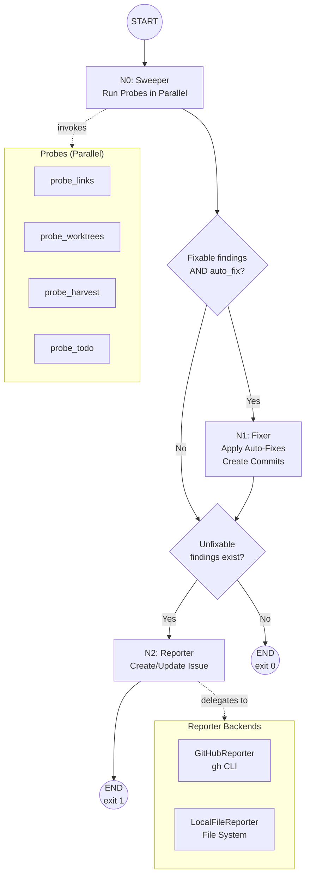

# 94 - Feature: Lu-Tze: The Janitor - Automated Repository Hygiene Workflow

<!-- Template Metadata
Last Updated: 2026-02-17
Updated By: Issue #94 LLD creation
Update Reason: Initial Low-Level Design for automated repository hygiene workflow
-->

## 1. Context & Goal
* **Issue:** #94
* **Objective:** Create a LangGraph-based deterministic maintenance workflow that automatically detects and fixes repository hygiene issues (broken links, stale worktrees, drift, stale TODOs) and reports unfixable findings via GitHub issues.
* **Status:** Draft
* **Related Issues:** None

### Open Questions

- [x] ~~Should `probe_harvest` invoke `assemblyzero-harvest.py` as a subprocess or import it?~~ → Subprocess invocation for isolation and crash containment.
- [x] ~~What is the stale worktree threshold?~~ → 14 days with no commits AND branch merged/deleted.
- [x] ~~Should link fixing handle both relative and absolute internal links?~~ → Relative only per coding standards (0002 §7.1).

## 2. Proposed Changes

*This section is the **source of truth** for implementation. Describes exactly what will be built.*

### 2.1 Files Changed

| File | Change Type | Description |
|------|-------------|-------------|
| `assemblyzero/workflows/janitor/` | Add (Directory) | New package directory for janitor workflow |
| `assemblyzero/workflows/janitor/__init__.py` | Add | Package init with version constant |
| `assemblyzero/workflows/janitor/state.py` | Add | JanitorState TypedDict and related data structures |
| `assemblyzero/workflows/janitor/graph.py` | Add | LangGraph StateGraph definition with 3 nodes |
| `assemblyzero/workflows/janitor/probes/` | Add (Directory) | Probe implementations directory |
| `assemblyzero/workflows/janitor/probes/__init__.py` | Add | Probe package init with registry |
| `assemblyzero/workflows/janitor/probes/registry.py` | Add | Probe registry and base class |
| `assemblyzero/workflows/janitor/probes/links.py` | Add | Broken internal markdown link probe |
| `assemblyzero/workflows/janitor/probes/worktrees.py` | Add | Stale/detached git worktree probe |
| `assemblyzero/workflows/janitor/probes/harvest.py` | Add | Cross-project drift probe via harvest script |
| `assemblyzero/workflows/janitor/probes/todo.py` | Add | Stale TODO comment scanner probe |
| `assemblyzero/workflows/janitor/fixers.py` | Add | Auto-fix implementations for fixable findings |
| `assemblyzero/workflows/janitor/reporter.py` | Add | ReporterInterface ABC with GitHubReporter and LocalFileReporter |
| `assemblyzero/workflows/janitor/commit_templates.py` | Add | Deterministic commit message templates |
| `tools/run_janitor_workflow.py` | Add | CLI entry point with argparse |
| `tests/unit/test_janitor/` | Add (Directory) | Unit test directory for janitor workflow |
| `tests/unit/test_janitor/__init__.py` | Add | Test package init |
| `tests/unit/test_janitor/test_state.py` | Add | Tests for state data structures |
| `tests/unit/test_janitor/test_probes.py` | Add | Tests for all four probes |
| `tests/unit/test_janitor/test_fixers.py` | Add | Tests for fixer logic |
| `tests/unit/test_janitor/test_reporter.py` | Add | Tests for reporter implementations |
| `tests/unit/test_janitor/test_graph.py` | Add | Tests for graph routing and node execution |
| `tests/unit/test_janitor/test_cli.py` | Add | Tests for CLI argument parsing and orchestration |
| `tests/fixtures/janitor/` | Add (Directory) | Test fixtures for janitor tests |
| `tests/fixtures/janitor/mock_repo/` | Add (Directory) | Mock repository structure for link probe tests |
| `tests/fixtures/janitor/mock_repo/README.md` | Add | Mock README with intentional broken links |
| `tests/fixtures/janitor/mock_repo/docs/` | Add (Directory) | Mock docs directory |
| `tests/fixtures/janitor/mock_repo/docs/guide.md` | Add | Mock guide document (link target) |
| `tests/fixtures/janitor/mock_repo/docs/renamed-guide.md` | Add | Renamed target for broken link testing |
| `tests/fixtures/janitor/sample_harvest_output.json` | Add | Sample harvest probe output for testing |
| `tests/fixtures/janitor/sample_todo_files.py` | Add | Python file with stale TODO comments for testing |

### 2.1.1 Path Validation (Mechanical - Auto-Checked)

Mechanical validation automatically checks:
- All "Modify" files must exist in repository → No Modify entries
- All "Delete" files must exist in repository → No Delete entries
- All "Add" files must have existing parent directories → New directories declared before files
- No placeholder prefixes (`src/`, `lib/`, `app/`) unless directory exists → All paths use existing `assemblyzero/`, `tools/`, `tests/` roots

### 2.2 Dependencies

*No new packages required. All dependencies are already available:*

```toml
# Already in pyproject.toml:
# langgraph (>=1.0.7,<2.0.0) — state graph framework
# pathspec (>=1.0.4,<2.0.0) — gitignore-aware file matching
```

External tool dependencies (not Python packages):
- `gh` CLI — for `GitHubReporter` (issue creation/update, PR creation)
- `git` CLI — for worktree operations
- `assemblyzero-harvest.py` — for harvest probe (existing script)

### 2.3 Data Structures

```python
# assemblyzero/workflows/janitor/state.py

from typing import TypedDict, Literal

Severity = Literal["info", "warning", "critical"]
ProbeScope = Literal["links", "worktrees", "harvest", "todo"]
ReporterBackend = Literal["github", "local"]

class Finding(TypedDict):
    """A single issue discovered by a probe."""
    probe: str                    # Name of probe that found this (e.g., "probe_links")
    category: str                 # Grouping category (e.g., "broken_link", "stale_worktree")
    severity: Severity            # "info" | "warning" | "critical"
    message: str                  # Human-readable description
    file_path: str | None         # File where issue was found (if applicable)
    line_number: int | None       # Line number (if applicable)
    fixable: bool                 # Whether auto-fix is possible
    fix_detail: dict | None       # Fix metadata (e.g., {"old_link": "...", "new_link": "..."})

class ProbeResult(TypedDict):
    """Structured output from a single probe execution."""
    probe_name: str               # Identifier of the probe
    status: Literal["success", "error"]  # Did the probe itself succeed?
    error_message: str | None     # Error details if status == "error"
    findings: list[Finding]       # Issues discovered (empty if none)

class FixAction(TypedDict):
    """Record of an auto-fix action taken."""
    category: str                 # Fix category for commit grouping
    description: str              # Human-readable description of fix
    files_modified: list[str]     # Files that were changed
    commit_message: str           # Deterministic commit message
    applied: bool                 # True if actually applied (False for dry-run)

class JanitorConfig(TypedDict):
    """Runtime configuration passed through the graph."""
    scope: list[ProbeScope]       # Which probes to run
    auto_fix: bool                # Enable/disable automatic fixing
    dry_run: bool                 # Preview changes without applying
    silent: bool                  # Suppress stdout except errors
    create_pr: bool               # Create PR instead of direct commits
    reporter_backend: ReporterBackend  # "github" or "local"
    repo_root: str                # Absolute path to repository root

class JanitorState(TypedDict):
    """LangGraph state flowing through the Sweeper → Fixer → Reporter graph."""
    config: JanitorConfig
    probe_results: list[ProbeResult]
    fix_actions: list[FixAction]
    unfixable_findings: list[Finding]
    has_unfixable: bool           # Convenience flag for exit code
    reporter_output: str | None   # Path to local report or GitHub issue URL
    errors: list[str]             # Accumulated non-fatal errors
```

### 2.4 Function Signatures

```python
# --- Probe Registry (assemblyzero/workflows/janitor/probes/registry.py) ---

from abc import ABC, abstractmethod

class BaseProbe(ABC):
    """Abstract base class for all janitor probes."""

    @property
    @abstractmethod
    def name(self) -> str:
        """Unique identifier for this probe (e.g., 'probe_links')."""
        ...

    @property
    @abstractmethod
    def scope_key(self) -> str:
        """Scope key used in CLI --scope flag (e.g., 'links')."""
        ...

    @abstractmethod
    def run(self, repo_root: str) -> ProbeResult:
        """Execute the probe and return structured results.

        Must not raise exceptions — catch all errors and return
        ProbeResult with status='error'.
        """
        ...

def get_probe_registry() -> dict[str, BaseProbe]:
    """Return mapping of scope_key → probe instance for all built-in probes."""
    ...


# --- Probes (assemblyzero/workflows/janitor/probes/links.py) ---

class LinkProbe(BaseProbe):
    """Detects broken internal markdown links within the repository."""

    @property
    def name(self) -> str: ...

    @property
    def scope_key(self) -> str: ...

    def run(self, repo_root: str) -> ProbeResult: ...

    def _find_markdown_files(self, repo_root: str) -> list[str]:
        """Recursively find all .md files, respecting .gitignore."""
        ...

    def _extract_internal_links(self, file_path: str) -> list[tuple[int, str]]:
        """Extract (line_number, link_target) pairs from a markdown file.

        Only extracts relative links (not http/https/mailto).
        Handles [text](path), [text](path#anchor), and .
        """
        ...

    def _resolve_and_check(self, source_file: str, link_target: str, repo_root: str) -> bool:
        """Resolve a relative link from source_file and check if target exists.

        Strips anchor fragments before checking.
        Returns True if target exists, False otherwise.
        """
        ...

    def _find_likely_target(self, broken_path: str, repo_root: str) -> str | None:
        """Attempt to find the likely renamed/moved target for a broken link.

        Strategy:
        1. Search for files with same basename in repo
        2. If exactly one match, return it
        3. If multiple matches, return None (ambiguous, not fixable)
        """
        ...


# --- Probes (assemblyzero/workflows/janitor/probes/worktrees.py) ---

class WorktreeProbe(BaseProbe):
    """Detects stale and detached git worktrees."""

    @property
    def name(self) -> str: ...

    @property
    def scope_key(self) -> str: ...

    def run(self, repo_root: str) -> ProbeResult: ...

    def _list_worktrees(self, repo_root: str) -> list[dict[str, str]]:
        """Parse output of `git worktree list --porcelain`.

        Returns list of dicts with keys: worktree, HEAD, branch.
        """
        ...

    def _is_stale(self, worktree_info: dict[str, str], repo_root: str) -> bool:
        """Determine if a worktree is stale.

        Stale criteria (ALL must be true):
        1. Last commit on branch is >14 days old
        2. Branch has been merged to main OR branch ref is deleted/detached
        """
        ...

    def _get_last_commit_age_days(self, worktree_path: str) -> int | None:
        """Get age in days of the most recent commit in a worktree."""
        ...

    def _is_branch_merged(self, branch: str, repo_root: str) -> bool:
        """Check if branch has been merged into main."""
        ...


# --- Probes (assemblyzero/workflows/janitor/probes/harvest.py) ---

class HarvestProbe(BaseProbe):
    """Detects cross-project drift by invoking assemblyzero-harvest.py."""

    @property
    def name(self) -> str: ...

    @property
    def scope_key(self) -> str: ...

    def run(self, repo_root: str) -> ProbeResult: ...

    def _invoke_harvest(self, repo_root: str) -> tuple[int, str, str]:
        """Invoke assemblyzero-harvest.py as subprocess.

        Returns (return_code, stdout, stderr).
        Timeout: 120 seconds.
        """
        ...

    def _parse_harvest_output(self, stdout: str) -> list[Finding]:
        """Parse harvest script output into structured findings."""
        ...


# --- Probes (assemblyzero/workflows/janitor/probes/todo.py) ---

class TodoProbe(BaseProbe):
    """Scans for TODO comments older than 30 days based on git blame."""

    @property
    def name(self) -> str: ...

    @property
    def scope_key(self) -> str: ...

    def run(self, repo_root: str) -> ProbeResult: ...

    def _find_source_files(self, repo_root: str) -> list[str]:
        """Find all tracked source files (.py, .md, .ts, .js), respecting .gitignore."""
        ...

    def _extract_todos(self, file_path: str) -> list[tuple[int, str]]:
        """Extract (line_number, todo_text) pairs from a file.

        Matches: TODO, FIXME, HACK, XXX (case-insensitive).
        """
        ...

    def _get_line_blame_age_days(self, file_path: str, line_number: int, repo_root: str) -> int | None:
        """Get the age in days of a specific line via git blame.

        Returns None if blame fails (e.g., uncommitted line).
        """
        ...


# --- Graph (assemblyzero/workflows/janitor/graph.py) ---

from langgraph.graph import StateGraph

def build_janitor_graph() -> StateGraph:
    """Build and compile the Janitor LangGraph state graph.

    Nodes:
        sweeper: Runs probes, populates probe_results
        fixer: Applies auto-fixes for fixable findings
        reporter: Reports unfixable findings

    Edges:
        START → sweeper → should_fix? → fixer → should_report? → reporter → END
                                      → should_report? → reporter → END
    """
    ...

def sweeper_node(state: JanitorState) -> dict:
    """Execute all probes in scope and populate probe_results.

    Runs probes concurrently where possible using ThreadPoolExecutor.
    Isolates probe crashes — a probe exception is caught and recorded
    as a ProbeResult with status='error', not propagated.
    """
    ...

def fixer_node(state: JanitorState) -> dict:
    """Apply auto-fixes for all fixable findings.

    Only acts when config.auto_fix is True.
    Groups fixes by category and creates one atomic commit per category.
    In dry_run mode, records what would be done but doesn't apply.
    """
    ...

def reporter_node(state: JanitorState) -> dict:
    """Report unfixable findings via the configured reporter backend.

    Separates unfixable findings from probe_results.
    Delegates to GitHubReporter or LocalFileReporter based on config.
    """
    ...

def should_fix(state: JanitorState) -> str:
    """Conditional edge: route to fixer if auto_fix enabled and fixable findings exist."""
    ...

def should_report(state: JanitorState) -> str:
    """Conditional edge: route to reporter if unfixable findings exist."""
    ...


# --- Fixers (assemblyzero/workflows/janitor/fixers.py) ---

def fix_broken_links(findings: list[Finding], repo_root: str, dry_run: bool) -> list[FixAction]:
    """Fix broken markdown links by updating references to new paths.

    Uses fix_detail['old_link'] and fix_detail['new_link'] from each finding.
    Reads file, replaces old link with new link, writes file.
    Groups all link fixes into a single FixAction/commit.
    """
    ...

def fix_stale_worktrees(findings: list[Finding], repo_root: str, dry_run: bool) -> list[FixAction]:
    """Prune stale worktrees.

    Executes `git worktree remove <path>` for each stale worktree.
    Falls back to `git worktree remove --force <path>` if needed.
    """
    ...

def apply_fixes(findings: list[Finding], repo_root: str, dry_run: bool) -> list[FixAction]:
    """Route fixable findings to appropriate fixer by category.

    Dispatches to fix_broken_links, fix_stale_worktrees, etc.
    Returns combined list of FixAction records.
    """
    ...

def create_fix_commit(fix_action: FixAction, repo_root: str) -> bool:
    """Stage modified files and create a git commit with the fix message.

    Returns True if commit was created, False on failure.
    """
    ...


# --- Reporter (assemblyzero/workflows/janitor/reporter.py) ---

from abc import ABC, abstractmethod

class ReporterInterface(ABC):
    """Abstract interface for reporting unfixable findings."""

    @abstractmethod
    def report(self, findings: list[Finding], fix_actions: list[FixAction]) -> str:
        """Create or update a report with findings and actions taken.

        Returns: identifier string (GitHub issue URL or local file path).
        """
        ...

    @abstractmethod
    def find_existing_report(self) -> str | None:
        """Check if a previous Janitor Report exists.

        Returns: identifier if found, None otherwise.
        """
        ...

class GitHubReporter(ReporterInterface):
    """Reports findings by creating/updating GitHub issues via `gh` CLI."""

    def __init__(self, repo_root: str, create_pr: bool = False):
        """Initialize with repo root and PR preference."""
        ...

    def report(self, findings: list[Finding], fix_actions: list[FixAction]) -> str: ...

    def find_existing_report(self) -> str | None:
        """Search for open issues with title containing '[Janitor Report]'."""
        ...

    def _create_issue(self, title: str, body: str) -> str:
        """Create a new GitHub issue via `gh issue create`."""
        ...

    def _update_issue(self, issue_number: str, body: str) -> str:
        """Update an existing GitHub issue via `gh issue edit`."""
        ...

    def _create_pr(self, title: str, body: str, branch: str) -> str:
        """Create a PR via `gh pr create`."""
        ...

    def _format_issue_body(self, findings: list[Finding], fix_actions: list[FixAction]) -> str:
        """Format findings into categorized markdown for issue body."""
        ...

    def _check_gh_auth(self) -> bool:
        """Verify `gh` CLI authentication (interactive or GITHUB_TOKEN)."""
        ...

class LocalFileReporter(ReporterInterface):
    """Reports findings by writing to local files (no external API calls)."""

    def __init__(self, output_dir: str = "./janitor-reports"):
        """Initialize with output directory path."""
        ...

    def report(self, findings: list[Finding], fix_actions: list[FixAction]) -> str: ...

    def find_existing_report(self) -> str | None:
        """Check for existing report file in output directory."""
        ...


# --- Commit Templates (assemblyzero/workflows/janitor/commit_templates.py) ---

def link_fix_commit_message(files_modified: list[str], links_fixed: int) -> str:
    """Generate deterministic commit message for link fixes.

    Template: 'chore: fix {N} broken markdown link(s) in {M} file(s) (ref #94)'
    """
    ...

def worktree_prune_commit_message(worktrees_pruned: list[str]) -> str:
    """Generate commit message for worktree pruning (no commit needed, but log).

    Template: 'chore: prune {N} stale worktree(s) (ref #94)'
    """
    ...


# --- CLI Entry Point (tools/run_janitor_workflow.py) ---

def parse_args(argv: list[str] | None = None) -> argparse.Namespace:
    """Parse CLI arguments.

    --scope {all|links|worktrees|harvest|todo}
    --auto-fix {true|false}  (default: true)
    --dry-run
    --silent
    --create-pr
    --reporter {github|local}  (default: github)
    """
    ...

def build_config(args: argparse.Namespace) -> JanitorConfig:
    """Convert parsed CLI args into JanitorConfig."""
    ...

def main(argv: list[str] | None = None) -> int:
    """Main entry point. Returns exit code (0=clean, 1=unfixable issues remain)."""
    ...
```

### 2.5 Logic Flow (Pseudocode)

```
CLI Entry (tools/run_janitor_workflow.py):
1. Parse CLI arguments
2. Build JanitorConfig from arguments
3. Detect repo_root (find .git directory walking upward)
4. Build LangGraph state graph
5. Initialize JanitorState with config
6. Invoke graph with initial state
7. IF silent AND no errors → suppress output
8. Return exit code: 0 if has_unfixable is False, 1 otherwise

Sweeper Node:
1. Read config.scope to determine which probes to run
2. Instantiate probes from registry filtered by scope
3. FOR EACH probe IN parallel (ThreadPoolExecutor, max_workers=4):
   TRY:
     result = probe.run(config.repo_root)
   EXCEPT Exception as e:
     result = ProbeResult(probe_name=probe.name, status="error",
                          error_message=str(e), findings=[])
4. Collect all ProbeResults into state.probe_results
5. Return updated state

Fixer Node:
1. IF NOT config.auto_fix → return state unchanged
2. Extract fixable findings: [f for r in probe_results for f in r.findings if f.fixable]
3. IF no fixable findings → return state unchanged
4. Call apply_fixes(fixable_findings, repo_root, dry_run)
5. IF NOT dry_run:
   FOR EACH fix_action:
     create_fix_commit(fix_action, repo_root)
6. IF config.create_pr AND NOT dry_run:
   Create branch, push, create PR
7. Append fix_actions to state
8. Return updated state

Reporter Node:
1. Extract unfixable findings from probe_results
2. Store in state.unfixable_findings
3. Set state.has_unfixable = len(unfixable_findings) > 0
4. IF no unfixable findings AND no probe errors → return state
5. Instantiate reporter based on config.reporter_backend:
   - "github" → GitHubReporter(repo_root, create_pr)
   - "local" → LocalFileReporter("./janitor-reports")
6. Call reporter.report(unfixable_findings, fix_actions)
7. Store reporter output path/URL in state
8. Return updated state

Link Probe Detail:
1. Find all .md files in repo (respecting .gitignore)
2. FOR EACH markdown file:
   a. Extract internal links (relative paths only)
   b. FOR EACH (line_number, link_target):
      - Resolve relative to source file
      - Strip #anchor fragment
      - Check if target file exists
      - IF NOT exists:
        - Attempt to find likely target (same basename elsewhere)
        - IF found uniquely:
          finding.fixable = True
          finding.fix_detail = {old_link: ..., new_link: ...}
        - ELSE:
          finding.fixable = False
3. Return ProbeResult with all findings

Worktree Probe Detail:
1. Run `git worktree list --porcelain`
2. Parse output into structured list
3. FOR EACH worktree (skip main worktree):
   a. Get last commit age in days
   b. Check if branch is merged to main or deleted
   c. IF age > 14 AND (merged OR deleted):
      finding.fixable = True (can prune)
   d. IF age > 14 AND NOT merged:
      finding.fixable = False (needs human judgment)
4. Return ProbeResult

TODO Probe Detail:
1. Find all tracked source files
2. FOR EACH file:
   a. Extract TODO/FIXME/HACK/XXX comments with line numbers
   b. FOR EACH (line_number, todo_text):
      - Run git blame on that line to get commit date
      - Calculate age in days
      - IF age > 30:
        finding.fixable = False (requires human action)
        finding.severity = "warning" if age < 90, "critical" if age >= 90
3. Return ProbeResult

Harvest Probe Detail:
1. Check if assemblyzero-harvest.py exists
2. IF NOT → return ProbeResult with status="error"
3. Invoke as subprocess with 120s timeout
4. Parse stdout for drift findings
5. All harvest findings are fixable=False (require human judgment)
6. Return ProbeResult

GitHub Reporter Detail:
1. Check gh auth status (gh auth status)
2. Search for existing "[Janitor Report]" issue:
   gh issue list --search "[Janitor Report] in:title" --state open --json number
3. Format issue body:
   - Header with timestamp and run metadata
   - Section per severity (critical first)
   - Subsections per category with finding details
   - Summary of auto-fixes applied this run
4. IF existing issue found → update it
   ELSE → create new issue
5. Return issue URL
```

### 2.6 Technical Approach

* **Module:** `assemblyzero/workflows/janitor/`
* **Pattern:** LangGraph StateGraph with typed state, conditional routing, pluggable probe registry
* **Key Decisions:**
  - **LangGraph over plain functions:** Provides state management, conditional routing (skip fixer if nothing fixable), and potential future parallelism — all without writing custom orchestration code
  - **No LLM calls:** Entire workflow is deterministic. Commit messages from templates, no text generation APIs
  - **Subprocess for external tools:** `git`, `gh`, and `assemblyzero-harvest.py` invoked via `subprocess.run()` for crash isolation
  - **ThreadPoolExecutor for probe parallelism:** Probes run concurrently with isolated error handling per probe
  - **Reporter abstraction:** `ReporterInterface` ABC enables `GitHubReporter` for production and `LocalFileReporter` for testing without API calls

### 2.7 Architecture Decisions

| Decision | Options Considered | Choice | Rationale |
|----------|-------------------|--------|-----------|
| Workflow framework | Plain Python functions, LangGraph, Prefect | LangGraph | Already a project dependency; provides state management and conditional routing without new deps |
| Probe execution | Sequential, ThreadPoolExecutor, asyncio | ThreadPoolExecutor | Simple, probes are I/O-bound (git/file ops), no async complexity needed |
| Probe isolation | In-process try/except, subprocess per probe | In-process try/except | Lower overhead; subprocess only for external tools (git, gh, harvest) |
| Commit message generation | LLM-generated, template-based | Template-based | Deterministic, no API cost, no external dependency, testable |
| Reporter backends | GitHub API (PyGithub), `gh` CLI, local files | `gh` CLI + local files | `gh` CLI handles auth natively (including GITHUB_TOKEN); local for testing |
| Link resolution strategy | Fuzzy matching, exact basename, AST parsing | Exact basename matching | Simple, reliable, avoids false positives. Ambiguous matches → not fixable |
| Worktree staleness | Time-only, merge-status-only, both | Both (14 days + merged/deleted) | Prevents premature pruning of active long-running branches |

**Architectural Constraints:**
- Must not introduce new Python package dependencies (use existing langgraph, pathspec)
- Must work on Windows (PowerShell) and Unix (bash) — use `subprocess.run()` not shell-specific syntax
- Must not send repository content to external APIs (no LLM, no telemetry)
- Must produce fully reversible changes (git commits only)

## 3. Requirements

1. Running `python tools/run_janitor_workflow.py` executes all probes and reports findings
2. `--dry-run` flag shows pending fixes without modifying any files or creating issues
3. Broken markdown links are automatically detected and fixed when `--auto-fix true`
4. Stale worktrees (14+ days inactive AND branch merged/deleted) are pruned automatically
5. Unfixable issues create or update a single "[Janitor Report]" GitHub issue (no duplicates)
6. `--silent` mode produces no stdout on success; exit code 0 = clean, 1 = unfixable
7. `--reporter local` writes reports to `./janitor-reports/` without GitHub API calls
8. Probe crashes are isolated — one probe's exception does not stop other probes
9. All auto-fixes produce atomic git commits with deterministic template-based messages
10. CI execution supports `GITHUB_TOKEN` environment variable for headless authentication

## 4. Alternatives Considered

| Option | Pros | Cons | Decision |
|--------|------|------|----------|
| LangGraph state machine | Typed state, conditional routing, built-in retry, aligns with project architecture | Slight overhead for a deterministic workflow | **Selected** |
| Plain Python script | Simpler, no framework dependency | No state management, manual routing, harder to extend | Rejected |
| Prefect / Airflow | Purpose-built for workflows, scheduling built-in | New dependency, overkill for repo-local tasks | Rejected |
| GitHub Actions native | No local tooling needed, runs automatically | Less flexible, harder to test locally, vendor lock-in | Rejected |

**Rationale:** LangGraph is already a project dependency, provides typed state management that fits the Sweeper → Fixer → Reporter pattern, and allows conditional edges (skip fixer when nothing is fixable, skip reporter when nothing is unfixable). The overhead is minimal given the existing project architecture.

## 5. Data & Fixtures

### 5.1 Data Sources

| Attribute | Value |
|-----------|-------|
| Source | Local repository filesystem + git CLI |
| Format | File system paths, git porcelain output, markdown content |
| Size | Bounded by repository size (typically < 10K files) |
| Refresh | On-demand (cron or manual invocation) |
| Copyright/License | N/A (operates on user's own repository) |

### 5.2 Data Pipeline

```
Repository Files ──scan──► Probes ──findings──► Fixer ──commits──► Git
                                  ──unfixable──► Reporter ──issue──► GitHub / Local File
```

### 5.3 Test Fixtures

| Fixture | Source | Notes |
|---------|--------|-------|
| `tests/fixtures/janitor/mock_repo/` | Generated | Minimal repo structure with intentional broken links |
| `tests/fixtures/janitor/sample_harvest_output.json` | Hardcoded | Representative output from harvest script |
| `tests/fixtures/janitor/sample_todo_files.py` | Hardcoded | Python file with TODO comments at various ages |

### 5.4 Deployment Pipeline

No deployment pipeline — tool runs locally or via cron/CI.

Example cron configuration:
```bash
# Run nightly at 2 AM
0 2 * * * cd /path/to/AssemblyZero && python tools/run_janitor_workflow.py --silent --reporter github
```

Example CI (GitHub Actions):
```yaml
- name: Run Janitor
  env:
    GITHUB_TOKEN: ${{ secrets.GITHUB_TOKEN }}
  run: python tools/run_janitor_workflow.py --silent --reporter github
```

## 6. Diagram

### 6.1 Mermaid Quality Gate

- [x] **Simplicity:** Three-node graph, no redundancy
- [x] **No touching:** All elements have visual separation
- [x] **No hidden lines:** All arrows fully visible
- [x] **Readable:** Labels not truncated, flow direction clear
- [ ] **Auto-inspected:** Agent rendered via mermaid.ink and viewed

**Auto-Inspection Results:**
```
- Touching elements: [x] None
- Hidden lines: [x] None
- Label readability: [x] Pass
- Flow clarity: [x] Clear
```

### 6.2 Diagram



## 7. Security & Safety Considerations

### 7.1 Security

| Concern | Mitigation | Status |
|---------|------------|--------|
| Path traversal via link targets | Resolve all paths relative to repo root; reject any path outside repo root using `os.path.commonpath` | Addressed |
| Command injection via file paths | Use `subprocess.run()` with list args (no shell=True); never interpolate paths into shell strings | Addressed |
| GITHUB_TOKEN exposure | Token only used via `gh` CLI environment; never logged, printed, or written to files | Addressed |
| Unauthorized file modification | Fixer only modifies files tracked by git within repo root; all changes are git-committed and reversible | Addressed |
| Malicious probe output | Probes only return typed `ProbeResult` dicts; reporter sanitizes markdown content before GitHub issue body | Addressed |

### 7.2 Safety

| Concern | Mitigation | Status |
|---------|------------|--------|
| Accidental deletion of active worktrees | Staleness requires BOTH 14+ days inactive AND branch merged/deleted; never prunes active work | Addressed |
| Data loss from incorrect link fixes | Only fixes links where exactly one basename match is found; ambiguous cases are marked unfixable | Addressed |
| Runaway subprocess | All subprocess calls have timeout: git (30s), gh (60s), harvest (120s) | Addressed |
| Partial fix leaving repo in bad state | Each fix category is an atomic git commit; partial failure leaves prior commits intact | Addressed |
| Dry-run leaking side effects | dry_run flag checked at every mutation point (file write, git commit, git worktree remove, gh issue create) | Addressed |

**Fail Mode:** Fail Closed — if any uncertainty exists about a fix, the finding is marked `fixable: false` and deferred to human judgment via the reporter.

**Recovery Strategy:** All auto-fixes create standard git commits. Recovery is `git revert <commit>` for any incorrect fix. Worktree pruning is recoverable via `git worktree add` to recreate from the remote branch (if it still exists).

## 8. Performance & Cost Considerations

### 8.1 Performance

| Metric | Budget | Approach |
|--------|--------|----------|
| Total run time | < 60s for typical repo (<5K files) | Parallel probe execution via ThreadPoolExecutor(max_workers=4) |
| Memory | < 256MB | Stream file processing; don't load entire repo into memory |
| Git operations | < 50 subprocess calls per run | Batch blame lookups; use `git worktree list` once |
| File I/O | Read each file at most once per probe | Cache file content within probe execution |

**Bottlenecks:**
- `git blame` for TODO age detection is the slowest operation (one call per TODO line found). Mitigated by only blaming files that actually contain TODO patterns.
- Large repositories (>10K markdown files) may take longer for link scanning. The `pathspec` library efficiently filters by `.gitignore`.

### 8.2 Cost Analysis

| Resource | Unit Cost | Estimated Usage | Monthly Cost |
|----------|-----------|-----------------|--------------|
| LLM API calls | N/A | 0 | $0 |
| GitHub API (via gh) | Free (within rate limits) | 1-2 issue operations per run | $0 |
| Compute (CI runner) | Included in GitHub Actions | ~1 min per run | $0 |

**Cost Controls:**
- [x] No LLM API calls — zero token cost
- [x] GitHub issue deduplication prevents issue spam
- [x] Single reporter call per run (create or update, not both)

**Worst-Case Scenario:** Repository with 100K files and 10K TODO comments. Probe execution may take 5-10 minutes. Mitigated by `--scope` flag to run specific probes only.

## 9. Legal & Compliance

| Concern | Applies? | Mitigation |
|---------|----------|------------|
| PII/Personal Data | No | Tool operates on source code and docs only; no user data processed |
| Third-Party Licenses | No | No new dependencies added; existing deps already audited |
| Terms of Service | N/A | Uses `gh` CLI within standard GitHub API rate limits |
| Data Retention | No | Reports are stored in-repo (git-tracked) or as GitHub issues |
| Export Controls | No | No cryptographic or restricted algorithms |

**Data Classification:** Internal (repository source code and metadata)

**Compliance Checklist:**
- [x] No PII stored without consent — no PII processed at all
- [x] All third-party licenses compatible — no new deps
- [x] External API usage compliant — `gh` CLI within GitHub ToS
- [x] Data retention policy documented — git history is the retention mechanism

## 10. Verification & Testing

### 10.0 Test Plan (TDD - Complete Before Implementation)

| Test ID | Test Description | Expected Behavior | Status |
|---------|------------------|-------------------|--------|
| T010 | JanitorState initialization | All fields have correct types and defaults | RED |
| T020 | Finding construction with all fields | TypedDict validates all required fields | RED |
| T030 | ProbeResult with error status | Error message populated, findings empty | RED |
| T040 | LinkProbe detects broken link | Returns finding with fixable=True when unique target exists | RED |
| T050 | LinkProbe detects ambiguous broken link | Returns finding with fixable=False when multiple matches | RED |
| T060 | LinkProbe ignores external links | HTTP/HTTPS links not scanned | RED |
| T070 | LinkProbe handles anchor fragments | `file.md#section` resolved correctly (fragment stripped) | RED |
| T080 | WorktreeProbe detects stale worktree | Returns finding for 14+ day old merged-branch worktree | RED |
| T090 | WorktreeProbe skips active worktree | No finding for recent-activity worktree | RED |
| T100 | WorktreeProbe skips main worktree | Main worktree never flagged | RED |
| T110 | TodoProbe finds stale TODO | Returns finding for TODO > 30 days old | RED |
| T120 | TodoProbe ignores recent TODO | No finding for TODO < 30 days old | RED |
| T130 | TodoProbe severity escalation | TODO > 90 days gets "critical" severity | RED |
| T140 | HarvestProbe handles missing script | Returns ProbeResult with status="error" | RED |
| T150 | HarvestProbe timeout handling | Returns error after 120s timeout | RED |
| T160 | fix_broken_links replaces link text | File content updated with new link path | RED |
| T170 | fix_broken_links dry_run mode | No files modified, FixAction.applied=False | RED |
| T180 | fix_stale_worktrees invokes git prune | Subprocess called with correct arguments | RED |
| T190 | fix_stale_worktrees dry_run mode | No subprocess called, FixAction.applied=False | RED |
| T200 | commit_templates deterministic output | Same input → same output every time | RED |
| T210 | LocalFileReporter creates report file | Markdown file written to output directory | RED |
| T220 | LocalFileReporter finds existing report | Detects previous report file | RED |
| T230 | GitHubReporter formats issue body | Correct markdown with severity sections | RED |
| T240 | GitHubReporter deduplicates issues | Finds existing "[Janitor Report]" issue | RED |
| T250 | Graph routes to fixer when fixable | Fixer node executed when fixable findings exist | RED |
| T260 | Graph skips fixer when nothing fixable | Fixer node not executed | RED |
| T270 | Graph routes to reporter when unfixable | Reporter node executed when unfixable findings exist | RED |
| T280 | Graph skips reporter when all fixed | Reporter node not executed, exit code 0 | RED |
| T290 | CLI parses --scope links | Config.scope = ["links"] | RED |
| T300 | CLI parses --dry-run | Config.dry_run = True | RED |
| T310 | CLI validates invalid scope | Error message and non-zero exit | RED |
| T320 | Probe crash isolation | One probe exception doesn't stop others | RED |
| T330 | Exit code 0 when no unfixable | main() returns 0 | RED |
| T340 | Exit code 1 when unfixable remain | main() returns 1 | RED |
| T350 | Silent mode suppresses output | No stdout when --silent and no errors | RED |
| T360 | Path traversal rejected | Link target outside repo root → not fixable | RED |

**Coverage Target:** ≥95% for all new code

**TDD Checklist:**
- [ ] All tests written before implementation
- [ ] Tests currently RED (failing)
- [ ] Test IDs match scenario IDs in 10.1
- [ ] Test files created at: `tests/unit/test_janitor/`

### 10.1 Test Scenarios

| ID | Scenario | Type | Input | Expected Output | Pass Criteria |
|----|----------|------|-------|-----------------|---------------|
| 010 | State initialization | Auto | Default JanitorConfig | Valid JanitorState with empty lists | All fields typed correctly |
| 020 | Finding construction | Auto | Complete Finding dict | All fields accessible | No KeyError on access |
| 030 | ProbeResult error | Auto | Exception in probe | ProbeResult.status="error" | error_message populated |
| 040 | Broken link detected (fixable) | Auto | README.md → old-guide.md (renamed to guide.md) | Finding with fixable=True | fix_detail has old/new paths |
| 050 | Broken link (ambiguous) | Auto | Link to name matching 2+ files | Finding with fixable=False | fix_detail is None |
| 060 | External link ignored | Auto | `[text](https://example.com)` | No findings | findings list empty |
| 070 | Anchor fragment handling | Auto | `[text](guide.md#section)` | Link resolved to guide.md | Anchor stripped before check |
| 080 | Stale worktree detected | Auto | Mock worktree 15 days old, branch merged | Finding with fixable=True | category="stale_worktree" |
| 090 | Active worktree ignored | Auto | Mock worktree 2 days old | No findings | findings list empty |
| 100 | Main worktree skipped | Auto | Main worktree entry | No findings | Main never flagged |
| 110 | Stale TODO found | Auto | TODO comment 35 days old (mocked blame) | Finding with severity="warning" | fixable=False |
| 120 | Recent TODO ignored | Auto | TODO comment 5 days old | No findings | findings list empty |
| 130 | Critical TODO age | Auto | TODO comment 100 days old | Finding with severity="critical" | Severity escalated |
| 140 | Missing harvest script | Auto | Non-existent script path | ProbeResult.status="error" | Graceful error |
| 150 | Harvest timeout | Auto | Mock subprocess hanging | ProbeResult.status="error" | TimeoutExpired handled |
| 160 | Link fix applied | Auto | Finding with fix_detail | File updated with new link | Old link replaced |
| 170 | Link fix dry run | Auto | dry_run=True | No file changes | FixAction.applied=False |
| 180 | Worktree prune | Auto | Mock subprocess | git worktree remove called | Correct args passed |
| 190 | Worktree prune dry run | Auto | dry_run=True | No subprocess call | FixAction.applied=False |
| 200 | Commit message template | Auto | 3 files, 5 links fixed | "chore: fix 5 broken markdown link(s) in 3 file(s) (ref #94)" | Exact string match |
| 210 | LocalFileReporter output | Auto | 3 findings | Markdown file in output dir | File exists and contains findings |
| 220 | LocalFileReporter dedup | Auto | Existing report file | Same file updated | File content updated |
| 230 | GitHub issue body format | Auto | Mixed severity findings | Markdown with critical section first | Sections ordered by severity |
| 240 | GitHub issue dedup | Auto | Mock `gh issue list` output | Existing issue number returned | No duplicate created |
| 250 | Graph routes to fixer | Auto | State with fixable findings | fixer_node invoked | fix_actions populated |
| 260 | Graph skips fixer | Auto | State with no fixable findings | fixer_node not invoked | fix_actions empty |
| 270 | Graph routes to reporter | Auto | State with unfixable findings | reporter_node invoked | reporter_output populated |
| 280 | Graph skips reporter | Auto | State with all fixed | reporter_node not invoked | has_unfixable=False |
| 290 | CLI --scope links | Auto | `["--scope", "links"]` | config.scope=["links"] | Only links probe runs |
| 300 | CLI --dry-run | Auto | `["--dry-run"]` | config.dry_run=True | No mutations |
| 310 | CLI invalid scope | Auto | `["--scope", "invalid"]` | SystemExit with error | Error message shown |
| 320 | Probe crash isolation | Auto | One probe raises RuntimeError | Other probes still execute | 3 ProbeResults + 1 error |
| 330 | Exit code 0 | Auto | All findings fixable and fixed | Return 0 | Process exit code |
| 340 | Exit code 1 | Auto | Some findings unfixable | Return 1 | Process exit code |
| 350 | Silent mode | Auto | `["--silent"]`, no errors | Empty stdout | stdout captured is empty |
| 360 | Path traversal | Auto | Link target `../../etc/passwd` | Finding fixable=False | Outside repo root rejected |

### 10.2 Test Commands

```bash
# Run all janitor unit tests
poetry run pytest tests/unit/test_janitor/ -v

# Run with coverage
poetry run pytest tests/unit/test_janitor/ -v --cov=assemblyzero.workflows.janitor --cov-report=term-missing

# Run specific test file
poetry run pytest tests/unit/test_janitor/test_probes.py -v

# Run specific test by name
poetry run pytest tests/unit/test_janitor/test_probes.py -k "test_broken_link_detected" -v
```

### 10.3 Manual Tests (Only If Unavoidable)

| ID | Scenario | Why Not Automated | Steps |
|----|----------|-------------------|-------|
| M010 | End-to-end link fixing | Requires actual git repo state with commits | 1. Create test md with valid link → 2. Rename target → 3. Run janitor → 4. Verify link updated → 5. Verify git commit created |
| M020 | End-to-end worktree prune | Requires actual git worktrees | 1. Create worktree → 2. Delete branch → 3. Run janitor → 4. Verify worktree pruned |
| M030 | GitHub issue creation | Requires `gh` auth and live GitHub | 1. Introduce unfixable issue → 2. Run with `--reporter github` → 3. Verify issue created → 4. Run again → 5. Verify same issue updated |
| M040 | CI authentication | Requires `GITHUB_TOKEN` environment | 1. Set GITHUB_TOKEN → 2. Run `--silent` → 3. Verify no interactive prompts → 4. Verify success |

**Justification:** These tests require actual git repository state (worktrees, commits, branches) and external service integration (GitHub API) that cannot be fully mocked without losing the verification value.

## 11. Risks & Mitigations

| Risk | Impact | Likelihood | Mitigation |
|------|--------|------------|------------|
| Link fixer replaces wrong occurrence in file | Med | Low | Use exact match of `](old_path)` pattern, not substring; verify only one replacement per occurrence |
| Worktree prune removes worktree with uncommitted work | High | Low | Staleness check requires branch merged/deleted; `git worktree remove` (without --force initially) fails if dirty |
| `gh` CLI not installed or not authenticated | Med | Med | Check `gh auth status` at startup; fall back to LocalFileReporter with warning |
| `assemblyzero-harvest.py` script missing or incompatible | Low | Med | Probe returns status="error" gracefully; other probes unaffected |
| Git blame performance on large repos | Med | Med | Only blame lines that match TODO patterns; timeout per blame call (5s) |
| Concurrent janitor runs conflict | Med | Low | Use file-based lock (`janitor.lock` in repo root) to prevent concurrent execution |
| Windows path separator issues | Med | Med | Use `pathlib.Path` throughout; normalize all paths with `Path.as_posix()` for link comparison |

## 12. Definition of Done

### Code
- [ ] All files in Section 2.1 created and linted
- [ ] LangGraph state graph compiles and runs
- [ ] All four probes implemented and functional
- [ ] Fixer system handles links and worktrees
- [ ] Reporter interface with both implementations
- [ ] CLI with all documented flags
- [ ] Code comments reference this LLD (#94)

### Tests
- [ ] All 36 test scenarios pass
- [ ] Test coverage ≥95% for `assemblyzero/workflows/janitor/`
- [ ] All tests use `LocalFileReporter` or mocks (no live API calls in unit tests)

### Documentation
- [ ] LLD updated with any deviations from implementation
- [ ] Implementation Report (`docs/reports/94/implementation-report.md`) completed
- [ ] Test Report (`docs/reports/94/test-report.md`) completed
- [ ] `tools/run_janitor_workflow.py --help` documents all flags
- [ ] New files added to `docs/0003-file-inventory.md`

### Review
- [ ] Code review completed (Gemini implementation review)
- [ ] User approval before closing issue

### 12.1 Traceability (Mechanical - Auto-Checked)

Every file in this section's checklist appears in Section 2.1:
- `assemblyzero/workflows/janitor/__init__.py` ✓
- `assemblyzero/workflows/janitor/state.py` ✓
- `assemblyzero/workflows/janitor/graph.py` ✓
- `assemblyzero/workflows/janitor/probes/registry.py` ✓
- `assemblyzero/workflows/janitor/probes/links.py` ✓
- `assemblyzero/workflows/janitor/probes/worktrees.py` ✓
- `assemblyzero/workflows/janitor/probes/harvest.py` ✓
- `assemblyzero/workflows/janitor/probes/todo.py` ✓
- `assemblyzero/workflows/janitor/fixers.py` ✓
- `assemblyzero/workflows/janitor/reporter.py` ✓
- `assemblyzero/workflows/janitor/commit_templates.py` ✓
- `tools/run_janitor_workflow.py` ✓
- `tests/unit/test_janitor/test_state.py` ✓
- `tests/unit/test_janitor/test_probes.py` ✓
- `tests/unit/test_janitor/test_fixers.py` ✓
- `tests/unit/test_janitor/test_reporter.py` ✓
- `tests/unit/test_janitor/test_graph.py` ✓
- `tests/unit/test_janitor/test_cli.py` ✓

Risk mitigations mapped to functions:
- Path traversal (R360) → `LinkProbe._resolve_and_check()` validates repo boundary
- Concurrent runs (R11) → `main()` acquires file lock at startup
- Windows paths (R11) → all path functions use `pathlib.Path`
- gh auth failure (R11) → `GitHubReporter._check_gh_auth()` with fallback

---

## Appendix: Review Log

*Track all review feedback with timestamps and implementation status.*

### Review Summary

| Review | Date | Verdict | Key Issue |
|--------|------|---------|-----------|
| — | — | — | Awaiting initial review |

**Final Status:** PENDING