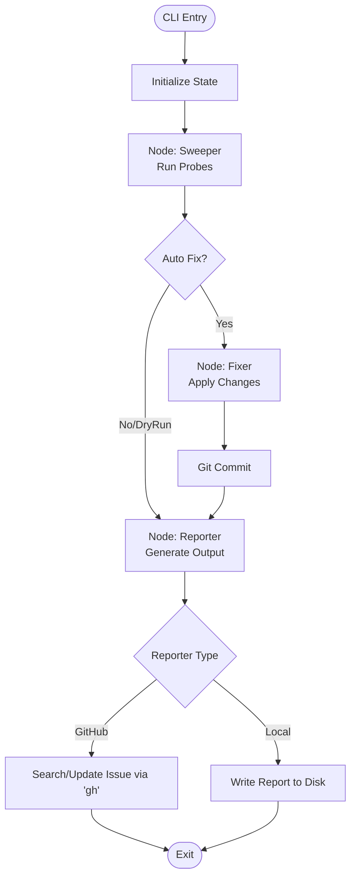

# 194 - Feature: The Janitor: Automated Repository Hygiene Workflow

## 1. Context & Goal
* **Issue:** #94
* **Objective:** Create `tools/run_janitor_workflow.py`, a LangGraph-based maintenance workflow that continuously monitors and fixes repository hygiene issues, replacing manual audit checklists with automated enforcement.
* **Status:** Draft
* **Related Issues:** N/A (Supersedes manual audit docs 0834, 0838, 0840)

### Open Questions
None - requirements are well-defined from issue.

## 2. Proposed Changes

### 2.1 Files Changed
| File Path | Description |
|-----------|-------------|
| `tools/run_janitor_workflow.py` | CLI entry point handling args and graph invocation |
| `agentos/workflows/janitor/__init__.py` | Package initialization |
| `agentos/workflows/janitor/graph.py` | LangGraph workflow definition (Nodes and Edges) |
| `agentos/workflows/janitor/state.py` | `JanitorState` TypedDict definition |
| `agentos/workflows/janitor/probes/__init__.py` | Probe registry and base class |
| `agentos/workflows/janitor/probes/links.py` | Implementation of broken markdown link scanner |
| `agentos/workflows/janitor/probes/worktrees.py` | Implementation of stale worktree scanner |
| `agentos/workflows/janitor/probes/harvest.py` | Wrapper around `agentos-harvest.py` for drift detection |
| `agentos/workflows/janitor/probes/todo.py` | Scanner for TODOs > 30 days old |
| `agentos/workflows/janitor/fixers.py` | Logic to apply fixes for `fixable=True` findings |
| `agentos/workflows/janitor/reporter.py` | Abstract `ReporterInterface` and implementations (GitHub/Local) |

### 2.2 Dependencies
* **langgraph**: For workflow state management.
* **gh (GitHub CLI)**: System dependency required for `GitHubReporter` operations.
* **Git**: System dependency for file/worktree operations.

### 2.3 Data Structures

```python
from typing import List, TypedDict, Optional, Literal, Dict

class JanitorFinding(TypedDict):
    id: str                  # unique hash of finding
    category: str            # e.g., 'broken_link', 'stale_worktree'
    severity: Literal['info', 'warning', 'critical']
    description: str
    location: str            # File path or resource name
    fixable: bool
    payload: Dict            # Context data needed for fixing (e.g., {'old_path': ..., 'new_path': ...})

class JanitorState(TypedDict):
    scope: List[str]         # Probes to run
    auto_fix: bool           # Whether to apply fixes
    dry_run: bool            # If True, no changes applied
    findings: List[JanitorFinding]
    fixed_findings: List[JanitorFinding]
    failed_fixes: List[JanitorFinding]
    errors: List[str]        # Runtime errors (e.g., probe crashes)
    report_location: str     # URL or path to final report
```

### 2.4 Function Signatures

```python
# agentos/workflows/janitor/probes/__init__.py
class ProbeInterface(ABC):
    @abstractmethod
    def run(self) -> List[JanitorFinding]:
        """Executes the probe and returns findings."""
        pass

# agentos/workflows/janitor/reporter.py
class ReporterInterface(ABC):
    @abstractmethod
    def report(self, state: JanitorState) -> str:
        """Generates report and returns location (URL or path)."""
        pass

# agentos/workflows/janitor/graph.py
def node_sweeper(state: JanitorState) -> JanitorState:
    """Runs all selected probes and aggregates findings."""
    pass

def node_fixer(state: JanitorState) -> JanitorState:
    """Iterates findings, applies fixes if fixable and auto_fix=True."""
    pass

def node_reporter(state: JanitorState) -> JanitorState:
    """Formats results and sends to selected Reporter backend."""
    pass

# tools/run_janitor_workflow.py
def main():
    """Parses args (scope, reporter, silent, etc) and invokes graph."""
    pass
```

### 2.5 Logic Flow (Pseudocode)

**Graph Execution Flow:**

```python
def workflow(initial_state):
    # 1. Sweeper Node
    state = initial_state
    for probe_name in state['scope']:
        try:
            probe = get_probe(probe_name)
            results = probe.run()
            state['findings'].extend(results)
        except Exception as e:
            state['errors'].append(f"Probe {probe_name} crashed: {e}")

    # 2. Fixer Node
    if state['auto_fix']:
        for finding in state['findings']:
            if finding['fixable']:
                if state['dry_run']:
                    log(f"[DRY RUN] Would fix: {finding['description']}")
                else:
                    success = apply_fix(finding) # commits changes
                    if success:
                        state['fixed_findings'].append(finding)
                    else:
                        state['failed_fixes'].append(finding)

    # 3. Reporter Node
    reporter = get_reporter(initial_state['reporter_type'])
    report_url = reporter.report(state)
    state['report_location'] = report_url

    return state
```

### 2.6 Technical Approach
*   **Pattern:** Pipeline / State Machine using LangGraph.
*   **Isolation:** Each probe runs in a try/except block within `node_sweeper` to ensure one crashing probe doesn't halt the entire cleanup process.
*   **Reporter Strategy:** Strategy Pattern for the Reporter. The CLI injects either `GitHubReporter` (uses `gh` subprocess calls) or `LocalFileReporter` (writes markdown to disk) into the graph state/config.
*   **Fix Atomicity:** Each fix creates a distinct git commit. If `create_pr` is requested, commits are pushed to a branch and a PR is opened via `gh`.

## 3. Requirements

1.  **Probe Execution:** Must run specified probes (links, worktrees, harvest, todo) and return structured JSON.
2.  **Error Isolation:** Probe failures (exceptions) must be logged but must not stop other probes.
3.  **Auto-Fixing:** Must automatically apply fixes for `fixable: true` findings when `auto_fix=True`.
4.  **Dry Run:** Must support `--dry-run` to log intent without modifying files.
5.  **Deduplicated Reporting:** `GitHubReporter` must update existing open "Janitor Report" issues rather than creating duplicates.
6.  **Silent Mode:** `--silent` must output nothing to stdout unless a critical error occurs or exit code is non-zero.
7.  **Authentication:** Must support `GITHUB_TOKEN` environment variable for CI/Headless operation.
8.  **Local Testing:** `LocalFileReporter` must function fully offline without API calls.

## 4. Alternatives Considered

| Alternative | Pros | Cons | Decision |
|-------------|------|------|----------|
| **LLM-based Fixes** | Can fix complex logic errors. | Non-deterministic; high risk of hallucinations; API costs. | **Rejected** (Determinism required). |
| **GitHub Actions (YAML)** | Native integration. | Logic too complex for YAML; hard to test locally. | **Rejected** (Need Python logic). |
| **Pre-commit Hooks** | Immediate feedback. | Too slow for heavy scans (links/drift); blocks dev flow. | **Rejected** (Async preferred). |
| **Custom State Class** | Lightweight. | Re-inventing the wheel; LangGraph provides visualization/checkpoints free. | **Rejected** (Use LangGraph). |

## 5. Data & Fixtures

### 5.1 Data Sources
| Source | Type | Attributes |
|--------|------|------------|
| File System | Read/Write | Markdown files, source code (for TODOs). |
| Git Index | Read/Write | Worktrees, branches, status. |
| GitHub API | Read/Write | Issues, PRs (via `gh` CLI). |

### 5.2 Data Pipeline
```
[File System/Git] -> (Probes) -> [JanitorState] -> (Fixer) -> [Git Commit]
                                      |
                                      v
                                 (Reporter)
                                      |
                           [GitHub Issue / Local File]
```

### 5.3 Test Fixtures
| Fixture | Description |
|---------|-------------|
| `mock_gh_cli` | Python mock to intercept `subprocess.run(["gh", ...])`. |
| `temp_git_repo` | A temporary folder initialized as a git repo with specific broken links/worktrees. |
| `mock_findings` | Pre-canned list of `JanitorFinding` objects to test Fixer/Reporter logic in isolation. |

### 5.4 Deployment Pipeline
*   **CI:** Runs `python tools/run_janitor_workflow.py --silent --reporter github` on schedule (cron).
*   **Env:** Requires `GITHUB_TOKEN` in secrets.

## 6. Diagram

### 6.1 Mermaid Quality Gate
- [x] Node names are clear
- [x] State flow is directional
- [x] Decision points are labeled

### 6.2 Diagram


## 7. Security Considerations

| Concern | Mitigation |
|---------|------------|
| **Unintended Changes** | `--dry-run` is available; Fixes are atomic Git commits (reversible). |
| **Infinite Loops** | Reporter deduplicates issues (checks for existing title). Fixer doesn't run on own commits. |
| **Secret Leakage** | `JanitorFinding` payload must not contain sensitive data; Reporter logs are sanitized. |
| **Access Control** | Uses `gh` CLI context; in CI, relies on strict `GITHUB_TOKEN` permissions (Repo Write). |

## 8. Performance Considerations

| Metric | Budget | Strategy |
|--------|--------|----------|
| **Execution Time** | < 5 minutes | Parallelize probes if possible (though Python GIL limits this, IO bound checks are fine). |
| **Memory Usage** | < 500MB | Stream file reading for TODO scanner; don't load huge files into State. |
| **API Rate Limits** | Minimal | Only 1 search + 1 update call per run to GitHub; deduplicate locally first. |

## 9. Risks & Mitigations

| Risk | Impact | Likelihood | Mitigation |
|------|--------|------------|------------|
| **False Positives** | Code breakage | Low | Fixers are regex/deterministic based. Only "safe" mechanical fixes allowed. |
| **`gh` CLI Missing** | Crash | Medium | Check for `gh` presence at startup; fallback to Local reporter if not found (warn user). |
| **Merge Conflicts** | Fix rejection | Low | Fixer fetches latest before committing; or use PR mode. |

## 10. Verification & Testing

### 10.1 Test Scenarios
| ID | Scenario | Type | Input | Output | Criteria |
|----|----------|------|-------|--------|----------|
| T1 | Happy Path - Link Fix | Int | File renamed, old link in README | File updated | `grep` finds new link, Git status clean (committed). |
| T2 | Stale Worktree | Int | Git worktree > 14 days old | Worktree pruned | `git worktree list` excludes target. |
| T3 | Unfixable Issue | Int | Circular Dep | GitHub Issue | `LocalFileReporter` contains "Circular Dep" warning. |
| T4 | Dry Run | Unit | Fixable findings present | Log only | Files untouched; State contains "would fix". |
| T5 | Reporter Dedupe | Unit | Existing issue ID provided | Update call | Mock `gh` receives `issue edit` not `issue create`. |

### 10.2 Test Commands
```bash
# Unit tests
pytest tests/workflows/janitor/

# Integration test (Local Reporter)
python tools/run_janitor_workflow.py --scope links --reporter local --dry-run
```

### 10.3 Manual Tests (Only If Unavoidable)
| ID | Scenario |
|----|----------|
| M1 | Run with real `gh` CLI against a private test repo to verify Issue creation formatting. |

## 11. Definition of Done

### Code
- [ ] `JanitorState` and `JanitorFinding` implemented.
- [ ] 3 LangGraph nodes (Sweeper, Fixer, Reporter) active.
- [ ] Probes: Links, Worktrees, Harvest, Todo implemented.
- [ ] Fixers implemented for Links and Worktrees.
- [ ] `GitHubReporter` and `LocalFileReporter` implemented.

### Tests
- [ ] Unit tests for regex patterns in Link probe.
- [ ] Mock tests for `gh` CLI interactions.
- [ ] End-to-end flow test using `LocalFileReporter`.

### Documentation
- [ ] `tools/run_janitor_workflow.py --help` output is clear.
- [ ] Wiki updated with Janitor usage instructions.
- [ ] Deprecated manual audit docs marked as "Superseded by Janitor".

### Review
- [ ] Code review by peer.
- [ ] Implementation report verified against Requirements.

---

## Appendix: Review Log

### Review Summary

| Review | Date | Verdict | Key Issue |
|--------|------|---------|-----------|
| - | - | - | - |

**Final Status:** DRAFT - PENDING REVIEW