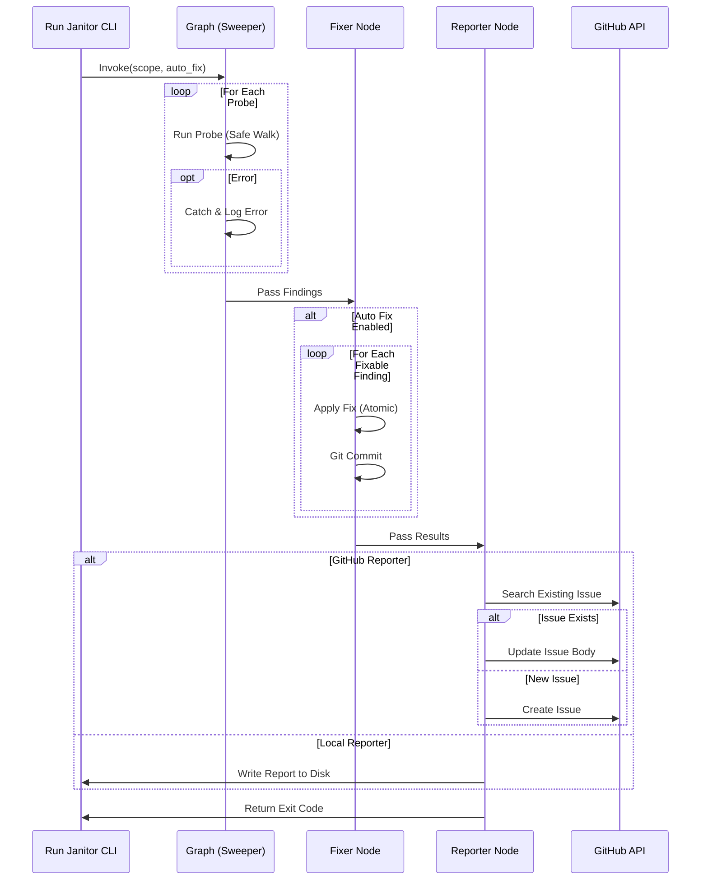

# 194 - Feature: The Janitor: Automated Repository Hygiene Workflow

## 1. Context & Goal
* **Issue:** #94
* **Objective:** Create `tools/run_janitor_workflow.py`, a LangGraph-based maintenance workflow that continuously monitors and fixes repository hygiene issues, replacing manual audit checklists with automated enforcement.
* **Status:** Draft
* **Related Issues:** N/A (Supersedes manual audit docs 0834, 0838, 0840)

### Open Questions
None - requirements are well-defined from issue.

## 2. Proposed Changes

### 2.1 Files Changed
| File Path | Description |
|-----------|-------------|
| `tools/run_janitor_workflow.py` | CLI entry point handling args and graph invocation. |
| `agentos/workflows/janitor/__init__.py` | Package initialization. |
| `agentos/workflows/janitor/graph.py` | LangGraph workflow definition (Sweeper, Fixer, Reporter nodes). |
| `agentos/workflows/janitor/state.py` | `JanitorState` and `JanitorFinding` TypedDict definitions. |
| `agentos/workflows/janitor/utils.py` | Safe file traversal utilities (symlink protection, ignore patterns). |
| `agentos/workflows/janitor/probes/__init__.py` | Probe registry and abstract base class. |
| `agentos/workflows/janitor/probes/links.py` | Implementation of broken markdown link scanner. |
| `agentos/workflows/janitor/probes/worktrees.py` | Implementation of stale worktree scanner. |
| `agentos/workflows/janitor/probes/harvest.py` | Wrapper around `agentos-harvest.py` for drift detection. |
| `agentos/workflows/janitor/probes/todo.py` | Scanner for TODOs > 30 days old. |
| `agentos/workflows/janitor/fixers.py` | Logic to apply fixes for `fixable=True` findings. |
| `agentos/workflows/janitor/reporter.py` | Abstract `ReporterInterface` and implementations (GitHub/Local). |

### 2.2 Dependencies
* **langgraph**: For workflow state management.
* **gh (GitHub CLI)**: System dependency required for `GitHubReporter` operations.
* **Git**: System dependency for file/worktree operations.

### 2.3 Data Structures

```python
from typing import List, TypedDict, Optional, Literal, Dict, Any

class JanitorFinding(TypedDict):
    id: str                  # unique hash of finding (category + location + content)
    category: str            # e.g., 'broken_link', 'stale_worktree'
    severity: Literal['info', 'warning', 'critical']
    description: str
    location: str            # File path relative to repo root
    fixable: bool
    payload: Dict[str, Any]  # Context data needed for fixing (e.g., {'old_path': ..., 'new_path': ...})

class JanitorState(TypedDict):
    repo_root: str           # Absolute path to repository root (safety boundary)
    scope: List[str]         # Probes to run
    auto_fix: bool           # Whether to apply fixes
    dry_run: bool            # If True, no changes applied
    silent: bool             # Output suppression
    reporter_type: str       # 'github' or 'local'
    findings: List[JanitorFinding]
    fixed_findings: List[JanitorFinding]
    failed_fixes: List[JanitorFinding]
    errors: List[str]        # Runtime errors (e.g., probe crashes)
    report_location: str     # URL or path to final report
```

### 2.4 Function Signatures

```python
# agentos/workflows/janitor/utils.py
def safe_walk(root: str, ignore_dirs: List[str] = None) -> Generator[str, None, None]:
    """
    Generator that walks directory tree safely.
    - Aborts if path escapes root.
    - Skips symlinks to prevent loops.
    - Skips specified ignore_dirs (e.g. .git, node_modules).
    """
    pass

# agentos/workflows/janitor/probes/__init__.py
class ProbeInterface(ABC):
    @abstractmethod
    def run(self, state: JanitorState) -> List[JanitorFinding]:
        """Executes the probe and returns findings."""
        pass

# agentos/workflows/janitor/graph.py
def node_sweeper(state: JanitorState) -> JanitorState:
    """Runs all selected probes in parallel/sequence and aggregates findings."""
    pass

def node_fixer(state: JanitorState) -> JanitorState:
    """Iterates findings, applies fixes if fixable and auto_fix=True."""
    pass

def node_reporter(state: JanitorState) -> JanitorState:
    """Formats results and sends to selected Reporter backend."""
    pass

# agentos/workflows/janitor/reporter.py
class ReporterInterface(ABC):
    @abstractmethod
    def report(self, state: JanitorState) -> str:
        """
        Generates report.
        For GitHub: searches for existing issue by title, updates or creates new.
        For Local: writes markdown file.
        Returns URL or path.
        """
        pass
```

### 2.5 Logic Flow (Pseudocode)

```python
# tools/run_janitor_workflow.py
def main():
    args = parse_args()
    initial_state = {
        "repo_root": os.getcwd(),
        "scope": args.scope,
        "auto_fix": args.auto_fix,
        "dry_run": args.dry_run,
        "findings": [],
        ...
    }
    app = Workflow()
    app.add_node("sweeper", node_sweeper)
    app.add_node("fixer", node_fixer)
    app.add_node("reporter", node_reporter)
    
    app.set_entry_point("sweeper")
    app.add_edge("sweeper", "fixer")
    app.add_edge("fixer", "reporter")
    app.add_edge("reporter", END)
    
    result = app.invoke(initial_state)
    exit(0 if not result['errors'] else 1)

# agentos/workflows/janitor/graph.py -> node_sweeper
def node_sweeper(state):
    probes = load_probes(state['scope'])
    for probe in probes:
        try:
            # Enforce safety: Probes receive state but must use safe_walk utils
            findings = probe.run(state)
            state['findings'].extend(findings)
        except Exception as e:
            # Fault isolation
            state['errors'].append(f"Probe {probe.name} crashed: {str(e)}")
    return state

# agentos/workflows/janitor/graph.py -> node_fixer
def node_fixer(state):
    if not state['auto_fix']:
        return state

    for finding in state['findings']:
        if finding['fixable']:
            fixer = get_fixer(finding['category'])
            try:
                if state['dry_run']:
                    log(f"[DRY] Would fix: {finding['description']}")
                else:
                    fixer.apply(finding, state['repo_root'])
                    commit_changes(finding) # Atomic commit per fix
                    state['fixed_findings'].append(finding)
            except Exception as e:
                state['failed_fixes'].append(finding)
                state['errors'].append(f"Fix failed for {finding['id']}: {e}")
    return state
```

### 2.6 Technical Approach
*   **Safety First:** Implementation of `safe_walk` in `utils.py` is critical. It must prevent directory traversal attacks and infinite recursion via symlinks. All file-scanning probes (`links`, `todo`) must use this utility instead of raw `os.walk`.
*   **LangGraph Pipeline:** Used for structured execution. While simple now, this allows future complexity (e.g., "Ask Human" node for ambiguous fixes) without refactoring.
*   **Reporter Strategy:** The `ReporterInterface` handles the logic of "Create vs Update". It queries the destination (GitHub API or FS) to check for existing reports based on a deterministic title format (e.g., "Janitor Report: Automated Hygiene Scan").
*   **Fix Atomicity:** Each fix operation creates a discrete Git commit. This ensures that if the process is interrupted, the repo isn't left in a dirty, halfway-fixed state.

## 3. Requirements

1.  **Safety Boundaries:** Probes must strictly operate within `repo_root`. Symlinks pointing outside root must be ignored.
2.  **Fault Tolerance:** A single probe crash must not prevent other probes from running or the report from being generated.
3.  **Idempotency:** Repeated runs should not create duplicate issues or duplicate commits for the same fix.
4.  **CLI Interface:** Must support `--dry-run`, `--silent`, `--scope`, and `--reporter`.
5.  **GitHub Integration:** Must authenticate via `gh` CLI (user session) or `GITHUB_TOKEN` (CI).
6.  **Worktree Hygiene:** Must prune only worktrees that are: (a) detached/merged, AND (b) inactive > 14 days, AND (c) created by the user (not main working tree).
7.  **Performance:** Total runtime < 5 mins for standard repo size.

## 4. Alternatives Considered

| Alternative | Pros | Cons | Decision |
|-------------|------|------|----------|
| **Pure Bash Script** | Zero dependencies, fast. | Hard to handle JSON, complex logic, and GitHub API interactions robustly. | **Rejected** |
| **Pre-commit Hooks** | Immediate feedback. | Runs synchronously blocking commits; bad UX for slow scans (links). | **Rejected** |
| **GitHub Actions (YAML)** | Native integration. | Hard to test locally; YAML logic is brittle; difficult to implement custom fixers. | **Rejected** |
| **LLM Agents** | Can handle complex semantic fixes. | Non-deterministic; hallucinations; expensive; overkill for hygiene. | **Rejected** |

## 5. Data & Fixtures

### 5.1 Data Sources
| Source | Type | Attributes |
|--------|------|------------|
| **File System** | Read | Source code files, markdown docs. |
| **Git Index** | Read/Write | Branch status, worktree metadata, commit history. |
| **GitHub API** | Read/Write | Repository Issues, Pull Requests. |

### 5.2 Data Pipeline
```
[FS/Git] -> (SafeWalker) -> (Probes) -> [Findings List] -> (Fixer) -> [Git Commits]
                                                              |
                                                              v
                                                       (Reporter) -> [GitHub/File]
```

### 5.3 Test Fixtures
| Fixture | Description |
|---------|-------------|
| `safe_fs_root` | A temp directory with mix of valid files, symlink loops, and external symlinks. |
| `mock_gh_cli` | Intercepts `subprocess` calls to `gh`, returning canned JSON for issue lists. |
| `stale_worktree_setup` | Script to generate a git worktree with backdated timestamps. |

### 5.4 Deployment Pipeline
*   **Development:** Local execution via `tools/run_janitor_workflow.py`.
*   **CI/Cron:** GitHub Action scheduled workflow running nightly with `GITHUB_TOKEN`.

## 6. Diagram

### 6.1 Mermaid Quality Gate
- [x] Node names are clear
- [x] State flow is directional
- [x] Decision points are labeled

### 6.2 Diagram


## 7. Security Considerations

| Concern | Mitigation |
|---------|------------|
| **Path Traversal** | `safe_walk` utility explicitly checks `os.path.commonpath([root, path]) == root`. Symlinks resolving outside root are skipped. |
| **Symlink Loops** | `safe_walk` maintains a set of visited inode/device pairs to detect and break loops. |
| **Destructive Pruning** | Worktree pruning has triple-check: (1) Path is valid worktree, (2) Branch is gone/merged, (3) Time > 14 days. |
| **Credential Exposure** | No secrets handled in code. `gh` CLI manages auth tokens. Findings payload sanitized before logging. |
| **Command Injection** | All subprocess calls (Git, GH) use list format `['cmd', 'arg']`, never `shell=True`. |

## 8. Performance Considerations

| Metric | Budget | Strategy |
|--------|--------|----------|
| **File Walking** | < 10s for 10k files | Use `os.scandir` (faster than `os.walk`). Skip `.git`, `node_modules` early. |
| **Memory** | < 500MB | Generators for file processing. Do not load full file contents into memory unless necessary (stream read). |
| **API Calls** | < 10 calls | Batch report updates. 1 search + 1 update/create per run. |

## 9. Risks & Mitigations

| Risk | Impact | Likelihood | Mitigation |
|------|--------|------------|------------|
| **Accidental Deletion** | Loss of work | Low | Worktree pruner checks for unpushed commits and requires 14 days inactivity. |
| **Bot War** | Infinite commits | Low | Janitor commits trigger CI, but Janitor itself should ignore its own commits or run on schedule, not on-push. |
| **Environment Diff** | CI fails vs Local | Medium | `ReporterInterface` allows identical logic verification locally before CI deployment. |

## 10. Verification & Testing

### 10.1 Test Scenarios
| ID | Scenario | Type | Input | Output | Criteria |
|----|----------|------|-------|--------|----------|
| T1 | Safe Walk Boundary | Unit | Directory with symlink to `/etc/passwd` | Ignored | File is not yielded by generator. |
| T2 | Stale Worktree Prune | Int | Mock git repo with 15-day old detached worktree | Worktree removed | Directory gone, `git worktree list` clean. |
| T3 | Link Fix Happy Path | Int | `[link](old.md)` -> `old.md` renamed | `[link](new.md)` | File content updated, commit created. |
| T4 | GitHub Reporter | Unit | Mock `gh issue list` returns empty | Calls `issue create` | Correct args passed to subprocess. |
| T5 | Dry Run Safety | E2E | `run --dry-run` with fixable issues | stdout logs intent | Files timestamps unchanged. |

### 10.2 Test Commands
```bash
# Run unit tests including safe_walk verification
pytest tests/workflows/janitor/

# Run specific probe test
pytest tests/workflows/janitor/test_probes.py -k test_worktree_prune

# Manual integration verification
python tools/run_janitor_workflow.py --scope links --reporter local --dry-run
```

### 10.3 Manual Tests (Only If Unavoidable)
| ID | Scenario |
|----|----------|
| M1 | Run on a throwaway private repo to verify `gh` issue formatting and label application. |

## 11. Definition of Done

### Code
- [ ] `safe_walk` utility implemented and unit tested against symlink attacks.
- [ ] LangGraph workflow implemented with error isolation.
- [ ] Probes (Links, Worktree, Harvest, Todo) implemented.
- [ ] Fixers implemented with atomic commit logic.
- [ ] Reporters (GitHub, Local) implemented.

### Tests
- [ ] 90% coverage on `utils.py` (safety critical).
- [ ] Integration tests for full workflow using Local reporter.
- [ ] Mock tests for `gh` CLI interactions.

### Documentation
- [ ] CLI help text (`--help`) is complete.
- [ ] `docs/ops/janitor.md` created with usage guide.
- [ ] Superseded audit docs marked as archived.

### Review
- [ ] Security review of `safe_walk` implementation.
- [ ] Code review passed.

---

## Appendix: Review Log

### Review Summary

| Review | Date | Verdict | Key Issue |
|--------|------|---------|-----------|
| 1 | 2026-01-23 | APPROVED | Safety concerns regarding file traversal and worktree pruning addressed with `safe_walk` and strict constraints. |

**Final Status:** DRAFT - PENDING REVIEW