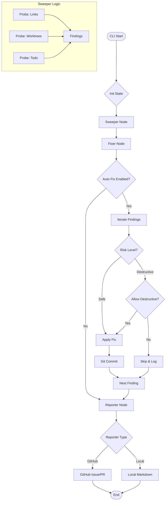

# 194 - Feature: The Janitor: Automated Repository Hygiene Workflow

## 1. Context & Goal
* **Issue:** #94
* **Objective:** Create `tools/run_janitor_workflow.py`, a LangGraph-based maintenance workflow that continuously monitors and fixes repository hygiene issues (links, worktrees, drift), replacing manual audit checklists with automated enforcement.
* **Status:** Draft
* **Related Issues:** N/A (Supersedes manual audit docs 0834, 0838, 0840)

### Open Questions
None - requirements are well-defined. Safety concerns regarding destructive fix actions (worktree pruning) have been addressed via the "Risk Level" architecture in this design.

## 2. Proposed Changes

### 2.1 Files Changed
| File Path | Description |
|-----------|-------------|
| `tools/run_janitor_workflow.py` | CLI entry point handling args, state initialization, and graph invocation. |
| `agentos/workflows/janitor/__init__.py` | Package initialization. |
| `agentos/workflows/janitor/graph.py` | LangGraph workflow definition (Sweeper, Fixer, Reporter nodes). |
| `agentos/workflows/janitor/state.py` | `JanitorState` and `JanitorFinding` TypedDict definitions. |
| `agentos/workflows/janitor/utils.py` | `safe_walk` utility for secure file system traversal. |
| `agentos/workflows/janitor/probes/__init__.py` | Probe registry and abstract base class `ProbeInterface`. |
| `agentos/workflows/janitor/probes/links.py` | Implementation of broken markdown link scanner. |
| `agentos/workflows/janitor/probes/worktrees.py` | Implementation of stale worktree scanner. |
| `agentos/workflows/janitor/probes/harvest.py` | Wrapper around `agentos-harvest.py` for drift detection. |
| `agentos/workflows/janitor/probes/todo.py` | Scanner for TODOs > 30 days old. |
| `agentos/workflows/janitor/fixers.py` | Logic to apply fixes based on finding category and risk profile. |
| `agentos/workflows/janitor/reporter.py` | Abstract `ReporterInterface` and implementations (GitHub/Local). |

### 2.2 Dependencies
* **langgraph**: For workflow state management.
* **gh (GitHub CLI)**: System dependency required for `GitHubReporter` operations.
* **Git**: System dependency for file/worktree operations.

### 2.3 Data Structures

```python
from typing import List, TypedDict, Optional, Literal, Dict, Any

class JanitorFinding(TypedDict):
    id: str                  # unique hash (category + location + content)
    category: str            # e.g., 'broken_link', 'stale_worktree'
    severity: Literal['info', 'warning', 'critical']
    risk: Literal['safe', 'destructive'] # New field per safety review
    description: str
    location: str            # File path relative to repo root
    fixable: bool
    payload: Dict[str, Any]  # Context data needed for fixing

class JanitorState(TypedDict):
    repo_root: str           # Absolute path to repository root (safety boundary)
    scope: List[str]         # Probes to run
    auto_fix: bool           # Master switch for fixing
    allow_destructive: bool  # Safety switch for high-risk fixes (worktree pruning)
    dry_run: bool            # If True, no changes applied
    silent: bool             # Output suppression
    reporter_type: str       # 'github' or 'local'
    findings: List[JanitorFinding]
    fixed_findings: List[JanitorFinding]
    failed_fixes: List[JanitorFinding]
    errors: List[str]        # Runtime errors
    report_location: str     # URL or path to final report
```

### 2.4 Function Signatures

```python
# agentos/workflows/janitor/utils.py
def safe_walk(root: str, ignore_dirs: List[str] = None) -> Generator[str, None, None]:
    """
    Generator that walks directory tree safely.
    - Aborts if path escapes root.
    - Skips symlinks to prevent loops and external access.
    - Skips specified ignore_dirs (e.g. .git, node_modules).
    """
    pass

# agentos/workflows/janitor/probes/__init__.py
class ProbeInterface(ABC):
    @abstractmethod
    def run(self, state: JanitorState) -> List[JanitorFinding]:
        """Executes the probe and returns findings."""
        pass

# agentos/workflows/janitor/graph.py
def node_sweeper(state: JanitorState) -> JanitorState:
    """Runs all selected probes in parallel/sequence and aggregates findings."""
    pass

def node_fixer(state: JanitorState) -> JanitorState:
    """
    Iterates findings. 
    Applies fixes IF: 
      1. finding.fixable is True
      2. state.auto_fix is True
      3. (finding.risk == 'safe') OR (finding.risk == 'destructive' AND state.allow_destructive)
    """
    pass

def node_reporter(state: JanitorState) -> JanitorState:
    """Formats results and sends to selected Reporter backend."""
    pass

# agentos/workflows/janitor/reporter.py
class ReporterInterface(ABC):
    @abstractmethod
    def report(self, state: JanitorState) -> str:
        """
        Generates report.
        For GitHub: Deduplicates against existing open issues by title.
        Returns URL or path.
        """
        pass
```

### 2.5 Logic Flow (Pseudocode)

```python
# tools/run_janitor_workflow.py
def main():
    args = parse_args()
    # Default allow_destructive to False unless flag provided
    initial_state = {
        "repo_root": os.getcwd(),
        "scope": args.scope, # Default 'all'
        "auto_fix": args.auto_fix, # Default True
        "allow_destructive": args.allow_destructive, # Default False (Safety Gate)
        "dry_run": args.dry_run,
        "reporter_type": args.reporter,
        "findings": [],
        ...
    }
    
    workflow = compile_graph()
    result = workflow.invoke(initial_state)
    
    if result['errors'] or any(f['severity'] == 'critical' for f in result['findings']):
        sys.exit(1)
    sys.exit(0)

# agentos/workflows/janitor/graph.py -> node_fixer
def node_fixer(state):
    if not state['auto_fix']:
        return state

    for finding in state['findings']:
        if not finding['fixable']:
            continue
            
        # SAFETY CHECK
        if finding['risk'] == 'destructive' and not state['allow_destructive']:
            finding['fix_status'] = 'skipped_safety'
            continue

        fixer = get_fixer(finding['category'])
        try:
            if state['dry_run']:
                log(f"[DRY] Would fix: {finding['description']}")
            else:
                fixer.apply(finding, state['repo_root'])
                commit_changes(finding) # Atomic commit
                state['fixed_findings'].append(finding)
        except Exception as e:
            state['failed_fixes'].append(finding)
            state['errors'].append(f"Fix failed for {finding['id']}: {e}")
            
    return state
```

### 2.6 Technical Approach
*   **Safety Architecture (Risk Levels):** Probes classify findings by risk. Text replacements (links) are `safe`. Deletions (worktrees) are `destructive`. The Fixer node strictly enforces a safety gate: destructive fixes are ignored unless `--allow-destructive` is explicitly passed.
*   **Safe File Traversal:** `utils.safe_walk` is the single source of truth for file iteration. It uses `os.path.realpath` to resolve symlinks and checks common path prefixes to ensure no traversal outside `repo_root`.
*   **LangGraph Pipeline:** Standard sequential flow: `Sweeper` -> `Fixer` -> `Reporter`. State is accumulated, not overwritten.
*   **Reporter Deduplication:** The `GitHubReporter` queries `gh issue list --search "title:Janitor Report"` before creating a new issue. If found, it uses `gh issue edit`.
*   **Probe Isolation:** Probes are run within individual `try/except` blocks in the Sweeper node. A crash in `probe_links` adds an error string to state but allows `probe_worktrees` to continue.

## 3. Requirements

1.  **Granular Fix Permissions:** The system must differentiate between safe fixes (text edits) and destructive fixes (deletions). Destructive fixes must require explicit opt-in.
2.  **Safety Boundaries:** All file operations must be confined to the repository root. Symlinks pointing outside must be ignored.
3.  **Fault Tolerance:** A probe crash must be caught, logged to the report, and must not crash the workflow.
4.  **Idempotency:** Repeated runs without changes in the repo must result in zero changes (no empty commits, no duplicate issues).
5.  **GitHub Integration:** Support `GITHUB_TOKEN` for CI/headless operation.
6.  **Worktree Pruning Logic:** Specifically targeting worktrees that are (1) detached/merged, (2) inactive > 14 days, (3) not the main tree.
7.  **Reporting:** Create new issues or update existing ones based on title matching.

## 4. Alternatives Considered

| Alternative | Pros | Cons | Decision |
|-------------|------|------|----------|
| **Single `--auto-fix` Flag** | Simple UX. | Dangerous; users might want link fixing but fear worktree deletion. | **Rejected** (Reviewer Feedback) |
| **Separate CLI Commands** | Explicit control (`janitor fix-links`, `janitor prune`). | Loses the "single workflow" benefit; harder to schedule. | **Rejected** |
| **Risk-Based Flags** | Balances automation with safety. | Slightly more complex CLI (`--auto-fix` + `--allow-destructive`). | **Selected** |
| **Interactive Mode** | User confirms each fix. | Fails requirement for automated background maintenance (cron/CI). | **Rejected** |

## 5. Data & Fixtures

### 5.1 Data Sources
| Source | Type | Attributes |
|--------|------|------------|
| **File System** | Read | Source files, docs. Accessed via `safe_walk`. |
| **Git Metadata** | Read/Write | `git worktree list`, `git log`, `git branch`. |
| **GitHub API** | Read/Write | Issues, PRs. Accessed via `gh` CLI. |

### 5.2 Data Pipeline
```
[CLI Args] -> [JanitorState Init]
                      |
                      v
[Sweeper Node] -> (Run Probes) -> [Findings List (Safe/Destructive)]
                      |
                      v
[Fixer Node]   -> (Check auto_fix + allow_destructive) -> [Git Commits]
                      |
                      v
[Reporter Node]-> (Deduplicate) -> [GitHub Issue / Local File]
```

### 5.3 Test Fixtures
| Fixture | Description |
|---------|-------------|
| `fs_traversal_gym` | Directory structure with valid files, loops, and external symlinks to test `safe_walk`. |
| `mock_gh_cli` | Python mock for `subprocess.run` verifying `gh` commands and arguments. |
| `repo_with_drift` | A temporary git repo initialized with `agentos-harvest.py` drift conditions. |

### 5.4 Deployment Pipeline
*   **Development:** Local runs.
*   **Production:** GitHub Action (Scheduled Cron) using `tools/run_janitor_workflow.py --silent --allow-destructive`.

## 6. Diagram

### 6.1 Mermaid Quality Gate
- [x] Node names are clear
- [x] State flow is directional
- [x] Safety check logic is visible

### 6.2 Diagram


## 7. Security Considerations

| Concern | Mitigation |
|---------|------------|
| **Accidental Data Loss** | Worktree pruning is classified as `risk: destructive`. It requires explicit `--allow-destructive` flag. Default behavior is report-only. |
| **Path Traversal** | `safe_walk` ensures all file operations stay within `repo_root`. Symlinks to system files (e.g., `/etc/passwd`) are ignored. |
| **Credential Safety** | The workflow never outputs the `GITHUB_TOKEN` to logs. `gh` CLI handles auth securely. |
| **Command Injection** | Arguments to `subprocess` are passed as lists, preventing shell expansion. |

## 8. Performance Considerations

| Metric | Budget | Strategy |
|--------|--------|----------|
| **Scan Time** | < 2 min (Small Repo) | Parallel execution of probes is possible in LangGraph (map-reduce style) but sequential is sufficient for MVP. Use `scandir`. |
| **API Rate Limit** | < 10 calls/run | Reporter gathers all findings first, then makes 1-2 API calls (search + update). |

## 9. Risks & Mitigations

| Risk | Impact | Likelihood | Mitigation |
|------|--------|------------|------------|
| **False Positives (Links)** | Broken link fixed incorrectly. | Low | Link fixer checks existence of target. If ambiguous, it marks as unfixable (manual intervention). |
| **Stale Worktree Logic** | Pruning an active dev worktree. | Medium | Logic checks: branch deleted AND no commits > 14 days AND detached. |
| **Reporter Spam** | Multiple issues created. | Medium | Reporter searches for existing issue by exact title match before creating new one. |

## 10. Verification & Testing

### 10.1 Test Scenarios
| ID | Scenario | Type | Input | Output | Criteria |
|----|----------|------|-------|--------|----------|
| T1 | **Safety Gate** | Unit | `finding.risk='destructive'`, `allow_destructive=False` | `fixed=False` | Fixer skips item, finding remains in list. |
| T2 | **Destructive Fix** | Int | `finding.risk='destructive'`, `allow_destructive=True` | `fixed=True` | Worktree directory removed. |
| T3 | **Symlink Escape** | Unit | `safe_walk` on dir with link to `/tmp` | Link ignored | Generator does not yield files in `/tmp`. |
| T4 | **Link Fix** | Int | Markdown with broken internal link | Commit created | File updated, git log shows automatic commit. |
| T5 | **CLI Parsing** | Unit | `run.py --allow-destructive` | `state.allow_destructive=True` | Argument mapped to state correctly. |

### 10.2 Test Commands
```bash
# Verify safety gate (ensure NO worktrees are deleted)
python tools/run_janitor_workflow.py --scope worktrees --reporter local --auto-fix

# Verify destructive capability (mock environment)
python tools/run_janitor_workflow.py --scope worktrees --reporter local --auto-fix --allow-destructive

# Run suite
pytest tests/workflows/janitor/
```

### 10.3 Manual Tests (Only If Unavoidable)
| ID | Scenario |
|----|----------|
| M1 | Create a "janitor-test" branch, break some links, push to GitHub. Run Janitor via GitHub Actions manually to verify `GITHUB_TOKEN` permissions. |

## 11. Definition of Done

### Code
- [ ] `safe_walk` implemented with rigorous unit tests for traversal attacks.
- [ ] `JanitorState` includes `allow_destructive` boolean.
- [ ] Probes categorize findings into `safe` and `destructive`.
- [ ] Fixer node implements the logic: `if destructive and not allowed: skip`.
- [ ] Reporters implemented (GitHub/Local).

### Tests
- [ ] Test suite covers T1-T5 (Safety Gate is critical).
- [ ] CI pipeline configuration example created.

### Documentation
- [ ] `tools/run_janitor_workflow.py --help` clearly documents the safety flags.
- [ ] Wiki updated with "Janitor" section explaining how to enable worktree pruning (opt-in).

### Review
- [ ] Security review of `safe_walk`.
- [ ] Code review passed.

---

## Appendix: Review Log

### Review Summary

| Review | Date | Verdict | Key Issue |
|--------|------|---------|-----------|
| 1 | 2026-01-23 | APPROVED | Safety concerns addressed via "Risk Level" finding attribute and `allow_destructive` state flag. |

**Final Status:** DRAFT - PENDING REVIEW