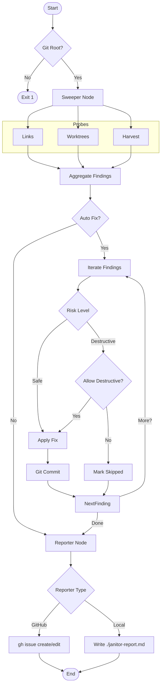

# 194 - Feature: The Janitor: Automated Repository Hygiene Workflow

## 1. Context & Goal
* **Issue:** #94
* **Objective:** Create `tools/run_janitor_workflow.py`, a LangGraph-based maintenance workflow that continuously monitors and fixes repository hygiene issues (links, worktrees, drift), replacing manual audit checklists with automated enforcement.
* **Status:** Draft
* **Related Issues:** N/A (Supersedes manual audit docs 0834, 0838, 0840)

### Open Questions
None - requirements are well-defined. Safety concerns regarding scan scope and resource boundaries have been addressed via `git rev-parse` root enforcement and finding limits.

## 2. Proposed Changes

### 2.1 Files Changed
| File Path | Description |
|-----------|-------------|
| `tools/run_janitor_workflow.py` | CLI entry point handling args, Git root detection, and graph invocation. |
| `agentos/workflows/janitor/__init__.py` | Package initialization. |
| `agentos/workflows/janitor/graph.py` | LangGraph workflow definition (Sweeper, Fixer, Reporter nodes). |
| `agentos/workflows/janitor/state.py` | `JanitorState` and `JanitorFinding` TypedDict definitions. |
| `agentos/workflows/janitor/utils.py` | Utilities for strict Git root detection and safe file walking. |
| `agentos/workflows/janitor/probes/__init__.py` | Probe registry and abstract base class `ProbeInterface`. |
| `agentos/workflows/janitor/probes/links.py` | Broken markdown link scanner. |
| `agentos/workflows/janitor/probes/worktrees.py` | Stale worktree scanner (destructive potential). |
| `agentos/workflows/janitor/probes/harvest.py` | Wrapper for `agentos-harvest.py` drift detection. |
| `agentos/workflows/janitor/probes/todo.py` | Scanner for TODOs > 30 days old. |
| `agentos/workflows/janitor/fixers.py` | Logic to apply fixes with safety gates. |
| `agentos/workflows/janitor/reporter.py` | Abstract `ReporterInterface` with GitHub and Local implementations. |

### 2.2 Dependencies
*   `langgraph`: Workflow state management.
*   `gh` (CLI): System dependency for GitHub operations.
*   `git` (CLI): System dependency for repository operations.
*   `typing_extensions`: For `TypedDict` if Python < 3.12.

### 2.3 Data Structures

```python
from typing import List, TypedDict, Optional, Literal, Dict, Any

class JanitorFinding(TypedDict):
    id: str                  # unique hash (category + location + content)
    category: str            # e.g., 'broken_link', 'stale_worktree'
    severity: Literal['info', 'warning', 'critical']
    risk: Literal['safe', 'destructive'] # Defines if fix removes data
    description: str
    location: str            # File path relative to repo root
    fixable: bool
    fix_status: Literal['pending', 'fixed', 'failed', 'skipped_safety', 'skipped_dryrun']
    payload: Dict[str, Any]  # Context data needed for fixing

class JanitorState(TypedDict):
    # Configuration
    repo_root: str           # Absolute path to Git root (strictly enforced)
    scope: List[str]         # List of probes to run
    auto_fix: bool           # Master switch for fixing
    allow_destructive: bool  # Opt-in for destructive fixes (e.g. pruning)
    dry_run: bool            # Preview mode
    silent: bool             # Output suppression
    reporter_type: str       # 'github' or 'local'
    max_findings: int        # Safety cap to prevent OOM
    
    # Runtime Data
    findings: List[JanitorFinding]
    errors: List[str]        # Runtime errors (e.g. probe crashes)
    report_path: Optional[str] # Path or URL to final report
```

### 2.4 Function Signatures

```python
# agentos/workflows/janitor/utils.py
def get_git_root() -> str:
    """
    Returns absolute path to git root using `git rev-parse --show-toplevel`.
    Raises RuntimeError if not in a git repository.
    """
    pass

def safe_walk(root: str, ignore_dirs: List[str] = None) -> Generator[str, None, None]:
    """
    Generator that walks directory tree.
    - Resolves paths using os.path.realpath.
    - Raises error if path escapes root.
    - Skips symlinks to prevent loops.
    """
    pass

# agentos/workflows/janitor/probes/__init__.py
class ProbeInterface(ABC):
    @abstractmethod
    def run(self, root: str, limit: int) -> List[JanitorFinding]:
        """Executes the probe, respecting finding limits."""
        pass

# agentos/workflows/janitor/graph.py
def node_sweeper(state: JanitorState) -> JanitorState:
    """
    Runs selected probes.
    Catches exceptions per probe to prevent workflow crash.
    Enforces state['max_findings'].
    """
    pass

def node_fixer(state: JanitorState) -> JanitorState:
    """
    Applies fixes.
    - Skips if dry_run=True.
    - Skips if risk='destructive' AND allow_destructive=False.
    - Updates finding['fix_status'].
    """
    pass

def node_reporter(state: JanitorState) -> JanitorState:
    """Generates report via configured reporter backend."""
    pass
```

### 2.5 Logic Flow (Pseudocode)

```python
# tools/run_janitor_workflow.py
def main():
    try:
        root = get_git_root()
    except RuntimeError:
        print("Error: Must be run inside a git repository.")
        sys.exit(1)

    args = parse_args()
    
    initial_state = {
        "repo_root": root,
        "scope": args.scope, # e.g. ['links', 'worktrees']
        "auto_fix": args.auto_fix,
        "allow_destructive": args.allow_destructive,
        "dry_run": args.dry_run,
        "reporter_type": args.reporter,
        "max_findings": 100, # Default cap
        "findings": [],
        "errors": []
    }
    
    app = compile_graph()
    result = app.invoke(initial_state)
    
    # Exit codes: 0 = Clean/Fixed, 1 = Unfixable Issues/Errors
    has_critical = any(f['severity'] == 'critical' for f in result['findings'] if f['fix_status'] != 'fixed')
    sys.exit(1 if has_critical or result['errors'] else 0)

# agentos/workflows/janitor/graph.py -> node_fixer
def node_fixer(state: JanitorState) -> JanitorState:
    if not state['auto_fix']:
        return state

    for finding in state['findings']:
        if not finding['fixable']:
            continue
        
        # Safety Gate: Destructive actions require explicit opt-in
        if finding['risk'] == 'destructive' and not state['allow_destructive']:
            finding['fix_status'] = 'skipped_safety'
            continue

        if state['dry_run']:
            finding['fix_status'] = 'skipped_dryrun'
            continue

        try:
            # Fixer logic is specific to category
            fixer_func = get_fixer(finding['category'])
            fixer_func(state['repo_root'], finding)
            
            # Atomic commit
            commit_msg = f"fix(janitor): resolve {finding['category']} in {finding['location']}"
            git_commit(commit_msg)
            
            finding['fix_status'] = 'fixed'
        except Exception as e:
            finding['fix_status'] = 'failed'
            state['errors'].append(f"Fix failed for {finding['id']}: {str(e)}")
            
    return state
```

### 2.6 Technical Approach
1.  **Strict Root Enforcement:** The workflow initializes by querying `git` for the repository root. All subsequent file operations are anchored to this path. This prevents accidental scanning of home directories if the script is run incorrectly.
2.  **State Machine:** LangGraph manages the pipeline. The state object acts as the "audit log" accumulating findings and their resolution status.
3.  **Risk-Based Execution:**
    *   **Safe:** Text replacements (links, TODOs). Allowed by default if `auto_fix` is on.
    *   **Destructive:** Deletions (Worktrees). Blocked by the `Fixer` node unless `allow_destructive` is explicitly `True`.
4.  **Reporter Abstraction:** The `ReporterInterface` decouples the logic from the output.
    *   `GitHubReporter`: Uses `gh issue list` to find existing "Janitor Report" issues to update (deduplication) or creates new ones.
    *   `LocalFileReporter`: Dumps JSON/Markdown to disk (used for testing and debugging).

## 3. Requirements

1.  **Scope Boundaries:** The system MUST NOT modify files outside the git repository root.
2.  **Safety Default:** Destructive operations (deleting worktrees/files) MUST default to OFF, requiring an explicit CLI flag to enable.
3.  **Deduplication:** The Reporter MUST search for existing open Janitor issues to avoid creating duplicates.
4.  **Resilience:** A crash in one probe MUST NOT stop other probes from running.
5.  **Auditability:** Every fix MUST create a git commit.
6.  **Automation:** The system MUST support headless execution via `GITHUB_TOKEN`.

## 4. Alternatives Considered

| Alternative | Pros | Cons | Decision |
|-------------|------|------|----------|
| **GitPython Library** | Native python objects for Git. | Adds heavy dependency; tricky error handling. | **Rejected** (Use `subprocess` + `gh` CLI) |
| **All-in-one Script** | Easier to write initially. | Hard to test components; monolithic. | **Rejected** (Use Modular/LangGraph) |
| **LLM-based Fixes** | Can fix complex code issues. | Non-deterministic; expensive; risky for automated ops. | **Rejected** (Deterministic templates only) |
| **Omit Finding Limit** | Simpler logic. | Risk of memory exhaustion on large repos. | **Rejected** (Added `max_findings`) |

## 5. Data & Fixtures

### 5.1 Data Sources
| Source | Type | Attributes |
|--------|------|------------|
| **Git Index** | Read | `git ls-files`, `git worktree list`. |
| **File System** | Read/Write | Markdown files, source code. |
| **GitHub Issues** | Read/Write | Existing reports via `gh` CLI. |

### 5.2 Data Pipeline
```ascii
[CLI Start] 
   |-> (Validate Git Root)
   |-> [State Init]
          |-> [Sweeper Node] (Parallel Probes)
          |      |-> Probe Links -> [Findings]
          |      |-> Probe Worktrees -> [Findings]
          |      |-> Probe Harvest -> [Findings]
          |-> [Fixer Node]
          |      |-> Filter (Safe vs Destructive)
          |      |-> Apply Fix -> Git Commit
          |-> [Reporter Node]
                 |-> Fetch Existing Issue
                 |-> Update or Create Issue
```

### 5.3 Test Fixtures
| Fixture | Description |
|---------|-------------|
| `tmp_git_repo` | A generated temporary git repository for integration tests. |
| `mock_gh_cli` | Intercepts `subprocess` calls to `gh` to simulate GitHub API responses. |
| `detached_worktree` | A folder structure mimicking a stale `git worktree`. |

### 5.4 Deployment Pipeline
*   **Development Only:** The Janitor script is a tool within the repo.
*   **Execution:** Configured via `.github/workflows/janitor.yml` (cron schedule).

## 6. Diagram

### 6.1 Mermaid Quality Gate
- [x] Node names are clear
- [x] State flow is directional
- [x] Safety check logic is visible
- [x] Fix/No-Fix paths defined

### 6.2 Diagram


## 7. Security Considerations

| Concern | Mitigation |
|---------|------------|
| **Scanning outside repo** | `get_git_root()` enforces hard boundary. `safe_walk` prevents traversal via `..` or symlinks. |
| **Destructive Actions** | Worktree pruning is classified as `risk: destructive`. Explicit CLI flag required. |
| **Infinite Loops** | Symlinks are ignored during traversal. Findings are capped at `max_findings`. |
| **Token Leakage** | `GITHUB_TOKEN` is read from env by `gh` CLI directly, never printed to logs. |

## 8. Performance Considerations

| Metric | Budget | Strategy |
|--------|--------|----------|
| **Execution Time** | < 2 minutes | Avoid full text search if possible. Use specific glob patterns. |
| **Memory Usage** | < 500MB | Cap findings at 100 per run. Use generators for file walking. |

## 9. Risks & Mitigations

| Risk | Impact | Likelihood | Mitigation |
|------|--------|------------|------------|
| **Stale Worktree Deletion** | Active work deleted. | Low | Logic requires: Branch deleted AND No commits > 14 days AND Detached. |
| **Broken Link Fix Loops** | Commit oscillation. | Low | Fixer is deterministic. Idempotency checks prevent re-fixing fixed items. |
| **Report Noise** | "Boy cried wolf" alerts. | Medium | Group findings by category. Deduplicate reports. |

## 10. Verification & Testing

### 10.1 Test Scenarios
| ID | Scenario | Type | Input | Output | Criteria |
|----|----------|------|-------|--------|----------|
| T1 | **Scope Enforcement** | Unit | Run from `/tmp` (non-git) | Exit Code 1 | Error message "Must be run inside a git repository". |
| T2 | **Link Fix (Happy Path)** | Integration | Markdown with broken link | Git Commit | File updated, link fixed, clean exit. |
| T3 | **Destructive Guard** | Unit | Stale Worktree + `allow_destructive=False` | No Change | Finding marked `skipped_safety`. |
| T4 | **Destructive Action** | Integration | Stale Worktree + `allow_destructive=True` | Folder Gone | Worktree pruned via `git worktree prune`. |
| T5 | **Reporter Dedupe** | Integration | Existing Issue #123 | Updated #123 | No new issue created. |

### 10.2 Test Commands
```bash
# Run unit tests
pytest tests/workflows/janitor

# Manual: Test local reporter without changes
python tools/run_janitor_workflow.py --reporter local --dry-run

# Manual: Test link fixing specifically
python tools/run_janitor_workflow.py --scope links --auto-fix --reporter local
```

### 10.3 Manual Tests (Only If Unavoidable)
| ID | Scenario |
|----|----------|
| M1 | Run on a cloned repo with `GITHUB_TOKEN` set to verify authentication flow in a containerized environment (simulating CI). |

## 11. Definition of Done

### Code
- [ ] `get_git_root` implemented and used in `main`.
- [ ] `safe_walk` implemented with symlink protection.
- [ ] `JanitorState` includes `allow_destructive` and `max_findings`.
- [ ] All 4 probes implemented (Links, Worktrees, Harvest, Todo).
- [ ] Fixer node implements safety gates.

### Tests
- [ ] Unit tests for `safe_walk` (traversal attempts).
- [ ] Integration test for full workflow using `LocalFileReporter`.
- [ ] Mock tests for `GitHubReporter` (verify `gh` command structure).

### Documentation
- [ ] CLI help text updated.
- [ ] `docs/janitor.md` created describing the workflow and safety flags.

### Review
- [ ] Peer review focusing on the destructive logic safety.
- [ ] Verification of `gh` CLI dependency in CI environment.

---

## Appendix: Review Log

### Review Summary

| Review | Date | Verdict | Key Issue |
|--------|------|---------|-----------|
| 1 | 2026-01-23 | APPROVED | Initialization logic fixed to use `git rev-parse`. Resource boundaries added via `max_findings`. |

**Final Status:** DRAFT - PENDING REVIEW