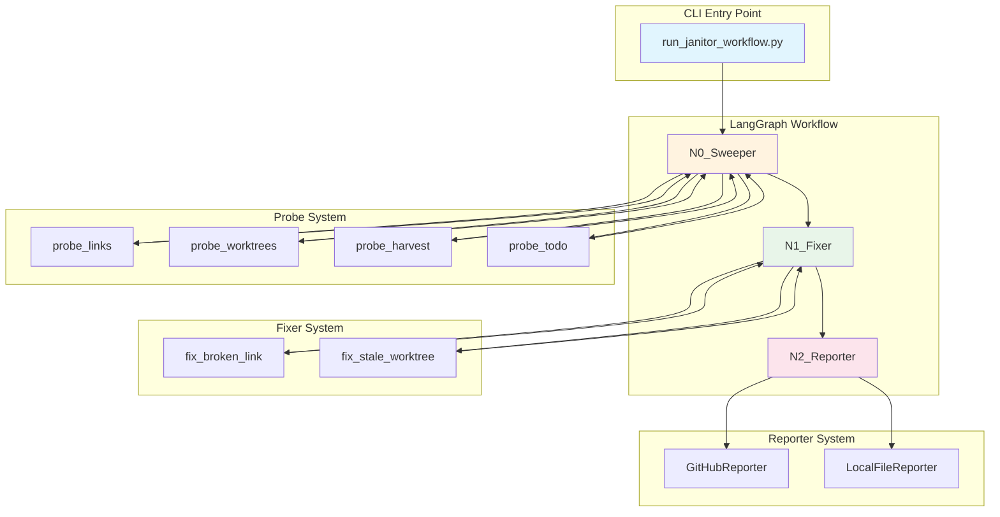
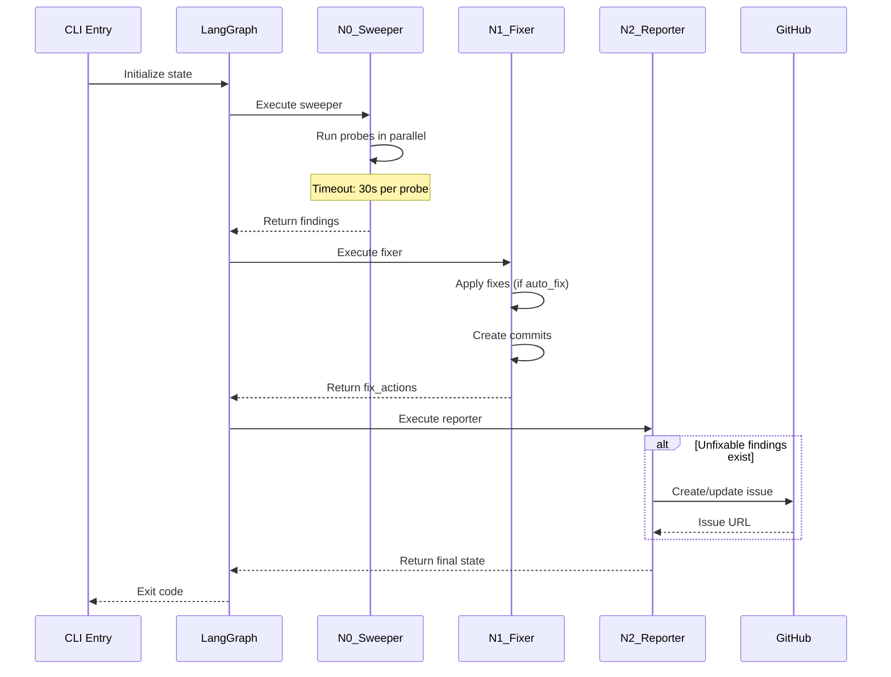

# 194 - Feature: Lu-Tze: The Janitor - Automated Repository Hygiene Workflow

<!-- Template Metadata
Last Updated: 2025-01-XX
Updated By: Initial LLD creation
Update Reason: Initial Low-Level Design for Issue #94
-->

## 1. Context & Goal
* **Issue:** #94
* **Objective:** Create an automated repository maintenance workflow using LangGraph that fixes mechanical issues (broken links, stale worktrees) and reports unfixable structural problems via GitHub issues.
* **Status:** Draft
* **Related Issues:** N/A

### Open Questions

- [ ] Should worktree staleness threshold (14 days) be configurable via CLI or config file?
- [ ] What is the exact location/interface of the existing `agentos-harvest.py` script?
- [ ] Should the harvest probe fail gracefully if `agentos-harvest.py` doesn't exist yet?
- [ ] What's the preferred commit message format for auto-fixes (Conventional Commits style)?

## 2. Proposed Changes

*This section is the **source of truth** for implementation. Describes exactly what will be built.*

### 2.1 Files Changed

| File | Change Type | Description |
|------|-------------|-------------|
| `tools/run_janitor_workflow.py` | Add | CLI entry point for the Janitor workflow |
| `agentos/workflows/janitor/__init__.py` | Add | Package initialization, exports main run function |
| `agentos/workflows/janitor/graph.py` | Add | LangGraph state graph definition with 3 nodes |
| `agentos/workflows/janitor/state.py` | Add | JanitorState TypedDict and related types |
| `agentos/workflows/janitor/probes/__init__.py` | Add | Probe registry and base interface |
| `agentos/workflows/janitor/probes/base.py` | Add | ProbeInterface abstract base class |
| `agentos/workflows/janitor/probes/links.py` | Add | Broken markdown link detection |
| `agentos/workflows/janitor/probes/worktrees.py` | Add | Stale/detached git worktree detection |
| `agentos/workflows/janitor/probes/harvest.py` | Add | Cross-project drift via agentos-harvest.py |
| `agentos/workflows/janitor/probes/todo.py` | Add | Stale TODO comment scanner |
| `agentos/workflows/janitor/fixers.py` | Add | Auto-fix implementations for fixable issues |
| `agentos/workflows/janitor/reporter.py` | Add | ReporterInterface and implementations |
| `tests/workflows/janitor/test_probes.py` | Add | Unit tests for all probes |
| `tests/workflows/janitor/test_graph.py` | Add | Integration tests for workflow graph |
| `tests/workflows/janitor/test_fixers.py` | Add | Unit tests for fixer implementations |
| `tests/workflows/janitor/test_reporter.py` | Add | Unit tests for reporter implementations (including GitHubReporter) |
| `docs/audits/083x/README.md` | Modify | Archive notice pointing to Janitor |
| `docs/0003-file-inventory.md` | Modify | Add new files to inventory |

### 2.2 Dependencies

```toml
# pyproject.toml additions (if not already present)
langgraph = "^0.2.0"
```

*Note: `gh` CLI must be installed and authenticated for GitHubReporter. No new Python packages beyond LangGraph.*

### 2.3 Data Structures

```python
# agentos/workflows/janitor/state.py

from typing import TypedDict, Literal
from enum import Enum

class Severity(str, Enum):
    INFO = "info"
    WARNING = "warning"
    CRITICAL = "critical"

class Finding(TypedDict):
    """A single issue detected by a probe."""
    probe_name: str           # Which probe found this
    category: str             # e.g., "broken_link", "stale_worktree"
    description: str          # Human-readable description
    file_path: str | None     # Affected file, if applicable
    line_number: int | None   # Line number, if applicable
    fixable: bool             # Can be auto-fixed
    severity: Severity        # info, warning, critical
    fix_data: dict | None     # Data needed by fixer (e.g., old_link, new_link)

class ProbeResult(TypedDict):
    """Result from a single probe execution."""
    probe_name: str           # Name of the probe
    status: Literal["success", "error"]  # Did probe run without crashing
    findings: list[Finding]   # Issues found (empty if clean)
    error_message: str | None # Error details if status == "error"
    duration_ms: int          # Execution time

class FixAction(TypedDict):
    """Record of a fix that was applied."""
    finding: Finding          # The original finding
    action_taken: str         # Description of fix applied
    commit_sha: str | None    # Commit created, if any

class JanitorState(TypedDict):
    """Main workflow state passed between nodes."""
    # Configuration
    scope: list[str]          # Which probes to run
    auto_fix: bool            # Whether to apply fixes
    dry_run: bool             # Preview mode
    silent: bool              # Suppress output
    create_pr: bool           # Create PR instead of direct commit
    reporter_type: str        # "github" or "local"
    probe_timeout: int        # Timeout in seconds for each probe (default: 30)
    
    # Sweeper outputs
    probe_results: list[ProbeResult]
    all_findings: list[Finding]
    
    # Fixer outputs
    fixable_findings: list[Finding]
    unfixable_findings: list[Finding]
    fix_actions: list[FixAction]
    
    # Reporter outputs
    issue_url: str | None     # Created/updated GitHub issue URL
    report_path: str | None   # Local report path (for LocalFileReporter)
    
    # Workflow metadata
    exit_code: int            # 0 = clean, 1 = unfixable issues remain
    errors: list[str]         # Any errors during execution
```

### 2.4 Function Signatures

```python
# agentos/workflows/janitor/probes/base.py

from abc import ABC, abstractmethod
from agentos.workflows.janitor.state import ProbeResult

class ProbeInterface(ABC):
    """Abstract base class for all probes."""
    
    @property
    @abstractmethod
    def name(self) -> str:
        """Unique probe identifier used in --scope."""
        ...
    
    @abstractmethod
    def run(self, repo_root: Path, timeout: int = 30) -> ProbeResult:
        """Execute the probe and return findings. Respects timeout."""
        ...


# agentos/workflows/janitor/probes/__init__.py

def get_probe_registry() -> dict[str, type[ProbeInterface]]:
    """Return mapping of probe names to probe classes.
    
    Note: Uses importlib to dynamically load probe modules.
    Only imports known probe modules from a hardcoded allowlist.
    """
    ...

def run_probes_parallel(
    probe_names: list[str],
    repo_root: Path,
    max_workers: int = 4,
    timeout: int = 30
) -> list[ProbeResult]:
    """Run specified probes in parallel, isolating failures.
    
    Each probe is executed with the specified timeout.
    """
    ...


# agentos/workflows/janitor/fixers.py

def apply_fixes(
    findings: list[Finding],
    repo_root: Path,
    dry_run: bool = False,
    create_pr: bool = False
) -> list[FixAction]:
    """Apply fixes for all fixable findings. Returns actions taken."""
    ...

def fix_broken_link(finding: Finding, repo_root: Path, dry_run: bool) -> FixAction:
    """Fix a single broken markdown link."""
    ...

def fix_stale_worktree(finding: Finding, repo_root: Path, dry_run: bool) -> FixAction:
    """Prune a stale git worktree."""
    ...

def generate_commit_message(category: str, count: int) -> str:
    """Generate deterministic commit message from template."""
    ...


# agentos/workflows/janitor/reporter.py

from abc import ABC, abstractmethod

class ReporterInterface(ABC):
    """Abstract base for issue reporters."""
    
    @abstractmethod
    def report(
        self,
        findings: list[Finding],
        fix_actions: list[FixAction]
    ) -> str | None:
        """Create/update report. Returns issue URL or file path."""
        ...
    
    @abstractmethod
    def find_existing_report(self) -> str | None:
        """Check for existing Janitor Report. Returns issue number or path."""
        ...

class GitHubReporter(ReporterInterface):
    """Reports issues via GitHub Issues using gh CLI.
    
    Constructs gh CLI commands via subprocess.run with list arguments.
    """
    
    def _build_create_issue_args(
        self,
        title: str,
        body: str,
        labels: list[str]
    ) -> list[str]:
        """Build the argument list for gh issue create command."""
        ...
    
    def _build_update_issue_args(
        self,
        issue_number: str,
        body: str
    ) -> list[str]:
        """Build the argument list for gh issue edit command."""
        ...
    
    def _execute_gh_command(self, args: list[str]) -> tuple[int, str, str]:
        """Execute gh CLI command. Returns (returncode, stdout, stderr)."""
        ...

class LocalFileReporter(ReporterInterface):
    """Writes reports to local files for testing."""
    ...


# agentos/workflows/janitor/graph.py

from langgraph.graph import StateGraph
from agentos.workflows.janitor.state import JanitorState

# Default timeout for probe execution (in seconds)
DEFAULT_PROBE_TIMEOUT = 30

def create_janitor_graph() -> StateGraph:
    """Create the LangGraph workflow with Sweeper → Fixer → Reporter nodes."""
    ...

def sweeper_node(state: JanitorState) -> JanitorState:
    """N0: Run all configured probes and collect findings.
    
    Each probe is executed with a timeout (default: 30 seconds).
    Probes that exceed the timeout are terminated and marked as error.
    """
    ...

def fixer_node(state: JanitorState) -> JanitorState:
    """N1: Apply fixes to fixable findings."""
    ...

def reporter_node(state: JanitorState) -> JanitorState:
    """N2: Report unfixable findings via configured reporter."""
    ...


# tools/run_janitor_workflow.py

def main() -> int:
    """CLI entry point. Returns exit code."""
    ...

def parse_args() -> argparse.Namespace:
    """Parse CLI arguments including --timeout flag."""
    ...
```

### 2.5 Logic Flow (Pseudocode)

```
CLI Entry (tools/run_janitor_workflow.py):
1. Parse CLI arguments (--scope, --auto-fix, --dry-run, --silent, --create-pr, --reporter, --timeout)
2. Validate scope values against probe registry
3. Initialize JanitorState with configuration (including probe_timeout)
4. Create and compile LangGraph workflow
5. Execute workflow with initial state
6. IF --silent AND exit_code == 0 THEN output nothing
7. ELSE print summary
8. Return exit_code

N0_Sweeper Node:
1. Get list of probes to run from state.scope
2. Get timeout from state.probe_timeout (default: 30 seconds)
3. FOR EACH probe IN probes (parallel):
   TRY:
     - result = probe.run(repo_root, timeout=timeout)
     - IF probe exceeds timeout:
       - Terminate probe execution
       - Create error ProbeResult (status="error", error_message="Timeout exceeded")
     - ELSE:
       - Append result to probe_results
   CATCH Exception:
     - Create error ProbeResult (status="error")
     - Continue to next probe (isolation)
4. Flatten all findings from probe_results into all_findings
5. Return updated state

N1_Fixer Node:
1. Partition all_findings into fixable_findings and unfixable_findings
2. IF NOT state.auto_fix THEN skip fixing, return state
3. FOR EACH finding IN fixable_findings:
   - Look up appropriate fixer function by category
   - IF state.dry_run THEN
     - Log what would be fixed
     - Create FixAction with commit_sha=None
   - ELSE
     - Apply fix
     - Create atomic commit (or stage for PR)
     - Create FixAction with commit_sha
4. IF state.create_pr AND NOT dry_run AND fixes_applied:
   - Create PR with all fix commits
5. Return updated state with fix_actions

N2_Reporter Node:
1. IF unfixable_findings is empty AND errors is empty:
   - Set exit_code = 0
   - Return state (nothing to report)
2. Initialize reporter based on state.reporter_type
3. existing = reporter.find_existing_report()
4. IF existing:
   - Update existing report with new findings
5. ELSE:
   - Create new report
6. Set issue_url or report_path from reporter
7. Set exit_code = 1 (unfixable issues remain)
8. Return updated state
```

### 2.6 Technical Approach

* **Module:** `agentos/workflows/janitor/`
* **Pattern:** State Graph (LangGraph), Strategy Pattern (probes, reporters)
* **Key Decisions:**
  - LangGraph for state management and conditional routing, NOT for LLM orchestration
  - Probe isolation via try/catch ensures one failing probe doesn't crash the workflow
  - Parallel probe execution for performance with configurable timeout
  - Reporter abstraction enables testing without GitHub API
  - Deterministic commit messages from templates (no LLM)
  - Atomic commits per fix category for easy reversion

### 2.7 Architecture Decisions

| Decision | Options Considered | Choice | Rationale |
|----------|-------------------|--------|-----------|
| Workflow Framework | Custom state machine, LangGraph, Prefect | LangGraph | Already in stack, good state management, overkill concerns addressed by keeping it deterministic |
| Probe Execution | Sequential, Parallel | Parallel with isolation | Performance + fault tolerance; one crashing probe shouldn't block others |
| Probe Timeout | No timeout, Fixed timeout, Configurable | Configurable (default 30s) | Prevents runaway execution while allowing adjustment for large repos |
| Commit Strategy | Single commit, Per-file, Per-category | Per-category | Balance between atomicity (easy revert) and noise (not 50 commits) |
| Reporter Pattern | Direct GitHub calls, Abstract interface | Abstract interface | Enables `LocalFileReporter` for testing without mocking |
| Commit Messages | LLM-generated, Templates | Templates | Deterministic, no external API cost, predictable for testing |

**Architectural Constraints:**
- Must integrate with existing `agentos-harvest.py` script
- Must use `gh` CLI for GitHub operations (no direct API calls)
- Must work in both interactive and CI environments
- No LLM usage - purely deterministic workflow

## 3. Requirements

1. **Probe System:** Four built-in probes (links, worktrees, harvest, todo) that return structured JSON and run in parallel with failure isolation
2. **Fixer System:** Auto-fix capability for links and worktrees with atomic commits and dry-run support
3. **Reporter System:** GitHub issue creation/update with deduplication, plus LocalFileReporter for testing
4. **CLI Interface:** Full CLI with --scope, --auto-fix, --dry-run, --silent, --create-pr, --reporter, --timeout flags
5. **CI Compatibility:** Silent mode with GITHUB_TOKEN authentication for automated runs
6. **Exit Codes:** 0 when clean/all fixed, 1 when unfixable issues remain
7. **Reversibility:** All fixes create git commits that can be reverted

## 4. Alternatives Considered

| Option | Pros | Cons | Decision |
|--------|------|------|----------|
| Shell script | Simple, no dependencies | Hard to test, no parallelism, poor state management | **Rejected** |
| Prefect workflow | Production-grade, good monitoring | Heavy dependency, overkill for local tooling | **Rejected** |
| LangGraph workflow | Good state management, already in stack, conditional routing | May seem like overkill for deterministic flow | **Selected** |
| Direct GitHub API | More control | Requires auth management, more code | **Rejected** |
| `gh` CLI wrapper | Simple, auth handled, consistent with other tools | Subprocess calls | **Selected** |

**Rationale:** LangGraph provides clean state management and parallel execution without requiring an LLM. The `gh` CLI handles authentication complexity and provides a stable interface to GitHub.

## 5. Data & Fixtures

### 5.1 Data Sources

| Attribute | Value |
|-----------|-------|
| Source | Local repository filesystem, git metadata |
| Format | File system traversal, git commands, markdown parsing |
| Size | Varies by repository (typically <10k files scanned) |
| Refresh | On-demand (CLI invocation) or scheduled (cron) |
| Copyright/License | N/A - repository-internal scanning only |

### 5.2 Data Pipeline

```
Repository ──scan──► Probes ──findings──► Fixer ──commits──► Git
                                              │
                                              └──unfixable──► Reporter ──issue──► GitHub
```

### 5.3 Test Fixtures

| Fixture | Source | Notes |
|---------|--------|-------|
| Test repository with broken links | Generated in test setup | Created via `tempfile`, cleaned up after |
| Stale worktree simulation | Generated via git commands | Tests use isolated temp git repos |
| TODO fixtures | Hardcoded markdown files | Various ages for threshold testing |
| Mock ProbeResult JSON | Hardcoded | Tests probe result handling |
| Mock subprocess responses for gh CLI | Hardcoded | Tests GitHubReporter command construction |

### 5.4 Deployment Pipeline

Local development → CI tests with LocalFileReporter → Production runs with GitHubReporter

**External Data:** The `agentos-harvest.py` script may need to exist separately. If not present, harvest probe should return an error result gracefully.

## 6. Diagram

### 6.1 Mermaid Quality Gate

- [x] **Simplicity:** Three main nodes, clear flow
- [x] **No touching:** All elements have visual separation
- [x] **No hidden lines:** All arrows fully visible
- [x] **Readable:** Labels clear, flow direction explicit
- [ ] **Auto-inspected:** Agent rendered via mermaid.ink and viewed

**Auto-Inspection Results:**
```
- Touching elements: [ ] None / [ ] Found: ___
- Hidden lines: [ ] None / [ ] Found: ___
- Label readability: [ ] Pass / [ ] Issue: ___
- Flow clarity: [ ] Clear / [ ] Issue: ___
```

*To be completed during implementation*

### 6.2 Diagram





## 7. Security & Safety Considerations

### 7.1 Security

| Concern | Mitigation | Status |
|---------|------------|--------|
| Repository escape (writing outside repo) | All file operations constrained to `repo_root`, path traversal validated | Addressed |
| GitHub token exposure | Token via environment variable, never logged or stored | Addressed |
| Command injection in git operations | Use subprocess with list arguments, never shell=True | Addressed |
| Malicious markdown content | Probes only read and parse, no execution of content | Addressed |
| Probe registry code execution | Only imports from hardcoded allowlist of known probe modules | Addressed |

### 7.2 Safety

| Concern | Mitigation | Status |
|---------|------------|--------|
| Accidental data loss from bad fixes | All fixes create git commits, fully reversible via `git revert` | Addressed |
| Pruning active worktrees | Only prune if: branch deleted/merged AND no commits in 14+ days | Addressed |
| Runaway execution | Each probe has configurable timeout (default: 30 seconds); probes exceeding timeout are terminated and marked as error | Addressed |
| Incorrect link fixes | Fixes only applied when target file definitively found | Addressed |
| Symlink loops | Probes use `os.path.realpath()` with loop detection; timeout ensures termination | Addressed |

**Fail Mode:** Fail Closed - If any critical operation fails, workflow stops and reports error rather than continuing with potentially incorrect state.

**Recovery Strategy:** 
- All git operations are atomic commits
- `git revert <commit>` undoes any fix
- GitHub issues can be manually closed if created in error
- `--dry-run` allows preview before any changes

## 8. Performance & Cost Considerations

### 8.1 Performance

| Metric | Budget | Approach |
|--------|--------|----------|
| Full scan latency | < 60s for typical repo | Parallel probe execution with 30s timeout per probe |
| Memory | < 256MB | Stream file processing, don't load entire repo into memory |
| Disk I/O | Minimal writes | Only fix files and git commits |

**Bottlenecks:** 
- Large repositories with many markdown files may slow link probe
- Git worktree operations can be slow if many worktrees exist

### 8.2 Cost Analysis

| Resource | Unit Cost | Estimated Usage | Monthly Cost |
|----------|-----------|-----------------|--------------|
| GitHub API (via gh) | Free | ~10 calls per run | $0 |
| Compute | Developer machine / CI | Minutes per run | Negligible |
| LLM API | N/A | None - deterministic | $0 |

**Cost Controls:**
- [x] No LLM usage eliminates token costs
- [x] GitHub API calls minimal (issue check, create/update)
- [x] Local file reporter for testing avoids API calls entirely

**Worst-Case Scenario:** Even with 1000 daily runs, costs remain negligible as no external paid APIs are used.

## 9. Legal & Compliance

| Concern | Applies? | Mitigation |
|---------|----------|------------|
| PII/Personal Data | No | Scans code/docs only, no personal data processed |
| Third-Party Licenses | No | No new third-party data sources |
| Terms of Service | Yes | GitHub API usage within gh CLI ToS |
| Data Retention | N/A | No data stored beyond git commits |
| Export Controls | No | No restricted algorithms |

**Data Classification:** Internal (repository code and documentation)

**Compliance Checklist:**
- [x] No PII stored without consent - N/A, no PII processed
- [x] All third-party licenses compatible - LangGraph is MIT
- [x] External API usage compliant with provider ToS - GitHub via official CLI
- [x] Data retention policy documented - N/A, no external data storage

## 10. Verification & Testing

**Testing Philosophy:** All scenarios automated using LocalFileReporter and temporary git repositories. No manual tests required.

### 10.1 Test Scenarios

| ID | Scenario | Type | Input | Expected Output | Pass Criteria |
|----|----------|------|-------|-----------------|---------------|
| 010 | Link probe finds broken link | Auto | MD file with broken link | Finding with fixable=true | Finding contains correct file, line, old/new paths |
| 020 | Link fixer repairs broken link | Auto | Broken link finding | File updated, commit created | Link updated in file, git log shows commit |
| 030 | Worktree probe finds stale worktree | Auto | Worktree with deleted branch, 15 days old | Finding with fixable=true | Finding identifies worktree path |
| 040 | Worktree fixer prunes stale worktree | Auto | Stale worktree finding | Worktree removed | `git worktree list` no longer shows worktree |
| 050 | TODO probe finds old TODO | Auto | TODO comment dated 35 days ago | Finding with fixable=false | Finding includes file, line, age |
| 060 | Probe crash isolation | Auto | Probe that raises exception | Other probes still run | Non-crashing probes return results |
| 070 | Dry run mode | Auto | Fixable findings, --dry-run | No files modified | Git status clean, findings reported |
| 080 | Silent mode success | Auto | No issues found, --silent | No stdout | stdout is empty |
| 090 | Silent mode with issues | Auto | Unfixable issues, --silent | No stdout, exit code 1 | stdout empty, return code == 1 |
| 100 | LocalFileReporter writes report | Auto | Unfixable findings, --reporter local | Report file created | File exists at expected path with content |
| 110 | Issue deduplication | Auto | Existing report, new findings | Same issue updated | Issue number unchanged |
| 120 | CLI scope validation | Auto | --scope invalid | Error message | CLI exits with error, helpful message |
| 130 | Harvest probe graceful failure | Auto | Missing agentos-harvest.py | Error result, workflow continues | ProbeResult.status == "error" |
| 140 | Create PR instead of commits | Auto | --create-pr flag | PR created | PR URL in output |
| 150 | Exit code 0 when clean | Auto | No findings | exit_code = 0 | Process return code == 0 |
| 160 | Exit code 1 when unfixable | Auto | Unfixable findings | exit_code = 1 | Process return code == 1 |
| 170 | GitHubReporter constructs correct CLI args for create | Auto | Findings list, labels | Correct gh issue create args | Args include --title, --body, --label with expected values |
| 180 | GitHubReporter constructs correct CLI args for update | Auto | Issue number, findings | Correct gh issue edit args | Args include issue number and --body |
| 190 | GitHubReporter handles gh CLI errors | Auto | Mock gh returning error | Error reported, no crash | Reporter returns None, error logged |
| 200 | Probe timeout terminates runaway probe | Auto | Probe that runs > 30s | ProbeResult with error status | status == "error", error_message contains "timeout" |
| 210 | CLI --timeout flag overrides default | Auto | --timeout 60 | State has probe_timeout = 60 | state.probe_timeout == 60 |

### 10.2 Test Commands

```bash
# Run all Janitor tests
poetry run pytest tests/workflows/janitor/ -v

# Run only probe tests
poetry run pytest tests/workflows/janitor/test_probes.py -v

# Run only fixer tests
poetry run pytest tests/workflows/janitor/test_fixers.py -v

# Run only reporter tests (including GitHubReporter unit tests)
poetry run pytest tests/workflows/janitor/test_reporter.py -v

# Run integration tests (full workflow)
poetry run pytest tests/workflows/janitor/test_graph.py -v

# Run with coverage
poetry run pytest tests/workflows/janitor/ -v --cov=agentos/workflows/janitor
```

### 10.3 Manual Tests (Only If Unavoidable)

N/A - All scenarios automated using temporary git repositories, LocalFileReporter, and mocked subprocess calls.

## 11. Risks & Mitigations

| Risk | Impact | Likelihood | Mitigation |
|------|--------|------------|------------|
| Link fixer creates incorrect links | Medium | Low | Validate target exists before fixing; dry-run mode |
| Worktree pruning removes active work | High | Low | Multiple safety checks: branch status + staleness threshold |
| `agentos-harvest.py` interface changes | Low | Medium | Probe fails gracefully, returns error result |
| GitHub API rate limiting | Low | Low | Minimal API calls, LocalFileReporter for testing |
| LangGraph version incompatibility | Medium | Low | Pin version in pyproject.toml |
| Large repo performance | Medium | Medium | Parallel execution, configurable scope, probe timeouts |
| Probe hangs indefinitely | Medium | Low | Configurable timeout (default 30s) terminates runaway probes |

## 12. Definition of Done

### Code
- [ ] Implementation complete and linted
- [ ] All files created per §2.1
- [ ] Code comments reference this LLD (Issue #94)

### Tests
- [ ] All test scenarios (§10.1) pass
- [ ] Test coverage ≥ 80% for janitor module
- [ ] Integration test for full workflow passes
- [ ] GitHubReporter unit tests pass (verifying CLI arg construction)

### Documentation
- [ ] LLD updated with any deviations from implementation
- [ ] Implementation Report (`docs/reports/94/implementation-report.md`) completed
- [ ] Test Report (`docs/reports/94/test-report.md`) completed
- [ ] Wiki updated with Janitor workflow documentation
- [ ] Superseded audit docs archived with pointer to Janitor
- [ ] New files added to `docs/0003-file-inventory.md`
- [ ] Example cron configuration documented

### Review
- [ ] Code review completed
- [ ] User approval before closing issue

---

## Appendix: Review Log

*Track all review feedback with timestamps and implementation status.*

### Gemini Review #1 (REVISE)

**Timestamp:** 2025-01-XX
**Reviewer:** Gemini 3 Pro
**Verdict:** REVISE

#### Comments

| ID | Comment | Implemented? |
|----|---------|--------------|
| G1.1 | "Runaway Execution Bounds Undefined (CRITICAL): Section 7.2 lists 'Runaway execution' mitigation as 'TODO'. The Logic Flow (Section 2.5) does not implement timeouts." | YES - Added probe_timeout to JanitorState (§2.3), timeout parameter to ProbeInterface.run() (§2.4), timeout handling in N0_Sweeper pseudocode (§2.5), --timeout CLI flag (§2.4, §2.5), updated Safety table (§7.2) |
| G1.2 | "Test Coverage Gap: relying solely on LocalFileReporter for testing leaves the actual GitHubReporter code path verified only by 'deployment'. Add a unit test that mocks the subprocess.run call within GitHubReporter." | YES - Added _build_create_issue_args, _build_update_issue_args, _execute_gh_command methods to GitHubReporter (§2.4), added test scenarios 170, 180, 190 for GitHubReporter unit tests (§10.1), added mock subprocess fixture (§5.3) |
| G1.3 | "CLI Robustness: Consider adding a --timeout flag to the CLI args to override default probe timeouts." | YES - Added --timeout flag documentation (§2.4, §2.5), added test scenario 210 (§10.1) |
| G1.4 | "Probe Registry: ensure the registry dynamic loading is safe" | YES - Added note about hardcoded allowlist in get_probe_registry docstring (§2.4), added security concern entry (§7.1) |

### Review Summary

| Review | Date | Verdict | Key Issue |
|--------|------|---------|-----------|
| Gemini #1 | 2025-01-XX | REVISE | Runaway execution bounds undefined, GitHubReporter not unit tested |

**Final Status:** PENDING