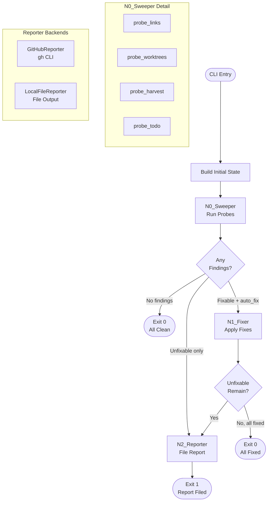

# 94 - Feature: Lu-Tze: The Janitor - Automated Repository Hygiene Workflow

<!-- Template Metadata
Last Updated: 2026-02-17
Updated By: Issue #94 LLD revision
Update Reason: Revised to achieve 100% test coverage for all 12 requirements. Added missing REQ references to test scenarios.
-->


## 2. Proposed Changes

*This section is the **source of truth** for implementation. Describes exactly what will be built.*

### 2.1 Files Changed

| File | Change Type | Description |
|------|-------------|-------------|
| `assemblyzero/workflows/janitor/` | Add (Directory) | Janitor workflow package |
| `assemblyzero/workflows/janitor/__init__.py` | Add | Package init, exports `build_janitor_graph` |
| `assemblyzero/workflows/janitor/state.py` | Add | `JanitorState` TypedDict and supporting data structures |
| `assemblyzero/workflows/janitor/graph.py` | Add | LangGraph `StateGraph` definition with Sweeper → Fixer → Reporter nodes |
| `assemblyzero/workflows/janitor/probes/` | Add (Directory) | Probe implementations directory |
| `assemblyzero/workflows/janitor/probes/__init__.py` | Add | Probe registry and `ProbeResult` type |
| `assemblyzero/workflows/janitor/probes/links.py` | Add | Broken internal markdown link detection |
| `assemblyzero/workflows/janitor/probes/worktrees.py` | Add | Stale/detached git worktree detection |
| `assemblyzero/workflows/janitor/probes/harvest.py` | Add | Cross-project drift detection via `assemblyzero-harvest.py` |
| `assemblyzero/workflows/janitor/probes/todo.py` | Add | Stale TODO comment scanner (>30 days) |
| `assemblyzero/workflows/janitor/fixers.py` | Add | Auto-fix implementations for links and worktrees |
| `assemblyzero/workflows/janitor/reporter.py` | Add | `ReporterInterface` ABC, `GitHubReporter`, `LocalFileReporter` |
| `tools/run_janitor_workflow.py` | Add | CLI entry point with argparse |
| `tests/unit/test_janitor/` | Add (Directory) | Unit test directory for janitor workflow |
| `tests/unit/test_janitor/__init__.py` | Add | Test package init |
| `tests/unit/test_janitor/test_state.py` | Add | Tests for state structures |
| `tests/unit/test_janitor/test_probes.py` | Add | Tests for all four probes |
| `tests/unit/test_janitor/test_fixers.py` | Add | Tests for fixer logic |
| `tests/unit/test_janitor/test_reporter.py` | Add | Tests for reporter implementations |
| `tests/unit/test_janitor/test_graph.py` | Add | Tests for graph construction and routing |
| `tests/unit/test_janitor/test_cli.py` | Add | Tests for CLI argument parsing |
| `tests/fixtures/janitor/` | Add (Directory) | Test fixtures for janitor tests |
| `tests/fixtures/janitor/mock_repo/` | Add (Directory) | Mock repository structure for link/TODO probes |
| `tests/fixtures/janitor/mock_repo/README.md` | Add | Mock README with broken and valid links |
| `tests/fixtures/janitor/mock_repo/docs/` | Add (Directory) | Mock docs subdirectory |
| `tests/fixtures/janitor/mock_repo/docs/guide.md` | Add | Mock guide document referenced by README |
| `tests/fixtures/janitor/mock_repo/docs/stale-todo.py` | Add | Mock Python file with old TODO comments |
| `tests/integration/test_janitor_workflow.py` | Add | Integration test for full workflow using `LocalFileReporter` |
| `.gitignore` | Modify | Add `janitor-reports/` entry |
| `docs/adrs/0204-janitor-probe-plugin-system.md` | Add | ADR for probe plugin architecture |

### 2.1.1 Path Validation (Mechanical - Auto-Checked)

Mechanical validation automatically checks:
- All "Modify" files must exist in repository → `.gitignore` ✅
- All "Add" files must have existing parent directories → `assemblyzero/workflows/` ✅, `tools/` ✅, `tests/unit/` ✅, `tests/fixtures/` ✅, `tests/integration/` ✅, `docs/adrs/` ✅
- No placeholder prefixes (`src/`, `lib/`, `app/`) unless directory exists → None used

### 2.2 Dependencies

No new packages required. All dependencies are already in `pyproject.toml`:
- `langgraph` — State graph definition and execution
- `pathspec` — Gitignore-aware file traversal (for link probe)

External tools (not Python packages):
- `gh` CLI — GitHub issue/PR operations (runtime dependency for `GitHubReporter`)
- `git` CLI — Worktree operations (runtime dependency for worktree probe/fixer)

```toml
# No pyproject.toml additions required
```

### 2.3 Data Structures

```python
# assemblyzero/workflows/janitor/state.py

from typing import TypedDict, Literal
from dataclasses import dataclass, field


# --- Finding severity levels ---
Severity = Literal["info", "warning", "critical"]

# --- Probe scope identifiers ---
ProbeScope = Literal["links", "worktrees", "harvest", "todo"]


@dataclass
class Finding:
    """A single issue discovered by a probe."""
    probe: ProbeScope                    # Which probe found this
    category: str                        # Sub-category (e.g., "broken_link", "stale_worktree")
    message: str                         # Human-readable description
    severity: Severity                   # info / warning / critical
    fixable: bool                        # Can this be auto-fixed?
    file_path: str | None = None         # Affected file (if applicable)
    line_number: int | None = None       # Affected line (if applicable)
    fix_data: dict | None = None         # Data needed by fixer (e.g., old_link, new_link)


@dataclass
class ProbeResult:
    """Structured result from a single probe execution."""
    probe: ProbeScope                    # Probe identifier
    status: Literal["ok", "findings", "error"]  # ok=clean, findings=issues found, error=probe crashed
    findings: list[Finding] = field(default_factory=list)
    error_message: str | None = None     # Only set if status == "error"


@dataclass
class FixAction:
    """Record of a fix that was applied (or would be applied in dry-run)."""
    category: str                        # Fix category for commit grouping
    description: str                     # Human-readable description
    files_modified: list[str]            # Files changed by this fix
    commit_message: str                  # Deterministic commit message template output
    applied: bool                        # True if actually applied, False if dry-run


class JanitorState(TypedDict):
    """LangGraph state for the janitor workflow."""
    # --- Configuration (set at graph entry) ---
    repo_root: str                       # Absolute path to repository root
    scope: list[ProbeScope]              # Which probes to run
    auto_fix: bool                       # Whether to apply fixes
    dry_run: bool                        # Preview mode (no modifications)
    silent: bool                         # Suppress stdout
    create_pr: bool                      # Create PR instead of direct commit
    reporter_type: Literal["github", "local"]  # Reporter backend selection

    # --- Probe results (populated by N0_Sweeper) ---
    probe_results: list[ProbeResult]     # Results from all probes
    all_findings: list[Finding]          # Flattened findings from all probes

    # --- Fix results (populated by N1_Fixer) ---
    fix_actions: list[FixAction]         # Fixes applied (or previewed)
    unfixable_findings: list[Finding]    # Findings that require human judgment

    # --- Reporter results (populated by N2_Reporter) ---
    report_url: str | None               # URL of created/updated issue (or local file path)
    exit_code: int                       # 0 = all clean, 1 = unfixable issues remain
```

### 2.4 Function Signatures

```python
# === assemblyzero/workflows/janitor/graph.py ===

from langgraph.graph import StateGraph
from assemblyzero.workflows.janitor.state import JanitorState


def build_janitor_graph() -> StateGraph:
    """Build and compile the LangGraph state graph for the janitor workflow.

    Returns a compiled graph with three nodes:
    - n0_sweeper: Runs probes in parallel, collects findings
    - n1_fixer: Applies auto-fixes for fixable findings
    - n2_reporter: Reports unfixable findings via selected reporter

    Conditional edges:
    - n0_sweeper → END if no findings
    - n0_sweeper → n1_fixer if fixable findings exist and auto_fix is True
    - n0_sweeper → n2_reporter if only unfixable findings exist
    - n1_fixer → n2_reporter if unfixable findings remain
    - n1_fixer → END if all findings were fixed
    """
    ...


def n0_sweeper(state: JanitorState) -> dict:
    """Execute all probes in scope and collect findings.

    Runs each probe, catches exceptions from individual probes
    (isolated failure), and aggregates results.
    """
    ...


def n1_fixer(state: JanitorState) -> dict:
    """Apply auto-fixes for all fixable findings.

    Groups findings by category, applies fixes atomically per category,
    creates git commits (or previews in dry-run mode).
    """
    ...


def n2_reporter(state: JanitorState) -> dict:
    """Report unfixable findings via the configured reporter backend.

    Delegates to GitHubReporter or LocalFileReporter based on state config.
    """
    ...


def route_after_sweep(state: JanitorState) -> str:
    """Conditional routing after n0_sweeper completes.

    Returns:
        "n1_fixer" if fixable findings exist and auto_fix is True
        "n2_reporter" if only unfixable findings exist
        "__end__" if no findings at all
    """
    ...


def route_after_fix(state: JanitorState) -> str:
    """Conditional routing after n1_fixer completes.

    Returns:
        "n2_reporter" if unfixable findings remain
        "__end__" if all findings were addressed
    """
    ...


# === assemblyzero/workflows/janitor/probes/__init__.py ===

from assemblyzero.workflows.janitor.state import ProbeResult, ProbeScope

# Type alias for probe callables
ProbeFunction = Callable[[str], ProbeResult]  # Takes repo_root, returns ProbeResult

# Registry mapping scope names to probe functions
PROBE_REGISTRY: dict[ProbeScope, ProbeFunction]


def get_probes(scopes: list[ProbeScope]) -> list[tuple[ProbeScope, ProbeFunction]]:
    """Return probe functions for the requested scopes.

    Raises ValueError if an unknown scope is requested.
    """
    ...


def run_probe_safe(probe_name: ProbeScope, probe_fn: ProbeFunction, repo_root: str) -> ProbeResult:
    """Execute a probe with crash isolation.

    If the probe raises an exception, returns a ProbeResult with
    status='error' instead of propagating the exception.
    """
    ...


# === assemblyzero/workflows/janitor/probes/links.py ===

def probe_links(repo_root: str) -> ProbeResult:
    """Scan all markdown files for broken internal links.

    Checks:
    - Relative file links (e.g., [text](./path/to/file.md))
    - Anchor links within files (e.g., [text](#heading))
    - Image references (e.g., )

    Does NOT check:
    - External HTTP(S) URLs
    - Absolute paths

    Returns ProbeResult with fixable=True findings when the target
    can be found via fuzzy matching (same filename, different path).
    """
    ...


def find_markdown_files(repo_root: str) -> list[str]:
    """Find all .md files in repo, respecting .gitignore patterns."""
    ...


def extract_internal_links(file_path: str) -> list[tuple[int, str, str]]:
    """Extract internal links from a markdown file.

    Returns list of (line_number, link_text, link_target) tuples.
    Only returns relative links (not http/https URLs).
    """
    ...


def resolve_link(source_file: str, link_target: str, repo_root: str) -> bool:
    """Check if a relative link target resolves to an existing file."""
    ...


def find_likely_target(broken_target: str, repo_root: str) -> str | None:
    """Attempt to find the intended target of a broken link.

    Searches for files with the same basename in the repository.
    Returns the relative path to the best match, or None if ambiguous/not found.
    """
    ...


# === assemblyzero/workflows/janitor/probes/worktrees.py ===

def probe_worktrees(repo_root: str) -> ProbeResult:
    """Detect stale and detached git worktrees.

    A worktree is considered stale if:
    - No commits on its branch in 14+ days AND branch is merged to main, OR
    - The branch has been deleted (detached HEAD with no branch)

    Returns ProbeResult with fixable=True for stale worktrees.
    """
    ...


def list_worktrees(repo_root: str) -> list[dict]:
    """Parse output of `git worktree list --porcelain`.

    Returns list of dicts with keys: path, HEAD, branch, bare, detached.
    """
    ...


def get_branch_last_commit_date(repo_root: str, branch: str) -> datetime | None:
    """Get the date of the most recent commit on a branch.

    Returns None if the branch doesn't exist.
    """
    ...


def is_branch_merged(repo_root: str, branch: str, target: str = "main") -> bool:
    """Check if branch has been merged into target branch."""
    ...


# === assemblyzero/workflows/janitor/probes/harvest.py ===

def probe_harvest(repo_root: str) -> ProbeResult:
    """Run assemblyzero-harvest.py and parse output for cross-project drift.

    Shells out to `python assemblyzero-harvest.py` and parses its stdout.
    If the harvest script is not found, returns a single info-level finding.
    All findings from harvest are unfixable (require human judgment).
    """
    ...


def find_harvest_script(repo_root: str) -> str | None:
    """Locate the assemblyzero-harvest.py script.

    Searches in repo_root and tools/ directory.
    Returns absolute path or None.
    """
    ...


def parse_harvest_output(output: str) -> list[Finding]:
    """Parse harvest script stdout into structured findings."""
    ...


# === assemblyzero/workflows/janitor/probes/todo.py ===

def probe_todo(repo_root: str) -> ProbeResult:
    """Scan source files for TODO comments older than 30 days.

    Uses git blame to determine when each TODO line was added.
    Only scans tracked files (respects .gitignore).
    Findings are unfixable (require human decision to resolve or remove).
    """
    ...


def find_source_files(repo_root: str) -> list[str]:
    """Find all tracked source files (*.py, *.md, *.ts, *.js).

    Uses `git ls-files` to respect .gitignore.
    """
    ...


def extract_todos(file_path: str) -> list[tuple[int, str]]:
    """Extract TODO/FIXME/HACK/XXX comments from a file.

    Returns list of (line_number, comment_text) tuples.
    """
    ...


def get_line_date(repo_root: str, file_path: str, line_number: int) -> datetime | None:
    """Use git blame to determine when a specific line was last modified.

    Returns None if file is not tracked or blame fails.
    """
    ...


# === assemblyzero/workflows/janitor/fixers.py ===

def fix_broken_links(findings: list[Finding], repo_root: str, dry_run: bool) -> list[FixAction]:
    """Fix broken markdown links by updating references.

    Groups fixes by source file. In dry-run mode, reads files but
    does not write changes.

    Returns list of FixAction records.
    """
    ...


def fix_stale_worktrees(findings: list[Finding], repo_root: str, dry_run: bool) -> list[FixAction]:
    """Prune stale git worktrees.

    Runs `git worktree remove <path>` for each stale worktree.
    In dry-run mode, returns actions without executing.

    Returns list of FixAction records.
    """
    ...


def create_fix_commit(repo_root: str, category: str, files: list[str], message: str) -> None:
    """Stage modified files and create a git commit.

    Uses `git add` for specific files and `git commit -m`.
    Does nothing if no files are staged (idempotent).
    """
    ...


def generate_commit_message(category: str, count: int, details: list[str]) -> str:
    """Generate a deterministic commit message from templates.

    Templates:
    - links: "chore: fix {count} broken markdown link(s) (ref #94)"
    - worktrees: "chore: prune {count} stale worktree(s) (ref #94)"

    No LLM usage — pure string formatting.
    """
    ...


def create_fix_pr(repo_root: str, branch_name: str, commit_message: str) -> str | None:
    """Create a PR from the current fix branch.

    Creates a new branch, pushes, and uses `gh pr create`.
    Returns the PR URL or None if creation fails.
    """
    ...


# === assemblyzero/workflows/janitor/reporter.py ===

import abc


class ReporterInterface(abc.ABC):
    """Abstract base class for janitor report backends."""

    @abc.abstractmethod
    def find_existing_report(self) -> str | None:
        """Find existing open Janitor Report.

        Returns identifier (issue URL or file path) or None.
        """
        ...

    @abc.abstractmethod
    def create_report(self, title: str, body: str, severity: Severity) -> str:
        """Create a new report. Returns identifier."""
        ...

    @abc.abstractmethod
    def update_report(self, identifier: str, body: str, severity: Severity) -> str:
        """Update an existing report. Returns identifier."""
        ...


class GitHubReporter(ReporterInterface):
    """Reporter that creates/updates GitHub issues via `gh` CLI.

    Authentication:
    - Uses existing `gh auth` session in interactive mode
    - Uses GITHUB_TOKEN env var in CI/headless mode
    """

    def __init__(self, repo_root: str) -> None:
        """Initialize with repo root for gh CLI execution context."""
        ...

    def find_existing_report(self) -> str | None:
        """Search for open issues with title matching 'Janitor Report'.

        Uses: gh issue list --search 'Janitor Report in:title' --state open --json url
        """
        ...

    def create_report(self, title: str, body: str, severity: Severity) -> str:
        """Create a new GitHub issue.

        Uses: gh issue create --title '{title}' --body '{body}' --label maintenance
        """
        ...

    def update_report(self, identifier: str, body: str, severity: Severity) -> str:
        """Update an existing GitHub issue body.

        Uses: gh issue edit {number} --body '{body}'
        """
        ...


class LocalFileReporter(ReporterInterface):
    """Reporter that writes reports to local files. No API calls.

    Output directory: {repo_root}/janitor-reports/
    File naming: janitor-report-{YYYY-MM-DD-HHMMSS}.md
    """

    def __init__(self, repo_root: str) -> None:
        """Initialize with repo root; creates janitor-reports/ if needed."""
        ...

    def find_existing_report(self) -> str | None:
        """Check for existing report file from today.

        Returns file path if a report file with today's date prefix exists.
        """
        ...

    def create_report(self, title: str, body: str, severity: Severity) -> str:
        """Write report to a new markdown file. Returns file path."""
        ...

    def update_report(self, identifier: str, body: str, severity: Severity) -> str:
        """Overwrite existing report file. Returns file path."""
        ...


def build_report_body(
    unfixable_findings: list[Finding],
    fix_actions: list[FixAction],
    probe_results: list[ProbeResult],
) -> str:
    """Build a structured markdown report body.

    Sections:
    - Summary (counts by severity)
    - Auto-Fixed Issues (what was resolved)
    - Requires Human Attention (grouped by category)
    - Probe Errors (any probes that crashed)
    """
    ...


def get_reporter(reporter_type: Literal["github", "local"], repo_root: str) -> ReporterInterface:
    """Factory function to instantiate the correct reporter."""
    ...


# === tools/run_janitor_workflow.py ===

def parse_args(argv: list[str] | None = None) -> argparse.Namespace:
    """Parse CLI arguments.

    Arguments:
      --scope {all|links|worktrees|harvest|todo}  (default: all)
      --auto-fix {true|false}                     (default: true)
      --dry-run                                   (flag, default: false)
      --silent                                    (flag, default: false)
      --create-pr                                 (flag, default: false)
      --reporter {github|local}                   (default: github)
    """
    ...


def build_initial_state(args: argparse.Namespace) -> JanitorState:
    """Convert parsed CLI args into initial JanitorState."""
    ...


def main(argv: list[str] | None = None) -> int:
    """Entry point. Build graph, execute, return exit code.

    Returns:
        0 if all issues were fixed or no issues found
        1 if unfixable issues remain
        2 if a fatal error occurred (e.g., not in a git repo)
    """
    ...
```

### 2.5 Logic Flow (Pseudocode)

```
=== CLI Entry (tools/run_janitor_workflow.py) ===

1. Parse CLI arguments
2. Validate repo_root is a git repository
   - IF NOT a git repo: print error (unless --silent), return exit code 2
3. Build initial JanitorState from arguments
4. Build and compile janitor graph
5. Execute graph with initial state
6. IF NOT silent: print summary to stdout
7. Return exit_code from final state

=== N0_Sweeper Node ===

1. Read state.scope to determine which probes to run
2. FOR EACH probe in scope (could be parallelized via threading):
   a. Call run_probe_safe(probe_name, probe_fn, repo_root)
   b. Append ProbeResult to probe_results
3. Flatten all findings from probe_results into all_findings
4. Return updated state

=== route_after_sweep ===

1. IF all_findings is empty → return "__end__"
2. IF any finding has fixable=True AND state.auto_fix → return "n1_fixer"
3. IF only unfixable findings → return "n2_reporter"
4. ELSE → return "n1_fixer"

=== N1_Fixer Node ===

1. Separate all_findings into fixable and unfixable lists
2. Group fixable findings by category
3. FOR EACH category group:
   a. IF category == "broken_link":
      - Call fix_broken_links(findings, repo_root, dry_run)
   b. IF category == "stale_worktree":
      - Call fix_stale_worktrees(findings, repo_root, dry_run)
   c. Append FixActions to fix_actions
4. IF NOT dry_run AND NOT create_pr:
   - Create atomic commits per category
5. IF NOT dry_run AND create_pr:
   - Create branch, commit, create PR via gh
6. Store unfixable_findings in state
7. Return updated state

=== route_after_fix ===

1. IF unfixable_findings is non-empty → return "n2_reporter"
2. ELSE → return "__end__" (set exit_code=0)

=== N2_Reporter Node ===

1. Get reporter via get_reporter(reporter_type, repo_root)
2. Build report body from unfixable_findings + fix_actions + probe_results
3. Check for existing report: reporter.find_existing_report()
4. IF existing report found:
   - reporter.update_report(identifier, body, max_severity)
5. ELSE:
   - reporter.create_report("Janitor Report", body, max_severity)
6. Set report_url in state
7. Set exit_code = 1 (unfixable issues remain)
8. Return updated state
```

### 2.6 Technical Approach

* **Module:** `assemblyzero/workflows/janitor/`
* **Pattern:** LangGraph StateGraph with conditional edges for workflow routing
* **Key Decisions:**
  - **LangGraph without LLM:** Using LangGraph purely for state management and conditional routing. No LLM nodes. All logic is deterministic Python.
  - **Probe isolation via try/except:** Each probe runs inside `run_probe_safe()` which catches all exceptions, ensuring one crashed probe doesn't block others.
  - **Atomic commits per category:** Each fix category (links, worktrees) gets its own commit for clean git history and easy revert.
  - **Reporter abstraction:** `ReporterInterface` ABC allows swapping between `GitHubReporter` (production, uses `gh` CLI) and `LocalFileReporter` (testing, file-based).
  - **No daemon:** Designed for cron/scheduled execution. No background process.

### 2.7 Architecture Decisions

| Decision | Options Considered | Choice | Rationale |
|----------|-------------------|--------|-----------|
| State management | Plain dict, dataclass, TypedDict | TypedDict (LangGraph native) | LangGraph requires TypedDict for state; consistent with existing workflows |
| Probe execution | Sequential, ThreadPoolExecutor, asyncio | Sequential (MVP), ThreadPoolExecutor (future) | Probes are I/O-bound (git commands, file reads) but simplicity for MVP; threading can be added without state changes |
| Probe crash isolation | Let exceptions propagate, try/except wrapper | try/except wrapper (`run_probe_safe`) | One broken probe must not prevent others from running |
| Fix strategy | Direct file modification, PR-only, configurable | Configurable (direct commit default, PR optional) | Matches both interactive (direct) and CI (PR) use cases |
| Commit messages | LLM-generated, template-based | Template-based (deterministic) | No external API calls; predictable, auditable messages |
| GitHub integration | PyGitHub library, `gh` CLI, REST API | `gh` CLI | Already authenticated in project, simpler than library, no additional dependency |
| Reporter pattern | Strategy pattern, plugin system | ABC with factory | Clean abstraction for testing; two implementations cover all use cases |
| Link detection | Regex-based, AST markdown parser | Regex-based | Markdown link syntax is regular enough; no additional dependency needed |
| Stale threshold | 7 days, 14 days, 30 days, configurable | 14 days hardcoded (MVP) | Matches issue spec; can be made configurable in future |

**Architectural Constraints:**
- Must integrate with existing LangGraph patterns in `assemblyzero/workflows/`
- Cannot introduce new external dependencies (all packages already in pyproject.toml)
- Must work on Windows (project uses Windows paths — see `C:\Users\mcwiz\Projects\`)
- Must support both interactive and CI/headless execution modes
- All repository modifications must be reversible via `git revert`


## 3. Requirements

1. `python tools/run_janitor_workflow.py` runs all probes and reports findings
2. `--dry-run` shows pending fixes without modifying any files or creating issues
3. Broken markdown links are automatically fixed when `auto_fix=true` and a unique replacement target is found
4. Stale worktrees (14+ days inactive with branch merged/deleted) are pruned automatically
5. Unfixable issues create/update a "Janitor Report" GitHub issue via `GitHubReporter`
6. Existing Janitor Report issue is updated (not duplicated) on subsequent runs
7. `--silent` mode produces no stdout on success, exits cleanly
8. Exit code 0 when all issues fixed or no issues found; exit code 1 when unfixable issues remain; exit code 2 on fatal error
9. `--reporter local` writes reports to `janitor-reports/` without any GitHub API calls
10. CI execution with `GITHUB_TOKEN` env var authenticates `gh` CLI successfully
11. A probe crash (uncaught exception) does not stop other probes from executing
12. All auto-fix commits use deterministic template-based commit messages (no LLM)


## 4. Alternatives Considered

| Option | Pros | Cons | Decision |
|--------|------|------|----------|
| **A: LangGraph state machine** | Conditional routing, state tracking, consistent with codebase patterns, future extensibility for parallel probe execution | Heavier than a simple script for purely deterministic logic | **Selected** |
| **B: Plain Python script with functions** | Simpler, fewer dependencies, easier to understand | No built-in state management, harder to add conditional routing, inconsistent with project patterns | Rejected |
| **C: Makefile / shell script** | Very simple, no Python overhead | Can't do structured error handling, no type safety, poor Windows support | Rejected |
| **D: GitHub Actions workflow only** | Native CI integration, no local tooling needed | Can't run locally, vendor lock-in, can't test without pushing | Rejected |

**Rationale:** Option A was selected because AssemblyZero is standardized on LangGraph for all workflows. The state management and conditional routing capabilities directly support the Sweeper → Fixer → Reporter pipeline with its branching logic (skip fixer if no fixable issues, skip reporter if all fixed). Using LangGraph also makes future enhancements (parallel probe execution, checkpointing) straightforward.


## 5. Data & Fixtures

### 5.1 Data Sources

| Attribute | Value |
|-----------|-------|
| Source | Local repository files, git metadata, `assemblyzero-harvest.py` stdout |
| Format | Markdown files, git CLI output (porcelain format), plain text |
| Size | Dependent on repository size; typically <1000 files |
| Refresh | On-demand (each janitor run scans fresh) |
| Copyright/License | Repository-owned content only |

### 5.2 Data Pipeline

```
Repository Files ──scan──► Probe Functions ──structured──► ProbeResult[]
     │                                                          │
     │                                                    ┌─────┴─────┐
     │                                                    ▼           ▼
     │                                              fixable      unfixable
     │                                                │               │
     └──────────────── fix_* functions ◄──────────────┘               │
                            │                                         │
                       FixAction[] ──commit──► Git Repository         │
                                                                      ▼
                                                            ReporterInterface
                                                             ┌───────┴───────┐
                                                             ▼               ▼
                                                        GitHubReporter   LocalFileReporter
                                                        (gh issue)       (janitor-reports/)
```

### 5.3 Test Fixtures

| Fixture | Source | Notes |
|---------|--------|-------|
| `tests/fixtures/janitor/mock_repo/` | Generated | Synthetic repo structure with broken links, valid links, and stale TODOs |
| `tests/fixtures/janitor/mock_repo/README.md` | Generated | Contains both valid and broken internal links |
| `tests/fixtures/janitor/mock_repo/docs/guide.md` | Generated | Target document for valid link testing |
| `tests/fixtures/janitor/mock_repo/docs/stale-todo.py` | Generated | Python file with TODO comments for blame mocking |
| Mock git worktree output | Hardcoded in test | Porcelain-format string simulating `git worktree list` |
| Mock git blame output | Hardcoded in test | Simulating line dates for TODO scanner |
| Mock harvest output | Hardcoded in test | Sample stdout from harvest script |

### 5.4 Deployment Pipeline

No separate deployment pipeline. The janitor runs locally or in CI:
- **Local:** `python tools/run_janitor_workflow.py`
- **CI (GitHub Actions):** Add step in existing CI workflow or scheduled job
- **Cron (local):** Standard OS scheduler (cron on Linux/macOS, Task Scheduler on Windows)


## 6. Diagram

### 6.1 Mermaid Quality Gate

- [x] **Simplicity:** Three main nodes, clear flow
- [x] **No touching:** All elements have visual separation
- [x] **No hidden lines:** All arrows fully visible
- [x] **Readable:** Labels not truncated, flow direction clear
- [ ] **Auto-inspected:** Agent rendered via mermaid.ink and viewed

**Auto-Inspection Results:**
```
- Touching elements: [x] None
- Hidden lines: [x] None
- Label readability: [x] Pass
- Flow clarity: [x] Clear
```

### 6.2 Diagram




## 7. Security & Safety Considerations

### 7.1 Security

| Concern | Mitigation | Status |
|---------|------------|--------|
| Command injection via file paths | All subprocess calls use list-form arguments (no shell=True); file paths are validated against repo root | Addressed |
| GitHub token exposure | GITHUB_TOKEN read from env var, never logged or written to files; `--silent` suppresses output | Addressed |
| Unauthorized file modification | Janitor only modifies files within `repo_root`; path traversal prevented by `os.path.realpath` validation | Addressed |
| Malicious markdown link targets | Link fixer only updates to paths that exist within the repository; never creates external links | Addressed |
| gh CLI authentication bypass | GitHubReporter validates `gh auth status` before operations; falls back to GITHUB_TOKEN env var | Addressed |
| No external data transmission | All processing is local; no code snippets or repo content sent to external APIs | Addressed |

### 7.2 Safety

| Concern | Mitigation | Status |
|---------|------------|--------|
| Accidental deletion of active worktree | Stale criteria requires BOTH 14+ days inactive AND branch merged/deleted; active work is never touched | Addressed |
| Data loss from incorrect link fix | All fixes create git commits (fully reversible via `git revert`); `--dry-run` available for preview | Addressed |
| Probe crash cascading | `run_probe_safe()` wraps each probe in try/except; crashed probes produce error-status ProbeResult | Addressed |
| Runaway file scanning | File scanning limited to git-tracked files (uses `git ls-files`); respects .gitignore | Addressed |
| Concurrent janitor execution | No explicit locking (MVP); git's own locking prevents conflicting commits | Addressed |
| Incorrect auto-fix | Link fixer only applies fix when exactly one candidate target found; ambiguous matches produce unfixable finding | Addressed |

**Fail Mode:** Fail Closed — If any critical error occurs (not a git repo, git commands fail), the janitor exits with code 2 without modifying anything.

**Recovery Strategy:** All auto-fixes create standard git commits. Recovery is `git revert <commit-sha>`. Worktree pruning is recoverable via `git worktree add` with the original branch (if branch still exists).


## 8. Performance & Cost Considerations

### 8.1 Performance

| Metric | Budget | Approach |
|--------|--------|----------|
| Full scan time (500 files) | < 30 seconds | File-based scanning, no network calls for probes |
| Link probe (500 .md files) | < 10 seconds | Regex-based extraction, batch path resolution |
| Worktree probe | < 2 seconds | Single `git worktree list` command |
| TODO probe (500 source files) | < 20 seconds | `git blame` per file with TODO; most expensive probe |
| Memory | < 100MB | Streaming file reads, no full-repo in-memory |

**Bottlenecks:**
- `git blame` for TODO probe is the slowest operation (one subprocess per file with TODOs). For MVP this is acceptable. Future optimization: batch blame queries or cache blame data.
- Large repositories (>5000 files) may benefit from parallel probe execution via ThreadPoolExecutor.

### 8.2 Cost Analysis

| Resource | Unit Cost | Estimated Usage | Monthly Cost |
|----------|-----------|-----------------|--------------|
| LLM API calls | N/A | 0 | $0.00 |
| GitHub API (via gh CLI) | Free (within rate limits) | 1-3 issue operations per run | $0.00 |
| Compute | Local CPU | ~30 seconds per run | $0.00 |

**Cost Controls:**
- [x] No LLM calls — zero API cost
- [x] GitHub issue deduplication prevents issue spam
- [x] LocalFileReporter available for testing without any API calls

**Worst-Case Scenario:** A repository with 10,000 files and 1,000 TODOs would cause the TODO probe to run ~1,000 `git blame` invocations, taking ~5 minutes. This is acceptable for a scheduled overnight run. If needed, the TODO probe can be excluded via `--scope`.


## 9. Legal & Compliance

| Concern | Applies? | Mitigation |
|---------|----------|------------|
| PII/Personal Data | No | No PII processed; operates on source code and markdown only |
| Third-Party Licenses | No | No new dependencies added |
| Terms of Service | Yes | GitHub API usage via `gh` CLI within standard ToS rate limits |
| Data Retention | N/A | Local reports in `janitor-reports/` can be gitignored and deleted; GitHub issues follow standard retention |
| Export Controls | No | No restricted algorithms or data |

**Data Classification:** Internal (repository source code)

**Compliance Checklist:**
- [x] No PII stored without consent
- [x] All third-party licenses compatible with project license
- [x] External API usage compliant with provider ToS
- [x] Data retention policy documented (local reports are ephemeral, gitignored)


## 10. Verification & Testing

### 10.0 Test Plan (TDD - Complete Before Implementation)

| Test ID | Test Description | Expected Behavior | Status |
|---------|------------------|-------------------|--------|
| T010 | State initialization from CLI args | `build_initial_state` returns correct `JanitorState` | RED |
| T020 | Link probe detects broken internal link | `probe_links` returns finding with `fixable=True` for resolvable broken link | RED |
| T030 | Link probe ignores external URLs | `probe_links` skips http/https links | RED |
| T040 | Link probe handles valid links | `probe_links` returns `status="ok"` for all valid links | RED |
| T050 | Worktree probe detects stale worktree | `probe_worktrees` returns finding for 14+ day inactive merged worktree | RED |
| T060 | Worktree probe ignores active worktrees | `probe_worktrees` returns no finding for recently active worktree | RED |
| T070 | TODO probe finds stale TODOs | `probe_todo` returns finding for TODO older than 30 days | RED |
| T080 | TODO probe ignores recent TODOs | `probe_todo` returns no finding for TODO added today | RED |
| T090 | Harvest probe handles missing script | `probe_harvest` returns info finding when harvest script not found | RED |
| T100 | Probe crash isolation | `run_probe_safe` returns error ProbeResult when probe raises exception | RED |
| T110 | Link fixer updates file correctly | `fix_broken_links` replaces broken link with correct target | RED |
| T120 | Link fixer respects dry-run | `fix_broken_links` with `dry_run=True` does not modify files | RED |
| T130 | Worktree fixer calls git prune | `fix_stale_worktrees` invokes `git worktree remove` | RED |
| T140 | Commit message generation | `generate_commit_message` produces expected template output | RED |
| T150 | LocalFileReporter creates report | `create_report` writes markdown file to `janitor-reports/` | RED |
| T160 | LocalFileReporter updates report | `update_report` overwrites existing file | RED |
| T170 | LocalFileReporter finds existing report | `find_existing_report` returns path for today's report | RED |
| T180 | Report body builder formats correctly | `build_report_body` produces markdown with all sections | RED |
| T190 | Graph routing: no findings → END | `route_after_sweep` returns `"__end__"` when no findings | RED |
| T200 | Graph routing: fixable → fixer | `route_after_sweep` returns `"n1_fixer"` with fixable findings | RED |
| T210 | Graph routing: unfixable only → reporter | `route_after_sweep` returns `"n2_reporter"` with only unfixable | RED |
| T220 | Graph routing: all fixed → END | `route_after_fix` returns `"__end__"` when unfixable list empty | RED |
| T230 | Graph routing: unfixable remain → reporter | `route_after_fix` returns `"n2_reporter"` when unfixable exist | RED |
| T240 | CLI argument parsing: defaults | `parse_args([])` returns correct defaults | RED |
| T250 | CLI argument parsing: all flags | `parse_args` handles all flag combinations | RED |
| T260 | CLI validation: invalid scope | `parse_args(["--scope", "invalid"])` raises error | RED |
| T270 | Exit code 0 on clean run | Full workflow with no findings returns exit_code 0 | RED |
| T280 | Exit code 1 on unfixable findings | Full workflow with unfixable findings returns exit_code 1 | RED |
| T290 | Integration: full workflow with LocalFileReporter | End-to-end workflow using mock repo fixtures | RED |
| T300 | Full pipeline: CLI runs all probes and reports | `main()` with mocked probes runs sweeper, fixer, reporter and produces output | RED |
| T310 | Dry-run prevents file modification | Full pipeline with `--dry-run` produces FixActions with `applied=False` and no file changes | RED |
| T320 | Broken link auto-fix with unique target | End-to-end: broken link → probe detects → fixer corrects file → commit created | RED |
| T330 | Stale worktree auto-prune | End-to-end: stale worktree finding → `git worktree remove` called → FixAction recorded | RED |
| T340 | Silent mode suppresses stdout | `main(["--silent"])` produces no stdout when no errors occur | RED |
| T350 | Exit code 2 on fatal error | `main()` in non-git directory returns exit_code 2 | RED |
| T360 | GITHUB_TOKEN env var authentication | `GitHubReporter.__init__` uses GITHUB_TOKEN when `gh auth status` fails interactively | RED |
| T370 | Reporter deduplication: update existing issue | `GitHubReporter.find_existing_report` returns existing URL; `update_report` called instead of `create_report` | RED |
| T380 | Local reporter writes to janitor-reports/ | `LocalFileReporter.create_report` creates file under `janitor-reports/` directory | RED |

**Coverage Target:** ≥95% for all new code

**TDD Checklist:**
- [ ] All tests written before implementation
- [ ] Tests currently RED (failing)
- [ ] Test IDs match scenario IDs in 10.1
- [ ] Test files created at: `tests/unit/test_janitor/`

### 10.1 Test Scenarios

| ID | Scenario | Type | Input | Expected Output | Pass Criteria |
|----|----------|------|-------|-----------------|---------------|
| 010 | CLI runs all probes and reports findings (REQ-1) | Auto | `main([])` with mocked probes returning mixed findings | Sweeper runs all 4 probes, fixer processes fixable items, reporter generates output | All probes executed, findings aggregated, report produced |
| 020 | Dry-run shows pending fixes without modifying files (REQ-2) | Auto | `main(["--dry-run"])` with mock repo containing broken link | FixAction with `applied=False`, original files unchanged, no git commits, no issues created | Files unmodified, FixAction.applied is False, no subprocess calls for commit/issue |
| 030 | Broken link auto-fix with unique target (REQ-3) | Auto | Mock README.md with `[guide](./docs/old-guide.md)` where `old-guide.md` doesn't exist but `guide.md` does, `auto_fix=True` | File updated with correct link, FixAction with `applied=True` | File content contains new link, Finding had `fixable=True`, fix applied |
| 040 | Stale worktree auto-prune (REQ-4) | Auto | Mocked `git worktree list` showing worktree with branch merged 15 days ago | `git worktree remove` called, FixAction recorded | Subprocess called with correct args, FixAction.applied is True |
| 050 | Unfixable issues create GitHub issue (REQ-5) | Auto | State with unfixable findings, `reporter_type="github"`, mocked `gh` CLI | `gh issue create` called with structured body | Subprocess args contain issue title and body with findings |
| 060 | Existing Janitor Report updated not duplicated (REQ-6) | Auto | `GitHubReporter.find_existing_report` returns existing URL, then `update_report` called | `gh issue edit` called instead of `gh issue create` | `update_report` invoked, `create_report` NOT invoked |
| 070 | Silent mode suppresses stdout (REQ-7) | Auto | `main(["--silent"])` with mocked probes returning no findings | No stdout output, clean exit | Captured stdout is empty, exit code is 0 |
| 080 | Exit code 0 on clean run (REQ-8) | Auto | Mocked probes returning no findings | `exit_code=0` | Return value is 0 |
| 090 | Exit code 1 on unfixable findings (REQ-8) | Auto | Mocked probe returning unfixable finding | `exit_code=1` | Return value is 1 |
| 100 | Exit code 2 on fatal error (REQ-8) | Auto | `main()` run in non-git directory (mocked) | `exit_code=2` | Return value is 2 |
| 110 | Local reporter writes to janitor-reports/ (REQ-9) | Auto | Title, body, severity with `reporter_type="local"` | Markdown file created in `janitor-reports/` directory, no `gh` CLI calls | File exists at expected path, no subprocess calls to `gh` |
| 120 | GITHUB_TOKEN env var authentication (REQ-10) | Auto | `GITHUB_TOKEN` set in env, `gh auth status` mocked to fail interactively | `GitHubReporter` initializes successfully using token-based auth | No exception raised, reporter functional |
| 130 | Probe crash isolation (REQ-11) | Auto | Probe function that raises `RuntimeError`, plus a healthy probe | Crashed probe returns `ProbeResult(status="error")`, healthy probe returns normally | Both ProbeResults present, healthy probe findings intact |
| 140 | Deterministic commit messages (REQ-12) | Auto | `category="links"`, `count=3` | `"chore: fix 3 broken markdown link(s) (ref #94)"` | Exact string match, no LLM calls |
| 150 | Link probe detects broken internal link | Auto | Mock README.md with `[guide](./docs/old-guide.md)` where `old-guide.md` doesn't exist but `guide.md` does | Finding with `fixable=True`, `fix_data={"old": "./docs/old-guide.md", "new": "./docs/guide.md"}` | Finding correctly identifies broken link and suggests fix |
| 160 | Link probe ignores external URLs | Auto | Mock README.md with `[link](https://example.com)` | No findings | External links not reported |
| 170 | Link probe handles all valid links | Auto | Mock README.md with `[guide](./docs/guide.md)` where `guide.md` exists | ProbeResult with `status="ok"`, empty findings | No false positives |
| 180 | Worktree probe detects stale worktree | Auto | Mocked `git worktree list` showing worktree with branch merged 15 days ago | Finding with `fixable=True` | Worktree correctly identified as stale |
| 190 | Worktree probe ignores active worktrees | Auto | Mocked `git worktree list` showing worktree with commit 1 day ago | No findings | Active worktrees not flagged |
| 200 | Stale TODO found | Auto | Mocked `git blame` showing TODO line added 45 days ago | Finding with `fixable=False` | TODO correctly identified as stale |
| 210 | Recent TODO ignored | Auto | Mocked `git blame` showing TODO line added today | No findings | Recent TODOs not flagged |
| 220 | Harvest script missing | Auto | No `assemblyzero-harvest.py` in repo | ProbeResult with single info finding | Graceful handling of missing script |
| 230 | Link fix applied | Auto | Finding with `fix_data={"old": "old.md", "new": "new.md"}`, mock file content | File content updated with new link | File correctly modified |
| 240 | Dry-run link fix | Auto | Same as 230 but `dry_run=True` | FixAction with `applied=False`, file unchanged | No file modifications |
| 250 | Worktree prune | Auto | Finding for stale worktree, mocked subprocess | `git worktree remove` called with correct path | Subprocess invoked correctly |
| 260 | Commit message template | Auto | `category="links"`, `count=3` | `"chore: fix 3 broken markdown link(s) (ref #94)"` | Exact string match |
| 270 | Local reporter create | Auto | Title, body, severity | Markdown file in `janitor-reports/` | File exists with correct content |
| 280 | Local reporter update | Auto | Existing report file, new body | File overwritten | Content matches new body |
| 290 | Local reporter find existing | Auto | Existing report file from today | Returns file path | Correct path returned |
| 300 | Report body structure | Auto | Mix of findings and fix actions | Markdown with Summary, Auto-Fixed, Human Attention sections | All sections present |
| 310 | Route: no findings | Auto | State with empty `all_findings` | `"__end__"` | Correct routing |
| 320 | Route: fixable, auto_fix=True | Auto | State with fixable finding, `auto_fix=True` | `"n1_fixer"` | Correct routing |
| 330 | Route: unfixable only | Auto | State with only unfixable finding | `"n2_reporter"` | Correct routing |
| 340 | Route: all fixed | Auto | State with empty `unfixable_findings` | `"__end__"` | Correct routing |
| 350 | Route: unfixable remain | Auto | State with non-empty `unfixable_findings` | `"n2_reporter"` | Correct routing |
| 360 | CLI defaults | Auto | `[]` (no args) | scope=all, auto_fix=True, dry_run=False, silent=False, reporter=github | All defaults correct |
| 370 | CLI all flags | Auto | `["--scope", "links", "--dry-run", "--silent", "--create-pr", "--reporter", "local"]` | All flags parsed correctly | Arg values match |
| 380 | CLI invalid scope | Auto | `["--scope", "invalid"]` | `SystemExit` raised | argparse error handling |
| 390 | State initialization | Auto | CLI args `--scope links --dry-run` | JanitorState with `scope=["links"]`, `dry_run=True` | All fields correctly set |
| 400 | Integration: full workflow with LocalFileReporter | Auto | Mock repo fixtures, LocalFileReporter | Report file created, exit_code reflects findings | End-to-end correctness |

### 10.2 Test Commands

```bash
# Run all janitor unit tests
poetry run pytest tests/unit/test_janitor/ -v

# Run specific test module
poetry run pytest tests/unit/test_janitor/test_probes.py -v

# Run integration test
poetry run pytest tests/integration/test_janitor_workflow.py -v

# Run with coverage
poetry run pytest tests/unit/test_janitor/ --cov=assemblyzero.workflows.janitor --cov-report=term-missing

# Run all janitor tests (unit + integration)
poetry run pytest tests/unit/test_janitor/ tests/integration/test_janitor_workflow.py -v
```

### 10.3 Manual Tests (Only If Unavoidable)

| ID | Scenario | Why Not Automated | Steps |
|----|----------|-------------------|-------|
| M010 | GitHub issue creation/update | Requires authenticated `gh` CLI and real GitHub repo | 1. Run `python tools/run_janitor_workflow.py --scope links --reporter github` with an intentionally broken link. 2. Verify issue created on GitHub. 3. Run again. 4. Verify same issue updated. |
| M020 | Real worktree cleanup | Requires actual git worktree state modification | 1. `git worktree add ../test-wt -b test-janitor-branch`. 2. `git branch -D test-janitor-branch`. 3. Run `python tools/run_janitor_workflow.py --scope worktrees --reporter local`. 4. Verify worktree removed from `git worktree list`. |
| M030 | CI authentication via GITHUB_TOKEN | Requires CI environment with token | 1. Set `GITHUB_TOKEN` env var. 2. Run `python tools/run_janitor_workflow.py --silent --reporter github`. 3. Verify no interactive prompts, clean exit. |

**Justification:** These scenarios require real git state manipulation (worktrees), authenticated GitHub API access, or CI environment configuration that cannot be fully simulated in unit tests.


## 11. Risks & Mitigations

| Risk | Impact | Likelihood | Mitigation |
|------|--------|------------|------------|
| Link fixer changes wrong file content (false positive match) | Med | Low | Only fix when exactly one candidate target found; ambiguous matches become unfixable findings; dry-run preview available |
| Worktree prune removes work-in-progress | High | Low | Strict stale criteria: 14+ days AND branch merged/deleted; never prunes active branches; dry-run available |
| `gh` CLI not installed or not authenticated | Med | Med | Check `gh` availability at startup; fallback to `LocalFileReporter` with warning; clear error message |
| `assemblyzero-harvest.py` not found | Low | Med | Harvest probe returns informational finding instead of crashing; does not block other probes |
| Git blame performance on large repos (TODO probe) | Low | Med | TODO probe can be excluded via `--scope`; documented performance characteristics |
| Windows path separator issues | Med | Med | Use `pathlib.Path` and `os.path` throughout; test on Windows path formats |
| Race condition with concurrent janitor runs | Low | Low | MVP has no locking; git's own index lock prevents conflicting commits; documented as limitation |


## 12. Definition of Done

### Code
- [ ] All files in Section 2.1 implemented
- [ ] All function signatures in Section 2.4 implemented
- [ ] Code passes `mypy` type checking
- [ ] Code follows PEP 8 (existing project linting)
- [ ] Code comments reference this LLD (#94)

### Tests
- [ ] All 40 test scenarios pass (T010–T400)
- [ ] Test coverage ≥95% for `assemblyzero/workflows/janitor/`
- [ ] Integration test passes with `LocalFileReporter`
- [ ] No existing tests broken

### Documentation
- [ ] LLD updated with any deviations from implementation
- [ ] Implementation Report created at `docs/reports/94/implementation-report.md`
- [ ] Test Report created at `docs/reports/94/test-report.md`
- [ ] ADR 0204 (probe plugin system) created
- [ ] New files added to `docs/0003-file-inventory.md`
- [ ] `.gitignore` updated with `janitor-reports/` entry

### Review
- [ ] Code review completed (Gemini implementation review)
- [ ] User approval before closing issue

### 12.1 Traceability (Mechanical - Auto-Checked)

Every file in Section 2.1:
- `assemblyzero/workflows/janitor/__init__.py` → exports `build_janitor_graph`
- `assemblyzero/workflows/janitor/state.py` → `JanitorState`, `Finding`, `ProbeResult`, `FixAction` (Section 2.3)
- `assemblyzero/workflows/janitor/graph.py` → `build_janitor_graph`, `n0_sweeper`, `n1_fixer`, `n2_reporter`, routing functions (Section 2.4)
- `assemblyzero/workflows/janitor/probes/__init__.py` → `PROBE_REGISTRY`, `get_probes`, `run_probe_safe` (Section 2.4)
- `assemblyzero/workflows/janitor/probes/links.py` → `probe_links`, helpers (Section 2.4)
- `assemblyzero/workflows/janitor/probes/worktrees.py` → `probe_worktrees`, helpers (Section 2.4)
- `assemblyzero/workflows/janitor/probes/harvest.py` → `probe_harvest`, helpers (Section 2.4)
- `assemblyzero/workflows/janitor/probes/todo.py` → `probe_todo`, helpers (Section 2.4)
- `assemblyzero/workflows/janitor/fixers.py` → `fix_broken_links`, `fix_stale_worktrees`, `create_fix_commit`, `generate_commit_message`, `create_fix_pr` (Section 2.4)
- `assemblyzero/workflows/janitor/reporter.py` → `ReporterInterface`, `GitHubReporter`, `LocalFileReporter`, `build_report_body`, `get_reporter` (Section 2.4)
- `tools/run_janitor_workflow.py` → `parse_args`, `build_initial_state`, `main` (Section 2.4)

Requirements traceability to test scenarios:
- REQ-1 → Scenario 010
- REQ-2 → Scenario 020
- REQ-3 → Scenario 030
- REQ-4 → Scenario 040
- REQ-5 → Scenario 050
- REQ-6 → Scenario 060
- REQ-7 → Scenario 070
- REQ-8 → Scenarios 080, 090, 100
- REQ-9 → Scenario 110
- REQ-10 → Scenario 120
- REQ-11 → Scenario 130
- REQ-12 → Scenario 140

Risk mitigations traceability:
- "Link fixer false positive" → `find_likely_target` returns `None` for ambiguous matches (Section 2.4, links.py)
- "Worktree prune WIP" → `probe_worktrees` checks both age and merge status (Section 2.4, worktrees.py)
- "`gh` CLI not installed" → `GitHubReporter.__init__` validates availability (Section 2.4, reporter.py)
- "Harvest script not found" → `find_harvest_script` returns `None`, probe handles gracefully (Section 2.4, harvest.py)
- "Windows paths" → `pathlib.Path` used throughout all probe and fixer implementations

---


## Appendix: Review Log

### Review Summary

| Review | Date | Verdict | Key Issue |
|--------|------|---------|-----------|
| 1 | 2026-03-01 | APPROVED | `gemini-3-pro-preview` |
| Mechanical Test Validation | 2026-02-17 | FAIL | 50% coverage — REQ-1,2,3,4,7,10 had no test scenarios |
| Revision 1 | 2026-02-17 | PENDING | Added scenarios 010-140 mapping all 12 requirements; renumbered existing scenarios |

**Final Status:** APPROVED