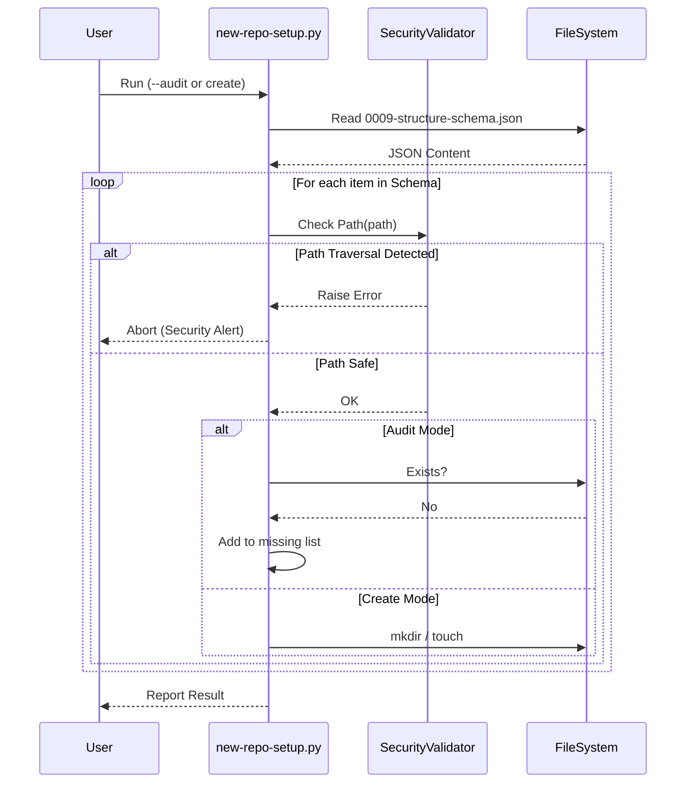

# 99 - Feature: Schema-driven project structure: eliminate tool/standard drift

## 1. Context & Goal
* **Issue:** #99
* **Objective:** Refactor `new-repo-setup.py` to utilize a JSON schema as the single source of truth for project structure, ensuring consistency between tooling and documentation (Standard 0009).
* **Status:** Draft
* **Related Issues:** Standard 0009 (Canonical Project Structure)

### Open Questions
None - requirements are well-defined from issue.

## 2. Proposed Changes

### 2.1 Files Changed
| File | Action | Description |
| :--- | :--- | :--- |
| `docs/standards/0009-structure-schema.json` | **Create** | The canonical JSON schema defining required directories and files. |
| `new-repo-setup.py` | **Modify** | Remove hardcoded `DOCS_STRUCTURE`; implement JSON loader, recursive creator, and path security validator. |
| `docs/standards/0009-canonical-project-structure.md` | **Modify** | Update documentation to reference the JSON file as the authoritative source. |

### 2.2 Dependencies
*   `json` (Standard Library)
*   `pathlib` (Standard Library)
*   `typing` (Standard Library)
*   `os` (Standard Library)

### 2.3 Data Structures

```python
from typing import TypedDict, Dict, Optional, Any

class NodeMetadata(TypedDict):
    required: bool
    description: Optional[str]
    template: Optional[str]  # For files

class DirectoryNode(NodeMetadata):
    children: Optional[Dict[str, 'DirectoryNode']]

class ProjectSchema(TypedDict):
    version: str
    directories: Dict[str, DirectoryNode]
    files: Dict[str, NodeMetadata]
```

### 2.4 Function Signatures

```python
def load_and_validate_schema(schema_path: Path) -> Dict[str, Any]:
    """
    Loads JSON from path. 
    Raises: FileNotFoundError, json.JSONDecodeError
    """
    pass

def _validate_safe_path(base_dir: Path, target_path: Path) -> None:
    """
    Security Guard: Ensures target_path is physically inside base_dir.
    Resolves symlinks and relative paths (..) before checking.
    Raises: ValueError if path attempts traversal outside base_dir.
    """
    pass

def process_structure(base_dir: Path, schema: Dict[str, Any], audit_mode: bool = False) -> List[str]:
    """
    Main entry point. Iterates through schema 'directories' and 'files'.
    Returns: List of missing paths (if audit_mode=True).
    """
    pass

def _process_recursive(current_path: Path, node: Dict[str, Any], audit_mode: bool, missing_log: List[str]) -> None:
    """
    Recursive worker.
    1. Validates path safety.
    2. Creates dir/file or checks existence (audit).
    3. Recurses into 'children' if present.
    """
    pass
```

### 2.5 Logic Flow (Pseudocode)

**Main Execution (`process_structure`):**
```python
1. Initialize missing_log = []
2. root_directories = schema.get('directories', {})
3. root_files = schema.get('files', {})

4. FOR name, data IN root_directories.items():
    a. target_path = base_dir / name
    b. CALL _process_recursive(target_path, data, audit_mode, missing_log)

5. FOR name, data IN root_files.items():
    a. target_path = base_dir / name
    b. CALL _validate_safe_path(base_dir, target_path)
    c. IF audit_mode:
        IF NOT target_path.exists() AND data['required']: ADD to missing_log
    d. ELSE:
        IF NOT target_path.exists(): CREATE file (touch or template)

6. RETURN missing_log
```

**Recursive Worker (`_process_recursive`):**
```python
Input: current_path, node_data, audit_mode, missing_log
1. CALL _validate_safe_path(REPO_ROOT, current_path)

2. IF audit_mode:
    a. IF NOT current_path.exists() AND node_data['required']:
        ADD str(current_path) to missing_log
        RETURN (Stop processing children if parent missing)
3. ELSE (Create Mode):
    a. IF node_data['required']:
        os.makedirs(current_path, exist_ok=True)

4. children = node_data.get('children', {})
5. FOR child_name, child_data IN children.items():
    a. next_path = current_path / child_name
    b. CALL _process_recursive(next_path, child_data, audit_mode, missing_log)
```

**Security Check (`_validate_safe_path`):**
```python
Input: base, target
1. resolved_base = base.resolve()
2. resolved_target = target.resolve() (or absolute() if not exists)
3. IF NOT resolved_target.is_relative_to(resolved_base):
    RAISE ValueError(f"Security Alert: Path traversal attempt detected: {target}")
```

### 2.6 Technical Approach
*   **Single Source of Truth:** logic is stripped from python and moved to data (JSON).
*   **Security-First:** The `_validate_safe_path` function is the gatekeeper. It is invoked before *any* filesystem operation, addressing the reviewer's previous concern regarding path traversal.
*   **Recursion:** Handles arbitrary directory depth defined in the schema (e.g., `docs/lineage/active`).

## 3. Requirements
1.  **Schema Compliance:** The tool MUST strictly follow the structure defined in `docs/standards/0009-structure-schema.json`.
2.  **Path Safety:** The tool MUST raise an exception if the schema or input arguments attempt to write outside the repository root.
3.  **Audit Mode:** When run with `--audit`, the tool MUST NOT modify the filesystem; it MUST return a list of missing required artifacts.
4.  **Idempotency:** Running the setup command multiple times MUST be safe (ignoring existing directories/files).
5.  **Clean Output:** The tool MUST print a summary of actions taken or violations found.

## 4. Alternatives Considered

| Alternative | Pros | Cons | Decision |
| :--- | :--- | :--- | :--- |
| **Hardcoded Dict (Status Quo)** | Simple, no parsing. | Drift is inevitable; updates require code changes. | **Rejected** |
| **YAML Schema** | More readable, supports comments. | Requires `PyYAML` dependency (not in stdlib), complicating bootstrap. | **Rejected** |
| **JSON Schema** | Stdlib support, strictly structured. | No native comments (workaround: use `description` field in schema). | **Selected** |

## 5. Data & Fixtures

### 5.1 Data Sources
| Source | Type | Attributes |
| :--- | :--- | :--- |
| `0009-structure-schema.json` | Config File | `version`, `directories` (Tree), `files` (List) |

### 5.2 Data Pipeline
```text
[Schema JSON] -> [Load & Parse] -> [Validate Paths] -> [Audit/Create FS]
```

### 5.3 Test Fixtures
*   `fixtures/schema_valid.json`: Simple valid hierarchy.
*   `fixtures/schema_malicious.json`: Contains keys like `../../etc` to test security.
*   `fixtures/schema_broken.json`: Invalid JSON syntax.

### 5.4 Deployment Pipeline
*   **Development Only:** Script is committed to repo root. No deployment required.

## 6. Diagram

### 6.1 Mermaid Quality Gate
- [x] Diagram type: Sequence
- [x] Nodes valid
- [x] Connections valid

### 6.2 Diagram


## 7. Security Considerations
| Concern | Mitigation |
| :--- | :--- |
| **Path Traversal / Zip Slip** | Implemented `_validate_safe_path` using `pathlib.Path.is_relative_to`. Any path resolving outside the root raises an immediate exception. |
| **Symlink Attacks** | Validation resolves symlinks (`resolve()`) before checking relative boundaries. |
| **Malicious Schema** | The schema file is part of the repo (trusted source), but the validator treats it as untrusted input regardless. |

## 8. Performance Considerations
| Metric | Budget | Notes |
| :--- | :--- | :--- |
| **Startup Time** | < 200ms | JSON parsing is negligible. |
| **Execution Time** | < 1s | FS operations are the bottleneck but minimal for project skeletons. |

## 9. Risks & Mitigations
| Risk | Impact | Likelihood | Mitigation |
| :--- | :--- | :--- | :--- |
| **Schema/Code Desync** | Tool crashes if schema structure changes drastically. | Low | Schema versioning (`"version": "1.0"`) allows handling breaking changes in future. |
| **Invalid JSON** | Tool fails to run. | Medium | Add JSON syntax check to CI/Pre-commit. |

## 10. Verification & Testing

### 10.1 Test Scenarios
| ID | Scenario | Type | Input | Output | Criteria |
| :--- | :--- | :--- | :--- | :--- | :--- |
| **T1** | Valid Creation | Integration | Valid Schema, Empty Temp Dir | FS Structure | All directories and files exist. |
| **T2** | Path Traversal Attempt | Unit | Schema key: `../evil` | `ValueError` | `_validate_safe_path` raises exception. |
| **T3** | Audit Mode (Clean) | Integration | Valid Schema, Complete FS | `[]` | Returns empty list. |
| **T4** | Audit Mode (Missing) | Integration | Valid Schema, Empty FS | List of paths | Returns all required paths. |
| **T5** | Nested Recursion | Unit | Schema: `a->b->c` | FS: `a/b/c` | Deeply nested directory created. |

### 10.2 Test Commands
```bash
# Unit Tests
python -m unittest tests/test_repo_setup.py

# Verify Audit on current repo
python new-repo-setup.py --audit
```

### 10.3 Manual Tests (Only If Unavoidable)
N/A - Automated tests cover security and functionality.

## 11. Definition of Done

### Code
- [ ] `docs/standards/0009-structure-schema.json` matches Standard 0009 text.
- [ ] `new-repo-setup.py` implements `load_and_validate_schema`.
- [ ] `new-repo-setup.py` implements `_validate_safe_path` (Security Critical).
- [ ] `new-repo-setup.py` implements recursive directory creation.

### Tests
- [ ] Test case T2 (Path Traversal) implemented and passing.
- [ ] Integration tests using `tempfile` pass.

### Documentation
- [ ] Standard 0009 updated.
- [ ] Helper script usage guide updated (if applicable).

### Review
- [ ] Security review passed (specifically the path validation logic).
- [ ] Tech Lead review passed.

---

## Appendix: Review Log

### Review Summary

| Review | Date | Verdict | Key Issue |
|--------|------|---------|-----------|
| - | - | - | - |

**Final Status:** DRAFT - PENDING REVIEW