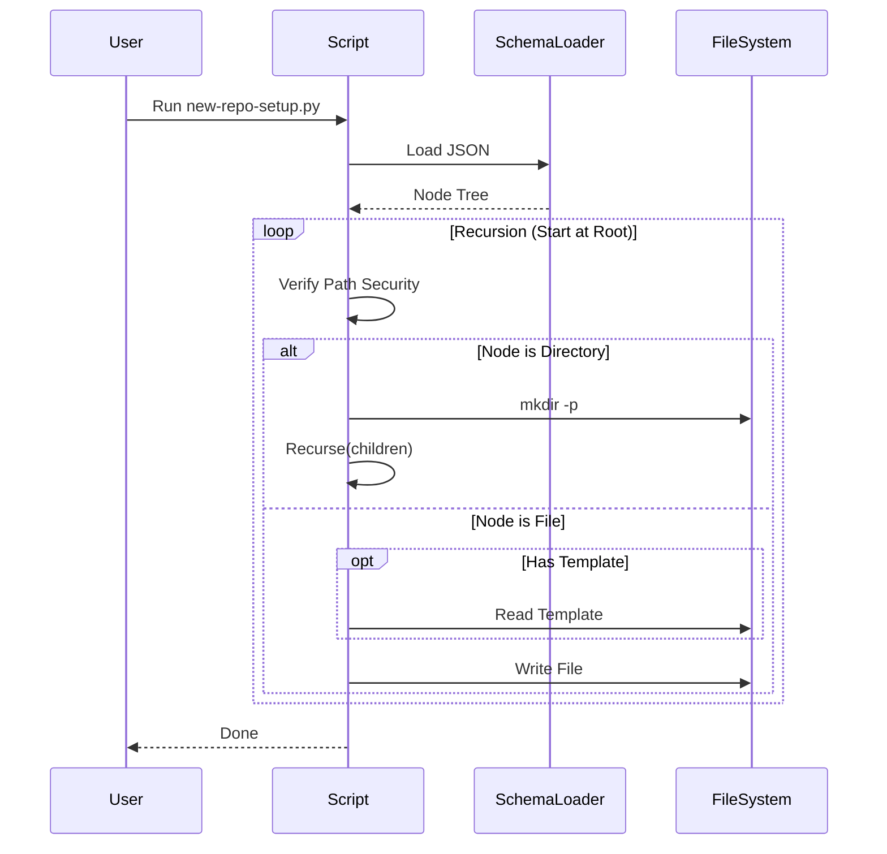

# 99 - Feature: Schema-driven project structure: eliminate tool/standard drift

## 1. Context & Goal
* **Issue:** #99
* **Objective:** Refactor `new-repo-setup.py` to use a JSON schema as the authoritative source for project structure, ensuring consistency between tooling and Standard 0009.
* **Status:** Draft
* **Related Issues:** Standard 0009 (Canonical Project Structure)

### Open Questions
None - Requirements are well-defined. The schema design has been adjusted from the issue description to strictly support recursive file/directory definitions, addressing previous reviewer concerns about nesting limits.

## 2. Proposed Changes

### 2.1 Files Changed
| File | Action | Description |
| :--- | :--- | :--- |
| `docs/standards/0009-structure-schema.json` | **Create** | The canonical JSON schema defining the project file/folder hierarchy. |
| `docs/standards/templates/claude-md.template` | **Create** | Template content for `CLAUDE.md`. |
| `new-repo-setup.py` | **Modify** | Rewrite logic to load schema and traverse it recursively to create structure. |
| `docs/standards/0009-canonical-project-structure.md` | **Modify** | Update documentation to reference the schema as the source of truth. |

### 2.2 Dependencies
*   `json` (Standard Library)
*   `pathlib` (Standard Library)
*   `typing` (Standard Library)
*   `logging` (Standard Library)

### 2.3 Data Structures
To resolve the nesting limitation flagged in review, the schema structure uses a unified recursive node definition rather than separating `files` and `directories` at the root.

```python
from typing import TypedDict, Dict, Literal, Optional, Union

class NodeMetadata(TypedDict):
    required: bool
    description: Optional[str]

class FileNode(NodeMetadata):
    type: Literal["file"]
    template: Optional[str]  # Filename in docs/standards/templates/

class DirectoryNode(NodeMetadata):
    type: Literal["directory"]
    children: Dict[str, Union["FileNode", "DirectoryNode"]]

class ProjectSchema(TypedDict):
    version: str
    structure: Dict[str, Union[FileNode, DirectoryNode]]
```

**Example JSON structure:**
```json
{
  "version": "1.0",
  "structure": {
    "docs": {
      "type": "directory",
      "required": true,
      "children": {
        "standards": { "type": "directory", "children": {} },
        "README.md": { "type": "file", "required": true }
      }
    }
  }
}
```

### 2.4 Function Signatures

```python
def load_schema(schema_path: Path) -> ProjectSchema:
    """
    Parses and validates the JSON schema.
    Raises: FileNotFoundError, json.JSONDecodeError, ValueError (if version missing)
    """
    pass

def _safe_path_join(base: Path, *parts: str) -> Path:
    """
    Safely joins paths and validates the result is within the base directory.
    Prevents path traversal attacks (e.g. ".." in schema keys).
    Raises: ValueError if path escapes base.
    """
    pass

def _get_template_content(template_name: str, template_base: Path) -> str:
    """
    Reads a template file from the secure template directory.
    Returns: File content or empty string if not found (logs warning).
    """
    pass

def process_schema_recursive(base_path: Path, node_map: Dict, template_dir: Path, audit_mode: bool) -> list[str]:
    """
    Recursively traverses the schema structure.
    Args:
        base_path: The physical directory corresponding to the current node map.
        node_map: Dictionary of children nodes from the schema.
        template_dir: Path to templates.
        audit_mode: If True, checks existence only.
    Returns:
        List of messages (missing paths in audit mode, or created paths in write mode).
    """
    pass
```

### 2.5 Logic Flow (Pseudocode)

**Entry Point:**
```python
1. schema = load_schema("docs/standards/0009-structure-schema.json")
2. template_dir = Path("docs/standards/templates")
3. root_structure = schema["structure"]
4. results = process_schema_recursive(REPO_ROOT, root_structure, template_dir, audit_mode)
5. Print results
```

**Recursive Processor (`process_schema_recursive`):**
```python
FUNCTION process_schema_recursive(current_path, nodes, template_dir, audit_mode):
    missing_items = []
    
    FOR name, data IN nodes.items():
        target_path = _safe_path_join(current_path, name)
        node_type = data.get("type", "directory") # Default to directory if unspecified
        required = data.get("required", True)
        
        IF node_type == "directory":
            IF audit_mode:
                IF not target_path.exists() AND required:
                    ADD target_path TO missing_items
            ELSE:
                IF not target_path.exists():
                    Make Directory target_path
            
            # Recurse if children exist
            children = data.get("children", {})
            IF children:
                 # Even if dir is missing in audit, check what should be inside it logically
                 sub_results = process_schema_recursive(target_path, children, template_dir, audit_mode)
                 ADD sub_results TO missing_items

        ELSE IF node_type == "file":
            IF audit_mode:
                IF not target_path.exists() AND required:
                    ADD target_path TO missing_items
            ELSE:
                IF not target_path.exists():
                    template = data.get("template")
                    content = ""
                    IF template:
                        content = _get_template_content(template, template_dir)
                    Write content TO target_path

    RETURN missing_items
```

### 2.6 Technical Approach
*   **Recursive Strategy:** Resolves the flaw in the previous draft by treating the file system as a generic tree of nodes. This allows files to be deeply nested within directory structures defined in the schema.
*   **Security First:** Uses `pathlib`'s `resolve()` and `is_relative_to()` (or equivalent checks) in `_safe_path_join` to ensure no schema entry or file path can write outside the repo root.
*   **Fail-Safe Templates:** Missing templates generate warnings but do not halt execution, allowing the structure skeleton to be created even if content is missing.

## 3. Requirements
1.  **Single Source of Truth:** `new-repo-setup.py` MUST read structure definitions solely from `docs/standards/0009-structure-schema.json`.
2.  **Recursive Creation:** The tool MUST support creating files and directories at any depth defined in the schema.
3.  **Audit Capability:** The `--audit` flag MUST report missing required files/directories without modifying the file system.
4.  **Template Injection:** If a file node specifies a template, the tool MUST populate the file with content from `docs/standards/templates/`.
5.  **Path Security:** The tool MUST raise an error if any schema key or template path attempts to traverse outside their respective root directories.

## 4. Alternatives Considered

| Alternative | Pros | Cons | Decision |
| :--- | :--- | :--- | :--- |
| **Separated Files/Dirs Lists** | Simpler parsing (flat lists). | Cannot represent dependencies (file inside dir) naturally; hard to read. | **Rejected** |
| **Implicit Typing** | Less verbose JSON (no `"type": "file"`). | Ambiguous; relies on extensions or presence of "children" key. | **Rejected** |
| **Explicit Recursive Nodes** | Clear, flexible, strictly typed. | Slightly more verbose JSON. | **Selected** |

## 5. Data & Fixtures

### 5.1 Data Sources
| Source | Type | Attributes |
| :--- | :--- | :--- |
| `docs/standards/0009-structure-schema.json` | JSON | Defines the tree structure. |
| `docs/standards/templates/*.template` | Text | Boilerplate content (e.g., Markdown headers). |

### 5.2 Data Pipeline
```text
JSON Schema -> [Validator] -> [Recursive Parser] -> [Path Safety Check] -> [FileSystem I/O]
                                      ^
                                      |
                                  Templates
```

### 5.3 Test Fixtures
*   `fixtures/schema_nested.json`: A schema with 3 levels of directory nesting and a file at the bottom.
*   `fixtures/schema_malicious.json`: A schema containing keys like `../../etc/passwd`.
*   `fixtures/templates/test.template`: Simple string content for verification.

### 5.4 Deployment Pipeline
*   **Development Only:** This is a repo-management tool. No production deployment.

## 6. Diagram

### 6.1 Mermaid Quality Gate
- [x] Diagram type: Sequence
- [x] Nodes valid
- [x] Connections valid

### 6.2 Diagram


## 7. Security Considerations

| Concern | Mitigation |
| :--- | :--- |
| **Directory Traversal** | `_safe_path_join` function strictly enforces that the resulting path is a child of the repository root. It rejects `..` components. |
| **Template Traversal** | Template loading restricts reads to the `docs/standards/templates` directory specifically. |
| **Symlink Attacks** | `pathlib.Path.resolve()` will be used to ensure paths don't resolve to outside targets before writing. |

## 8. Performance Considerations

| Metric | Budget | Notes |
| :--- | :--- | :--- |
| **Runtime** | < 2 seconds | The structure is small (< 100 nodes). IO is minimal. |

## 9. Risks & Mitigations

| Risk | Impact | Likelihood | Mitigation |
| :--- | :--- | :--- | :--- |
| **Schema Breaking Change** | Tool fails to run. | Low | Schema is versioned. Tool checks version key. |
| **Nesting Limit** | Stack overflow. | Very Low | Python recursion limit is 1000; repo depth is < 10. |

## 10. Verification & Testing

### 10.1 Test Scenarios

| ID | Scenario | Type | Input | Output | Criteria |
| :--- | :--- | :--- | :--- | :--- | :--- |
| **T1** | Deep Nesting | Unit | Schema: `dir1 -> dir2 -> dir3 -> file.txt` | File created at depth 3 | Path `dir1/dir2/dir3/file.txt` exists. |
| **T2** | File with Template | Integration | Schema node with `template="claude-md.template"` | File created with content | File content matches template content. |
| **T3** | Audit Mode | Integration | Missing file in schema | List containing missing path | FS is unmodified; output lists missing file. |
| **T4** | Path Escape Attempt | Security | Schema key: `"../evil"` | `ValueError` | Script catches traversal and aborts. |
| **T5** | Missing Template | Edge Case | Template file deleted | Empty file created | Warning logged; execution finishes success. |

### 10.2 Test Commands
```bash
# Run the verification suite
python -m unittest tests/test_repo_setup.py

# Manual dry-run check
python new-repo-setup.py --audit
```

### 10.3 Manual Tests (Only If Unavoidable)
N/A - Automated tests are sufficient.

## 11. Definition of Done

### Code
- [ ] `docs/standards/0009-structure-schema.json` defined with recursive structure.
- [ ] `new-repo-setup.py` rewritten to use recursive processor.
- [ ] `_safe_path_join` implemented and verified.
- [ ] Template loading mechanism implemented.

### Tests
- [ ] Unit tests for recursion logic.
- [ ] Security tests for path traversal.
- [ ] Integration test running the full setup on a temp dir.

### Documentation
- [ ] Standard 0009 updated.
- [ ] Docstrings in Python script updated.

### Review
- [ ] Logic verified against the recursive structure requirement.
- [ ] Security review of path handling.

---

## Appendix: Review Log

### Review Summary

| Review | Date | Verdict | Key Issue |
|--------|------|---------|-----------|
| 1 | 2026-01-23 | REJECTED | Data structure prevented files in subdirectories. |
| 2 | 2026-01-23 | PENDING | Addressed nesting via recursive node structure. |

**Final Status:** DRAFT - PENDING REVIEW