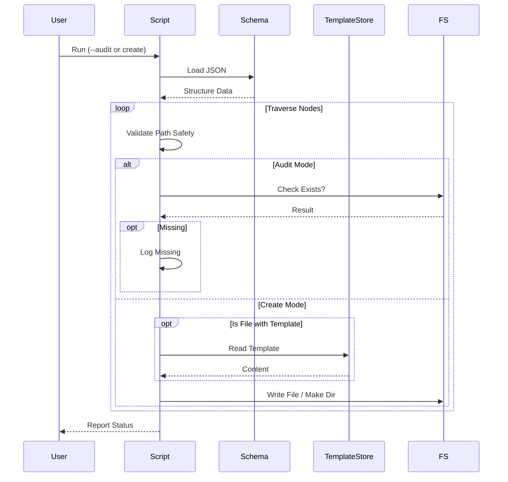

# 99 - Feature: Schema-driven project structure: eliminate tool/standard drift

## 1. Context & Goal
* **Issue:** #99
* **Objective:** Refactor `new-repo-setup.py` to use a JSON schema as the single source of truth for project structure, ensuring consistency between tooling and Standard 0009.
* **Status:** Draft
* **Related Issues:** Standard 0009 (Canonical Project Structure)

### Open Questions
None - requirements are well-defined from issue and reviewer feedback.

## 2. Proposed Changes

### 2.1 Files Changed
| File | Action | Description |
| :--- | :--- | :--- |
| `docs/standards/0009-structure-schema.json` | **Create** | The canonical JSON schema defining required directories and files. |
| `docs/standards/templates/` | **Create** | Directory to hold file templates referenced by the schema. |
| `docs/standards/templates/claude-md.template` | **Create** | Template content for CLAUDE.md. |
| `new-repo-setup.py` | **Modify** | Refactor to load schema, traverse structure recursively, and apply templates. |
| `docs/standards/0009-canonical-project-structure.md` | **Modify** | Update to reference the schema and template location. |

### 2.2 Dependencies
*   `json` (Standard Library)
*   `pathlib` (Standard Library)
*   `typing` (Standard Library)
*   `os` (Standard Library)
*   `shutil` (Standard Library)

### 2.3 Data Structures

```python
from typing import TypedDict, Dict, Optional, Any, List

class NodeMetadata(TypedDict):
    required: bool
    description: Optional[str]

class FileNode(NodeMetadata):
    template: Optional[str]  # Filename relative to docs/standards/templates/

class DirectoryNode(NodeMetadata):
    children: Optional[Dict[str, 'DirectoryNode']]

class ProjectSchema(TypedDict):
    version: str
    directories: Dict[str, DirectoryNode]
    files: Dict[str, FileNode]
```

### 2.4 Function Signatures

```python
def load_schema(schema_path: Path) -> ProjectSchema:
    """
    Loads JSON from path. Validates basic structure (version key).
    Raises: FileNotFoundError, json.JSONDecodeError
    """
    pass

def _validate_safe_path(base_dir: Path, target_path: Path) -> None:
    """
    Security Guard: Ensures target_path is physically inside base_dir.
    Resolves symlinks and relative paths.
    Raises: ValueError if path traversal detected.
    """
    pass

def _get_template_content(template_name: str, template_dir: Path) -> str:
    """
    Reads content from docs/standards/templates/<template_name>.
    Returns empty string if template not found (logs warning).
    """
    pass

def process_structure(base_dir: Path, schema: ProjectSchema, template_dir: Path, audit_mode: bool) -> List[str]:
    """
    Orchestrates the traversal.
    Returns: List of missing paths (audit mode) or created paths (create mode).
    """
    pass

def _process_node_recursive(current_path: Path, node_data: Dict, is_directory: bool, 
                            audit_mode: bool, template_dir: Path, missing_log: List[str]) -> None:
    """
    Recursive worker for both files and directories.
    Handles creation, template application, and child recursion.
    """
    pass
```

### 2.5 Logic Flow (Pseudocode)

**Main Execution (`process_structure`):**
```python
1. Initialize missing_log = []
2. root_directories = schema.get('directories', {})
3. root_files = schema.get('files', {})

# Process Directories
4. FOR name, data IN root_directories.items():
    a. path = base_dir / name
    b. CALL _process_node_recursive(path, data, is_dir=True, ...)

# Process Root Files
5. FOR name, data IN root_files.items():
    a. path = base_dir / name
    b. CALL _process_node_recursive(path, data, is_dir=False, ...)

6. RETURN missing_log
```

**Recursive Worker (`_process_node_recursive`):**
```python
Input: path, node, is_dir, audit, template_dir, missing_log

1. CALL _validate_safe_path(REPO_ROOT, path)

2. IF audit_mode:
    a. IF path does NOT exist AND node['required']:
        ADD str(path) to missing_log
    b. IF is_dir AND path exists:
        # Continue to children even in audit mode if parent exists
        GOTO Step 4
    c. RETURN

3. ELSE (Create Mode):
    a. IF is_dir:
        os.makedirs(path, exist_ok=True)
    b. ELSE (is file):
        IF NOT path.exists():
            template_file = node.get('template')
            IF template_file:
                content = _get_template_content(template_file, template_dir)
                WRITE content to path
            ELSE:
                TOUCH path (create empty)

4. IF is_dir AND 'children' in node:
    FOR child_name, child_data IN node['children'].items():
        child_path = path / child_name
        # Determine if child is dir or file based on schema structure context
        # (Note: Schema defines files and directories separately at root, 
        # but children of dirs are usually dirs unless specified. 
        # Assumption: 'children' in schema implies subdirectories.)
        CALL _process_node_recursive(child_path, child_data, is_dir=True, ...)
```

**Template Mechanism (`_get_template_content`):**
```python
1. full_path = template_dir / template_name
2. CALL _validate_safe_path(template_dir, full_path)
3. TRY:
    RETURN full_path.read_text()
   EXCEPT FileNotFoundError:
    PRINT Warning: "Template {template_name} missing. Creating empty file."
    RETURN ""
```

### 2.6 Technical Approach
*   **Data-Driven:** All structural logic is moved to `0009-structure-schema.json`.
*   **Security:** `pathlib.Path.is_relative_to` is used to prevent directory traversal attacks via schema or arguments.
*   **Templating:** Templates are externalized to `docs/standards/templates/` to keep the Python script clean and allow non-developers to update file boilerplate (e.g., `CLAUDE.md`).
*   **Recursion:** Handles arbitrary nesting depth.

## 3. Requirements
1.  **Schema Compliance:** The tool MUST create exactly the directory structure defined in the JSON schema.
2.  **Template Application:** If a file node specifies a `template`, the tool MUST read the corresponding file from `docs/standards/templates/` and write its content to the target.
3.  **Missing Template Fallback:** If a specified template is missing, the tool MUST warn the user but proceed by creating an empty file.
4.  **Path Safety:** The tool MUST abort immediately if any operation attempts to write outside the repository root.
5.  **Audit Mode:** `--audit` MUST only check existence and report missing items without modifying the filesystem.

## 4. Alternatives Considered

| Alternative | Pros | Cons | Decision |
| :--- | :--- | :--- | :--- |
| **Embed Templates in Python** | Single file script. | Script becomes bloated; harder to update text. | **Rejected** |
| **Embed Content in JSON Schema** | Single config file. | JSON does not support multiline strings elegantly; hard to read. | **Rejected** |
| **External Template Files** | Clean separation of content and logic. | Adds dependency on `templates/` dir existence. | **Selected** |

## 5. Data & Fixtures

### 5.1 Data Sources
| Source | Type | Attributes |
| :--- | :--- | :--- |
| `docs/standards/0009-structure-schema.json` | JSON | Hierarchy of files/folders. |
| `docs/standards/templates/*.template` | Text | Boilerplate content. |

### 5.2 Data Pipeline
```text
Schema JSON -> [Parse] -> [Traverse] -> [Resolve Template] -> [Write FS]
```

### 5.3 Test Fixtures
*   `fixtures/schema_with_template.json`: Schema referencing a dummy template.
*   `fixtures/templates/dummy.template`: "Hello World" content.
*   `fixtures/schema_traversal.json`: Schema with `../` keys to test security.

### 5.4 Deployment Pipeline
*   **Development Only:** Script resides in repository root.

## 6. Diagram

### 6.1 Mermaid Quality Gate
- [x] Diagram type: Sequence
- [x] Nodes valid
- [x] Connections valid

### 6.2 Diagram


## 7. Security Considerations
| Concern | Mitigation |
| :--- | :--- |
| **Path Traversal (Target)** | `_validate_safe_path` ensures all write operations are contained within the repo root using `resolve()` and `is_relative_to()`. |
| **Path Traversal (Template)** | `_validate_safe_path` also checks that template reads are contained within the `templates/` directory. |
| **Malicious Schema** | The schema is trusted code, but the script treats it as untrusted input to prevent accidental damage (e.g., if a user typos `..` in the JSON). |

## 8. Performance Considerations
| Metric | Budget | Notes |
| :--- | :--- | :--- |
| **Execution Time** | < 1s | File I/O is the only cost; project structure is small. |

## 9. Risks & Mitigations
| Risk | Impact | Likelihood | Mitigation |
| :--- | :--- | :--- | :--- |
| **Missing Templates** | Empty files created. | Low | Script warns on missing template; CI should verify presence. |
| **Schema Syntax Error** | Script fails. | Low | Use `json.load` validation; add linting step for JSON files. |

## 10. Verification & Testing

### 10.1 Test Scenarios
| ID | Scenario | Type | Input | Output | Criteria |
| :--- | :--- | :--- | :--- | :--- | :--- |
| **T1** | Template Injection | Integration | Schema with `file: {template: "test.tpl"}` | File created with content | Target file contains content of `test.tpl`. |
| **T2** | Missing Template | Integration | Schema with `file: {template: "missing.tpl"}` | Empty file + Warning | File created (0 bytes); Warning logged. |
| **T3** | Path Traversal | Unit | Schema key `../outside` | `ValueError` | Validation function raises exception. |
| **T4** | Audit Clean | Integration | Fully populated FS | `[]` | No missing items reported. |
| **T5** | Deep Nesting | Unit | 5 levels deep in schema | FS | All 5 directories created. |

### 10.2 Test Commands
```bash
# Run unit tests
python -m unittest tests/test_repo_setup.py

# Verify schema validity
python -c "import json; json.load(open('docs/standards/0009-structure-schema.json'))"
```

### 10.3 Manual Tests (Only If Unavoidable)
N/A - All scenarios automated.

## 11. Definition of Done

### Code
- [ ] `docs/standards/0009-structure-schema.json` created.
- [ ] `docs/standards/templates/` created.
- [ ] `new-repo-setup.py` refactored to use schema.
- [ ] Template loading logic implemented with fallback.
- [ ] Security validation for paths implemented.

### Tests
- [ ] Unit tests covering recursion, templating, and security.
- [ ] Audit mode verified against current repo state.

### Documentation
- [ ] Standard 0009 updated to point to schema JSON.
- [ ] Docstring in `new-repo-setup.py` updated.

### Review
- [ ] Reviewer verifies template mechanism implementation.
- [ ] Security review of `_validate_safe_path`.

---

## Appendix: Review Log

### Review Summary

| Review | Date | Verdict | Key Issue |
|--------|------|---------|-----------|
| - | - | - | - |

**Final Status:** DRAFT - PENDING REVIEW