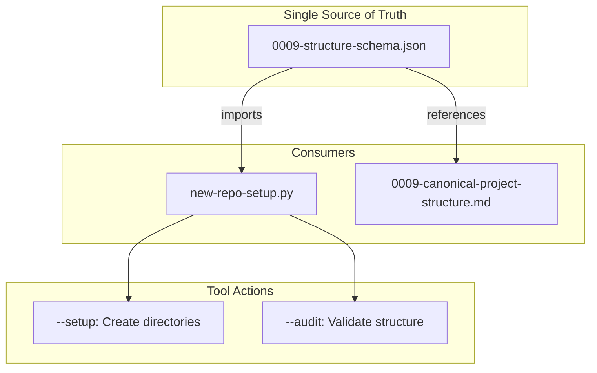

# 199 - Feature: Schema-driven project structure

<!-- Template Metadata
Last Updated: 2025-01-XX
Updated By: Initial creation
Update Reason: New LLD for schema-driven project structure
-->

## 1. Context & Goal
* **Issue:** #99
* **Objective:** Create a JSON schema as the single source of truth for project structure, eliminating drift between documentation (standard 0009) and tooling (new-repo-setup.py)
* **Status:** Draft
* **Related Issues:** N/A

### Open Questions
*Questions that need clarification before or during implementation. Remove when resolved.*

- [ ] Should the schema support project-type variants (e.g., Python vs Node.js projects)?
- [ ] Should we include file content templates in the schema or keep them separate?
- [ ] What validation strictness level for `--audit`? Warn vs error for optional directories?

## 2. Proposed Changes

*This section is the **source of truth** for implementation. Describe exactly what will be built.*

### 2.1 Files Changed

| File | Change Type | Description |
|------|-------------|-------------|
| `docs/standards/0009-structure-schema.json` | Add | New canonical schema defining project structure |
| `scripts/new-repo-setup.py` | Modify | Refactor to read structure from schema, remove hardcoded lists |
| `docs/standards/0009-canonical-project-structure.md` | Modify | Reference schema as authoritative source |
| `tests/test_new_repo_setup.py` | Add | Unit tests for schema loading and validation |

### 2.2 Dependencies

*No new packages required. Uses Python stdlib `json` module.*

```toml
# pyproject.toml additions (if any)
# None required - json is stdlib
```

### 2.3 Data Structures

```python
# Pseudocode - NOT implementation
class DirectorySpec(TypedDict):
    required: bool  # Whether directory must exist
    description: NotRequired[str]  # Human-readable description
    children: NotRequired[dict[str, "DirectorySpec"]]  # Nested directories

class FileSpec(TypedDict):
    required: bool  # Whether file must exist
    template: NotRequired[str]  # Template filename for generation
    description: NotRequired[str]  # Human-readable description

class ProjectStructureSchema(TypedDict):
    version: str  # Schema version (semver)
    directories: dict[str, DirectorySpec]  # Top-level directories
    files: dict[str, FileSpec]  # Top-level files
```

### 2.4 Function Signatures

```python
# Signatures only - implementation in source files
def load_structure_schema(schema_path: Path | None = None) -> ProjectStructureSchema:
    """Load project structure schema from JSON file.
    
    Args:
        schema_path: Path to schema file. Defaults to standard location.
    
    Returns:
        Parsed schema dictionary.
    
    Raises:
        FileNotFoundError: If schema file doesn't exist.
        json.JSONDecodeError: If schema is invalid JSON.
    """
    ...

def flatten_directories(schema: ProjectStructureSchema) -> list[str]:
    """Convert nested directory structure to flat list of paths.
    
    Args:
        schema: Parsed project structure schema.
    
    Returns:
        List of directory paths (e.g., ["docs", "docs/adrs", "docs/lineage/active"]).
    """
    ...

def flatten_files(schema: ProjectStructureSchema) -> list[tuple[str, FileSpec]]:
    """Extract file specifications from schema.
    
    Args:
        schema: Parsed project structure schema.
    
    Returns:
        List of (filepath, spec) tuples.
    """
    ...

def audit_structure(root_path: Path, schema: ProjectStructureSchema) -> AuditResult:
    """Validate existing project against schema.
    
    Args:
        root_path: Project root directory.
        schema: Project structure schema.
    
    Returns:
        AuditResult with missing required items and optional items status.
    """
    ...
```

### 2.5 Logic Flow (Pseudocode)

```
# Schema Loading
1. Determine schema path (parameter or default location)
2. Read JSON file
3. Parse and validate basic structure
4. Return typed dictionary

# Directory Flattening (recursive)
1. For each top-level directory in schema:
   a. Add directory path to result
   b. IF has children THEN
      - Recursively process children with parent path prefix
2. Return flat list of all paths

# Setup Flow (modified)
1. Load schema from canonical location
2. Flatten directories from schema
3. Flatten files from schema
4. Create directories (existing logic, now using schema-derived list)
5. Create files (existing logic, now using schema-derived list)

# Audit Flow
1. Load schema
2. For each required directory:
   - Check existence
   - Record missing as error
3. For each optional directory:
   - Check existence
   - Record missing as warning
4. For each required file:
   - Check existence
   - Record missing as error
5. Return structured audit result
```

### 2.6 Technical Approach

* **Module:** `scripts/new-repo-setup.py` (existing)
* **Pattern:** Configuration-driven behavior with schema as external config
* **Key Decisions:** 
  - JSON chosen over YAML for stdlib support (no new dependencies)
  - Nested structure in schema mirrors filesystem hierarchy for readability
  - Schema co-located with standard it defines (`docs/standards/`)

### 2.7 Architecture Decisions

*Document key architectural decisions that affect the design.*

| Decision | Options Considered | Choice | Rationale |
|----------|-------------------|--------|-----------|
| Schema format | JSON, YAML, TOML | JSON | Stdlib support, no new dependencies, universal tooling |
| Schema location | `scripts/`, `docs/standards/`, `schemas/` | `docs/standards/` | Co-located with standard 0009, single source of truth |
| Nesting approach | Flat list with paths, Nested hierarchy | Nested hierarchy | More readable, mirrors filesystem, easier to maintain |
| Required vs optional | Boolean flag, Separate sections | Boolean flag per item | Simpler schema, items stay grouped logically |

**Architectural Constraints:**
- Must not introduce new external dependencies (stdlib only)
- Must maintain backward compatibility with existing `new-repo-setup.py` CLI
- Schema must be human-readable and editable

## 3. Requirements

*What must be true when this is done. These become acceptance criteria.*

1. A JSON schema file exists at `docs/standards/0009-structure-schema.json`
2. `new-repo-setup.py` reads directory structure from schema (no hardcoded `DOCS_STRUCTURE` list)
3. `new-repo-setup.py --audit` validates against schema, reporting required vs optional
4. Standard 0009 markdown references schema as the authoritative source
5. Schema includes `docs/lineage/` structure with `active/` and `done/` subdirectories
6. All existing functionality of `new-repo-setup.py` continues to work

## 4. Alternatives Considered

| Option | Pros | Cons | Decision |
|--------|------|------|----------|
| JSON schema in `docs/standards/` | Stdlib, co-located with standard | Less expressive than YAML | **Selected** |
| YAML schema | More readable, comments supported | Requires PyYAML dependency | Rejected |
| Inline schema in Python | Single file, type hints | Defeats purpose of single source | Rejected |
| Generate markdown from schema | Fully automated docs | Overengineered for current need, out of scope | Rejected (future) |

**Rationale:** JSON with stdlib provides the single source of truth benefit without adding dependencies. YAML's readability advantage doesn't justify the dependency cost for a relatively simple schema.

## 5. Data & Fixtures

*Per [0108-lld-pre-implementation-review.md](0108-lld-pre-implementation-review.md) - complete this section BEFORE implementation.*

### 5.1 Data Sources

| Attribute | Value |
|-----------|-------|
| Source | Local file: `docs/standards/0009-structure-schema.json` |
| Format | JSON |
| Size | ~2KB estimated |
| Refresh | Manual (edited by developers) |
| Copyright/License | Project license (internal) |

### 5.2 Data Pipeline

```
Schema JSON ──load_structure_schema()──► Python Dict ──flatten_*()──► Path Lists
```

### 5.3 Test Fixtures

| Fixture | Source | Notes |
|---------|--------|-------|
| Valid schema | Generated | Minimal valid schema for unit tests |
| Invalid schema | Generated | Missing required fields, malformed JSON |
| Test directory tree | Generated | Temp directory with known structure |

### 5.4 Deployment Pipeline

Schema file is committed to repository. No special deployment needed - tool reads from repo location.

**If data source is external:** N/A - schema is internal to repository.

## 6. Diagram

### 6.1 Mermaid Quality Gate

Before finalizing any diagram, verify in [Mermaid Live Editor](https://mermaid.live) or GitHub preview:

- [x] **Simplicity:** Similar components collapsed (per 0006 §8.1)
- [x] **No touching:** All elements have visual separation (per 0006 §8.2)
- [x] **No hidden lines:** All arrows fully visible (per 0006 §8.3)
- [x] **Readable:** Labels not truncated, flow direction clear
- [ ] **Auto-inspected:** Agent rendered via mermaid.ink and viewed (per 0006 §8.5)

**Agent Auto-Inspection (MANDATORY):**

**Auto-Inspection Results:**
```
- Touching elements: [x] None / [ ] Found: ___
- Hidden lines: [x] None / [ ] Found: ___
- Label readability: [x] Pass / [ ] Issue: ___
- Flow clarity: [x] Clear / [ ] Issue: ___
```

*Reference: [0006-mermaid-diagrams.md](0006-mermaid-diagrams.md)*

### 6.2 Diagram



## 7. Security & Safety Considerations

### 7.1 Security

| Concern | Mitigation | Status |
|---------|------------|--------|
| Path traversal in schema | Validate paths don't contain `..` or absolute paths | Addressed |
| Arbitrary file creation | Schema only defines structure, not file contents | Addressed |

### 7.2 Safety

| Concern | Mitigation | Status |
|---------|------------|--------|
| Schema file missing | Clear error message with path, graceful failure | Addressed |
| Malformed JSON | Catch JSONDecodeError, report line/column | Addressed |
| Breaking existing setups | Backward compatible CLI interface | Addressed |

**Fail Mode:** Fail Closed - If schema cannot be loaded, tool exits with error rather than using fallback hardcoded values (which would defeat the purpose).

**Recovery Strategy:** If schema is corrupted, restore from git history. Schema is version controlled.

## 8. Performance & Cost Considerations

### 8.1 Performance

| Metric | Budget | Approach |
|--------|--------|----------|
| Schema load time | < 10ms | Single small file read, stdlib JSON |
| Memory | < 1MB | Schema is ~2KB, in-memory dict |
| Startup overhead | Negligible | One file read added to existing tool |

**Bottlenecks:** None expected. Schema is tiny and parsed once at startup.

### 8.2 Cost Analysis

| Resource | Unit Cost | Estimated Usage | Monthly Cost |
|----------|-----------|-----------------|--------------|
| N/A | N/A | N/A | $0 |

**Cost Controls:**
- N/A - No cloud resources or paid APIs involved

**Worst-Case Scenario:** N/A - Local file operations only.

## 9. Legal & Compliance

| Concern | Applies? | Mitigation |
|---------|----------|------------|
| PII/Personal Data | No | Schema contains only directory/file names |
| Third-Party Licenses | No | All code is original, stdlib only |
| Terms of Service | N/A | No external services |
| Data Retention | N/A | No user data |
| Export Controls | No | No restricted algorithms |

**Data Classification:** Internal

**Compliance Checklist:**
- [x] No PII stored without consent
- [x] All third-party licenses compatible with project license
- [x] External API usage compliant with provider ToS
- [x] Data retention policy documented

## 10. Verification & Testing

*Ref: [0005-testing-strategy-and-protocols.md](0005-testing-strategy-and-protocols.md)*

**Testing Philosophy:** Strive for 100% automated test coverage. All tests for this feature can be automated.

### 10.1 Test Scenarios

| ID | Scenario | Type | Input | Expected Output | Pass Criteria |
|----|----------|------|-------|-----------------|---------------|
| 010 | Load valid schema | Auto | Valid JSON schema file | Parsed ProjectStructureSchema dict | No exceptions, correct structure |
| 020 | Load missing schema | Auto | Non-existent path | FileNotFoundError | Exception raised with path in message |
| 030 | Load malformed JSON | Auto | Invalid JSON syntax | JSONDecodeError | Exception raised with location info |
| 040 | Flatten nested directories | Auto | Schema with 3-level nesting | Flat list of all paths | All paths present, correct order |
| 050 | Flatten empty schema | Auto | Schema with no directories | Empty list | Returns [] without error |
| 060 | Setup creates schema dirs | Auto | Schema + empty temp dir | Directories created | All schema directories exist |
| 070 | Audit finds missing required | Auto | Schema + incomplete tree | AuditResult with errors | Missing required items listed |
| 080 | Audit allows missing optional | Auto | Schema + tree without optional | AuditResult with warnings only | No errors, warnings present |
| 090 | Audit passes complete tree | Auto | Schema + complete tree | Clean AuditResult | No errors, no warnings |
| 100 | Schema includes lineage dirs | Auto | Production schema | lineage/active, lineage/done in flatten | Paths present in output |
| 110 | CLI backward compatibility | Auto | `--setup` flag | Same behavior as before | Exit 0, dirs created |

*Note: Use 3-digit IDs with gaps of 10 (010, 020, 030...) to allow insertions.*

### 10.2 Test Commands

```bash
# Run all automated tests
poetry run pytest tests/test_new_repo_setup.py -v

# Run only fast/mocked tests (exclude live)
poetry run pytest tests/test_new_repo_setup.py -v -m "not live"

# Run schema-specific tests
poetry run pytest tests/test_new_repo_setup.py -v -k "schema"
```

### 10.3 Manual Tests (Only If Unavoidable)

N/A - All scenarios automated.

## 11. Risks & Mitigations

| Risk | Impact | Likelihood | Mitigation |
|------|--------|------------|------------|
| Schema format changes break existing scripts | Med | Low | Semver in schema, version check in loader |
| Developers edit tool instead of schema | Med | Med | Code comments pointing to schema, PR review |
| Schema location changes | Low | Low | Single constant for path, documented in standard |
| Complex nested schemas hard to read | Low | Low | Keep nesting to 3 levels max, good formatting |

## 12. Definition of Done

### Code
- [ ] Implementation complete and linted
- [ ] Code comments reference this LLD
- [ ] Hardcoded `DOCS_STRUCTURE` and `FILES_STRUCTURE` removed from `new-repo-setup.py`
- [ ] `load_structure_schema()` function implemented
- [ ] `flatten_directories()` and `flatten_files()` functions implemented
- [ ] `--audit` mode uses schema for validation

### Tests
- [ ] All test scenarios pass
- [ ] Test coverage meets threshold (>80%)
- [ ] Schema validation tests pass

### Documentation
- [ ] LLD updated with any deviations
- [ ] Implementation Report (0103) completed
- [ ] Standard 0009 updated to reference schema
- [ ] Schema file includes inline documentation via descriptions

### Review
- [ ] Code review completed
- [ ] User approval before closing issue

---

## Appendix: Review Log

*Track all review feedback with timestamps and implementation status.*

### Review Summary

| Review | Date | Verdict | Key Issue |
|--------|------|---------|-----------|
| - | - | - | Awaiting initial review |

**Final Status:** PENDING
<!-- Note: This field is auto-updated to APPROVED by the workflow when finalized -->