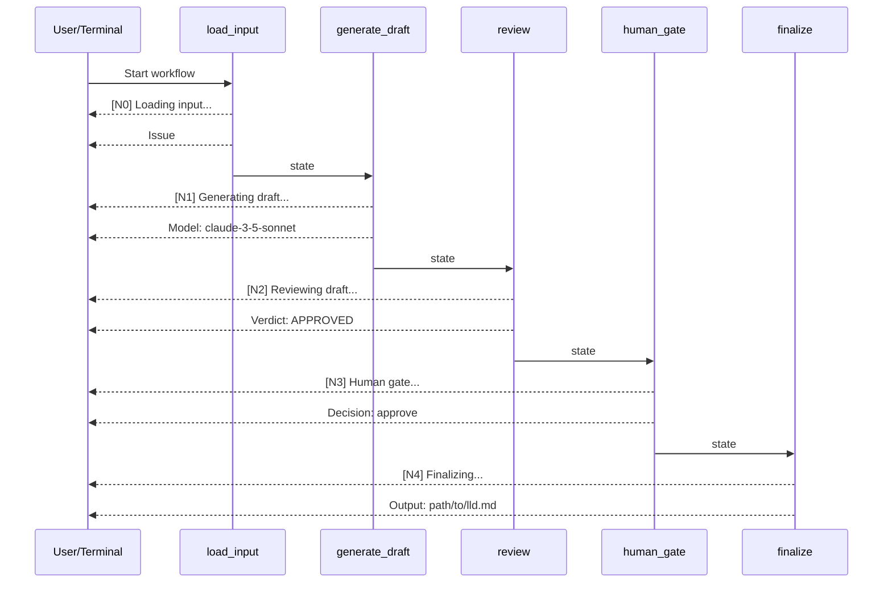

# LLD Finalized

Path: C:\Users\mcwiz\Projects\AgentOS\docs\lld\active\LLD-128.md
Status: APPROVED
Reviews: 1

---

# 128 - Fix: Add Progress Output to Requirements Workflow

<!-- Template Metadata
Last Updated: 2025-01-09
Updated By: Issue #128 LLD creation
Update Reason: Initial draft for adding progress output to requirements workflow
-->

## 1. Context & Goal
* **Issue:** #128
* **Objective:** Add progress output to the requirements workflow nodes so users can see workflow progress similar to the testing workflow
* **Status:** Draft
* **Related Issues:** None

### Open Questions
*Questions that need clarification before or during implementation. Remove when resolved.*

- [x] Should output go to stdout or stderr? → stdout, matching testing workflow
- [x] Should we use a logging framework or simple print statements? → Simple print statements for consistency with testing workflow

## 2. Proposed Changes

*This section is the **source of truth** for implementation. Describe exactly what will be built.*

### 2.1 Files Changed

| File | Change Type | Description |
|------|-------------|-------------|
| `agentos/workflows/requirements/nodes/load_input.py` | Modify | Add `[N0]` progress output with input source details |
| `agentos/workflows/requirements/nodes/generate_draft.py` | Modify | Add `[N1]` progress output with drafter model info |
| `agentos/workflows/requirements/nodes/review.py` | Modify | Add `[N2]` progress output with verdict |
| `agentos/workflows/requirements/nodes/human_gate.py` | Modify | Add `[N3]` progress output with decision |
| `agentos/workflows/requirements/nodes/finalize.py` | Modify | Add `[N4]` progress output with output path |

### 2.2 Dependencies

*No new packages required.*

```toml
# pyproject.toml additions (if any)
# None - using built-in print()
```

### 2.3 Data Structures

```python
# No new data structures required
# Using existing node state/context objects
```

### 2.4 Function Signatures

```python
# No new functions required
# Adding print statements to existing node functions
```

### 2.5 Logic Flow (Pseudocode)

```
For each node function:
1. Print node identifier and action at start
   - Format: "[N#] Action..."
2. Execute existing node logic
3. Print key result info (if applicable)
   - Review: verdict
   - Human gate: decision
   - Finalize: output path
4. Return existing result
```

### 2.6 Technical Approach

* **Module:** `agentos/workflows/requirements/nodes/`
* **Pattern:** Simple progress logging via print statements
* **Key Decisions:** Using print statements (not logging framework) to match testing workflow style

### 2.7 Architecture Decisions

| Decision | Options Considered | Choice | Rationale |
|----------|-------------------|--------|-----------|
| Output mechanism | print(), logging module, rich console | print() | Matches existing testing workflow pattern |
| Output format | Free-form, structured JSON, `[N#]` prefix | `[N#]` prefix | Consistent with testing workflow style |
| Output destination | stdout, stderr | stdout | Normal progress info, not errors |

**Architectural Constraints:**
- Must match testing workflow output style exactly (`[N#] Action...`)
- Must not change existing function return values or behavior
- Output must be synchronous (print before/after operations)

## 3. Requirements

*What must be true when this is done. These become acceptance criteria.*

1. Each node prints `[N#]` prefix with action description when starting
2. `load_input.py` prints issue number or brief details when loading
3. `generate_draft.py` prints the drafter model being used
4. `review.py` prints the verdict (APPROVED/BLOCKED)
5. `human_gate.py` prints the decision (approve/reject/feedback)
6. `finalize.py` prints the output file path
7. Output format matches testing workflow style

## 4. Alternatives Considered

| Option | Pros | Cons | Decision |
|--------|------|------|----------|
| print() statements | Simple, matches testing workflow, no dependencies | No log levels, not configurable | **Selected** |
| Python logging module | Configurable levels, standard practice | Different style than testing workflow, more complex | Rejected |
| Rich console library | Pretty output, progress bars | External dependency, overkill for simple progress | Rejected |

**Rationale:** Simple print statements match the existing testing workflow pattern and require no additional dependencies. Consistency with existing workflows is prioritized.

## 5. Data & Fixtures

### 5.1 Data Sources

| Attribute | Value |
|-----------|-------|
| Source | Existing node state/context objects |
| Format | Python objects already in memory |
| Size | N/A - using existing data |
| Refresh | N/A |
| Copyright/License | N/A |

### 5.2 Data Pipeline

```
Node State ──access attribute──► print() ──stdout──► Terminal
```

### 5.3 Test Fixtures

| Fixture | Source | Notes |
|---------|--------|-------|
| Mock node state | Generated in tests | Minimal state objects for testing output |
| Captured stdout | pytest capsys fixture | Verify print output |

### 5.4 Deployment Pipeline

No data deployment required - code-only changes.

## 6. Diagram

### 6.1 Mermaid Quality Gate

- [x] **Simplicity:** Nodes shown as sequential flow
- [x] **No touching:** All elements have visual separation
- [x] **No hidden lines:** All arrows fully visible
- [x] **Readable:** Labels clear and descriptive
- [ ] **Auto-inspected:** N/A - simple sequence diagram

**Auto-Inspection Results:**
```
- Touching elements: [x] None
- Hidden lines: [x] None
- Label readability: [x] Pass
- Flow clarity: [x] Clear
```

### 6.2 Diagram



## 7. Security & Safety Considerations

### 7.1 Security

| Concern | Mitigation | Status |
|---------|------------|--------|
| Sensitive data in output | Only print non-sensitive metadata (issue numbers, paths, verdicts) | Addressed |
| Log injection | Print static strings with formatted values, no user-controlled format strings | Addressed |

### 7.2 Safety

| Concern | Mitigation | Status |
|---------|------------|--------|
| Output interfering with workflow | Print statements are non-blocking, don't affect return values | Addressed |
| Missing output on error | Existing error handling unchanged, progress shows where workflow stopped | Addressed |

**Fail Mode:** Fail Open - print failures should not stop workflow execution

**Recovery Strategy:** If print fails (extremely unlikely), workflow continues normally. Progress output is informational only.

## 8. Performance & Cost Considerations

### 8.1 Performance

| Metric | Budget | Approach |
|--------|--------|----------|
| Latency | < 1ms per print | print() is essentially instant |
| Memory | Negligible | String formatting only |
| I/O | 5 additional stdout writes | Minimal impact |

**Bottlenecks:** None - print statements have negligible performance impact

### 8.2 Cost Analysis

| Resource | Unit Cost | Estimated Usage | Monthly Cost |
|----------|-----------|-----------------|--------------|
| Compute | N/A | Negligible | $0 |

**Cost Controls:** N/A - no additional costs

**Worst-Case Scenario:** N/A - print statements scale trivially

## 9. Legal & Compliance

| Concern | Applies? | Mitigation |
|---------|----------|------------|
| PII/Personal Data | No | Only workflow metadata printed |
| Third-Party Licenses | No | No new dependencies |
| Terms of Service | No | Internal tooling |
| Data Retention | No | Stdout only, not persisted |
| Export Controls | No | N/A |

**Data Classification:** Internal

**Compliance Checklist:**
- [x] No PII stored without consent
- [x] All third-party licenses compatible with project license
- [x] External API usage compliant with provider ToS
- [x] Data retention policy documented

## 10. Verification & Testing

### 10.1 Test Scenarios

| ID | Scenario | Type | Input | Expected Output | Pass Criteria |
|----|----------|------|-------|-----------------|---------------|
| 010 | load_input prints N0 prefix | Auto | Mock state with issue #123 | `[N0] Loading input...\n    Issue: #123` | Output contains `[N0]` and issue number |
| 020 | generate_draft prints N1 prefix | Auto | Mock state with model name | `[N1] Generating draft...\n    Model: claude-3-5-sonnet` | Output contains `[N1]` and model |
| 030 | review prints N2 with APPROVED | Auto | Mock state, approved verdict | `[N2] Reviewing draft...\n    Verdict: APPROVED` | Output contains `[N2]` and `APPROVED` |
| 040 | review prints N2 with BLOCKED | Auto | Mock state, blocked verdict | `[N2] Reviewing draft...\n    Verdict: BLOCKED` | Output contains `[N2]` and `BLOCKED` |
| 050 | human_gate prints N3 with approve | Auto | Mock state, approve decision | `[N3] Human gate...\n    Decision: approve` | Output contains `[N3]` and decision |
| 060 | human_gate prints N3 with reject | Auto | Mock state, reject decision | `[N3] Human gate...\n    Decision: reject` | Output contains decision |
| 070 | human_gate prints N3 with feedback | Auto | Mock state, feedback decision | `[N3] Human gate...\n    Decision: feedback` | Output contains decision |
| 080 | finalize prints N4 with path | Auto | Mock state with output path | `[N4] Finalizing...\n    Output: /path/to/lld.md` | Output contains `[N4]` and path |
| 090 | Full workflow shows all progress | Auto | Complete workflow run | All N0-N4 outputs in order | Sequential output present |

### 10.2 Test Commands

```bash
# Run all automated tests for requirements workflow nodes
poetry run pytest tests/workflows/requirements/test_nodes.py -v

# Run specific progress output tests
poetry run pytest tests/workflows/requirements/test_nodes.py -v -k "progress"

# Run integration test for full workflow progress
poetry run pytest tests/workflows/requirements/test_workflow_progress.py -v
```

### 10.3 Manual Tests (Only If Unavoidable)

N/A - All scenarios automated.

## 11. Risks & Mitigations

| Risk | Impact | Likelihood | Mitigation |
|------|--------|------------|------------|
| Output format doesn't match testing workflow | Low | Low | Review testing workflow output, copy style exactly |
| Node state doesn't have expected fields | Med | Low | Add defensive checks, print "N/A" if field missing |
| Print statements fail silently | Low | Very Low | Progress is informational; workflow continues regardless |

## 12. Definition of Done

### Code
- [ ] Implementation complete and linted
- [ ] Code comments reference this LLD

### Tests
- [ ] All test scenarios pass
- [ ] Test coverage meets threshold

### Documentation
- [ ] LLD updated with any deviations
- [ ] Implementation Report (0103) completed
- [ ] Test Report (0113) completed if applicable

### Review
- [ ] Code review completed
- [ ] User approval before closing issue

---

## Appendix: Review Log

*Track all review feedback with timestamps and implementation status.*

### Review Summary

| Review | Date | Verdict | Key Issue |
|--------|------|---------|-----------|
| - | - | - | Awaiting initial review |

**Final Status:** APPROVED
<!-- Note: This field is auto-updated to APPROVED by the workflow when finalized -->