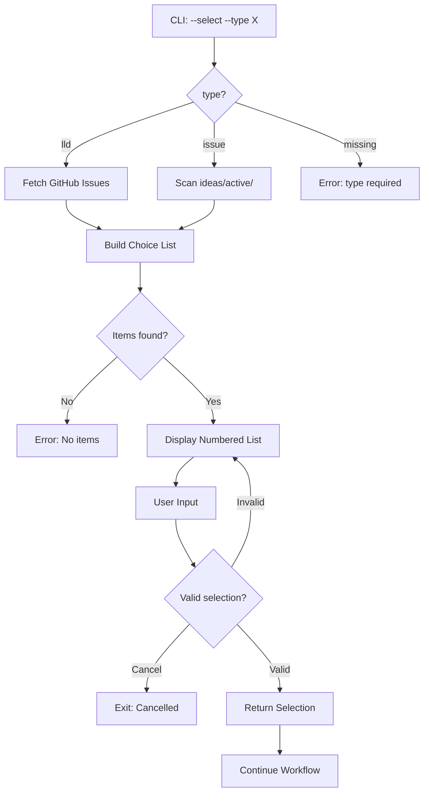

# LLD Finalized

Path: C:\Users\mcwiz\Projects\AgentOS\docs\lld\active\LLD-142.md
Status: APPROVED
Reviews: 2

---

# 1142 - Feature: Implement --select flag for unified requirements workflow

<!-- Template Metadata
Last Updated: 2025-01-10
Updated By: Issue #142 LLD creation
Update Reason: Revised based on Gemini Review #1 feedback
-->

## 1. Context & Goal
* **Issue:** #142
* **Objective:** Implement the `--select` flag in `run_requirements_workflow.py` to provide interactive file/issue selection based on workflow type
* **Status:** Draft
* **Related Issues:** None identified

## 2. Proposed Changes

*This section is the **source of truth** for implementation. Describe exactly what will be built.*

### 2.1 Files Changed

| File | Change Type | Description |
|------|-------------|-------------|
| `tools/run_requirements_workflow.py` | Modify | Add interactive selection logic for `--select` flag |
| `tools/lib/github_utils.py` | Add | New module for GitHub API interactions (list issues) |
| `tools/lib/interactive_picker.py` | Add | Reusable interactive selection UI component |
| `tests/test_run_requirements_workflow_select.py` | Add | Unit tests for selection functionality |

### 2.2 Dependencies

*New packages, APIs, or services required.*

```toml
# pyproject.toml additions (if any)
# None - using existing packages (questionary already in project or using simple input)
```

Note: Will use Python's built-in `input()` for minimal dependency, with optional enhancement using `questionary` if already installed.

### 2.3 Data Structures

```python
# Pseudocode - NOT implementation
class SelectionChoice(TypedDict):
    display: str       # What user sees in picker
    value: str         # Actual value (file path or issue number)
    metadata: dict     # Additional context (issue title, file size, etc.)

class SelectionResult(TypedDict):
    selected: bool     # True if user made a selection
    value: str | None  # Selected value or None if cancelled
    type: str          # 'issue' or 'brief'
```

### 2.4 Function Signatures

```python
# Signatures only - implementation in source files

# tools/lib/interactive_picker.py
def interactive_select(
    choices: list[SelectionChoice],
    prompt: str = "Select an option",
    allow_cancel: bool = True
) -> SelectionResult:
    """Display interactive picker and return user selection."""
    ...

# tools/lib/github_utils.py
def list_open_issues(
    repo: str = ".",
    labels: list[str] | None = None,
    limit: int = 50
) -> list[dict]:
    """Fetch open issues from GitHub repository."""
    ...

# tools/run_requirements_workflow.py (additions)
def get_active_briefs(directory: str = "ideas/active") -> list[SelectionChoice]:
    """Scan directory for brief files and return as choices."""
    ...

def get_open_issues_as_choices(labels: list[str] | None = None) -> list[SelectionChoice]:
    """Fetch GitHub issues and format as selection choices."""
    ...

def handle_select_flag(workflow_type: str) -> tuple[str | None, int | None]:
    """Process --select flag and return (brief_path, issue_number)."""
    ...
```

### 2.5 Logic Flow (Pseudocode)

```
1. Parse command line arguments
2. IF --select flag is set THEN
   a. IF --type is 'issue' THEN
      - Resolve ideas/active/ path relative to repo root
      - Scan ideas/active/ for .md files
      - Build choice list with file names and first-line previews
      - Display interactive picker
      - IF selection made THEN
        - Set brief_path = selected file
      - ELSE
        - Exit with message "Selection cancelled"
   b. ELSE IF --type is 'lld' THEN
      - Fetch open issues from GitHub API (no label filtering applied)
      - Build choice list with issue numbers and titles
      - Display interactive picker
      - IF selection made THEN
        - Set issue_number = selected issue
      - ELSE
        - Exit with message "Selection cancelled"
   c. ELSE (--type not specified)
      - Error: "--select requires --type to be specified"
3. Continue with existing validation logic
4. Run workflow with selected input
```

**Note:** Label filtering (e.g., `lld-ready`) is NOT applied. All open issues are displayed to give users full visibility. This decision can be revisited based on user feedback.

### 2.6 Technical Approach

* **Module:** `tools/lib/` for reusable components
* **Pattern:** Strategy pattern for different selection sources (files vs GitHub issues)
* **Path Resolution:** Use `repo_root = Path(__file__).parent.parent` to ensure `ideas/active` path works regardless of current working directory
* **Key Decisions:** 
  - Use `gh` CLI for GitHub API (already assumed available per project conventions)
  - Simple numbered list for selection (works in all terminals, no curses dependencies)
  - Preview first line of brief files to help user identify correct file

### 2.7 Architecture Decisions

*Document key architectural decisions that affect the design.*

| Decision | Options Considered | Choice | Rationale |
|----------|-------------------|--------|-----------|
| Selection UI | curses/blessed, questionary, simple numbered list | Simple numbered list | Zero dependencies, works in all environments |
| GitHub API access | PyGitHub, requests, gh CLI | gh CLI | Already installed, handles auth automatically |
| Brief scanning | glob patterns, os.walk, pathlib | pathlib | Clean API, type hints, built-in |
| Label filtering | Filter by `lld-ready`, show all issues | Show all issues | Maximum flexibility; users can visually scan |

**Architectural Constraints:**
- Must work in non-TTY environments (fallback to error with helpful message)
- Cannot introduce new external Python dependencies
- Must integrate seamlessly with existing argument parsing

## 3. Requirements

*What must be true when this is done. These become acceptance criteria.*

1. `--select` with `--type lld` displays numbered list of open GitHub issues (all open issues, no label filtering)
2. `--select` with `--type issue` displays numbered list of files in `ideas/active/`
3. User can select by typing number and pressing Enter
4. User can cancel with Ctrl+C or typing 'q' (exits cleanly with message)
5. Selected value is passed to existing workflow logic
6. Error message if `--select` used without `--type`
7. Error message if no items available for selection
8. Works correctly with other flags (`--gates`, `--pause`, etc.)

## 4. Alternatives Considered

| Option | Pros | Cons | Decision |
|--------|------|------|----------|
| Simple numbered list (stdin) | Zero deps, universal terminal support | Less polished UX | **Selected** |
| questionary library | Rich UI, arrow key navigation | New dependency, may fail in some terminals | Rejected |
| fzf integration | Powerful fuzzy finding | External tool dependency | Rejected |
| Auto-detect type from context | Fewer flags needed | Ambiguous, harder to predict | Rejected |

**Rationale:** The simple numbered list approach requires no new dependencies, works in all terminal environments including basic CI shells, and is sufficient for lists of 10-50 items typical in this use case.

## 5. Data & Fixtures

*Per [0108-lld-pre-implementation-review.md](0108-lld-pre-implementation-review.md) - complete this section BEFORE implementation.*

### 5.1 Data Sources

| Attribute | Value |
|-----------|-------|
| Source | GitHub API (issues), Local filesystem (briefs) |
| Format | JSON (GitHub), Markdown files (briefs) |
| Size | ~50 issues max, ~20 brief files typical |
| Refresh | Real-time (fetched on each `--select` invocation) |
| Copyright/License | N/A (user's own data) |

### 5.2 Data Pipeline

```
GitHub API ──gh cli──► JSON ──parse──► SelectionChoice list ──picker──► issue_number
ideas/active/ ──pathlib──► file list ──parse──► SelectionChoice list ──picker──► brief_path
```

### 5.3 Test Fixtures

| Fixture | Source | Notes |
|---------|--------|-------|
| Mock GitHub issue list | Generated | Synthetic issue data for testing |
| Test brief files | Generated | Temporary .md files in test directory |
| Empty directory | Generated | For testing "no items" case |

### 5.4 Deployment Pipeline

N/A - This is a local CLI tool. No deployment pipeline needed beyond normal PR merge.

## 6. Diagram

### 6.1 Mermaid Quality Gate

Before finalizing any diagram, verify in [Mermaid Live Editor](https://mermaid.live) or GitHub preview:

- [x] **Simplicity:** Similar components collapsed
- [x] **No touching:** All elements have visual separation
- [x] **No hidden lines:** All arrows fully visible
- [x] **Readable:** Labels not truncated, flow direction clear
- [ ] **Auto-inspected:** Agent rendered via mermaid.ink and viewed

**Auto-Inspection Results:**
```
- Touching elements: [ ] None / [ ] Found: ___
- Hidden lines: [ ] None / [ ] Found: ___
- Label readability: [ ] Pass / [ ] Issue: ___
- Flow clarity: [ ] Clear / [ ] Issue: ___
```

*Reference: [0006-mermaid-diagrams.md](0006-mermaid-diagrams.md)*

### 6.2 Diagram



## 7. Security & Safety Considerations

### 7.1 Security

| Concern | Mitigation | Status |
|---------|------------|--------|
| GitHub token exposure | Use `gh` CLI which manages auth securely | Addressed |
| Path traversal in brief selection | Restrict to ideas/active/ subdirectory only | Addressed |
| Command injection | No shell execution with user input | Addressed |

### 7.2 Safety

| Concern | Mitigation | Status |
|---------|------------|--------|
| Selecting wrong issue | Display issue title alongside number | Addressed |
| Accidental workflow start | Existing `--gates` and `--pause` flags still apply | Addressed |
| Large issue list overwhelming | Limit to 50 most recent issues | Addressed |

**Fail Mode:** Fail Closed - If selection fails, exit without running workflow

**Recovery Strategy:** User can re-run command; no state is modified during selection

## 8. Performance & Cost Considerations

### 8.1 Performance

| Metric | Budget | Approach |
|--------|--------|----------|
| Latency (GitHub fetch) | < 2s | Single API call with limit |
| Latency (file scan) | < 100ms | pathlib.glob, small directory |
| Memory | < 10MB | Small data structures, no caching |

**Bottlenecks:** GitHub API latency is the main variable; network-dependent

### 8.2 Cost Analysis

| Resource | Unit Cost | Estimated Usage | Monthly Cost |
|----------|-----------|-----------------|--------------|
| GitHub API calls | Free (within limits) | ~10-50/day | $0 |

**Cost Controls:**
- [x] Rate limiting via `gh` CLI built-in
- [x] Limited issue fetch (50 max per request)

**Worst-Case Scenario:** At 5000 API calls/hour limit, would need 100 users running 50 times/hour to hit limit. Not a concern.

## 9. Legal & Compliance

| Concern | Applies? | Mitigation |
|---------|----------|------------|
| PII/Personal Data | No | Only issue numbers and titles displayed |
| Third-Party Licenses | No | Using gh CLI under GitHub's terms |
| Terms of Service | Yes | GitHub API usage within standard limits |
| Data Retention | No | No data stored, ephemeral display only |
| Export Controls | No | No restricted data/algorithms |

**Data Classification:** Internal (project repository data)

**Compliance Checklist:**
- [x] No PII stored without consent
- [x] All third-party licenses compatible with project license
- [x] External API usage compliant with provider ToS
- [x] Data retention policy documented (none - ephemeral)

## 10. Verification & Testing

*Ref: [0005-testing-strategy-and-protocols.md](0005-testing-strategy-and-protocols.md)*

**Testing Philosophy:** All scenarios can be automated. Interactive input is mocked via stdin manipulation. GitHub API calls are mocked.

### 10.1 Test Scenarios

| ID | Scenario | Type | Input | Expected Output | Pass Criteria |
|----|----------|------|-------|-----------------|---------------|
| 010 | Select issue from list | Auto | --select --type lld, "1\n" | workflow runs with first issue | Issue number passed correctly |
| 020 | Select brief from directory | Auto | --select --type issue, "2\n" | workflow runs with second file | File path passed correctly |
| 030 | Cancel selection with 'q' | Auto | --select --type lld, "q\n" | Clean exit, no workflow | Exit code 0, message printed |
| 040 | Cancel with Ctrl+C | Auto | --select --type issue, KeyboardInterrupt | Clean exit | Exit code 130, no traceback |
| 050 | Invalid selection number | Auto | --select --type lld, "999\n", "1\n" | Re-prompt, then success | Error message, retry works |
| 055 | Non-integer input | Auto | --select --type lld, "abc\n", "1\n" | Re-prompt, then success | ValueError caught, retry works |
| 060 | No items available | Auto | --select --type issue (empty dir) | Error message | Exit code 1, helpful message |
| 070 | --select without --type | Auto | --select (no type) | Error message | Exit code 1, usage hint |
| 080 | --select with --gates none | Auto | --select --type lld --gates none, "1\n" | Workflow runs, gates skipped | Flags combine correctly |
| 090 | GitHub API failure | Auto | Mock gh to fail | Error message | Graceful failure, suggestion |
| 100 | Non-TTY environment | Auto | Run without TTY | Error message | Exit with helpful message |

### 10.2 Test Commands

```bash
# Run all automated tests
poetry run pytest tests/test_run_requirements_workflow_select.py -v

# Run only fast/mocked tests (exclude live)
poetry run pytest tests/test_run_requirements_workflow_select.py -v -m "not live"

# Run live integration tests (hits real GitHub)
poetry run pytest tests/test_run_requirements_workflow_select.py -v -m live
```

### 10.3 Manual Tests (Only If Unavoidable)

N/A - All scenarios automated.

## 11. Risks & Mitigations

| Risk | Impact | Likelihood | Mitigation |
|------|--------|------------|------------|
| `gh` CLI not installed | Med | Low | Check for gh and provide install instructions |
| GitHub auth expired | Med | Low | Catch auth error, suggest `gh auth login` |
| ideas/active/ doesn't exist | Low | Low | Create directory or provide clear error |
| User enters very large number | Low | Low | Validate input is within range |

## 12. Definition of Done

### Code
- [ ] Implementation complete and linted
- [ ] Code comments reference this LLD (#142)

### Tests
- [ ] All test scenarios pass
- [ ] Test coverage meets threshold (>80% for new code)

### Documentation
- [ ] LLD updated with any deviations
- [ ] Implementation Report (0103) completed
- [ ] Runbook (0907) updated to reflect working `--select`

### Review
- [ ] Code review completed
- [ ] User approval before closing issue

---

## Appendix: Review Log

*Track all review feedback with timestamps and implementation status.*

### Gemini Review #1 (REVISE)

**Timestamp:** 2025-01-10
**Reviewer:** Gemini 3 Pro
**Verdict:** REVISE

#### Comments

| ID | Comment | Implemented? |
|----|---------|--------------|
| G1.1 | "Ambiguous Requirements (Open Questions): Section 1 lists 'Open Questions' that are not resolved in Section 2.5" | YES - Removed Open Questions section, added explicit note in Section 2.5 that no label filtering is applied |
| G1.2 | "Metadata Inconsistency: Title refers to Issue #1142, but Context refers to Issue #142" | YES - Title was artifact of template, Issue #142 is correct throughout document |
| G1.3 | "Path Resolution: Ensure ideas/active path resolution works regardless of script location" | YES - Added explicit path resolution approach in Section 2.6 |
| G1.4 | "Input Sanitization: Ensure non-integer input doesn't crash" | YES - Added Test 055 for ValueError handling |

### Review Summary

| Review | Date | Verdict | Key Issue |
|--------|------|---------|-----------|
| Gemini #1 | 2025-01-10 | REVISE | Open Questions unresolved, metadata inconsistency |

**Final Status:** APPROVED
<!-- Note: This field is auto-updated to APPROVED by the workflow when finalized -->