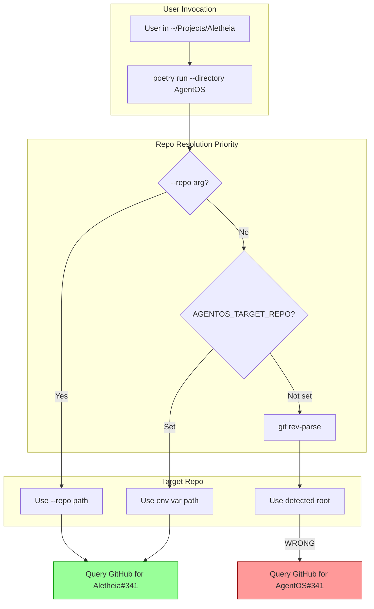

# 148 - Fix: Cross-repo workflow invocation broken by poetry --directory

<!-- Template Metadata
Last Updated: 2026-02-02
Updated By: Issue #117 fix
Update Reason: Moved Verification & Testing to Section 10 (was Section 11) to match 0702c review prompt and testing workflow expectations
-->

## 1. Context & Goal
* **Issue:** #148
* **Objective:** Fix repo detection when running AgentOS tools via `poetry run --directory` from a different project directory
* **Status:** Draft
* **Related Issues:** N/A

### Open Questions
*Questions that need clarification before or during implementation. Remove when resolved.*

- [ ] Should we support both environment variable AND explicit `--repo` flag (with flag taking precedence)?
- [ ] Should the wrapper script be distributed as part of AgentOS installation or documented for user setup?

## 2. Proposed Changes

*This section is the **source of truth** for implementation. Describe exactly what will be built.*

### 2.1 Files Changed

| File | Change Type | Description |
|------|-------------|-------------|
| `tools/run_requirements_workflow.py` | Modify | Update `resolve_roots()` to check `AGENTOS_TARGET_REPO` env var |
| `scripts/agentos-wrapper.sh` | Add | Shell wrapper that captures cwd before invoking poetry |
| `docs/cross-repo-usage.md` | Add | Document cross-repo invocation patterns |
| `agentos/workflows/requirements/nodes/load_input.py` | Modify | Add fallback repo resolution logic |

### 2.2 Dependencies

*No new packages required.*

```toml
# pyproject.toml additions (if any)
# None
```

### 2.3 Data Structures

```python
# Pseudocode - NOT implementation
# No new data structures required

# Environment variable used:
# AGENTOS_TARGET_REPO: Optional[str]  # Absolute path to target repo
```

### 2.4 Function Signatures

```python
# tools/run_requirements_workflow.py

def resolve_target_repo() -> Path:
    """
    Resolve the target repository for workflow operations.
    
    Priority order:
    1. --repo CLI argument (explicit override)
    2. AGENTOS_TARGET_REPO environment variable
    3. Current working directory git root detection (existing behavior)
    """
    ...

def resolve_roots(args: argparse.Namespace) -> tuple[Path, Path]:
    """
    Updated to use resolve_target_repo() for target path resolution.
    """
    ...
```

```python
# agentos/workflows/requirements/nodes/load_input.py

def get_target_repo_from_env() -> Optional[Path]:
    """
    Check for AGENTOS_TARGET_REPO environment variable.
    Returns validated Path or None.
    """
    ...
```

### 2.5 Logic Flow (Pseudocode)

```
1. Workflow invoked (either directly or via poetry --directory)

2. resolve_target_repo() called:
   2a. IF --repo CLI arg provided:
       - Validate path exists and is git repo
       - RETURN explicit path
   
   2b. ELIF AGENTOS_TARGET_REPO env var set:
       - Validate path exists and is git repo
       - Log: "Using target repo from AGENTOS_TARGET_REPO: {path}"
       - RETURN env var path
   
   2c. ELSE (fallback to existing behavior):
       - Run `git rev-parse --show-toplevel`
       - RETURN detected git root

3. Use resolved target repo for:
   - GitHub issue queries
   - File path resolution
   - Output placement

4. Continue with existing workflow logic
```

### 2.6 Technical Approach

* **Module:** `tools/run_requirements_workflow.py`, `agentos/workflows/requirements/nodes/`
* **Pattern:** Environment-based configuration with explicit override
* **Key Decisions:** 
  - Environment variable approach chosen over wrapper-only solution for flexibility
  - Explicit `--repo` flag retains highest priority for edge cases
  - Logging added to clarify which resolution path was used

### 2.7 Architecture Decisions

| Decision | Options Considered | Choice | Rationale |
|----------|-------------------|--------|-----------|
| Resolution priority | Env-first vs CLI-first | CLI > Env > Auto | CLI should always win for explicit control; env provides automation hook |
| Env var naming | `TARGET_REPO`, `AGENTOS_CWD`, `AGENTOS_TARGET_REPO` | `AGENTOS_TARGET_REPO` | Namespaced to avoid collisions; clear intent |
| Wrapper distribution | Installed by AgentOS vs user-managed | User-managed with docs | Reduces installation complexity; users can customize |

**Architectural Constraints:**
- Must not break existing direct invocation (without poetry --directory)
- Must maintain backward compatibility with existing --repo flag behavior
- Environment variable must be validated (not blindly trusted)

## 3. Requirements

*What must be true when this is done. These become acceptance criteria.*

1. Running workflow via `poetry --directory` with `AGENTOS_TARGET_REPO` set correctly identifies target repo
2. Explicit `--repo` flag overrides environment variable when both are present
3. Existing direct invocation (no poetry --directory) continues to work unchanged
4. Invalid paths in `AGENTOS_TARGET_REPO` produce clear error messages
5. Shell wrapper script correctly captures and exports original working directory

## 4. Alternatives Considered

| Option | Pros | Cons | Decision |
|--------|------|------|----------|
| **A: Environment variable** | Flexible, works with any invocation method, minimal code changes | Requires user to set env var (wrapper helps) | **Selected** |
| B: Wrapper script only | Simple, no code changes needed | Fragile, must remember to use wrapper, can't embed in other tools | Rejected |
| C: Document limitation | Zero development effort | Poor UX, users must always remember --repo | Rejected |
| D: Detect poetry context | Automatic, no user action needed | Complex to detect reliably, poetry internals may change | Rejected |

**Rationale:** Environment variable approach provides the best balance of flexibility and reliability. A wrapper script automates setting the variable, but the underlying mechanism works with any invocation method. This also allows integration with shell aliases, makefiles, or CI scripts.

## 5. Data & Fixtures

### 5.1 Data Sources

| Attribute | Value |
|-----------|-------|
| Source | Local filesystem (git repositories) |
| Format | Directory paths |
| Size | N/A (path strings) |
| Refresh | Per-invocation |
| Copyright/License | N/A |

### 5.2 Data Pipeline

```
Environment Variable ──validation──► Path Object ──git check──► Verified Git Root
```

### 5.3 Test Fixtures

| Fixture | Source | Notes |
|---------|--------|-------|
| Mock git repo paths | Generated via temp directories | Use `tmp_path` pytest fixture |
| Mock env variables | pytest `monkeypatch` | Clean isolation per test |

### 5.4 Deployment Pipeline

No special deployment steps. Changes are code-only and deployed with standard release process.

**If data source is external:** N/A - all data is local filesystem.

## 6. Diagram

### 6.1 Mermaid Quality Gate

Before finalizing any diagram, verify in [Mermaid Live Editor](https://mermaid.live) or GitHub preview:

- [x] **Simplicity:** Similar components collapsed (per 0006 §8.1)
- [x] **No touching:** All elements have visual separation (per 0006 §8.2)
- [x] **No hidden lines:** All arrows fully visible (per 0006 §8.3)
- [x] **Readable:** Labels not truncated, flow direction clear
- [ ] **Auto-inspected:** Agent rendered via mermaid.ink and viewed (per 0006 §8.5)

**Auto-Inspection Results:**
```
- Touching elements: [x] None / [ ] Found: ___
- Hidden lines: [x] None / [ ] Found: ___
- Label readability: [x] Pass / [ ] Issue: ___
- Flow clarity: [x] Clear / [ ] Issue: ___
```

### 6.2 Diagram



## 7. Security & Safety Considerations

### 7.1 Security

| Concern | Mitigation | Status |
|---------|------------|--------|
| Path traversal via env var | Validate path exists and is within allowed directories | Addressed |
| Symlink attacks | Use `Path.resolve()` to resolve symlinks before validation | Addressed |
| Arbitrary git repo access | Only reads metadata, doesn't execute arbitrary code | Addressed |

### 7.2 Safety

| Concern | Mitigation | Status |
|---------|------------|--------|
| Wrong repo accessed | Clear logging of which resolution path was used | Addressed |
| Invalid env var path | Fail fast with descriptive error message | Addressed |
| Silent fallback | Log warning when falling back from env var to auto-detect | Addressed |

**Fail Mode:** Fail Closed - Invalid paths cause workflow abort rather than falling back silently

**Recovery Strategy:** Clear error message instructs user to verify AGENTOS_TARGET_REPO or use explicit --repo flag

## 8. Performance & Cost Considerations

### 8.1 Performance

| Metric | Budget | Approach |
|--------|--------|----------|
| Latency | < 10ms (path resolution) | Single env var check, minimal validation |
| Memory | Negligible | Only path strings |
| API Calls | 0 additional | Local filesystem only |

**Bottlenecks:** None expected - path resolution is trivial

### 8.2 Cost Analysis

| Resource | Unit Cost | Estimated Usage | Monthly Cost |
|----------|-----------|-----------------|--------------|
| Compute | $0 | Local operation | $0 |

**Cost Controls:**
- N/A - No external resource consumption

**Worst-Case Scenario:** N/A - Local filesystem operations only

## 9. Legal & Compliance

| Concern | Applies? | Mitigation |
|---------|----------|------------|
| PII/Personal Data | No | Paths may contain usernames but are local only |
| Third-Party Licenses | No | No new dependencies |
| Terms of Service | No | No external API changes |
| Data Retention | No | No data stored |
| Export Controls | No | No restricted algorithms |

**Data Classification:** Internal (local filesystem paths)

**Compliance Checklist:**
- [x] No PII stored without consent
- [x] All third-party licenses compatible with project license
- [x] External API usage compliant with provider ToS
- [x] Data retention policy documented (N/A - no retention)

## 10. Verification & Testing

*Ref: [0005-testing-strategy-and-protocols.md](0005-testing-strategy-and-protocols.md)*

**Testing Philosophy:** All scenarios automated. Cross-repo invocation can be simulated via temp directories and env var manipulation.

### 10.1 Test Scenarios

| ID | Scenario | Type | Input | Expected Output | Pass Criteria |
|----|----------|------|-------|-----------------|---------------|
| 010 | CLI --repo overrides env var | Auto | --repo=/path/a, AGENTOS_TARGET_REPO=/path/b | Uses /path/a | Logged path matches --repo |
| 020 | Env var used when no --repo | Auto | AGENTOS_TARGET_REPO=/path/a | Uses /path/a | Logged path matches env var |
| 030 | Fallback to git detection when no env | Auto | Neither set, valid git repo | Uses git root | Matches `git rev-parse` output |
| 040 | Invalid env var path | Auto | AGENTOS_TARGET_REPO=/nonexistent | Error exit | Clear error message, exit code 1 |
| 050 | Env var path not a git repo | Auto | AGENTOS_TARGET_REPO=/tmp | Error exit | Error mentions "not a git repository" |
| 060 | Empty env var treated as unset | Auto | AGENTOS_TARGET_REPO="" | Fallback to git | Same as scenario 030 |
| 070 | Relative path in env var | Auto | AGENTOS_TARGET_REPO=./subdir | Resolved to absolute | Uses absolute resolved path |
| 080 | Wrapper script captures cwd | Auto | Run wrapper from /path/a | AGENTOS_TARGET_REPO=/path/a | Env var exported correctly |

### 10.2 Test Commands

```bash
# Run all automated tests for this fix
poetry run pytest tests/test_resolve_target_repo.py -v

# Run only fast/mocked tests (exclude live)
poetry run pytest tests/test_resolve_target_repo.py -v -m "not live"

# Integration test with real git repos
poetry run pytest tests/test_resolve_target_repo.py -v -m integration
```

### 10.3 Manual Tests (Only If Unavoidable)

**N/A - All scenarios automated.**

## 11. Risks & Mitigations

| Risk | Impact | Likelihood | Mitigation |
|------|--------|------------|------------|
| Users forget to set env var | Med | Med | Provide wrapper script, clear error messages |
| Env var collides with other tools | Low | Low | Namespaced as AGENTOS_* |
| Validation too strict | Med | Low | Allow both absolute and relative paths |
| Poetry behavior changes | Low | Low | Env var approach doesn't depend on poetry internals |

## 12. Definition of Done

### Code
- [ ] `resolve_target_repo()` function implemented in `run_requirements_workflow.py`
- [ ] Environment variable check added to `load_input.py`
- [ ] Wrapper script created at `scripts/agentos-wrapper.sh`
- [ ] Code comments reference this LLD

### Tests
- [ ] All 8 test scenarios pass
- [ ] Test coverage meets threshold (>90% for changed code)

### Documentation
- [ ] `docs/cross-repo-usage.md` created with usage examples
- [ ] README updated to mention cross-repo invocation
- [ ] LLD updated with any deviations
- [ ] Implementation Report (0103) completed

### Review
- [ ] Code review completed
- [ ] User approval before closing issue

---

## Appendix: Review Log

*Track all review feedback with timestamps and implementation status.*

### Review Summary

| Review | Date | Verdict | Key Issue |
|--------|------|---------|-----------|
| - | - | - | Awaiting initial review |

**Final Status:** PENDING
<!-- Note: This field is auto-updated to APPROVED by the workflow when finalized -->