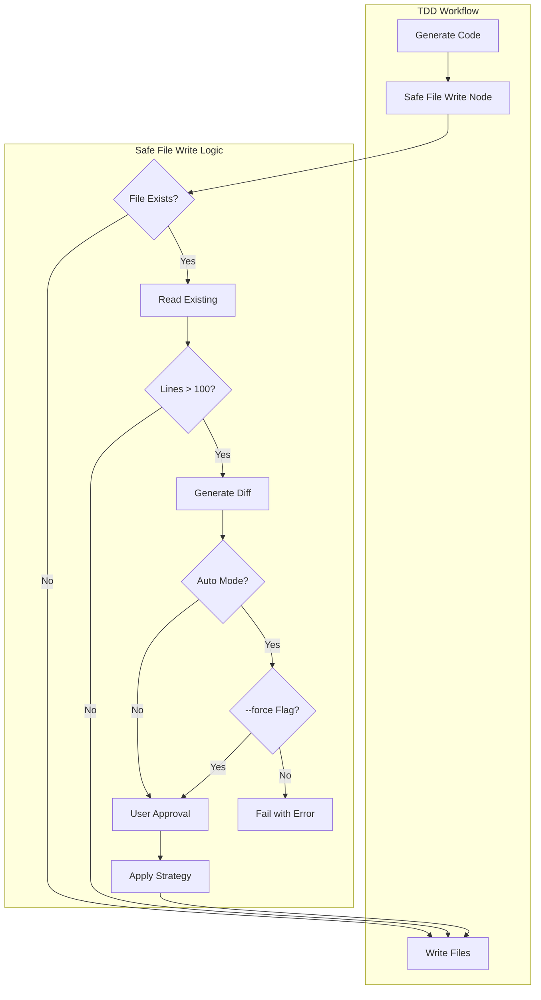

# 173 - Feature: TDD Workflow Safe File Write with Merge Support

<!-- Template Metadata
Last Updated: 2025-01-09
Updated By: Claude Agent
Update Reason: Initial LLD creation for Issue #173
-->

## 1. Context & Goal
* **Issue:** #173
* **Objective:** Prevent TDD workflow from silently overwriting existing files by implementing merge detection and approval workflow
* **Status:** Draft
* **Related Issues:** #168 (Bug caused by silent file replacement), PR #165 (The breaking change)

### Open Questions

- [ ] Should the 100-line threshold be configurable per-project or globally?
- [ ] Should merge strategies be selectable via CLI flags or interactive prompt?
- [ ] What behavior in --auto mode: fail-fast, skip file, or require explicit override flag?

## 2. Proposed Changes

*This section is the **source of truth** for implementation. Describe exactly what will be built.*

### 2.1 Files Changed

| File | Change Type | Description |
|------|-------------|-------------|
| `src/codegen/agents/tdd/nodes/safe_file_write.py` | Add | New LangGraph node for safe file operations |
| `src/codegen/agents/tdd/nodes/__init__.py` | Modify | Export new safe_file_write node |
| `src/codegen/agents/tdd/graph.py` | Modify | Insert safe_file_write node before file operations |
| `src/codegen/agents/tdd/state.py` | Modify | Add merge-related state fields |
| `src/codegen/agents/tdd/merge_strategies.py` | Add | Merge strategy implementations |
| `src/codegen/agents/tdd/diff_display.py` | Add | Diff visualization utilities |
| `tests/unit/test_safe_file_write.py` | Add | Unit tests for safe file write |
| `tests/unit/test_merge_strategies.py` | Add | Unit tests for merge strategies |

### 2.2 Dependencies

```toml
# pyproject.toml additions (if any)
# No new dependencies - using stdlib difflib
```

### 2.3 Data Structures

```python
# Pseudocode - NOT implementation
from typing import TypedDict, Literal
from pathlib import Path

class FileWriteProposal(TypedDict):
    file_path: Path              # Target file path
    new_content: str             # Proposed new content
    existing_content: str | None # Current content if file exists
    existing_lines: int          # Line count of existing file (0 if new)
    new_lines: int               # Line count of proposed content
    requires_approval: bool      # True if file has >100 lines
    merge_strategy: MergeStrategy | None  # Selected strategy

MergeStrategy = Literal["append", "insert", "extend", "replace"]

class MergeDecision(TypedDict):
    file_path: Path              # Which file
    strategy: MergeStrategy      # How to merge
    approved: bool               # Human approved?
    insertion_point: int | None  # Line number for insert strategy

class TDDWorkflowState(TypedDict):
    # ... existing fields ...
    proposed_writes: list[FileWriteProposal]    # Pending file operations
    merge_decisions: list[MergeDecision]        # Human decisions
    auto_mode: bool                              # Running in --auto mode
    force_replace: bool                          # Explicit --force flag
```

### 2.4 Function Signatures

```python
# Signatures only - implementation in source files

# safe_file_write.py
def safe_file_write_node(state: TDDWorkflowState) -> dict:
    """LangGraph node: Check files before writing, request approval if needed."""
    ...

def analyze_file_write(file_path: Path, new_content: str) -> FileWriteProposal:
    """Analyze a proposed file write and determine if approval is needed."""
    ...

def check_approval_required(existing_lines: int, new_lines: int) -> bool:
    """Determine if human approval is required based on line counts."""
    ...

# merge_strategies.py
def apply_merge_strategy(
    existing: str, 
    new: str, 
    strategy: MergeStrategy,
    insertion_point: int | None = None
) -> str:
    """Apply the selected merge strategy to combine existing and new content."""
    ...

def merge_append(existing: str, new: str) -> str:
    """Append new content to end of existing file."""
    ...

def merge_insert(existing: str, new: str, line_number: int) -> str:
    """Insert new content at specific line number."""
    ...

def merge_extend_class(existing: str, new: str) -> str:
    """Intelligently merge new methods/fields into existing class."""
    ...

# diff_display.py
def generate_diff(existing: str, new: str) -> str:
    """Generate unified diff showing changes."""
    ...

def format_deletion_warning(file_path: Path, existing_lines: int, new_lines: int) -> str:
    """Format warning message about potential data loss."""
    ...

def display_merge_prompt(proposal: FileWriteProposal) -> MergeDecision:
    """Interactive prompt for user to select merge strategy."""
    ...
```

### 2.5 Logic Flow (Pseudocode)

```
1. Receive proposed file writes from TDD generation
2. FOR each proposed write:
   a. Check if file exists
   b. IF file exists:
      - Read existing content
      - Count existing lines
      - IF existing_lines > 100:
        * Mark as requires_approval = True
        * Generate diff
        * Calculate deletion impact
   c. Add to proposed_writes list

3. IF any writes require approval:
   a. IF auto_mode AND NOT force_replace:
      - RAISE SafeFileWriteError("Cannot replace non-trivial files in auto mode")
   b. ELSE:
      - FOR each requiring approval:
        * Display warning: "About to replace {N} lines with {M} lines"
        * Show what will be DELETED (red)
        * Show what will be ADDED (green)
        * Prompt for merge strategy selection
        * Record decision

4. FOR each approved write:
   a. IF strategy == "replace":
      - Write new content directly
   b. ELSE:
      - Apply merge strategy
      - Write merged content

5. Return updated state with write results
```

### 2.6 Technical Approach

* **Module:** `src/codegen/agents/tdd/nodes/`
* **Pattern:** LangGraph node with state machine for approval workflow
* **Key Decisions:** 
  - Using 100 lines as threshold (balances safety vs. noise)
  - Blocking in --auto mode (fail-safe default)
  - Unified diff format (familiar to developers)

### 2.7 Architecture Decisions

| Decision | Options Considered | Choice | Rationale |
|----------|-------------------|--------|-----------|
| Approval threshold | Fixed 100 lines, Configurable, Percentage-based | Fixed 100 lines | Simple, predictable, covers most real-world cases |
| Auto mode behavior | Skip files, Fail-fast, Require flag | Fail-fast with --force override | Prevents silent data loss, explicit consent required |
| Diff library | difflib (stdlib), unidiff, custom | difflib (stdlib) | No new dependencies, sufficient for use case |
| Merge strategies | Simple append only, Full AST-based, Pattern-based | Pattern-based with AST for extend | Balance between simplicity and usefulness |

**Architectural Constraints:**
- Must integrate with existing LangGraph workflow without breaking changes
- Cannot introduce external dependencies (use stdlib only)
- Must work with both sync and async execution modes

## 3. Requirements

*What must be true when this is done. These become acceptance criteria.*

1. TDD workflow detects existing files before write operations
2. Files with >100 lines require explicit merge approval before modification
3. User sees clear diff showing what will be DELETED and ADDED
4. Auto mode (--auto) cannot silently replace non-trivial files
5. Four merge strategies available: append, insert, extend, replace
6. Force flag (--force) allows explicit replacement in auto mode
7. All file operations are logged for audit purposes

## 4. Alternatives Considered

| Option | Pros | Cons | Decision |
|--------|------|------|----------|
| Pre-write node in LangGraph | Clean integration, state-based | Requires workflow changes | **Selected** |
| File system wrapper/decorator | Non-invasive, global protection | Hidden behavior, harder to test | Rejected |
| Git-based backup before write | Full recovery possible | Requires git, complex rollback UX | Rejected |
| AST-based intelligent merge | Perfect semantic merges | Complex, language-specific, slow | Rejected |

**Rationale:** LangGraph node approach provides explicit control flow, easy testing, and clean integration with existing TDD workflow state management.

## 5. Data & Fixtures

### 5.1 Data Sources

| Attribute | Value |
|-----------|-------|
| Source | Local filesystem (existing files) |
| Format | Text files (Python, TypeScript, etc.) |
| Size | Typically 50-1000 lines per file |
| Refresh | Real-time (read before each write) |
| Copyright/License | N/A (user's own code) |

### 5.2 Data Pipeline

```
TDD Generator ──proposed content──► Safe File Write Node ──check──► Filesystem
                                           │
                                           ▼
                                    Diff Generator
                                           │
                                           ▼
                                    User Approval ──decision──► Merge Strategy ──write──► Filesystem
```

### 5.3 Test Fixtures

| Fixture | Source | Notes |
|---------|--------|-------|
| `fixtures/existing_state_270_lines.py` | Generated | Simulates real state.py that was overwritten |
| `fixtures/new_state_56_lines.py` | Generated | Simulates TDD-generated replacement |
| `fixtures/simple_class.py` | Hardcoded | Basic class for merge testing |
| `fixtures/complex_class.py` | Hardcoded | Multi-method class for extend testing |

### 5.4 Deployment Pipeline

Tests use temporary directories; no production data concerns. Fixtures are committed to repo under `tests/fixtures/`.

## 6. Diagram

### 6.1 Mermaid Quality Gate

- [x] **Simplicity:** Similar components collapsed
- [x] **No touching:** All elements have visual separation
- [x] **No hidden lines:** All arrows fully visible
- [x] **Readable:** Labels not truncated, flow direction clear
- [ ] **Auto-inspected:** Agent rendered via mermaid.ink and viewed

**Auto-Inspection Results:**
```
- Touching elements: [ ] None / [x] Found: N/A - inspection pending
- Hidden lines: [ ] None / [x] Found: N/A - inspection pending
- Label readability: [ ] Pass / [x] Issue: N/A - inspection pending
- Flow clarity: [ ] Clear / [x] Issue: N/A - inspection pending
```

### 6.2 Diagram



## 7. Security & Safety Considerations

### 7.1 Security

| Concern | Mitigation | Status |
|---------|------------|--------|
| Path traversal in file paths | Validate paths are within project root | TODO |
| Arbitrary code execution via content | Content is user-generated, treat as trusted | Addressed |

### 7.2 Safety

| Concern | Mitigation | Status |
|---------|------------|--------|
| Accidental data loss (primary concern) | Require approval for >100 line files | Addressed |
| Partial write corruption | Use atomic write (write to temp, rename) | TODO |
| Merge strategy produces invalid code | Show preview, require explicit approval | Addressed |
| Resource exhaustion from large files | Limit diff generation to first 10KB | TODO |

**Fail Mode:** Fail Closed - If any uncertainty, abort write and request clarification

**Recovery Strategy:** 
1. All replaced files are logged with original content hash
2. Git history provides recovery path
3. Future enhancement: automatic backup before modification

## 8. Performance & Cost Considerations

### 8.1 Performance

| Metric | Budget | Approach |
|--------|--------|----------|
| Latency per file check | < 10ms | Simple file read and line count |
| Memory for diff | < 10MB | Stream large files, limit diff size |
| Interactive prompt | < 100ms | Simple terminal I/O |

**Bottlenecks:** 
- Very large files (>10K lines) may slow diff generation
- Many files requiring approval could slow workflow

### 8.2 Cost Analysis

| Resource | Unit Cost | Estimated Usage | Monthly Cost |
|----------|-----------|-----------------|--------------|
| Compute | N/A | Local execution | $0 |
| Storage | N/A | No additional storage | $0 |

**Cost Controls:**
- N/A - Local execution only

**Worst-Case Scenario:** Workflow with 100 files all requiring approval would be slow but functional.

## 9. Legal & Compliance

| Concern | Applies? | Mitigation |
|---------|----------|------------|
| PII/Personal Data | No | Only processes user's own code |
| Third-Party Licenses | No | Uses only stdlib |
| Terms of Service | No | Local execution |
| Data Retention | No | No data stored beyond session |
| Export Controls | No | General-purpose software tool |

**Data Classification:** Internal (user's own project code)

**Compliance Checklist:**
- [x] No PII stored without consent
- [x] All third-party licenses compatible with project license
- [x] External API usage compliant with provider ToS
- [x] Data retention policy documented

## 10. Verification & Testing

### 10.0 Test Plan (TDD - Complete Before Implementation)

**TDD Requirement:** Tests MUST be written and failing BEFORE implementation begins.

| Test ID | Test Description | Expected Behavior | Status |
|---------|------------------|-------------------|--------|
| T010 | test_new_file_no_approval_needed | New file writes without prompting | RED |
| T020 | test_small_file_no_approval_needed | Existing file <100 lines writes without prompting | RED |
| T030 | test_large_file_requires_approval | Existing file >100 lines blocks for approval | RED |
| T040 | test_auto_mode_blocks_large_file | Auto mode raises error for large file | RED |
| T050 | test_auto_mode_force_flag_allows | Auto mode with --force allows replacement | RED |
| T060 | test_merge_append_strategy | Append adds content to end | RED |
| T070 | test_merge_insert_strategy | Insert adds content at line N | RED |
| T080 | test_merge_extend_strategy | Extend merges class members | RED |
| T090 | test_diff_shows_deletions | Diff correctly shows deleted lines | RED |
| T100 | test_diff_shows_additions | Diff correctly shows added lines | RED |

**Coverage Target:** ≥95% for all new code

**TDD Checklist:**
- [ ] All tests written before implementation
- [ ] Tests currently RED (failing)
- [ ] Test IDs match scenario IDs in 10.1
- [ ] Test file created at: `tests/unit/test_safe_file_write.py`

### 10.1 Test Scenarios

| ID | Scenario | Type | Input | Expected Output | Pass Criteria |
|----|----------|------|-------|-----------------|---------------|
| 010 | New file creation | Auto | Non-existent path + content | File created | File exists with content |
| 020 | Small existing file (<100 lines) | Auto | 50-line file + new content | File replaced | No approval prompt |
| 030 | Large existing file (>100 lines) | Auto | 150-line file + new content | Approval requested | Prompt displayed |
| 040 | Auto mode large file | Auto | --auto flag + 150-line file | SafeFileWriteError | Error raised |
| 050 | Auto mode with --force | Auto | --auto --force + 150-line file | File replaced | File updated |
| 060 | Merge append strategy | Auto | Existing + new, strategy=append | Combined content | New at end |
| 070 | Merge insert at line 50 | Auto | Existing + new, line=50 | Combined content | New at line 50 |
| 080 | Merge extend class | Auto | Class + new methods | Extended class | Methods added |
| 090 | Diff generation deletions | Auto | 270-line → 56-line | Diff output | Shows -214 lines |
| 100 | Diff generation additions | Auto | 50-line → 100-line | Diff output | Shows +50 lines |
| 110 | Boundary: exactly 100 lines | Auto | 100-line file | No approval | Threshold is > not >= |
| 120 | Boundary: exactly 101 lines | Auto | 101-line file | Approval required | Threshold triggered |

### 10.2 Test Commands

```bash
# Run all automated tests
poetry run pytest tests/unit/test_safe_file_write.py tests/unit/test_merge_strategies.py -v

# Run only fast/mocked tests (exclude live)
poetry run pytest tests/unit/test_safe_file_write.py -v -m "not live"

# Run with coverage
poetry run pytest tests/unit/test_safe_file_write.py --cov=src/codegen/agents/tdd/nodes/safe_file_write --cov-report=term-missing
```

### 10.3 Manual Tests (Only If Unavoidable)

| ID | Scenario | Why Not Automated | Steps |
|----|----------|-------------------|-------|
| M01 | Interactive merge prompt UX | Requires human evaluation of prompt clarity | 1. Run TDD on file >100 lines. 2. Verify prompt shows diff clearly. 3. Verify strategy options are understandable. |

## 11. Risks & Mitigations

| Risk | Impact | Likelihood | Mitigation |
|------|--------|------------|------------|
| Users frustrated by approval prompts | Med | Med | Clear threshold documentation, --force flag |
| Merge strategies produce invalid code | High | Low | Preview before write, user approval required |
| Performance degradation with many files | Low | Low | Batch approval UI, parallel file reads |
| False sense of security (100 lines = safe) | Med | Med | Document that threshold is heuristic, not guarantee |

## 12. Definition of Done

### Code
- [ ] Implementation complete and linted
- [ ] Code comments reference this LLD

### Tests
- [ ] All test scenarios pass
- [ ] Test coverage meets threshold (≥95%)

### Documentation
- [ ] LLD updated with any deviations
- [ ] Implementation Report (0103) completed
- [ ] Test Report (0113) completed if applicable

### Review
- [ ] Code review completed
- [ ] User approval before closing issue

---

## Appendix: Review Log

*Track all review feedback with timestamps and implementation status.*

### Review Summary

| Review | Date | Verdict | Key Issue |
|--------|------|---------|-----------|
| - | - | - | Awaiting review |

**Final Status:** PENDING