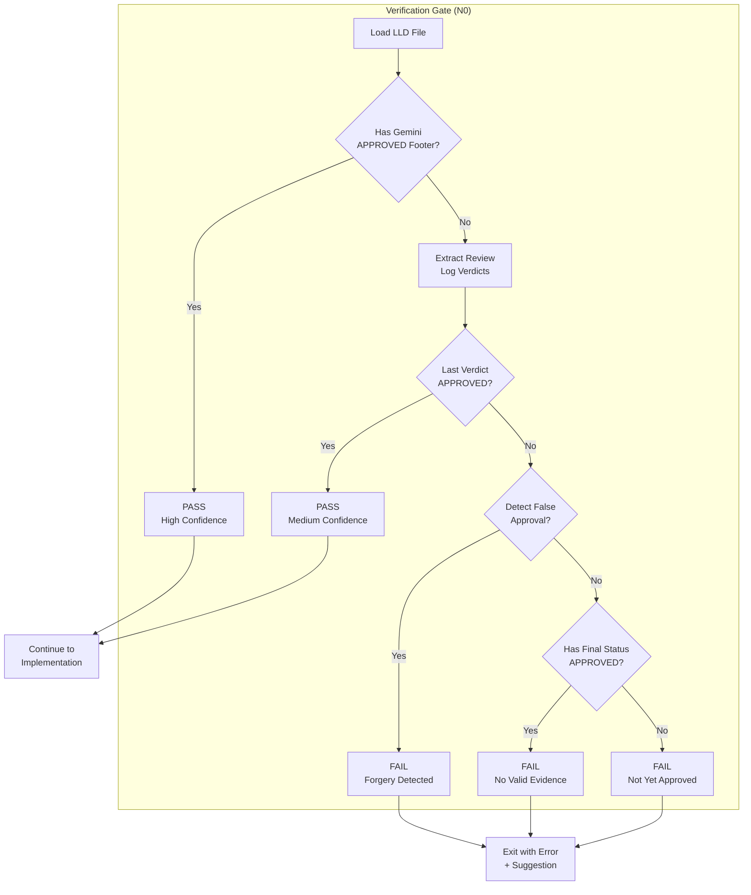

# 177 - Feature: Implementation workflow gate to verify LLD was genuinely approved

<!-- Template Metadata
Last Updated: 2026-02-02
Updated By: Issue #177 creation
Update Reason: Revision addressing Gemini Review #1 feedback
-->

## 1. Context & Goal
* **Issue:** #177
* **Objective:** Add a pre-flight verification gate to the implementation workflow that ensures LLDs were genuinely approved by Gemini review, preventing wasted effort on unreviewed designs
* **Status:** Approved (gemini-3-pro-preview, 2026-02-02)
* **Related Issues:** #176 (Bug: LLD workflow stamps APPROVED regardless of verdict)

### Open Questions

*All questions resolved per Gemini Review #1 feedback:*

- [x] ~~Should the gate also verify the approval is recent (within N days)?~~ **Decision: No recency check for MVP.** Keep implementation simple; users can always re-run review if concerned about staleness.
- [x] ~~Should there be a `--force` flag to bypass the gate for exceptional circumstances?~~ **Decision: No force flag.** Users should fix the LLD or get a new approval per the Recovery Strategy. This maintains integrity of the approval process.

## 2. Proposed Changes

*This section is the **source of truth** for implementation. Describe exactly what will be built.*

### 2.1 Files Changed

| File | Change Type | Description |
|------|-------------|-------------|
| `src/workflows/run_implement_from_lld.py` | Modify | Add verification gate in N0 (load LLD) |
| `src/utils/lld_verification.py` | Add | New module containing verification logic |
| `tests/test_lld_verification.py` | Add | Unit tests for verification logic |

### 2.2 Dependencies

```toml
# pyproject.toml additions (if any)
# No new dependencies required - uses standard library only
```

### 2.3 Data Structures

```python
# Pseudocode - NOT implementation
class LLDVerificationResult(TypedDict):
    is_valid: bool           # Whether approval is genuine
    reason: str              # Human-readable explanation
    approval_source: str | None  # "footer" | "review_log" | None
    last_verdict: str | None     # APPROVED | REVISE | REJECTED | PENDING
    confidence: str          # "high" | "medium" | "low"
```

### 2.4 Function Signatures

```python
# Signatures only - implementation in source files
def verify_lld_approval(lld_content: str) -> LLDVerificationResult:
    """Verify LLD was genuinely approved by Gemini review.
    
    Checks multiple signals:
    1. Gemini APPROVED footer (highest confidence)
    2. Review log final verdict (medium confidence)
    3. Detects false approvals (mismatched status)
    
    Returns:
        LLDVerificationResult with validation status and reason
    """
    ...

def extract_review_log_verdicts(lld_content: str) -> list[tuple[str, str, str]]:
    """Extract all verdicts from the review log table.
    
    Returns:
        List of (reviewer, date, verdict) tuples in chronological order
    """
    ...

def has_gemini_approved_footer(lld_content: str) -> bool:
    """Check for genuine Gemini APPROVED footer.
    
    The footer format is:
    <sub>**Gemini Review:** APPROVED | **Model:** ...
    """
    ...

def detect_false_approval(lld_content: str, last_verdict: str | None) -> tuple[bool, str | None]:
    """Detect if Final Status says APPROVED but reviews say otherwise.
    
    Args:
        lld_content: The LLD markdown content
        last_verdict: The most recent verdict from review log (or None)
    
    Returns:
        (is_false, details) - True if false approval detected
    """
    ...

def run_verification_gate(lld_path: Path) -> None:
    """Pre-flight gate for implementation workflow.
    
    Raises:
        LLDVerificationError: If approval is not genuine
    """
    ...

class LLDVerificationError(Exception):
    """Raised when LLD fails approval verification."""
    
    def __init__(self, reason: str, suggestion: str, error_type: str):
        """
        Args:
            reason: Why verification failed
            suggestion: How to fix
            error_type: "forgery" | "not_approved" | "no_evidence"
        """
        ...
```

### 2.5 Logic Flow (Pseudocode)

```
1. Load LLD content from file

2. Check for Gemini APPROVED footer:
   - Pattern: <sub>**Gemini Review:** APPROVED
   - IF found: PASS with high confidence (RETURN EARLY)
   
3. Extract all verdicts from Review Log table:
   - Parse markdown table rows
   - Extract (reviewer, date, verdict) tuples
   - Sort by date (chronological)
   - Store last_verdict for later checks
   
4. Check last verdict in review log:
   - IF last verdict is APPROVED: PASS with medium confidence (RETURN EARLY)
   - IF no verdicts found: CONTINUE to false approval check
   
5. Detect false approval (using last_verdict from step 3):
   - IF "**Final Status:** APPROVED" exists:
     - AND last_verdict in [REVISE, REJECTED, PENDING, None]: FALSE APPROVAL
     - AND review log contains "Awaiting review": FALSE APPROVAL
   - Return (is_false, details)
   
6. Determine failure type and return:
   - IF false approval detected: FAIL with error_type="forgery"
   - ELIF "**Final Status:** APPROVED" exists: FAIL with error_type="no_evidence"  
   - ELSE: FAIL with error_type="not_approved"
```

### 2.6 Technical Approach

* **Module:** `src/utils/lld_verification.py`
* **Pattern:** Pure function validation (no side effects until gate)
* **Key Decisions:** 
  - Separate verification logic from gate enforcement for testability
  - Multiple confidence levels allow future workflow flexibility
  - Pattern matching uses simple string operations (no regex needed)
  - False approval detection explicitly uses last_verdict to avoid flagging valid LLDs where REVISE occurred before final APPROVED

### 2.7 Architecture Decisions

| Decision | Options Considered | Choice | Rationale |
|----------|-------------------|--------|-----------|
| Verification location | N0 only, N0 + N-1, Separate pre-hook | N0 integration | Fail fast, single responsibility |
| Pattern matching | Regex, String operations, Markdown parser | String operations | Simple, no dependencies, patterns are consistent |
| Error handling | Return False, Raise exception, Return tuple | Raise exception | Implementation workflow should not proceed |
| Confidence levels | Binary pass/fail, Three-tier | Three-tier | Future flexibility for workflows that accept medium confidence |
| Recency check | Required, Optional flag, Not implemented | Not implemented | Keep MVP simple; users can re-run review if concerned |
| Force bypass flag | Implement, Not implement | Not implement | Maintains approval integrity; users should fix LLD properly |

**Architectural Constraints:**
- Must integrate with existing LanGraph workflow structure
- Cannot modify LLD file during verification (read-only check)
- Must provide actionable error messages

## 3. Requirements

*What must be true when this is done. These become acceptance criteria.*

1. Implementation workflow refuses to proceed if LLD approval is not genuine
2. Clear error message explains why the LLD failed verification
3. Error message suggests re-running LLD workflow with `--gates verdict`
4. Gate passes for LLDs with genuine Gemini APPROVED footer
5. Gate passes for LLDs with APPROVED as final review log verdict
6. Gate fails for false approvals (status mismatch)
7. Gate fails for LLDs with no approval evidence

## 4. Alternatives Considered

| Option | Pros | Cons | Decision |
|--------|------|------|----------|
| String pattern matching | Simple, fast, no deps | May miss edge cases | **Selected** |
| Full markdown parsing | Robust structure handling | Over-engineered, adds deps | Rejected |
| Cryptographic signature | Tamper-proof | Complex, overkill for internal tool | Rejected |
| Database of approvals | Central source of truth | Adds infrastructure | Rejected |

**Rationale:** Pattern matching is sufficient because LLD format is controlled and consistent. The verification targets known patterns that won't change without workflow updates.

## 5. Data & Fixtures

### 5.1 Data Sources

| Attribute | Value |
|-----------|-------|
| Source | Local filesystem (LLD markdown files) |
| Format | Markdown with structured sections |
| Size | ~5-50KB per LLD |
| Refresh | N/A (point-in-time check) |
| Copyright/License | N/A (internal project files) |

### 5.2 Data Pipeline

```
LLD File ──read──► String Content ──verify──► Result ──gate──► Pass/Fail
```

### 5.3 Test Fixtures

| Fixture | Source | Notes |
|---------|--------|-------|
| LLD with genuine footer | Hardcoded | Real approved LLD pattern |
| LLD with false approval | Hardcoded | Simulates bug from #176 |
| LLD with REVISE verdict | Hardcoded | Should fail gate |
| LLD with no review log | Hardcoded | Edge case |
| LLD with multiple reviews | Hardcoded | Tests chronological ordering |

### 5.4 Deployment Pipeline

N/A - Code-only change, no data pipeline.

## 6. Diagram

### 6.1 Mermaid Quality Gate

Before finalizing any diagram, verify in [Mermaid Live Editor](https://mermaid.live) or GitHub preview:

- [x] **Simplicity:** Similar components collapsed (per 0006 §8.1)
- [x] **No touching:** All elements have visual separation (per 0006 §8.2)
- [x] **No hidden lines:** All arrows fully visible (per 0006 §8.3)
- [x] **Readable:** Labels not truncated, flow direction clear
- [ ] **Auto-inspected:** Agent rendered via mermaid.ink and viewed (per 0006 §8.5)

**Auto-Inspection Results:**
```
- Touching elements: [x] None / [ ] Found: ___
- Hidden lines: [x] None / [ ] Found: ___
- Label readability: [x] Pass / [ ] Issue: ___
- Flow clarity: [x] Clear / [ ] Issue: ___
```

### 6.2 Diagram



## 7. Security & Safety Considerations

### 7.1 Security

| Concern | Mitigation | Status |
|---------|------------|--------|
| Path traversal | Validate LLD path using `path.resolve().is_relative_to(project_root)` before reading. Reject paths outside project directory with clear error message. | Addressed |
| Malicious LLD content | String matching only, no code execution | Addressed |

### 7.2 Safety

| Concern | Mitigation | Status |
|---------|------------|--------|
| False positive (blocking valid LLD) | Multiple approval detection methods | Addressed |
| False negative (passing invalid LLD) | Conservative approach - require explicit evidence | Addressed |
| Implementation on bad design | Gate prevents this (primary goal) | Addressed |

**Fail Mode:** Fail Closed - When in doubt, block implementation and require human review

**Recovery Strategy:** User can re-run LLD review workflow with `--gates verdict` to get genuine approval

## 8. Performance & Cost Considerations

### 8.1 Performance

| Metric | Budget | Approach |
|--------|--------|----------|
| Latency | < 50ms | Simple string operations on small file |
| Memory | < 1MB | Single file in memory |
| API Calls | 0 | Local file operations only |

**Bottlenecks:** None expected - verification is a trivial operation

### 8.2 Cost Analysis

| Resource | Unit Cost | Estimated Usage | Monthly Cost |
|----------|-----------|-----------------|--------------|
| Compute | N/A | Negligible | $0 |

**Cost Controls:**
- N/A - No external resources used

**Worst-Case Scenario:** N/A - Operation is constant time regardless of usage

## 9. Legal & Compliance

| Concern | Applies? | Mitigation |
|---------|----------|------------|
| PII/Personal Data | No | LLD contains only technical design |
| Third-Party Licenses | No | No external dependencies added |
| Terms of Service | No | No external APIs used |
| Data Retention | No | No data stored |
| Export Controls | No | No restricted content |

**Data Classification:** Internal

**Compliance Checklist:**
- [x] No PII stored without consent
- [x] All third-party licenses compatible with project license
- [x] External API usage compliant with provider ToS
- [x] Data retention policy documented

## 10. Verification & Testing

*Ref: [0005-testing-strategy-and-protocols.md](0005-testing-strategy-and-protocols.md)*

**Testing Philosophy:** 100% automated test coverage. All scenarios can be tested with fixture files.

### 10.1 Test Scenarios

| ID | Scenario | Type | Input | Expected Output | Pass Criteria |
|----|----------|------|-------|-----------------|---------------|
| 010 | Genuine footer approval | Auto | LLD with `<sub>**Gemini Review:** APPROVED...` | is_valid=True, confidence="high" | Returns pass |
| 020 | Review log approval (final) | Auto | LLD with `\| APPROVED \|` as last row | is_valid=True, confidence="medium" | Returns pass |
| 030 | False approval - REVISE then APPROVED status | Auto | Review shows REVISE, status APPROVED | is_valid=False, error_type="forgery" | Returns fail with "FALSE APPROVAL" |
| 040 | False approval - PENDING then APPROVED status | Auto | Review shows PENDING, status APPROVED | is_valid=False, error_type="forgery" | Returns fail with "FALSE APPROVAL" |
| 050 | No approval evidence | Auto | LLD with no approval markers | is_valid=False, error_type="not_approved" | Returns fail |
| 060 | Multiple reviews, last is APPROVED | Auto | 3 reviews: REVISE, REVISE, APPROVED | is_valid=True | Returns pass |
| 070 | Multiple reviews, last is REVISE | Auto | 3 reviews: APPROVED, REVISE | is_valid=False | Returns fail |
| 080 | Empty review log | Auto | Review log section exists but empty | is_valid=False, error_type="not_approved" | Returns fail |
| 090 | Gate integration - pass | Auto | Valid LLD path | No exception raised | Workflow continues |
| 100 | Gate integration - fail | Auto | Invalid LLD path | LLDVerificationError raised | Exception has suggestion |
| 110 | Path traversal attempt | Auto | Path outside project root | Raises exception before read | Security check blocks |
| 120 | Status APPROVED but no Final Status line | Auto | LLD missing Final Status section | is_valid=False, error_type="not_approved" | Returns fail |

### 10.2 Test Commands

```bash
# Run all automated tests
poetry run pytest tests/test_lld_verification.py -v

# Run only fast/mocked tests (exclude live)
poetry run pytest tests/test_lld_verification.py -v -m "not live"

# Run with coverage
poetry run pytest tests/test_lld_verification.py -v --cov=src/utils/lld_verification
```

### 10.3 Manual Tests (Only If Unavoidable)

N/A - All scenarios automated.

## 11. Risks & Mitigations

| Risk | Impact | Likelihood | Mitigation |
|------|--------|------------|------------|
| Pattern doesn't match future LLD format | Med | Low | Unit tests catch regressions; format is controlled |
| Gate blocks legitimate edge case | Med | Low | Clear error messages guide user to resolution |
| Bug #176 fix changes format | Low | High | Coordinate with #176 fix; update patterns if needed |

## 12. Definition of Done

### Code
- [ ] Implementation complete and linted
- [ ] Code comments reference this LLD
- [ ] Path validation implemented per Section 7.1

### Tests
- [ ] All test scenarios pass
- [ ] Test coverage ≥ 90%

### Documentation
- [ ] LLD updated with any deviations
- [ ] Implementation Report (0103) completed
- [ ] Test Report (0113) completed if applicable

### Review
- [ ] Code review completed
- [ ] User approval before closing issue

---

## Appendix: Review Log

*Track all review feedback with timestamps and implementation status.*

### Gemini Review #1 (REVISE)

**Timestamp:** 2026-02-02
**Reviewer:** Gemini 3 Pro
**Verdict:** REVISE

#### Comments

| ID | Comment | Implemented? |
|----|---------|--------------|
| G1.1 | "Incomplete Mitigation (TODO): Section 7.1 lists path validation as TODO. Must explicitly state how path will be validated." | YES - Section 7.1 now specifies `path.resolve().is_relative_to(project_root)` |
| G1.2 | "Unresolved Open Questions: Section 1 contains open questions regarding recency check and --force flag." | YES - Section 1 now shows both questions resolved with decisions |
| G1.3 | "Logic Resilience: In detect_false_approval, ensure the check doesn't flag valid LLDs where REVISE occurred before final APPROVED." | YES - Section 2.4 signature updated to accept last_verdict parameter; Section 2.5 logic explicitly uses last_verdict |
| G1.4 | "Error Messages: Ensure error message clearly distinguishes between Forgery/Bug detected and Just not approved yet." | YES - Section 2.4 LLDVerificationError now includes error_type parameter; test scenarios 030/040/050 updated with error_type |

### Review Summary

| Review | Date | Verdict | Key Issue |
|--------|------|---------|-----------|
| 2 | 2026-02-02 | APPROVED | `gemini-3-pro-preview` |
| Gemini #1 | 2026-02-02 | REVISE | Security TODO incomplete, open questions unresolved |

**Final Status:** APPROVED
<!-- Note: This field is auto-updated to APPROVED by the workflow when finalized -->