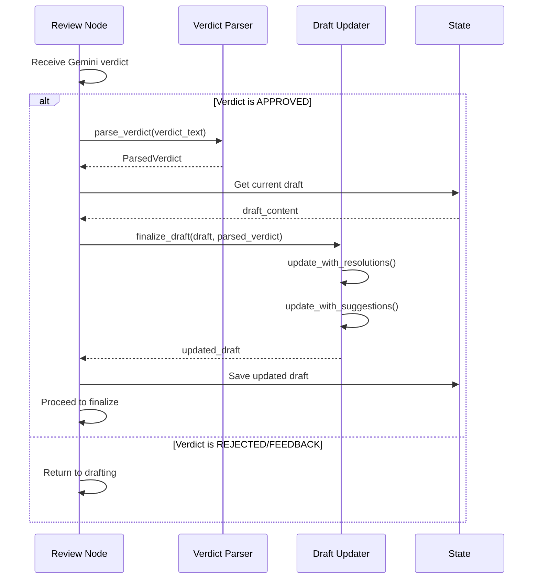

# 1257 - Feature: Review Node Should Update Draft with Resolved Open Questions

<!-- Template Metadata
Last Updated: 2025-01-09
Updated By: Issue #257 LLD creation
Update Reason: Initial LLD for fixing review node to merge resolved questions back into draft
-->

## 1. Context & Goal
* **Issue:** #257
* **Objective:** Update the review node to merge resolved open questions and suggestions from approved verdicts back into the draft LLD
* **Status:** Draft
* **Related Issues:** #180 (example case where this failed)

### Open Questions
*Questions that need clarification before or during implementation. Remove when resolved.*

- [ ] Should Tier 2 suggestions also be incorporated, or only Tier 3?
- [ ] Should suggestions be appended as a new section or merged into relevant existing sections?
- [ ] What happens if the verdict format is malformed or can't be parsed?

## 2. Proposed Changes

*This section is the **source of truth** for implementation. Describe exactly what will be built.*

### 2.1 Files Changed

| File | Change Type | Description |
|------|-------------|-------------|
| `agentos/workflows/requirements/nodes/review.py` | Modify | Add draft update logic after verdict approval |
| `agentos/workflows/requirements/utils/verdict_parser.py` | Add | New utility to parse resolutions and suggestions from verdict |
| `agentos/workflows/requirements/utils/draft_updater.py` | Add | New utility to update draft with parsed verdict content |
| `tests/unit/test_verdict_parser.py` | Add | Unit tests for verdict parsing |
| `tests/unit/test_draft_updater.py` | Add | Unit tests for draft updating |

### 2.2 Dependencies

*New packages, APIs, or services required.*

```toml
# No new dependencies required - using existing re module for parsing
```

### 2.3 Data Structures

```python
# Pseudocode - NOT implementation
class ResolvedQuestion(TypedDict):
    original_text: str        # The original question text
    resolution: str           # How it was resolved
    resolved_by: str          # "Gemini" or other reviewer

class VerdictSuggestion(TypedDict):
    tier: int                 # 2 or 3
    category: str             # Section where suggestion applies
    content: str              # The suggestion text

class ParsedVerdict(TypedDict):
    verdict: Literal["APPROVED", "REJECTED", "FEEDBACK"]
    resolutions: list[ResolvedQuestion]
    suggestions: list[VerdictSuggestion]
```

### 2.4 Function Signatures

```python
# verdict_parser.py
def parse_verdict(verdict_text: str) -> ParsedVerdict:
    """Extract structured data from Gemini verdict text."""
    ...

def extract_resolutions(verdict_text: str) -> list[ResolvedQuestion]:
    """Parse the Open Questions: RESOLVED section."""
    ...

def extract_suggestions(verdict_text: str) -> list[VerdictSuggestion]:
    """Parse Tier 2/3 suggestions from verdict."""
    ...

# draft_updater.py
def update_draft_with_resolutions(
    draft: str, 
    resolutions: list[ResolvedQuestion]
) -> str:
    """Mark open questions as resolved in draft."""
    ...

def update_draft_with_suggestions(
    draft: str,
    suggestions: list[VerdictSuggestion]
) -> str:
    """Append suggestions to draft as new section or merge into existing."""
    ...

def finalize_draft(
    draft: str,
    parsed_verdict: ParsedVerdict
) -> str:
    """Apply all updates and return final LLD content."""
    ...

# review.py additions
async def apply_approved_verdict_to_draft(
    state: RequirementsState,
    verdict: str
) -> str:
    """Main entry point: update draft with approved verdict content."""
    ...
```

### 2.5 Logic Flow (Pseudocode)

```
1. Review node receives verdict from Gemini
2. IF verdict is APPROVED THEN
   a. Parse verdict text to extract:
      - Resolved questions (from "Open Questions: RESOLVED" section)
      - Tier 3 suggestions (from suggestions section)
   b. Update draft:
      - Find each `- [ ]` question that matches a resolution
      - Change to `- [x] ~~{question}~~ RESOLVED: {resolution}`
      - Append "Reviewer Suggestions" section with Tier 3 items
   c. Save updated draft to state
   d. Proceed to finalize node
3. ELSE (REJECTED or FEEDBACK)
   - Keep draft unchanged
   - Return to drafting node
4. Return updated state
```

### 2.6 Technical Approach

* **Module:** `agentos/workflows/requirements/`
* **Pattern:** Parser + Transformer pattern (separate parsing from mutation)
* **Key Decisions:** 
  - Use regex-based parsing for verdicts (structured text format)
  - Keep original question text visible with strikethrough for audit trail
  - Append suggestions as new section rather than inline (cleaner, less risky)

### 2.7 Architecture Decisions

| Decision | Options Considered | Choice | Rationale |
|----------|-------------------|--------|-----------|
| Parsing approach | Regex, LLM re-parse, structured output | Regex | Verdicts follow predictable format; LLM adds cost/latency |
| Resolution display | Replace question, strikethrough, hide | Strikethrough + annotation | Maintains audit trail while showing resolution |
| Suggestion placement | Inline merge, new section, separate doc | New section | Less risky, clear provenance, easier to review |
| Parser location | Inline in review.py, separate util | Separate util | Reusable, testable, follows existing patterns |

**Architectural Constraints:**
- Must work with existing verdict format from Gemini review prompts
- Must not break backward compatibility with finalize node
- Must preserve original draft content for audit purposes

## 3. Requirements

*What must be true when this is done. These become acceptance criteria.*

1. Resolved questions are extracted from approved verdicts
2. Draft `- [ ]` items are changed to `- [x]` with strikethrough and RESOLVED annotation
3. Tier 3 suggestions are appended to draft as "Reviewer Suggestions" section
4. Final LLD is self-contained (no need to reference separate verdict)
5. Mechanical validation passes (no unchecked open questions after approval)
6. Parser handles malformed verdicts gracefully (logs warning, continues)

## 4. Alternatives Considered

| Option | Pros | Cons | Decision |
|--------|------|------|----------|
| Regex parsing of verdict | Fast, no API cost, deterministic | Brittle if format changes | **Selected** |
| LLM re-parse verdict | Flexible, handles variations | Adds latency and cost | Rejected |
| Modify validation to check verdict too | Quick fix | Doesn't solve core issue, LLD incomplete | Rejected |
| Store verdict alongside draft | Preserves original | Two files to manage, not self-contained | Rejected |

**Rationale:** Regex parsing is sufficient because verdicts follow a documented, predictable format from the review prompts. The audit trail requirement (strikethrough) favors keeping text visible rather than replacing it.

## 5. Data & Fixtures

### 5.1 Data Sources

| Attribute | Value |
|-----------|-------|
| Source | Verdict text from Gemini review node output |
| Format | Structured markdown text with headers |
| Size | 1-5KB typically |
| Refresh | Per review cycle |
| Copyright/License | N/A (generated content) |

### 5.2 Data Pipeline

```
Gemini Verdict ──parse──► ParsedVerdict ──transform──► Updated Draft ──save──► State
```

### 5.3 Test Fixtures

| Fixture | Source | Notes |
|---------|--------|-------|
| Sample approved verdict | Issue #180 actual output | Real-world example |
| Verdict with multiple resolutions | Generated | Edge case coverage |
| Verdict with no suggestions | Generated | Boundary case |
| Malformed verdict | Generated | Error handling |

### 5.4 Deployment Pipeline

Standard workflow deployment - no separate data pipeline needed.

## 6. Diagram

### 6.1 Mermaid Quality Gate

Before finalizing any diagram, verify in [Mermaid Live Editor](https://mermaid.live) or GitHub preview:

- [x] **Simplicity:** Similar components collapsed (per 0006 §8.1)
- [x] **No touching:** All elements have visual separation (per 0006 §8.2)
- [x] **No hidden lines:** All arrows fully visible (per 0006 §8.3)
- [x] **Readable:** Labels not truncated, flow direction clear
- [ ] **Auto-inspected:** Agent rendered via mermaid.ink and viewed (per 0006 §8.5)

**Auto-Inspection Results:**
```
- Touching elements: [ ] None / [ ] Found: ___
- Hidden lines: [ ] None / [ ] Found: ___
- Label readability: [ ] Pass / [ ] Issue: ___
- Flow clarity: [ ] Clear / [ ] Issue: ___
```

*Reference: [0006-mermaid-diagrams.md](0006-mermaid-diagrams.md)*

### 6.2 Diagram



## 7. Security & Safety Considerations

### 7.1 Security

| Concern | Mitigation | Status |
|---------|------------|--------|
| Injection via verdict text | Verdict comes from trusted Gemini source, no execution | Addressed |
| Path traversal in file save | Use existing state management, no raw paths | Addressed |

### 7.2 Safety

| Concern | Mitigation | Status |
|---------|------------|--------|
| Data loss if parser fails | Preserve original draft, only append/transform | Addressed |
| Malformed verdict breaks workflow | Graceful fallback - log warning, keep original draft | Addressed |
| Partial update on error | Atomic update - build full new draft before saving | Addressed |

**Fail Mode:** Fail Safe - On any error, preserve original draft and log warning

**Recovery Strategy:** If update fails, workflow continues with original draft; human can manually apply changes

## 8. Performance & Cost Considerations

### 8.1 Performance

| Metric | Budget | Approach |
|--------|--------|----------|
| Parse time | < 10ms | Simple regex, small text |
| Update time | < 50ms | String operations only |
| Memory | < 1MB | In-memory text transforms |

**Bottlenecks:** None expected - operations are simple string manipulations

### 8.2 Cost Analysis

| Resource | Unit Cost | Estimated Usage | Monthly Cost |
|----------|-----------|-----------------|--------------|
| Compute | Negligible | Per review (~seconds) | $0 |

**Cost Controls:**
- [x] No additional API calls required
- [x] No external services involved

**Worst-Case Scenario:** N/A - local computation only

## 9. Legal & Compliance

| Concern | Applies? | Mitigation |
|---------|----------|------------|
| PII/Personal Data | No | LLDs contain technical content only |
| Third-Party Licenses | No | No new dependencies |
| Terms of Service | No | Using existing Gemini integration |
| Data Retention | N/A | Follows existing workflow patterns |
| Export Controls | No | No restricted content |

**Data Classification:** Internal

**Compliance Checklist:**
- [x] No PII stored without consent
- [x] All third-party licenses compatible with project license
- [x] External API usage compliant with provider ToS
- [x] Data retention policy documented

## 10. Verification & Testing

### 10.0 Test Plan (TDD - Complete Before Implementation)

**TDD Requirement:** Tests MUST be written and failing BEFORE implementation begins.

| Test ID | Test Description | Expected Behavior | Status |
|---------|------------------|-------------------|--------|
| T010 | Parse approved verdict with resolutions | Returns ParsedVerdict with resolutions list | RED |
| T020 | Parse verdict with no resolutions | Returns empty resolutions list | RED |
| T030 | Parse verdict with Tier 3 suggestions | Returns suggestions with tier=3 | RED |
| T040 | Update draft - mark question resolved | `- [ ]` becomes `- [x] ~~...~~ RESOLVED:` | RED |
| T050 | Update draft - no matching question | Draft unchanged, warning logged | RED |
| T060 | Append suggestions section | New "Reviewer Suggestions" section added | RED |
| T070 | Finalize draft - full integration | All resolutions and suggestions applied | RED |
| T080 | Handle malformed verdict | Graceful failure, original draft preserved | RED |

**Coverage Target:** ≥95% for all new code

**TDD Checklist:**
- [ ] All tests written before implementation
- [ ] Tests currently RED (failing)
- [ ] Test IDs match scenario IDs in 10.1
- [ ] Test file created at: `tests/unit/test_verdict_parser.py`, `tests/unit/test_draft_updater.py`

### 10.1 Test Scenarios

| ID | Scenario | Type | Input | Expected Output | Pass Criteria |
|----|----------|------|-------|-----------------|---------------|
| 010 | Parse approved verdict | Auto | Verdict text with "Open Questions: RESOLVED" | ParsedVerdict object | resolutions populated |
| 020 | Parse verdict no resolutions | Auto | Verdict without resolutions section | Empty resolutions list | No error |
| 030 | Parse Tier 3 suggestions | Auto | Verdict with Tier 3 section | Suggestions with tier=3 | Correct categorization |
| 040 | Mark question resolved | Auto | Draft with `- [ ]`, matching resolution | `- [x] ~~q~~ RESOLVED: r` | Checkbox checked, strikethrough |
| 050 | No matching question | Auto | Draft, non-matching resolution | Original draft + warning | Draft unchanged |
| 060 | Append suggestions | Auto | Draft, suggestions list | Draft + new section | Section header present |
| 070 | Full integration | Auto | Complete draft + verdict | Fully updated draft | All changes applied |
| 080 | Malformed verdict | Auto | Invalid verdict format | Original draft | Graceful handling |
| 090 | Multiple resolutions | Auto | Verdict with 3 resolutions | All 3 marked resolved | Count matches |

### 10.2 Test Commands

```bash
# Run all automated tests
poetry run pytest tests/unit/test_verdict_parser.py tests/unit/test_draft_updater.py -v

# Run with coverage
poetry run pytest tests/unit/test_verdict_parser.py tests/unit/test_draft_updater.py --cov=agentos/workflows/requirements -v
```

### 10.3 Manual Tests (Only If Unavoidable)

N/A - All scenarios automated.

## 11. Risks & Mitigations

| Risk | Impact | Likelihood | Mitigation |
|------|--------|------------|------------|
| Verdict format changes | High | Low | Document expected format, version parsing |
| Regex fails on edge cases | Med | Med | Extensive test fixtures, graceful fallback |
| Question text doesn't match exactly | Med | Med | Fuzzy matching with similarity threshold |
| Existing workflows break | High | Low | Feature flag for gradual rollout |

## 12. Definition of Done

### Code
- [ ] Implementation complete and linted
- [ ] Code comments reference this LLD (#257)

### Tests
- [ ] All test scenarios pass
- [ ] Test coverage ≥95%

### Documentation
- [ ] LLD updated with any deviations
- [ ] Implementation Report (0103) completed
- [ ] Test Report (0113) completed if applicable

### Review
- [ ] Code review completed
- [ ] User approval before closing issue

---

## Appendix: Review Log

*Track all review feedback with timestamps and implementation status.*

### Review Summary

| Review | Date | Verdict | Key Issue |
|--------|------|---------|-----------|
| - | - | - | - |

**Final Status:** PENDING