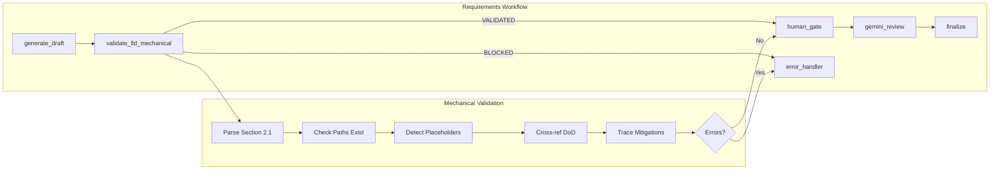

# 1277 - Feature: Add mechanical LLD validation node to catch path/consistency errors before Gemini review

<!-- Template Metadata
Last Updated: 2026-02-02
Updated By: Issue #277 implementation
Update Reason: Initial LLD creation for mechanical validation node
-->

## 1. Context & Goal
* **Issue:** #277
* **Objective:** Add a deterministic Python-based validation node to catch file path errors and section inconsistencies before LLDs reach Gemini review.
* **Status:** Draft
* **Related Issues:** #272 (LLD that exposed the gap)

### Open Questions
*Questions that need clarification before or during implementation. Remove when resolved.*

- [x] Should risk mitigation validation be blocking or warning? → **WARNING initially (non-blocking)**
- [ ] Should we validate that "Add" files don't already exist? (conflict detection)
- [ ] What's the threshold for keyword matching in risk mitigation tracing?

## 2. Proposed Changes

*This section is the **source of truth** for implementation. Describe exactly what will be built.*

### 2.1 Files Changed

| File | Change Type | Description |
|------|-------------|-------------|
| `agentos/workflows/requirements/nodes/validate_mechanical.py` | Add | New mechanical validation node |
| `agentos/workflows/requirements/nodes/__init__.py` | Modify | Export new validation node |
| `agentos/workflows/requirements/graph.py` | Modify | Insert validation node before review |
| `agentos/workflows/requirements/state.py` | Modify | Add `validation_errors` field to state |
| `docs/templates/0102-feature-lld-template.md` | Modify | Add sections 2.1.1 and 12.1 |
| `docs/templates/0702c-gemini-lld-review-prompt.md` | Modify | Clarify Gemini's role post-mechanical validation |
| `tests/unit/test_validate_mechanical.py` | Add | Unit tests for validation node |

### 2.2 Dependencies

*No new packages required. Uses only Python stdlib and existing project dependencies.*

```toml
# pyproject.toml additions (if any)
# None required
```

### 2.3 Data Structures

```python
# Pseudocode - NOT implementation
class ValidationError(TypedDict):
    section: str       # e.g., "2.1", "11", "12"
    severity: str      # "ERROR" | "WARNING"
    message: str       # Human-readable error description
    file_path: str | None  # Affected file path if applicable

class RequirementsWorkflowState(TypedDict):
    # ... existing fields ...
    validation_errors: list[ValidationError]  # New field
    lld_status: str  # "DRAFT" | "VALIDATED" | "BLOCKED" | "APPROVED"
```

### 2.4 Function Signatures

```python
# agentos/workflows/requirements/nodes/validate_mechanical.py

def validate_lld_mechanical(state: RequirementsWorkflowState) -> RequirementsWorkflowState:
    """
    Mechanical validation of LLD content. No LLM judgment.
    Fails hard on errors, warns on potential issues.
    """
    ...

def parse_files_changed_table(lld_content: str) -> list[dict[str, str]]:
    """
    Parse Section 2.1 Files Changed table.
    Returns list of {path, change_type, description}.
    """
    ...

def extract_files_from_section(lld_content: str, section_header: str) -> set[str]:
    """
    Extract file paths mentioned in a specific section.
    Uses regex to find patterns like `path/to/file.py`.
    """
    ...

def extract_mitigations_from_risks(lld_content: str) -> list[str]:
    """
    Parse Section 11 Risks & Mitigations table.
    Returns list of mitigation text strings.
    """
    ...

def extract_function_names(lld_content: str) -> list[str]:
    """
    Parse Section 2.4 Function Signatures.
    Returns list of function names.
    """
    ...

def extract_keywords(text: str) -> list[str]:
    """
    Extract meaningful keywords from mitigation text.
    Filters stopwords, returns lowercase stems.
    """
    ...

def detect_placeholder_prefixes(file_path: str, repo_root: Path) -> str | None:
    """
    Check if path uses common placeholder prefixes.
    Returns error message if prefix doesn't exist in repo.
    """
    ...
```

### 2.5 Logic Flow (Pseudocode)

```
1. Receive state with current_draft and repo_root
2. Initialize errors = [], warnings = []

3. PARSE Section 2.1 (Files Changed table)
   FOR each file entry:
     a. IF change_type is "Modify" or "Delete":
        - IF file does not exist → ERROR
     b. IF change_type is "Add":
        - IF parent directory does not exist → ERROR
     c. IF path starts with placeholder prefix (src/, lib/, app/):
        - IF prefix directory doesn't exist in repo → ERROR

4. PARSE Section 12 (Definition of Done)
   - Extract all file paths mentioned
   - Compare against Section 2.1 paths
   - IF files in DoD not in 2.1 → ERROR

5. PARSE Section 11 (Risks & Mitigations)
   - Extract mitigation text
   - PARSE Section 2.4 (Function Signatures)
   - FOR each mitigation:
     - Extract keywords
     - IF no function name contains any keyword → WARNING

6. IF errors exist:
   - Set state["validation_errors"] = errors + warnings
   - Set state["lld_status"] = "BLOCKED"
   - Set state["error"] = formatted error message
   - RETURN state (halt workflow)

7. IF only warnings exist:
   - Set state["validation_errors"] = warnings
   - Set state["lld_status"] = "VALIDATED"
   - Log warnings but continue

8. RETURN state (proceed to review)
```

### 2.6 Technical Approach

* **Module:** `agentos/workflows/requirements/nodes/`
* **Pattern:** LangGraph node (pure function with state in/out)
* **Key Decisions:** 
  - Regex-based parsing (no LLM) for determinism
  - Fail hard on path errors, soft on semantic warnings
  - Placeholder prefix detection catches common AI hallucinations

### 2.7 Architecture Decisions

| Decision | Options Considered | Choice | Rationale |
|----------|-------------------|--------|-----------|
| Validation timing | Before draft, before review, after review | Before review | Catch errors early, save Gemini tokens |
| Error handling | Soft warnings, hard blocks, mixed | Mixed | Path errors are fatal; semantic warnings are advisory |
| Parsing approach | LLM extraction, regex parsing, AST parsing | Regex parsing | Deterministic, zero cost, fast |
| State storage | Separate validation state, inline in workflow state | Inline | Simpler, matches existing pattern |

**Architectural Constraints:**
- Must integrate with existing LangGraph workflow structure
- Cannot add external dependencies
- Must complete in <5 seconds for any reasonable LLD size

## 3. Requirements

*What must be true when this is done. These become acceptance criteria.*

1. Mechanical validation runs automatically before Gemini review in the requirements workflow
2. Files marked "Modify" or "Delete" that don't exist cause BLOCKED status
3. Files marked "Add" with non-existent parent directories cause BLOCKED status
4. Placeholder prefixes (src/, lib/, app/) without matching repo directories cause BLOCKED status
5. Files in Definition of Done not listed in Files Changed cause BLOCKED status
6. Risk mitigations without apparent implementation cause WARNING (non-blocking)
7. Clear, actionable error messages identify the exact problem and location
8. LLD-272's errors would have been caught by this validation
9. Template updated with mechanical validation documentation
10. Gemini review prompt clarifies mechanical vs. semantic validation scopes

## 4. Alternatives Considered

| Option | Pros | Cons | Decision |
|--------|------|------|----------|
| Add checks to Gemini prompt | No code changes | Unreliable, costs tokens, still fails | **Rejected** |
| Human gate before review | Catches all issues | Slow, doesn't scale, human error | **Rejected** |
| Mechanical validation node | Deterministic, fast, zero cost | Requires code, limited to structural checks | **Selected** |
| Pre-commit hook | Runs locally | Doesn't work in agent context | **Rejected** |

**Rationale:** Mechanical validation provides deterministic, zero-cost checking that complements (not replaces) Gemini's semantic review. LLMs should not be trusted for tasks that simple code can perform reliably.

## 5. Data & Fixtures

### 5.1 Data Sources

| Attribute | Value |
|-----------|-------|
| Source | LLD markdown content (string in workflow state) |
| Format | Markdown following 0102 template structure |
| Size | ~5-50KB per LLD |
| Refresh | Per workflow invocation |
| Copyright/License | N/A - internal project documents |

### 5.2 Data Pipeline

```
Workflow State ──parse_lld──► Extracted Sections ──validate──► Errors/Warnings ──merge──► Updated State
```

### 5.3 Test Fixtures

| Fixture | Source | Notes |
|---------|--------|-------|
| Valid LLD content | Generated | Clean markdown matching template |
| LLD with missing file paths | Generated | Files marked Modify that don't exist |
| LLD with placeholder prefixes | Generated | Uses src/ when repo has agentos/ |
| LLD with DoD mismatch | Generated | Files in Section 12 not in Section 2.1 |
| LLD with untraced mitigations | Generated | Risk mitigations without matching functions |
| Temporary test repo | Generated | Empty directories for path testing |

### 5.4 Deployment Pipeline

Standard CI/CD - no special data deployment needed.

## 6. Diagram

### 6.1 Mermaid Quality Gate

Before finalizing any diagram, verify in [Mermaid Live Editor](https://mermaid.live) or GitHub preview:

- [x] **Simplicity:** Similar components collapsed (per 0006 §8.1)
- [x] **No touching:** All elements have visual separation (per 0006 §8.2)
- [x] **No hidden lines:** All arrows fully visible (per 0006 §8.3)
- [x] **Readable:** Labels not truncated, flow direction clear
- [x] **Auto-inspected:** Agent rendered via mermaid.ink and viewed (per 0006 §8.5)

**Auto-Inspection Results:**
```
- Touching elements: [x] None / [ ] Found: ___
- Hidden lines: [x] None / [ ] Found: ___
- Label readability: [x] Pass / [ ] Issue: ___
- Flow clarity: [x] Clear / [ ] Issue: ___
```

### 6.2 Diagram



## 7. Security & Safety Considerations

### 7.1 Security

| Concern | Mitigation | Status |
|---------|------------|--------|
| Path traversal in validation | Validate paths are within repo_root | Addressed |
| Regex DoS | Use non-backtracking patterns, timeout | Addressed |
| State injection | Validation only reads, doesn't execute | Addressed |

### 7.2 Safety

| Concern | Mitigation | Status |
|---------|------------|--------|
| False positive blocks valid LLD | Warnings for semantic checks, errors only for deterministic issues | Addressed |
| Validation takes too long | Timeout after 5 seconds, proceed with warning | Addressed |
| Missing repo_root breaks validation | Graceful fallback, skip path checks with warning | Addressed |

**Fail Mode:** Fail Open - If validation itself fails, log error and proceed to review with warning. Better to have Gemini review an unchecked LLD than block all progress.

**Recovery Strategy:** If validation is incorrectly blocking valid LLDs, add patterns to allowlist in config.

## 8. Performance & Cost Considerations

### 8.1 Performance

| Metric | Budget | Approach |
|--------|--------|----------|
| Latency | < 1 second | Pure Python, no I/O except file existence checks |
| Memory | < 50MB | Stream parsing, no full doc in memory twice |
| API Calls | 0 | No LLM calls - purely mechanical |

**Bottlenecks:** Large LLDs with many file paths could slow down if each requires disk I/O. Mitigated by caching `Path.exists()` results.

### 8.2 Cost Analysis

| Resource | Unit Cost | Estimated Usage | Monthly Cost |
|----------|-----------|-----------------|--------------|
| Compute | $0 | Local execution | $0 |
| LLM API | $0 | No LLM calls | $0 |

**Cost Controls:**
- [x] No external API calls
- [x] No cloud resources required
- [x] Validation is effectively free

**Worst-Case Scenario:** Even with 1000x LLD volume, cost remains $0 since all validation is local.

## 9. Legal & Compliance

| Concern | Applies? | Mitigation |
|---------|----------|------------|
| PII/Personal Data | No | Only processes markdown templates, no user data |
| Third-Party Licenses | No | Uses only stdlib |
| Terms of Service | No | No external services |
| Data Retention | No | Stateless validation |
| Export Controls | No | No restricted algorithms |

**Data Classification:** Internal

**Compliance Checklist:**
- [x] No PII stored without consent - N/A
- [x] All third-party licenses compatible - stdlib only
- [x] External API usage compliant - no external APIs
- [x] Data retention policy documented - stateless

## 10. Verification & Testing

### 10.0 Test Plan (TDD - Complete Before Implementation)

**TDD Requirement:** Tests MUST be written and failing BEFORE implementation begins.

| Test ID | Test Description | Expected Behavior | Status |
|---------|------------------|-------------------|--------|
| T010 | Test valid LLD passes validation | Returns VALIDATED status, no errors | RED |
| T020 | Test missing Modify file detected | Returns BLOCKED with path error | RED |
| T030 | Test missing Delete file detected | Returns BLOCKED with path error | RED |
| T040 | Test missing parent for Add file | Returns BLOCKED with parent error | RED |
| T050 | Test placeholder prefix detection | Returns BLOCKED when src/ doesn't exist | RED |
| T060 | Test DoD/Files Changed mismatch | Returns BLOCKED with cross-ref error | RED |
| T070 | Test risk mitigation warning | Returns VALIDATED with warning | RED |
| T080 | Test multiple errors collected | All errors in validation_errors list | RED |
| T090 | Test malformed table handling | Graceful failure, continues validation | RED |
| T100 | Test empty LLD handling | Returns with clear error message | RED |

**Coverage Target:** ≥95% for all new code

**TDD Checklist:**
- [ ] All tests written before implementation
- [ ] Tests currently RED (failing)
- [ ] Test IDs match scenario IDs in 10.1
- [ ] Test file created at: `tests/unit/test_validate_mechanical.py`

### 10.1 Test Scenarios

| ID | Scenario | Type | Input | Expected Output | Pass Criteria |
|----|----------|------|-------|-----------------|---------------|
| 010 | Valid LLD with all paths existing | Auto | LLD with real paths | status=VALIDATED, errors=[] | No errors raised |
| 020 | Modify file doesn't exist | Auto | LLD with nonexistent Modify path | status=BLOCKED, error contains path | Specific path in error |
| 030 | Delete file doesn't exist | Auto | LLD with nonexistent Delete path | status=BLOCKED, error contains path | Specific path in error |
| 040 | Add file parent missing | Auto | LLD with Add to nonexistent dir | status=BLOCKED, error mentions parent | Parent dir in error |
| 050 | Placeholder src/ prefix used | Auto | LLD with src/ when repo has agentos/ | status=BLOCKED, mentions placeholder | src/ mentioned in error |
| 060 | File in DoD but not in 2.1 | Auto | LLD with mismatched sections | status=BLOCKED, cross-ref error | Missing file named |
| 070 | Mitigation without function | Auto | LLD with untraced mitigation | status=VALIDATED, warnings non-empty | Warning logged |
| 080 | Multiple validation errors | Auto | LLD with 3 different issues | validation_errors has 3 entries | All errors captured |
| 090 | Malformed table in 2.1 | Auto | LLD with broken markdown table | Graceful handling, continue | No crash, warning logged |
| 100 | Empty/missing content | Auto | Empty string for LLD | Clear error message | Descriptive error |

### 10.2 Test Commands

```bash
# Run all automated tests
poetry run pytest tests/unit/test_validate_mechanical.py -v

# Run with coverage
poetry run pytest tests/unit/test_validate_mechanical.py -v --cov=agentos/workflows/requirements/nodes/validate_mechanical

# Run only fast/mocked tests (exclude live)
poetry run pytest tests/unit/test_validate_mechanical.py -v -m "not live"
```

### 10.3 Manual Tests (Only If Unavoidable)

**N/A - All scenarios automated.**

## 11. Risks & Mitigations

| Risk | Impact | Likelihood | Mitigation |
|------|--------|------------|------------|
| Regex fails on edge case markdown | Med | Med | Comprehensive test fixtures, fallback to warning |
| False positives block valid LLDs | High | Low | Conservative blocking (only deterministic errors) |
| Performance degrades with large LLDs | Low | Low | Timeout protection, path caching |
| Template changes break parsing | Med | Med | Version detection, graceful degradation |
| Developers bypass validation | Med | Low | Integrate into CI, make it the only path |

## 12. Definition of Done

### Code
- [ ] `validate_mechanical.py` implements all validation functions
- [ ] Graph updated to include validation node before review
- [ ] State schema includes `validation_errors` field
- [ ] Code comments reference this LLD (#277)

### Tests
- [ ] All 10 test scenarios pass
- [ ] Test coverage ≥95%
- [ ] LLD-272's errors caught in regression test

### Documentation
- [ ] Template section 2.1.1 documents path validation
- [ ] Template section 12.1 documents traceability checks
- [ ] Review prompt 0702c updated for scope clarity
- [ ] Implementation Report (0103) completed

### Review
- [ ] Code review completed
- [ ] User approval before closing issue

---

## Appendix: Review Log

*Track all review feedback with timestamps and implementation status.*

### Review Summary

| Review | Date | Verdict | Key Issue |
|--------|------|---------|-----------|
| - | - | - | Awaiting first review |

**Final Status:** PENDING