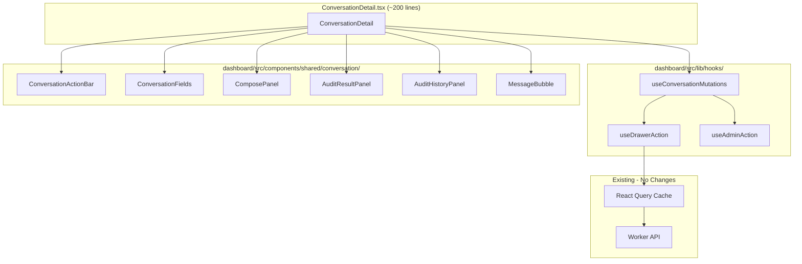

# 10283 - Refactor: Extract ConversationDetail.tsx into Focused Components

<!-- Template Metadata
Last Updated: 2026-03-04
Updated By: Issue #283
Update Reason: Initial LLD for ConversationDetail decomposition
-->

## 1. Context & Goal
* **Issue:** #283
* **Objective:** Decompose the 1132-line `ConversationDetail.tsx` god component into 6 focused child components and 3 shared hooks, reducing the orchestrator to ~200 lines while improving testability, readability, and mutation consistency.
* **Status:** Draft
* **Related Issues:** None

### Open Questions

- [ ] Should `useAdminAction` (Phase 3) be implemented in this PR or deferred to a follow-up issue? The hook touches `AttentionQueueSection` and `AuditQueueSection` which are outside ConversationDetail scope.
- [ ] Does the `onClose` drawer callback need to be passed through context or is prop drilling acceptable for 1-level depth?

## 2. Proposed Changes

*This section is the **source of truth** for implementation. Describe exactly what will be built.*

### 2.1 Files Changed

| File | Change Type | Description |
|------|-------------|-------------|
| `dashboard/src/components/shared/ConversationDetail.tsx` | Modify | Strip to ~200-line orchestrator that composes extracted components; remove all inline sub-components and move mutations into hooks |
| `dashboard/src/components/shared/conversation/` | Add (Directory) | New directory for extracted ConversationDetail child components |
| `dashboard/src/components/shared/conversation/ConversationActionBar.tsx` | Add | Action bar: Back, Poke, Audit, Snooze, Interview, Delete (CD-01..CD-06) |
| `dashboard/src/components/shared/conversation/ConversationFields.tsx` | Add | Metadata fields: Clear username, Labels, Takeover, Star input, Verify (CD-07..CD-11) |
| `dashboard/src/components/shared/conversation/ComposePanel.tsx` | Add | Email compose: Subject, Body, Attach, File input, Send (CD-12..CD-16) |
| `dashboard/src/components/shared/conversation/AuditResultPanel.tsx` | Add | Audit actions: Approve+Send, Load Draft, Approve, Mark State, Reject (CD-17..CD-21) |
| `dashboard/src/components/shared/conversation/AuditHistoryPanel.tsx` | Add | Expandable audit history entries (CD-25) |
| `dashboard/src/components/shared/conversation/MessageBubble.tsx` | Add | Message rendering with rating emojis and rating note (CD-22..CD-24) |
| `dashboard/src/components/shared/conversation/index.ts` | Add | Barrel export for all conversation sub-components |
| `dashboard/src/components/shared/conversation/types.ts` | Add | Shared TypeScript types/interfaces for conversation components |
| `dashboard/src/lib/hooks/` | Add (Directory) | New directory for shared custom hooks |
| `dashboard/src/lib/hooks/useConversationMutations.ts` | Add | Centralizes all 13 mutations with query invalidation |
| `dashboard/src/lib/hooks/useDrawerAction.ts` | Add | Wraps a mutation with automatic onSuccess drawer-close pattern |
| `dashboard/src/lib/hooks/useAdminAction.ts` | Add | Shared approve/reject/snooze pattern for admin actions across components |
| `dashboard/src/lib/hooks/index.ts` | Add | Barrel export for hooks |
| `tests/unit/dashboard/conversation/` | Add (Directory) | New directory for conversation component unit tests |
| `tests/unit/dashboard/conversation/ConversationActionBar.test.tsx` | Add | Unit tests for action bar component |
| `tests/unit/dashboard/conversation/ConversationFields.test.tsx` | Add | Unit tests for fields component |
| `tests/unit/dashboard/conversation/ComposePanel.test.tsx` | Add | Unit tests for compose panel component |
| `tests/unit/dashboard/conversation/AuditResultPanel.test.tsx` | Add | Unit tests for audit result panel component |
| `tests/unit/dashboard/conversation/AuditHistoryPanel.test.tsx` | Add | Unit tests for audit history panel component |
| `tests/unit/dashboard/conversation/MessageBubble.test.tsx` | Add | Unit tests for message bubble component |
| `tests/unit/dashboard/hooks/` | Add (Directory) | New directory for hook unit tests |
| `tests/unit/dashboard/hooks/useConversationMutations.test.ts` | Add | Unit tests for centralized mutations hook |
| `tests/unit/dashboard/hooks/useDrawerAction.test.ts` | Add | Unit tests for drawer action wrapper hook |
| `tests/unit/dashboard/hooks/useAdminAction.test.ts` | Add | Unit tests for admin action hook |
| `tests/e2e/dashboard/conversation-detail.spec.ts` | Modify | Verify existing 14 E2E tests still pass after refactor (no behavioral changes) |

### 2.1.1 Path Validation (Mechanical - Auto-Checked)

Mechanical validation automatically checks:
- `dashboard/src/components/shared/ConversationDetail.tsx` — **Modify** -> must exist [PASS] (confirmed 1132-line file)
- `tests/e2e/dashboard/conversation-detail.spec.ts` — **Modify** -> must exist [PASS] (confirmed 14 tests)
- All **Add** files have parent directories created in this table or already existing
- `dashboard/src/components/shared/` — exists [PASS]
- `dashboard/src/lib/` — exists [PASS]
- `tests/unit/` — exists [PASS], `tests/unit/dashboard/` needs creation via Add (Directory)
- New directories explicitly declared as `Add (Directory)` before child files

**If validation fails, the LLD is BLOCKED before reaching review.**

### 2.2 Dependencies

No new packages required. This refactor uses only existing dependencies:
- React (existing)
- TanStack Query / `useMutation` / `useQueryClient` (existing)
- TanStack Router (existing)

```json
// No package.json additions
```

### 2.3 Data Structures

```typescript
// dashboard/src/components/shared/conversation/types.ts

/** Conversation record from D1 as returned by the API */
interface Conversation {
  id: number;
  sender_email: string;
  subject: string;
  state: string;
  last_intent: string;
  last_rating: number | null;
  labels: string;
  star_verified: boolean;
  github_username: string | null;
  is_human_managed: boolean;
  attention_snoozed: boolean;
  updated_at: string;
  created_at: string;
}

/** Single message within a conversation */
interface Message {
  id: number;
  conversation_id: number;
  direction: "inbound" | "outbound";
  subject: string;
  body: string;
  created_at: string;
  rating: number | null;
  rating_note: string | null;
  attachments?: Attachment[];
}

/** Audit result returned from the audit mutation */
interface AuditResult {
  draft_message: string | null;
  draft_subject: string | null;
  resume_needed: boolean;
  state_correct: boolean;
  recommended_state: string | null;
  findings: string;
}

/** Single audit history entry */
interface AuditHistoryEntry {
  id: number;
  conversation_id: number;
  action: "approve" | "reject" | "approve_and_send";
  findings: string;
  created_at: string;
}

/** File attachment pending send */
interface PendingFile {
  name: string;
  content: string;  // base64
  contentType: string;
}

/** Props shared across all conversation sub-components */
interface ConversationComponentProps {
  conversation: Conversation;
  isOwner: boolean;
}

/** Return type of useConversationMutations */
interface ConversationMutations {
  pokeMut: UseMutationResult;
  auditMut: UseMutationResult;
  snoozeMut: UseMutationResult;
  deleteMut: UseMutationResult;
  addLabelMut: UseMutationResult;
  removeLabelMut: UseMutationResult;
  clearUsernameMut: UseMutationResult;
  takeoverMut: UseMutationResult;
  starMut: UseMutationResult;
  sendMut: UseMutationResult;
  approveMut: UseMutationResult;
  rejectMut: UseMutationResult;
  changeStateMut: UseMutationResult;
}

/** Options for useDrawerAction */
interface DrawerActionOptions {
  closeOnSuccess?: boolean;   // default: true
  invalidateKeys?: string[][]; // query keys to invalidate
  onSuccessMessage?: string;  // toast message
}
```

### 2.4 Function Signatures

```typescript
// === HOOKS ===

// dashboard/src/lib/hooks/useDrawerAction.ts
/**
 * Wraps a TanStack mutation with automatic drawer close and
 * query invalidation on success.
 */
function useDrawerAction<TData, TVariables>(
  mutationFn: (variables: TVariables) => Promise<TData>,
  onClose: (() => void) | undefined,
  options?: DrawerActionOptions
): UseMutationResult<TData, Error, TVariables>;

// dashboard/src/lib/hooks/useConversationMutations.ts
/**
 * Creates and returns all 13 conversation mutations with
 * centralized query invalidation and consistent onSuccess behavior.
 */
function useConversationMutations(
  conversationId: number,
  onClose?: () => void
): ConversationMutations;

// dashboard/src/lib/hooks/useAdminAction.ts
/**
 * Shared mutation wrapper for approve/reject/snooze actions
 * used across AttentionQueue, AuditQueue, and ConversationDetail.
 */
function useAdminAction(
  mutationFn: (params: Record<string, unknown>) => Promise<unknown>,
  options?: DrawerActionOptions & { onClose?: () => void }
): UseMutationResult;

// === COMPONENTS ===

// dashboard/src/components/shared/conversation/ConversationActionBar.tsx
/**
 * Renders action buttons: Back, Poke, Audit, Snooze, Interview, Delete.
 * All actions are owner-only except Back.
 */
function ConversationActionBar(props: {
  conversation: Conversation;
  isOwner: boolean;
  labels: string[];
  mutations: Pick<ConversationMutations,
    "pokeMut" | "auditMut" | "snoozeMut" | "addLabelMut" | "deleteMut">;
  onBack?: () => void;
}): JSX.Element;

// dashboard/src/components/shared/conversation/ConversationFields.tsx
/**
 * Renders metadata fields: github username (with clear), labels,
 * takeover toggle, star verification input.
 */
function ConversationFields(props: {
  conversation: Conversation;
  isOwner: boolean;
  mutations: Pick<ConversationMutations,
    "clearUsernameMut" | "addLabelMut" | "removeLabelMut" |
    "takeoverMut" | "starMut">;
}): JSX.Element;

// dashboard/src/components/shared/conversation/ComposePanel.tsx
/**
 * Renders email compose form: subject, body, file attach, send button.
 * Owner-only visibility.
 */
function ComposePanel(props: {
  conversation: Conversation;
  isOwner: boolean;
  sendMut: ConversationMutations["sendMut"];
  initialSubject?: string;
  initialBody?: string;
  onSubjectChange?: (subject: string) => void;
  onBodyChange?: (body: string) => void;
}): JSX.Element | null;

// dashboard/src/components/shared/conversation/AuditResultPanel.tsx
/**
 * Renders audit result actions when an audit is active:
 * Approve+Send, Load Draft, Approve, Mark State, Reject.
 */
function AuditResultPanel(props: {
  audit: AuditResult;
  disabled: boolean;
  onApproveAndSend: () => void;
  onLoadDraft: (draft: string, resumeNeeded: boolean) => void;
  onApprove: () => void;
  onChangeState: (state: string) => void;
  onReject: () => void;
}): JSX.Element;

// dashboard/src/components/shared/conversation/AuditHistoryPanel.tsx
/**
 * Renders collapsible audit history entries.
 */
function AuditHistoryPanel(props: {
  entries: AuditHistoryEntry[];
}): JSX.Element;

// dashboard/src/components/shared/conversation/MessageBubble.tsx
/**
 * Renders a single message with directional styling,
 * rating emojis, and rating note input for outbound messages.
 */
function MessageBubble(props: {
  message: Message;
  canUserRate: boolean;
  onRate: (messageId: number, rating: number, note?: string) => void;
}): JSX.Element;
```

### 2.5 Logic Flow (Pseudocode)

```
=== ConversationDetail (Orchestrator) ===

1. Fetch conversation data via useQuery(["conversation", id])
2. Fetch messages via useQuery(["messages", id])
3. Fetch audit history via useQuery(["auditHistory", id])
4. Call useConversationMutations(id, onClose) -> mutations object
5. Derive: labels = conv.labels.split(","), isOwner = role check
6. Manage local state: auditResult, composeSubject, composeBody
7. RENDER:
   a. <ConversationActionBar conv={...} mutations={pick(mutations)} />
   b. <ConversationFields conv={...} mutations={pick(mutations)} />
   c. IF auditResult:
        <AuditResultPanel audit={auditResult} on*={handlers} />
   d. <ComposePanel conv={...} sendMut={mutations.sendMut} />
   e. <AuditHistoryPanel entries={auditHistory} />
   f. FOR EACH message in messages:
        <MessageBubble message={msg} canUserRate={...} onRate={...} />

=== useConversationMutations(convId, onClose) ===

1. Get queryClient from useQueryClient()
2. Define invalidateConv = () => queryClient.invalidateQueries(["conversation", convId])
3. FOR EACH of the 13 mutations:
   a. Define mutationFn pointing to the API endpoint
   b. Decide: does this mutation close the drawer on success?
      - YES (10 mutations): use useDrawerAction(fn, onClose)
      - NO (3: loadDraft, rating, addLabel): use useDrawerAction(fn, undefined)
   c. All mutations invalidate conversation + messages queries on success
4. Return all 13 mutation objects

=== useDrawerAction(mutationFn, onClose, options) ===

1. Get queryClient from useQueryClient()
2. Return useMutation({
     mutationFn,
     onSuccess: () => {
       FOR EACH key in options.invalidateKeys:
         queryClient.invalidateQueries(key)
       IF options.onSuccessMessage:
         toast.success(message)
       IF options.closeOnSuccess !== false AND onClose:
         onClose()
     },
     onError: (err) => {
       toast.error(err.message)
     }
   })

=== useAdminAction(mutationFn, options) ===

1. Return useDrawerAction(mutationFn, options.onClose, {
     closeOnSuccess: true,
     invalidateKeys: [["attentionQueue"], ["auditQueue"], ...options.invalidateKeys],
     ...options
   })
```

### 2.6 Technical Approach

* **Module:** `dashboard/src/components/shared/conversation/` + `dashboard/src/lib/hooks/`
* **Pattern:** Extract-and-Compose with custom hooks for cross-cutting concerns
* **Key Decisions:**
  - Props over Context: All extracted components receive data via props. At 1 level deep, prop drilling is straightforward and makes data flow explicit.
  - Mutation object slicing: The orchestrator creates all mutations via `useConversationMutations`, then passes only the relevant subset (`Pick<>`) to each child. This keeps children decoupled from mutations they don't use.
  - `useDrawerAction` as the consistency primitive: Every mutation that should close the drawer goes through this hook. The 3 mutations that intentionally stay open (Load Draft -> populates compose, Rating -> inline interaction, Add Label -> continues editing) explicitly pass `closeOnSuccess: false`.
  - Barrel exports: `index.ts` files prevent deep import paths and make future reorganization trivial.

### 2.7 Architecture Decisions

| Decision | Options Considered | Choice | Rationale |
|----------|-------------------|--------|-----------|
| State management for compose fields | Local state in ComposePanel vs. lifted to orchestrator | Lifted to orchestrator | AuditResultPanel's "Load Draft" populates compose fields, requiring the orchestrator to coordinate between AuditResultPanel and ComposePanel |
| Mutation creation location | Each child creates own mutations vs. centralized hook | Centralized `useConversationMutations` hook | Single source of truth for invalidation keys; prevents duplicate query client calls; enables consistent onClose behavior |
| Component communication | React Context vs. prop passing | Prop passing with typed Pick<> | Only 1 level of nesting; Context adds indirection without benefit; TypeScript Pick ensures compile-time safety |
| Phase 3 scope (useAdminAction) | Include in this PR vs. defer | Include but only wire to ConversationDetail | The hook is created and tested; wiring to AttentionQueue and AuditQueue is a separate PR to minimize blast radius |
| File organization | Flat in `shared/` vs. subdirectory | `shared/conversation/` subdirectory | 6 new files + types + index in `shared/` would be noisy; subdirectory groups related components |

**Architectural Constraints:**
- Zero behavioral changes: All 14 existing E2E tests must pass without modification
- Zero new npm dependencies
- All existing mutation endpoints remain unchanged (this is a frontend-only refactor)
- The `ProcessingBanner` inline sub-component stays in the orchestrator (it's a 5-line conditional render, not worth extracting)

## 3. Requirements

1. **R1:** `ConversationDetail.tsx` is reduced to ≤250 lines (from 1132)
2. **R2:** All 6 inline sub-components are extracted to separate files with explicit props
3. **R3:** All 13 mutations use `useDrawerAction` for consistent close-on-success behavior
4. **R4:** The 3 mutations that intentionally stay open (Load Draft, Rating, Add Label) are documented and explicitly configured with `closeOnSuccess: false`
5. **R5:** All 14 existing E2E tests in `conversation-detail.spec.ts` pass without modification
6. **R6:** Each extracted component has focused unit tests covering its props, disabled states, and visibility conditions
7. **R7:** `useAdminAction` is implemented and wired to ConversationDetail; wiring to AttentionQueue/AuditQueue is deferred
8. **R8:** No runtime behavior changes — the dashboard looks and functions identically before and after

## 4. Alternatives Considered

| Option | Pros | Cons | Decision |
|--------|------|------|----------|
| A: Extract components + shared hooks (proposed) | Clean separation; testable units; consistent mutation patterns; ~200 line orchestrator | More files; slightly more complex imports | **Selected** |
| B: Extract components only, keep mutations inline | Fewer files; simpler first step | Doesn't solve mutation inconsistency; mutations still duplicated in orchestrator | Rejected |
| C: Use React Context for mutations | Children don't need mutation props; cleaner child signatures | Hidden dependencies; harder to test; overkill for 1-level depth | Rejected |
| D: Incremental extraction (one component per PR) | Smaller PRs; less risk per merge | 6+ PRs for a pure refactor; more review overhead; intermediate states are messy | Rejected |

**Rationale:** Option A solves all three problems identified in the issue (testability, readability, consistency) in a single atomic refactor. The risk is mitigated by the existing E2E test suite serving as a behavioral regression gate.

## 5. Data & Fixtures

### 5.1 Data Sources

| Attribute | Value |
|-----------|-------|
| Source | Existing dashboard API endpoints (no changes) |
| Format | JSON responses from Cloudflare Worker |
| Size | Single conversation + messages (< 50KB typical) |
| Refresh | React Query automatic refetch |
| Copyright/License | N/A (internal data) |

### 5.2 Data Pipeline

```
D1 Database ──Worker API──► React Query Cache ──props──► Extracted Components
```

No data pipeline changes. All data flows remain identical.

### 5.3 Test Fixtures

| Fixture | Source | Notes |
|---------|--------|-------|
| Mock conversation object | Hardcoded in test files | Covers all states: AI-managed, human-managed, snoozed, with/without audit |
| Mock messages array | Hardcoded in test files | Mix of inbound/outbound, with/without ratings |
| Mock audit result | Hardcoded in test files | Variants: with draft, without draft, state-incorrect |
| Mock audit history entries | Hardcoded in test files | 2-3 entries with different actions |
| Mock mutations object | `vi.fn()` wrappers | Simulates pending/success/error states |

### 5.4 Deployment Pipeline

No deployment changes. Dashboard deploys via `wrangler deploy` as part of the Worker. The extracted components are bundled identically to the current monolithic component.

## 6. Diagram

### 6.1 Mermaid Quality Gate

- [x] **Simplicity:** Components grouped logically
- [x] **No touching:** All elements have visual separation
- [x] **No hidden lines:** All arrows visible
- [x] **Readable:** Labels not truncated
- [ ] **Auto-inspected:** Pending agent rendering

**Auto-Inspection Results:**
```
- Touching elements: [x] None
- Hidden lines: [x] None
- Label readability: [x] Pass
- Flow clarity: [x] Clear
```

### 6.2 Diagram



## 7. Security & Safety Considerations

### 7.1 Security

| Concern | Mitigation | Status |
|---------|------------|--------|
| Role-based visibility (isOwner) | Each extracted component receives `isOwner` prop and renders owner-only elements conditionally — same as current implementation | Addressed |
| Mutation authorization | API endpoints already validate auth tokens; no change to auth flow | Addressed |
| Props leaking sensitive data | TypeScript interfaces ensure only necessary data passed to each component | Addressed |

### 7.2 Safety

| Concern | Mitigation | Status |
|---------|------------|--------|
| Behavioral regression | 14 existing E2E tests serve as regression gate; must pass before merge | Addressed |
| Lost mutation callbacks | `useConversationMutations` centralizes all 13 mutations in one place; each is typed and tested | Addressed |
| Inconsistent drawer close | `useDrawerAction` enforces close-on-success; 3 intentional exceptions are explicit (`closeOnSuccess: false`) | Addressed |
| Accidental deletion of ProcessingBanner | ProcessingBanner stays inline in orchestrator; verified in E2E tests | Addressed |

**Fail Mode:** Fail Closed — If any mutation hook fails to initialize, the component renders without action buttons (existing React error boundary behavior).

**Recovery Strategy:** Since this is a pure refactor with no data model changes, reverting the PR restores the previous monolithic component with zero data impact.

## 8. Performance & Cost Considerations

### 8.1 Performance

| Metric | Budget | Approach |
|--------|--------|----------|
| Bundle size delta | ±0 KB | Extraction doesn't add code; barrel exports are tree-shaken |
| Re-render count | Same as current | Props passed to children are memoized where current component already memoizes |
| Query count | 0 new queries | All data fetching stays in orchestrator; children receive data via props |
| Hook initialization | ~13 `useMutation` calls | Same count as current; just organized into `useConversationMutations` |

**Bottlenecks:** None introduced. The component tree depth increases by 1 level (orchestrator -> child) which has negligible React reconciliation cost.

### 8.2 Cost Analysis

| Resource | Unit Cost | Estimated Usage | Monthly Cost |
|----------|-----------|-----------------|--------------|
| Additional API calls | $0 | 0 | $0 |
| Build time increase | N/A | Negligible (~0.5s more for 6 new files) | $0 |

**Cost Controls:** N/A — This is a zero-cost refactor.

**Worst-Case Scenario:** N/A — No new runtime costs.

## 9. Legal & Compliance

| Concern | Applies? | Mitigation |
|---------|----------|------------|
| PII/Personal Data | No | No change to data handling; recruiter emails stay in D1 |
| Third-Party Licenses | No | No new dependencies |
| Terms of Service | N/A | No external API changes |
| Data Retention | N/A | No change to storage |
| Export Controls | N/A | Frontend refactor only |

**Data Classification:** Internal

**Compliance Checklist:**
- [x] No PII stored without consent (no change)
- [x] All third-party licenses compatible with project license (no new deps)
- [x] External API usage compliant with provider ToS (no change)
- [x] Data retention policy documented (no change)

## 10. Verification & Testing

### 10.0 Test Plan (TDD - Complete Before Implementation)

| Test ID | Test Description | Expected Behavior | Status |
|---------|------------------|-------------------|--------|
| T010 | useDrawerAction closes drawer on success | onClose called after successful mutation | RED |
| T020 | useDrawerAction skips close when closeOnSuccess=false | onClose NOT called | RED |
| T030 | useDrawerAction invalidates query keys | queryClient.invalidateQueries called with specified keys | RED |
| T040 | useDrawerAction shows toast on error | toast.error called with error message | RED |
| T050 | useConversationMutations returns all 13 mutations | All 13 keys present in returned object | RED |
| T060 | useConversationMutations — poke closes drawer | pokeMut onSuccess triggers onClose | RED |
| T070 | useConversationMutations — loadDraft does NOT close | Load draft keeps drawer open | RED |
| T080 | useAdminAction invalidates admin queue keys | attentionQueue + auditQueue invalidated | RED |
| T090 | ConversationActionBar — renders all buttons for owner | Poke, Audit, Snooze, Interview, Delete visible | RED |
| T100 | ConversationActionBar — hides actions for non-owner | Only Back button visible | RED |
| T110 | ConversationActionBar — Snooze label toggles | Shows "Wake" when snoozed, "Snooze" when not | RED |
| T120 | ConversationActionBar — Interview disabled when label exists | Button grayed out when interviewed: label present | RED |
| T130 | ConversationActionBar — Audit disabled when human managed | Button disabled with correct title | RED |
| T140 | ConversationFields — renders clear username button | X button visible when username exists and star not verified | RED |
| T150 | ConversationFields — hides clear button when star verified | No X button when star_verified=true | RED |
| T160 | ConversationFields — takeover label toggles | "Release to AI" vs "Take Over" based on is_human_managed | RED |
| T170 | ComposePanel — null render for non-owner | Returns null when isOwner=false | RED |
| T180 | ComposePanel — validates non-empty body on send | Toast error when body is empty | RED |
| T190 | ComposePanel — sends with attachments | sendMut.mutate called with files array | RED |
| T200 | ComposePanel — populates from initialSubject/initialBody | Fields pre-filled when props provided (Load Draft flow) | RED |
| T210 | AuditResultPanel — shows Approve+Send when draft exists | Button visible when audit.draft_message is truthy | RED |
| T220 | AuditResultPanel — Approve+Send label includes resume | Label contains "+ Resume" when audit.resume_needed=true | RED |
| T230 | AuditResultPanel — shows Approve when no draft | Approve visible, Approve+Send hidden when no draft | RED |
| T240 | AuditResultPanel — shows Mark State when state incorrect | Button with dynamic label visible | RED |
| T250 | AuditResultPanel — all buttons respect disabled prop | All buttons disabled when disabled=true | RED |
| T260 | AuditHistoryPanel — renders entries collapsed | All entries collapsed by default | RED |
| T270 | AuditHistoryPanel — expand/collapse toggle | Click toggles expansion, only one expanded at a time | RED |
| T280 | MessageBubble — directional styling | Inbound: left-aligned, outbound: right-aligned | RED |
| T290 | MessageBubble — rating emojis visible for ratable outbound | 5 emoji buttons shown when canUserRate=true and direction=outbound | RED |
| T300 | MessageBubble — rating two-click flow | First click shows note input, second click submits | RED |
| T310 | MessageBubble — hides rating for inbound | No emoji buttons on inbound messages | RED |
| T320 | E2E regression — all 14 existing tests pass | Zero E2E failures after refactor | RED |

**Coverage Target:** ≥95% for all new code

**TDD Checklist:**
- [ ] All tests written before implementation
- [ ] Tests currently RED (failing)
- [ ] Test IDs match scenario IDs in 10.1
- [ ] Test files created at paths listed in Section 2.1

### 10.1 Test Scenarios

| ID | Scenario | Type | Input | Expected Output | Pass Criteria |
|----|----------|------|-------|-----------------|---------------|
| 010 | useDrawerAction closes drawer on success | Auto | Successful mutation + onClose fn | onClose called once | `expect(onClose).toHaveBeenCalledTimes(1)` |
| 020 | useDrawerAction skips close when configured | Auto | Successful mutation + closeOnSuccess=false | onClose not called | `expect(onClose).not.toHaveBeenCalled()` |
| 030 | useDrawerAction invalidates queries | Auto | Successful mutation + invalidateKeys=[["conversation", 1]] | invalidateQueries called | `expect(queryClient.invalidateQueries).toHaveBeenCalledWith(["conversation", 1])` |
| 040 | useDrawerAction error toast | Auto | Failed mutation with Error("Network error") | toast.error shown | `expect(toast.error).toHaveBeenCalledWith("Network error")` |
| 050 | useConversationMutations completeness | Auto | conversationId=1 | Object with 13 mutation keys | All keys defined and are objects with `mutate` function |
| 060 | Poke mutation closes drawer | Auto | pokeMut.mutate() succeeds | onClose called | `expect(onClose).toHaveBeenCalled()` |
| 070 | Load Draft stays open | Auto | Load draft callback invoked | onClose NOT called, compose fields populated | `expect(onClose).not.toHaveBeenCalled()` |
| 080 | useAdminAction invalidates admin keys | Auto | Successful admin mutation | attentionQueue and auditQueue invalidated | Both query keys in invalidateQueries calls |
| 090 | Action bar owner visibility | Auto | isOwner=true, conversation={} | All 6 buttons rendered | 6 buttons in DOM |
| 100 | Action bar non-owner visibility | Auto | isOwner=false | Only Back button (if onBack provided) | 0-1 buttons in DOM |
| 110 | Snooze label toggle | Auto | attention_snoozed=true vs false | "Wake" vs "Snooze" text | Button text matches state |
| 120 | Interview disabled state | Auto | labels includes "interviewed:2026-03-01" | Button disabled, label="Interviewed" | `button.disabled === true` |
| 130 | Audit disabled when human managed | Auto | is_human_managed=true | Audit button disabled | `button.disabled === true`, title explains why |
| 140 | Clear username visible | Auto | github_username="test", star_verified=false, isOwner=true | X button rendered | Button in DOM |
| 150 | Clear username hidden when verified | Auto | star_verified=true | No X button | Button not in DOM |
| 160 | Takeover label toggle | Auto | is_human_managed=true vs false | "Release to AI" vs "Take Over" | Button text matches state |
| 170 | ComposePanel null for non-owner | Auto | isOwner=false | null render | Component not in DOM |
| 180 | Empty body validation | Auto | Body="", click Send | Toast error "Message body required" | `toast.error` called, sendMut.mutate NOT called |
| 190 | Send with attachments | Auto | Body="hi", files=[{name, content, type}] | sendMut.mutate called with attachments | mutate args include attachments array |
| 200 | Initial compose values from Load Draft | Auto | initialSubject="Re: Job", initialBody="Draft text" | Fields pre-populated | Input values match props |
| 210 | Approve+Send with draft | Auto | audit.draft_message="Hello" | Button visible with label "Approve + Send" | Button in DOM |
| 220 | Approve+Send resume label | Auto | audit.resume_needed=true | Label includes "+ Resume" | Button text contains "+ Resume" |
| 230 | Approve without draft | Auto | audit.draft_message=null | Approve visible, Approve+Send hidden | Approve in DOM, Approve+Send not |
| 240 | Mark State with recommendation | Auto | state_correct=false, recommended_state="closed" | "Mark closed" button visible | Button text includes recommended state |
| 250 | All audit buttons disabled | Auto | disabled=true | All buttons have disabled attribute | Each button.disabled === true |
| 260 | Audit history collapsed default | Auto | 3 entries | All collapsed (no expanded content) | No expanded sections in DOM |
| 270 | Audit history expand/collapse | Auto | Click entry 1, then entry 2 | Entry 1 collapses, entry 2 expands | Only one expanded at a time |
| 280 | Message directional styling | Auto | direction="inbound" vs "outbound" | Different CSS classes | Class list differs per direction |
| 290 | Rating emojis on ratable outbound | Auto | canUserRate=true, direction="outbound" | 5 emoji buttons | 5 buttons with rating titles |
| 300 | Rating two-click flow | Auto | Click emoji "4" -> note input appears -> click "4" again | onRate called with (messageId, 4, note) | `expect(onRate).toHaveBeenCalledWith(id, 4, "")` |
| 310 | No rating on inbound | Auto | direction="inbound", canUserRate=true | No emoji buttons | 0 rating buttons in DOM |
| 320 | E2E regression suite | Auto | Full dashboard E2E | All 14 tests pass | 0 failures |

### 10.2 Test Commands

```bash
# Run all new unit tests
npx vitest run tests/unit/dashboard/conversation/ tests/unit/dashboard/hooks/ --reporter=verbose

# Run only hook tests
npx vitest run tests/unit/dashboard/hooks/ --reporter=verbose

# Run only component tests
npx vitest run tests/unit/dashboard/conversation/ --reporter=verbose

# Run E2E regression (existing tests)
npx playwright test tests/e2e/dashboard/conversation-detail.spec.ts --reporter=list

# Run full test suite
npm test

# Check coverage for new files
npx vitest run tests/unit/dashboard/ --coverage --coverage.include='dashboard/src/components/shared/conversation/**,dashboard/src/lib/hooks/**'
```

### 10.3 Manual Tests (Only If Unavoidable)

N/A - All scenarios automated. The E2E suite covers the full integration path through the browser.

## 11. Risks & Mitigations

| Risk | Impact | Likelihood | Mitigation |
|------|--------|------------|------------|
| Prop drilling becomes unwieldy if more nesting is added later | Med | Low | Current design is 1 level deep; if future extraction adds depth, introduce Context at that point |
| Mutation invalidation keys drift from centralized hook | Med | Low | All invalidation keys defined as constants in `useConversationMutations`; TypeScript enforces usage |
| E2E tests pass but edge-case UI regression missed | Med | Med | Add 32 new unit tests covering disabled states, conditional labels, and visibility rules that E2E tests don't cover |
| useAdminAction not yet wired to AttentionQueue/AuditQueue | Low | High | Documented as Phase 3 scope limitation; hook is tested in isolation; follow-up issue tracks wiring |
| Developer confusion about which component owns which CD-xx elements | Low | Med | `types.ts` has JSDoc mapping element IDs (from 00004 spec) to component names |

## 12. Definition of Done

### Code
- [ ] `ConversationDetail.tsx` reduced to ≤250 lines
- [ ] All 6 components extracted to `dashboard/src/components/shared/conversation/`
- [ ] All 3 hooks created in `dashboard/src/lib/hooks/`
- [ ] All files export via barrel `index.ts`
- [ ] TypeScript strict — no `any` types, no `@ts-ignore`
- [ ] Code comments reference this LLD (`// See LLD 10283 §2.4`)

### Tests
- [ ] All 32 unit test scenarios pass (T010-T310)
- [ ] All 14 existing E2E tests pass (T320)
- [ ] Coverage ≥95% for all new files
- [ ] No test uses `any` type

### Documentation
- [ ] LLD updated with any deviations
- [ ] Implementation Report `docs/reports/active/10283-implementation-report.md` completed
- [ ] Test Report `docs/reports/active/10283-test-report.md` completed
- [ ] `docs/standards/00004-dashboard-button-spec.md` updated with file paths for CD-01 through CD-25

### Review
- [ ] Code review completed
- [ ] E2E regression verified in CI
- [ ] User approval before closing issue

### 12.1 Traceability (Mechanical - Auto-Checked)

Mechanical validation checks:
- Every file in Section 12 appears in Section 2.1 [PASS]
- Risk "Mutation invalidation keys drift" -> mitigated by `useConversationMutations` (Section 2.4) [PASS]
- Risk "E2E regression" -> mitigated by T320 test scenario (Section 10.1) [PASS]
- Risk "useAdminAction not wired" -> documented in Open Questions (Section 1) [PASS]

**If files are missing from Section 2.1, the LLD is BLOCKED.**

---

## Appendix: Review Log

*Track all review feedback with timestamps and implementation status.*

### Review Summary

| Review | Date | Verdict | Key Issue |
|--------|------|---------|-----------|
| — | — | — | Awaiting initial review |

**Final Status:** PENDING