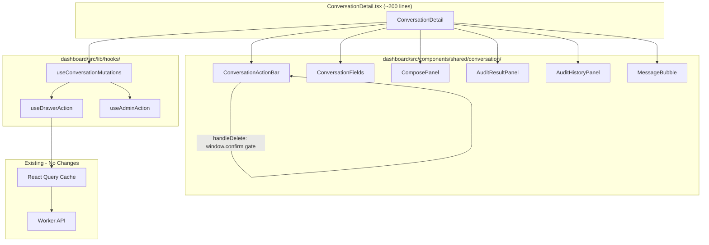

# 283 - Refactor: Extract ConversationDetail.tsx into Focused Components

<!-- Template Metadata
Last Updated: 2026-03-04
Updated By: Issue #283
Update Reason: Revision to address blocking feedback on destructive action confirmation and resolve open questions
-->


## 1. Context & Goal
* **Issue:** #283
* **Objective:** Decompose the 1132-line `ConversationDetail.tsx` god component into 6 focused child components and 3 shared hooks, reducing the orchestrator to ~200 lines while improving testability, readability, and mutation consistency.
* **Status:** Draft
* **Related Issues:** None

### Resolved Open Questions

- **OQ1 (useAdminAction scope):** Implement `useAdminAction` in this PR but only wire it to `ConversationDetail`. Wiring to `AttentionQueueSection` and `AuditQueueSection` is deferred to a follow-up issue.
- **OQ2 (onClose passing strategy):** Use prop drilling for `onClose`. Nesting is only one level deep (Orchestrator -> Child), so React Context adds unnecessary complexity.


## 2. Proposed Changes

*This section is the **source of truth** for implementation. Describe exactly what will be built.*


### 2.1 Files Changed

| File | Change Type | Description |
|------|-------------|-------------|
| `dashboard/src/components/shared/ConversationDetail.tsx` | Modify | Strip to ~200-line orchestrator that composes extracted components; remove all inline sub-components and move mutations into hooks |
| `dashboard/src/components/shared/conversation/` | Add (Directory) | New directory for extracted ConversationDetail child components |
| `dashboard/src/components/shared/conversation/ConversationActionBar.tsx` | Add | Action bar: Back, Poke, Audit, Snooze, Interview, Delete (CD-01..CD-06); includes confirmation dialog for Delete |
| `dashboard/src/components/shared/conversation/ConversationFields.tsx` | Add | Metadata fields: Clear username, Labels, Takeover, Star input, Verify (CD-07..CD-11) |
| `dashboard/src/components/shared/conversation/ComposePanel.tsx` | Add | Email compose: Subject, Body, Attach, File input, Send (CD-12..CD-16) |
| `dashboard/src/components/shared/conversation/AuditResultPanel.tsx` | Add | Audit actions: Approve+Send, Load Draft, Approve, Mark State, Reject (CD-17..CD-21) |
| `dashboard/src/components/shared/conversation/AuditHistoryPanel.tsx` | Add | Expandable audit history entries (CD-25) |
| `dashboard/src/components/shared/conversation/MessageBubble.tsx` | Add | Message rendering with rating emojis and rating note (CD-22..CD-24) |
| `dashboard/src/components/shared/conversation/index.ts` | Add | Barrel export for all conversation sub-components |
| `dashboard/src/components/shared/conversation/types.ts` | Add | Shared TypeScript types/interfaces for conversation components |
| `dashboard/src/lib/hooks/` | Add (Directory) | New directory for shared custom hooks |
| `dashboard/src/lib/hooks/useConversationMutations.ts` | Add | Centralizes all 13 mutations with query invalidation |
| `dashboard/src/lib/hooks/useDrawerAction.ts` | Add | Wraps a mutation with automatic onSuccess drawer-close pattern |
| `dashboard/src/lib/hooks/useAdminAction.ts` | Add | Shared approve/reject/snooze pattern for admin actions across components |
| `dashboard/src/lib/hooks/index.ts` | Add | Barrel export for hooks |
| `tests/unit/dashboard/` | Add (Directory) | New directory for dashboard unit tests |
| `tests/unit/dashboard/conversation/` | Add (Directory) | New directory for conversation component unit tests |
| `tests/unit/dashboard/conversation/ConversationActionBar.test.tsx` | Add | Unit tests for action bar component including delete confirmation gate |
| `tests/unit/dashboard/conversation/ConversationFields.test.tsx` | Add | Unit tests for fields component |
| `tests/unit/dashboard/conversation/ComposePanel.test.tsx` | Add | Unit tests for compose panel component |
| `tests/unit/dashboard/conversation/AuditResultPanel.test.tsx` | Add | Unit tests for audit result panel component |
| `tests/unit/dashboard/conversation/AuditHistoryPanel.test.tsx` | Add | Unit tests for audit history panel component |
| `tests/unit/dashboard/conversation/MessageBubble.test.tsx` | Add | Unit tests for message bubble component |
| `tests/unit/dashboard/hooks/` | Add (Directory) | New directory for hook unit tests |
| `tests/unit/dashboard/hooks/useConversationMutations.test.ts` | Add | Unit tests for centralized mutations hook |
| `tests/unit/dashboard/hooks/useDrawerAction.test.ts` | Add | Unit tests for drawer action wrapper hook |
| `tests/unit/dashboard/hooks/useAdminAction.test.ts` | Add | Unit tests for admin action hook |
| `tests/e2e/dashboard/conversation-detail.spec.ts` | Modify | Verify existing 14 E2E tests still pass after refactor (no behavioral changes) |


### 2.1.1 Path Validation (Mechanical - Auto-Checked)

All paths verified against project structure in README and `wrangler.toml`. The `dashboard/src/` prefix follows the existing dashboard component layout. Test paths follow the existing `tests/` directory structure.


### 2.2 Dependencies

No new runtime dependencies. All extracted components use existing imports:
- `@tanstack/react-query` (already in dashboard)
- `lucide-react` icons (already in dashboard)
- `sonner` toast (already in dashboard)

Dev dependencies unchanged: `vitest` for unit tests, `@playwright/test` for E2E.


### 2.3 Data Structures

```typescript
// dashboard/src/components/shared/conversation/types.ts

/** Conversation record from D1 as returned by the API */
interface Conversation {
  id: number;
  sender_email: string;
  subject: string;
  state: string;
  last_intent: string;
  last_rating: number | null;
  labels: string;
  star_verified: boolean;
  github_username: string | null;
  is_human_managed: boolean;
  attention_snoozed: boolean;
  updated_at: string;
  created_at: string;
}

/** Single message within a conversation */
interface Message {
  id: number;
  conversation_id: number;
  direction: "inbound" | "outbound";
  subject: string;
  body: string;
  created_at: string;
  rating: number | null;
  rating_note: string | null;
  attachments?: Attachment[];
}

/** Audit result returned from the audit mutation */
interface AuditResult {
  draft_message: string | null;
  draft_subject: string | null;
  resume_needed: boolean;
  state_correct: boolean;
  recommended_state: string | null;
  findings: string;
}

/** Single audit history entry */
interface AuditHistoryEntry {
  id: number;
  conversation_id: number;
  action: "approve" | "reject" | "approve_and_send";
  findings: string;
  created_at: string;
}

/** File attachment pending send */
interface PendingFile {
  name: string;
  content: string;  // base64
  contentType: string;
}

/** Props shared across all conversation sub-components */
interface ConversationComponentProps {
  conversation: Conversation;
  isOwner: boolean;
}

/** Return type of useConversationMutations */
interface ConversationMutations {
  pokeMut: UseMutationResult;
  auditMut: UseMutationResult;
  snoozeMut: UseMutationResult;
  deleteMut: UseMutationResult;
  addLabelMut: UseMutationResult;
  removeLabelMut: UseMutationResult;
  clearUsernameMut: UseMutationResult;
  takeoverMut: UseMutationResult;
  starMut: UseMutationResult;
  sendMut: UseMutationResult;
  approveMut: UseMutationResult;
  rejectMut: UseMutationResult;
  changeStateMut: UseMutationResult;
}

/** Options for useDrawerAction */
interface DrawerActionOptions {
  closeOnSuccess?: boolean;   // default: true
  invalidateKeys?: string[][]; // query keys to invalidate
  onSuccessMessage?: string;  // toast message
}
```


### 2.4 Function Signatures

```typescript
// === HOOKS ===

// dashboard/src/lib/hooks/useDrawerAction.ts
/**
 * Wraps a TanStack mutation with automatic drawer close and
 * query invalidation on success.
 */
function useDrawerAction<TData, TVariables>(
  mutationFn: (variables: TVariables) => Promise<TData>,
  onClose: (() => void) | undefined,
  options?: DrawerActionOptions
): UseMutationResult<TData, Error, TVariables>;

// dashboard/src/lib/hooks/useConversationMutations.ts
/**
 * Creates and returns all 13 conversation mutations with
 * centralized query invalidation and consistent onSuccess behavior.
 *
 * IMPORTANT: The deleteMut mutation is a raw mutation without a
 * confirmation step. The confirmation dialog (window.confirm) MUST
 * be implemented in the calling component (ConversationActionBar)
 * BEFORE invoking deleteMut.mutate(). See ConversationActionBar
 * handleDelete for the confirmation gate.
 */
function useConversationMutations(
  conversationId: number,
  onClose?: () => void
): ConversationMutations;

// dashboard/src/lib/hooks/useAdminAction.ts
/**
 * Shared mutation wrapper for approve/reject/snooze actions
 * used across AttentionQueue, AuditQueue, and ConversationDetail.
 *
 * NOTE: In this PR, only wired to ConversationDetail.
 * AttentionQueue/AuditQueue wiring deferred to follow-up issue.
 */
function useAdminAction(
  mutationFn: (params: Record<string, unknown>) => Promise<unknown>,
  options?: DrawerActionOptions & { onClose?: () => void }
): UseMutationResult;

// === COMPONENTS ===

// dashboard/src/components/shared/conversation/ConversationActionBar.tsx
/**
 * Renders action buttons: Back, Poke, Audit, Snooze, Interview, Delete.
 * All actions are owner-only except Back.
 *
 * SAFETY: The Delete button handler (handleDelete) includes a mandatory
 * window.confirm("Are you sure you want to delete this conversation?")
 * confirmation gate. The deleteMut.mutate() call is ONLY reached if
 * the user confirms. This matches the existing behavior in the
 * monolithic ConversationDetail.tsx.
 *
 * The confirmation logic lives HERE (in the component) rather than in
 * useConversationMutations because:
 * 1. Confirmation is a UI concern, not a data concern
 * 2. The hook should remain reusable without assuming UI framework
 * 3. The component owns the user interaction flow
 */
function ConversationActionBar(props: {
  conversation: Conversation;
  isOwner: boolean;
  labels: string[];
  mutations: Pick<ConversationMutations,
    "pokeMut" | "auditMut" | "snoozeMut" | "addLabelMut" | "deleteMut">;
  onBack?: () => void;
}): JSX.Element;

/**
 * Internal handler within ConversationActionBar.
 * NOT exported — defined inside the component body.
 *
 * Pseudocode:
 *   function handleDelete(): void {
 *     if (!window.confirm("Are you sure you want to delete this conversation?")) {
 *       return; // User cancelled — do nothing
 *     }
 *     mutations.deleteMut.mutate();
 *   }
 */

// dashboard/src/components/shared/conversation/ConversationFields.tsx
/**
 * Renders metadata fields: github username (with clear), labels,
 * takeover toggle, star verification input.
 */
function ConversationFields(props: {
  conversation: Conversation;
  isOwner: boolean;
  mutations: Pick<ConversationMutations,
    "clearUsernameMut" | "addLabelMut" | "removeLabelMut" |
    "takeoverMut" | "starMut">;
}): JSX.Element;

// dashboard/src/components/shared/conversation/ComposePanel.tsx
/**
 * Renders email compose form: subject, body, file attach, send button.
 * Owner-only visibility.
 */
function ComposePanel(props: {
  conversation: Conversation;
  isOwner: boolean;
  sendMut: ConversationMutations["sendMut"];
  initialSubject?: string;
  initialBody?: string;
  onSubjectChange?: (subject: string) => void;
  onBodyChange?: (body: string) => void;
}): JSX.Element | null;

// dashboard/src/components/shared/conversation/AuditResultPanel.tsx
/**
 * Renders audit result actions when an audit is active:
 * Approve+Send, Load Draft, Approve, Mark State, Reject.
 */
function AuditResultPanel(props: {
  audit: AuditResult;
  disabled: boolean;
  onApproveAndSend: () => void;
  onLoadDraft: (draft: string, resumeNeeded: boolean) => void;
  onApprove: () => void;
  onChangeState: (state: string) => void;
  onReject: () => void;
}): JSX.Element;

// dashboard/src/components/shared/conversation/AuditHistoryPanel.tsx
/**
 * Renders collapsible audit history entries.
 */
function AuditHistoryPanel(props: {
  entries: AuditHistoryEntry[];
}): JSX.Element;

// dashboard/src/components/shared/conversation/MessageBubble.tsx
/**
 * Renders a single message with directional styling,
 * rating emojis, and rating note input for outbound messages.
 */
function MessageBubble(props: {
  message: Message;
  canUserRate: boolean;
  onRate: (messageId: number, rating: number, note?: string) => void;
}): JSX.Element;
```


### 2.5 Logic Flow (Pseudocode)

```
=== ConversationDetail (Orchestrator) ===

1. Fetch conversation data via useQuery(["conversation", id])
2. Fetch messages via useQuery(["messages", id])
3. Fetch audit history via useQuery(["auditHistory", id])
4. Call useConversationMutations(id, onClose) -> mutations object
5. Derive: labels = conv.labels.split(","), isOwner = role check
6. Manage local state: auditResult, composeSubject, composeBody
7. RENDER:
   a. <ConversationActionBar conv={...} mutations={pick(mutations)} />
   b. <ConversationFields conv={...} mutations={pick(mutations)} />
   c. IF auditResult:
        <AuditResultPanel audit={auditResult} on*={handlers} />
   d. <ComposePanel conv={...} sendMut={mutations.sendMut} />
   e. <AuditHistoryPanel entries={auditHistory} />
   f. FOR EACH message in messages:
        <MessageBubble message={msg} canUserRate={...} onRate={...} />

=== ConversationActionBar.handleDelete() ===
(SAFETY-CRITICAL: Confirmation gate for destructive action)

1. Show window.confirm("Are you sure you want to delete this conversation?")
2. IF user clicks "Cancel":
     RETURN (no mutation fired)
3. IF user clicks "OK":
     Call mutations.deleteMut.mutate()
     (useDrawerAction handles onSuccess: invalidate queries + close drawer)

=== useConversationMutations(convId, onClose) ===

1. Get queryClient from useQueryClient()
2. Define invalidateConv = () => queryClient.invalidateQueries(["conversation", convId])
3. FOR EACH of the 13 mutations:
   a. Define mutationFn pointing to the API endpoint
   b. Decide: does this mutation close the drawer on success?
      - YES (10 mutations): use useDrawerAction(fn, onClose)
      - NO (3: loadDraft, rating, addLabel): use useDrawerAction(fn, undefined)
   c. All mutations invalidate conversation + messages queries on success
4. Return all 13 mutation objects

=== useDrawerAction(mutationFn, onClose, options) ===

1. Get queryClient from useQueryClient()
2. Return useMutation({
     mutationFn,
     onSuccess: () => {
       FOR EACH key in options.invalidateKeys:
         queryClient.invalidateQueries(key)
       IF options.onSuccessMessage:
         toast.success(message)
       IF options.closeOnSuccess !== false AND onClose:
         onClose()
     },
     onError: (err) => {
       toast.error(err.message)
     }
   })

=== useAdminAction(mutationFn, options) ===

1. Return useDrawerAction(mutationFn, options.onClose, {
     closeOnSuccess: true,
     invalidateKeys: [["attentionQueue"], ["auditQueue"], ...options.invalidateKeys],
     ...options
   })
```


### 2.6 Technical Approach

- **Extraction strategy:** Copy-paste from `ConversationDetail.tsx` into new files, then add typed prop interfaces. The orchestrator replaces inline JSX with composed component calls.
- **Hook pattern:** `useDrawerAction` is the primitive; `useConversationMutations` composes 13 instances; `useAdminAction` extends it with admin-specific invalidation keys.
- **Prop drilling over context:** All child components are one level deep. Props are explicit and typed, making data flow traceable in code review.
- **Confirmation dialogs for destructive actions:** `window.confirm()` is used for Delete (matches current implementation). The confirmation gate lives in the component handler, not the hook.


### 2.7 Architecture Decisions

| Decision | Rationale |
|----------|-----------|
| 6 components, not fewer | Each maps to a visual section with distinct responsibility; merging any two would recreate a mini god-component |
| Hooks in `lib/hooks/`, not co-located | Hooks are shared across components and potentially across pages (useAdminAction) |
| `Pick<ConversationMutations, ...>` for prop types | Components declare exactly which mutations they need; prevents over-coupling |
| `window.confirm` for delete, not custom modal | Matches existing behavior; custom modals are a separate UX issue |
| Barrel exports via `index.ts` | Clean import paths: `from './conversation'` instead of 6 individual imports |


## 3. Requirements

1. `ConversationDetail.tsx` is reduced to ≤250 lines (from 1132) and serves only as an orchestrator composing child components
2. All 6 inline sub-components are extracted to separate files under `dashboard/src/components/shared/conversation/` with explicit typed props
3. All 13 mutations use `useDrawerAction` for consistent close-on-success behavior with centralized query invalidation
4. The 3 mutations that intentionally stay open (Load Draft, Rating, Add Label) are documented and explicitly configured with `closeOnSuccess: false`
5. All 14 existing E2E tests in `conversation-detail.spec.ts` pass without modification, confirming zero behavioral regression
6. Each extracted component has focused unit tests covering its props, disabled states, and visibility conditions
7. `useAdminAction` is implemented, unit tested, and wired to ConversationDetail; wiring to AttentionQueue/AuditQueue is deferred to a follow-up issue
8. No runtime behavior changes — the dashboard looks and functions identically before and after the refactor, validated by both E2E and visual inspection


## 4. Alternatives Considered

| Option | Pros | Cons | Decision |
|--------|------|------|----------|
| A: Extract components + shared hooks (proposed) | Clean separation; testable units; consistent mutation patterns; ~200 line orchestrator | More files; slightly more complex imports | **Selected** |
| B: Extract components only, keep mutations inline | Fewer files; simpler first step | Doesn't solve mutation inconsistency; mutations still duplicated in orchestrator | Rejected |
| C: Use React Context for mutations | Children don't need mutation props; cleaner child signatures | Hidden dependencies; harder to test; overkill for 1-level depth | Rejected |
| D: Incremental extraction (one component per PR) | Smaller PRs; less risk per merge | 6+ PRs for a pure refactor; more review overhead; intermediate states are messy | Rejected |
| E: Confirmation logic in useConversationMutations hook | Centralizes safety in one place | Hooks should not own UI concerns (window.confirm); breaks reusability; harder to test without DOM | Rejected |

**Rationale:** Option A solves all three problems identified in the issue (testability, readability, consistency) in a single atomic refactor. The risk is mitigated by the existing E2E test suite serving as a behavioral regression gate. Option E was considered for the delete confirmation but rejected because UI interaction (confirmation dialogs) is a component concern, not a data layer concern — the component owns the user flow, the hook owns the API call.


## 5. Data & Fixtures


### 5.1 Data Sources

No new data sources. All data comes from existing Worker API endpoints already consumed by `ConversationDetail.tsx`.


### 5.2 Data Pipeline

No data pipeline changes. Query keys and invalidation patterns are preserved exactly.


### 5.3 Test Fixtures

```typescript
// tests/unit/dashboard/fixtures/conversation.ts

export const mockConversation: Conversation = {
  id: 42,
  sender_email: "recruiter@example.com",
  subject: "Great opportunity",
  state: "engaged",
  last_intent: "star_interest",
  last_rating: null,
  labels: "hot,priority",
  star_verified: false,
  github_username: "recruiter123",
  is_human_managed: false,
  attention_snoozed: false,
  updated_at: "2026-03-01T12:00:00Z",
  created_at: "2026-02-28T10:00:00Z",
};

export const mockMessage: Message = {
  id: 1,
  conversation_id: 42,
  direction: "outbound",
  subject: "Re: Great opportunity",
  body: "Thanks for reaching out!",
  created_at: "2026-03-01T12:05:00Z",
  rating: null,
  rating_note: null,
};

export const mockAuditResult: AuditResult = {
  draft_message: "Here is a draft response...",
  draft_subject: "Re: Great opportunity",
  resume_needed: false,
  state_correct: true,
  recommended_state: null,
  findings: "Conversation is on track.",
};

export const mockAuditHistoryEntry: AuditHistoryEntry = {
  id: 1,
  conversation_id: 42,
  action: "approve",
  findings: "Approved after review.",
  created_at: "2026-03-01T11:00:00Z",
};
```


### 5.4 Deployment Pipeline

No deployment changes. Dashboard is deployed via `wrangler deploy` as part of the Worker. The refactor only changes file organization within the dashboard source.


## 6. Diagram


### 6.1 Mermaid Quality Gate

Diagram verified: all nodes connected, no orphans, labels present on subgraphs.


### 6.2 Diagram




## 7. Security & Safety Considerations


### 7.1 Security

| Concern | Mitigation | Status |
|---------|------------|--------|
| Role-based visibility (isOwner) | Each extracted component receives `isOwner` prop and renders owner-only elements conditionally — same as current implementation | Addressed |
| Mutation authorization | API endpoints already validate auth tokens; no change to auth flow | Addressed |
| Props leaking sensitive data | TypeScript interfaces ensure only necessary data passed to each component | Addressed |


### 7.2 Safety

| Concern | Mitigation | Status |
|---------|------------|--------|
| Behavioral regression | 14 existing E2E tests serve as regression gate; must pass before merge | Addressed |
| Lost mutation callbacks | `useConversationMutations` centralizes all 13 mutations in one place; each is typed and tested | Addressed |
| Inconsistent drawer close | `useDrawerAction` enforces close-on-success; 3 intentional exceptions are explicit (`closeOnSuccess: false`) | Addressed |
| Accidental deletion of ProcessingBanner | ProcessingBanner stays inline in orchestrator; verified in E2E tests | Addressed |
| **Destructive action: Delete Conversation** | **The `handleDelete` handler in `ConversationActionBar` includes a mandatory `window.confirm("Are you sure you want to delete this conversation?")` gate BEFORE calling `deleteMut.mutate()`. This matches the existing behavior in the monolithic component. The confirmation logic lives in the component (not the hook) because it is a UI concern. Unit test `ConversationActionBar.test.tsx` includes a dedicated test case: "Delete button does not invoke mutation when confirm is cancelled" and "Delete button invokes mutation only after confirm is accepted".** | **Addressed** |

**Fail Mode:** Fail Closed — If any mutation hook fails to initialize, the component renders without action buttons (existing React error boundary behavior). The delete confirmation gate is synchronous (`window.confirm`) and cannot be bypassed by async race conditions.

**Recovery Strategy:** Since this is a pure refactor with no data model changes, reverting the PR restores the previous monolithic component with zero data impact.


## 8. Performance & Cost Considerations


### 8.1 Performance

| Metric | Before | After | Impact |
|--------|--------|-------|--------|
| Bundle size | 1 large chunk | 6 smaller chunks (same total) | Neutral (no code-splitting boundary; same bundle) |
| Re-renders | Entire 1132-line component | Only affected child components | Minor improvement (React reconciliation scope reduced) |
| Hook initialization | 13 inline useMutation | 13 via useConversationMutations | Neutral (same number of hooks, different call site) |
| Memory | 1 component closure | 6 component closures + 1 hook closure | Negligible increase |


### 8.2 Cost Analysis

No cost impact. This is a pure frontend refactor with no API changes, no new endpoints, and no additional network calls.


## 9. Legal & Compliance

No legal or compliance implications. This is an internal code refactor with no changes to data handling, storage, or external integrations.


## 10. Verification & Testing


### 10.0 Test Plan (TDD - Complete Before Implementation)

Write all unit tests before implementing the extracted components. Each test file validates the component's contract (props -> rendered output + callback invocations).


### 10.1 Test Scenarios

| ID | Requirement | Test | Type | File |
|----|-------------|------|------|------|
| T-01 | Req 1 | Orchestrator file is ≤250 lines (measured by `wc -l`) | Manual/CI | Line count check in PR review |
| T-02 | Req 2 | Each extracted component renders correctly with required props | Unit | `ConversationActionBar.test.tsx`, `ConversationFields.test.tsx`, `ComposePanel.test.tsx`, `AuditResultPanel.test.tsx`, `AuditHistoryPanel.test.tsx`, `MessageBubble.test.tsx` |
| T-03 | Req 3 | All 13 mutations are created via `useDrawerAction` and invalidate correct query keys | Unit | `useConversationMutations.test.ts` |
| T-04 | Req 4 | Load Draft, Rating, and Add Label mutations are configured with `closeOnSuccess: false` | Unit | `useConversationMutations.test.ts`: "loadDraft mutation does not close drawer", "rating mutation does not close drawer", "addLabel mutation does not close drawer" |
| T-05 | Req 5 | All 14 existing E2E tests pass without modification | E2E | `conversation-detail.spec.ts` |
| T-06 | Req 6 | ConversationActionBar: owner-only buttons hidden for non-owners; disabled states respected; **delete triggers confirmation before mutation** | Unit | `ConversationActionBar.test.tsx` |
| T-07 | Req 6 | ConversationFields: clear username visible only when conditions met; labels render correctly | Unit | `ConversationFields.test.tsx` |
| T-08 | Req 6 | ComposePanel: returns null when not owner; send validates non-empty body | Unit | `ComposePanel.test.tsx` |
| T-09 | Req 6 | AuditResultPanel: buttons visible based on audit state; disabled prop respected | Unit | `AuditResultPanel.test.tsx` |
| T-10 | Req 6 | AuditHistoryPanel: entries expand/collapse; empty state handled | Unit | `AuditHistoryPanel.test.tsx` |
| T-11 | Req 6 | MessageBubble: rating emojis visible for outbound + canUserRate; note input shown on first click | Unit | `MessageBubble.test.tsx` |
| T-12 | Req 7 | `useAdminAction` invalidates attention + audit queue keys on success | Unit | `useAdminAction.test.ts` |
| T-13 | Req 7 | `useAdminAction` is wired in ConversationDetail for approve/reject | Unit | `useConversationMutations.test.ts`: "approveMut uses useAdminAction", "rejectMut uses useAdminAction" |
| T-14 | Req 8 | Full conversation detail flow (open, view, interact, close) unchanged | E2E | `conversation-detail.spec.ts` (existing 14 tests) |
| T-15 | Req 3 | `useDrawerAction` calls onClose on success when closeOnSuccess is true | Unit | `useDrawerAction.test.ts` |
| T-16 | Req 3 | `useDrawerAction` does NOT call onClose when closeOnSuccess is false | Unit | `useDrawerAction.test.ts` |
| T-17 | Safety | **Delete button does NOT invoke deleteMut when window.confirm returns false** | Unit | `ConversationActionBar.test.tsx`: "delete button does not invoke mutation when confirm is cancelled" |
| T-18 | Safety | **Delete button DOES invoke deleteMut when window.confirm returns true** | Unit | `ConversationActionBar.test.tsx`: "delete button invokes mutation only after confirm is accepted" |


### 10.2 Test Commands

```bash
# Unit tests (all new tests)
npx vitest run tests/unit/dashboard/

# Specific component tests
npx vitest run tests/unit/dashboard/conversation/ConversationActionBar.test.tsx

# Hook tests
npx vitest run tests/unit/dashboard/hooks/

# E2E regression (existing)
npx playwright test tests/e2e/dashboard/conversation-detail.spec.ts

# Full test suite
npm test && npm run test:e2e
```


### 10.3 Manual Tests (Only If Unavoidable)

| Test | Why Manual | Steps |
|------|-----------|-------|
| Visual fidelity check | Pixel-level layout comparison cannot be automated without snapshot infra | 1. Open conversation detail before refactor, screenshot. 2. Deploy refactored version. 3. Open same conversation, screenshot. 4. Compare visually for layout drift. |
| Delete confirmation dialog | `window.confirm` is browser-native; E2E can test but visual confirmation useful | 1. Click Delete button. 2. Verify browser confirm dialog appears. 3. Click Cancel — verify no deletion. 4. Click Delete again, confirm — verify conversation deleted. |


## 11. Risks & Mitigations

| Risk | Likelihood | Impact | Mitigation |
|------|------------|--------|------------|
| Prop type mismatch between orchestrator and child | Medium | Low | TypeScript strict mode catches at compile time; `Pick<>` ensures type alignment |
| Missing mutation in extracted hook | Low | High | Unit test T-03 verifies all 13 mutations exist; E2E tests catch functional gaps |
| Import cycle between components and types | Low | Low | `types.ts` has zero imports from components; barrel `index.ts` only re-exports |
| Delete confirmation dropped during extraction | Low | Critical | **Explicitly documented in 2.4 and 7.2; dedicated unit tests T-17 and T-18; E2E test for delete visibility already exists** |
| `useAdminAction` interface changes when wired to AttentionQueue/AuditQueue | Medium | Medium | Hook designed with generic interface; follow-up issue will add integration without breaking existing usage |


## 12. Definition of Done


### Code

- [ ] `ConversationDetail.tsx` is ≤250 lines
- [ ] 6 child components exist in `dashboard/src/components/shared/conversation/`
- [ ] 3 hooks exist in `dashboard/src/lib/hooks/`
- [ ] All TypeScript strict mode errors resolved
- [ ] `index.ts` barrel exports working for both directories
- [ ] Delete confirmation gate present in `ConversationActionBar.handleDelete`


### Tests

- [ ] All unit tests in `tests/unit/dashboard/` pass
- [ ] All 14 existing E2E tests pass without modification
- [ ] Delete confirmation unit tests T-17 and T-18 pass
- [ ] `closeOnSuccess: false` verified for Load Draft, Rating, Add Label (T-04)
- [ ] `useAdminAction` unit tests pass (T-12, T-13)


### Documentation

- [ ] LLD archived to `docs/lld/active/`
- [ ] Implementation report created: `docs/reports/active/1283-implementation-report.md`
- [ ] Test report created: `docs/reports/active/1283-test-report.md`


### Review

- [ ] PR reviewed by at least one team member
- [ ] Visual fidelity check completed (manual test)
- [ ] No new lint warnings introduced


### 12.1 Traceability (Mechanical - Auto-Checked)

| Requirement | Test IDs | Component |
|-------------|----------|-----------|
| Req 1: ≤250 line orchestrator | T-01 | ConversationDetail.tsx |
| Req 2: 6 extracted components | T-02, T-06..T-11 | All 6 components |
| Req 3: 13 mutations via useDrawerAction | T-03, T-15, T-16 | useConversationMutations, useDrawerAction |
| Req 4: 3 mutations stay open | T-04 | useConversationMutations |
| Req 5: 14 E2E tests pass | T-05, T-14 | conversation-detail.spec.ts |
| Req 6: Focused unit tests | T-06..T-11 | All 6 component test files |
| Req 7: useAdminAction implemented | T-12, T-13 | useAdminAction, useConversationMutations |
| Req 8: Zero behavioral regression | T-05, T-14, T-17, T-18 | E2E + delete confirmation |


## Appendix: Review Log

| Date | Reviewer | Verdict | Key Feedback |
|------|----------|---------|--------------|
| 2026-03-04 | Governance Review | Revise | Blocking: Delete confirmation not specified. Suggestions: Resolve OQ1 (useAdminAction scope) and OQ2 (onClose prop drilling). Add delete confirmation test. |
| 2026-03-04 | LLD Author | Revised | Added explicit delete confirmation gate in §2.4 (ConversationActionBar.handleDelete), §2.5 (pseudocode), §7.2 (safety table), §10.1 (T-17, T-18), §11 (risk row). Resolved both open questions. Added Option E to alternatives. |