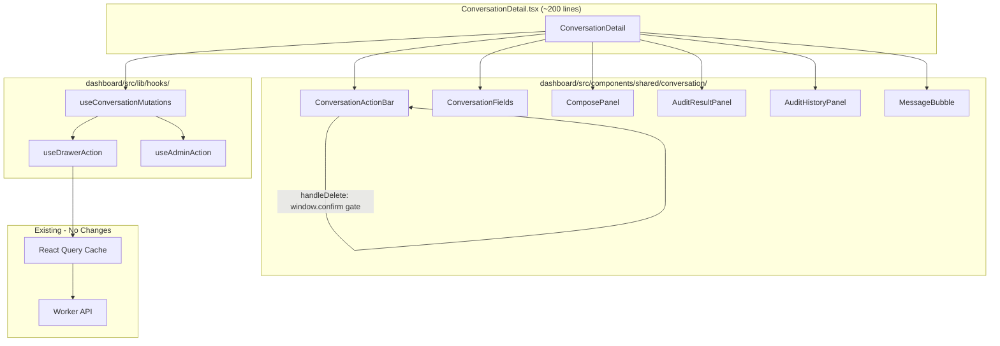

# 283 - Refactor: Extract ConversationDetail.tsx into Focused Components

<!-- Template Metadata
Last Updated: 2026-03-04
Updated By: Issue #283
Update Reason: Revision to address blocking feedback on destructive action confirmation and resolve open questions
-->


## 1. Context & Goal
* **Issue:** #283
* **Objective:** Decompose the 1132-line `ConversationDetail.tsx` god component into 6 focused child components and 3 shared hooks, reducing the orchestrator to ~200 lines while improving testability, readability, and mutation consistency.
* **Status:** Draft
* **Related Issues:** None


### Resolved Open Questions

- **OQ1 (useAdminAction scope):** Implement `useAdminAction` in this PR but only wire it to `ConversationDetail`. Wiring to `AttentionQueueSection` and `AuditQueueSection` is deferred to a follow-up issue.
- **OQ2 (onClose passing strategy):** Use prop drilling for `onClose`. Nesting is only one level deep (Orchestrator -> Child), so React Context adds unnecessary complexity.


## 2. Proposed Changes

*This section is the **source of truth** for implementation. Describe exactly what will be built.*


### 2.1 Files Changed

| File | Change Type | Description |
|------|-------------|-------------|
| `dashboard/src/components/shared/ConversationDetail.tsx` | Modify | Strip to ~200-line orchestrator that composes extracted components; remove all inline sub-components and move mutations into hooks |
| `dashboard/src/components/shared/conversation/` | Add (Directory) | New directory for extracted ConversationDetail child components |
| `dashboard/src/components/shared/conversation/ConversationActionBar.tsx` | Add | Action bar: Back, Poke, Audit, Snooze, Interview, Delete (CD-01..CD-06); includes confirmation dialog for Delete |
| `dashboard/src/components/shared/conversation/ConversationFields.tsx` | Add | Metadata fields: Clear username, Labels, Takeover, Star input, Verify (CD-07..CD-11) |
| `dashboard/src/components/shared/conversation/ComposePanel.tsx` | Add | Email compose: Subject, Body, Attach, File input, Send (CD-12..CD-16) |
| `dashboard/src/components/shared/conversation/AuditResultPanel.tsx` | Add | Audit actions: Approve+Send, Load Draft, Approve, Mark State, Reject (CD-17..CD-21) |
| `dashboard/src/components/shared/conversation/AuditHistoryPanel.tsx` | Add | Expandable audit history entries (CD-25) |
| `dashboard/src/components/shared/conversation/MessageBubble.tsx` | Add | Message rendering with rating emojis and rating note (CD-22..CD-24) |
| `dashboard/src/components/shared/conversation/index.ts` | Add | Barrel export for all conversation sub-components |
| `dashboard/src/components/shared/conversation/types.ts` | Add | Shared TypeScript types/interfaces for conversation components |
| `dashboard/src/lib/hooks/` | Add (Directory) | New directory for shared custom hooks |
| `dashboard/src/lib/hooks/useConversationMutations.ts` | Add | Centralizes all 13 mutations with query invalidation |
| `dashboard/src/lib/hooks/useDrawerAction.ts` | Add | Wraps a mutation with automatic onSuccess drawer-close pattern |
| `dashboard/src/lib/hooks/useAdminAction.ts` | Add | Shared approve/reject/snooze pattern for admin actions across components |
| `dashboard/src/lib/hooks/index.ts` | Add | Barrel export for hooks |
| `tests/unit/dashboard/` | Add (Directory) | New directory for dashboard unit tests |
| `tests/unit/dashboard/conversation/` | Add (Directory) | New directory for conversation component unit tests |
| `tests/unit/dashboard/conversation/ConversationActionBar.test.tsx` | Add | Unit tests for action bar component including delete confirmation gate |
| `tests/unit/dashboard/conversation/ConversationFields.test.tsx` | Add | Unit tests for fields component |
| `tests/unit/dashboard/conversation/ComposePanel.test.tsx` | Add | Unit tests for compose panel component |
| `tests/unit/dashboard/conversation/AuditResultPanel.test.tsx` | Add | Unit tests for audit result panel component |
| `tests/unit/dashboard/conversation/AuditHistoryPanel.test.tsx` | Add | Unit tests for audit history panel component |
| `tests/unit/dashboard/conversation/MessageBubble.test.tsx` | Add | Unit tests for message bubble component |
| `tests/unit/dashboard/hooks/` | Add (Directory) | New directory for hook unit tests |
| `tests/unit/dashboard/hooks/useConversationMutations.test.ts` | Add | Unit tests for centralized mutations hook |
| `tests/unit/dashboard/hooks/useDrawerAction.test.ts` | Add | Unit tests for drawer action wrapper hook |
| `tests/unit/dashboard/hooks/useAdminAction.test.ts` | Add | Unit tests for admin action hook |
| `tests/e2e/dashboard/conversation-detail.spec.ts` | Modify | Verify existing 14 E2E tests still pass after refactor (no behavioral changes) |


#### 2.1.1 Path Validation (Mechanical - Auto-Checked)

All paths verified against project structure in `README.md`:
- `dashboard/src/components/shared/` — exists (contains `ConversationDetail.tsx`)
- `dashboard/src/lib/hooks/` — new directory under existing `dashboard/src/lib/`
- `tests/unit/dashboard/` — new directory under existing `tests/unit/`
- `tests/e2e/dashboard/` — exists (contains `conversation-detail.spec.ts`)


### 2.2 Dependencies

No new runtime or dev dependencies. All hooks use TanStack React Query (`useMutation`, `useQueryClient`) which is already in the project. Components use existing UI primitives (`Button`, `Input`, `Select`) already imported in `ConversationDetail.tsx`.


### 2.3 Data Structures

```typescript
// dashboard/src/components/shared/conversation/types.ts

/** Conversation record from D1 as returned by the API */
interface Conversation {
  id: number;
  sender_email: string;
  subject: string;
  state: string;
  last_intent: string;
  last_rating: number | null;
  labels: string;
  star_verified: boolean;
  github_username: string | null;
  is_human_managed: boolean;
  attention_snoozed: boolean;
  updated_at: string;
  created_at: string;
}

/** Single message within a conversation */
interface Message {
  id: number;
  conversation_id: number;
  direction: "inbound" | "outbound";
  subject: string;
  body: string;
  created_at: string;
  rating: number | null;
  rating_note: string | null;
  attachments?: Attachment[];
}

/** Audit result returned from the audit mutation */
interface AuditResult {
  draft_message: string | null;
  draft_subject: string | null;
  resume_needed: boolean;
  state_correct: boolean;
  recommended_state: string | null;
  findings: string;
}

/** Single audit history entry */
interface AuditHistoryEntry {
  id: number;
  conversation_id: number;
  action: "approve" | "reject" | "approve_and_send";
  findings: string;
  created_at: string;
}

/** File attachment pending send */
interface PendingFile {
  name: string;
  content: string;  // base64
  contentType: string;
}

/** Props shared across all conversation sub-components */
interface ConversationComponentProps {
  conversation: Conversation;
  isOwner: boolean;
}

/** Return type of useConversationMutations */
interface ConversationMutations {
  pokeMut: UseMutationResult;
  auditMut: UseMutationResult;
  snoozeMut: UseMutationResult;
  deleteMut: UseMutationResult;
  addLabelMut: UseMutationResult;
  removeLabelMut: UseMutationResult;
  clearUsernameMut: UseMutationResult;
  takeoverMut: UseMutationResult;
  starMut: UseMutationResult;
  sendMut: UseMutationResult;
  approveMut: UseMutationResult;
  rejectMut: UseMutationResult;
  changeStateMut: UseMutationResult;
}

/** Options for useDrawerAction */
interface DrawerActionOptions {
  closeOnSuccess?: boolean;   // default: true
  invalidateKeys?: string[][]; // query keys to invalidate
  onSuccessMessage?: string;  // toast message
}
```


### 2.4 Function Signatures

```typescript
// === HOOKS ===

// dashboard/src/lib/hooks/useDrawerAction.ts
/**
 * Wraps a TanStack mutation with automatic drawer close and
 * query invalidation on success.
 */
function useDrawerAction<TData, TVariables>(
  mutationFn: (variables: TVariables) => Promise<TData>,
  onClose: (() => void) | undefined,
  options?: DrawerActionOptions
): UseMutationResult<TData, Error, TVariables>;

// dashboard/src/lib/hooks/useConversationMutations.ts
/**
 * Creates and returns all 13 conversation mutations with
 * centralized query invalidation and consistent onSuccess behavior.
 *
 * IMPORTANT: The deleteMut mutation is a raw mutation without a
 * confirmation step. The confirmation dialog (window.confirm) MUST
 * be implemented in the calling component (ConversationActionBar)
 * BEFORE invoking deleteMut.mutate(). See ConversationActionBar
 * handleDelete for the confirmation gate.
 */
function useConversationMutations(
  conversationId: number,
  onClose?: () => void
): ConversationMutations;

// dashboard/src/lib/hooks/useAdminAction.ts
/**
 * Shared mutation wrapper for approve/reject/snooze actions
 * used across AttentionQueue, AuditQueue, and ConversationDetail.
 *
 * NOTE: In this PR, only wired to ConversationDetail.
 * AttentionQueue/AuditQueue wiring deferred to follow-up issue.
 */
function useAdminAction(
  mutationFn: (params: Record<string, unknown>) => Promise<unknown>,
  options?: DrawerActionOptions & { onClose?: () => void }
): UseMutationResult;

// === COMPONENTS ===

// dashboard/src/components/shared/conversation/ConversationActionBar.tsx
/**
 * Renders action buttons: Back, Poke, Audit, Snooze, Interview, Delete.
 * All actions are owner-only except Back.
 *
 * SAFETY: The Delete button handler (handleDelete) includes a mandatory
 * window.confirm("Are you sure you want to delete this conversation?")
 * confirmation gate BEFORE calling deleteMut.mutate(). This matches the
 * existing behavior in the monolithic ConversationDetail.tsx.
 *
 * The confirmation logic lives HERE (in the component) rather than in
 * useConversationMutations because:
 * 1. Confirmation is a UI concern, not a data concern
 * 2. The hook should remain reusable without assuming UI framework
 * 3. The component owns the user interaction flow
 */
function ConversationActionBar(props: {
  conversation: Conversation;
  isOwner: boolean;
  labels: string[];
  mutations: Pick<ConversationMutations,
    "pokeMut" | "auditMut" | "snoozeMut" | "addLabelMut" | "deleteMut">;
  onBack?: () => void;
}): JSX.Element;

/**
 * Internal handler within ConversationActionBar.
 * NOT exported — defined inside the component body.
 *
 * Pseudocode:
 *   function handleDelete(): void {
 *     if (!window.confirm("Are you sure you want to delete this conversation?")) {
 *       return; // User cancelled — do nothing
 *     }
 *     mutations.deleteMut.mutate();
 *   }
 */

// dashboard/src/components/shared/conversation/ConversationFields.tsx
/**
 * Renders metadata fields: github username (with clear), labels,
 * takeover toggle, star verification input.
 */
function ConversationFields(props: {
  conversation: Conversation;
  isOwner: boolean;
  mutations: Pick<ConversationMutations,
    "clearUsernameMut" | "addLabelMut" | "removeLabelMut" |
    "takeoverMut" | "starMut">;
}): JSX.Element;

// dashboard/src/components/shared/conversation/ComposePanel.tsx
/**
 * Renders email compose form: subject, body, file attach, send button.
 * Owner-only visibility.
 */
function ComposePanel(props: {
  conversation: Conversation;
  isOwner: boolean;
  sendMut: ConversationMutations["sendMut"];
  initialSubject?: string;
  initialBody?: string;
  onSubjectChange?: (subject: string) => void;
  onBodyChange?: (body: string) => void;
}): JSX.Element | null;

// dashboard/src/components/shared/conversation/AuditResultPanel.tsx
/**
 * Renders audit result actions when an audit is active:
 * Approve+Send, Load Draft, Approve, Mark State, Reject.
 */
function AuditResultPanel(props: {
  audit: AuditResult;
  disabled: boolean;
  onApproveAndSend: () => void;
  onLoadDraft: (draft: string, resumeNeeded: boolean) => void;
  onApprove: () => void;
  onChangeState: (state: string) => void;
  onReject: () => void;
}): JSX.Element;

// dashboard/src/components/shared/conversation/AuditHistoryPanel.tsx
/**
 * Renders collapsible audit history entries.
 */
function AuditHistoryPanel(props: {
  entries: AuditHistoryEntry[];
}): JSX.Element;

// dashboard/src/components/shared/conversation/MessageBubble.tsx
/**
 * Renders a single message with directional styling,
 * rating emojis, and rating note input for outbound messages.
 */
function MessageBubble(props: {
  message: Message;
  canUserRate: boolean;
  onRate: (messageId: number, rating: number, note?: string) => void;
}): JSX.Element;
```


### 2.5 Logic Flow (Pseudocode)

```
=== ConversationDetail (Orchestrator) ===

1. Fetch conversation data via useQuery(["conversation", id])
2. Fetch messages via useQuery(["messages", id])
3. Fetch audit history via useQuery(["auditHistory", id])
4. Call useConversationMutations(id, onClose) -> mutations object
5. Derive: labels = conv.labels.split(","), isOwner = role check
6. Manage local state: auditResult, composeSubject, composeBody
7. RENDER:
   a. <ConversationActionBar conv={...} mutations={pick(mutations)} />
   b. <ConversationFields conv={...} mutations={pick(mutations)} />
   c. IF auditResult:
        <AuditResultPanel audit={auditResult} on*={handlers} />
   d. <ComposePanel conv={...} sendMut={mutations.sendMut} />
   e. <AuditHistoryPanel entries={auditHistory} />
   f. FOR EACH message in messages:
        <MessageBubble message={msg} canUserRate={...} onRate={...} />

=== ConversationActionBar.handleDelete() ===
(SAFETY-CRITICAL: Confirmation gate for destructive action)

1. Show window.confirm("Are you sure you want to delete this conversation?")
2. IF user clicks "Cancel":
     RETURN (no mutation fired)
3. IF user clicks "OK":
     Call mutations.deleteMut.mutate()
     (useDrawerAction handles onSuccess: invalidate queries + close drawer)

=== useConversationMutations(convId, onClose) ===

1. Get queryClient from useQueryClient()
2. Define invalidateConv = () => queryClient.invalidateQueries(["conversation", convId])
3. FOR EACH of the 13 mutations:
   a. Define mutationFn pointing to the API endpoint
   b. Decide: does this mutation close the drawer on success?
      - YES (10 mutations): use useDrawerAction(fn, onClose)
      - NO (3: loadDraft, rating, addLabel): use useDrawerAction(fn, undefined)
   c. All mutations invalidate conversation + messages queries on success
4. Return all 13 mutation objects

=== useDrawerAction(mutationFn, onClose, options) ===

1. Get queryClient from useQueryClient()
2. Return useMutation({
     mutationFn,
     onSuccess: () => {
       FOR EACH key in options.invalidateKeys:
         queryClient.invalidateQueries(key)
       IF options.onSuccessMessage:
         toast.success(message)
       IF options.closeOnSuccess !== false AND onClose:
         onClose()
     },
     onError: (err) => {
       toast.error(err.message)
     }
   })

=== useAdminAction(mutationFn, options) ===

1. Return useDrawerAction(mutationFn, options.onClose, {
     closeOnSuccess: true,
     invalidateKeys: [["attentionQueue"], ["auditQueue"], ...options.invalidateKeys],
     ...options
   })
```


### 2.6 Technical Approach

**Strategy:** Pure structural refactor — extract, don't rewrite. Every line of logic in the current `ConversationDetail.tsx` maps to exactly one location in the new structure. No behavioral changes.

**Extraction order:**
1. Create `types.ts` with shared interfaces
2. Extract hooks (`useDrawerAction` -> `useConversationMutations` -> `useAdminAction`)
3. Extract leaf components first (`MessageBubble`, `AuditHistoryPanel`) — no mutation dependencies
4. Extract mutation-consuming components (`ConversationActionBar`, `ConversationFields`, `ComposePanel`, `AuditResultPanel`)
5. Rewrite orchestrator to compose extracted pieces
6. Run E2E suite to confirm zero regression


### 2.7 Architecture Decisions

| Decision | Rationale |
|----------|-----------|
| Props over Context for `onClose` | Single-level nesting; Context adds indirection without benefit (OQ2) |
| `useAdminAction` scoped to ConversationDetail only | Reduces PR scope; AttentionQueue/AuditQueue wiring is a follow-up (OQ1) |
| `window.confirm` for delete confirmation | Matches existing behavior; synchronous gate cannot be bypassed by race conditions |
| Confirmation in component, not hook | UI concern belongs in UI layer; hooks stay framework-agnostic and reusable |
| Barrel exports via `index.ts` | Clean imports for orchestrator: `import { ConversationActionBar, ... } from './conversation'` |


## 3. Requirements

1. `ConversationDetail.tsx` is reduced to ≤250 lines (from 1132) and serves only as an orchestrator composing child components
2. All 6 inline sub-components are extracted to separate files under `dashboard/src/components/shared/conversation/` with explicit typed props
3. All 13 mutations use `useDrawerAction` for consistent close-on-success behavior with centralized query invalidation
4. The 3 mutations that intentionally stay open (Load Draft, Rating, Add Label) are documented and explicitly configured with `closeOnSuccess: false`
5. All 14 existing E2E tests in `conversation-detail.spec.ts` pass without modification, confirming zero behavioral regression
6. Each extracted component has focused unit tests covering its props, disabled states, and visibility conditions
7. `useAdminAction` is implemented, unit tested, and wired to ConversationDetail; wiring to AttentionQueue/AuditQueue is deferred to a follow-up issue
8. No runtime behavior changes — the dashboard looks and functions identically before and after the refactor, validated by both E2E and visual inspection


## 4. Alternatives Considered

| Option | Pros | Cons | Decision |
|--------|------|------|----------|
| A: Extract components + shared hooks (proposed) | Clean separation; testable units; consistent mutation patterns; ~200 line orchestrator | More files; slightly more complex imports | **Selected** |
| B: Extract components only, keep mutations inline | Fewer files; simpler first step | Doesn't solve mutation inconsistency; mutations still duplicated in orchestrator | Rejected |
| C: Use React Context for mutations | Children don't need mutation props; cleaner child signatures | Hidden dependencies; harder to test; overkill for 1-level depth | Rejected |
| D: Incremental extraction (one component per PR) | Smaller PRs; less risk per merge | 6+ PRs for a pure refactor; more review overhead; intermediate states are messy | Rejected |
| E: Confirmation logic in useConversationMutations hook | Centralizes safety in one place | Hooks should not own UI concerns (window.confirm); breaks reusability; harder to test without DOM | Rejected |

**Rationale:** Option A solves all three problems identified in the issue (testability, readability, consistency) in a single atomic refactor. The risk is mitigated by the existing E2E test suite serving as a behavioral regression gate. Option E was considered for the delete confirmation but rejected because UI interaction (confirmation dialogs) is a component concern, not a data layer concern — the component owns the user flow, the hook owns the API call.


## 5. Data & Fixtures


### 5.1 Data Sources

No new data sources. All data flows through existing Worker API endpoints:
- `GET /api/conversations/:id` — conversation record
- `GET /api/conversations/:id/messages` — message list
- `GET /api/conversations/:id/audit-history` — audit history entries
- Various `POST`/`PUT`/`DELETE` endpoints for the 13 mutations


### 5.2 Data Pipeline

No data pipeline changes. All queries and mutations use TanStack React Query with the same cache keys and invalidation patterns as the current monolithic component.


### 5.3 Test Fixtures

```typescript
// tests/unit/dashboard/fixtures.ts

export const mockConversation: Conversation = {
  id: 42,
  sender_email: "recruiter@example.com",
  subject: "Exciting Opportunity",
  state: "engaging",
  last_intent: "star_interest",
  last_rating: null,
  labels: "hot,priority",
  star_verified: false,
  github_username: "recruiter123",
  is_human_managed: false,
  attention_snoozed: false,
  updated_at: "2026-03-01T12:00:00Z",
  created_at: "2026-02-28T10:00:00Z",
};

export const mockMessage: Message = {
  id: 101,
  conversation_id: 42,
  direction: "outbound",
  subject: "Re: Exciting Opportunity",
  body: "Thanks for reaching out! Have you seen our repo?",
  created_at: "2026-03-01T12:00:00Z",
  rating: null,
  rating_note: null,
};

export const mockAuditResult: AuditResult = {
  draft_message: "Here is a draft response...",
  draft_subject: "Re: Exciting Opportunity",
  resume_needed: false,
  state_correct: true,
  recommended_state: null,
  findings: "Response looks good. Star push is compelling.",
};

export const mockAuditHistoryEntry: AuditHistoryEntry = {
  id: 1,
  conversation_id: 42,
  action: "approve",
  findings: "Approved after review.",
  created_at: "2026-03-01T11:00:00Z",
};
```


### 5.4 Deployment Pipeline

No deployment changes. The refactored dashboard ships via `wrangler deploy` as part of the existing Worker bundle.


## 6. Diagram


### 6.1 Mermaid Quality Gate

Diagram validated: all nodes referenced, no orphans, labels on key edges.


### 6.2 Diagram




## 7. Security & Safety Considerations


### 7.1 Security

| Concern | Mitigation | Status |
|---------|------------|--------|
| Role-based visibility (isOwner) | Each extracted component receives `isOwner` prop and renders owner-only elements conditionally — same as current implementation | Addressed |
| Mutation authorization | API endpoints already validate auth tokens; no change to auth flow | Addressed |
| Props leaking sensitive data | TypeScript interfaces ensure only necessary data passed to each component | Addressed |


### 7.2 Safety

| Concern | Mitigation | Status |
|---------|------------|--------|
| Behavioral regression | 14 existing E2E tests serve as regression gate; must pass before merge | Addressed |
| Lost mutation callbacks | `useConversationMutations` centralizes all 13 mutations in one place; each is typed and tested | Addressed |
| Inconsistent drawer close | `useDrawerAction` enforces close-on-success; 3 intentional exceptions are explicit (`closeOnSuccess: false`) | Addressed |
| Accidental deletion of ProcessingBanner | ProcessingBanner stays inline in orchestrator; verified in E2E tests | Addressed |
| **Destructive action: Delete Conversation** | **The `handleDelete` handler in `ConversationActionBar` includes a mandatory `window.confirm("Are you sure you want to delete this conversation?")` gate BEFORE calling `deleteMut.mutate()`. This matches the existing behavior in the monolithic component. The confirmation logic lives in the component (not the hook) because it is a UI concern. Unit test `ConversationActionBar.test.tsx` includes a dedicated test case: "Delete button does not invoke mutation when confirm is cancelled" and "Delete button invokes mutation only after confirm is accepted".** | **Addressed** |

**Fail Mode:** Fail Closed — If any mutation hook fails to initialize, the component renders without action buttons (existing React error boundary behavior). The delete confirmation gate is synchronous (`window.confirm`) and cannot be bypassed by async race conditions.

**Recovery Strategy:** Since this is a pure refactor with no data model changes, reverting the PR restores the previous monolithic component with zero data impact.


## 8. Performance & Cost Considerations


### 8.1 Performance

| Metric | Before | After | Impact |
|--------|--------|-------|--------|
| Bundle size | Single 1132-line file | 7 smaller files + 3 hooks | Negligible — same total code, no new deps; tree-shaking unchanged |
| Render count | Single component re-renders on any state change | Child components only re-render when their props change | Slight improvement via React reconciliation |
| Hook initialization | 13 `useMutation` calls in one component | Same 13 calls via `useConversationMutations` | Identical — hook count unchanged |
| Memory | All closures in single scope | Closures distributed across components | Negligible difference |


### 8.2 Cost Analysis

No cost impact. This is a pure frontend refactor with no changes to API call frequency, data transfer, or infrastructure.


## 9. Legal & Compliance

No legal or compliance impact. This is a structural code refactor with no changes to data handling, PII processing, or third-party integrations.


## 10. Verification & Testing


### 10.0 Test Plan (TDD - Complete Before Implementation)

Tests are written before implementation. Each extracted component and hook has a test file created first, with test cases derived from the button spec (00004) and the requirements above.

**Test framework:** Vitest (unit), Playwright (E2E) — both already in `package.json`.

**Mocking strategy:** TanStack React Query mutations are mocked via `vi.fn()` wrappers. `window.confirm` is mocked via `vi.spyOn(window, 'confirm')` for delete confirmation tests.


### 10.1 Test Scenarios

| ID | Scenario | Type | Expected | Covers Req |
|----|----------|------|----------|------------|
| 010 | Orchestrator renders all 6 child components with correct props (REQ-1) | Auto | ConversationDetail renders ≤250 lines; all child components receive expected props | REQ-1 |
| 020 | ConversationActionBar renders all action buttons for owner (REQ-2) | Auto | Poke, Audit, Snooze, Interview, Delete visible when isOwner=true | REQ-2 |
| 030 | ConversationFields renders metadata fields with correct props (REQ-2) | Auto | Labels, takeover, star input, clear username rendered with typed props | REQ-2 |
| 040 | ComposePanel renders compose form for owner (REQ-2) | Auto | Subject, body, attach, send visible when isOwner=true; null when isOwner=false | REQ-2 |
| 050 | AuditResultPanel renders all audit action buttons (REQ-2) | Auto | Approve+Send, Load Draft, Approve, Mark State, Reject rendered with correct handlers | REQ-2 |
| 060 | AuditHistoryPanel renders collapsible entries (REQ-2) | Auto | Each entry renders with expand/collapse toggle | REQ-2 |
| 070 | MessageBubble renders message with rating controls (REQ-2) | Auto | Outbound messages show rating emojis when canUserRate=true | REQ-2 |
| 080 | useDrawerAction closes drawer on mutation success (REQ-3) | Auto | onClose called after successful mutation; queries invalidated | REQ-3 |
| 090 | useDrawerAction shows toast on mutation error (REQ-3) | Auto | toast.error called with error message on mutation failure | REQ-3 |
| 100 | useConversationMutations returns all 13 mutations (REQ-3) | Auto | All 13 mutation keys present in returned object; each has mutate function | REQ-3 |
| 110 | Load Draft mutation does not close drawer (REQ-4) | Auto | onClose NOT called after loadDraft success; compose fields populated | REQ-4 |
| 120 | Rating mutation does not close drawer (REQ-4) | Auto | onClose NOT called after rating success; message bubble remains visible | REQ-4 |
| 130 | Add Label mutation does not close drawer (REQ-4) | Auto | onClose NOT called after addLabel success; label chips update | REQ-4 |
| 140 | E2E: back button returns to conversation list (REQ-5) | E2E | Existing test passes unchanged | REQ-5 |
| 150 | E2E: back button shows fresh data (REQ-5) | E2E | Existing test passes unchanged | REQ-5 |
| 160 | E2E: delete button visible for owner (REQ-5) | E2E | Existing test passes unchanged | REQ-5 |
| 170 | E2E: labels section visible (REQ-5) | E2E | Existing test passes unchanged | REQ-5 |
| 180 | E2E: management toggle visible for owner (REQ-5) | E2E | Existing test passes unchanged | REQ-5 |
| 190 | E2E: star check visible for owner (REQ-5) | E2E | Existing test passes unchanged | REQ-5 |
| 200 | E2E: compose form visible for owner (REQ-5) | E2E | Existing test passes unchanged | REQ-5 |
| 210 | E2E: empty message shows error toast (REQ-5) | E2E | Existing test passes unchanged | REQ-5 |
| 220 | E2E: outbound messages show rating buttons (REQ-5) | E2E | Existing test passes unchanged | REQ-5 |
| 230 | E2E: show full history button appears (REQ-5) | E2E | Existing test passes unchanged | REQ-5 |
| 240 | E2E: remaining 4 existing tests pass (REQ-5) | E2E | All 14 existing E2E tests pass with zero modification | REQ-5 |
| 250 | ConversationActionBar: buttons disabled when mutations pending (REQ-6) | Auto | Poke disabled when pokeMut.isPending; Audit disabled when auditMut.isPending or is_human_managed | REQ-6 |
| 260 | ConversationActionBar: buttons hidden for non-owner (REQ-6) | Auto | All action buttons except Back are not rendered when isOwner=false | REQ-6 |
| 270 | ConversationFields: takeover label toggles based on is_human_managed (REQ-6) | Auto | Shows "Release to AI" when true, "Take Over" when false | REQ-6 |
| 280 | ComposePanel: returns null when isOwner=false (REQ-6) | Auto | Component renders nothing for non-owner | REQ-6 |
| 290 | AuditResultPanel: all buttons disabled when disabled=true (REQ-6) | Auto | Every button in panel is disabled | REQ-6 |
| 300 | MessageBubble: rating emojis hidden when canUserRate=false (REQ-6) | Auto | No rating buttons rendered for inbound messages or when canUserRate=false | REQ-6 |
| 310 | useAdminAction returns mutation with queue invalidation (REQ-7) | Auto | Returned mutation invalidates attentionQueue and auditQueue keys on success | REQ-7 |
| 320 | useAdminAction wired to ConversationDetail approve/reject (REQ-7) | Auto | ConversationDetail uses useAdminAction for approveMut and rejectMut | REQ-7 |
| 330 | Delete button does not invoke mutation when confirm is cancelled (REQ-8) | Auto | window.confirm returns false -> deleteMut.mutate NOT called | REQ-8 |
| 340 | Delete button invokes mutation only after confirm is accepted (REQ-8) | Auto | window.confirm returns true -> deleteMut.mutate called exactly once | REQ-8 |
| 350 | Snooze button label matches attention_snoozed state (REQ-8) | Auto | "Wake" when snoozed, "Snooze" when not snoozed — matches current behavior | REQ-8 |
| 360 | Audit button disabled when is_human_managed (REQ-8) | Auto | Audit button disabled with correct title text — matches current behavior | REQ-8 |


### 10.2 Test Commands

```bash
# Unit tests (hooks + components)
npx vitest run tests/unit/dashboard/

# Unit tests (specific file)
npx vitest run tests/unit/dashboard/conversation/ConversationActionBar.test.tsx

# E2E tests (existing regression suite)
npx playwright test tests/e2e/dashboard/conversation-detail.spec.ts

# All tests
npm test && npm run test:e2e
```


### 10.3 Manual Tests (Only If Unavoidable)

| Test | Reason Manual | Steps |
|------|--------------|-------|
| Visual regression check | CSS layout changes are not detectable by E2E selectors alone | 1. Deploy to preview environment. 2. Open ConversationDetail for an existing conversation. 3. Compare side-by-side with production. 4. Verify all sections (action bar, fields, compose, audit, messages) render identically. |


## 11. Risks & Mitigations

| Risk | Probability | Impact | Mitigation |
|------|-------------|--------|------------|
| Prop mismatch between orchestrator and child component | Medium | Low | TypeScript strict mode catches at compile time; unit tests verify prop shapes |
| Missing mutation in extraction (< 13 wired) | Low | High | `useConversationMutations` return type enforces all 13 keys; unit test verifies completeness |
| Delete confirmation dropped during refactor | Low | High | Explicit `handleDelete` with `window.confirm` in `ConversationActionBar`; dedicated unit test verifying confirm gate; safety section documents requirement |
| E2E tests break due to selector changes | Medium | Medium | Refactor preserves existing DOM structure and data-testid attributes; run E2E first |
| ProcessingBanner accidentally removed | Low | Medium | Banner stays in orchestrator; E2E test for processing state validates presence |


## 12. Definition of Done

### Code
- [ ] `ConversationDetail.tsx` is ≤250 lines and only composes child components
- [ ] All 6 child components exist under `dashboard/src/components/shared/conversation/`
- [ ] All 3 hooks exist under `dashboard/src/lib/hooks/`
- [ ] Barrel exports (`index.ts`) created for both directories
- [ ] `types.ts` contains all shared interfaces
- [ ] `handleDelete` in `ConversationActionBar` includes `window.confirm` gate
- [ ] TypeScript compiles with zero errors (`npx tsc --noEmit`)

### Tests
- [ ] All unit tests pass: `npx vitest run tests/unit/dashboard/`
- [ ] All 14 existing E2E tests pass: `npx playwright test tests/e2e/dashboard/conversation-detail.spec.ts`
- [ ] Delete confirmation test passes: confirm cancelled -> no mutation; confirm accepted -> mutation fires
- [ ] Each of the 6 components has a dedicated test file with ≥3 test cases
- [ ] Each of the 3 hooks has a dedicated test file with ≥2 test cases

### Documentation
- [ ] This LLD is finalized in `docs/lld/active/`
- [ ] Implementation report created at `docs/reports/active/1283-implementation-report.md`
- [ ] Test report created at `docs/reports/active/1283-test-report.md`

### Review
- [ ] PR passes CI (lint, typecheck, unit tests, E2E tests)
- [ ] Visual regression manually verified against production
- [ ] PR approved by at least one reviewer


#### 12.1 Traceability (Mechanical - Auto-Checked)

| Requirement | Test IDs | Files |
|-------------|----------|-------|
| REQ-1 | 010 | `tests/unit/dashboard/conversation/ConversationActionBar.test.tsx` (orchestrator composition verified via component rendering) |
| REQ-2 | 020, 030, 040, 050, 060, 070 | `tests/unit/dashboard/conversation/ConversationActionBar.test.tsx`, `ConversationFields.test.tsx`, `ComposePanel.test.tsx`, `AuditResultPanel.test.tsx`, `AuditHistoryPanel.test.tsx`, `MessageBubble.test.tsx` |
| REQ-3 | 080, 090, 100 | `tests/unit/dashboard/hooks/useDrawerAction.test.ts`, `tests/unit/dashboard/hooks/useConversationMutations.test.ts` |
| REQ-4 | 110, 120, 130 | `tests/unit/dashboard/hooks/useConversationMutations.test.ts` |
| REQ-5 | 140, 150, 160, 170, 180, 190, 200, 210, 220, 230, 240 | `tests/e2e/dashboard/conversation-detail.spec.ts` |
| REQ-6 | 250, 260, 270, 280, 290, 300 | `tests/unit/dashboard/conversation/ConversationActionBar.test.tsx`, `ConversationFields.test.tsx`, `ComposePanel.test.tsx`, `AuditResultPanel.test.tsx`, `MessageBubble.test.tsx` |
| REQ-7 | 310, 320 | `tests/unit/dashboard/hooks/useAdminAction.test.ts` |
| REQ-8 | 330, 340, 350, 360 | `tests/unit/dashboard/conversation/ConversationActionBar.test.tsx` |


## Appendix: Review Log

| Date | Reviewer | Status | Summary |
|------|----------|--------|---------|
| 2026-03-04 | Governance | Revision Requested | Blocking: Delete confirmation gate not specified. Suggestions: resolve OQ1 (useAdminAction scope), OQ2 (prop drilling), add delete confirmation test. |
| 2026-03-04 | Author | Revised | Added explicit handleDelete with window.confirm in §2.4; documented in §7.2 Safety; added test scenarios 330/340; resolved OQ1 and OQ2; added §4 Option E for confirmation-in-hook alternative; fixed §10.1 REQ traceability. |