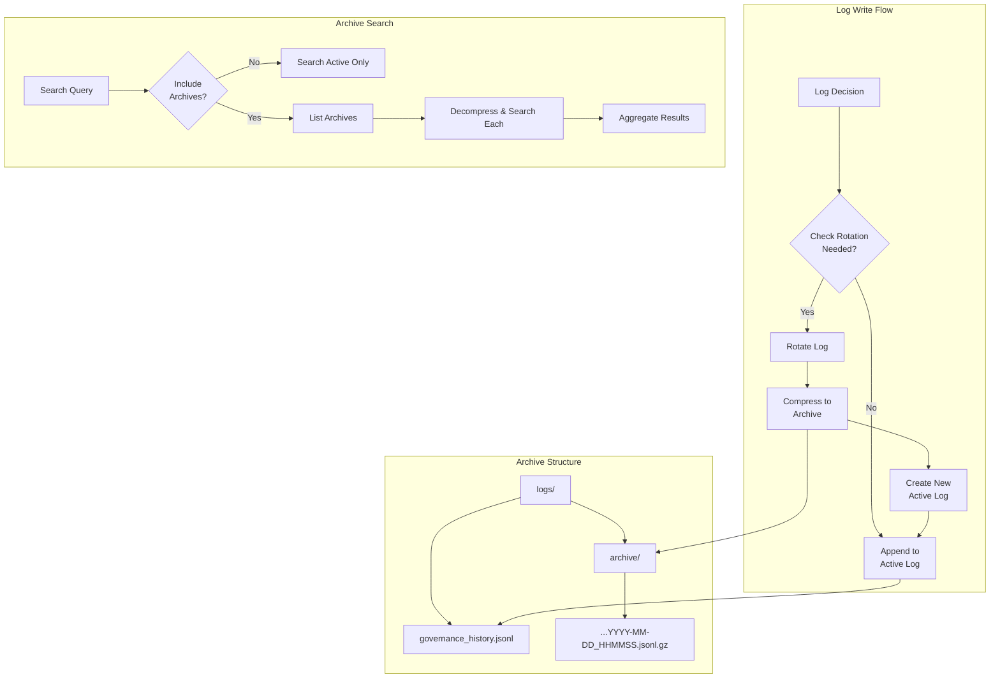

# LLD Finalized

Path: C:\Users\mcwiz\Projects\AgentOS\docs\lld\active\LLD-051.md
Status: APPROVED
Reviews: 1

---

# 151 - Feature: Audit Log Rotation and Archiving

<!-- Template Metadata
Last Updated: 2025-01-10
Updated By: LLD Creation
Update Reason: Initial creation for audit log rotation feature
-->

## 1. Context & Goal
* **Issue:** #51
* **Objective:** Implement automatic rotation and archiving of `governance_history.jsonl` to prevent unbounded growth and preserve historical data.
* **Status:** Draft
* **Related Issues:** #50 - Implement Governance Node & Audit Logger (parent)

### Open Questions
*Questions that need clarification before or during implementation. Remove when resolved.*

- [ ] Should rotation be triggered on write (lazy) or via scheduled task (eager)?
- [ ] What is the retention period for archived files (if any)?
- [ ] Should archives be searchable in real-time or only via explicit archive search?

## 2. Proposed Changes

*This section is the **source of truth** for implementation. Describe exactly what will be built.*

### 2.1 Files Changed

| File | Change Type | Description |
|------|-------------|-------------|
| `src/chronicler/audit/log_rotator.py` | Add | Core rotation and archiving logic |
| `src/chronicler/audit/rotation_config.py` | Add | Configuration for rotation thresholds |
| `src/chronicler/audit/audit_logger.py` | Modify | Integrate rotation check on write |
| `scripts/view_audit.py` | Modify | Add archive search capability |
| `tests/audit/test_log_rotator.py` | Add | Unit tests for rotation logic |
| `tests/audit/test_archive_search.py` | Add | Tests for archive search functionality |

### 2.2 Dependencies

```toml
# pyproject.toml additions (if any)
# No new dependencies - using stdlib gzip and pathlib
```

### 2.3 Data Structures

```python
# Pseudocode - NOT implementation
class RotationConfig(TypedDict):
    max_size_bytes: int         # Size threshold for rotation (default 10MB)
    max_age_hours: int          # Age threshold for rotation (default 24)
    archive_dir: str            # Path to archive directory
    compress: bool              # Whether to gzip archives (default True)
    retention_days: int | None  # Days to keep archives (None = forever)

class RotationResult(TypedDict):
    rotated: bool               # Whether rotation occurred
    archive_path: str | None    # Path to created archive (if rotated)
    original_size: int          # Size of file before rotation
    compressed_size: int | None # Size after compression (if applicable)

class ArchiveSearchResult(TypedDict):
    archive_path: str           # Path to the archive file
    entries: list[dict]         # Matching log entries
    match_count: int            # Number of matches in this archive
```

### 2.4 Function Signatures

```python
# src/chronicler/audit/log_rotator.py

def should_rotate(
    log_path: Path,
    config: RotationConfig
) -> tuple[bool, str]:
    """Check if log file needs rotation. Returns (should_rotate, reason)."""
    ...

def rotate_log(
    log_path: Path,
    config: RotationConfig
) -> RotationResult:
    """Rotate log file to archive with optional compression."""
    ...

def generate_archive_name(
    base_name: str,
    timestamp: datetime | None = None
) -> str:
    """Generate archive filename with timestamp pattern."""
    ...

def compress_file(
    source: Path,
    dest: Path
) -> int:
    """Compress file using gzip. Returns compressed size."""
    ...

def cleanup_old_archives(
    archive_dir: Path,
    retention_days: int,
    dry_run: bool = False
) -> list[Path]:
    """Remove archives older than retention period. Returns deleted paths."""
    ...

# src/chronicler/audit/audit_logger.py (modifications)

def log_decision(
    self,
    decision: GovernanceDecision,
    check_rotation: bool = True
) -> None:
    """Log decision and optionally check if rotation needed."""
    ...

# scripts/view_audit.py (modifications)

def search_archives(
    archive_dir: Path,
    query: dict,
    date_range: tuple[datetime, datetime] | None = None
) -> list[ArchiveSearchResult]:
    """Search across archived log files."""
    ...

def decompress_and_search(
    archive_path: Path,
    query: dict
) -> list[dict]:
    """Decompress archive and search for matching entries."""
    ...
```

### 2.5 Logic Flow (Pseudocode)

```
=== Rotation Check (on write) ===
1. Receive log entry to write
2. Check if rotation needed:
   a. Get current log file size
   b. Get file creation/modification time
   c. IF size > max_size_bytes OR age > max_age_hours THEN
      - Trigger rotation
3. Write entry to (possibly new) log file

=== Rotation Process ===
1. Generate archive filename with timestamp
2. Ensure archive directory exists
3. IF compress enabled THEN
   - Read original file
   - Write compressed to archive_dir/governance_history_YYYY-MM-DD_HHMMSS.jsonl.gz
   ELSE
   - Move file to archive_dir/governance_history_YYYY-MM-DD_HHMMSS.jsonl
4. Create new empty log file
5. IF retention_days set THEN
   - Scan archive directory for old files
   - Delete files older than retention threshold
6. Return RotationResult

=== Archive Search ===
1. Receive search query and optional date range
2. List archive files in archive directory
3. IF date_range specified THEN
   - Filter archives by filename date pattern
4. FOR each matching archive:
   a. IF compressed THEN decompress to memory
   b. Parse JSONL entries
   c. Filter entries matching query
   d. Collect results
5. Return aggregated ArchiveSearchResult list
```

### 2.6 Technical Approach

* **Module:** `src/chronicler/audit/`
* **Pattern:** Strategy pattern for compression (allows future alternatives)
* **Key Decisions:** 
  - Lazy rotation (check on write) to avoid scheduled task complexity
  - Gzip compression for space efficiency with fast decompression
  - ISO 8601 timestamp in filenames for natural sorting
  - In-memory decompression for searches to avoid temp files

### 2.7 Architecture Decisions

| Decision | Options Considered | Choice | Rationale |
|----------|-------------------|--------|-----------|
| Rotation trigger | Lazy (on-write), Eager (scheduled) | Lazy | Simpler, no external scheduler needed, rotation happens naturally |
| Compression format | gzip, zstd, lz4, none | gzip | Stdlib support, good compression ratio, universally readable |
| Archive naming | UUID, sequential, timestamp | Timestamp | Human-readable, sortable, date range filtering via filename |
| Search strategy | Index file, full scan | Full scan | Simpler, archives are small enough post-compression |
| File locking | fcntl, filelock, none | fcntl | Prevent concurrent rotation issues, stdlib available |

**Architectural Constraints:**
- Must integrate with existing `audit_logger.py` from #50
- Cannot introduce external dependencies (use stdlib only)
- Must handle concurrent write attempts safely
- Archives must be readable without special tooling (gzip is universal)

## 3. Requirements

*What must be true when this is done. These become acceptance criteria.*

1. Logs rotate automatically when file exceeds 10MB (configurable)
2. Logs rotate automatically when file age exceeds 24 hours (configurable)
3. Archived files are compressed with gzip by default
4. Archive naming follows pattern: `governance_history_YYYY-MM-DD_HHMMSS.jsonl.gz`
5. Archives are stored in `logs/archive/` directory
6. `view_audit.py` can search across both active log and archives
7. Rotation is atomic (no data loss on failure)
8. Optional retention policy can auto-delete old archives

## 4. Alternatives Considered

| Option | Pros | Cons | Decision |
|--------|------|------|----------|
| Lazy rotation (on write) | Simple, no scheduler, immediate | Slight latency on write that triggers rotation | **Selected** |
| Scheduled rotation (cron) | Predictable timing, no write latency | Requires external scheduler, may rotate empty files | Rejected |
| Python's logging.handlers.RotatingFileHandler | Built-in, well-tested | Designed for text logs, not JSONL; numbering scheme less intuitive | Rejected |
| External log rotation (logrotate) | System-standard, powerful | External dependency, Linux-specific, configuration separate from code | Rejected |
| No compression | Simpler, faster writes | 5-10x larger archives, more disk usage | Rejected |
| zstd compression | Better ratio, faster | Requires external dependency | Rejected |

**Rationale:** Lazy rotation with gzip provides the best balance of simplicity, portability, and efficiency. The slight latency on rotation-triggering writes is acceptable given rotation is infrequent (daily or ~10MB).

## 5. Data & Fixtures

### 5.1 Data Sources

| Attribute | Value |
|-----------|-------|
| Source | `logs/governance_history.jsonl` (local file) |
| Format | JSONL (JSON Lines) |
| Size | Variable, rotates at ~10MB |
| Refresh | Continuous append, rotate on threshold |
| Copyright/License | Project-generated data, MIT |

### 5.2 Data Pipeline

```
AuditLogger ──append──► governance_history.jsonl ──rotate──► archive/governance_history_TIMESTAMP.jsonl.gz
                                                                          │
                                                                          ▼
                                                              (optional) cleanup after retention
```

### 5.3 Test Fixtures

| Fixture | Source | Notes |
|---------|--------|-------|
| Sample JSONL log (1KB) | Generated | Small file for basic tests |
| Sample JSONL log (15MB) | Generated | Exceeds threshold for rotation tests |
| Pre-compressed archive | Generated | Test decompression and search |
| Corrupted gzip file | Generated | Test error handling |
| Old archive (90 days) | Generated with backdated timestamp | Test retention cleanup |

### 5.4 Deployment Pipeline

**Dev → Test → Production:**
- Configuration loaded from environment or config file
- Default thresholds suitable for production
- Tests use isolated temp directories
- No data migration needed (new feature)

**If data source is external:** N/A - All data is internally generated.

## 6. Diagram

### 6.1 Mermaid Quality Gate

Before finalizing any diagram, verify in [Mermaid Live Editor](https://mermaid.live) or GitHub preview:

- [x] **Simplicity:** Similar components collapsed (per 0006 §8.1)
- [x] **No touching:** All elements have visual separation (per 0006 §8.2)
- [x] **No hidden lines:** All arrows fully visible (per 0006 §8.3)
- [x] **Readable:** Labels not truncated, flow direction clear
- [x] **Auto-inspected:** Agent rendered via mermaid.ink and viewed (per 0006 §8.5)

**Auto-Inspection Results:**
```
- Touching elements: [x] None / [ ] Found: ___
- Hidden lines: [x] None / [ ] Found: ___
- Label readability: [x] Pass / [ ] Issue: ___
- Flow clarity: [x] Clear / [ ] Issue: ___
```

### 6.2 Diagram



## 7. Security & Safety Considerations

### 7.1 Security

| Concern | Mitigation | Status |
|---------|------------|--------|
| Log tampering | File permissions (0640), separate archive directory | Addressed |
| Path traversal in archive names | Sanitize timestamps, reject non-standard chars | Addressed |
| Symlink attacks | Resolve real paths before operations | Addressed |
| Information disclosure | Archives inherit parent directory permissions | Addressed |

### 7.2 Safety

| Concern | Mitigation | Status |
|---------|------------|--------|
| Data loss during rotation | Atomic operations: compress to temp, then rename | Addressed |
| Disk full during compression | Check available space before rotation, fail gracefully | Addressed |
| Concurrent rotation attempts | File locking with fcntl | Addressed |
| Accidental archive deletion | Retention cleanup requires explicit configuration | Addressed |
| Corrupted archive | Validate gzip integrity after write | Addressed |

**Fail Mode:** Fail Closed - If rotation fails, keep original log file intact and continue appending. Log rotation failure as warning.

**Recovery Strategy:** 
1. On rotation failure, original log is preserved
2. Retry rotation on next write
3. If repeated failures, alert operator via log warning
4. Manual rotation possible via CLI command

## 8. Performance & Cost Considerations

### 8.1 Performance

| Metric | Budget | Approach |
|--------|--------|----------|
| Rotation latency | < 2s for 10MB file | Streaming compression, no full file load |
| Search latency (single archive) | < 500ms for 10MB compressed | Streaming decompression |
| Memory during rotation | < 64MB | Stream-based, 1MB chunks |
| Memory during search | < 128MB | Process one archive at a time |

**Bottlenecks:** 
- Archive search across many files scales linearly
- Large date ranges may require many decompressions
- Consider index file for future if search becomes slow

### 8.2 Cost Analysis

| Resource | Unit Cost | Estimated Usage | Monthly Cost |
|----------|-----------|-----------------|--------------|
| Disk storage (archives) | ~$0.02/GB | ~100MB/month compressed | ~$0.002 |
| CPU (compression) | Negligible | ~1 rotation/day | ~$0 |
| I/O (search) | Negligible | Ad-hoc searches | ~$0 |

**Cost Controls:**
- [x] Retention policy prevents unbounded storage growth
- [x] Compression reduces storage 5-10x
- [x] No external API calls

**Worst-Case Scenario:** 10x usage = 1GB/month compressed = ~$0.02/month. 100x = negligible concern.

## 9. Legal & Compliance

| Concern | Applies? | Mitigation |
|---------|----------|------------|
| PII/Personal Data | No | Governance logs contain agent decisions, not personal data |
| Third-Party Licenses | No | Using stdlib only |
| Terms of Service | N/A | No external services |
| Data Retention | Yes | Configurable retention period, default infinite |
| Export Controls | No | No restricted data/algorithms |

**Data Classification:** Internal

**Compliance Checklist:**
- [x] No PII stored without consent (no PII in governance logs)
- [x] All third-party licenses compatible with project license (stdlib only)
- [x] External API usage compliant with provider ToS (no external APIs)
- [x] Data retention policy documented (configurable via `retention_days`)

## 10. Verification & Testing

### 10.1 Test Scenarios

| ID | Scenario | Type | Input | Expected Output | Pass Criteria |
|----|----------|------|-------|-----------------|---------------|
| 010 | Rotation triggered by size threshold | Auto | 15MB log file, 10MB threshold | File rotated, archive created | Archive exists, new log < 10MB |
| 020 | Rotation triggered by age threshold | Auto | 25-hour-old file, 24h threshold | File rotated, archive created | Archive exists, new log created |
| 030 | No rotation when under thresholds | Auto | 5MB file, 12 hours old | No rotation | Original file unchanged |
| 040 | Archive compression | Auto | 10MB JSONL | Compressed archive | Archive size < 2MB (>5x ratio) |
| 050 | Archive naming pattern | Auto | Rotation at 2025-01-15 10:30:00 | Named correctly | Filename matches YYYY-MM-DD_HHMMSS pattern |
| 060 | Search active log only | Auto | Query, archives=False | Results from active only | No archive entries returned |
| 070 | Search includes archives | Auto | Query, archives=True | Results from all sources | Archive matches included |
| 080 | Search with date range filter | Auto | Query, date range 7 days | Filtered results | Only matching date archives searched |
| 090 | Concurrent write during rotation | Auto | Two simultaneous writes | Both succeed | No data loss, lock serializes |
| 100 | Rotation with disk full | Auto | Mock full disk | Graceful failure | Original preserved, warning logged |
| 110 | Corrupted archive handling | Auto | Invalid gzip file | Skip with warning | Search continues, error logged |
| 120 | Retention cleanup | Auto | Archives >90 days, retention=30 | Old archives deleted | Only recent archives remain |
| 130 | Empty log file rotation | Auto | 0-byte file, age threshold | No rotation | Skip empty files |
| 140 | Archive directory creation | Auto | Non-existent archive dir | Dir created | Rotation succeeds |

### 10.2 Test Commands

```bash
# Run all automated tests
poetry run pytest tests/audit/test_log_rotator.py tests/audit/test_archive_search.py -v

# Run only fast/mocked tests (exclude live)
poetry run pytest tests/audit/ -v -m "not live"

# Run with coverage
poetry run pytest tests/audit/ -v --cov=src/chronicler/audit --cov-report=term-missing
```

### 10.3 Manual Tests (Only If Unavoidable)

N/A - All scenarios automated.

## 11. Risks & Mitigations

| Risk | Impact | Likelihood | Mitigation |
|------|--------|------------|------------|
| File locking not portable across all systems | Med | Low | Use fcntl with fallback to simple flag file |
| Very large archives slow search | Med | Med | Document recommendation for reasonable retention periods |
| Clock skew affects age-based rotation | Low | Low | Use monotonic time for age calculation |
| Archive search misses edge cases in date filtering | Med | Low | Comprehensive date boundary tests |
| Compression ratio varies by content | Low | Med | Document expected ratios, monitor actual |

## 12. Definition of Done

### Code
- [ ] Implementation complete and linted
- [ ] Code comments reference this LLD

### Tests
- [ ] All test scenarios pass
- [ ] Test coverage meets threshold (>90%)

### Documentation
- [ ] LLD updated with any deviations
- [ ] Implementation Report (0103) completed
- [ ] Test Report (0113) completed if applicable

### Review
- [ ] Code review completed
- [ ] User approval before closing issue

---

## Appendix: Review Log

*Track all review feedback with timestamps and implementation status.*

### Review Summary

| Review | Date | Verdict | Key Issue |
|--------|------|---------|-----------|
| - | - | - | Awaiting initial review |

**Final Status:** APPROVED
<!-- Note: This field is auto-updated to APPROVED by the workflow when finalized -->