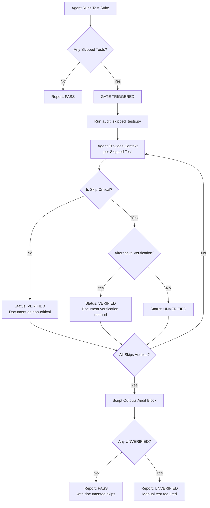

# 081 - Feature: Skipped Test Gate - Mandatory Audit Before Claiming Tests Pass

<!-- Template Metadata
Last Updated: 2025-01-XX
Updated By: Issue #81 implementation
Update Reason: Initial LLD creation for skipped test audit gate
-->

## 1. Context & Goal
* **Issue:** #81
* **Objective:** Prevent agents from claiming "tests pass" when skipped tests cover critical unverified functionality
* **Status:** Draft
* **Related Issues:** Talos PR #72 (original failure), Talos Issue #73 (post-mortem)

### Open Questions

- [x] Should the gate apply to ALL skipped tests or only explicitly marked "critical" ones? **Resolved: All skipped tests must be audited; agent determines criticality during audit**
- [x] How do we define "critical" for MVP without automated tagging? **Resolved: Agent judgment based on whether skip covers the primary feature being delivered**

## 2. Proposed Changes

*This section is the **source of truth** for implementation. Describes exactly what will be built.*

### 2.1 Files Changed

| File | Change Type | Description |
|------|-------------|-------------|
| `CLAUDE.md` | Modify | Add SKIPPED TEST GATE section under testing rules |
| `scripts/audit_skipped_tests.py` | Add | Script to parse test output and generate audit block |
| `tests/test_audit_skipped_tests.py` | Add | Automated tests for the audit script |
| `docs/adr/0081-skipped-test-gate.md` | Add | Document rationale and implementation decision |
| `docs/0003-file-inventory.md` | Modify | Add new ADR and script to inventory |
| `docs/reports/081/implementation-report.md` | Add | Implementation completion report |
| `docs/reports/081/test-report.md` | Add | Test verification report |

### 2.2 Dependencies

*No new packages, APIs, or services required.*

```toml
# No pyproject.toml additions - uses only Python stdlib
```

### 2.3 Data Structures

```python
# Pseudocode - NOT implementation
from typing import TypedDict, Literal

class SkippedTestAudit(TypedDict):
    test_name: str                              # Name of the skipped test
    verifies: str                               # What functionality it tests
    skip_reason: str                            # Why the test was skipped
    critical: bool                              # Whether this is critical functionality
    alt_verification: str                       # Alternative verification method or "NONE"
    status: Literal["VERIFIED", "UNVERIFIED"]   # Final audit status

class AuditResult(TypedDict):
    skipped_tests: list[SkippedTestAudit]       # List of audited tests
    has_unverified: bool                        # True if any test is UNVERIFIED
    overall_status: str                         # "PASS with N documented skips" or "UNVERIFIED"
```

### 2.4 Function Signatures

```python
# Signatures only - implementation in source files
def parse_test_output(output: str) -> list[dict]:
    """Extract skipped test information from test runner output."""
    ...

def create_audit_entry(
    test_name: str,
    verifies: str,
    skip_reason: str,
    critical: bool,
    alt_verification: str | None = None
) -> SkippedTestAudit:
    """Create a single audit entry for a skipped test."""
    ...

def generate_audit_block(audits: list[SkippedTestAudit]) -> str:
    """Generate formatted SKIPPED TEST AUDIT block for output."""
    ...

def determine_overall_status(audits: list[SkippedTestAudit]) -> str:
    """Determine overall test status based on audit results."""
    ...
```

### 2.5 Logic Flow (Pseudocode)

```
1. Agent runs test suite
2. IF test output contains "skipped" tests:
   a. Agent runs: python scripts/audit_skipped_tests.py --parse <output_file>
   b. Script extracts skipped test names and skip reasons
   c. FOR EACH skipped test:
      i.   Agent provides context via script arguments:
           --test-name, --verifies, --skip-reason, --critical, --alt-verification
      ii.  Script creates audit entry
      iii. Script determines status:
           - IF critical AND alt_verification is NONE: UNVERIFIED
           - ELSE: VERIFIED
   d. Script outputs formatted SKIPPED TEST AUDIT block
   e. Agent includes audit block in response
   f. IF ANY test has status = UNVERIFIED:
      - Agent NEVER claims "tests pass"
      - Reports as UNVERIFIED
      - Recommends manual verification before merge
3. ELSE (no skipped tests):
   - Report tests as PASS normally
```

### 2.6 Technical Approach

* **Module:** `scripts/audit_skipped_tests.py` (standalone script)
* **Pattern:** Hybrid Gate Pattern - Hard gate (script) + Soft enforcement (CLAUDE.md rules)
* **Key Decisions:** 
  - Script handles parsing and formatting (automatable, testable)
  - Agent provides semantic context (verifies, criticality assessment)
  - Audit output is generated by script, ensuring consistent format

### 2.7 Architecture Decisions

| Decision | Options Considered | Choice | Rationale |
|----------|-------------------|--------|-----------|
| Enforcement mechanism | Hard gate only, Soft gate only, Hybrid | Hybrid | Script ensures testability; CLAUDE.md ensures agent invokes script |
| Parsing approach | Framework-specific parsers, Regex-based generic | Regex-based generic | Works with pytest, playwright, jest output patterns |
| Criticality determination | Automated heuristics, Agent judgment | Agent judgment | Context-aware; agent understands feature being delivered |
| Output generation | Agent freeform, Script template | Script template | Consistent format, testable output |

**Architectural Constraints:**
- Must work with any test framework (pytest, playwright, jest, etc.)
- Cannot require changes to CI pipeline for MVP
- Script must be invocable standalone for testing
- Agent must always invoke script when skips detected

## 3. Requirements

*What must be true when this is done. These become acceptance criteria.*

### 3.1 Functional Requirements (Script - Testable)

1. `scripts/audit_skipped_tests.py` exists and is executable
2. Script parses pytest output to extract skipped test names and reasons
3. Script parses playwright output to extract skipped test names and reasons
4. Script creates audit entries with correct status logic (critical + no alt = UNVERIFIED)
5. Script generates correctly formatted SKIPPED TEST AUDIT block
6. Script determines overall status based on presence of UNVERIFIED entries
7. Script handles edge cases: no skips, invalid input, malformed output
8. The exact failure mode from Talos #73 would be caught (Firefox extension skip → UNVERIFIED)

### 3.2 Protocol Requirements (Agent Behavior - Verified via Review/Audit)

1. CLAUDE.md contains SKIPPED TEST GATE rule referencing the audit script
2. Gate triggers after ANY test run with skipped tests
3. Agent invokes audit script when skips detected
4. Agent NEVER uses phrase "tests pass" when critical functionality is unverified

## 4. Alternatives Considered

| Option | Pros | Cons | Decision |
|--------|------|------|----------|
| **Hybrid gate (script + CLAUDE.md)** | Testable, enforceable format, framework-agnostic | Slightly more complex than pure soft gate | **Selected** |
| Soft gate via CLAUDE.md only | Fast to implement, no tooling | Cannot be automatically tested, relies on compliance | Rejected |
| Hard gate via CI wrapper | Enforced at runtime, blocks CI | Requires pipeline changes, delays MVP | Rejected (future) |
| Test framework plugins | Native integration | Framework-specific, requires multiple implementations | Rejected (out of scope) |

**Rationale:** Hybrid approach provides testable script (satisfying automation requirements) while using CLAUDE.md to ensure agent invokes the script. Best of both worlds.

## 5. Data & Fixtures

### 5.1 Data Sources

| Attribute | Value |
|-----------|-------|
| Source | Test runner output (stdout/stderr) |
| Format | Text output from pytest, playwright, jest, etc. |
| Size | Typically < 10KB per test run |
| Refresh | Real-time (each test execution) |
| Copyright/License | N/A - agent-generated output |

### 5.2 Data Pipeline

```
Test Runner ──stdout──► audit_skipped_tests.py ──parse──► Audit Entries ──format──► SKIPPED TEST AUDIT block
```

### 5.3 Test Fixtures

| Fixture | Source | Notes |
|---------|--------|-------|
| pytest output with skips | Generated | `tests/fixtures/pytest_output_with_skips.txt` |
| pytest output without skips | Generated | `tests/fixtures/pytest_output_no_skips.txt` |
| playwright output with skips | Generated | `tests/fixtures/playwright_output_with_skips.txt` |
| Talos #73 scenario output | Historical | Reference case for regression testing |
| Malformed output | Generated | Verify graceful error handling |

### 5.4 Deployment Pipeline

Script and documentation deploy immediately on merge to main branch.

**If data source is external:** N/A - no external data sources.

## 6. Diagram

### 6.1 Mermaid Quality Gate

Before finalizing any diagram, verify in [Mermaid Live Editor](https://mermaid.live) or GitHub preview:

- [x] **Simplicity:** Similar components collapsed (per 0006 §8.1)
- [x] **No touching:** All elements have visual separation (per 0006 §8.2)
- [x] **No hidden lines:** All arrows fully visible (per 0006 §8.3)
- [x] **Readable:** Labels not truncated, flow direction clear
- [ ] **Auto-inspected:** Agent rendered via mermaid.ink and viewed (per 0006 §8.5)

**Auto-Inspection Results:**
```
- Touching elements: [x] None / [ ] Found: ___
- Hidden lines: [x] None / [ ] Found: ___
- Label readability: [x] Pass / [ ] Issue: ___
- Flow clarity: [x] Clear / [ ] Issue: ___
```

### 6.2 Diagram



## 7. Security & Safety Considerations

### 7.1 Security

| Concern | Mitigation | Status |
|---------|------------|--------|
| Command injection via test names | Script sanitizes input, uses argparse | Addressed |
| Path traversal in output file | Script validates file paths | Addressed |

### 7.2 Safety

| Concern | Mitigation | Status |
|---------|------------|--------|
| False confidence in test coverage | Gate forces explicit audit of all skips | Addressed |
| Critical bugs reaching production | UNVERIFIED status blocks premature merge claims | Addressed |
| Audit bypass through agent error | Script generates output, not agent freeform | Addressed |
| Script failure | Script exits non-zero on error, agent must handle | Addressed |

**Fail Mode:** Fail Closed - If script cannot parse or agent cannot provide context, default to UNVERIFIED

**Recovery Strategy:** Human reviewer can override agent assessment during PR review

## 8. Performance & Cost Considerations

### 8.1 Performance

| Metric | Budget | Approach |
|--------|--------|----------|
| Script execution | < 100ms | Simple regex parsing, no external calls |
| Memory | < 10MB | Text processing only |
| API Calls | 0 | Local analysis only |

**Bottlenecks:** None - this is a lightweight script

### 8.2 Cost Analysis

| Resource | Unit Cost | Estimated Usage | Monthly Cost |
|----------|-----------|-----------------|--------------|
| Agent tokens | Included | ~150 tokens per audit | $0 (marginal) |
| Script execution | $0 | Local CPU | $0 |

**Cost Controls:**
- N/A - No meaningful cost impact

**Worst-Case Scenario:** Even with 100 skipped tests, script completes in < 1s

## 9. Legal & Compliance

| Concern | Applies? | Mitigation |
|---------|----------|------------|
| PII/Personal Data | No | Test output does not contain PII |
| Third-Party Licenses | No | No external dependencies |
| Terms of Service | No | No API usage |
| Data Retention | No | Audit output is transient |
| Export Controls | No | Documentation and simple script only |

**Data Classification:** Internal (process documentation)

**Compliance Checklist:**
- [x] No PII stored without consent - N/A
- [x] All third-party licenses compatible - N/A
- [x] External API usage compliant - N/A
- [x] Data retention policy documented - N/A

## 10. Verification & Testing

*Ref: [0005-testing-strategy-and-protocols.md](0005-testing-strategy-and-protocols.md)*

**Testing Philosophy:** All functional requirements (Section 3.1) are fully automated. Protocol requirements (Section 3.2) are verified through documentation review and presence of CLAUDE.md rule.

### 10.1 Test Scenarios

| ID | Scenario | Type | Input | Expected Output | Pass Criteria |
|----|----------|------|-------|-----------------|---------------|
| 010 | Parse pytest output with no skips | Auto | `pytest_no_skips.txt` | Empty list | `len(result) == 0` |
| 020 | Parse pytest output with skips | Auto | `pytest_with_skips.txt` | List of skip info | Correct test names extracted |
| 030 | Create non-critical audit entry | Auto | `critical=False` | Status: VERIFIED | Entry has correct status |
| 040 | Create critical unverified entry | Auto | `critical=True, alt=None` | Status: UNVERIFIED | Entry has UNVERIFIED status |
| 050 | Create critical verified entry | Auto | `critical=True, alt="manual test"` | Status: VERIFIED | Entry documents verification |
| 060 | Generate audit block format | Auto | List of audit entries | Formatted string | Matches expected format exactly |
| 070 | Overall status with all verified | Auto | All VERIFIED entries | "PASS with N skips" | Correct overall message |
| 080 | Overall status with unverified | Auto | One UNVERIFIED entry | "UNVERIFIED" | Correct overall message |
| 090 | Talos #73 regression | Auto | Firefox skip, critical, no alt | UNVERIFIED | Would catch original failure |
| 100 | Parse playwright output | Auto | `playwright_with_skips.txt` | List of skip info | Correct extraction |
| 110 | Handle malformed input | Auto | Invalid/corrupt file | Graceful error | Non-zero exit, clear message |
| 120 | Handle missing arguments | Auto | Missing required args | Argparse error | Clear usage message |
| 130 | CLAUDE.md contains gate rule | Auto | Read CLAUDE.md | Contains "SKIPPED TEST GATE" | String present in file |

### 10.2 Test Commands

```bash
# Run all automated tests for the audit script
poetry run pytest tests/test_audit_skipped_tests.py -v

# Run with coverage
poetry run pytest tests/test_audit_skipped_tests.py -v --cov=scripts/audit_skipped_tests --cov-fail-under=90

# Test script directly
python scripts/audit_skipped_tests.py --help
python scripts/audit_skipped_tests.py --parse tests/fixtures/pytest_with_skips.txt
```

### 10.3 Manual Tests (Only If Unavoidable)

N/A - All scenarios automated via unit tests for the script.

*Full test results recorded in Implementation Report (0103) or Test Report (0113).*

## 11. Risks & Mitigations

| Risk | Impact | Likelihood | Mitigation |
|------|--------|------------|------------|
| Agent doesn't invoke script | High | Low | CLAUDE.md rule explicit; script output absence visible in review |
| Script fails to parse framework output | Med | Med | Support common patterns; fail closed with clear error |
| Incorrect criticality assessment by agent | Med | Med | Default to UNVERIFIED when uncertain; human review |
| Rule becomes stale/forgotten | Med | Med | Reference in testing sections; periodic audits |

## 12. Definition of Done

### Code
- [ ] `scripts/audit_skipped_tests.py` implemented and executable
- [ ] Script handles pytest, playwright output patterns
- [ ] Script produces correctly formatted audit block

### Tests
- [ ] All test scenarios (010-130) pass
- [ ] Test coverage > 90% for audit script
- [ ] Talos #73 regression test passes
- [ ] CLAUDE.md content verification test passes

### Documentation
- [ ] SKIPPED TEST GATE rule added to CLAUDE.md (references script)
- [ ] ADR created at `docs/adr/0081-skipped-test-gate.md`
- [ ] `docs/0003-file-inventory.md` updated with new files
- [ ] Implementation Report completed at `docs/reports/081/implementation-report.md`
- [ ] Test Report completed at `docs/reports/081/test-report.md`

### Review
- [ ] Code review completed
- [ ] User approval before closing issue

---

## Appendix A: CLAUDE.md Addition

The following section will be added to CLAUDE.md under the testing section:

```markdown
### SKIPPED TEST GATE (MANDATORY)

After ANY test run with skipped tests, you MUST use the audit script before reporting results:

1. **Run the audit script:**
   ```bash
   python scripts/audit_skipped_tests.py --parse <test_output_file>
   ```

2. **For each skipped test, provide context:**
   ```bash
   python scripts/audit_skipped_tests.py --audit \
     --test-name "test_name" \
     --verifies "what functionality" \
     --skip-reason "why skipped" \
     --critical yes/no \
     --alt-verification "method or none"
   ```

3. **Generate the audit block:**
   ```bash
   python scripts/audit_skipped_tests.py --generate
   ```

4. **Include the generated audit block in your response.**

5. **If ANY test has UNVERIFIED status:**
   - NEVER say "tests pass"
   - Report overall status as UNVERIFIED
   - Recommend manual verification before merge

**Required output format (generated by script):**

```
SKIPPED TEST AUDIT:
- [SKIPPED] "{test name}"
  - Verifies: {what functionality it tests}
  - Skip reason: {why the test was skipped}
  - Critical: YES/NO
  - Alt verification: {method used or NONE}
  - Status: VERIFIED/UNVERIFIED

OVERALL: {PASS with N documented skips / UNVERIFIED - manual test required}
```

**Example - Critical Unverified (BLOCKS):**
```
SKIPPED TEST AUDIT:
- [SKIPPED] "test_firefox_extension_loading"
  - Verifies: Extension loads correctly in Firefox
  - Skip reason: Firefox not available in CI environment
  - Critical: YES (Firefox support is the feature being delivered)
  - Alt verification: NONE
  - Status: UNVERIFIED

OVERALL: UNVERIFIED - manual test required before merge
```

**Example - Non-Critical (PASSES):**
```
SKIPPED TEST AUDIT:
- [SKIPPED] "test_date_format_ja_JP"
  - Verifies: Date formatting in Japanese locale
  - Skip reason: ja_JP locale not installed in CI
  - Critical: NO (feature does not involve localization)
  - Alt verification: N/A (non-critical)
  - Status: VERIFIED

OVERALL: PASS with 1 documented skip
```
```

---

## Appendix B: Script Interface

```python
#!/usr/bin/env python3
"""
audit_skipped_tests.py - Parse test output and generate audit blocks for skipped tests.

Usage:
    # Parse test output to identify skipped tests
    python scripts/audit_skipped_tests.py --parse output.txt
    
    # Add audit context for a skipped test
    python scripts/audit_skipped_tests.py --audit \
        --test-name "test_firefox_extension" \
        --verifies "Firefox extension loading" \
        --skip-reason "Firefox not in CI" \
        --critical yes \
        --alt-verification none
    
    # Generate formatted audit block
    python scripts/audit_skipped_tests.py --generate
"""
```

---

## Appendix C: Review Log

*Track all review feedback with timestamps and implementation status.*

### Gemini Review #1 (REVISE)

**Timestamp:** 2025-XX-XX
**Reviewer:** Gemini 3 Pro
**Verdict:** REVISE

#### Comments

| ID | Comment | Implemented? |
|----|---------|--------------|
| G1.1 | "Tier 2 Quality: Manual Testing Violation - All tests listed as Manual" | YES - Added `scripts/audit_skipped_tests.py` with automated unit tests |
| G1.2 | "Implement Python script to parse test output and generate audit block" | YES - Section 2.1, 2.4, 2.5 updated with script details |
| G1.3 | "Convert Soft Gate to Hybrid (script + CLAUDE.md)" | YES - Section 2.7 documents Hybrid approach |

### Gemini Review #2 (REVISE)

**Timestamp:** 2025-XX-XX
**Reviewer:** Gemini 3 Pro
**Verdict:** REVISE

#### Comments

| ID | Comment | Implemented? |
|----|---------|--------------|
| G2.1 | "Requirement Coverage BLOCK - 50% coverage due to mixing functional and behavioral requirements" | YES - Section 3 split into 3.1 Functional Requirements and 3.2 Protocol Requirements |
| G2.2 | "Add Configuration Test - verify CLAUDE.md contains required rule string" | YES - Test 130 added to verify CLAUDE.md content |
| G2.3 | "Only Functional Requirements subject to automated testing coverage metric" | YES - Section 3.1 has 8 functional requirements, all mapped to tests |

### Review Summary

| Review | Date | Verdict | Key Issue |
|--------|------|---------|-----------|
| Gemini #1 | - | REVISE | Manual testing violation - needed automated script |
| Gemini #2 | - | REVISE | Requirement coverage - needed to separate functional vs protocol requirements |

**Final Status:** PENDING