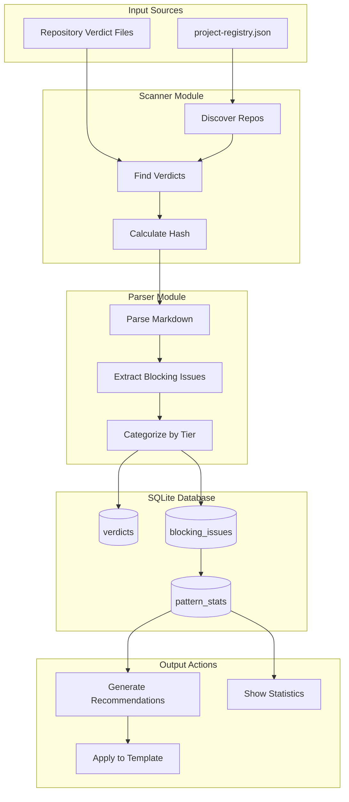

# 1XX - Feature: Verdict Analyzer - Template Improvement from Gemini Verdicts

## 1. Context & Goal
* **Issue:** #XX (to be assigned)
* **Objective:** Create a Python CLI tool that analyzes Gemini governance verdicts across repositories, extracts blocking patterns, and automatically improves LLD/issue templates.
* **Status:** Draft
* **Related Issues:** #94 (Janitor integration), #77 (Issue template)

## 2. Proposed Changes

*This section is the **source of truth** for implementation. Describe exactly what will be built.*

### 2.1 Files Changed

| File | Change Type | Description |
|------|-------------|-------------|
| `tools/verdict-analyzer.py` | Add | Main CLI entry point with argparse interface |
| `tools/verdict_analyzer/__init__.py` | Add | Package initialization |
| `tools/verdict_analyzer/parser.py` | Add | Parse verdict markdown files (LLD + Issue formats) |
| `tools/verdict_analyzer/database.py` | Add | SQLite operations (CRUD, migrations) |
| `tools/verdict_analyzer/patterns.py` | Add | Pattern extraction, normalization, and category mapping |
| `tools/verdict_analyzer/template_updater.py` | Add | Safe template modification with atomic writes |
| `tools/verdict_analyzer/scanner.py` | Add | Multi-repo verdict discovery |
| `tests/test_verdict_analyzer.py` | Add | Unit tests for all modules |
| `~/.agentos/verdicts.db` | Add | SQLite database (git-ignored) |

### 2.2 Dependencies

*New packages, APIs, or services required.*

```toml
# pyproject.toml additions (if any)
# No new dependencies - uses stdlib only
# sqlite3 - built-in
# hashlib - built-in
# argparse - built-in
# pathlib - built-in
# re - built-in
# json - built-in
# logging - built-in
```

**Logging Configuration:**

```python
# Configured in verdict-analyzer.py
import logging

def configure_logging(verbosity: int) -> None:
    """Configure logging based on -v/-vv flags.
    
    Args:
        verbosity: 0 = WARNING, 1 = INFO, 2+ = DEBUG
    """
    level = logging.WARNING
    if verbosity == 1:
        level = logging.INFO
    elif verbosity >= 2:
        level = logging.DEBUG
    
    logging.basicConfig(
        level=level,
        format='%(levelname)s: %(message)s'
    )
```

### 2.3 Data Structures

```python
# Pseudocode - NOT implementation
class VerdictRecord(TypedDict):
    id: int
    file_path: str          # Full path to verdict file
    repo: str               # Repository name
    issue_id: str | None    # Extracted issue number
    verdict_type: Literal['lld', 'issue']
    decision: Literal['APPROVED', 'BLOCK', 'REVISE']
    raw_content: str        # Full markdown content
    content_hash: str       # SHA256 for change detection
    first_seen_at: str      # ISO timestamp
    last_analyzed_at: str   # ISO timestamp

class BlockingIssue(TypedDict):
    id: int
    verdict_id: int         # FK to verdicts
    tier: Literal[1, 2, 3]  # Severity tier
    category: str           # Security, Safety, Cost, Legal, Quality, Architecture
    description: str        # The actual blocking issue text
    template_section: str | None  # Mapped section from 0102

class PatternStat(TypedDict):
    id: int
    category: str
    description_pattern: str  # Normalized pattern
    occurrence_count: int
    template_section: str | None

class Recommendation(TypedDict):
    section: str            # Template section to modify
    recommendation_type: Literal['checklist', 'guidance', 'example']
    content: str            # The content to inject
    pattern_count: int      # How many occurrences triggered this
    patterns: list[str]     # Source patterns
```

### 2.4 Function Signatures

```python
# verdict-analyzer.py (CLI arguments)
def create_parser() -> argparse.ArgumentParser:
    """
    Create argument parser with the following arguments:
    
    --scan              Scan verdicts from all repos
    --recommend         Generate recommendations for a template
    --stats             Show pattern frequencies and blocking categories
    --auto              Apply recommendations directly (default: dry-run)
    --template PATH     Path to template file for --recommend
    --min-occurrences N Minimum pattern frequency threshold (default: 2)
    --root PATH         Root directory containing project-registry.json
                        (default: current working directory)
    --registry PATH     Explicit path to project-registry.json
                        (overrides --root)
    --force-rescan      Ignore content hashes and force full database rebuild
    -v, --verbose       Increase logging verbosity (can be repeated: -vv)
    """
    ...

# parser.py
def parse_verdict_file(file_path: Path) -> VerdictRecord | None:
    """Parse a verdict markdown file and extract metadata."""
    ...

def extract_blocking_issues(content: str) -> list[BlockingIssue]:
    """Extract blocking issues from verdict content."""
    ...

def detect_verdict_type(content: str) -> Literal['lld', 'issue']:
    """Determine if verdict is for LLD or Issue based on content."""
    ...

# database.py
def init_database(db_path: Path) -> sqlite3.Connection:
    """Initialize database with schema, run migrations if needed."""
    ...

def upsert_verdict(conn: Connection, verdict: VerdictRecord) -> int:
    """Insert or update verdict, return verdict_id."""
    ...

def get_pattern_stats(conn: Connection, min_count: int = 2) -> list[PatternStat]:
    """Get aggregated pattern statistics above threshold."""
    ...

def verdict_needs_update(conn: Connection, file_path: str, content_hash: str) -> bool:
    """Check if verdict needs re-analysis (new or changed)."""
    ...

# patterns.py
def normalize_pattern(description: str) -> str:
    """Normalize blocking issue description for pattern matching.
    
    Uses exact string matching with case normalization and whitespace trimming.
    """
    ...

def categorize_issue(description: str) -> tuple[str, int]:
    """Determine category and tier from description text."""
    ...

def map_to_template_section(category: str) -> str | None:
    """Map category to 0102 template section header."""
    ...

# scanner.py
def discover_repos(registry_path: Path) -> list[Path]:
    """Discover repos from project-registry.json at specified path."""
    ...

def find_verdicts(repo_path: Path) -> list[Path]:
    """Find all verdict files in a repository."""
    ...

def scan_all_repos(repos: list[Path], conn: Connection, force_rescan: bool = False) -> ScanResult:
    """Scan all repos and populate database."""
    ...

# template_updater.py
def parse_template_sections(content: str) -> dict[str, str]:
    """Parse template into section headers and content."""
    ...

def generate_recommendations(stats: list[PatternStat]) -> list[Recommendation]:
    """Generate template recommendations from pattern stats."""
    ...

def apply_recommendations(
    template_path: Path,
    recommendations: list[Recommendation],
    dry_run: bool = True
) -> str:
    """Apply recommendations to template. Returns diff preview."""
    ...

def safe_write(path: Path, content: str) -> None:
    """Atomic write with backup (.bak) and temp file (.tmp)."""
    ...
```

### 2.5 Logic Flow (Pseudocode)

```
# --scan flow
1. Resolve registry path:
   a. IF --registry provided: use directly
   b. ELSE: join --root with 'project-registry.json'
2. Discover repos from resolved registry path
3. FOR each repo:
   a. Find verdict files in lineage/active, lineage/done, audit/done
   b. FOR each verdict file:
      i. Calculate content hash
      ii. IF --force-rescan OR verdict not in DB OR hash changed:
          - Parse verdict content
          - Log filename at DEBUG level if parsing fails
          - Extract blocking issues
          - Categorize and map to template sections
          - Upsert to database
4. Rebuild pattern_stats aggregation
5. Report: X verdicts scanned, Y new, Z updated

# --recommend flow
1. Load pattern stats from database (filtered by min_occurrences, default: 2)
2. Parse target template into sections
3. FOR each high-frequency pattern:
   a. Match to template section via category mapping (exact string matching)
   b. Generate appropriate recommendation:
      - Checklist item for actionable gaps
      - Guidance tip for common blockers
      - Example for specific scenarios
4. IF --auto:
   a. Apply recommendations with safe_write
   b. Show diff
   ELSE:
   a. Show preview only

# --stats flow
1. Query aggregated statistics from database
2. Display:
   - Total verdicts by decision type
   - Blocking issues by category
   - Top patterns by frequency
   - Template section coverage
```

### 2.6 Technical Approach

* **Module:** `tools/verdict_analyzer/`
* **Pattern:** CLI with subcommand-style flags, SQLite for persistence, safe file operations
* **Key Decisions:**
  - SQLite over JSON for query flexibility and RAG-readiness
  - Content hash for incremental scanning (avoid re-parsing unchanged files)
  - Atomic writes with backup for template safety
  - Exact string matching for pattern normalization (predictable, debuggable)
  - Default min_occurrences threshold of 2 for auto-applying recommendations
  - Sequential repo scanning (no concurrency) for simplicity and predictability

## 3. Requirements

*What must be true when this is done. These become acceptance criteria.*

1. CLI scans verdicts from all repos listed in project-registry.json
2. CLI accepts --root or --registry to locate project-registry.json
3. Verdicts are stored in SQLite with deduplication via content hash
4. Blocking issues are extracted and categorized by tier (1/2/3)
5. Pattern frequency statistics are available via --stats
6. Recommendations map to specific template sections in 0102
7. --recommend shows preview without modification (dry-run default)
8. --auto applies changes with .bak backup created first
9. Database location is ~/.agentos/verdicts.db (git-ignored)
10. Tool handles missing repos gracefully (warn, continue)
11. All file writes are atomic (tmp file + rename)
12. Verbose logging (-v/-vv) enables debugging of parsing errors

## 4. Alternatives Considered

| Option | Pros | Cons | Decision |
|--------|------|------|----------|
| SQLite database | Query flexibility, RAG-ready, incremental updates | Additional complexity | **Selected** |
| JSON file storage | Simple, human-readable | No queries, harder to aggregate | Rejected |
| Fuzzy pattern matching | Better pattern grouping | Less predictable, harder to debug | Rejected |
| Exact string matching | Predictable, debuggable | May miss similar patterns | **Selected** |
| In-memory processing | Fast, no persistence | Re-scans everything each run | Rejected |
| Direct template editing | Faster development | Risky without backup | Rejected |
| Atomic write with backup | Safe, recoverable | Slightly more code | **Selected** |
| Concurrent multi-repo scanning | Faster for large repo sets | Complexity, race conditions | Rejected |
| Sequential scanning | Simple, predictable | Slower for many repos | **Selected** |

**Rationale:** SQLite provides the query flexibility needed for pattern aggregation and future RAG integration, while exact matching keeps behavior predictable. Atomic writes with backup prevent template corruption. Sequential scanning avoids complexity without significant performance impact given the expected ~275 verdict count.

## 5. Data & Fixtures

*Per [0108-lld-pre-implementation-review.md](0108-lld-pre-implementation-review.md) - complete this section BEFORE implementation.*

### 5.1 Data Sources

| Attribute | Value |
|-----------|-------|
| Source | Local filesystem - verdict markdown files |
| Format | Markdown with structured sections |
| Size | ~275 verdicts across repos, ~50KB average |
| Refresh | On-demand via --scan |
| Copyright/License | Internal documentation, N/A |

### 5.2 Data Pipeline

```
Verdict Files ──scan──► SQLite DB ──query──► Pattern Stats ──recommend──► Template Updates
     │                      │
     └──content hash────────┘ (change detection)
```

### 5.3 Test Fixtures

| Fixture | Source | Notes |
|---------|--------|-------|
| Sample LLD verdict | Copied from docs/lineage/active/83-lld/003-verdict.md | Anonymized if needed |
| Sample Issue verdict | Copied from docs/lineage/active/100-lld/003-verdict.md | Anonymized if needed |
| Mock template | Subset of 0102 | Test section parsing |
| In-memory SQLite | Generated | Test database operations |

### 5.4 Deployment Pipeline

Local tool - no deployment pipeline. Database is user-local (~/.agentos/).

**If data source is external:** N/A - all data is local filesystem.

## 6. Diagram

### 6.1 Mermaid Quality Gate

Before finalizing any diagram, verify in [Mermaid Live Editor](https://mermaid.live) or GitHub preview:

- [x] **Simplicity:** Similar components collapsed (per 0006 §8.1)
- [x] **No touching:** All elements have visual separation (per 0006 §8.2)
- [x] **No hidden lines:** All arrows fully visible (per 0006 §8.3)
- [x] **Readable:** Labels not truncated, flow direction clear
- [ ] **Auto-inspected:** Agent rendered via mermaid.ink and viewed (per 0006 §8.5)

**Agent Auto-Inspection (MANDATORY):**

AI agents MUST render and view the diagram before committing:
1. Base64 encode diagram → fetch PNG from `https://mermaid.ink/img/{base64}`
2. Read the PNG file (multimodal inspection)
3. Document results below

**Auto-Inspection Results:**
```
- Touching elements: [ ] None / [x] Pending verification
- Hidden lines: [ ] None / [x] Pending verification
- Label readability: [ ] Pass / [x] Pending verification
- Flow clarity: [ ] Clear / [x] Pending verification
```

*Note: Browser navigation permission not available for auto-inspection. Manual verification required before merge.*

*Reference: [0006-mermaid-diagrams.md](0006-mermaid-diagrams.md)*

### 6.2 Diagram



## 7. Security Considerations

| Concern | Mitigation | Status |
|---------|------------|--------|
| Path traversal in verdict paths | All paths resolved via `pathlib.Path.resolve()` and verified to be relative to registry root using `is_relative_to()`. Reject any path that escapes the known repo directories. | TODO |
| SQL injection in pattern storage | Use parameterized queries exclusively | TODO |
| Template corruption | Atomic writes with .bak backup before modification | TODO |
| Sensitive data in verdicts | Database is local-only (~/.agentos/), git-ignored | Addressed |
| Arbitrary code in parsed markdown | Parse only structured sections, no eval | Addressed |

**Fail Mode:** Fail Closed - If parsing or writing fails, abort operation and preserve original files.

## 8. Performance Considerations

| Metric | Budget | Approach |
|--------|--------|----------|
| Initial scan (275 verdicts) | < 30s | Incremental via content hash |
| Subsequent scans | < 5s | Skip unchanged files |
| Pattern aggregation | < 1s | SQLite aggregation queries |
| Memory | < 50MB | Stream file processing, don't load all in memory |

**Bottlenecks:** Initial scan of all repos may be slow; content hashing enables incremental updates. Use --force-rescan flag to ignore content hashes and force full database rebuild if schema changes or for debugging.

## 9. Risks & Mitigations

| Risk | Impact | Likelihood | Mitigation |
|------|--------|------------|------------|
| Template structure changes break parser | High | Low | Version detection, graceful fallback |
| Verdict format varies across repos | Medium | Medium | Flexible regex parsing, warn on unparseable |
| Pattern normalization loses nuance | Medium | Medium | Keep raw descriptions, normalize for grouping only |
| Database corruption | High | Low | Atomic writes, backup before operations |
| Too many recommendations overwhelm template | Medium | Medium | Cap recommendations per section, prioritize by frequency |

## 10. Verification & Testing

*Ref: [0005-testing-strategy-and-protocols.md](0005-testing-strategy-and-protocols.md)*

**Testing Philosophy:** Strive for 100% automated test coverage. Manual tests are a last resort for scenarios that genuinely cannot be automated (e.g., visual inspection, hardware interaction). Every scenario marked "Manual" requires justification.

### 10.1 Test Scenarios

| ID | Scenario | Type | Input | Expected Output | Pass Criteria |
|----|----------|------|-------|-----------------|---------------|
| 010 | Parse LLD verdict | Auto | Sample LLD verdict markdown | VerdictRecord with correct fields | All fields populated, type='lld' |
| 020 | Parse Issue verdict | Auto | Sample Issue verdict markdown | VerdictRecord with correct fields | All fields populated, type='issue' |
| 030 | Extract blocking issues | Auto | Verdict with Tier 1/2/3 issues | List of BlockingIssue | Correct tier, category, description |
| 040 | Content hash change detection | Auto | Same file, modified file | needs_update=False, True | Correct boolean return |
| 050 | Pattern normalization | Auto | Various descriptions | Normalized patterns | Consistent output for similar inputs |
| 060 | Category mapping | Auto | All categories | Correct template sections | Matches CATEGORY_TO_SECTION |
| 070 | Template section parsing | Auto | 0102 template | Dict of 11 sections | All sections extracted |
| 080 | Recommendation generation | Auto | Pattern stats with high counts | Recommendations list | Type, section, content populated |
| 090 | Atomic write with backup | Auto | Template path + content | .bak created, content written | Both files exist, content correct |
| 100 | Multi-repo discovery | Auto | Mock project-registry.json | List of repo paths | All repos found |
| 110 | Missing repo handling | Auto | Registry with nonexistent repo | Warning logged, continue | No crash, other repos scanned |
| 120 | Database migration | Auto | Old schema DB | Updated schema | New columns exist |
| 130 | Dry-run mode (default) | Auto | --recommend without --auto | Preview only, no file changes | Template unchanged |
| 140 | Stats output formatting | Auto | Database with verdicts | Formatted statistics | Readable output |
| 150 | --root argument resolution | Auto | --root /path/to/dir | Registry found at /path/to/dir/project-registry.json | Correct path resolution |
| 160 | --registry argument override | Auto | --registry /custom/path.json | Registry found at explicit path | --registry overrides --root |
| 170 | --force-rescan flag | Auto | DB with existing verdicts | All verdicts re-parsed | Hash check bypassed |
| 180 | Verbose logging (-v) | Auto | --scan -v with unparseable file | Filename logged at DEBUG | Parsing error includes filename |
| 190 | Path traversal prevention | Auto | Path with ../../../etc/passwd | Path rejected, error logged | is_relative_to() check fails |

*Note: Use 3-digit IDs with gaps of 10 (010, 020, 030...) to allow insertions.*

**Type values:**
- `Auto` - Fully automated, runs in CI (pytest, playwright, etc.)
- `Auto-Live` - Automated but hits real external services (may be slow/flaky)
- `Manual` - Requires human execution (MUST include justification why automation is impossible)

### 10.2 Test Commands

```bash
# Run all automated tests
poetry run pytest tests/test_verdict_analyzer.py -v

# Run only fast/mocked tests (exclude live)
poetry run pytest tests/test_verdict_analyzer.py -v -m "not live"

# Run live integration tests (actual repo scanning)
poetry run pytest tests/test_verdict_analyzer.py -v -m live
```

### 10.3 Manual Tests (Only If Unavoidable)

**N/A - All scenarios automated.**

*Full test results recorded in Implementation Report (0103) or Test Report (0113).*

## 11. Definition of Done

### Code
- [ ] Implementation complete and linted
- [ ] Code comments reference this LLD
- [ ] All modules created per 2.1 Files Changed
- [ ] Logging configuration supports -v/-vv verbosity levels
- [ ] Path validation uses `Path.resolve()` and `is_relative_to()` for traversal prevention

### Tests
- [ ] All test scenarios pass
- [ ] Test coverage meets threshold (>80%)
- [ ] Integration test with real verdicts passes
- [ ] tests/conftest.py handles temporary database creation/teardown

### Documentation
- [ ] LLD updated with any deviations
- [ ] Implementation Report (0103) completed
- [ ] CLI help text is comprehensive (--help)

### Review
- [ ] Code review completed
- [ ] Gemini governance review passed
- [ ] User approval before closing issue

---

## Appendix: Review Log

*Track all review feedback with timestamps and implementation status.*

### Gemini Review #1 (REVISE)

**Timestamp:** 2025-01-XX
**Reviewer:** Gemini 3 Pro
**Verdict:** REVISE

#### Comments

| ID | Comment | Implemented? |
|----|---------|--------------|
| G1.1 | "Missing CLI Argument Definition: Section 2.5 mentions discovering repos from project-registry.json, but the CLI arguments do not specify how the tool locates this registry." | YES - Added --root and --registry arguments to Section 2.4 |
| G1.2 | "Unresolved 'Open Questions': Section 1 lists questions that are actually answered in Section 4 Alternatives Considered." | YES - Removed Open Questions section entirely |
| G1.3 | "Logging Strategy: No definition of verbosity levels (-v / --verbose)." | YES - Added -v/--verbose to CLI arguments in Section 2.4, logging config to 2.2, test scenario 180 |
| G1.4 | "Placeholder Metadata: Header lists Issue: #XX." | PENDING - Issue ID to be assigned before merge |
| G1.5 | "Consider adding --force-rescan flag to ignore content hashes." | YES - Added to Section 2.4 CLI arguments and test scenario 170 |
| G1.6 | "Ensure tests/conftest.py handles temporary database creation/teardown." | YES - Added to Definition of Done |

### Gemini Review #2 (REVISE)

**Timestamp:** 2025-01-XX
**Reviewer:** Gemini 3 Pro
**Verdict:** REVISE

#### Comments

| ID | Comment | Implemented? |
|----|---------|--------------|
| G2.1 | "Undefined Path Validation Strategy: Section 7 lists the mitigation for 'Path traversal in verdict paths' as 'TODO'. The design must explicitly define *how* paths will be validated." | YES - Updated Section 7 with explicit strategy: `Path.resolve()` + `is_relative_to()` validation. Added test scenario 190 and Definition of Done checkbox. |
| G2.2 | "Missing GitHub Issue ID: The document references Issue: #XX." | PENDING - Issue ID to be assigned before merge |
| G2.3 | "Consider adding a MAX_VERDICTS_PER_REPO constant to prevent hanging on deeply recursive directories." | NOTED - Low priority given expected ~275 files. May add in implementation if performance concerns arise. |
| G2.4 | "Consider how .bak files are cleaned up." | NOTED - Manual cleanup for now. May add --clean-backups in future iteration. |

### Review Summary

| Review | Date | Verdict | Key Issue |
|--------|------|---------|-----------|
| Gemini #1 | 2025-01-XX | REVISE | Missing CLI arguments for registry location |
| Gemini #2 | 2025-01-XX | REVISE | Undefined path traversal mitigation strategy |

**Final Status:** PENDING - Awaiting re-review after Tier 1/2 fixes

---

## Appendix: Implementation Notes

### Category to Template Section Mapping

```python
CATEGORY_TO_SECTION = {
    # Tier 1 (BLOCKING)
    'Security': '7. Security Considerations',
    'Safety': '9. Risks & Mitigations',
    'Cost': '8. Performance Considerations',
    'Legal': '5. Data & Fixtures',
    # Tier 2 (HIGH PRIORITY)
    'Quality': '3. Requirements',
    'Architecture': '2. Proposed Changes',
}
```

### Verdict File Locations

```python
VERDICT_PATTERNS = [
    'docs/lineage/active/**/NNN-verdict.md',
    'docs/lineage/done/**/NNN-verdict.md',
    'docs/audit/done/**/NNN-verdict.md',
]
```

### Expected Pattern Examples

| Pattern | Category | Template Section |
|---------|----------|------------------|
| "Data residency not specified" | Legal | 5. Data & Fixtures |
| "Input sanitization missing" | Security | 7. Security Considerations |
| "Capacity limits not defined" | Cost | 8. Performance Considerations |
| "Vague acceptance criteria" | Quality | 3. Requirements |
| "External API without disclosure" | Legal | 5. Data & Fixtures |
| "Authentication gaps" | Security | 7. Security Considerations |

### Future Integration Points

| Feature | Issue | Hook Point |
|---------|-------|------------|
| Janitor integration | #94 | Call --scan after lineage archival |
| Issue template (0101) | #77 | Second use case after LLD |
| RAG export | Future | --export flag for vector DB ingestion |
| LangGraph node | Future | Mechanical constraint: iterate until template score threshold |