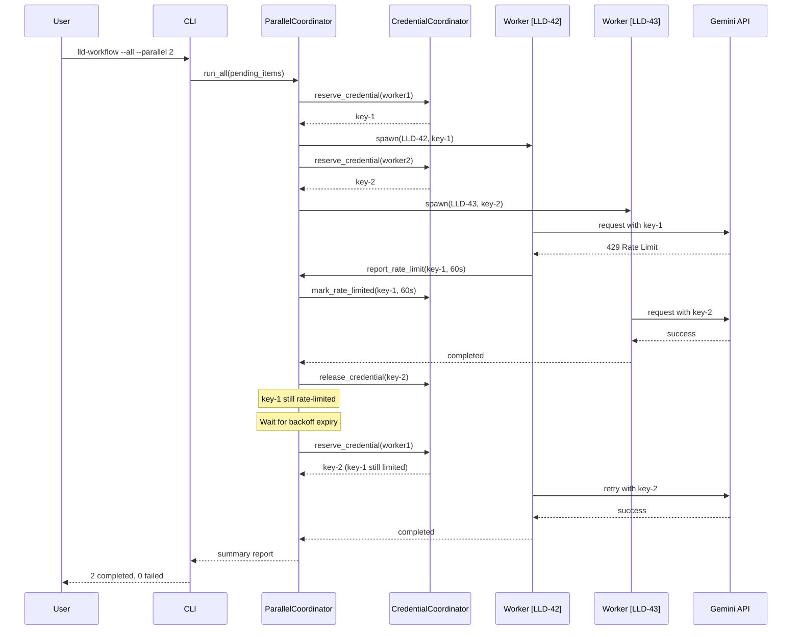

# 0XXX - Feature: Parallel Workflow Execution for LLD and Issue Processing

## 1. Context & Goal
* **Issue:** #TBD
* **Objective:** Enable concurrent execution of LLD and Issue workflows with the `--all` flag, solving SQLite contention, credential pool management, and output coordination challenges.
* **Status:** Draft
* **Related Issues:** N/A

### Open Questions
*Questions that need clarification before or during implementation. Remove when resolved.*

- [ ] Should failed workflow checkpoint databases be automatically cleaned up after a configurable retention period?
- [ ] What is the expected behavior if a user runs `--parallel 3` but only 2 items are pending?
- [ ] Should rate-limit backoff use exponential backoff or fixed intervals from retry-after headers?

## 2. Proposed Changes

*This section is the **source of truth** for implementation. Describe exactly what will be built.*

### 2.1 Files Changed

| File | Change Type | Description |
|------|-------------|-------------|
| `src/agentos/workflows/parallel_coordinator.py` | Add | New coordinator managing worker pool, progress tracking, and lifecycle |
| `src/agentos/workflows/credential_coordinator.py` | Add | Thread-safe credential reservation system with rate-limit tracking |
| `src/agentos/workflows/output_prefixer.py` | Add | Stdout/stderr wrapper with prefix injection for workflow identification |
| `src/agentos/workflows/input_sanitizer.py` | Add | Input validation utilities for path-safe identifiers |
| `src/agentos/workflows/lld_workflow.py` | Modify | Add `--parallel` and `--dry-run` flags, integrate with coordinator |
| `src/agentos/workflows/issue_workflow.py` | Modify | Add `--parallel` and `--dry-run` flags, integrate with coordinator |
| `src/agentos/workflows/checkpoint_manager.py` | Modify | Support dynamic database path via `AGENTOS_WORKFLOW_DB` env var |
| `tests/test_parallel_coordinator.py` | Add | Unit tests for coordinator logic |
| `tests/test_credential_coordinator.py` | Add | Unit tests for credential reservation and rate-limit handling |
| `tests/fixtures/mock_llm_provider.py` | Add | Mock LLM responses for offline testing |

### 2.2 Dependencies

*New packages, APIs, or services required.*

```toml
# pyproject.toml additions (if any)
# No new dependencies - uses stdlib multiprocessing and concurrent.futures
```

### 2.3 Data Structures

```python
# Pseudocode - NOT implementation
from enum import Enum
from typing import TypedDict, Optional
from datetime import datetime

class CredentialStatus(Enum):
    AVAILABLE = "available"
    RESERVED = "reserved"
    RATE_LIMITED = "rate_limited"

class CredentialState(TypedDict):
    key_id: str
    status: CredentialStatus
    reserved_by: Optional[str]  # worker_id
    rate_limit_until: Optional[datetime]
    reservation_time: Optional[datetime]

class WorkflowState(TypedDict):
    workflow_id: str  # e.g., "LLD-42" or "ISSUE-17"
    status: str  # "pending", "running", "completed", "failed", "paused"
    worker_id: Optional[str]
    started_at: Optional[datetime]
    completed_at: Optional[datetime]
    error_message: Optional[str]
    checkpoint_db_path: str

class ParallelRunConfig(TypedDict):
    max_parallelism: int  # 1-10
    dry_run: bool
    workflow_type: str  # "lld" or "issue"
    log_dir: str  # ~/.agentos/logs/parallel/{timestamp}/

class CoordinatorEvent(TypedDict):
    event_type: str  # "workflow_started", "workflow_completed", "credential_exhausted", etc.
    timestamp: datetime
    workflow_id: Optional[str]
    details: dict
```

### 2.4 Function Signatures

```python
# src/agentos/workflows/parallel_coordinator.py

class ParallelCoordinator:
    def __init__(self, config: ParallelRunConfig, credential_coordinator: CredentialCoordinator) -> None:
        """Initialize coordinator with config and credential manager."""
        ...
    
    def run_all(self, pending_items: list[str]) -> ParallelRunSummary:
        """Execute all pending items with configured parallelism. Returns summary."""
        ...
    
    def _spawn_worker(self, workflow_id: str) -> Future:
        """Spawn a subprocess worker for a single workflow."""
        ...
    
    def _handle_credential_exhaustion(self) -> None:
        """Pause all workers when credential pool exhausted."""
        ...
    
    def _handle_graceful_shutdown(self, signum: int, frame: Any) -> None:
        """Handle Ctrl+C - checkpoint all workers and exit."""
        ...
    
    def get_progress(self) -> ProgressState:
        """Return current progress for display."""
        ...


# src/agentos/workflows/credential_coordinator.py

class CredentialCoordinator:
    def __init__(self, credential_pool: CredentialPool) -> None:
        """Wrap existing credential pool with reservation semantics."""
        ...
    
    def reserve_credential(self, worker_id: str) -> Optional[str]:
        """Reserve a credential for worker. Returns key_id or None if exhausted."""
        ...
    
    def release_credential(self, worker_id: str, key_id: str) -> None:
        """Release a credential back to the pool."""
        ...
    
    def report_rate_limit(self, key_id: str, retry_after_seconds: int) -> None:
        """Mark a key as rate-limited with backoff expiry."""
        ...
    
    def get_available_count(self) -> int:
        """Return count of credentials available (not reserved, not rate-limited)."""
        ...
    
    def get_pool_status(self) -> PoolStatus:
        """Return detailed status for all credentials."""
        ...


# src/agentos/workflows/output_prefixer.py

class OutputPrefixer:
    def __init__(self, prefix: str, original_stream: TextIO) -> None:
        """Create prefixer for stdout or stderr."""
        ...
    
    def write(self, text: str) -> int:
        """Write text with prefix, handling partial lines."""
        ...
    
    def flush(self) -> None:
        """Flush the underlying stream."""
        ...


def install_prefixer(workflow_id: str) -> tuple[OutputPrefixer, OutputPrefixer]:
    """Install prefixers for stdout and stderr. Returns originals for restoration."""
    ...


# src/agentos/workflows/input_sanitizer.py

def sanitize_workflow_id(raw_id: str) -> str:
    """Sanitize workflow ID for use in file paths. Raises ValueError if invalid."""
    ...

def is_valid_workflow_id(raw_id: str) -> bool:
    """Check if workflow ID is valid (alphanumeric, underscore, hyphen only)."""
    ...
```

### 2.5 Logic Flow (Pseudocode)

```
PARALLEL COORDINATOR MAIN FLOW:
1. Parse --parallel N and --dry-run flags
2. Discover pending items (LLDs or Issues)
3. IF --dry-run THEN
   - Print list of pending items
   - Exit
4. Initialize CredentialCoordinator with existing pool
5. Initialize ParallelCoordinator with config
6. Register signal handler for SIGINT (Ctrl+C)
7. Create ProcessPoolExecutor with max_workers=N
8. WHILE pending items remain OR workers active:
   a. IF available_credentials > 0 AND pending_items > 0 AND active_workers < N:
      - Pop next pending item
      - Sanitize workflow_id (reject if invalid)
      - Create isolated checkpoint DB path
      - Reserve credential
      - Spawn worker subprocess with env vars
   b. Check for completed futures:
      - IF completed successfully: log, release credential, increment success count
      - IF failed: log error, release credential, increment failure count, retain checkpoint
   c. IF credential pool exhausted (all reserved):
      - Pause spawning, display coordinator message
      - Wait for credential release or rate-limit expiry
   d. IF rate limit reported by worker:
      - Mark key as rate-limited in coordinator
      - Redistribute work or reduce effective parallelism
   e. Update progress display
9. Cleanup successful checkpoint databases
10. Generate and display summary report
11. Return exit code based on failure count

WORKER SUBPROCESS FLOW:
1. Read AGENTOS_WORKFLOW_DB from environment
2. Install output prefixer for workflow_id
3. Initialize checkpoint manager with isolated DB path
4. Execute workflow (existing lld_workflow or issue_workflow logic)
5. ON HTTP 429:
   - Extract retry-after header
   - Report to coordinator via IPC (shared queue)
   - Wait for new credential or backoff
6. ON completion: write final checkpoint, exit 0
7. ON error: write error checkpoint, exit 1
8. ON SIGTERM: write checkpoint, exit 130

GRACEFUL SHUTDOWN FLOW:
1. SIGINT received
2. Set shutdown flag (shared memory)
3. FOR each active worker:
   - Send SIGTERM to worker subprocess
4. Wait up to 5 seconds for workers to checkpoint
5. Log final state for each workflow
6. Display shutdown summary
7. Exit with appropriate code
```

### 2.6 Technical Approach

* **Module:** `src/agentos/workflows/`
* **Pattern:** Coordinator/Worker pattern with process isolation
* **Key Decisions:**
  - **ProcessPoolExecutor over ThreadPoolExecutor:** True isolation prevents GIL contention and ensures one workflow crash doesn't affect others
  - **Environment variable for DB path:** Simple IPC mechanism, no serialization overhead
  - **Shared Queue for rate limits:** Workers report rate limits via `multiprocessing.Queue`, coordinator listens and updates state
  - **Prefix-based output:** Simpler than split-pane display, works in all terminals, preserves scrollback
  - **10-worker cap:** Prevents resource exhaustion; most systems can handle 10 subprocesses

## 3. Requirements

*What must be true when this is done. These become acceptance criteria.*

1. `lld-workflow --all --parallel 3` processes 3 LLDs concurrently
2. `issue-workflow --all --parallel` uses default parallelism of 3
3. `lld-workflow --all --dry-run` lists pending LLDs without executing
4. Each workflow uses isolated checkpoint database at `~/.agentos/checkpoints/lld_workflow_{issue_number}.db`
5. Issue numbers containing path traversal characters (e.g., `../`, `/`) are rejected with clear error
6. Console output is prefixed with workflow identifier, no interleaving of partial lines
7. Credential exhaustion (all keys reserved) pauses all workflows gracefully with coordinator message
8. HTTP 429 rate limit triggers per-key backoff without crashing workflow
9. Rate-limited keys excluded from available pool until backoff expires
10. Ctrl+C triggers graceful shutdown with checkpointing within 5 seconds
11. Failed workflows don't affect other parallel workflows
12. Summary report shows status of all workflows at completion
13. Per-workflow log files created in `~/.agentos/logs/parallel/{timestamp}/`
14. Total execution time for 6 items with `--parallel 3` is less than 50% of sequential execution time

## 4. Alternatives Considered

| Option | Pros | Cons | Decision |
|--------|------|------|----------|
| ProcessPoolExecutor | True isolation, crash protection | Higher memory per worker | **Selected** |
| ThreadPoolExecutor | Lower memory, simpler IPC | GIL contention, no crash isolation | Rejected |
| asyncio with aiofiles | Single process, efficient I/O | Complex async conversion, no isolation | Rejected |
| Redis-based coordination | Distributed-ready, robust | External dependency, overkill for single machine | Rejected |
| SQLite WAL mode with retries | Simpler, single DB | Still prone to contention under load | Rejected |

**Rationale:** ProcessPoolExecutor provides the strongest isolation guarantees. Each workflow is truly independent - a crash, memory leak, or hanging subprocess doesn't affect others. The memory overhead (~50-100MB per worker) is acceptable for N≤10.

## 5. Data & Fixtures

*Per [0108-lld-pre-implementation-review.md](0108-lld-pre-implementation-review.md) - complete this section BEFORE implementation.*

### 5.1 Data Sources

| Attribute | Value |
|-----------|-------|
| Source | Local filesystem (LLD specs, Issue data from GitHub API cache) |
| Format | YAML (LLD specs), JSON (cached issue data) |
| Size | ~10-50 items typical, max ~100 concurrent |
| Refresh | On-demand via `--all` flag |
| Copyright/License | N/A (user-generated content) |

### 5.2 Data Pipeline

```
Pending Items ──discover──► ParallelCoordinator ──spawn──► Worker Subprocesses
                                    │                            │
                                    ▼                            ▼
                            CredentialPool ◄──reserve/release──► Checkpoint DB
                                    │                            │
                                    ▼                            ▼
                            Progress Queue ◄──status updates───► Log Files
```

### 5.3 Test Fixtures

| Fixture | Source | Notes |
|---------|--------|-------|
| Mock LLD specs (5x) | Generated | Synthetic specs with varying complexity |
| Mock issue data (5x) | Generated | Synthetic issues with different states |
| Mock LLM responses | Hardcoded | Deterministic responses for each workflow step |
| Mock credential pool | Generated | Configurable pool size for testing exhaustion |

### 5.4 Deployment Pipeline

Local development → Integration tests with mocked LLM → Live testing with real credentials → Production use

**If data source is external:** No separate utility needed; existing discovery mechanisms are reused.

## 6. Diagram

### 6.1 Mermaid Quality Gate

Before finalizing any diagram, verify in [Mermaid Live Editor](https://mermaid.live) or GitHub preview:

- [x] **Simplicity:** Similar components collapsed (per 0006 §8.1)
- [x] **No touching:** All elements have visual separation (per 0006 §8.2)
- [x] **No hidden lines:** All arrows fully visible (per 0006 §8.3)
- [x] **Readable:** Labels not truncated, flow direction clear
- [ ] **Auto-inspected:** Agent rendered via mermaid.ink and viewed (per 0006 §8.5)

**Auto-Inspection Results:**
```
- Touching elements: [ ] None / [ ] Found: ___
- Hidden lines: [ ] None / [ ] Found: ___
- Label readability: [ ] Pass / [ ] Issue: ___
- Flow clarity: [ ] Clear / [ ] Issue: ___
```

*Reference: [0006-mermaid-diagrams.md](0006-mermaid-diagrams.md)*

### 6.2 Diagram



## 7. Security Considerations

| Concern | Mitigation | Status |
|---------|------------|--------|
| Path traversal in workflow ID | Sanitize to alphanumeric only via `input_sanitizer.py` | Addressed |
| Credential exposure in logs | Credentials never logged; only key IDs used in logging | Addressed |
| Subprocess command injection | Workflow IDs validated before use in paths/commands | Addressed |
| Log file content exposure | Logs have same permissions as current workflow logs | Addressed |
| Checkpoint database tampering | Databases stored in user's home directory with standard permissions | Addressed |

**Fail Mode:** Fail Closed - Invalid workflow IDs rejected with error; no processing occurs for invalid input.

## 8. Performance Considerations

| Metric | Budget | Approach |
|--------|--------|----------|
| Parallelism overhead | < 15% of sequential time | Minimal coordination, async progress updates |
| Memory per worker | < 100MB | Process isolation, no shared state in memory |
| Startup latency | < 2s for all workers | Lazy credential reservation, parallel spawning |
| Shutdown time | < 5s | SIGTERM with timeout, forced kill if needed |

**Bottlenecks:**
- Credential pool size may limit effective parallelism
- Rate limits reduce throughput unpredictably
- Slow Gemini API responses are the primary time sink (not coordination)

## 9. Risks & Mitigations

| Risk | Impact | Likelihood | Mitigation |
|------|--------|------------|------------|
| All credentials rate-limited simultaneously | High | Medium | Graceful pause, clear user messaging, resume from checkpoint |
| Worker subprocess hangs indefinitely | Medium | Low | Timeout per workflow, coordinator-level watchdog |
| Checkpoint database corruption | Medium | Low | SQLite PRAGMA integrity_check on resume, option to reset |
| Output interleaving despite prefixer | Low | Medium | Line buffering, atomic writes, worst case is cosmetic |
| Memory exhaustion with N=10 | High | Low | Cap at 10, document resource requirements |

## 10. Verification & Testing

*Ref: [0005-testing-strategy-and-protocols.md](0005-testing-strategy-and-protocols.md)*

**Testing Philosophy:** Strive for 100% automated test coverage. Manual tests are a last resort for scenarios that genuinely cannot be automated.

### 10.1 Test Scenarios

| ID | Scenario | Type | Input | Expected Output | Pass Criteria |
|----|----------|------|-------|-----------------|---------------|
| 010 | Happy path - 3 LLDs parallel | Auto | 3 mock LLDs, --parallel 3 | All 3 complete | 3 success in summary |
| 020 | Dry run lists items | Auto | 5 mock LLDs, --dry-run | List of 5 items | No processing, correct list |
| 030 | Default parallelism is 3 | Auto | --parallel (no N) | 3 workers spawned | Worker count = 3 |
| 040 | Path traversal rejected | Auto | ID = "../../../etc/passwd" | ValueError raised | Clear error message |
| 050 | Credential exhaustion pauses | Auto | 2 credentials, 3 workers | Pause message shown | 3rd worker waits |
| 060 | Rate limit triggers backoff | Auto | Simulated 429 response | Key marked limited | Worker retries with different key |
| 070 | Single workflow failure isolated | Auto | 1 invalid spec, 2 valid | 2 success, 1 failed | Other workflows unaffected |
| 080 | Graceful shutdown checkpoints | Auto | SIGINT during run | Checkpoint files exist | All workers saved state |
| 090 | Output prefixing correct | Auto | 2 concurrent workflows | All lines prefixed | No unprefixed lines |
| 100 | Per-workflow log files created | Auto | 3 LLDs | 3 log files in logs/parallel/ | Files exist and non-empty |
| 110 | Checkpoint cleanup on success | Auto | 3 successful LLDs | No checkpoint DBs remain | DBs deleted post-run |
| 120 | Failed checkpoint retained | Auto | 1 failed LLD | Checkpoint DB exists | DB present for debugging |
| 130 | Performance benchmark | Auto | 6 LLDs, --parallel 3 | < 50% of sequential time | Time comparison passes |

### 10.2 Test Commands

```bash
# Run all automated tests
poetry run pytest tests/test_parallel_coordinator.py tests/test_credential_coordinator.py -v

# Run only fast/mocked tests (exclude live)
poetry run pytest tests/test_parallel_coordinator.py -v -m "not live"

# Run live integration tests
poetry run pytest tests/test_parallel_coordinator.py -v -m live

# Run performance benchmark
poetry run pytest tests/test_parallel_coordinator.py::test_performance_benchmark -v
```

### 10.3 Manual Tests (Only If Unavoidable)

**N/A - All scenarios automated.** 

The graceful shutdown test (080) uses `signal.SIGINT` programmatically. Output prefixing is verified by capturing stdout in tests.

## 11. Definition of Done

### Code
- [ ] `parallel_coordinator.py` implemented and linted
- [ ] `credential_coordinator.py` implemented and linted
- [ ] `output_prefixer.py` implemented and linted
- [ ] `input_sanitizer.py` implemented and linted
- [ ] `lld_workflow.py` modified with `--parallel` and `--dry-run` flags
- [ ] `issue_workflow.py` modified with `--parallel` and `--dry-run` flags
- [ ] `checkpoint_manager.py` supports `AGENTOS_WORKFLOW_DB` env var
- [ ] Code comments reference this LLD

### Tests
- [ ] All 13 test scenarios pass
- [ ] Mock LLM provider fixtures working
- [ ] Performance benchmark passes (< 50% of sequential)

### Documentation
- [ ] LLD updated with any deviations
- [ ] Implementation Report (0103) completed
- [ ] Test Report (0113) completed
- [ ] Wiki pages updated for lld-workflow and issue-workflow
- [ ] README.md updated with parallel execution examples
- [ ] ADR created for parallel execution architecture
- [ ] Files added to `docs/0003-file-inventory.md`

### Review
- [ ] Code review completed
- [ ] 0809 Security Audit - PASS
- [ ] 0817 Wiki Alignment Audit - PASS
- [ ] User approval before closing issue

---

## Appendix: Review Log

*Track all review feedback with timestamps and implementation status.*

### Gemini Review #1 (PENDING)

**Timestamp:** TBD
**Reviewer:** Gemini
**Verdict:** PENDING

#### Comments

| ID | Comment | Implemented? |
|----|---------|--------------|
| G1.1 | TBD | PENDING |

### Review Summary

| Review | Date | Verdict | Key Issue |
|--------|------|---------|-----------|
| - | - | - | Awaiting initial review |

**Final Status:** PENDING